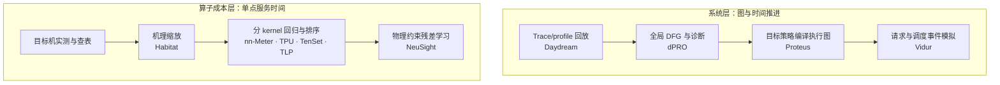
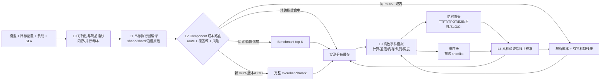
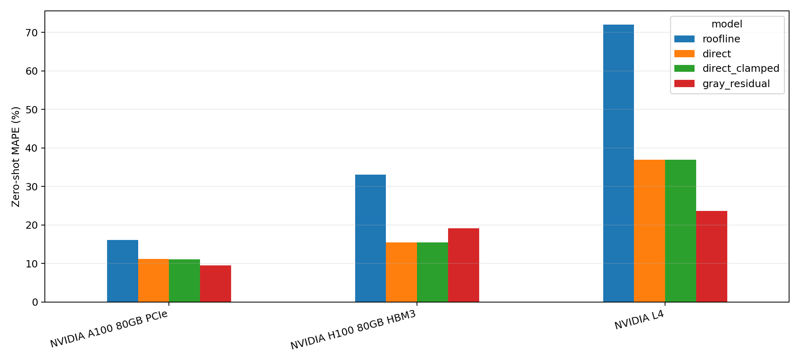
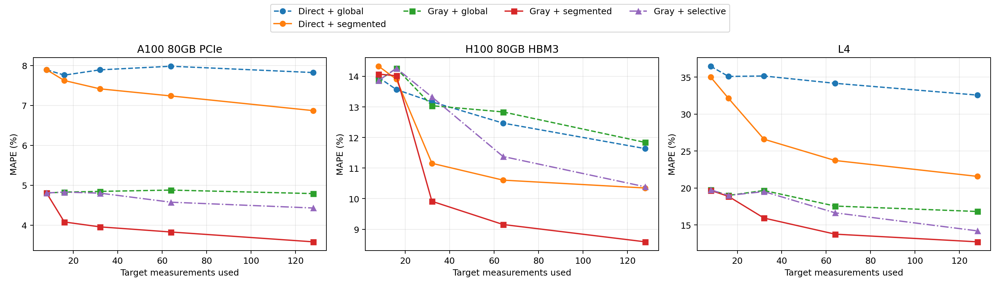

# DNN 性能预测统一调研与实验报告

调研与实验日期：2026-08-10  
状态：两阶段已整合；当前结论用于方案筛选，下一轮需以业务真实数据做预注册验证。

阶段快照保留在[第一阶段归档](phase1_archive.md)和[第二阶段归档](phase2_archive.md)。本文件是后续评审、实验与落地的唯一主入口；复现命令统一收录在[实验说明](experiments/README.md)。

## 结论先行

两阶段证据支持继续推进灰盒路线，但最终方案不应只是“Roofline + 一个回归器”，而应明确为：

> **Route-aware component model + bounded mechanism residual + risk-gated segmented calibration + exact measurement cache**

核心判断如下：

1. DNN 性能预测不是一条严格的“硬编码 → 纯拟合 → 灰盒”替代链。**本文按两条并行轴整理**：系统层从 trace replay 走向执行图编译和事件模拟；算子成本层从实测查表、缩放和直接拟合走向机制约束残差学习。
2. 本文从所引工业系统归纳出解析约束、目标机实测、版本化缓存、局部模型、事件模拟和反馈控制等互补能力；单一系统通常只覆盖其中一部分。在所引 autotune 和配置搜索系统中，ML/heuristic 的主要价值是减少候选实测数量，而不是取消实测。
3. WSL 中重跑 NeuSight 官方 GPT-3/H100 artifact 得到 0.688% APE，而本文在同 opgraph 上构造的纯 Roofline baseline APE 为 31.264%；该单例支持“乐观解析 floor + 学习利用率”。
4. NeuSight 作者发布的 FP32 Linear/GEMM 真实 GPU microbenchmark 数据中，在目标设备隔离且 exact shape 不重叠的实验上，灰盒零样本在 A100-80GB、L4 上优于直接拟合，但在 H100 上反而更差。该反例支持把 unseen route 纳入 OOD 高风险条件并触发按需实测；策略收益仍需 G3 端到端实验验证。
5. 从作者发布的每个目标 GPU 测量集中选取 32 条带标签样本后，按 kernel family、compute/memory regime、wave 分段校准，相对单一全局校准将 A100/H100/L4 的 MAPE 分别再降低约 18.3%、24.0%、19.0%；但固定统计门控在高预算时过于保守，门槛仍需在源域预注册。
6. 当前实验仍是发布 artifact 和 post-kernel component cost 验证，不是本机新 GPU ground truth、pre-kernel tactic 预测或端到端训练/推理容量证明。

## 1. 问题边界与统一评价标准

需要回答的不是单一“模型要跑多久”，而是四类不同问题：

| 决策层级 | 典型问题 | 应输出的量 | 不能遗漏的机制 |
| --- | --- | --- | --- |
| Kernel/component | 指定 shape、route、设备上的成本 | latency 分布、利用率、上下界 | tactic、tile、wave、cache、launch、dtype/layout |
| 编译/并行策略 | 哪个 fusion、tile、DP/TP/PP 策略更好 | 排序、top-k、绝对成本 | 目标执行图、shape/shard、通信原语 |
| 请求/服务 | TTFT、TPOT、E2E、吞吐是否满足 SLA | P50/P95/P99、SLO pass/fail | batch、队列、KV cache、抢占、并发流 |
| 容量与成本 | 需要多少卡、采用哪种实例 | 吞吐、利用率、成本和置信区间 | 拓扑、带宽共享、流量分布、在线漂移 |

因此评估目标必须与任务匹配：搜索和 autotune 重点看 top-k recall、Spearman/Kendall 和 regret；容量规划与 SLA 必须看校准后的绝对值、P95 APE、WAPE、underprediction tail 和置信区间覆盖率。

## 2. 研究脉络与论文口径核对

### 2.1 两条演进轴



两轴在概念上通过 component 成本接口组合；图中的横向演进不表示这些论文之间存在直接实现依赖。在本文考察的代表系统中，纯拟合没有形成独立、全面替代解析与实测的阶段：Habitat 已先区分可缩放和会切换算法的 kernel；nn-Meter 先探测 fusion 和真实 kernel 再回归；TPU/TenSet/TLP 主要服务候选排序；dPRO、Proteus、Vidur 始终保留显式依赖、通信和调度状态。

### 2.2 代表路线、效果与边界

| 路线与论文 | 最适合回答 | 经核对的代表结果 | 关键边界 |
| --- | --- | --- | --- |
| Profile/replay：[Daydream](https://www.usenix.org/conference/atc20/presentation/zhu-hongyu) | 已观测配置上的优化 what-if | BERT-large AMP、融合案例误差分别 `<3%`、`<7%`；正文跨模型约在 13% 内 | `73.8%` 来自 [dPRO 后测](https://proceedings.mlsys.org/paper_files/paper/2022/file/b422680f3db0986ddd7f8f126baaf0fa-Paper.pdf)，不是 Daydream 原文；不能生成任意新 TP/PP 图或新 kernel 成本 |
| 机理缩放：[Habitat](https://www.usenix.org/system/files/atc21-yu.pdf) | kernel 实现不变时跨 GPU 选型 | 6 GPU、5 模型平均误差 11.8% | 数百百分比误差来自 [NeuSight 后测](https://doi.org/10.1145/3669940.3707265)；其 OOD-GPU 平均 724.3%、最大 4529.9%，不是 Habitat 原文；不建模分布式通信 |
| 融合感知回归：[nn-Meter](https://doi.org/10.1145/3458864.3467882) | 移动/边缘推理和硬件感知 NAS | ±10% 内：移动 CPU 99.0%、移动 GPU 99.1%，VPU 83.4% | 仅推理；设备变化需重建；不覆盖服务器多流并发 |
| 全局 DFG：[dPRO](https://proceedings.mlsys.org/paper_files/paper/2022/file/b422680f3db0986ddd7f8f126baaf0fa-Paper.pdf) | 分布式诊断与组合优化 | 多数误差 `<5%`，组合优化最高 3.48× | 不是串行模型，但实证集中在 DP、PS、AllReduce；需目标集群 trace |
| 策略编译与模拟：[Proteus](https://arxiv.org/abs/2306.02267) | DP/TP/PP 组合策略选择 | 180 个结果平均误差 3.0%、最大 14.7%，另有 2 个 OOM 误判 | 计算 op 和重叠系数仍需 profiling；排序只在小组 GPT-2 策略上验证 |
| Profiling + 插值 + 事件模拟：[Vidur](https://www.microsoft.com/en-us/research/wp-content/uploads/2024/05/vidur_mlsys24.pdf) | LLM 推理部署搜索和容量规划 | 作者 PDF 的 request latency 为 `<9%`；[proceedings 页面](https://proceedings.mlsys.org/paper_files/paper/2024/hash/b74a8de47d2b3c928360e0a011f48351-Abstract-Conference.html)摘要写 `<5%` | 42K GPU h → 1 CPU h 仅是特定 LLaMA2-70B 案例；不覆盖训练 |
| Tile/wave 灰盒：[NeuSight](https://doi.org/10.1145/3669940.3707265) | 新 GPU/新模型的 component 外推 | GPT-3/H100 单例 121.4% → 2.3%；整体推理/训练 9.7%/7.3%，OOD-GPU 平均 8.1% | 单例不能代表整体；依赖 tile/grid/route，且全新架构仍需实测 |
| 编译器图模型：[TPU cost model](https://research.google/pubs/a-learned-performance-model-for-tensor-processing-units/) | tile/fusion/autotuning 决策 | 随机 tile split 3.7% vs 解析 6.1% | manual OOD split 中 learned 6.3% 反而差于解析 2.3%；未证明 v2→v3 零样本迁移 |
| 调度序列迁移：[TLP/MTL-TLP](https://doi.org/10.1145/3575693.3575737) | TVM tensor program 搜索 | 达到同等候选质量的搜索加速 9.1×/3.0%；7% 目标数据时 4.7×/2.9× | 倍数不是绝对时延精度；仍需目标域标注数据 |
| 候选排序：[Ansor](https://www.usenix.org/conference/osdi20/presentation/zheng) / [TenSet](https://datasets-benchmarks-proceedings.neurips.cc/paper/2021/hash/a684eceee76fc522773286a895bc8436-Abstract-round1.html) | 编译候选相对排序 | TenSet 总体上 MLP + ranking 表现最好 | Ansor 原始模型并非 RankLoss；排序分数未校准，不能直接用于 SLA |

## 3. 业界落地模式

### 3.1 互补能力栈

下表是本文根据所引工业系统归纳的生产模式，不是某一家厂商定义的统一标准。

| 层 | 代表实现 | 做法 | 工程约束 |
| --- | --- | --- | --- |
| 解析约束与合法性 | vLLM、SGLang、DeepSpeed、Nsight Roofline | 内存、KV block、并行合法性、FLOPs/bytes、保守上下界 | 适合筛除不可行点，不能代表实际 tactic |
| Component 机制模型 | OpenXLA GPU model、nvMatmulHeuristics | 建模 launch、tile、wave、cache-fit、带宽和重叠，产生 shortlist | route 或架构变化时解析参数也会失效 |
| 目标机实测与缓存 | TensorRT、CUTLASS、Triton、XLA persisted autotuning、TorchInductor | benchmark kernel/tactic，按完整指纹缓存 winner | cache key、版本兼容与失效策略比回归器形式更重要 |
| 系统事件模拟 | Vidur、NVIDIA DynoSim/Mocker | 合成 batch、KV、网络、抢占、PD worker 和请求生命周期 | simulator 必须与真实 scheduler/runtime 同步 |
| Profile-guided 重编译 | JAX PGLE | 采集真实 compute/collective 时间后重新编译调度 | profile 与目标 workload、编译版本绑定 |
| 在线规划与控制 | NVIDIA Dynamo Planner | 使用 traffic 与 forward-pass observation 做部署决策 | 冷启动、观测延迟、重尾流量和控制振荡 |
| 真实 endpoint 配置评测 | SageMaker Inference Recommender、Triton Model Analyzer | 在指定真实负载下评测实例、batch、并发和成本 | 是部署前/按需评测，不等同于在线反馈控制 |

### 3.2 Component 模型和实测裁决

- [Nsight Compute Rooflines](https://docs.nvidia.com/nsight-compute/NsightCompute/index.html) 提供 L1、L2、device-memory throughput ceilings。层级 Roofline 用于约束与瓶颈归因，不应把各层理论时间机械相加。
- [OpenXLA GPU performance model](https://github.com/openxla/xla/blob/main/xla/service/gpu/model/gpu_performance_model.cc) 估算 FLOPs、读写字节和 launch dimensions；[基础实现](https://github.com/openxla/xla/blob/main/xla/service/gpu/model/gpu_performance_model_base.cc) 再用 coalescing、低并行度带宽上限和 L1/L2 cache-fit/speedup heuristic 修正成本，并组合 compute-memory overlap。实现中的经验常量或配置项可作为我们的候选校准参数，这是工程推论而非 OpenXLA 的精度承诺。
- [nvMatmulHeuristics](https://docs.nvidia.com/cuda/nvidia-matmul-heuristics/index.html) 用解析 heuristic 预测 top-N 配置和 runtime，再在 Discovery 中接收少量实测；其 [API](https://docs.nvidia.com/cuda/nvidia-matmul-heuristics/api.html) 显式暴露 CTA/warp/instruction tile、stage、cluster、split-K 和资源变量。
- [OpenXLA LHS](https://openxla.org/xla/lhs_cost_model) 对 GEMM 和 ICI collective 使用实测表与插值，对 DCN collective 使用包含 launch overhead、RTT、NIC speed 的解析 S-curve；[JAX PGLE](https://docs.jax.dev/en/latest/gpu_performance_tips.html) 再把真实 compute/collective 时间反馈给调度器。

目标机裁决同样是主流路径：

- [CUTLASS metadata](https://docs.nvidia.com/cutlass/4.6.0/media/docs/operators/api_reference/metadata.html) 暴露 MMA、tile、cluster、stage、scheduler、alignment 等 route 身份，[Profiler](https://docs.nvidia.com/cutlass/4.6.0/media/docs/cpp/profiler.html) 对候选执行真实测量；**本文据此**将这些字段纳入保守缓存指纹，而不是只使用 M/N/K。
- [TensorRT dynamic shapes](https://docs.nvidia.com/deeplearning/tensorrt/latest/inference-library/dynamic-shapes-basics.html) 用可重叠 optimization profile 定义 shape 范围和 opt 调优点；[ITimingCache](https://docs.nvidia.com/deeplearning/tensorrt/latest/_static/c-api/classnvinfer1_1_1_i_timing_cache.html) 对 TensorRT 版本和设备兼容性有明确约束。本方案进一步把 CUDA 与影响 tactic 的 BuilderConfig 纳入保守缓存指纹。
- [Triton autotune](https://triton-lang.org/main/python-api/generated/triton.autotune.html) 由 `configs` 声明候选，由 `key` 决定何时重新评测；影响最优配置的 shape、stride 或 alignment 若未进入 key，可能复用不合适的赢家。
- AMD [hipBLASLt offline tuning](https://rocm.docs.amd.com/projects/hipBLASLt/en/latest/how-to/how-to-use-hipblaslt-offline-tuning.html) 也围绕完整 problem、workspace、solution 和库/设备兼容性做实测缓存，并提供 [hardware predicates](https://rocm.docs.amd.com/projects/hipBLASLt/en/develop/conceptual/pci-chip-id-predicates-walkthrough.html)。
- [XLA persisted autotuning](https://openxla.org/xla/persisted_autotuning) 将目标机实测结果持久化，并把缓存失效和 XLA 版本隔离交给部署方；[TorchInductor 的工程流程](https://pytorch.org/blog/gemms-torchinductor-cutedsl-backend/) 也采用兼容性过滤 → heuristic shortlist → 目标硬件 benchmark → 缓存赢家。

Component timing 与系统模拟应分离。[DynoSim](https://docs.nvidia.com/dynamo/latest/user-guides/dynosim) 将 timing source 与 Mocker 的 batching、KV、prefix cache、preemption 和请求生命周期分开；[Dynamo Planner](https://docs.nvidia.com/dynamo/dev/knowledge-base/modular-components/planner/planner-design) 再使用真实 traffic 与 forward-pass observation 做在线决策。

## 4. 统一灰盒架构



### 4.1 Component 时间结构

对于已知执行路径 (r)，建议使用：

\[
\hat T_r = T_{launch,r}+T_{tail/wave,r}+
\Phi\left(
\frac{T_{TC}}{\eta_{TC,r}},
\frac{T_{SIMT}}{\eta_{SIMT,r}},
\frac{T_{HBM}}{\eta_{HBM,r}},
\frac{T_{L2}}{\eta_{L2,r}},
\frac{T_{SMEM}}{\eta_{SMEM,r}};\rho_r
\right)+T_{aux}
\]

在拟议的完整实现中，FLOPs、逻辑/对齐 shape、各级流量、grid、wave 和资源约束由解析层计算；ML 只学习有界利用率 \(\eta\)、重叠 \(\rho\)、launch 和尾波残差。离散的 backend、tactic、dtype、layout、fusion、tile、scheduler 先分类或由编译器提供，不能跨路径平滑外推。本轮实验只实现了逻辑字节、简化 Roofline 和 post-kernel grid/tile/wave，完整分层模型尚待验证。

### 4.2 L2 内部的四级成本子路由

| 级别 | 判定 | 行为 |
| --- | --- | --- |
| R0 精确命中 | 完整硬件/软件/route/shape 指纹一致 | 返回历史实测分布，不运行模型 |
| R1 域内灰盒 | 同 route、同机制区间，连续特征在支持域 | 解析成本 + 有界利用率/残差 + 区间校准 |
| R2 边界点 | 接近 tactic、wave、cache、ridge 或 SLA 边界 | benchmark top-K，回填实测缓存 |
| R3 OOD | 新 kernel/tactic、硬件、库版本、fusion 或拓扑 | 完整 microbenchmark；测量前只给保守值并标为低可信 |

缓存指纹至少包含：

`语义算子 + raw/effective/padded/storage shape + dtype + layout + stride/alignment + shard + kernel/backend/tactic + fusion/graph bucket + GPU/NPU/SM/MIG + 驱动/运行时/编译器/库版本 + workspace + 拓扑 + 并发上下文`。

数据存储分为三层：

1. `raw_observation`：不可变原始重复测量，保留 p50/p95/std、warmup、冷热缓存、时钟、温度和功耗。
2. `exact_winner`：完整指纹到 kernel/tactic 及实测分布。
3. `segment_model`：route/regime 到利用率、重叠、残差模型、支持域和不确定性。

## 5. 统一实验设计

### 5.1 复现等级

| 等级 | 含义 | 本轮覆盖 |
| --- | --- | --- |
| 链路冒烟 | 官方代码可加载发布数据并产生输出 | Vidur、nn-Meter、NeuSight BMM 训练入口 |
| Artifact 对齐 | 在作者发布的 profile、权重、标签上核对输出 | NeuSight GPT-3/H100 单例 |
| 公开实测数据实验 | 固定划分，在公开真实测量上做新对照 | Docker 灰盒 OOD 与校准实验 |
| 论文/业务复现 | 在目标硬件重新采集 ground truth 并验证端到端 | 尚未完成；当前没有 NVIDIA/NPU 目标集群 |

### 5.2 环境与源码版本

| 环境/仓库 | 固定版本 | 用途 |
| --- | --- | --- |
| Windows 主机 | Intel Core i7-14700、约 34 GB RAM、无 NVIDIA GPU/CUDA | 文件编排、Vidur/nn-Meter、Docker Desktop |
| WSL2 | Ubuntu 22.04.5、Python 3.10.12、PyTorch 2.1.0+cpu | NeuSight 官方 artifact 与训练链路 |
| Docker | Desktop 4.85、Engine 29.6.2、Linux amd64 | 固定 sklearn 灰盒实验 |
| Vidur | `microsoft/vidur@8383d2935bc62723a212090baa9f98ada206fc14` | 请求级事件模拟 |
| nn-Meter | `microsoft/nn-Meter@cd8dab49b735d58d03746141f73ef5934559ae68` | 预训练 kernel/fusion 预测器 |
| NeuSight | `scai-tech/NeuSight@6945927d9afcca2b9daf021f8395e53edc5b4eef` | artifact、公开测量数据与灰盒对照 |

### 5.3 灰盒对照与防泄漏

第二阶段使用 NeuSight 发布的 NVIDIA FP32 Linear/GEMM 数据：

- 源域训练 32,224 条：P100、P4、T4、V100、A100-40GB。
- 目标评测：A100-80GB、H100、L4 各 1,040 条。
- 目标 `(B,M,N,K)` 与源域精确重叠为 0。
- 校准预算为 8/16/32/64/128 条、每项 10 个 seed，共 1,800 组运行。校准行通过固定 seed 选取，并从评估行中严格删除；所有运行满足 `n_eval = 1040 - budget`。
- 使用 kernel name、grid、block、tile、wave 等 compiler/profiler 可见字段，因此属于 post-kernel component cost，不预测 tactic selection。

统一对照定义：

| 编号 | 模型 |
| --- | --- |
| A0 | 在 FLOPs、逻辑流量与峰值假设下得到的乐观 component Roofline floor |
| A1 | 相同特征上的全局 `log(latency)` 回归 |
| G1 | route + 乐观解析 floor + 有界 slowdown/residual |
| G2 | G1 + kernel family/regime/wave 分段校准与层级回退 |
| G3 | G2 + OOD 拒绝 + exact cache + microbenchmark fallback |

主指标为 device×component 等权 MAPE、P95 APE、WAPE 和 underprediction tail；策略搜索另报 top-k/regret；未来确认性实验必须使用 shape-cluster bootstrap 置信区间。

## 6. 第一阶段实验：系统链路与预训练预测器

### 6.1 Vidur CPU-only 事件模拟

使用作者发布的 LLaMA-2-7B/A100 compute 与 network profile，对相同请求流运行 TP=1 和 TP=2：16 个请求、2 QPS、256 prefill + 32 decode、Sarathi、batch cap 64、chunk 128。为快速冒烟，RF 使用 2-fold、50 trees、depth 8，并非论文默认大实验。

| 指标 | TP=1 | TP=2 |
| --- | ---: | ---: |
| TTFT mean / P95 | 38.41 / 53.82 ms | 37.76 / 53.99 ms |
| E2E mean / P95 | 346.44 / 367.52 ms | 355.13 / 375.65 ms |
| Scheduling delay mean / P95 | 4.84 / 15.29 ms | 4.01 / 15.44 ms |
| 调度 batch events | 319 | 316 |
| 模拟结束时间 | 5.3334 s | 5.3437 s |
| 近似 output-token throughput | 96.00 tok/s | 95.81 tok/s |

该小负载中 TP=2 平均 E2E 高约 2.5%，说明发布模型确实将 all-reduce/launch 计入事件链；它不能外推为 TP=2 普遍更慢，也不能验证论文 `<9%`，因为没有 A100 真机 ground truth。

### 6.2 nn-Meter 预训练 kernel 预测器

官方 MobileNetV3-Small IR 和 `cortexA76cpu_tflite21 v1.0` 预测器输出：

```text
[RESULT] predict latency for mobilenetv3small_0.json: 12.558942703135 ms
```

运行加载 16 个 kernel/fusion predictor；首次获取设备预测器约 376 MB，验证了 IR → kernel/fusion 识别 → 分 kernel 回归 → 求和链路。官方 pickle 来自 scikit-learn 0.23.1；兼容环境固定为 Python 3.11.15、numpy 1.26.4、scipy 1.11.4、pandas 2.1.4、scikit-learn 1.2.2、setuptools 80.10.2，仍有跨版本告警。因此模型制品必须带依赖 lock、设备/运行时/fusion 指纹及升级转换流程。本机没有 Cortex-A76，12.5589 ms 只证明链路可运行。

第一阶段还有两个复现工程缺口：Vidur 没有完整环境 lock，当前 editable 安装依赖重跑脚本先进入仓库目录；nn-Meter 的设备预测器位于 workspace 外的用户缓存，且本轮没有单独保存原始 CLI 日志。既有数字已写入汇总表，但跨机器重建仍需补强。

## 7. 第二阶段实验：NeuSight 与分段校准

### 7.1 NeuSight 官方 artifact

WSL2 Ubuntu 22.04.5、Python 3.10.12、PyTorch 2.1.0+cpu 中，使用发布的 GPT-3 2.7B opgraph、H100 配置和 MLP_WAVE 权重，配置为 sequence 2048、batch 2、inference：

| 项目 | 结果 |
| --- | ---: |
| 官方实测标签 | 666.458325 ms |
| 本次 NeuSight 预测 | 671.045786 ms |
| 作者发布预测 | 671.045774 ms |
| 本次与发布预测差 | 0.0000126 ms |
| NeuSight APE | **0.688334%** |
| 本文构造的同 opgraph 纯 Roofline baseline | 458.099166 ms |
| Roofline APE | **31.263644%** |
| NeuSight 首次 wall / peak RSS | 23.52 s / 645,584 KiB |

CPU 环境通过实验目录中的 shim 占位未使用的 CUDA Event、将 `set_device` 设为 no-op 并重定向 home cache；未修改公式、权重、opgraph、标签或 upstream。额外跑通 BMM 一轮训练，loss 0.1739、validation mean relative error 23.2%、wall 21.99 s，只用于验证训练链路，不代表收敛精度。23.52 s 是包含 tile-table cache 构建的首次 wall time，原始 `/usr/bin/time -v` 文本没有单独落盘，暖缓存重跑时间会不同。

### 7.2 目标设备隔离且 exact shape 不重叠的零样本结果

| 目标 GPU | 纯 Roofline MAPE | 直接拟合 MAPE | 灰盒残差 MAPE | 灰盒相对直接拟合 |
| --- | ---: | ---: | ---: | ---: |
| A100 80GB PCIe | 16.14% | 11.18% | **9.49%** | 改善约 15.1% |
| H100 80GB HBM3 | 33.07% | **15.45%** | 19.14% | **恶化约 23.9%** |
| L4 | 71.99% | 37.00% | **23.69%** | 改善约 36.0% |



三个 GPU 上纯 Roofline 都不足以作为最终预测器。H100 有 1,002/1,040 条属于源域完全没有的 XMMA family，exact kernel 也全部未见；该现象与误差恶化高度一致，但尚需 route 消融确认因果。当前建议默认将这类新 tactic 路由到实测，并在 G3 实验后再固化拒绝阈值。

### 7.3 目标实测分段校准

下表为均匀覆盖无标签 `fine_segment` 的 transductive 采样：从作者发布的每个目标 GPU 测量集中选择 32 条带标签样本校准，再在剩余行上评估；数值是 10-seed 平均，并非本机重新执行 32 次 GPU 测量：

| GPU | 灰盒零样本 | 全局校准 MAPE / P95 | 始终分段 MAPE / P95 | 统计门控选择性 MAPE / P95 |
| --- | ---: | ---: | ---: | ---: |
| A100 80GB | 9.49% | 4.84% / 13.24% | **3.96% / 11.35%** | 4.80% / 13.19% |
| H100 | 19.14% | 13.04% / 28.53% | **9.91% / 24.29%** | 13.32% / 28.56% |
| L4 | 23.69% | 19.66% / 51.01% | **15.93% / 35.78%** | 19.51% / 51.50% |



128 条测量时，始终分段 MAPE 进一步达到 A100 3.58%、H100 8.59%、L4 12.72%；统计门控则为 4.43%、10.39%、14.20%，说明当前固定门槛偏保守。16 条低预算时，H100 P95 从 30.13% 恶化到 30.41%，L4 从 48.07% 恶化到 48.92%；选择性门控退回全局值，体现了尾部保护价值。32 条时，均匀覆盖在 L4 上为 15.93%，优于随机采样的 17.64%；H100 上却为 9.91%，略差于随机采样的 9.33%，所以主动采样还需兼顾 route 边界和 workload 频率。

### 7.4 实验限制

- 仅覆盖 FP32 Linear/GEMM，未覆盖 FP16/BF16、conv、attention、fusion、collective、MoE 或系统调度。
- 公开数据采用 25 次计时后取最快 5 次均值，没有方差、温度、功耗、时钟和缓存冷热信息，更接近 best-case kernel latency。
- `Kernel Name/Grid/Block` 是 tactic 选择后的字段；部署前不可见时需另做 route classifier，未知 route 直接实测。
- `coverage` 使用完整目标候选池的无标签 segment，属于 transductive active sampling；在线未知请求场景可能偏乐观。
- `calibration_runs.csv` 未保存逐行预测和校准 row-ID，当前可依靠固定数据、脚本和 seed 重建；正式实验应保存选择集 manifest。
- 本实验只使用简化 Roofline、逻辑字节和 post-kernel grid/tile/wave；完整的 L1/L2/HBM/SMEM 分层流量模型仍是拟议架构，不是本轮已验证能力。
- 数据发布实现存在 GB/GiB 混用口径；本实验预先统一为 SI GB/s，没有根据目标结果择优选单位。
- 统计门控在 pilot 后加入，本轮属于探索性筛选；10 个 seed 衡量的是采样集合敏感性，不是独立 GPU 重复测量，也没有确认性置信区间。
- G3 的 OOD gate、exact-cache 和自动 microbenchmark fallback 仍是下一阶段设计；本轮反例只暴露了强制预测的风险并支持采用保守拒绝策略，尚未验证 G3 的端到端效果。
- 当前没有本机 NVIDIA GPU，无法重新验证公开 CSV 的测量噪声和软件版本漂移。

## 8. 两阶段综合判断

| 假设 | 当前证据 | 决策 |
| --- | --- | --- |
| 纯 Roofline 可直接承担绝对时延预测 | NeuSight 单例和三个目标 GPU 均显示明显偏差 | **否**；只作为假设条件下的乐观 floor、特征和归因工具 |
| 机制约束残差普遍优于直接拟合 | A100/L4 支持，H100 反例不支持 | **条件成立**；必须限定 route 和支持域 |
| 少量目标标签校准有价值 | 从作者发布测量集中选择 32 条样本后，分段校准在三个 GPU 上均改善 | **是**；保留主动采样和层级回退 |
| 固定选择性门控已经成熟 | 低预算保护尾部，高预算过于保守 | **否**；阈值需源域验证后预注册 |
| 可以取消目标机 benchmark | 新 XMMA/tactic 反例和工业实践均否定 | **否**；实测是成本子路由 R2/R3 的最终裁决 |
| 当前结果可用于端到端 SLA 承诺 | 仅 post-kernel、公开数据和 artifact | **否**；需执行图、事件模拟和真机验证 |

因此批准进入下一轮真实数据实验，但不批准把当前模型直接用于容量承诺。优先级应是：先把 route 指纹、测量协议、边界采样和 OOD fallback 做正确，再扩充回归器容量。

## 9. 下一批真实数据实验

### 9.1 数据选择与测量协议

从真实 trace 中优先选覆盖累计设备时间 80%–90% 的 20–50 个 component family，并在每个离散 route 内采样：

- alignment、整除性、Tensor Core/SIMT 和 tactic 切换点；
- wave 数、尾波利用率和 occupancy 跳变点；
- L1/L2 容量边界、Roofline ridge point、低并行和饱和区；
- split-K、fusion、profile、collective protocol/message-size 边界；
- 区间内部再用 log-scale 或 Latin-hypercube 稀疏采样。

每个点保存 warmup、重复次数、p50/p95/std、原始样本、时钟、功耗、温度、软件指纹和 row-ID manifest；校准样本与最终评估 cluster 严格隔离。

### 9.2 预注册假设

1. Joint OOD 上 G1 相对 A1 的 macro-MAPE 改善至少 20%，否则不宣称零样本灰盒优越。
2. 不超过 5% 的目标实测下，G2 相对 G1 和全局校准的 MAPE 改善至少 10%，且 P95 APE 不恶化超过 5%。
3. 选择性分段在相同覆盖率下优于全局和始终分段；否则删除统计门控复杂度。
4. Post-kernel metadata 相对 pre-kernel 特征改善若不足 5%，则不值得引入 profiler/编译器耦合。
5. OOD gate 对 `APE > 20%` 的风险检出和 risk-coverage 曲线必须优于仅按 shape 距离拒绝。

### 9.3 落地顺序

| 阶段 | 目标 | 预计周期 |
| --- | --- | --- |
| P0 | 统一 shape/shard/route/版本指纹、原始测量库、合法性和 OOM 检查 | 2–4 周 |
| P1 | Component 灰盒成本层、分段校准、置信度和 OOD gate | 4–8 周 |
| P2 | 执行图与事件模拟，覆盖计算/通信/内存/队列/调度 | 4–8 周 |
| P3 | Shadow prediction、线上误差分桶、主动采样和版本失效闭环 | 持续 |

## 10. 复现入口与产物

### 10.1 阶段归档

- [第一阶段原始报告](phase1_archive.md)
- [第二阶段原始报告](phase2_archive.md)

### 10.2 统一实验入口

- [实验环境、命令与结果索引](experiments/README.md)
- [Vidur 重跑脚本](experiments/run_vidur.ps1)
- [nn-Meter 重跑脚本](experiments/run_nnmeter.ps1)
- [Docker 灰盒实验脚本](experiments/run_graybox_docker.ps1)
- [灰盒实验实现](experiments/graybox_calibration.py)
- [灰盒 Dockerfile](experiments/Dockerfile.graybox)
- [灰盒依赖清单](experiments/requirements-graybox.txt)
- [NeuSight WSL 环境与重跑说明](../../.research/experiments/neusight-wsl/README.md)

### 10.3 正式结果

Vidur：

- [TP=1 结果](experiments/results/vidur_tp1/2026-08-10_11-41-25-825419/)
- [TP=2 结果](experiments/results/vidur_tp2/2026-08-10_11-41-50-915691/)
- [第一阶段实验汇总（含 nn-Meter）](experiments/results/summary.csv)

NeuSight：

- [NeuSight 预测 JSON](../../.research/experiments/neusight-wsl/gpt3-h100/out/prediction/NVIDIA_H100_80GB_HBM3/neusight/gpt3_27-inf-2048-2.json)
- [Roofline 预测 JSON](../../.research/experiments/neusight-wsl/gpt3-h100/out/prediction/NVIDIA_H100_80GB_HBM3/roofline/gpt3_27-inf-2048-2.json)
- [Artifact 重跑脚本](../../.research/experiments/neusight-wsl/run_artifact.sh)
- [BMM 训练链路脚本](../../.research/experiments/neusight-wsl/run_bmm_train.sh)
- [WSL 依赖锁](../../.research/experiments/neusight-wsl/requirements-lock.txt)

灰盒 OOD/校准：

- [零样本指标](experiments/results/graybox_calibration/zero_shot.csv)
- [1,800 组校准运行](experiments/results/graybox_calibration/calibration_runs.csv)
- [10-seed 汇总](experiments/results/graybox_calibration/calibration_summary.csv)
- [运行元数据](experiments/results/graybox_calibration/metadata.json)
- [确定性、输入与代码哈希](experiments/results/graybox_calibration/DETERMINISM.md)

Docker tag 为 `dnn-graybox-calibration:20260810`，本地 image ID 为 `sha256:05183e24d76f1834ab600d2bdc0681d9c219f610320b4a2380d7facd9a393351`。同一已构建镜像连续两次运行的四个核心 CSV/JSON SHA-256 逐项一致；基础镜像尚未按 digest 固定，因此未来从 Dockerfile 重建不承诺 bitwise 一致。
