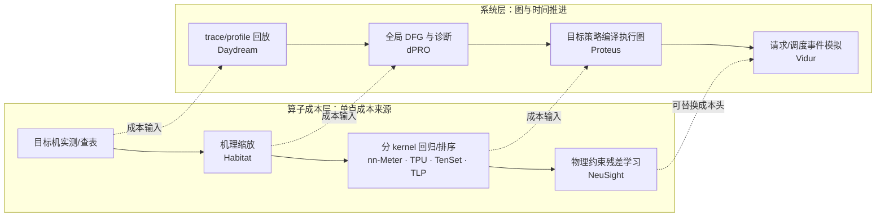
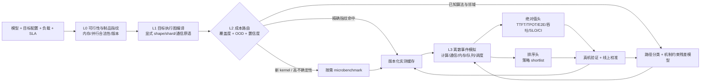

# 第一阶段归档：DNN 性能预测技术路线、工业实践与本地验证

> 本文件是统一报告整合前的第一阶段快照。原 `README.md` SHA-256：`C99478AB462A5F26F4D38BD3D7AD26A859D1F6FCC9ABB8FA4B7AAA524A6BDC15`。最新结论与统一入口见 [`README.md`](README.md)。

调研日期：2026-08-10

> 第二阶段已经利用 WSL、Docker 和 NeuSight 公开真实测量数据完成官方 artifact 与 OOD 分段校准实验，详见[第二阶段归档](phase2_archive.md)。

## 结论先行

用户提出的“机制约束分层混合架构”方向是对的，但研究与落地历史不宜描述成一条严格的“硬编码 → 纯拟合 → 灰盒”替代链。更准确的结论是：

1. **系统层**从 trace replay 演进到目标执行图编译与离散事件模拟：Daydream、dPRO → Proteus、Vidur。
2. **算子成本层**从实测复用演进到直接回归/排序，再到机制约束学习：Habitat、nn-Meter、TPU cost model、TenSet/TLP → NeuSight。
3. 工业系统把这些能力叠成五层：**解析约束 → 目标机 profiling/版本化缓存 → 局部拟合或排序 → 事件模拟 → 在线校准**。它们不是互相替代的代际。
4. 生产决策很少由一个“绝对时延 ML 模型”直接完成。更常见的闭环是：模型负责减少真测数量，机制模型保证基本正确性，目标机 benchmark 决定最终候选，线上指标处理漂移。
5. 本地已完成三条官方代码路径：nn-Meter 的预训练 kernel 预测器、Vidur 的 CPU-only 事件模拟，以及 NeuSight 的 GPT-3/H100 发布 artifact；另在公开真实测量数据上完成了 Docker 灰盒校准对照。它们依赖作者发布的 profile、预测器或标签，**没有在本机目标 GPU 重新采集 ground truth，因此不能声称复现论文整体精度**。

## 1. 原全景表中需要修正的口径

| 条目 | 更准确的表述 | 一手依据 |
| --- | --- | --- |
| Daydream `<3% / <7%` | 是 BERT-large 的 AMP、融合两个突出案例；正文跨模型的 AMP/FusedAdam 误差在约 13% 内，不是路线总体误差。 | [USENIX ATC 2020](https://www.usenix.org/conference/atc20/presentation/zhu-hongyu) |
| Daydream `73.8%` | 来自 dPRO 2022 对 Daydream 的后续大规模对比，不是 Daydream 原论文结果。 | [dPRO 论文](https://proceedings.mlsys.org/paper_files/paper/2022/file/b422680f3db0986ddd7f8f126baaf0fa-Paper.pdf) |
| Daydream “任务串行” | 它显式建模 CPU、GPU、通信依赖和重叠；更准确的限制是依赖当时常见的高度串行低层任务/单 CUDA stream，且未生成和系统验证任意 TP/PP 执行图。 | [Daydream 论文页](https://www.usenix.org/conference/atc20/presentation/zhu-hongyu) |
| Habitat `220%–725%` | Habitat 原文只有 6 GPU、5 模型平均 11.8%；高误差是 NeuSight 后续按 Habitat 方法重训后的评测。其 OOD-GPU 后测平均 724.3%，最大 4529.9%。 | [Habitat](https://www.usenix.org/system/files/atc21-yu.pdf)、[NeuSight](https://arxiv.org/pdf/2407.13853) |
| nn-Meter “约 99%” | ±10% 内比例是移动 CPU 99.0%、移动 GPU 99.1%，Intel VPU 为 83.4%，不能概括所有设备。 | [MobiSys 2021](https://doi.org/10.1145/3458864.3467882) |
| dPRO “串行假设” | dPRO 使用全局 DFG 和细粒度通信事件，不应归为串行模型；其验证集中于 DP、PS、AllReduce，现代 TP/PP/MoE 缺少系统性实证。 | [dPRO 论文](https://proceedings.mlsys.org/paper_files/paper/2022/file/b422680f3db0986ddd7f8f126baaf0fa-Paper.pdf) |
| Proteus “保持策略排序” | 180 个结果平均误差 3.0%、最大 14.7%，另有 2 个 OOM 误判；排序只在一小组 GPT-2 策略点上得到验证，不是普遍保证。 | [Proteus](https://arxiv.org/abs/2306.02267) |
| Vidur `<9% / 42K GPU h` | 作者 PDF 写 request latency `<9%`，MLSys 页面摘要写 latency/throughput `<5%`，保守采用 `<9%`；42K GPU 小时到 1 CPU 小时仅是 LLaMA2-70B 特定搜索案例。 | [Vidur 论文](https://www.microsoft.com/en-us/research/wp-content/uploads/2024/05/vidur_mlsys24.pdf) |
| NeuSight `121.4% → 2.3%` | 是 GPT-3/H100 且模型、GPU 都未见的单例，不是整体均值；整体推理/训练误差分别为 9.7%/7.3%，OOD GPU 平均 8.1%。 | [ASPLOS 2025](https://doi.org/10.1145/3669940.3707265) |
| TPU cost model “胜过解析模型” | 随机 tile 划分为 3.7% vs 6.1%，但刻意不相似的 manual split 上 learned 6.3% 反而差于解析 2.3%；也未证明 v2 训练模型可零样本迁移到 v3。 | [MLSys 2021](https://research.google/pubs/a-learned-performance-model-for-tensor-processing-units/) |
| TLP/MTL-TLP 的倍数 | 9.1×/3.0× 和仅用 7% 数据的 4.7×/2.9×，都是达到同等候选质量所需的搜索时间加速，不是绝对时延精度；7% 仍是目标域标注数据。 | [ASPLOS 2023](https://doi.org/10.1145/3575693.3575737) |
| Ansor + TenSet “RankLoss，只输出排序” | Ansor 原始模型是 GBDT + 加权平方误差；TenSet 才系统比较 LambdaRank 和 MSE。TenSet 数据含真实 runtime，可做回归；只是排序分数本身未校准，不适合直接用于 SLA。 | [Ansor](https://www.usenix.org/conference/osdi20/presentation/zheng)、[TenSet](https://datasets-benchmarks-proceedings.neurips.cc/paper/2021/hash/a684eceee76fc522773286a895bc8436-Abstract-round1.html) |

## 2. 研究脉络：两条轴，而不是一条时间线



### 2.1 为什么“纯拟合阶段”从未真正独立

- Habitat 已把可缩放 kernel 与会换算法的 kernel 分开，后者才交给 MLP。
- nn-Meter 先探测融合规则、把图切成真实 kernel，再对每类 kernel 回归。
- TPU cost model、TLP、TenSet 的首要目标是编译候选排序，而非端到端 SLA 数值。
- dPRO、Proteus、Vidur 一直保留显式依赖、通信、内存和调度状态，只学习或插值局部服务时间。

因此，“灰盒”不是 2025 年突然出现的新范式，而是将已有混合设计进一步约束化、分层化，并补上 OOD 拒绝、在线校准和不确定性输出。

### 2.2 各路线解决的问题边界

| 路线 | 最擅长回答 | 不能单独回答 |
| --- | --- | --- |
| Trace/DFG replay | 已观测执行在图变换后的 what-if、瓶颈诊断 | 新硬件、新 shape、新 kernel 的可靠成本 |
| 算子回归/插值 | 已覆盖设备和 shape 邻域内的快速成本估算 | 队列、调度、并发流、KV cache、跨节点干扰 |
| 排序模型 | 从大量编译/策略候选中找前几名 | 校准后的端到端绝对时延和置信区间 |
| 机制约束学习 | 比直接回归更稳健地外推模型/GPU | 全新 ISA、全新库路径、动态路由等机制变化 |
| 事件模拟 | 合成调度、批处理、并行与通信产生的系统效应 | 输入成本模型未覆盖区域的正确绝对值 |
| 在线控制 | 处理真实负载和软件栈漂移 | 没有冷启动基线时的安全探索 |

## 3. 业界怎么做

### 3.1 五层生产栈

| 层 | 工业实现 | 核心做法 | 最重要的工程约束 |
| --- | --- | --- | --- |
| 解析约束/硬编码 | vLLM、SGLang、DeepSpeed | 内存、KV block、token budget、并行合法性、默认阈值 | 用于可行性和保守下界，不能代表实际 kernel 路径 |
| 目标机实测与缓存 | TensorRT timing cache、XLA persisted autotuning、TorchInductor cache、Neuron cache | 真机 benchmark tactic/kernel，以 shape、dtype、布局、设备和编译器指纹复用 | cache key 与失效策略比模型形式更重要 |
| 搜索剪枝/局部模型 | TensorRT heuristic、TorchInductor autotune、TPU learned model、Vidur RF | 解析规则、排序、回归或插值减少候选真测数量 | 最终 winner 仍由目标机实测决定 |
| 系统事件模拟 | Vidur、NVIDIA DynoSim/Mocker | 显式模拟 batch、KV、prefix cache、抢占、PD worker、网络和请求生命周期 | simulator 与真实 scheduler/runtime 必须版本同步 |
| 在线校准/控制 | NVIDIA Dynamo Planner、JAX PGLE、SageMaker target tracking | 使用真实 forward-pass/TTFT/ITL/队列指标重新拟合或扩缩容 | 需要处理冷启动、观测延迟和控制振荡 |

### 3.2 代表案例

**NVIDIA**

- [TensorRT timing cache](https://docs.nvidia.com/deeplearning/tensorrt/10.x.x/performance/builder-performance.html) 对候选 tactic 在目标设备计时；cache miss 时重新测量并回填。缓存与 GPU、CUDA/TensorRT 及 BuilderConfig 绑定。
- [Triton Model Analyzer](https://docs.nvidia.com/deeplearning/triton-inference-server/user-guide/docs/model_analyzer/docs/config_search.html) 真机搜索 batch、instance、并发和队列参数，支持 brute-force、快速搜索与 Optuna；这是部署调参，不是纯离线跨卡预测。
- [DynoSim](https://docs.nvidia.com/dynamo/latest/user-guides/dynosim) 与 [Mocker](https://docs.nvidia.com/dynamo/dev/knowledge-base/design-documents/mocker-engine-architecture) 将服务时间来源和系统事件分离；[Dynamo Planner](https://docs.nvidia.com/dynamo/dev/knowledge-base/modular-components/planner/planner-design) 又用线上 forward-pass metrics 形成快慢控制环。

**Google / OpenXLA**

- [OpenXLA LHS cost model](https://openxla.org/xla/lhs_cost_model) 同时使用 GEMM/collective 性能表、网络解析曲线和 fusion 解析模型，为 DAG 的计算—通信重叠调度服务。
- [XLA persisted autotuning](https://openxla.org/xla/persisted_autotuning) 仍以实测结果为最终依据；[JAX PGLE](https://docs.jax.dev/en/latest/gpu_performance_tips.html) 运行若干轮收集真实 compute/collective 时长，再重新编译调度。
- TPU learned cost model 已用于编译候选选择；Google 披露 tile 模型带来约 2% 的数据中心 TPU 总计算节省，但它不是云端容量承诺模型。[Google Research](https://research.google/pubs/a-learned-performance-model-for-tensor-processing-units/)

**PyTorch / TorchInductor**

- [`torch.compile(mode="max-autotune")`](https://docs.pytorch.org/docs/stable/generated/torch.compile.html) 生成 Triton/CUTLASS/ATen 等候选并真机 benchmark，结果进入本地或远端 cache。
- 新 GEMM autotuning 路径先用兼容规则、tile efficiency、带宽和 occupancy 等模型取 shortlist，再只编译和实测少量候选。[PyTorch 工程说明](https://pytorch.org/blog/gemms-torchinductor-cutedsl-backend/)

**云服务与开源 serving**

- [SageMaker Inference Recommender](https://docs.aws.amazon.com/sagemaker/latest/dg/generative-ai-inference-recommendations.html) 先缩小实例/优化候选，再在真实 endpoint 上跑指定负载并返回 TTFT、ITL、P50/P90/P99、吞吐和成本。
- vLLM、SGLang 主要依靠内存解析、启发式默认值和 benchmark/sweep，而不是通用时延预测器；例如 [vLLM sweeps](https://docs.vllm.ai/en/latest/benchmarking/sweeps/) 和 [SGLang profiling](https://github.com/sgl-project/sglang/blob/main/docs/developer_guide/benchmark_and_profiling.md)。

### 3.3 应补到原表的三条工业路线

| 技术路线 | 代表系统 | 适用场景 | 关键短板 |
| --- | --- | --- | --- |
| 目标机 autotune + 版本化 timing cache | TensorRT、XLA、TorchInductor | 编译、部署前选 kernel/tactic；重复 shape 快速构建 | 必须已有目标硬件；设备/编译器/shape 变化触发失效 |
| 实测配置搜索 / Benchmark-as-a-Service | Triton Model Analyzer、SageMaker Recommender、Olive | 上线前选实例、batch、并发与成本 Pareto 点 | 可信但昂贵；需先解析剪枝，且仍受测试负载代表性限制 |
| 灰盒事件模拟 + 在线校准 | NVIDIA DynoSim/Dynamo Planner、Vidur | LLM serving 容量规划、what-if、弹性控制 | 服务时间模型和 simulator/runtime 版本漂移；重尾负载与动态路由困难 |

## 4. 建议的落地架构

原设计应补上四项：**L0 制品指纹与可行性、OOD 拒绝路由、误差/置信度输出、真实流量在线校准**。



### 4.1 成本缓存 key

至少包含：

`语义算子 + raw/effective/padded/storage shape + dtype + layout + shard + kernel/backend + graph bucket + GPU/NPU 型号 + 驱动/运行时/编译器/库版本 + 拓扑 + 并发上下文`。

若只用“算子名 + shape + 卡型”，融合、padding、算法选路、软件升级和并发干扰都会产生静默误命中。

### 4.2 L2 路由而非简单 fallback

建议把“命中/未命中”扩成三维判定：

- **离散路径是否已知**：算法、fusion bucket、layout、collective 算法。
- **连续特征是否在覆盖域内**：shape、batch、sequence、并发、message size 与已采样点距离。
- **预测不确定性是否低于用途阈值**：排序可以宽松；SLA/容量规划必须保守并给出区间。

高不确定性点进入 microbenchmark；相邻点进入受 roofline/带宽/occupancy 约束的残差模型；精确指纹命中才直接查表。

### 4.3 评估门槛

不要只报一个全局 MAPE。至少同时评估：

- 算子层：覆盖率、加权 MAPE/P95 APE、OOD 检出率、算法路径分类准确率。
- 策略层：Top-k recall、Kendall/Spearman、错误淘汰真实最优解的比例。
- 请求层：TTFT/TPOT/E2E 的 P50/P95/P99，吞吐和 SLO pass/fail 准确率。
- 系统层：OOM/不可行策略召回率、通信/调度关键路径归因、置信区间覆盖率。
- 漂移层：软件升级、硬件更换、真实 workload 漂移后的校准误差和回填成本。

## 5. 本地实验

详细命令见 [`experiments/README.md`](experiments/README.md)，第二阶段 NeuSight 与灰盒校准结果见[第二阶段归档](phase2_archive.md)。实验使用官方仓库、发布 profile/预测器/标签，不加载 LLM 权重。

### 5.1 环境与源码版本

- 主机：Windows，Intel Core i7-14700，约 34 GB RAM；仅 Intel UHD 770，无 NVIDIA GPU/CUDA。Docker Desktop 4.85、Engine 29.6.2 和 WSL2 Ubuntu 22.04.5 可用。
- Vidur：`microsoft/vidur@8383d2935bc62723a212090baa9f98ada206fc14`。
- nn-Meter：`microsoft/nn-Meter@cd8dab49b735d58d03746141f73ef5934559ae68`。
- NeuSight：`scai-tech/NeuSight@6945927d9afcca2b9daf021f8395e53edc5b4eef`，已在 WSL CPU 环境执行 GPT-3 2.7B/H100 发布 artifact，并跑通一轮 BMM 训练链路。

### 5.2 Vidur：CPU-only 事件模拟

配置：LLaMA-2-7B、A100 发布 profile、1 replica、PP=1、固定 256 prefill + 32 decode、16 个 Poisson 请求、2 QPS、Sarathi、batch cap 64、chunk 128。为快速冒烟，RF 使用 2-fold、50 trees、depth 8；这不是论文默认大实验。

| 指标 | TP=1 | TP=2 | 说明 |
| --- | ---: | ---: | --- |
| 请求数 | 16 | 16 | 相同 seed=42 |
| TTFT mean / P95 | 38.41 / 53.82 ms | 37.76 / 53.99 ms | `prefill_e2e_time` |
| E2E mean / P95 | 346.44 / 367.52 ms | 355.13 / 375.65 ms | 请求级 CSV |
| Scheduling delay mean / P95 | 4.84 / 15.29 ms | 4.01 / 15.44 ms | 请求级 CSV |
| 调度 batch events | 319 | 316 | Chrome trace complete events |
| 模拟结束时间 | 5.3334 s | 5.3437 s | Chrome trace 最大 `ts + dur` |
| 近似 output-token throughput | 96.00 tok/s | 95.81 tok/s | 512 decode tokens / 模拟结束时间 |

该小负载下 TP=2 的平均 E2E 比 TP=1 高约 2.5%，原因是模型中的 all-reduce/启动开销没有被足够的计算缩短抵消。它说明事件模拟器确实把并行通信纳入决策；**不能外推为 TP=2 普遍更慢**。

产物：

- `experiments/results/vidur_tp1/2026-08-10_11-41-25-825419/`
- `experiments/results/vidur_tp2/2026-08-10_11-41-50-915691/`
- 每组含 `config.json`、`request_metrics.csv`、`chrome_trace.json`。

结论等级：**artifact/pipeline smoke test**。使用发布 profile 验证了 RF 成本层、TP 图、调度器和请求事件链；没有 A100 真机 ground truth，不能验证论文 `<9%`。

### 5.3 nn-Meter：预训练 kernel 预测器

输入为官方 `mobilenetv3small_0.json`，设备预测器为 `cortexA76cpu_tflite21 v1.0`：

```text
[RESULT] predict latency for mobilenetv3small_0.json: 12.558942703135 ms
```

运行过程中加载 16 个 kernel/fusion predictor，验证了 IR → kernel/fusion 识别 → 分 kernel 预测 → 求和链路。

一个重要的工程发现是：官方 pickle 由 scikit-learn 0.23.1 生成。Python 3.12 + scikit-learn 1.9 会因 tree node dtype 变化直接失败；切换到 Python 3.11 + scikit-learn 1.2.2 后可以加载，但仍有跨版本告警。因此预测器发布必须带：

- 训练代码和依赖 lock；
- 安全、可迁移的模型格式或容器；
- 设备/运行时/fusion rule 指纹；
- 可重建或升级转换流程。

结论等级：**预训练预测器 smoke test**。本机没有 Cortex-A76 目标设备，因此 12.5589 ms 只证明推理链可运行，不证明误差。

### 5.4 其他论文的本地可复现性与第二阶段更新

| 项目 | 当前结论 | 阻塞或成本 |
| --- | --- | --- |
| NeuSight | 已在 WSL/PyTorch 2.1 CPU 环境重跑官方 GPT-3/H100 单例，APE 0.688%；详见第二阶段报告 | 这是发布 opgraph、权重和标签的 artifact 对齐，不是 H100 重新实测；CPU shim 与限制均已记录。 |
| dPRO | 官方 artifact 有离线 trace，可做下一轮 | Docker/WSL 已可用，但完整栈仍绑定旧 TF/MXNet/BytePS/Horovod/NCCL。 |
| Habitat | 有官方代码 | 依赖旧 PyTorch/CUDA 和 NVIDIA performance counters/CUPTI。 |
| TenSet/TLP | 有归档代码和数据 | 旧 TVM 构建、数据量大、目标域采样仍需硬件。 |
| Daydream | 未发现官方完整代码 | 旧 CUPTI/框架插桩和 NVIDIA 环境。 |
| Proteus | 未发现对应官方 artifact | 无法做可信实现级复现。 |
| TPU cost model | 无对应公开训练栈/大规模标注语料 | 依赖内部 XLA/TPU；TpuGraphs 不是 2021 原实验的直接 artifact。 |

### 5.5 复现结论应该分三级

1. **链路冒烟**：官方代码可加载发布数据并产生输出。本轮 Vidur、nn-Meter 和 NeuSight 训练入口已完成。
2. **artifact 评测**：在作者发布的标签、划分和脚本上重算表格/图。NeuSight GPT-3/H100 单例已完成；更广泛模型/GPU 组合仍需继续固定环境和数据后评测。
3. **论文复现**：重新采样目标硬件并与真实端到端运行比较。当前本机无 NVIDIA/NPU 集群，无法完成。

## 6. 建议落地顺序

以下周期是工程估计，不是论文结论：

1. **P0，2–4 周：可审计底座**。统一 shape/shard/版本指纹、实测缓存、图编译与合法性/OOM 检查；先做离线回放，不训练大模型。
2. **P1，4–8 周：L2 灰盒成本层**。建立 kernel/算法路径分类、roofline/带宽约束残差模型、覆盖域距离与 OOD gate；高不确定性自动 microbenchmark。
3. **P2，4–8 周：L3 事件模拟**。先覆盖 compute/communication overlap、带宽共享、host launch、内存与调度；再加入 KV、prefix、抢占、PD 和 MoE 路由。
4. **P3，持续：真实闭环**。shadow prediction、误差分桶、主动采样、版本升级失效、线上快慢校准环和回归测试集。

首个可交付产品建议不是“支持所有模型/卡型的万能预测器”，而是：

> 对一个固定 runtime、两种目标硬件、三类代表 workload，输出策略 shortlist、绝对时延区间、瓶颈归因和拒绝原因；任何 OOD 点都能自动进入真测回填。
