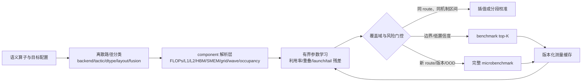

# 第二阶段归档：灰盒 DNN 性能预测调研与实验

> 本文件是统一报告整合前的第二阶段快照。原 `phase2_graybox_experiments.md` SHA-256：`1481F110B09DAD0B7D38FF9F02D91FC06AF53BC193F4EBA149EDB62AF4FCCBAA`。最新结论与统一入口见 [`README.md`](README.md)。

日期：2026-08-10

## 结论

第二阶段结果支持“component-level 机制模型 + 真实测量分段校准”的方向，但必须增加两个限定：

1. **先识别离散执行路径，再在路径内部做连续预测。** Kernel/tactic、Tensor Core/SIMT、tile、wave、cache-fit 或软件版本一旦变化，不能跨边界平滑外推。
2. **选择性校准必须包含 OOD 拒绝和 microbenchmark fallback。** Roofline 约束只保证不违反粗粒度物理下界，并不保证新架构上的零样本误差一定优于直接拟合。

本轮最重要的反例是 H100：简单灰盒残差模型的零样本 MAPE 为 19.14%，反而差于直接拟合的 15.45%。H100 有 1,002/1,040 条为源域完全没有的 XMMA family，且 exact kernel 全部未见；失败与这种 route OOD 高度一致，但仍需 route 消融才能确认因果。该反例至少说明“新 GPU 只填峰值 FLOPS/带宽即可预测”不成立。

完整实验同时得到三条正向证据：

- NeuSight 官方 GPT-3 2.7B/H100 artifact 在 WSL CPU 环境重跑，预测 671.046 ms，发布标签 666.458 ms，APE 0.688%；同算子图的纯 Roofline 基线 APE 为 31.264%。
- 在 32 条目标 GPU 测量下，按执行路径、compute/memory regime 和 wave 分段的校准，相比单一全局校准，A100/H100/L4 的 MAPE 分别改善约 18.3%、24.0%、19.0%。
- 分段采样方式不能一刀切：均匀覆盖 route 在 L4 上有效，但在低预算 H100 上不如按真实分布随机采样，说明未来应将“边界覆盖”和“workload 频率”共同纳入主动采样目标。

## 1. 工业实现进一步核对

工业界更接近下面的组合，而不是“全局 Roofline + 一个回归器”：



### 1.1 Component-level 模型

- [Nsight Compute Rooflines](https://docs.nvidia.com/nsight-compute/NsightCompute/index.html) 提供包含 L1、L2 和 device-memory throughput ceilings 的层级 Roofline。本文将其用于约束与归因，不把各层理论时间机械相加。
- [OpenXLA GPU performance model](https://github.com/openxla/xla/blob/main/xla/service/gpu/model/gpu_performance_model.cc) 显式估算 FLOPs、读写字节和 launch dimensions；[基础实现](https://github.com/openxla/xla/blob/main/xla/service/gpu/model/gpu_performance_model_base.cc) 再按 coalescing、低并行度带宽上限及 L1/L2 cache-fit/speedup heuristic 修正计算和访存时间，并组合 compute-memory overlap。[参数定义](https://github.com/openxla/xla/blob/main/xla/service/gpu/model/gpu_performance_model_base.h) 将 launch overhead、cache speedup 和 overlap 集中为经验常量或配置项；**本文据此推论**它们是候选校准参数，并非 OpenXLA 宣称均可运行时调参。
- [OpenXLA LHS](https://openxla.org/xla/lhs_cost_model) 对 GEMM 和 ICI collective 使用实测性能表与插值，其中 ICI 表按 transfer scheme 分层；DCN collective 使用包含 launch overhead、RTT、NIC speed 的解析 S-curve。[JAX PGLE](https://docs.jax.dev/en/latest/gpu_performance_tips.html) 再把真实 compute/collective 时间反馈给 XLA 调度器。
- [nvMatmulHeuristics](https://docs.nvidia.com/cuda/nvidia-matmul-heuristics/index.html) 使用解析 heuristic 预测配置和 runtime，并在 Discovery 中接收少量实测以调优 heuristic profile；其[配置与模型 API](https://docs.nvidia.com/cuda/nvidia-matmul-heuristics/api.html) 覆盖 CTA/warp/instruction tile、stage、cluster、split-K、共享内存和并发 CTA 等变量。

### 1.2 路径分段和实测裁决

- [CUTLASS kernel metadata](https://docs.nvidia.com/cutlass/4.6.0/media/docs/operators/api_reference/metadata.html) 包含 MMA 指令、tile/cluster、stage、scheduler、alignment 等信息；**工程上意味着**缓存身份不能只有 M/N/K。[CUTLASS Profiler](https://docs.nvidia.com/cutlass/4.6.0/media/docs/cpp/profiler.html) 对满足约束的候选执行、验证和测量。
- [TensorRT dynamic shapes](https://docs.nvidia.com/deeplearning/tensorrt/latest/inference-library/dynamic-shapes-basics.html) 用 optimization profile 定义可重叠的 shape 范围和 opt 调优点；运行时显式选择 profile，部分 tactic 甚至只在 `MIN=OPT=MAX` 时可用。[ITimingCache](https://docs.nvidia.com/deeplearning/tensorrt/latest/_static/c-api/classnvinfer1_1_1_i_timing_cache.html) 合并要求 TensorRT 版本精确一致且默认校验设备属性；**本文的保守策略**还将 CUDA 与影响 tactic 的 [BuilderConfig](https://docs.nvidia.com/deeplearning/tensorrt/latest/_static/c-api/classnvinfer1_1_1_i_builder_config.html) 纳入缓存指纹。
- [Triton autotune](https://triton-lang.org/main/python-api/generated/triton.autotune.html) 由 `configs` 声明 BLOCK、warps、stages 等候选，由 `key` 决定哪些输入参数变化会重新评测全部候选；若 shape、stride 或 alignment 会改变最优配置却未进入 key，可能复用不合适的旧赢家。
- AMD [hipBLASLt offline tuning](https://rocm.docs.amd.com/projects/hipBLASLt/en/latest/how-to/how-to-use-hipblaslt-offline-tuning.html) 以完整 GEMM problem、workspace 和 solution index 做离线调优，并明确 solution 不可跨库 release 或设备架构复用；另一套 [hardware predicates](https://rocm.docs.amd.com/projects/hipBLASLt/en/develop/conceptual/pci-chip-id-predicates-walkthrough.html) 还可按 processor、CU count 和 PCI ID 约束候选。

因此建议的组件时间结构是：

\[
\hat T_r = T_{launch,r}+T_{tail/wave,r}+
\Phi\left(
\frac{T_{TC}}{\eta_{TC,r}},
\frac{T_{SIMT}}{\eta_{SIMT,r}},
\frac{T_{HBM}}{\eta_{HBM,r}},
\frac{T_{L2}}{\eta_{L2,r}},
\frac{T_{SMEM}}{\eta_{SMEM,r}};\rho_r
\right)+T_{aux}
\]

其中路径 \(r\) 由 backend、tactic、dtype、layout、fusion、tile、scheduler 和硬件上下文确定；FLOPs、各级流量、grid、wave 和资源约束由解析层计算，模型只学习有界利用率 \(\eta\)、重叠 \(\rho\)、launch 与尾波残差。

## 2. 实验环境

| 环境 | 用途 | 状态 |
| --- | --- | --- |
| WSL2 Ubuntu 22.04.5、Python 3.10.12、PyTorch 2.1.0+cpu | NeuSight 官方 artifact 和一轮训练链路 | 成功 |
| Docker Desktop 4.85、Engine 29.6.2、Linux amd64 | 固定 sklearn 灰盒实验环境 | 成功 |
| NVIDIA/CUDA | 重新采集 GPU ground truth | 不可用 |

Docker 最终镜像：

```text
dnn-graybox-calibration:20260810
sha256:05183e24d76f1834ab600d2bdc0681d9c219f610320b4a2380d7facd9a393351
Python 3.11.15 / numpy 1.26.4 / pandas 2.2.3 / scikit-learn 1.5.2
```

为消除 sklearn/BLAS 并行归约带来的末位漂移，镜像固定 `PYTHONHASHSEED=0`，并将 OpenMP、OpenBLAS、MKL、NumExpr 线程数设为 1。相同命令连续完整运行两次后，`zero_shot.csv`、`calibration_runs.csv`、`calibration_summary.csv` 和 `metadata.json` 的 SHA-256 逐项一致；详见[确定性核验记录](experiments/results/graybox_calibration/DETERMINISM.md)。

NeuSight 环境和全部依赖锁定见 [WSL 实验说明](../../.research/experiments/neusight-wsl/README.md)。两类实验都没有修改 NeuSight upstream，commit 固定为 `6945927d9afcca2b9daf021f8395e53edc5b4eef`。

## 3. 实验一：NeuSight 官方灰盒 artifact

### 3.1 方法

使用作者发布的：

- GPT-3 2.7B opgraph；
- H100 80GB 架构描述；
- MLP_WAVE 权重和 tile table；
- `sequence_length=2048`、`batch_size=2`、inference。

WSL CPU build 在导入时会因 `collect.py` 顶层无条件构造 `torch.cuda.Event` 而失败，训练入口还会无条件调用 `torch.cuda.set_device`。实验只在独立目录用 `sitecustomize.py` 将未使用的 CUDA Event 变为占位符、在 CPU 环境把 `set_device` 设为 no-op，并重定向硬编码的 home cache；未修改预测公式、权重、opgraph、标签或 upstream 文件。

### 3.2 结果

| 项目 | 结果 |
| --- | ---: |
| 官方实测标签 | 666.458325 ms |
| 本次 NeuSight 预测 | 671.045786 ms |
| 作者发布预测 | 671.045774 ms |
| 本次与发布预测差 | 0.0000126 ms |
| NeuSight APE | **0.688334%** |
| 同 opgraph 纯 Roofline | 458.099166 ms |
| Roofline APE | **31.263644%** |
| NeuSight 首次 wall / peak RSS | 23.52 s / 645,584 KiB |

结果与仓库 `nvidia_inf.csv` 中的 0.7% 对齐。它证明发布 artifact 可重复，以及“Roofline 下界 + 学习利用率”在该单例上的价值；它不是重新在 H100 上采集 ground truth，也不能代表整体 2.3% 或 9.7% 指标。

额外跑通官方 BMM 一轮 CPU 训练：loss 0.1739、validation mean relative error 23.2%、wall 21.99 s。该结果只验证训练链路，没有训练到收敛，不能与论文精度比较。

产物：

- [NeuSight 预测 JSON](../../.research/experiments/neusight-wsl/gpt3-h100/out/prediction/NVIDIA_H100_80GB_HBM3/neusight/gpt3_27-inf-2048-2.json)
- [Roofline 预测 JSON](../../.research/experiments/neusight-wsl/gpt3-h100/out/prediction/NVIDIA_H100_80GB_HBM3/roofline/gpt3_27-inf-2048-2.json)
- [重跑脚本](../../.research/experiments/neusight-wsl/run_artifact.sh)
- [依赖锁定](../../.research/experiments/neusight-wsl/requirements-lock.txt)

## 4. 实验二：真实测量数据上的 OOD 与分段校准

### 4.1 数据与防泄漏

数据来自 NeuSight 发布的 NVIDIA FP32 Linear/GEMM microbenchmark：

- 源域训练：32,224 条，P100、P4、T4、V100、A100-40GB。
- 目标评测：A100-80GB、H100、L4 各 1,040 条。
- 目标 `(B,M,N,K)` 与源域精确重叠为 **0**，因此同时测试新 shape；H100/L4 还是新硬件。
- 软件口径固定为 PyTorch 2.1、CUDA 12.1、cuDNN 8902，dtype 为隐式 FP32。

本实验定位是 **post-kernel component cost**：使用 compiler/profiler 可见的 kernel name、grid、block、tile 和 wave。它不预测 cuBLAS/CUTLASS 将选择哪个 tactic，因此不能当作 pre-kernel 部署预测器。

解析层计算 tile 对齐后的 FLOPs、逻辑输入/权重/输出字节、算术强度、ridge point、compute/memory floor、grid block 和 wave；模型使用相同数值特征，分别学习：

- `roofline`：不学习，只输出物理下界；
- `direct`：直接拟合 `log(latency)`；
- `gray_residual`：拟合 `log(latency / roofline)` 并约束 slowdown ≥ 1；
- `global calibration`：目标机样本只估计一个全局乘法残差；
- `segmented calibration`：按 kernel family、compute/memory regime、wave bucket 分段，局部中位数校准并层级回退；
- `selective calibration`：每段至少 8 点，只有残差超过 5% 且大于 1.96 倍稳健标准误才启用，并使用 16 点先验收缩。

校准预算为 8/16/32/64/128 条，约占目标 GPU 1,040 条数据的 0.8%–12.3%；每个设置运行 10 个 seed。`coverage` 采样利用完整目标候选池的无标签 `fine_segment` 身份做均匀覆盖，另有相同预算的随机采样对照；因此它是 transductive active sampling，不使用目标时延标签。

### 4.2 零样本结果

| 目标 GPU | 纯 Roofline MAPE | 直接拟合 MAPE | 灰盒残差 MAPE | 灰盒相对直接拟合 |
| --- | ---: | ---: | ---: | ---: |
| A100 80GB PCIe | 16.14% | 11.18% | **9.49%** | 改善约 15.1% |
| H100 80GB HBM3 | 33.07% | **15.45%** | 19.14% | **恶化约 23.9%** |
| L4 | 71.99% | 37.00% | **23.69%** | 改善约 36.0% |

三个 GPU 上纯 Roofline 都明显不够；灰盒在 A100/L4 上有收益，却在 H100 上失败。H100 的主要 kernel 属于源域未见的 XMMA/tile 路径，这与误差恶化高度一致但尚未证明因果；工程上仍应把新 tactic 送入实测，而不能只依赖目标峰值 FLOPS/带宽。


### 4.3 校准结果

下表使用 `coverage` 采样，展示 32 条目标实测后的结果；数值为 10 seed 平均：

| GPU | 灰盒零样本 | 全局校准 MAPE / P95 APE | 始终分段 MAPE / P95 APE | 统计门控选择性 MAPE / P95 APE |
| --- | ---: | ---: | ---: | ---: |
| A100 80GB | 9.49% | 4.84% / 13.24% | **3.96% / 11.35%** | 4.80% / 13.19% |
| H100 | 19.14% | 13.04% / 28.53% | **9.91% / 24.29%** | 13.32% / 28.56% |
| L4 | 23.69% | 19.66% / 51.01% | **15.93% / 35.78%** | 19.51% / 51.50% |

始终分段相对全局校准的 MAPE 改善为 A100 18.3%、H100 24.0%、L4 19.0%。128 条测量时，始终分段 MAPE 进一步达到 3.58%、8.59%、12.72%。


### 4.4 反例与解释

1. **低预算时不能强行分段。** 16 条时，H100/L4 的始终分段虽然平均 MAPE略有改善，但 P95 APE分别从 30.13% 恶化到 30.41%、从 48.07% 恶化到 48.92%。统计门控此时退回全局校准，避免了尾部恶化。
2. **固定门控又可能过于保守。** 到 128 条时，统计门控 MAPE 为 A100 4.43%、H100 10.39%、L4 14.20%，均高于始终分段的 3.58%、8.59%、12.72%。门槛应通过源域 leave-one-GPU-out 验证或经验贝叶斯方法确定，不能在目标测试集上调参。
3. **均匀 route 覆盖并非总是最佳采样。** 32 条时，均匀覆盖在 L4 上为 15.93%，好于随机采样的 17.64%；H100 上却为 9.91%，略差于随机采样的 9.33%。主动采样应同时优化边界覆盖和真实 workload 权重。
4. **这是探索性而非确认性实验。** 统计门控是在首轮 pilot 后加入；因此本轮用于筛选下一步假设，未来真实数据实验必须先在源域预注册阈值，再冻结后评测。

### 4.5 数据与模型限制

- 仅覆盖 FP32 Linear/GEMM；未覆盖 FP16/BF16、Tensor Core 精度策略、fusion、conv、attention、collective 或服务调度。
- 发布数据计时方式是 25 次排序后取最快 5 次均值，没有方差、温度、功耗、时钟和冷热缓存信息，更接近 best-case kernel latency。
- `Kernel Name/Grid/Block` 是 kernel 选择之后的元数据；如果生产流程拿不到这些字段，需要先做路径分类，或者把未知路径送入 microbenchmark。
- `coverage` 采样假设部署前已知待评估 candidate/workload 的无标签特征池；若未来请求逐个到达且候选池未知，本轮均匀覆盖结果可能偏乐观。
- `calibration_runs.csv` 保存每次运行的汇总指标，但未保存逐行预测与校准 row-ID；当前可由固定数据、脚本和 seed 重建，长期实验应额外保存选择集 manifest 或其哈希。
- 发布实现存在 GB 与 GiB 混用的兼容口径；本实验统一使用 SI GB/s，未在看到目标结果后择优选择单位。
- 当前没有本机 NVIDIA GPU，无法重新验证公开 CSV 的测量噪声和软件版本漂移。

原始产物：

- [零样本指标](experiments/results/graybox_calibration/zero_shot.csv)
- [1,800 组校准运行](experiments/results/graybox_calibration/calibration_runs.csv)
- [10-seed 汇总](experiments/results/graybox_calibration/calibration_summary.csv)
- [运行元数据](experiments/results/graybox_calibration/metadata.json)
- [确定性核验记录](experiments/results/graybox_calibration/DETERMINISM.md)
- [实验代码](experiments/graybox_calibration.py)
- [Dockerfile](experiments/Dockerfile.graybox)
- [一键重跑](experiments/run_graybox_docker.ps1)

## 5. 对初步方案的修订

### 5.1 四级成本路由

| 级别 | 条件 | 行为 |
| --- | --- | --- |
| L0 精确命中 | 完整硬件/软件/route/shape 指纹一致 | 返回实测分布，不运行模型 |
| L1 域内灰盒 | 同 route、同机制区间，连续特征在支持域 | 解析成本 + 有界利用率/残差 |
| L2 边界点 | tactic 候选接近、置信区间跨 SLA、靠近 wave/cache/ridge 边界 | 只 benchmark top-K，回填缓存 |
| L3 OOD | 新 kernel/tactic、硬件/库版本、fusion 或拓扑 | 完整 microbenchmark；测量前给保守值并标记不可信 |

建议将下列变化直接视为硬分段或缓存失效：

- kernel/tactic、fusion/epilogue、Tensor Core eligibility；
- dtype、layout、stride、alignment、divisibility、padded shape；
- CTA/warp/instruction tile、stage、cluster、scheduler、split-K；
- wave、occupancy、L1/L2-fit、HBM 饱和区；
- GPU/SKU/SM/MIG、driver、CUDA/ROCm、编译器和库版本；
- workspace、deterministic、功耗/时钟策略、stream/MPS/MIG 并发；
- 通信 topology、NCCL/RCCL、protocol 和 message-size 区间。

### 5.2 三层数据存储

1. `raw_observation`：不可变原始测量，保留每次重复、p50/p95/std、warmup、缓存冷热、时钟、功耗、温度。
2. `exact_winner`：完整指纹 → kernel/tactic + 实测分布。
3. `segment_model`：route/regime → 利用率、重叠/残差模型、支持域、训练版本和不确定度。

温度和瞬时时钟宜作为测量质量字段；只有越出稳定范围时才使缓存失效，避免 key 无限制膨胀。

## 6. 下一批真实数据实验

### 6.1 数据选择

从真实 trace 中先选覆盖累计设备时间 80%–90% 的 20–50 个 component family。每条离散 route 优先采样：

- alignment、整除性、Tensor Core/SIMT 切换点；
- wave 数和尾波跳变点；
- L1/L2 容量边界；
- Roofline ridge point、低并行区和吞吐饱和区；
- split-K、fusion、profile 和 tactic 切换边界；
- 区间内部再用 log-scale/Latin-hypercube 稀疏采样。

[CUTLASS 测量指南](https://docs.nvidia.com/cutlass/latest/media/docs/cpp/gemm_performance_measurement_methodology_guidelines.html) 建议控制 warmup、循环次数、buffer rotation，并监控 clocks、L2 和 power。真实采集不能只保存平均值。

### 6.2 预注册对照

| 组 | 模型 |
| --- | --- |
| A0 | 原始 component Roofline |
| A1 | 全局 `log(latency)` 回归 |
| G1 | route + 解析下界 + 有界利用率/残差 |
| G2 | G1 + 机制分段校准 + 层级回退 |
| G3 | G2 + OOD 拒绝 + exact cache + microbenchmark fallback |

至少包含四种互斥测试：unseen shape、unseen model、unseen kernel/tactic、unseen GPU 或软件版本。随机切分只能用于调试，不能作为主要精度结论。

建议预注册以下可证伪条件：

- Joint OOD 上 G1 相对 A1 的 macro-MAPE 改善至少 20%，否则不宣称零样本灰盒优越。
- 使用不超过 5% 的目标实测时，G2 相对 G1 和全局校准的 MAPE 改善至少 10%，且 P95 APE 不恶化超过 5%。
- Post-kernel metadata 相对 pre-kernel 特征若改善不足 5%，则不值得引入 profiler/编译器耦合。
- OOD gate 对 `APE > 20%` 的风险检测和 risk-coverage 曲线必须优于仅按 shape 距离拒绝。

除 MAPE 外还要报告 P50/P95 APE、WAPE、signed bias、underprediction tail、置信区间覆盖率、策略 top-k/regret、测量数量和总调优时间。

## 7. 当前决策

可以继续推进灰盒，但应把方案名称明确成：

> **Route-aware component model + bounded mechanism residual + risk-gated segmented calibration + exact measurement cache**

下一轮真实数据不应从“训练一个更大的回归器”开始，而应先把 route 指纹、测量协议、边界采样和 OOD fallback 做正确。此次 H100 反例表明，这四项决定了灰盒方案是否真正可落地。
