# 《A Survey on Performance Modeling and Prediction for Distributed DNN Training》精读

> 证据截图说明：正文中的 `原文截图 E###` 可跳转到文末证据卡片。TPDS 终版下载端点受站点限制；其卡片使用公开终版 PDF 的逐页文本抽取快照，保留期刊页码与抽取文本行号，但不冒充版式截图。


> 文献：Zhenhua Guo, Yinan Tang, Jidong Zhai, Tongtong Yuan, Jian Jin, Li Wang, Yaqian Zhao, Rengang Li, “A Survey on Performance Modeling and Prediction for Distributed DNN Training,” *IEEE Transactions on Parallel and Distributed Systems*, vol. 35, no. 12, pp. 2463–2478, Dec. 2024. DOI: [10.1109/TPDS.2024.3476390](https://doi.org/10.1109/TPDS.2024.3476390)。
>
> 正式出版页：[IEEE Xplore](https://ieeexplore.ieee.org/document/10707191/)；公开全文页：[ResearchGate](https://www.researchgate.net/publication/384721762_A_Survey_on_Performance_Modeling_and_Prediction_for_Distributed_DNN_Training)。

## 0. 阅读口径与证据标记

本文是对分布式 DNN **训练性能建模与预测**领域的综述，不是一个新的预测器、回放器或仿真器。它的主要价值在于：给出方法分类、汇总不同系统的建模对象与实现条件、用三种代表实现做一次横向实验，并讨论未来方向。

为避免把论文原文、本文归纳和面向录制回放项目的延伸判断混在一起，后文使用三类标记：

- **[论文事实]**：论文直接陈述，或可从论文图表中直接读出。
- **[本文归纳]**：根据多个章节整理出的结构化总结，不是原文逐字表述。
- **[项目推断]**：结合现有 `survey` 中的录制回放设计，对 Ascend/LLM 场景作出的工程判断；不能反向当作论文结论。

页码统一写作“**PDF p.X / 期刊页 Y**”。正式 PDF 共 16 页，PDF p.1 对应期刊页 2463。段落定位采用“章节 + 段落首句”方式，以减少排版版本差异造成的歧义。正文抽取文本保存在 [`sources/TPDS2024_Distributed_DNN_Survey_extracted.md`](sources/TPDS2024_Distributed_DNN_Survey_extracted.md)；其中表 I–IV 的标题和正文讨论完整，但表格图片中的部分数字单元格未被文本抽取，因此本文只记录能够由正文或可见表格可靠核对的信息，不补猜表格数值。

## 1. 一句话结论

这篇综述把分布式训练性能预测按**建模方法**分成解析模型、图模型和执行驱动模型。它与本项目提出的“Trace 回放、查表/拟合、全栈仿真”只有部分重合，不能机械地一一对应：

1. Trace 回放最接近图模型中的 DayDream、dPRO、DistSim，但图模型还包含“不采 Trace、直接生成图”的 Paleo、FlexFlow、Proteus 等；ASTRA-Sim 2.0 这样的执行驱动模拟器也能接受 Trace。
2. 查表/拟合不是论文的顶层类别，而是跨类别存在的**节点代价来源**：解析模型会拟合系数，图模型会查询实测算子代价，DNNEmu 则在执行驱动框架内组合查表、GBDT 与真实框架执行。
3. 全栈仿真最接近执行驱动模型，但“执行驱动”并不自动等于“全栈”：有些方法只模拟参数服务器或通信，有些不含框架调度、内存状态或细粒度网络竞争。

因此，更适合录制回放项目的统一描述不是单轴三选一，而是三个正交维度：

| 维度 | 可选项示例 | 回答的问题 |
|---|---|---|
| 工作负载/执行语义表示 | 公式、静态生成图、实测 Trace 图、可执行 IR、离散事件 | “系统认为程序将执行什么、依赖是什么？” |
| 节点代价来源 | 解析公式、Profile 查表、学习模型、详细硬件/网络模拟、目标机实测 | “每个节点或事件耗时多少？” |
| 建模栈与状态范围 | 框架调度与控制流、算子/kernel/内存、集合通信/网络、放置与硬件 | “哪些影响性能的层次被保留？” |

对应既有录制回放架构：第一维主要进入 **Execution Recipe**，第二维进入 **Observation Ledger/代价 Oracle**，第三维决定 **Physical Binding** 以及 Recipe 中必须显式保存的状态与语义。

## 2. 论文要解决的问题与贡献

### 2.1 问题背景

**[论文事实]** 大规模 DNN 训练需要选择并行策略、硬件集群、通信实现和各种超参数。直接在真实集群上逐一部署、运行、对比的成本很高；性能模型试图在部署前，以低成本预测训练时间或运行 Trace，从而辅助策略搜索、资源配置和系统设计。定位：PDF p.2 / 2464，§II-A 第 1 段，首句 “Although distributed training can accelerate training...” 及 Fig. 1。 〔[原文截图 E001](#evidence-e001)〕

论文在 §II-B 将设计空间分为六类：

| 设计空间 | 论文讨论的核心变量 | 位置 |
|---|---|---|
| 并行策略 | 数据并行、模型并行、流水并行，以及多维混合策略；不同切分带来计算、通信和内存差异 | PDF p.2–3 / 2464–2465，§II-B.1；Fig. 2 〔[原文截图 E002](#evidence-e002)〕 |
| 计算 | 不同设备、不同算子、输入 shape、算法与 kernel 对计算时间的影响 | PDF p.3 / 2465，§II-B.2 〔[原文截图 E003](#evidence-e003)〕 |
| 通信 | collective/P2P、通信算法、消息量、拓扑、带宽/时延以及计算通信重叠 | PDF p.3–4 / 2465–2466，§II-B.3；Fig. 3 〔[原文截图 E004](#evidence-e004)〕 |
| 内存与数据加载 | 参数、激活、优化器状态、显存限制、数据读取和预处理 | PDF p.3–4 / 2465–2466，§II-B.4 〔[原文截图 E005](#evidence-e005)〕 |
| 集群设计 | 设备数量与类型、服务器与网络拓扑、异构部署 | PDF p.4 / 2466，§II-B.5 〔[原文截图 E006](#evidence-e006)〕 |
| 协同设计 | 模型、并行策略、硬件和网络之间的联合选择，而非局部最优 | PDF p.4 / 2466，§II-B.6，首句 “A collaborative design...” 〔[原文截图 E007](#evidence-e007)〕 |

### 2.2 论文贡献

**[论文事实]** 论文自述的贡献包括：梳理性能建模的设计空间；按方法学将已有工作分为解析、图和执行驱动三类；总结代表方法的输入、输出、支持范围、精度、开源/Profiling/运行环境要求；选择三种代表实现进行比较；给出应用和模型选择建议；讨论五类挑战与机会。定位：PDF p.1 / 2463，§I 末段，首句 “This paper presents a comprehensive survey...” 以及 PDF p.4 / 2466，§III 开头。 〔[原文截图 E008](#evidence-e008)〕

**[本文归纳]** 论文实际回答的是“如何对一个候选训练方案做虚拟性能评估”，而不是“如何完整地录制一次真实运行并跨环境恢复所有语义与状态”。因此它能给录制回放提供方法谱系和代价建模参考，却不能替代本项目对动态控制流、状态演化、有效 shape、rank ownership、collective 身份等记录字段的设计。

## 3. 论文的三类方法

论文在 PDF p.4 / 2466，§III 开头、首句 “According to the methodology of modeling and prediction...” 给出三类顶层定义。 〔[原文截图 E009](#evidence-e009)〕

| 类别 | 核心表示/执行方式 | 常见输入 | 常见输出 | 速度与精度倾向 | 主要依赖 |
|---|---|---|---|---|---|
| 解析模型（Analytical） | 将总耗时分解为计算、通信、重叠等公式 | 模型结构、并行策略、硬件参数、拟合/实测系数 | 迭代时间、吞吐、扩展效率或相对代价 | 通常最快，但对公式假设和参数质量敏感 | 解析推导、少量硬件参数或 Profiling |
| 图模型（Graph-based） | 用 DAG/DFG/task graph 表示算子、通信和依赖，在图上累计或回放 | 模型图或运行 Trace、策略、集群描述、节点代价 | 关键路径、时间线、吞吐、内存、what-if 后结果 | 能表达依赖和重叠；图规模及节点代价决定成本 | 图生成/Trace 采集、节点代价模型 |
| 执行驱动（Execution-driven） | 通过定制模拟器、领域模拟器或真实框架执行来推进运行状态 | workload/IR/Trace、计算代价、通信与网络模型、系统参数 | 事件时间线、迭代时间、瓶颈、资源使用 | 一般最细、最慢，规模扩展成本最高 | 离散事件/队列/网络/硬件模拟或真实环境 |

### 3.1 解析模型

#### 3.1.1 方法是什么

**[论文事实]** 解析方法把训练过程分解为可用数学公式描述的部分，通常分别估算计算与通信，再根据串行、并行或重叠关系合成总时间。其具体公式往往与并行策略、框架执行方式和硬件假设绑定。定位：PDF p.4 / 2466，§III-A 开头。 〔[原文截图 E010](#evidence-e010)〕

代表工作如下：

| 工作 | 方法与解决的问题 | 实现/实测信息 | 局限 | 论文位置 |
|---|---|---|---|---|
| Yan et al. [81] | 分别估算单 GPU 计算、参数服务器通信以及重叠，预测分布式训练性能 | 表 I 汇总其支持范围与实现条件 | 针对特定数据并行/PS 工作流；对更复杂并行与动态重叠扩展困难 | PDF p.4–5 / 2466–2467，§III-A.1 首段，首句 “In early work...” 〔[原文截图 E011](#evidence-e011)〕 |
| Optimus [73] | 把每迭代时间表示成 PS 数和 GPU 数的函数，将其他未知常量转成可学习的正系数，通过系数拟合支持资源分配与作业调度 | 需要观测样本拟合系数 | 更接近特定工作负载的经验模型，跨模型、跨硬件迁移需重新采样 | 同上，“To address...” 段 |
| Li et al. [76] | 对通信模式建模；论文综述称其在 7 个网络的 All-Reduce 场景平均误差小于 1.7% | 有实验验证 | 对其他数据并行场景效果“不令人满意”，作者因此又采用执行驱动方法 | PDF p.5–6 / 2467–2468，§III-A.1，首句 “In the research presented by Li...” 及 Table I 〔[原文截图 E012](#evidence-e012)〕 |
| Zeng et al. [69] | 面向异构集群，建立设备计算、通信和同步关系的解析模型 | 被本文选作横向实验的解析代表；有可运行公开实现 | 公式依赖所建模的并行与集群假设 | PDF p.6 / 2468，首句 “When a computing cluster...” 〔[原文截图 E013](#evidence-e013)〕 |
| AMPeD [72] | 预测 Transformer 的 DP、pipeline MP、tensor MP、EP 四种策略；分别建模线性/非线性计算、各策略通信、流水 bubble 和梯度更新 | 表 I 汇总实现条件 | 对新算子、调度和通信语义需补公式 | PDF p.6 / 2468，首句 “AMPeD...” 〔[原文截图 E014](#evidence-e014)〕 |
| Calculon [80] | 用解析模型探索 Megatron Transformer/LLM 的多维并行和硬件/系统设计空间，预测 batch time 和内存 | 适合极大策略空间快速筛选 | 精度受抽象层级、利用率与重叠假设约束 | PDF p.6 / 2468，首句 “Calculon...” 〔[原文截图 E015](#evidence-e015)〕 |
| FasterMoE [78] | 为 MoE 专家并行建立代价模型并据此优化；文中报告最高 17.87× 训练效率提升 | 有落地优化系统；17.87× 是优化后的训练效率提升，不是预测精度 | 面向特定 MoE/EP 机制，不能直接泛化为通用回放 | PDF p.6 / 2468，首句 “In order to optimize EP...” 〔[原文截图 E016](#evidence-e016)〕 |
| SMSG [77] | 不直接预测绝对执行时间，而用无需 Profiling 的相对代价比较并行方案 | 规避了获取精确设备参数的困难 | 不能提供绝对端到端时间线 | PDF p.6 / 2468，首句 “Unlike the previous work...” 〔[原文截图 E017](#evidence-e017)〕 |
| Cynthia、DTS、[87] | 将性能公式用于云上成本/资源与分布式训练配置搜索 | 有系统原型或实验 | 目标偏配置优化，模型完整性服从搜索需求 | PDF p.6 / 2468，首句 “In addition...” 〔[原文截图 E018](#evidence-e018)〕 |

#### 3.1.2 优点与缺点

**[论文事实]** §III-A.2 总结：解析模型通常预测速度最快，适合快速扫描大规模设计空间；但公式可能包含难以获得、必须在真实机器上 Profile 的变量，通用性和可扩展性较弱，运行流程或并行策略一变就可能需要重新设计公式。定位：PDF p.6 / 2468，§III-A.2 及其两个要点。 〔[原文截图 E019](#evidence-e019)〕

**[项目推断]** 对录制回放而言，解析模型更适合作为某类事件的**可替换代价 Oracle**或用于候选策略的第一轮粗筛，不适合单独承载 Execution Recipe：它通常没有保留逐事件依赖、控制决策、状态版本和 collective 全序，因此无法回答“为什么这一 rank 在这里等待”或“换并行切分后哪些真实依赖仍成立”。

### 3.2 图模型

#### 3.2.1 方法是什么

**[论文事实]** 图方法用有向图描述训练工作流，节点代表计算、通信、I/O 或其他任务，边代表数据、控制或同步依赖。相较只输出一个总时间的公式，图能显式呈现执行顺序、并发、重叠和关键路径，也便于通过增删/替换节点与边进行 what-if 分析。定位：PDF p.7 / 2469，§III-B 开头。 〔[原文截图 E020](#evidence-e020)〕

#### 3.2.2 代表系统

| 系统 | 图从哪里来、如何计算 | 解决的问题/输出 | 落地情况与已报效果 | 主要局限 | 论文位置 |
|---|---|---|---|---|---|
| Paleo [90] | 从 DNN 结构生成 DAG；节点为计算或 I/O。计算时间由 FLOPs/FLOPS、内存访问/带宽等解析估计，通信由数据量/带宽估计；同步分支取最大完成时间 | 预测 DNN 训练性能，比较模型/平台 | 本综述选作图模型横向实验代表；有公开端到端代码 | 虽是图模型，节点代价仍高度解析化；不是 Trace 回放 | PDF p.7 / 2469，§III-B.1 第 1 段，首句 “Earlier, Paleo...” 〔[原文截图 E021](#evidence-e021)〕 |
| FlexFlow [93] | 输入计算图、设备拓扑和并行策略，生成包含计算/通信节点的 task graph；计算代价通过 Profile，通信用数据量/带宽；用 Metropolis-Hastings 搜索策略 | 搜索低成本并行策略 | 有系统实现并用于策略搜索 | 依赖候选硬件 Profiling；任务图由框架生成，不是实测运行 Trace | PDF p.7 / 2469，第 2 段，首句 “Jia et al...” 〔[原文截图 E022](#evidence-e022)〕 |
| DayDream [95] | 用 CUPTI 采集 GPU kernel、CPU、数据与通信活动，构建 kernel 级依赖图；通过修改图模拟优化 | 对已运行 workload 做细粒度 what-if，例如改变 kernel/通信/依赖 | 有原型和论文实验 | 依赖底层 Profiler 和源平台；Trace 只看到已执行路径，跨框架/硬件需重建语义与代价 | PDF p.7 / 2469，第 3 段，首句 “Zhu et al...” 〔[原文截图 E023](#evidence-e023)〕 |
| dPRO [98] | Profiler 采集各 worker 的本地计算子 DFG 和全局通信子 DFG；Replayer 用 Kahn 拓扑过程回放；Optimizer 对图做 fuse/split 等变换 | 重建全局时间线并自动优化分布式训练 | 有 profiler/replayer/optimizer；文中汇总最高 3.48× 优化加速 | 全局图构建与采集开销高；图编辑正确性依赖跨 rank 通信和依赖语义 | PDF p.8 / 2470，第 1 段，首句 “Similarly, Hu...” 〔[原文截图 E024](#evidence-e024)〕 |
| DistSim [99] | 由模型、超参数与并行策略生成每节点子图，再生成计算/通信事件并组合时间线；重复事件去重，只 Profile 唯一事件 | 降低分布式训练性能预测的 Profile 成本 | 有系统实现，利用事件复用加速预测 | 对重复等价性的判定和未覆盖事件的泛化敏感 | PDF p.8 / 2470，第 2 段，首句 “Another graph-based...” 〔[原文截图 E025](#evidence-e025)〕 |
| Proteus [102] | 用 policy tree 表示并行策略，编译器生成执行图，包含计算/张量节点及通信、数据、控制依赖；考虑带宽冲突和重叠；计算用 Profile，通信用 alpha-beta | 同时预测吞吐与内存，评估复杂并行策略 | 论文综述称约 3% 预测误差 | 需要 Profile 计算事件；alpha-beta 对拥塞/网络动态刻画有限 | PDF p.8 / 2470，第 3 段，首句 “To better model...” 〔[原文截图 E026](#evidence-e026)〕 |
| TAG [104] | 用 GNN 引导 MCTS 在计算图中选 cut，把部分 All-Reduce/PS 通信替换为 sufficient-factor broadcasting；再生成分布式训练图，用基于 FIFO 队列的虚拟运行时和 Profile 数据评估 | 面向设备拓扑的图部署与通信优化 | 有论文原型；论文称可用于未见过的拓扑和 DNN，而无需重新训练搜索模型 | 表达重点是图切分与部署优化，不等同于实测 Trace 的因果回放 | PDF p.8 / 2470，第 4 段 〔[原文截图 E027](#evidence-e027)〕 |

#### 3.2.3 优点与缺点

**[论文事实]** §III-B.2 认为图模型能自然表达节点依赖，便于分析计算/通信重叠及通过图修改评估优化；缺点是许多方法仍要在真实硬件上 Profile 节点时间，图的大小和处理复杂度会随模型与集群规模快速上升。定位：PDF p.8 / 2470，§III-B.2。 〔[原文截图 E028](#evidence-e028)〕

**[本文归纳]** 图模型内部至少包含三种不同来源，不能只凭“使用 DAG”就称为 Trace 回放：

1. **结构图 + 解析代价**：Paleo；
2. **策略/模型编译生成执行图 + Profile 代价**：FlexFlow、DistSim、Proteus、TAG；
3. **真实运行 Trace 反推依赖图 + 回放/图编辑**：DayDream、dPRO。

这一区分对复现能力很关键：静态生成图更容易换策略和规模，但可能漏掉框架实际调度；实测图更贴近源运行，但携带源环境偶然性，也只能直接覆盖已经走过的路径。

### 3.3 执行驱动模型

#### 3.3.1 方法是什么

**[论文事实]** 执行驱动模型让一个定制模拟器、组合模拟器或真实软件平台按照事件与依赖推进“虚拟执行”，而不是只对公式求值或在静态图上简单累计。它能插入更详细的队列、网络、设备和运行时模型。定位：PDF p.8 / 2470，§III-C 开头，首句 “In both analytical...” 及 Table III。 〔[原文截图 E029](#evidence-e029)〕

#### 3.3.2 代表系统

| 系统/工作 | 驱动方式与代价来源 | 能解决的问题 | 实现情况 | 边界 | 论文位置 |
|---|---|---|---|---|---|
| [114]、[116]、Li et al. [76] | 分别使用排队网络/平均值分析、离散事件等方式模拟参数服务器或数据并行训练；部分计算/通信代价来自 Profile，并对 gRPC 等环境作修正 | 预测特定分布式训练运行时间与扩展性 | 有研究原型/实验 | 多面向特定框架和 DP/PS，离“全栈通用模拟”仍有距离 | PDF p.9 / 2471，§III-C.1 第 1 段 〔[原文截图 E030](#evidence-e030)〕 |
| Perfestimator [117] | 单节点 Profile 计算时间，通信由 SimGrid 模拟；用缩放参数校准模拟时间 | 预测不同集群规模下的数据并行训练 | 组合真实 Profile 与网络模拟 | 对 Profile 平台和缩放假设敏感 | PDF p.9 / 2471，首句 “Yang et al...” 〔[原文截图 E031](#evidence-e031)〕 |
| DNNEmu [119] | 先 Profile 算子数据集；见过的配置查表，未见配置用 GBDT 预测；修改 MXNet，以 sleep 模拟计算耗时，同时保留其他真实框架过程 | 在较少真实计算成本下仿真端到端分布式训练 | 有修改后的框架原型；是“查表+ML+执行驱动”的典型混合 | sleep 不能复现真实设备资源占用与 kernel 并发；模型迁移需新数据 | PDF p.9 / 2471，首句 “Similarly, DNNEmu...” 〔[原文截图 E032](#evidence-e032)〕 |
| Habitat [123] 等单机预测器 | 文中仅作为“为算子/单机性能提供 ML 预测”的相关工作提及 | 跨 GPU/配置预测单算子或单机 DNN 时间 | 各自有论文实现 | 在本综述中不是顶层方法类别，也没有被当作完整分布式执行模型展开 | 同上，DNNEmu 段末对 [122]–[124] 的引用 |
| DistIR [125] | 用基于 MLIR 的 IR 表示分布式程序；各设备按依赖单线程执行，不同设备可并行；节点代价可解析或 Profile | 预测时间和内存，评估分布式策略 | 有 IR 与模拟器实现 | 结果受 IR 是否覆盖真实框架调度以及代价函数质量限制 | PDF p.9 / 2471，首句 “Santhanam et al...” 〔[原文截图 E033](#evidence-e033)〕 |
| ASTRA-Sim [66] | workload、system、network 三层。workload 提供逐层计算时间、collective、数据量；计算可接 Scale-Sim；system 负责通信调度 FIFO/LIFO；network 可接 Garnet/ns-3 并描述拓扑 | 输出逐层计算、详细通信和瓶颈，联合研究 DNN/系统/网络 | 开源且被本文选作执行驱动代表；ASTRA-Sim 2.0 加入 Trace 驱动、解析网络、内存模型和更多拓扑 | 高保真后端很慢；输入计算时间和 workload 语义仍需外部提供；不同后端精度不一致 | PDF p.9–10 / 2471–2472，首句 “To provide a simulator...” 〔[原文截图 E034](#evidence-e034)〕 |

#### 3.3.3 优点与缺点

**[论文事实]** §III-C.2 认为执行驱动方法更适合复现复杂运行时过程，且模块化地替换计算、通信或网络后端；代价是运行开销最大、速度最慢、扩展到大模型和大集群最困难。定位：PDF p.10 / 2472，§III-C.2。 〔[原文截图 E035](#evidence-e035)〕

**[项目推断]** “使用离散事件模拟”只说明推进机制，不保证模型完整。若输入中没有 scheduler 决策、KV/cache 状态、分支条件、rank 归属、collective 顺序或 arrival skew，模拟器会精确执行一个不完整的模型。对录制回放来说，“事件推进精细度”和“输入语义完备度”必须分开评估。

## 4. 与项目三条路线的准确对应

### 4.1 路线一：Trace 采集 + 回放

**最直接对应：DayDream、dPRO；部分对应：DistSim；机制可被 ASTRA-Sim 2.0 接纳。**

- DayDream 证明了 kernel/CPU/通信级 Trace 可转为依赖图，并通过改图做 what-if。
- dPRO 更接近跨 rank 的全局回放：本地计算子图和全局通信子图合并，按拓扑可执行条件推进。
- DistSim 不是纯 Trace 回放，但“把策略展开成事件、对重复事件去重并只 Profile 唯一事件”的思路适合降低录制与校准成本。
- ASTRA-Sim 2.0 的 Trace-based simulation 说明 Trace 既可作为图模型的来源，也可作为执行驱动模拟器的 workload 输入。

**不能直接照搬之处：**

1. 论文的图通常把“节点已知”作为前提，没有系统讨论动态 scheduler、MoE 路由、KV cache、speculative decoding、graph capture/replay 等状态如何记录。
2. CUPTI/框架 Profiler 看到的是已落到设备上的事实，不一定包含源语义。例如同一个 kernel shape 可能来自不同有效 token 数、不同 padding 或不同控制分支。
3. 通信事件的观测耗时混合了消息传输、排队、同步等待和 rank 到达偏斜。跨拓扑回放若直接复制 duration，会把源环境等待重复注入目标环境。
4. 图编辑的正确性不仅要求拓扑无环，还要求 collective group、语义 ID、ordinal、消息量和前驱在所有 rank 上一致。

**[项目推断]** 因而项目中的 Trace 图节点至少应关联：原始/有效/存储 shape，算子/阶段语义，决策值或索引，状态版本，rank 局部 ownership，collective group/ordinal/全局语义 ID，以及可重建到达时刻的前驱集合。Trace 是证据源，不应是唯一的 Recipe。

### 4.2 路线二：查表 + 拟合

**这不是论文的顶层类别，而是代价建模手段。** 论文中至少有四种落点：

- Optimus 等解析工作对少量样本拟合经验系数；
- FlexFlow、DistSim、Proteus 等图模型对节点使用 Profile 表；
- DNNEmu 对命中 shape 查表，对未命中 shape 用 GBDT；
- Habitat 等工作为算子或单机执行提供 ML 预测，被作为可组合的相关技术提及。

因此，路线二可以服务于路线一或路线三：

```text
Execution Recipe / Trace Graph
        │
        ├─ 命中目标环境观测 → 查表
        ├─ 未命中但可泛化   → 回归/ML 预测
        ├─ 有稳定机理       → 解析公式
        └─ 高风险关键事件   → 目标机实测或详细模拟
```

对 Ascend 场景，查表键不能只用 `op_type + shape`。至少还要考虑 dtype、layout/format、stride、融合、tiling、动态/静态图、CANN/torch_npu 版本、SoC、并发流、workspace、量化模式和有效负载比例。对集合通信还需加入 group size、rank placement、拓扑、算法、消息切分及并发通信上下文。

### 4.3 路线三：全栈/统一仿真框架

**最接近论文的执行驱动类别，ASTRA-Sim 是核心代表。** 它明确拆分 workload、system、network，并可组合 Scale-Sim、Garnet、ns-3 等后端，适合做架构和策略探索。DistIR 的可执行 IR 也能承载跨设备程序语义；Perfestimator、DNNEmu 则体现“部分真实、部分模拟”的混合路线。

但“全栈”应按实际覆盖范围验收，而不是按系统名称判断：

| 层次 | 论文中常见覆盖 | LLM/Ascend 回放额外需要 |
|---|---|---|
| 模型/框架 | 层、算子、静态图、并行策略 | 请求队列、continuous batching、prefill/decode、动态路由、speculative 分支、graph capture |
| 状态/内存 | 参数、激活、峰值内存或简化内存模型 | KV block/slot、cache 命中与迁移、状态版本、碎片、有效/容量 shape |
| 设备计算 | Profile 时间、FLOPs 或 Scale-Sim | Ascend kernel、tiling、format、fusion、stream/event、ACL Graph、CANN 版本 |
| 通信 | alpha-beta、collective 数据量、调度 | HCCL group/ordinal、rank 到达偏斜、链路竞争、计算通信资源冲突 |
| 网络/拓扑 | Garnet/ns-3/SimGrid 或解析网络 | 实际 rank placement、机内/机间链路、拥塞与故障/降级路径 |

**[项目推断]** 最稳妥的工程组合是“语义 Recipe + 多保真代价 Oracle + 离散事件推进 + 可替换物理绑定”，而不是为每种实验重做一个封闭的全栈模拟器。

## 5. 论文的横向实验与实现成熟度

### 5.1 比较设置

**[论文事实]** 作者从三类方法中各选择一个代表：Zeng et al. [69]（解析）、Paleo [90]（图）、ASTRA-Sim [66]（执行驱动）。选择理由是它们提供维护较好的端到端公开代码，并且不要求复杂的 Profiling 环境。定位：PDF p.10 / 2472，§IV-A 第 1–2 段及 Table IV。 〔[原文截图 E036](#evidence-e036)〕

实验平台为两台服务器、NVIDIA Quadro RTX 4000 GPU、1 GbE；Ubuntu 18.04、Python 3.7、CUDA 10.2；图像输入为 ImageNet 的 `3×224×224`。定位：PDF p.10 / 2472，Table IV 及相邻正文。 〔[原文截图 E037](#evidence-e037)〕

### 5.2 结果

**[论文事实]** 正文给出的趋势是：

- 精度总体为执行驱动优于图模型，图模型优于解析模型；
- batch size 为 32 时，Paleo 与 Zeng et al. 的结果接近，论文将其归因于 Paleo 内部也使用解析子模型；
- ASTRA-Sim 的预测时间比图模型高数万倍、比解析模型高数千万倍；
- 执行驱动预测耗时可接近或超过一次真实迭代，若接入更细的 Scale-Sim/Garnet 或扩大规模，开销还会增加。

定位：PDF p.10–11 / 2472–2473，§IV-A Table IV 后的结果讨论。 〔[原文截图 E038](#evidence-e038)〕

由于公开文本抽取没有保留 Table IV 的所有数字单元格，本文不转录无法二次核对的具体误差和毫秒值。

### 5.3 如何理解“落地实现”

- **综论本身**：没有提出或开源一个新的统一实现；论文中没有给出配套 artifact/repository 链接。
- **横评工作**：作者确实选择并运行了三种有公开端到端代码的代表实现，说明比较不是纯概念表格。
- **被调研系统**：Table I–III 分别记录 code、profiling、execution environment 等信息，但“论文有实验”不等于“代码长期可复用”，也不等于能够直接接入 Ascend/LLM。
- **可迁移成熟度**：ASTRA-Sim、DayDream、dPRO、FlexFlow、Proteus、DistIR 等具有明确系统结构；具体仓库版本、许可证、维护状态和对新框架/新设备的支持仍需逐篇、逐仓库复核。

### 5.4 横评局限

以下是 **[本文归纳/批判]**，不是作者自述：

1. 实验是两台旧式 GPU 服务器和 1 GbE，不能代表现代大规模训练网络、Ascend 集群或 LLM/MoE。
2. 每类只选一个实现，结论反映“所选实现 + 所选后端 + 所选 workload”，不能简单推广为该类别的严格上界或下界。
3. 三类方法可能使用不同抽象与代价来源，所谓“公平”只能做到运行条件一致，不能消除模型能力差异。
4. 论文聚焦训练迭代时间；Serving 的排队时延、SLO、动态 batch、KV cache 和逐 token 状态不在实验覆盖内。
5. Table IV 展示的速度—精度权衡很有指导性，但样本规模不足以形成统一 benchmark。

## 6. 模型选择建议与未来方向

### 6.1 论文给出的选择流程

**[论文事实]** §IV-C 给出五步建议：先按应用场景确定大类；再按并行策略、超参数和目标范围过滤；综合预测时间与精度；优先考虑有代码、少 Profiling、少真实环境依赖的模型；若没有完全匹配的方法，可基于最相近的开放实现修改。定位：PDF p.11 / 2473，§IV-C 五个要点。 〔[原文截图 E039](#evidence-e039)〕

§IV-B 的应用倾向为：

- 解析模型：适合需要极速遍历的大规模配置/资源搜索；
- 图模型：适合研究依赖、重叠、关键路径和图级优化；
- 执行驱动：适合对复杂运行时和软硬件协同进行高保真分析。

定位：PDF p.11 / 2473，§IV-B.1–3。 〔[原文截图 E040](#evidence-e040)〕

### 6.2 五类挑战与机会

| 方向 | 论文观点 | 对录制回放的含义 | 位置 |
|---|---|---|---|
| 计算与内存建模 | 只用固定 FLOPS 会忽略内存与数据移动；实测又依赖目标硬件。可接 GPGPU-Sim、Gem5-APU、DRAMsim3，ASTRA-Sim 可接 Scale-Sim/Trace，但 cycle-level 模拟很慢 | 为关键 kernel/内存状态保留高保真后端；普通重复算子不必全部 cycle-level | PDF p.11–12 / 2473–2474，§V-A 〔[原文截图 E041](#evidence-e041)〕 |
| 网络建模 | alpha-beta 和历史 Trace 难以表示拥塞；可接 SimGrid、ns-3、OPNET，但同样有精度—速度权衡 | 通信不能只回放一个 duration；应重建消息、依赖、到达与拓扑竞争 | PDF p.12 / 2474，§V-B 〔[原文截图 E042](#evidence-e042)〕 |
| 统一 Benchmark | 现有论文的 DNN、硬件和评价指标不同，难横比；建议 MLPerf 式套件，并提到 Chakra Trace | 项目需要固定 workload、capacity、路径和状态指标，并保存可交换 Trace/Recipe | PDF p.12 / 2474，§V-C 〔[原文截图 E043](#evidence-e043)〕 |
| 适应新设计空间 | 图和执行驱动较模块化；固定解析公式适应性差；可组合经过验证的解析子模型 | 把语义、物理绑定和节点代价解耦，允许替换局部模型 | PDF p.12 / 2474，§V-D 〔[原文截图 E044](#evidence-e044)〕 |
| AI 辅助建模 | 用 AI 黑盒替代计算昂贵或非研究重点的模块；DNNEmu 的 GBDT 是例子；也可从少量迭代学习动态优化策略，但高维超参数困难 | 建议多保真混合：关键状态和通信显式模拟，低风险事件用学习模型 | PDF p.12–13 / 2474–2475，§V-E 〔[原文截图 E045](#evidence-e045)〕 |

## 7. 对 Ascend LLM 录制回放的具体设计建议

本节均为 **[项目推断]**，以论文方法谱系为依据，并结合已有 `survey` 的 Execution Recipe、Physical Binding、Observation Ledger 架构。

### 7.1 推荐的混合架构

```text
源环境录制/静态生成
  ├─ 框架语义与决策（请求、阶段、路由、调度、分支）
  ├─ 状态迁移（KV/block/slot/version/ownership）
  ├─ 计算与通信事件、依赖、rank 局部顺序
  └─ 源环境观测（kernel、时间、内存、通信）
                  │
                  ▼
       Execution Recipe（可移植因果语义）
                  │
        Physical Binding（目标拓扑/实现）
                  │
        多保真 Cost Oracle
  ┌──────────┬──────────┬──────────┬────────────┐
  │解析公式  │实测查表  │ML 外推   │详细模拟/实机│
  └──────────┴──────────┴──────────┴────────────┘
                  │
                  ▼
       离散事件/真实 NPU 执行回放
                  │
                  ▼
   路径、状态、分布式语义、物理与性能多层校验
```

其方法来源分别是：DayDream/dPRO/DistSim 提供图与回放思路；DNNEmu/Habitat/Proteus 提供可替换节点代价；ASTRA-Sim/DistIR 提供模块化执行推进；论文 §V-E 支持“高保真关键模块 + AI 黑盒次要模块”的混合方向。

### 7.2 录制字段应超越 Profiler Trace

建议最低保留以下信息：

1. **工作负载语义**：模型/层/算子语义、prefill/decode/warmup/capture 阶段、请求与 batch 构成。
2. **shape 三元组**：原始逻辑 shape、有效 shape、padding/容量或存储 shape；不能只留 kernel 接口 shape。
3. **控制决策**：top-k expert、slot/block 索引、mask、分支与循环次数、调度选择。
4. **状态迁移**：KV/cache/block table/slot 的读写、版本、生命周期和 ownership。
5. **设备事件**：op→kernel 映射、dtype、format、tiling、融合、stream/event、workspace、图模式及软件栈版本。
6. **分布式因果**：rank、parallel group、collective semantic ID、ordinal、消息量、所有本地前驱和跨 rank 对应关系。
7. **观测分解**：设备执行、排队、同步等待、传输等尽可能分离，至少不要把一个端到端 duration 当作可移植固有属性。

### 7.3 回放策略

- **Preserve**：只有语义与物理条件都兼容时保留已录值，例如固定请求序列或确定性路由决策。
- **Recompute/Derive**：目标拓扑、并行度、有效 token 数变化时重算 local shape、消息量和 placement。
- **Rebind**：将源 op/kernel/collective 重新绑定到目标 CANN、torch_npu、HCCL 和 SoC 实现。
- **Constrain/Reject**：遇到缺失状态、无法对应的 collective 顺序、超容量或不可移植 kernel 假设时，不应静默近似。
- **Recalibrate**：源 GPU/NPU 的 Profile 表不能直接当作目标 Ascend 的代价；按 Observation Ledger 的键重新实测或学习。

### 7.4 评估指标

不应只报告端到端误差，至少分层评估：

- 路径一致性：阶段、控制分支、调度序列；
- 工作负载一致性：有效 token/shape、路由分布、padding；
- 状态一致性：KV/block/slot 版本和内存峰值；
- 分布式一致性：group、ordinal、消息量、rank 到达与等待结构；
- 物理一致性：kernel/format/tiling/stream/图模式；
- 性能一致性：算子/阶段/迭代/请求时延、吞吐、通信分解与临界路径。

实验还应区分 fixed-workload 和 capacity 两种问题：64 GB 与 96 GB 环境若承载相同请求与 token 规模，比较的是等工作负载回放；若让更大显存扩大 batch/cache，则比较的是容量收益，不能混为一次“性能复现”实验。

## 8. 论文的优点、缺点与适用边界

### 8.1 优点

1. **分类清晰且覆盖面广**：把公式、依赖图和模拟执行区分开，便于理解性能预测的主要方法谱系。
2. **不只列论文名称**：Table I–III 比较建模范围、精度、代码、Profiling 和环境要求；§IV 进一步讨论选择方法。
3. **明确速度—精度矛盾**：横评虽规模有限，但定量强调了执行驱动模型可能比解析模型慢数千万倍这一工程事实。
4. **承认类别内部混合**：DNNEmu 的查表+GBDT、Paleo 的图+解析子模型、ASTRA-Sim 的多后端都说明实际系统往往不是纯单一方法。
5. **未来方向对统一模拟器有参考价值**：详细计算/网络模拟、统一 Trace benchmark、模块化与 AI 替代模型都与录制回放高度相关。

### 8.2 缺点

1. **训练中心、Serving 覆盖不足**：没有系统讨论请求到达、排队/SLO、continuous batching、KV cache、逐 token 调度和 speculative decoding。
2. **分类轴有混杂**：解析/图强调“模型表示”，执行驱动强调“求解/推进方式”；查表、Profile、学习模型和 Trace 来源则横跨各类。
3. **对语义正确性讨论有限**：重点是性能误差，而不是图/Trace 是否保留了足以跨并行度、跨硬件重放的控制和状态语义。
4. **横评代表性有限**：只有三个实现、两台 Quadro RTX 4000 与 1 GbE，无法支撑现代多机高速网络和 LLM 的普遍结论。
5. **硬件迁移问题不充分**：论文承认 Profiling 依赖真实环境，但没有给出源/目标硬件兼容性、代价表版本化或重绑定协议。
6. **表格信息可能过时**：代码是否仍维护、仓库版本、许可证和最新硬件支持需要按当前仓库重新核查；综述出版时间只能代表截至其调研周期的状态。

### 8.3 不应从论文推出的结论

- 不能说论文证明了“三条路线严格一一对应”。
- 不能把 FasterMoE 的 17.87× 当成预测准确率或模拟器速度。
- 不能把 Proteus 的约 3% 误差推广到所有模型、集群和策略。
- 不能因为 ASTRA-Sim 是执行驱动就认为它已自动覆盖框架 scheduler、KV 状态和 Ascend kernel。
- 不能把一次 Profile 到的通信 duration 当成跨拓扑可复用的通信成本。
- 不能把该训练综述直接当作 LLM Serving 录制回放的完整需求说明。

## 9. 精确定位索引

| 主题 | 页码与位置 |
|---|---|
| 论文目标与贡献 | PDF p.1 / 2463，Abstract；§I 末段 “This paper presents...” 〔[原文截图 E046](#evidence-e046)〕 |
| 性能预测动机与 Fig. 1 | PDF p.2 / 2464，§II-A 第 1 段 〔[原文截图 E047](#evidence-e047)〕 |
| 六类设计空间 | PDF p.2–4 / 2464–2466，§II-B.1–6；Fig. 2、Fig. 3 〔[原文截图 E048](#evidence-e048)〕 |
| 三类方法定义 | PDF p.4 / 2466，§III 开头首段及三项列举 〔[原文截图 E049](#evidence-e049)〕 |
| 解析模型与 Table I | PDF p.4–6 / 2466–2468，§III-A；Table I 跨 p.5–6 〔[原文截图 E050](#evidence-e050)〕 |
| 解析模型优缺点 | PDF p.6 / 2468，§III-A.2 〔[原文截图 E051](#evidence-e051)〕 |
| 图模型与 Table II | PDF p.7–8 / 2469–2470，§III-B；Table II 在 p.7 〔[原文截图 E052](#evidence-e052)〕 |
| Paleo/FlexFlow/DayDream | PDF p.7 / 2469，§III-B.1 前 3 段 〔[原文截图 E053](#evidence-e053)〕 |
| dPRO/DistSim/Proteus/TAG | PDF p.8 / 2470，§III-B.1 后续段落 〔[原文截图 E054](#evidence-e054)〕 |
| 图模型优缺点 | PDF p.8 / 2470，§III-B.2 〔[原文截图 E055](#evidence-e055)〕 |
| 执行驱动定义与 Table III | PDF p.8–10 / 2470–2472，§III-C；Table III 在 p.9 〔[原文截图 E056](#evidence-e056)〕 |
| Perfestimator/DNNEmu/DistIR | PDF p.9 / 2471，§III-C.1 〔[原文截图 E057](#evidence-e057)〕 |
| ASTRA-Sim/2.0 | PDF p.9–10 / 2471–2472，§III-C.1 “To provide a simulator...” 〔[原文截图 E058](#evidence-e058)〕 |
| 执行驱动优缺点 | PDF p.10 / 2472，§III-C.2 〔[原文截图 E059](#evidence-e059)〕 |
| 三代表横评与 Table IV | PDF p.10–11 / 2472–2473，§IV-A；Table IV 在 p.10 〔[原文截图 E060](#evidence-e060)〕 |
| 三类应用 | PDF p.11 / 2473，§IV-B.1–3 〔[原文截图 E061](#evidence-e061)〕 |
| 五步选择建议 | PDF p.11 / 2473，§IV-C 〔[原文截图 E062](#evidence-e062)〕 |
| 计算/内存挑战 | PDF p.11–12 / 2473–2474，§V-A 〔[原文截图 E063](#evidence-e063)〕 |
| 网络挑战 | PDF p.12 / 2474，§V-B 〔[原文截图 E064](#evidence-e064)〕 |
| 统一 benchmark/Chakra | PDF p.12 / 2474，§V-C 〔[原文截图 E065](#evidence-e065)〕 |
| 新设计空间与模块化 | PDF p.12 / 2474，§V-D 〔[原文截图 E066](#evidence-e066)〕 |
| AI 辅助建模 | PDF p.12–13 / 2474–2475，§V-E 〔[原文截图 E067](#evidence-e067)〕 |
| 结论 | PDF p.13 / 2475，§VI 〔[原文截图 E068](#evidence-e068)〕 |

## 10. 后续逐篇阅读时建议补齐的问题

本综述适合作为索引，但要判断系统能否用于本项目，每篇原论文仍应逐项回答：

1. 图/Trace/IR 的真实来源是什么，能否覆盖动态路径与多 rank？
2. 节点代价来自公式、Profile、查表、ML、模拟器还是实机执行？命中键是什么？
3. 是否区分计算、排队、同步、传输和资源竞争？
4. 能否重建全局 collective 对应与 rank arrival skew？
5. 支持哪些并行策略，是否真正组合支持 TP/DP/EP/PP/CP/DCP？
6. 是否建模内存、状态、有效 shape 和控制决策？
7. what-if 能改哪些变量，修改后依赖和代价如何重新推导？
8. 公开代码是否可复现，仓库当前维护状态、许可证、依赖和测试规模如何？
9. 预测误差按何种指标、何种硬件、何种 workload 统计？是否存在数据泄漏或同平台拟合？
10. 迁移到 Ascend LLM 时哪些模块可直接复用，哪些只提供概念参考？

---

**总评：** 这篇 TPDS 综述非常适合建立“公式—图—模拟执行”的方法全景，也明确展示了精度、速度、Profiling 成本和可扩展性的张力。对录制回放项目最重要的修正是：不要把它的三分类硬映射成项目三路线。应把执行语义表示、节点代价来源和建模栈范围拆成正交维度，再用 Execution Recipe、Physical Binding 和 Observation Ledger 承接。这样既能吸收 DayDream/dPRO 的 Trace 因果图、DNNEmu/Habitat 的查表与学习代价、ASTRA-Sim/DistIR 的执行推进，又能补上论文训练性能模型没有覆盖的 LLM Serving 状态与 Ascend 物理语义。

<!-- EVIDENCE_SCREENSHOTS:BEGIN -->

## 原文证据截图附录

正文中的 `原文截图 E###` 与本节一一对应。卡片保留原笔记行号和原有页码/章节定位；图片按 PDF 物理页生成。截图用于快速核读，正式引用仍以原论文为准。

> **来源限制：** IEEE/ResearchGate 的终版 PDF 下载端点在当前环境被 418/403 拒绝。以下图片由公开终版 PDF 的逐页文本抽取生成，保留期刊页码和抽取行号，但不保持双栏版式；不应称为版式截图。

<a id="evidence-e001"></a>

<details>
<summary><strong>E001</strong> - 原笔记第 44 行 - PDF p.2</summary>

<p><strong>原定位：</strong> <code>**[论文事实]** 大规模 DNN 训练需要选择并行策略、硬件集群、通信实现和各种超参数。直接在真实集群上逐一部署、运行、对比的成本很高；性能模型试图在部署前，以低成本预测训练时间或运行 Trace，从而辅助策略搜索、资源配置和系统设计。定位：PDF p.2 / 2464，§II-A 第 1 段，首句 “Although distributed training can accelerate training...” 及 Fig. 1。</code></p>

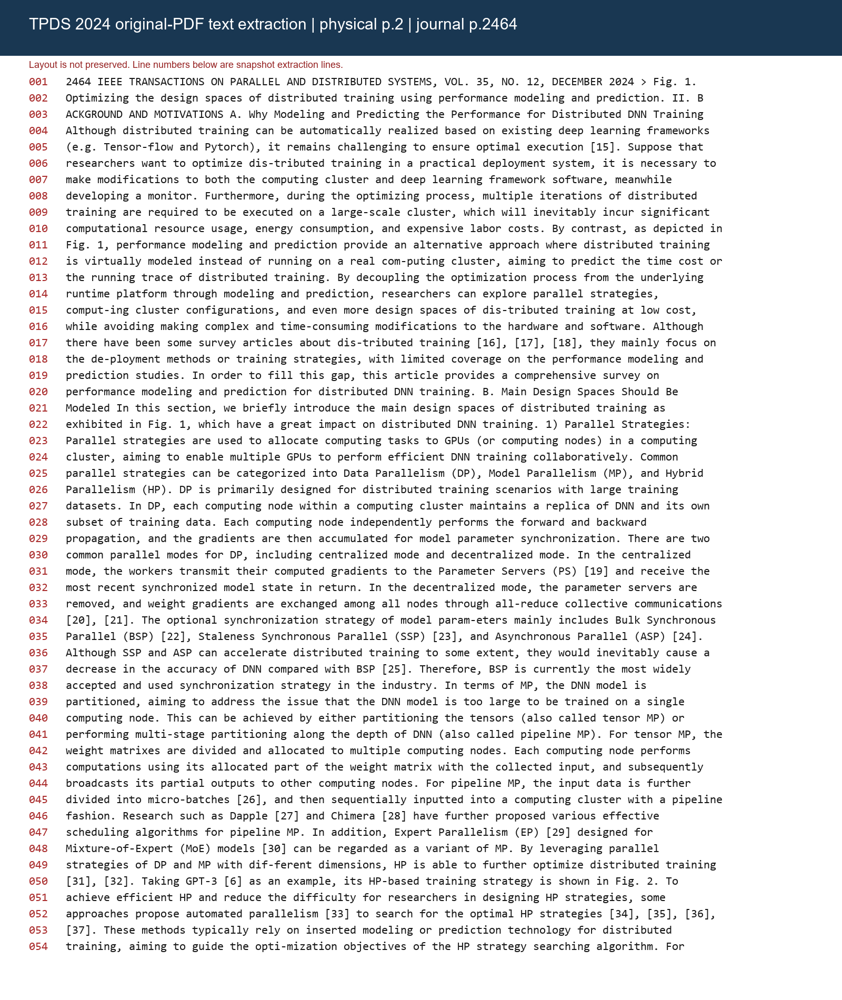

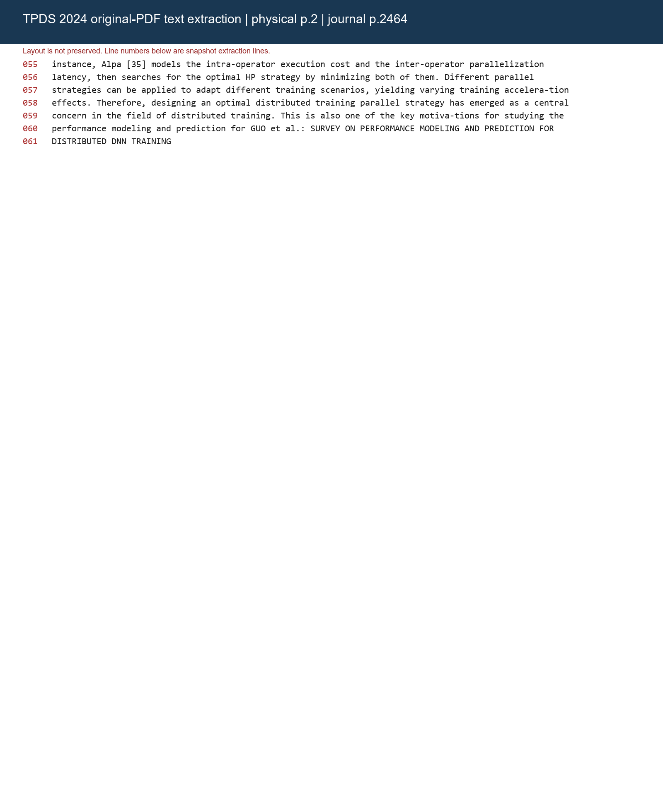

</details>

<a id="evidence-e002"></a>

<details>
<summary><strong>E002</strong> - 原笔记第 50 行 - PDF p.2, 3</summary>

<p><strong>原定位：</strong> <code>| 并行策略 | 数据并行、模型并行、流水并行，以及多维混合策略；不同切分带来计算、通信和内存差异 | PDF p.2–3 / 2464–2465，§II-B.1；Fig. 2 |</code></p>


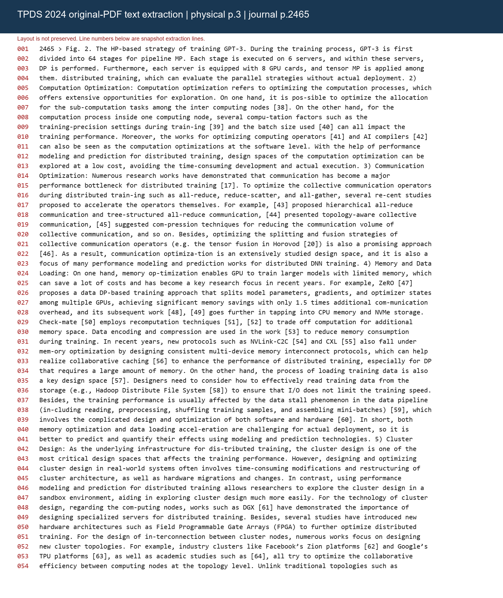

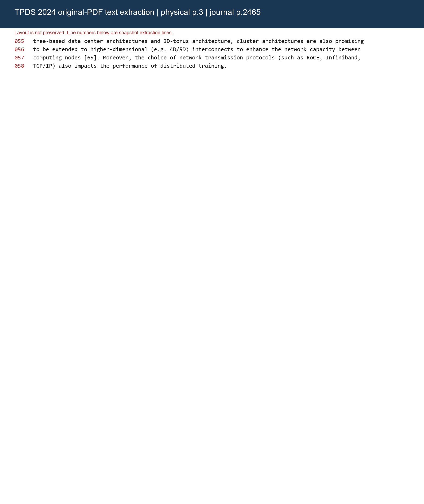

</details>

<a id="evidence-e003"></a>

<details>
<summary><strong>E003</strong> - 原笔记第 51 行 - PDF p.3</summary>

<p><strong>原定位：</strong> <code>| 计算 | 不同设备、不同算子、输入 shape、算法与 kernel 对计算时间的影响 | PDF p.3 / 2465，§II-B.2 |</code></p>


</details>

<a id="evidence-e004"></a>

<details>
<summary><strong>E004</strong> - 原笔记第 52 行 - PDF p.3, 4</summary>

<p><strong>原定位：</strong> <code>| 通信 | collective/P2P、通信算法、消息量、拓扑、带宽/时延以及计算通信重叠 | PDF p.3–4 / 2465–2466，§II-B.3；Fig. 3 |</code></p>


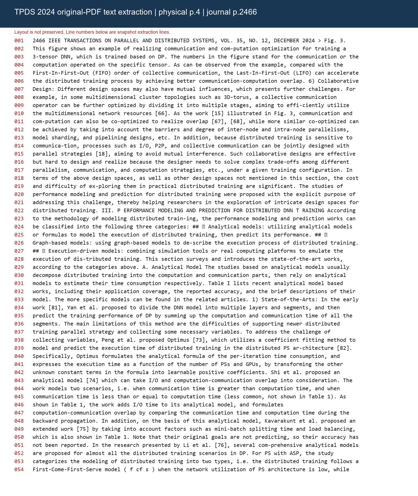

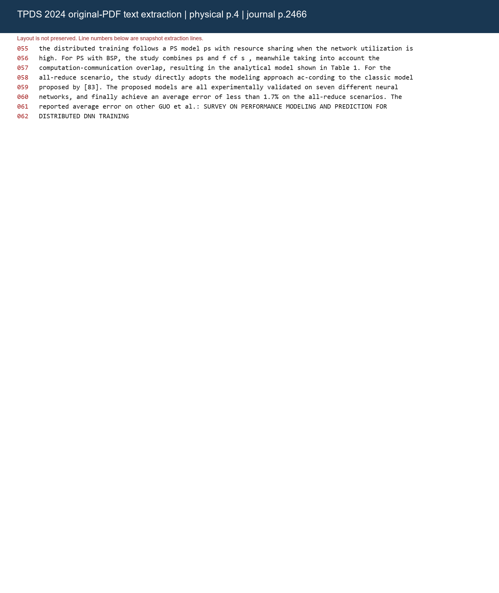

</details>

<a id="evidence-e005"></a>

<details>
<summary><strong>E005</strong> - 原笔记第 53 行 - PDF p.3, 4</summary>

<p><strong>原定位：</strong> <code>| 内存与数据加载 | 参数、激活、优化器状态、显存限制、数据读取和预处理 | PDF p.3–4 / 2465–2466，§II-B.4 |</code></p>


</details>

<a id="evidence-e006"></a>

<details>
<summary><strong>E006</strong> - 原笔记第 54 行 - PDF p.4</summary>

<p><strong>原定位：</strong> <code>| 集群设计 | 设备数量与类型、服务器与网络拓扑、异构部署 | PDF p.4 / 2466，§II-B.5 |</code></p>


</details>

<a id="evidence-e007"></a>

<details>
<summary><strong>E007</strong> - 原笔记第 55 行 - PDF p.4</summary>

<p><strong>原定位：</strong> <code>| 协同设计 | 模型、并行策略、硬件和网络之间的联合选择，而非局部最优 | PDF p.4 / 2466，§II-B.6，首句 “A collaborative design...” |</code></p>


</details>

<a id="evidence-e008"></a>

<details>
<summary><strong>E008</strong> - 原笔记第 59 行 - PDF p.1, 4</summary>

<p><strong>原定位：</strong> <code>**[论文事实]** 论文自述的贡献包括：梳理性能建模的设计空间；按方法学将已有工作分为解析、图和执行驱动三类；总结代表方法的输入、输出、支持范围、精度、开源/Profiling/运行环境要求；选择三种代表实现进行比较；给出应用和模型选择建议；讨论五类挑战与机会。定位：PDF p.1 / 2463，§I 末段，首句 “This paper presents a comprehensive survey...” 以及 PDF p.4 / 2466，§III 开头。</code></p>

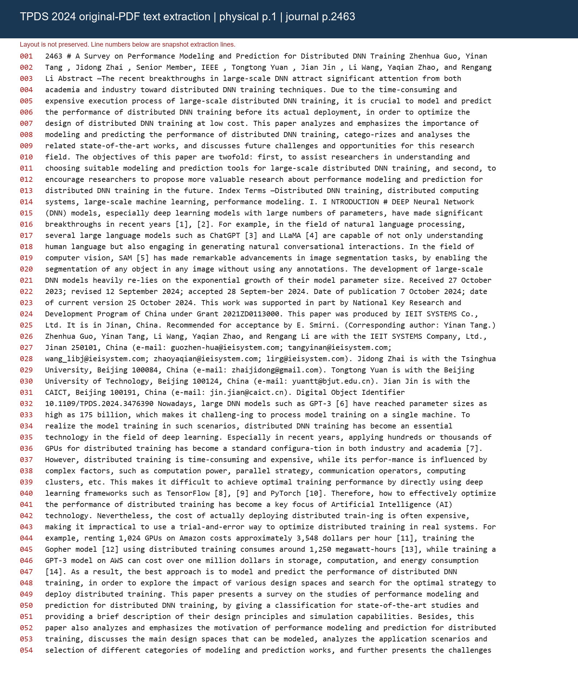

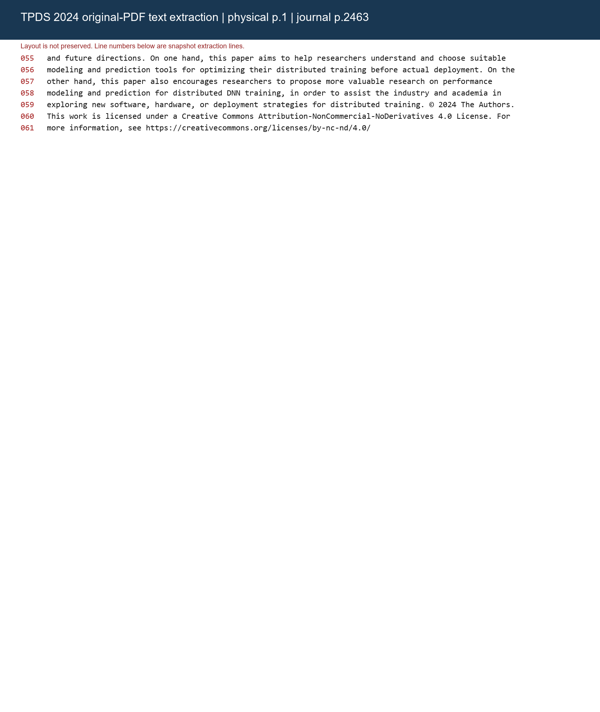


</details>

<a id="evidence-e009"></a>

<details>
<summary><strong>E009</strong> - 原笔记第 65 行 - PDF p.4</summary>

<p><strong>原定位：</strong> <code>论文在 PDF p.4 / 2466，§III 开头、首句 “According to the methodology of modeling and prediction...” 给出三类顶层定义。</code></p>


</details>

<a id="evidence-e010"></a>

<details>
<summary><strong>E010</strong> - 原笔记第 77 行 - PDF p.4</summary>

<p><strong>原定位：</strong> <code>**[论文事实]** 解析方法把训练过程分解为可用数学公式描述的部分，通常分别估算计算与通信，再根据串行、并行或重叠关系合成总时间。其具体公式往往与并行策略、框架执行方式和硬件假设绑定。定位：PDF p.4 / 2466，§III-A 开头。</code></p>


</details>

<a id="evidence-e011"></a>

<details>
<summary><strong>E011</strong> - 原笔记第 83 行 - PDF p.4, 5</summary>

<p><strong>原定位：</strong> <code>| Yan et al. [81] | 分别估算单 GPU 计算、参数服务器通信以及重叠，预测分布式训练性能 | 表 I 汇总其支持范围与实现条件 | 针对特定数据并行/PS 工作流；对更复杂并行与动态重叠扩展困难 | PDF p.4–5 / 2466–2467，§III-A.1 首段，首句 “In early work...” |</code></p>


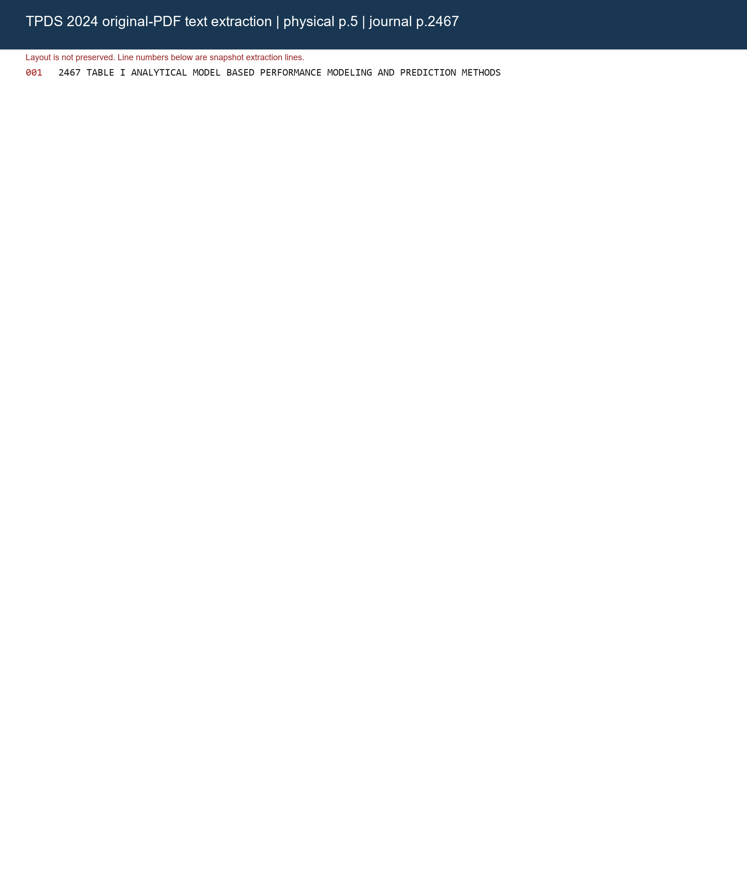

</details>

<a id="evidence-e012"></a>

<details>
<summary><strong>E012</strong> - 原笔记第 85 行 - PDF p.5, 6</summary>

<p><strong>原定位：</strong> <code>| Li et al. [76] | 对通信模式建模；论文综述称其在 7 个网络的 All-Reduce 场景平均误差小于 1.7% | 有实验验证 | 对其他数据并行场景效果“不令人满意”，作者因此又采用执行驱动方法 | PDF p.5–6 / 2467–2468，§III-A.1，首句 “In the research presented by Li...” 及 Table I |</code></p>


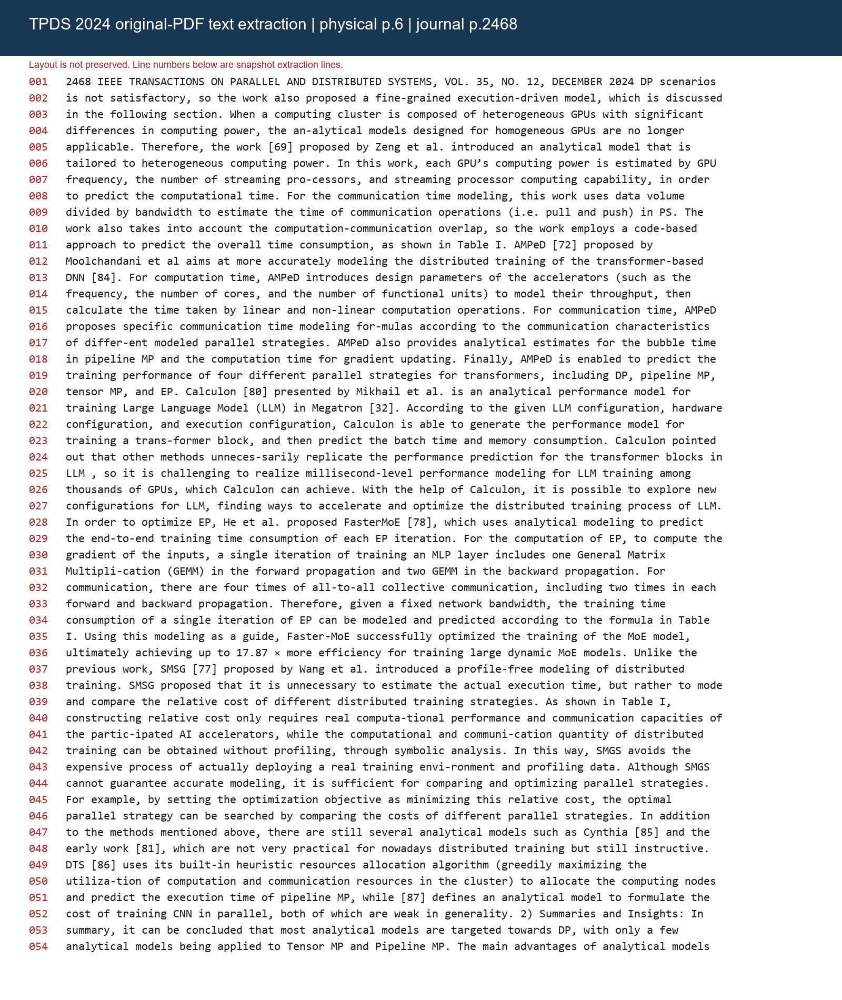

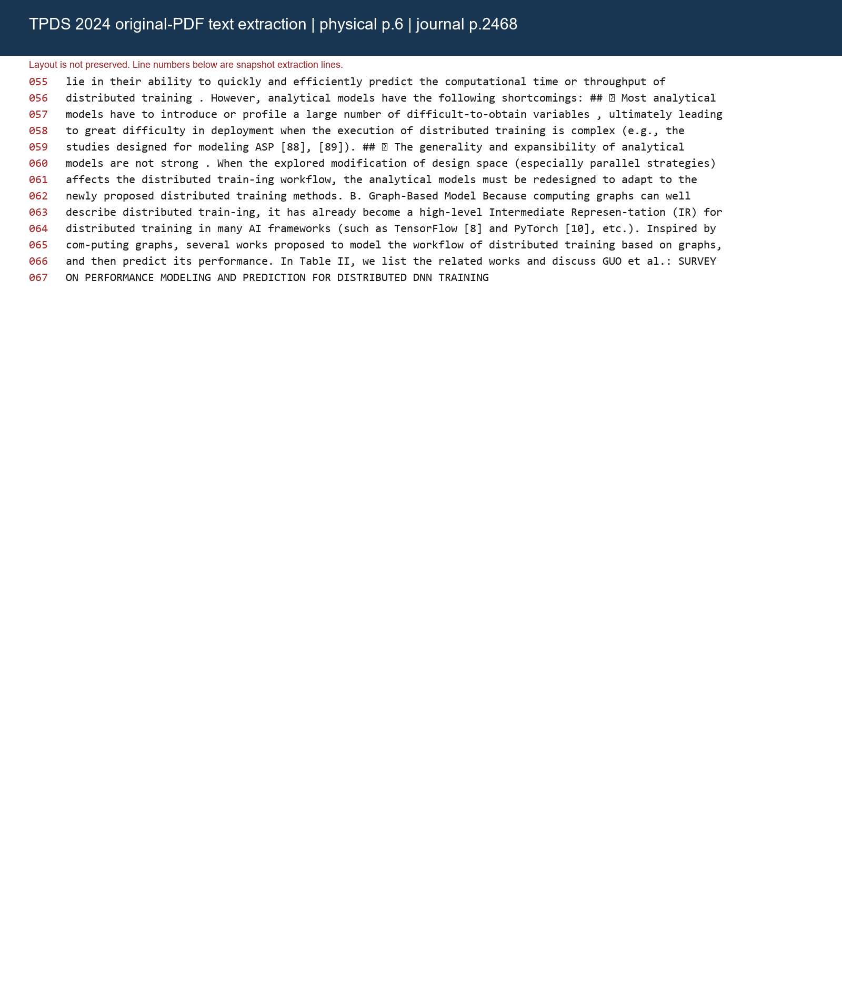

</details>

<a id="evidence-e013"></a>

<details>
<summary><strong>E013</strong> - 原笔记第 86 行 - PDF p.6</summary>

<p><strong>原定位：</strong> <code>| Zeng et al. [69] | 面向异构集群，建立设备计算、通信和同步关系的解析模型 | 被本文选作横向实验的解析代表；有可运行公开实现 | 公式依赖所建模的并行与集群假设 | PDF p.6 / 2468，首句 “When a computing cluster...” |</code></p>


</details>

<a id="evidence-e014"></a>

<details>
<summary><strong>E014</strong> - 原笔记第 87 行 - PDF p.6</summary>

<p><strong>原定位：</strong> <code>| AMPeD [72] | 预测 Transformer 的 DP、pipeline MP、tensor MP、EP 四种策略；分别建模线性/非线性计算、各策略通信、流水 bubble 和梯度更新 | 表 I 汇总实现条件 | 对新算子、调度和通信语义需补公式 | PDF p.6 / 2468，首句 “AMPeD...” |</code></p>


</details>

<a id="evidence-e015"></a>

<details>
<summary><strong>E015</strong> - 原笔记第 88 行 - PDF p.6</summary>

<p><strong>原定位：</strong> <code>| Calculon [80] | 用解析模型探索 Megatron Transformer/LLM 的多维并行和硬件/系统设计空间，预测 batch time 和内存 | 适合极大策略空间快速筛选 | 精度受抽象层级、利用率与重叠假设约束 | PDF p.6 / 2468，首句 “Calculon...” |</code></p>


</details>

<a id="evidence-e016"></a>

<details>
<summary><strong>E016</strong> - 原笔记第 89 行 - PDF p.6</summary>

<p><strong>原定位：</strong> <code>| FasterMoE [78] | 为 MoE 专家并行建立代价模型并据此优化；文中报告最高 17.87× 训练效率提升 | 有落地优化系统；17.87× 是优化后的训练效率提升，不是预测精度 | 面向特定 MoE/EP 机制，不能直接泛化为通用回放 | PDF p.6 / 2468，首句 “In order to optimize EP...” |</code></p>


</details>

<a id="evidence-e017"></a>

<details>
<summary><strong>E017</strong> - 原笔记第 90 行 - PDF p.6</summary>

<p><strong>原定位：</strong> <code>| SMSG [77] | 不直接预测绝对执行时间，而用无需 Profiling 的相对代价比较并行方案 | 规避了获取精确设备参数的困难 | 不能提供绝对端到端时间线 | PDF p.6 / 2468，首句 “Unlike the previous work...” |</code></p>


</details>

<a id="evidence-e018"></a>

<details>
<summary><strong>E018</strong> - 原笔记第 91 行 - PDF p.6</summary>

<p><strong>原定位：</strong> <code>| Cynthia、DTS、[87] | 将性能公式用于云上成本/资源与分布式训练配置搜索 | 有系统原型或实验 | 目标偏配置优化，模型完整性服从搜索需求 | PDF p.6 / 2468，首句 “In addition...” |</code></p>


</details>

<a id="evidence-e019"></a>

<details>
<summary><strong>E019</strong> - 原笔记第 95 行 - PDF p.6</summary>

<p><strong>原定位：</strong> <code>**[论文事实]** §III-A.2 总结：解析模型通常预测速度最快，适合快速扫描大规模设计空间；但公式可能包含难以获得、必须在真实机器上 Profile 的变量，通用性和可扩展性较弱，运行流程或并行策略一变就可能需要重新设计公式。定位：PDF p.6 / 2468，§III-A.2 及其两个要点。</code></p>


</details>

<a id="evidence-e020"></a>

<details>
<summary><strong>E020</strong> - 原笔记第 103 行 - PDF p.7</summary>

<p><strong>原定位：</strong> <code>**[论文事实]** 图方法用有向图描述训练工作流，节点代表计算、通信、I/O 或其他任务，边代表数据、控制或同步依赖。相较只输出一个总时间的公式，图能显式呈现执行顺序、并发、重叠和关键路径，也便于通过增删/替换节点与边进行 what-if 分析。定位：PDF p.7 / 2469，§III-B 开头。</code></p>

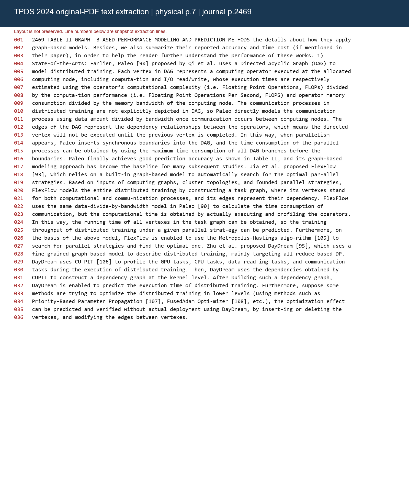

</details>

<a id="evidence-e021"></a>

<details>
<summary><strong>E021</strong> - 原笔记第 109 行 - PDF p.7</summary>

<p><strong>原定位：</strong> <code>| Paleo [90] | 从 DNN 结构生成 DAG；节点为计算或 I/O。计算时间由 FLOPs/FLOPS、内存访问/带宽等解析估计，通信由数据量/带宽估计；同步分支取最大完成时间 | 预测 DNN 训练性能，比较模型/平台 | 本综述选作图模型横向实验代表；有公开端到端代码 | 虽是图模型，节点代价仍高度解析化；不是 Trace 回放 | PDF p.7 / 2469，§III-B.1 第 1 段，首句 “Earlier, Paleo...” |</code></p>


</details>

<a id="evidence-e022"></a>

<details>
<summary><strong>E022</strong> - 原笔记第 110 行 - PDF p.7</summary>

<p><strong>原定位：</strong> <code>| FlexFlow [93] | 输入计算图、设备拓扑和并行策略，生成包含计算/通信节点的 task graph；计算代价通过 Profile，通信用数据量/带宽；用 Metropolis-Hastings 搜索策略 | 搜索低成本并行策略 | 有系统实现并用于策略搜索 | 依赖候选硬件 Profiling；任务图由框架生成，不是实测运行 Trace | PDF p.7 / 2469，第 2 段，首句 “Jia et al...” |</code></p>


</details>

<a id="evidence-e023"></a>

<details>
<summary><strong>E023</strong> - 原笔记第 111 行 - PDF p.7</summary>

<p><strong>原定位：</strong> <code>| DayDream [95] | 用 CUPTI 采集 GPU kernel、CPU、数据与通信活动，构建 kernel 级依赖图；通过修改图模拟优化 | 对已运行 workload 做细粒度 what-if，例如改变 kernel/通信/依赖 | 有原型和论文实验 | 依赖底层 Profiler 和源平台；Trace 只看到已执行路径，跨框架/硬件需重建语义与代价 | PDF p.7 / 2469，第 3 段，首句 “Zhu et al...” |</code></p>


</details>

<a id="evidence-e024"></a>

<details>
<summary><strong>E024</strong> - 原笔记第 112 行 - PDF p.8</summary>

<p><strong>原定位：</strong> <code>| dPRO [98] | Profiler 采集各 worker 的本地计算子 DFG 和全局通信子 DFG；Replayer 用 Kahn 拓扑过程回放；Optimizer 对图做 fuse/split 等变换 | 重建全局时间线并自动优化分布式训练 | 有 profiler/replayer/optimizer；文中汇总最高 3.48× 优化加速 | 全局图构建与采集开销高；图编辑正确性依赖跨 rank 通信和依赖语义 | PDF p.8 / 2470，第 1 段，首句 “Similarly, Hu...” |</code></p>

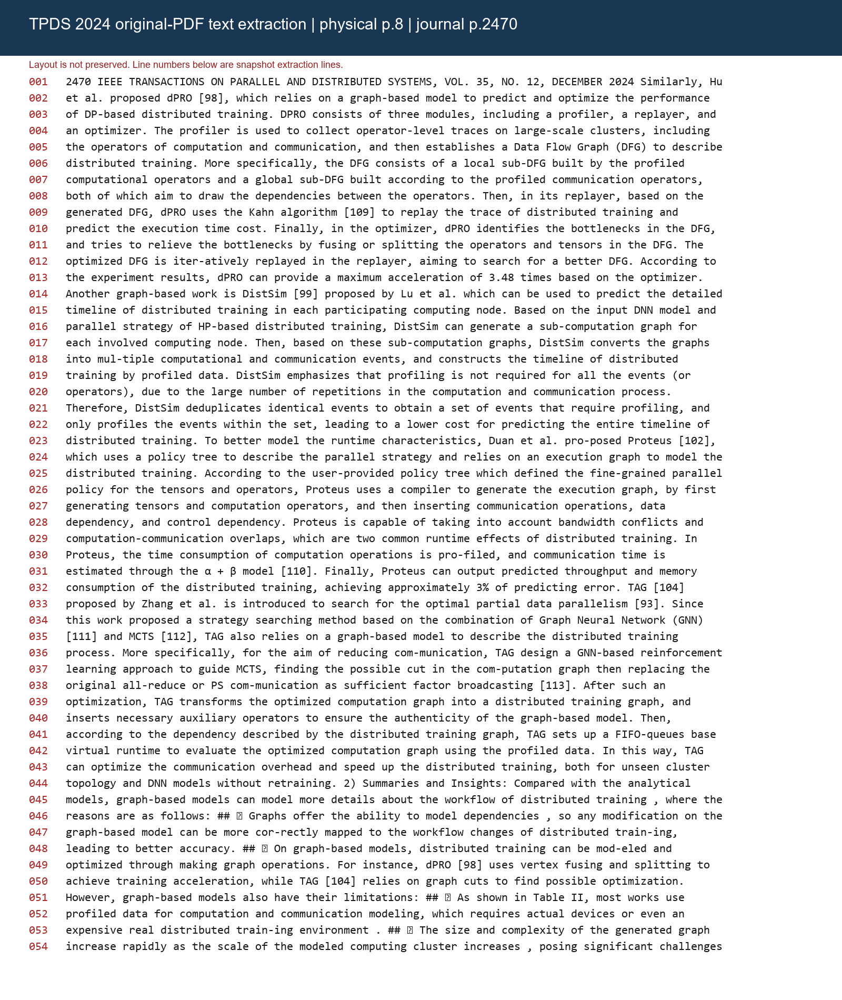

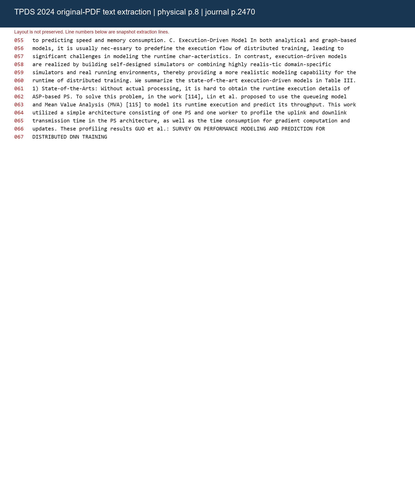

</details>

<a id="evidence-e025"></a>

<details>
<summary><strong>E025</strong> - 原笔记第 113 行 - PDF p.8</summary>

<p><strong>原定位：</strong> <code>| DistSim [99] | 由模型、超参数与并行策略生成每节点子图，再生成计算/通信事件并组合时间线；重复事件去重，只 Profile 唯一事件 | 降低分布式训练性能预测的 Profile 成本 | 有系统实现，利用事件复用加速预测 | 对重复等价性的判定和未覆盖事件的泛化敏感 | PDF p.8 / 2470，第 2 段，首句 “Another graph-based...” |</code></p>


</details>

<a id="evidence-e026"></a>

<details>
<summary><strong>E026</strong> - 原笔记第 114 行 - PDF p.8</summary>

<p><strong>原定位：</strong> <code>| Proteus [102] | 用 policy tree 表示并行策略，编译器生成执行图，包含计算/张量节点及通信、数据、控制依赖；考虑带宽冲突和重叠；计算用 Profile，通信用 alpha-beta | 同时预测吞吐与内存，评估复杂并行策略 | 论文综述称约 3% 预测误差 | 需要 Profile 计算事件；alpha-beta 对拥塞/网络动态刻画有限 | PDF p.8 / 2470，第 3 段，首句 “To better model...” |</code></p>


</details>

<a id="evidence-e027"></a>

<details>
<summary><strong>E027</strong> - 原笔记第 115 行 - PDF p.8</summary>

<p><strong>原定位：</strong> <code>| TAG [104] | 用 GNN 引导 MCTS 在计算图中选 cut，把部分 All-Reduce/PS 通信替换为 sufficient-factor broadcasting；再生成分布式训练图，用基于 FIFO 队列的虚拟运行时和 Profile 数据评估 | 面向设备拓扑的图部署与通信优化 | 有论文原型；论文称可用于未见过的拓扑和 DNN，而无需重新训练搜索模型 | 表达重点是图切分与部署优化，不等同于实测 Trace 的因果回放 | PDF p.8 / 2470，第 4 段 |</code></p>


</details>

<a id="evidence-e028"></a>

<details>
<summary><strong>E028</strong> - 原笔记第 119 行 - PDF p.8</summary>

<p><strong>原定位：</strong> <code>**[论文事实]** §III-B.2 认为图模型能自然表达节点依赖，便于分析计算/通信重叠及通过图修改评估优化；缺点是许多方法仍要在真实硬件上 Profile 节点时间，图的大小和处理复杂度会随模型与集群规模快速上升。定位：PDF p.8 / 2470，§III-B.2。</code></p>


</details>

<a id="evidence-e029"></a>

<details>
<summary><strong>E029</strong> - 原笔记第 133 行 - PDF p.8</summary>

<p><strong>原定位：</strong> <code>**[论文事实]** 执行驱动模型让一个定制模拟器、组合模拟器或真实软件平台按照事件与依赖推进“虚拟执行”，而不是只对公式求值或在静态图上简单累计。它能插入更详细的队列、网络、设备和运行时模型。定位：PDF p.8 / 2470，§III-C 开头，首句 “In both analytical...” 及 Table III。</code></p>


</details>

<a id="evidence-e030"></a>

<details>
<summary><strong>E030</strong> - 原笔记第 139 行 - PDF p.9</summary>

<p><strong>原定位：</strong> <code>| [114]、[116]、Li et al. [76] | 分别使用排队网络/平均值分析、离散事件等方式模拟参数服务器或数据并行训练；部分计算/通信代价来自 Profile，并对 gRPC 等环境作修正 | 预测特定分布式训练运行时间与扩展性 | 有研究原型/实验 | 多面向特定框架和 DP/PS，离“全栈通用模拟”仍有距离 | PDF p.9 / 2471，§III-C.1 第 1 段 |</code></p>

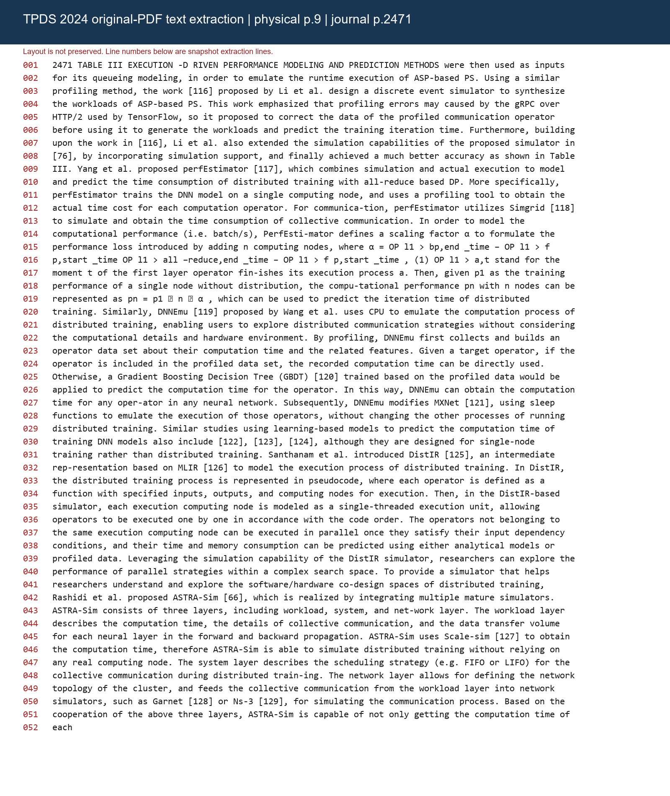

</details>

<a id="evidence-e031"></a>

<details>
<summary><strong>E031</strong> - 原笔记第 140 行 - PDF p.9</summary>

<p><strong>原定位：</strong> <code>| Perfestimator [117] | 单节点 Profile 计算时间，通信由 SimGrid 模拟；用缩放参数校准模拟时间 | 预测不同集群规模下的数据并行训练 | 组合真实 Profile 与网络模拟 | 对 Profile 平台和缩放假设敏感 | PDF p.9 / 2471，首句 “Yang et al...” |</code></p>


</details>

<a id="evidence-e032"></a>

<details>
<summary><strong>E032</strong> - 原笔记第 141 行 - PDF p.9</summary>

<p><strong>原定位：</strong> <code>| DNNEmu [119] | 先 Profile 算子数据集；见过的配置查表，未见配置用 GBDT 预测；修改 MXNet，以 sleep 模拟计算耗时，同时保留其他真实框架过程 | 在较少真实计算成本下仿真端到端分布式训练 | 有修改后的框架原型；是“查表+ML+执行驱动”的典型混合 | sleep 不能复现真实设备资源占用与 kernel 并发；模型迁移需新数据 | PDF p.9 / 2471，首句 “Similarly, DNNEmu...” |</code></p>


</details>

<a id="evidence-e033"></a>

<details>
<summary><strong>E033</strong> - 原笔记第 143 行 - PDF p.9</summary>

<p><strong>原定位：</strong> <code>| DistIR [125] | 用基于 MLIR 的 IR 表示分布式程序；各设备按依赖单线程执行，不同设备可并行；节点代价可解析或 Profile | 预测时间和内存，评估分布式策略 | 有 IR 与模拟器实现 | 结果受 IR 是否覆盖真实框架调度以及代价函数质量限制 | PDF p.9 / 2471，首句 “Santhanam et al...” |</code></p>


</details>

<a id="evidence-e034"></a>

<details>
<summary><strong>E034</strong> - 原笔记第 144 行 - PDF p.9, 10</summary>

<p><strong>原定位：</strong> <code>| ASTRA-Sim [66] | workload、system、network 三层。workload 提供逐层计算时间、collective、数据量；计算可接 Scale-Sim；system 负责通信调度 FIFO/LIFO；network 可接 Garnet/ns-3 并描述拓扑 | 输出逐层计算、详细通信和瓶颈，联合研究 DNN/系统/网络 | 开源且被本文选作执行驱动代表；ASTRA-Sim 2.0 加入 Trace 驱动、解析网络、内存模型和更多拓扑 | 高保真后端很慢；输入计算时间和 workload 语义仍需外部提供；不同后端精度不一致 | PDF p.9–10 / 2471–2472，首句 “To provide a simulator...” |</code></p>


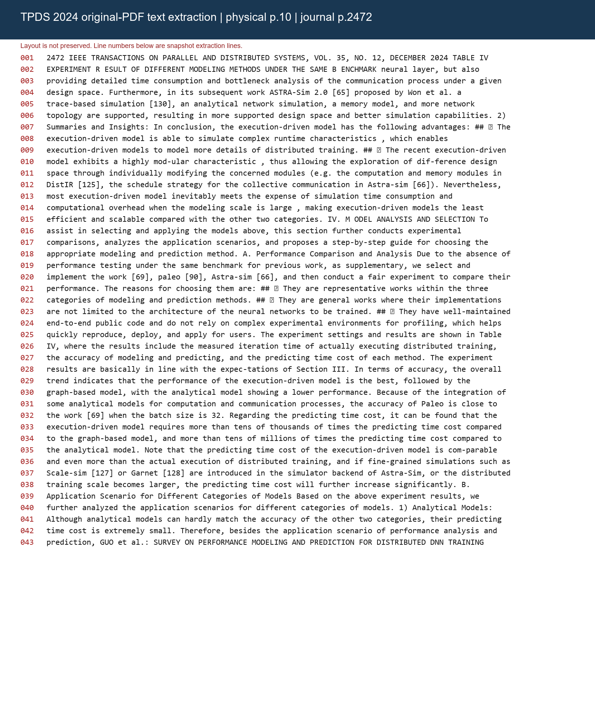

</details>

<a id="evidence-e035"></a>

<details>
<summary><strong>E035</strong> - 原笔记第 148 行 - PDF p.10</summary>

<p><strong>原定位：</strong> <code>**[论文事实]** §III-C.2 认为执行驱动方法更适合复现复杂运行时过程，且模块化地替换计算、通信或网络后端；代价是运行开销最大、速度最慢、扩展到大模型和大集群最困难。定位：PDF p.10 / 2472，§III-C.2。</code></p>


</details>

<a id="evidence-e036"></a>

<details>
<summary><strong>E036</strong> - 原笔记第 214 行 - PDF p.10</summary>

<p><strong>原定位：</strong> <code>**[论文事实]** 作者从三类方法中各选择一个代表：Zeng et al. [69]（解析）、Paleo [90]（图）、ASTRA-Sim [66]（执行驱动）。选择理由是它们提供维护较好的端到端公开代码，并且不要求复杂的 Profiling 环境。定位：PDF p.10 / 2472，§IV-A 第 1–2 段及 Table IV。</code></p>


</details>

<a id="evidence-e037"></a>

<details>
<summary><strong>E037</strong> - 原笔记第 216 行 - PDF p.10</summary>

<p><strong>原定位：</strong> <code>实验平台为两台服务器、NVIDIA Quadro RTX 4000 GPU、1 GbE；Ubuntu 18.04、Python 3.7、CUDA 10.2；图像输入为 ImageNet 的 `3×224×224`。定位：PDF p.10 / 2472，Table IV 及相邻正文。</code></p>


</details>

<a id="evidence-e038"></a>

<details>
<summary><strong>E038</strong> - 原笔记第 227 行 - PDF p.10, 11</summary>

<p><strong>原定位：</strong> <code>定位：PDF p.10–11 / 2472–2473，§IV-A Table IV 后的结果讨论。</code></p>


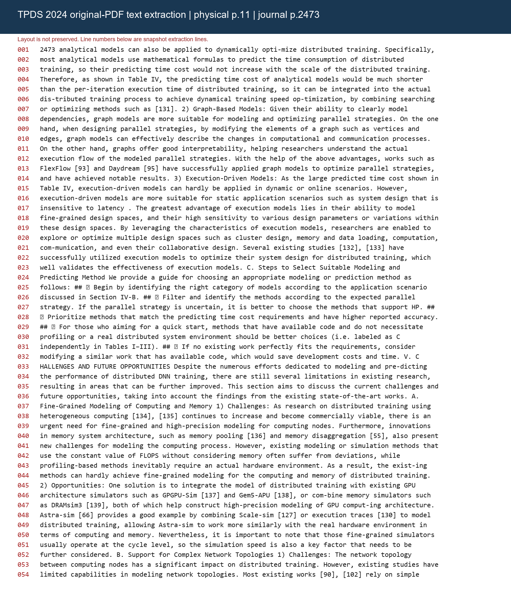

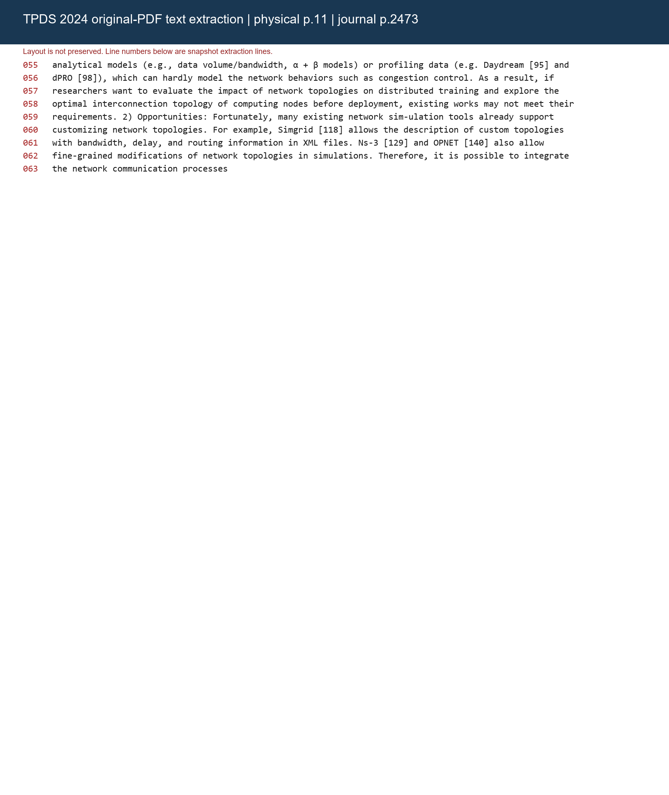

</details>

<a id="evidence-e039"></a>

<details>
<summary><strong>E039</strong> - 原笔记第 252 行 - PDF p.11</summary>

<p><strong>原定位：</strong> <code>**[论文事实]** §IV-C 给出五步建议：先按应用场景确定大类；再按并行策略、超参数和目标范围过滤；综合预测时间与精度；优先考虑有代码、少 Profiling、少真实环境依赖的模型；若没有完全匹配的方法，可基于最相近的开放实现修改。定位：PDF p.11 / 2473，§IV-C 五个要点。</code></p>


</details>

<a id="evidence-e040"></a>

<details>
<summary><strong>E040</strong> - 原笔记第 260 行 - PDF p.11</summary>

<p><strong>原定位：</strong> <code>定位：PDF p.11 / 2473，§IV-B.1–3。</code></p>


</details>

<a id="evidence-e041"></a>

<details>
<summary><strong>E041</strong> - 原笔记第 266 行 - PDF p.11, 12</summary>

<p><strong>原定位：</strong> <code>| 计算与内存建模 | 只用固定 FLOPS 会忽略内存与数据移动；实测又依赖目标硬件。可接 GPGPU-Sim、Gem5-APU、DRAMsim3，ASTRA-Sim 可接 Scale-Sim/Trace，但 cycle-level 模拟很慢 | 为关键 kernel/内存状态保留高保真后端；普通重复算子不必全部 cycle-level | PDF p.11–12 / 2473–2474，§V-A |</code></p>


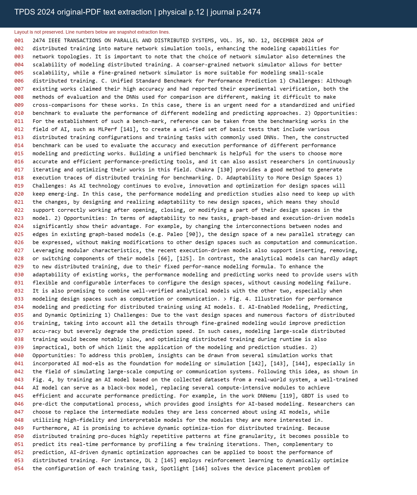

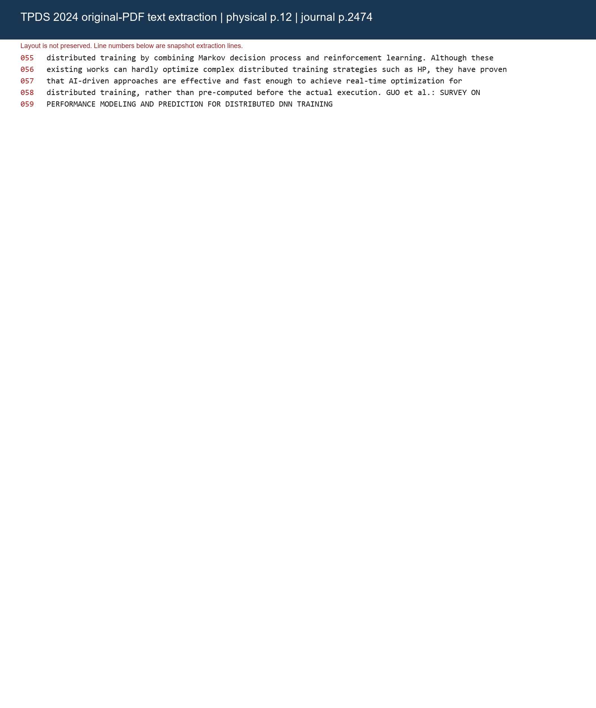

</details>

<a id="evidence-e042"></a>

<details>
<summary><strong>E042</strong> - 原笔记第 267 行 - PDF p.12</summary>

<p><strong>原定位：</strong> <code>| 网络建模 | alpha-beta 和历史 Trace 难以表示拥塞；可接 SimGrid、ns-3、OPNET，但同样有精度—速度权衡 | 通信不能只回放一个 duration；应重建消息、依赖、到达与拓扑竞争 | PDF p.12 / 2474，§V-B |</code></p>


</details>

<a id="evidence-e043"></a>

<details>
<summary><strong>E043</strong> - 原笔记第 268 行 - PDF p.12</summary>

<p><strong>原定位：</strong> <code>| 统一 Benchmark | 现有论文的 DNN、硬件和评价指标不同，难横比；建议 MLPerf 式套件，并提到 Chakra Trace | 项目需要固定 workload、capacity、路径和状态指标，并保存可交换 Trace/Recipe | PDF p.12 / 2474，§V-C |</code></p>


</details>

<a id="evidence-e044"></a>

<details>
<summary><strong>E044</strong> - 原笔记第 269 行 - PDF p.12</summary>

<p><strong>原定位：</strong> <code>| 适应新设计空间 | 图和执行驱动较模块化；固定解析公式适应性差；可组合经过验证的解析子模型 | 把语义、物理绑定和节点代价解耦，允许替换局部模型 | PDF p.12 / 2474，§V-D |</code></p>


</details>

<a id="evidence-e045"></a>

<details>
<summary><strong>E045</strong> - 原笔记第 270 行 - PDF p.12, 13</summary>

<p><strong>原定位：</strong> <code>| AI 辅助建模 | 用 AI 黑盒替代计算昂贵或非研究重点的模块；DNNEmu 的 GBDT 是例子；也可从少量迭代学习动态优化策略，但高维超参数困难 | 建议多保真混合：关键状态和通信显式模拟，低风险事件用学习模型 | PDF p.12–13 / 2474–2475，§V-E |</code></p>


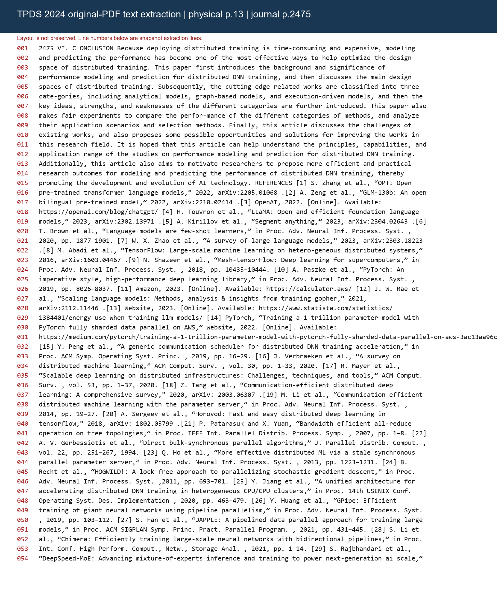

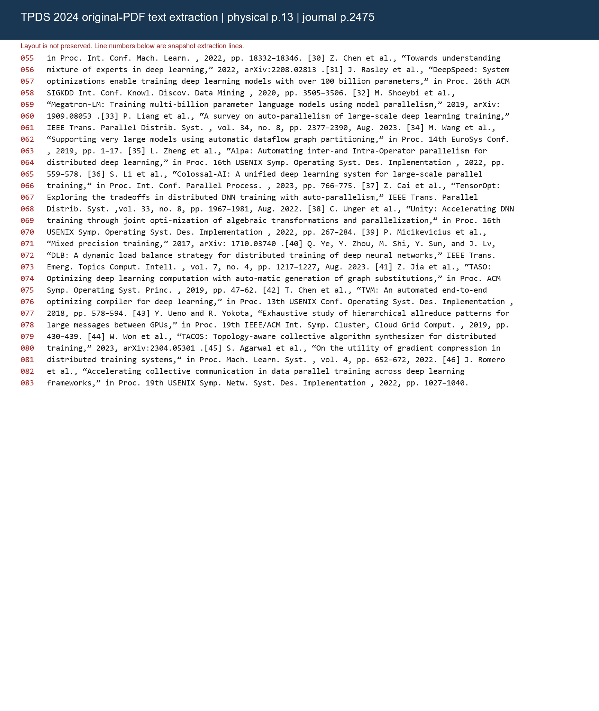

</details>

<a id="evidence-e046"></a>

<details>
<summary><strong>E046</strong> - 原笔记第 369 行 - PDF p.1</summary>

<p><strong>原定位：</strong> <code>| 论文目标与贡献 | PDF p.1 / 2463，Abstract；§I 末段 “This paper presents...” |</code></p>


</details>

<a id="evidence-e047"></a>

<details>
<summary><strong>E047</strong> - 原笔记第 370 行 - PDF p.2</summary>

<p><strong>原定位：</strong> <code>| 性能预测动机与 Fig. 1 | PDF p.2 / 2464，§II-A 第 1 段 |</code></p>


</details>

<a id="evidence-e048"></a>

<details>
<summary><strong>E048</strong> - 原笔记第 371 行 - PDF p.2, 3, 4</summary>

<p><strong>原定位：</strong> <code>| 六类设计空间 | PDF p.2–4 / 2464–2466，§II-B.1–6；Fig. 2、Fig. 3 |</code></p>


</details>

<a id="evidence-e049"></a>

<details>
<summary><strong>E049</strong> - 原笔记第 372 行 - PDF p.4</summary>

<p><strong>原定位：</strong> <code>| 三类方法定义 | PDF p.4 / 2466，§III 开头首段及三项列举 |</code></p>


</details>

<a id="evidence-e050"></a>

<details>
<summary><strong>E050</strong> - 原笔记第 373 行 - PDF p.4, 5, 6</summary>

<p><strong>原定位：</strong> <code>| 解析模型与 Table I | PDF p.4–6 / 2466–2468，§III-A；Table I 跨 p.5–6 |</code></p>


</details>

<a id="evidence-e051"></a>

<details>
<summary><strong>E051</strong> - 原笔记第 374 行 - PDF p.6</summary>

<p><strong>原定位：</strong> <code>| 解析模型优缺点 | PDF p.6 / 2468，§III-A.2 |</code></p>


</details>

<a id="evidence-e052"></a>

<details>
<summary><strong>E052</strong> - 原笔记第 375 行 - PDF p.7, 8</summary>

<p><strong>原定位：</strong> <code>| 图模型与 Table II | PDF p.7–8 / 2469–2470，§III-B；Table II 在 p.7 |</code></p>


</details>

<a id="evidence-e053"></a>

<details>
<summary><strong>E053</strong> - 原笔记第 376 行 - PDF p.7</summary>

<p><strong>原定位：</strong> <code>| Paleo/FlexFlow/DayDream | PDF p.7 / 2469，§III-B.1 前 3 段 |</code></p>


</details>

<a id="evidence-e054"></a>

<details>
<summary><strong>E054</strong> - 原笔记第 377 行 - PDF p.8</summary>

<p><strong>原定位：</strong> <code>| dPRO/DistSim/Proteus/TAG | PDF p.8 / 2470，§III-B.1 后续段落 |</code></p>


</details>

<a id="evidence-e055"></a>

<details>
<summary><strong>E055</strong> - 原笔记第 378 行 - PDF p.8</summary>

<p><strong>原定位：</strong> <code>| 图模型优缺点 | PDF p.8 / 2470，§III-B.2 |</code></p>


</details>

<a id="evidence-e056"></a>

<details>
<summary><strong>E056</strong> - 原笔记第 379 行 - PDF p.8, 9, 10</summary>

<p><strong>原定位：</strong> <code>| 执行驱动定义与 Table III | PDF p.8–10 / 2470–2472，§III-C；Table III 在 p.9 |</code></p>


</details>

<a id="evidence-e057"></a>

<details>
<summary><strong>E057</strong> - 原笔记第 380 行 - PDF p.9</summary>

<p><strong>原定位：</strong> <code>| Perfestimator/DNNEmu/DistIR | PDF p.9 / 2471，§III-C.1 |</code></p>


</details>

<a id="evidence-e058"></a>

<details>
<summary><strong>E058</strong> - 原笔记第 381 行 - PDF p.9, 10</summary>

<p><strong>原定位：</strong> <code>| ASTRA-Sim/2.0 | PDF p.9–10 / 2471–2472，§III-C.1 “To provide a simulator...” |</code></p>


</details>

<a id="evidence-e059"></a>

<details>
<summary><strong>E059</strong> - 原笔记第 382 行 - PDF p.10</summary>

<p><strong>原定位：</strong> <code>| 执行驱动优缺点 | PDF p.10 / 2472，§III-C.2 |</code></p>


</details>

<a id="evidence-e060"></a>

<details>
<summary><strong>E060</strong> - 原笔记第 383 行 - PDF p.10, 11</summary>

<p><strong>原定位：</strong> <code>| 三代表横评与 Table IV | PDF p.10–11 / 2472–2473，§IV-A；Table IV 在 p.10 |</code></p>


</details>

<a id="evidence-e061"></a>

<details>
<summary><strong>E061</strong> - 原笔记第 384 行 - PDF p.11</summary>

<p><strong>原定位：</strong> <code>| 三类应用 | PDF p.11 / 2473，§IV-B.1–3 |</code></p>


</details>

<a id="evidence-e062"></a>

<details>
<summary><strong>E062</strong> - 原笔记第 385 行 - PDF p.11</summary>

<p><strong>原定位：</strong> <code>| 五步选择建议 | PDF p.11 / 2473，§IV-C |</code></p>


</details>

<a id="evidence-e063"></a>

<details>
<summary><strong>E063</strong> - 原笔记第 386 行 - PDF p.11, 12</summary>

<p><strong>原定位：</strong> <code>| 计算/内存挑战 | PDF p.11–12 / 2473–2474，§V-A |</code></p>


</details>

<a id="evidence-e064"></a>

<details>
<summary><strong>E064</strong> - 原笔记第 387 行 - PDF p.12</summary>

<p><strong>原定位：</strong> <code>| 网络挑战 | PDF p.12 / 2474，§V-B |</code></p>


</details>

<a id="evidence-e065"></a>

<details>
<summary><strong>E065</strong> - 原笔记第 388 行 - PDF p.12</summary>

<p><strong>原定位：</strong> <code>| 统一 benchmark/Chakra | PDF p.12 / 2474，§V-C |</code></p>


</details>

<a id="evidence-e066"></a>

<details>
<summary><strong>E066</strong> - 原笔记第 389 行 - PDF p.12</summary>

<p><strong>原定位：</strong> <code>| 新设计空间与模块化 | PDF p.12 / 2474，§V-D |</code></p>


</details>

<a id="evidence-e067"></a>

<details>
<summary><strong>E067</strong> - 原笔记第 390 行 - PDF p.12, 13</summary>

<p><strong>原定位：</strong> <code>| AI 辅助建模 | PDF p.12–13 / 2474–2475，§V-E |</code></p>


</details>

<a id="evidence-e068"></a>

<details>
<summary><strong>E068</strong> - 原笔记第 391 行 - PDF p.13</summary>

<p><strong>原定位：</strong> <code>| 结论 | PDF p.13 / 2475，§VI |</code></p>


</details>

<!-- EVIDENCE_SCREENSHOTS:END -->
