# Daydream：基于 kernel 依赖图的 DNN 优化 what-if 回放

> 证据截图说明：正文中的 `原文截图 E###` 可跳转到文末证据卡片。截图按 PDF 物理页码生成；原有章节、图表、算法和段落定位保持不变。

## 0. 文献与证据口径

- 论文：Hongyu Zhu, Amar Phanishayee, Gennady Pekhimenko, **Daydream: Accurately Estimating the Efficacy of Optimizations for DNN Training**，USENIX ATC 2020。
- 官方页面：<https://www.usenix.org/conference/atc20/presentation/zhu-hongyu>
- 作者版 PDF：<https://www.cs.utoronto.ca/~pekhimenko/Papers/Daydream-ATC_20.pdf>
- 本地原文：[daydream.pdf](sources/daydream.pdf)
- 版本：USENIX ATC 2020 终稿；本地 PDF 共 16 页。
- 页码约定：下文“PDF p.N”按 PDF 阅读器从 1 开始计数；该版本印刷页为 337–352，因此 `PDF p.N = 印刷页 336+N`。例如 PDF p.5 对应印刷页 341。
- 证据类型：标成“论文事实”的内容可在所列页/节/图表定位；“本文归纳/推断”是结合本项目录制回放目标做的分析，不冒充论文结论。

## 1. 一句话定位

Daydream 把一次真实训练迭代采成 CPU/CUDA/GPU/通信任务，在 kernel 粒度构造依赖图；用户通过缩放、插入、删除、替换和重排节点描述潜在优化，再用离散事件式拓扑回放估计新的端到端迭代时间。它解决的是“尚未完整实现优化前，能否预测其性能收益”，不是恢复相同张量、随机数或训练状态的功能性录制回放。

证据：摘要与 §1，PDF pp.1–2；系统流程见 §4.1、Figure 2，PDF p.5；模拟算法见 Algorithm 1，PDF p.5。 〔[原文截图 E001](#evidence-e001)〕

## 2. 要解决的问题

### 2.1 背景问题

论文指出，优化效果会随模型、GPU、内存、网络、软件版本发生显著变化，而真正实现每一种优化再测量既昂贵又易错。因此系统目标是回答诸如：混合精度是否有用、kernel fusion 能快多少、网络升级是否值得、扩 GPU 后如何伸缩等 what-if 问题。

- 论文事实：一般问题与典型 what-if 问题见 §1 第 3–5 段，PDF p.1。 〔[原文截图 E002](#evidence-e002)〕
- 论文事实：普通 profiler 只能解释已经发生的时间线，不能直接预测尚未实现的优化；见摘要和 §1，PDF pp.1–2。 〔[原文截图 E003](#evidence-e003)〕

### 2.2 三个设计要求

1. 必须到 kernel 粒度，因为混合精度、融合和底层 kernel 重写会改变单个 GPU kernel；同时仍要保留 CPU 时间。
2. 必须把低层 task 映射回 DNN layer，才能用模型语义选择和变换节点。
3. 必须提供足够通用的图变换原语，覆盖持续时间变化、节点增删、通信替换和调度改变。

证据：§1 “First/Second/Third” 三段，PDF p.2；Table 1 汇总被讨论的优化类别，PDF p.3。 〔[原文截图 E004](#evidence-e004)〕

## 3. 方法与框架

### 3.1 四阶段工作流

Daydream 的流水线是：

1. **Trace collection**：采集一次或少量训练迭代的低层 CPU/GPU 时间线，并增加框架/模型语义标注。
2. **Dependency graph construction**：将 task 变成节点，将程序序、launch、同步和通信因果变成边。
3. **Graph transformation**：以简单原语表达待评估优化。
4. **Runtime simulation**：在变换后的图上按资源可用时间与依赖完成时间推进，输出新时间线和迭代时间。

证据：§4.1、Figure 2，PDF p.5。 〔[原文截图 E005](#evidence-e005)〕

### 3.2 采集了什么，粒度多细

每个 task 至少包含：执行线程/stream、持续时间、与前一 task 的 gap、所属 DNN layer。主要 task 类型为：

- GPU kernel 与 memcpy；
- CPU 侧 CUDA API；
- CPU gap，用来承载未被 CUDA API 覆盖的数据加载、框架开销等 CPU 时间；
- 分布式场景下的通信原语。

GPU 侧最小单元是单个 kernel；CPU 和 GPU 都进入统一图。CUPTI 提供 CUDA API、GPU 活动及其 correlation ID。Daydream 另外在 forward、backward、update 的 layer 边界放置 instrumentation，再通过 CPU API 与 GPU kernel 的相关关系完成 layer 映射，避免每层强制同步。

证据：§4.2 “Tasks”和 §4.3 “Mapping Tasks to DNN Layers”，PDF pp.5–6；kernel 粒度的必要性见 §1，PDF p.2。 〔[原文截图 E006](#evidence-e006)〕

### 3.3 依赖图怎样构造

核心边包括：

- 同一 CPU thread 上相邻 CPU task 的程序序；
- 同一 GPU stream 上相邻 GPU task 的 stream 顺序；
- CPU CUDA launch 到相应 GPU kernel 的边，依据 CUPTI correlation ID；
- CUDA synchronization 引出的 GPU→CPU 边；
- 梯度就绪、bucket 映射和通信语义引出的计算→通信依赖；
- 在通信调度模型中，通信资源的串行/优先级约束。

作者的关键简化是：虽然 task 数量可达数千，但 DNN 训练通常只使用很少的 CPU threads 和 GPU streams，且每条执行线程内部高度串行，因此只需识别有限的跨线程依赖。

证据：§1 贡献第 1 点，PDF p.2；§3 设计观察，PDF p.4；§4.2，PDF pp.5–6。 〔[原文截图 E007](#evidence-e007)〕

### 3.4 离散事件回放

Algorithm 1 对 DAG 做类似拓扑排序的回放：维护 ready/frontier；选择依赖已经满足的 task；其开始时间取“所属执行资源当前时间”和“全部前驱完成时间”的最大值，再加原始或变换后的 duration/gap；完成后释放后继。每个 CPU thread、GPU stream 和通信通道都可视作有独立进度的执行资源。

这意味着回放重建的是**偏序约束下的一条可行时间线**，而不是照抄原始绝对时间戳。对重叠的处理来自图边和资源队列，而不是先验地把 compute time 与 communication time 相加。

- 论文事实：算法与 task 选择规则见 §4.1、Algorithm 1，PDF p.5。 〔[原文截图 E008](#evidence-e008)〕
- 本文归纳：这是典型的离散事件/资源约束调度语义；论文使用 simulation 表述，但其时间推进方式具备 DES 特征。

### 3.5 图变换原语

论文提供的基本操作包括：

- 按比例缩短/放大 task duration；
- 插入或删除 task；
- 按 layer、task 名称等属性选择节点；
- 覆盖默认调度/优先级；
- 组合上述操作替换一段子图。

证据：§4.4，PDF pp.6–7。 〔[原文截图 E009](#evidence-e009)〕

## 4. 如何建模计算、通信、重叠与框架开销

### 4.1 计算

基线计算 kernel 的持续时间直接来自被测机器 trace。已存在 kernel 的 what-if 通常通过倍率缩放；新的 fused kernel 可用已有相关 kernel 时长之和近似，或由用户外部给定。论文并未提出通用的新 kernel 性能预测器。

- AMP：把计算密集 kernel 约缩短为 1/3、memory-bound kernel 约缩短为 1/2。
- FusedAdam：删除原有权重更新 CPU/GPU task，插入一个 fused kernel；其时长用被融合 compute kernels 的总和近似。
- reconstructed batch normalization：删除/融合相关 task，并对部分 kernel 应用经验倍率。

证据：§5.1–§5.3，PDF pp.7–8。 〔[原文截图 E010](#evidence-e010)〕

### 4.2 通信

Daydream 可从单 worker profile 出发，根据梯度大小、通信类型、带宽以及额外采集的 gradient-to-bucket 映射插入分布式通信 task。PyTorch 数据并行场景用每个梯度 bucket 一个 all-reduce；P3 则把梯度切片成 push/pull task，以消息大小/带宽估时并用优先级调度。

证据：§4.2 的 distributed tasks，PDF p.6；§5.4–§5.5，PDF pp.7–8。 〔[原文截图 E011](#evidence-e011)〕

通信模型的明显边界是：默认持续时间偏解析/经验，不能自动复现 NCCL 内部 chunk、channel、链路争用与跨 rank 到达时间。论文后来通过显式同步实验说明，并发资源争用会使真实 NCCL 比“独占通信”的估计更慢。

证据：§6.4 对 NCCL contention 的分析，PDF pp.10–11。 〔[原文截图 E012](#evidence-e012)〕

### 4.3 计算—通信重叠

重叠由 DAG 依赖、GPU stream/CPU thread/通信资源的独立进度自然产生；改变通信调度或依赖后，关键路径也随之改变。Daydream 的强项正是避免只对各类耗时做标量相加。

但 CUPTI 在并发 kernel profiling 时可能序列化 kernel，作者承认这会令估计偏保守。

证据：§3、§4；限制讨论见 §7，PDF p.12。 〔[原文截图 E013](#evidence-e013)〕

### 4.4 框架与 host 开销

CUDA API 是显式 CPU task；CUDA API 之间的 gap 代表 Python、框架、数据加载等未细分 host 时间。它能保留这部分时间对端到端关键路径的影响，但通常不能解释 gap 内部发生了什么，也不支持把其中的控制流和状态迁移到新拓扑后重新求值。

证据：§4.2 “CPU Tasks and Gaps”，PDF p.5。 〔[原文截图 E014](#evidence-e014)〕

## 5. 校准输入与数据依赖

基线必需输入：

- 在目标或相近软硬件上采集的 CUPTI CPU/GPU trace；
- CUDA launch/kernel correlation、thread/stream、同步信息；
- 框架/模型 layer 边界 instrumentation；
- 分布式变换时的参数/梯度大小、bucket 映射、网络带宽或通信实测；
- 新 kernel 或新通信方案的外部时长假设。

它依赖**目标机器上的一次真实执行**来获得基线 task duration。可由单 GPU 生成某些多 worker 场景，但越偏离原始执行，越需要用户提供新的 duration 与结构假设。

证据：§4.2–§4.3，PDF pp.5–6；§5，PDF pp.7–9。 〔[原文截图 E015](#evidence-e015)〕

## 6. 支持的 what-if

论文展示或说明可表达：

- 混合精度；
- kernel/layer fusion，包括 FusedAdam、MetaFlow；
- 低层 kernel 重写，例如 reconstructed batch norm；
- vDNN/Gist 一类显存—计算权衡；
- Deep Gradient Compression；
- P3、BlueConnect 等通信切分、替换和调度；
- worker 数、网络带宽变化。

证据：Table 1，PDF p.3；§5，PDF pp.7–9。 〔[原文截图 E016](#evidence-e016)〕

支持度不是均匀的：只改变时长或局部结构的优化最可靠；产生大量未知 kernel、改变内存可行性、改变数值精度/收敛或引入新动态控制流时，需要额外模型，甚至超出其目标。

## 7. 实现、开源与成熟度

- 论文事实：系统在 PyTorch、MXNet、Caffe 上做了实验，并使用 CUPTI 及框架 instrumentation；见 §6.1，PDF p.9。 〔[原文截图 E017](#evidence-e017)〕
- 论文事实：它不是仅有公式的概念稿，作者实际实现了 trace→图→变换→模拟原型，并运行了多组真实优化验证。
- 当前核验：论文正文和官方 USENIX 页面没有给出可核验的 Daydream 源码仓库链接；截至 2026-08-06，本次检索未确认官方公开实现。因此应把它视为“论文原型已落地、开源可复用性未验证”，而不是可直接部署工具。
- 未核验项：没有复现实验验证其在现代 PyTorch 2.x、CUDA Graph、Megatron/DeepSpeed、MoE 或 Ascend 上的可运行性。

## 8. 实验与主要量化结果

### 8.1 实验环境

4 台服务器，每台 AMD EPYC 7601、4×RTX 2080 Ti 11GB、PCIe 3.0；Ubuntu 16.04、CUDA 10、cuDNN 7.4.1、NCCL 2.4.2；框架包括 PyTorch 1.0、MXNet 1.1、Caffe 1.0。模型覆盖 VGG19、DenseNet121、ResNet50、GNMT、BERT Base/Large，数据集覆盖 ImageNet、WMT16、SQuAD。

证据：§6.1，PDF p.9。 〔[原文截图 E018](#evidence-e018)〕

### 8.2 预测效果

- AMP：多数组合的预测误差低于 13%；BERT Large 的示例预测迭代时间改善 17.2%，误差低于 3%。
- FusedAdam/kernel fusion：论文摘要级示例为预计改善 38.7%，误差低于 7%；该类实验总体在约 13% 以内。
- reconstructed batch norm：预测改善 12.7%，真实改善约 7%，而原优化论文报告 17.5%；差异来自新 kernel、memcpy、allocation 等未精确建模因素。
- 分布式预测大多在 10% 左右误差内，但存在更大偏差；真实 NCCL 平均比理论/独占情形慢约 34%。人为增加同步后，NCCL primitive 平均缩短 22.8%，端到端迭代最多改善 22%，说明 compute/communication contention 不可忽略。
- P3 的最大误差为 16.2%。

证据：§6.2–§6.5、相关 Figures 5–10，PDF pp.9–12；BERT/Fusion 概括还见 §1 贡献第 3 点，PDF p.2。 〔[原文截图 E019](#evidence-e019)〕

注意：这些数字验证的是在作者所选旧版 GPU/框架/模型上的**优化收益预测**，不等于在任意新硬件、新模型上均有同样误差。

## 9. 优点

1. **kernel 粒度但仍保留 layer 语义**：既能表达低层优化，又能让用户按模型层选择节点。
2. **统一 CPU、GPU、通信关键路径**：比单纯算子时间求和更能反映 launch、同步与重叠。
3. **可组合的图变换接口**：同一底座覆盖计算、内存和通信优化，适合作为 what-if 原型。
4. **可从单卡基线外推部分多卡场景**：降低某些分布式评估的真实资源门槛。
5. **强调实际收益而非局部 kernel speedup**：通过关键路径回放揭示“局部优化没有端到端收益”的情况。

## 10. 局限、代价与可扩展性

### 10.1 论文明确承认的局限

- 依赖 vendor profiler 提供 CPU/GPU trace 和 launch correlation；换加速器需有等价采集能力。
- 训练精度、收敛和算法效果不在范围内。
- 对新 kernel 的时长不能自动准确预测；产生许多新 kernel 的算法优化不适合仅靠现有 trace。
- CUPTI 可能序列化并发 kernel，使预测偏保守。

证据：§7，PDF p.12。 〔[原文截图 E020](#evidence-e020)〕

### 10.2 本文推断的工程风险

- 依赖图默认一次或少量迭代可代表未来；动态 shape、数据依赖分支、稀疏路由和 runtime autotuning 会破坏这一假设。
- 通信主要按粗粒度 primitive 和经验时长建模，未捕获 communicator、collective ordinal、chunk/channel、不同 rank 到达偏斜及网络争用。
- 复制/缩放图时没有显式的 `raw/valid/padded/storage extent`，也没有状态版本和消费关系；因此不能验证 workload 是否真的等价。
- 任务数随 kernel 数增长，单迭代拓扑回放本身通常可控；真正高代价在于采集、图清洗、layer 映射和为未知变换补 duration 模型。
- 论文验证上限只有 16 张消费级 GPU 的旧式数据并行训练，不能直接外推到现代 3D 并行、MoE 或数百/数千卡。

## 11. 与“真实录制回放”的区别

| 能力 | Daydream | 真正可迁移的录制回放需要 |
|---|---|---|
| 时间线 | 依赖图 + task duration 重建 | 同左，且能重建目标拓扑下的合法到达与资源绑定 |
| 工作量 | 多数沿用原 task；用户手工变换 | 显式记录逻辑 shape、有效元素数、通信字节与变换规则 |
| 数值 | 不记录 tensor value | 至少记录/重建输入、状态、随机数或等价生成规则 |
| 路径 | 假定原执行路径稳定 | 记录 top-k、index、count、branch outcome 等决策 |
| 状态 | 无 optimizer/RNG/KV cache 版本语义 | 状态对象、版本、读写/消费关系 |
| 通信 | 插入粗粒度 primitive | group membership、rank 映射、collective ordinal、消息匹配、到达因果 |
| 目标变换 | 图节点缩放/增删/重排 | preserve/recompute/derive/constrain/rebind/reject 的显式策略 |

因此更准确的名称是“**性能 trace 的因果回放与反事实变换**”，而不是“执行状态录制后在另一环境等价重放”。

## 12. 对 Ascend 训练/推理录制回放的启示

### 12.1 可直接借鉴

1. 用统一 `Task` 表示 host op、runtime API、device kernel、memcpy、collective，并保留 `thread/stream/rank` 资源归属。
2. 建图时至少覆盖程序序、launch correlation、device event、host/device sync、collective/P2P 因果。
3. 将 layer/模块/phase 语义作为可选标签叠加到低层事件，避免把高层图当真实物理执行图。
4. 回放采用 `start=max(resource_available, predecessors_done, arrival_time)` 的 DES 语义。
5. 把 what-if 定义为对逻辑计划和物理绑定的受约束变换，并记录变换 provenance。

### 12.2 在 Ascend 上必须补齐

- 采集侧需要等价于 CUPTI correlation 的 ACL/HCCL/Ascend runtime host→device 关联，以及 stream/event/wait 语义；仅有算子统计 CSV 不够。
- 通信应记录 HCCL group、logical rank、physical rank、collective type、ordinal、root/peer、message bytes、chunk/transport 证据和 rank arrival，而非只有单个通信 task duration。
- MoE/动态 shape 推理必须记录有效 token 数、padding、expert assignment/top-k、dispatch index/count、KV cache 状态与版本；否则复制 kernel 时间线会复制错工作量。
- 对拓扑变化要把“逻辑执行配方”和“物理 rank/device/NIC 绑定”分开，显式选择 preserve/recompute/rebind/reject。
- 新 kernel、新 shape、新芯片频率和新网络不能只靠倍率；需要查询表/拟合模型、微基准或全栈通信模拟作为 duration provider。

### 12.3 建议的定位

Daydream 最适合成为本项目的 **L3 性能因果回放内核 + 图变换 API 参考**。它不能单独承担 L0/L1 数值与路径回放，也不应作为现代大规模分布式通信模型的最终形态。

## 13. 最终评价

Daydream 的历史价值在于把“profiling”提升为“可变换、可模拟的 kernel 依赖图”，并证明对端到端优化收益做反事实预测是可行的。其最大的短板不是回放算法，而是输入语义不足：duration 很细，但 workload、状态、路径和跨 rank 通信身份很弱。对当前 Ascend 录制回放项目，应该保留它的 DAG/DES 骨架，同时把 Observation Ledger、动态工作量和跨 rank 因果补成一等公民。

<!-- EVIDENCE_SCREENSHOTS:BEGIN -->

## 原文证据截图附录

正文中的 `原文截图 E###` 与本节证据卡片一一对应。卡片保留原笔记行号和原有页码/章节定位，并跳转到后面的页图；每个物理页在本篇笔记中只展示一次。截图用于快速核读，正式引用仍以原论文为准。

<strong>E001</strong> - 原笔记第 20 行 - PDF p.1, 2, 5

<strong>原定位：</strong> <code>证据：摘要与 §1，PDF pp.1–2；系统流程见 §4.1、Figure 2，PDF p.5；模拟算法见 Algorithm 1，PDF p.5。</code>

<strong>页图：</strong> <a href="#source-page-p001">PDF p.1</a> · <a href="#source-page-p002">PDF p.2</a> · <a href="#source-page-p005">PDF p.5</a>

<strong>E002</strong> - 原笔记第 28 行 - PDF p.1

<strong>原定位：</strong> <code>- 论文事实：一般问题与典型 what-if 问题见 §1 第 3–5 段，PDF p.1。</code>

<strong>页图：</strong> <a href="#source-page-p001">PDF p.1</a>

<strong>E003</strong> - 原笔记第 29 行 - PDF p.1, 2

<strong>原定位：</strong> <code>- 论文事实：普通 profiler 只能解释已经发生的时间线，不能直接预测尚未实现的优化；见摘要和 §1，PDF pp.1–2。</code>

<strong>页图：</strong> <a href="#source-page-p001">PDF p.1</a> · <a href="#source-page-p002">PDF p.2</a>

<strong>E004</strong> - 原笔记第 37 行 - PDF p.2, 3

<strong>原定位：</strong> <code>证据：§1 “First/Second/Third” 三段，PDF p.2；Table 1 汇总被讨论的优化类别，PDF p.3。</code>

<strong>页图：</strong> <a href="#source-page-p002">PDF p.2</a> · <a href="#source-page-p003">PDF p.3</a>

<strong>E005</strong> - 原笔记第 50 行 - PDF p.5

<strong>原定位：</strong> <code>证据：§4.1、Figure 2，PDF p.5。</code>

<strong>页图：</strong> <a href="#source-page-p005">PDF p.5</a>

<strong>E006</strong> - 原笔记第 63 行 - PDF p.2, 5, 6

<strong>原定位：</strong> <code>证据：§4.2 “Tasks”和 §4.3 “Mapping Tasks to DNN Layers”，PDF pp.5–6；kernel 粒度的必要性见 §1，PDF p.2。</code>

<strong>页图：</strong> <a href="#source-page-p002">PDF p.2</a> · <a href="#source-page-p005">PDF p.5</a> · <a href="#source-page-p006">PDF p.6</a>

<strong>E007</strong> - 原笔记第 78 行 - PDF p.2, 4, 5, 6

<strong>原定位：</strong> <code>证据：§1 贡献第 1 点，PDF p.2；§3 设计观察，PDF p.4；§4.2，PDF pp.5–6。</code>

<strong>页图：</strong> <a href="#source-page-p002">PDF p.2</a> · <a href="#source-page-p004">PDF p.4</a> · <a href="#source-page-p005">PDF p.5</a> · <a href="#source-page-p006">PDF p.6</a>

<strong>E008</strong> - 原笔记第 86 行 - PDF p.5

<strong>原定位：</strong> <code>- 论文事实：算法与 task 选择规则见 §4.1、Algorithm 1，PDF p.5。</code>

<strong>页图：</strong> <a href="#source-page-p005">PDF p.5</a>

<strong>E009</strong> - 原笔记第 99 行 - PDF p.6, 7

<strong>原定位：</strong> <code>证据：§4.4，PDF pp.6–7。</code>

<strong>页图：</strong> <a href="#source-page-p006">PDF p.6</a> · <a href="#source-page-p007">PDF p.7</a>

<strong>E010</strong> - 原笔记第 111 行 - PDF p.7, 8

<strong>原定位：</strong> <code>证据：§5.1–§5.3，PDF pp.7–8。</code>

<strong>页图：</strong> <a href="#source-page-p007">PDF p.7</a> · <a href="#source-page-p008">PDF p.8</a>

<strong>E011</strong> - 原笔记第 117 行 - PDF p.6, 7, 8

<strong>原定位：</strong> <code>证据：§4.2 的 distributed tasks，PDF p.6；§5.4–§5.5，PDF pp.7–8。</code>

<strong>页图：</strong> <a href="#source-page-p006">PDF p.6</a> · <a href="#source-page-p007">PDF p.7</a> · <a href="#source-page-p008">PDF p.8</a>

<strong>E012</strong> - 原笔记第 121 行 - PDF p.10, 11

<strong>原定位：</strong> <code>证据：§6.4 对 NCCL contention 的分析，PDF pp.10–11。</code>

<strong>页图：</strong> <a href="#source-page-p010">PDF p.10</a> · <a href="#source-page-p011">PDF p.11</a>

<strong>E013</strong> - 原笔记第 129 行 - PDF p.12

<strong>原定位：</strong> <code>证据：§3、§4；限制讨论见 §7，PDF p.12。</code>

<strong>页图：</strong> <a href="#source-page-p012">PDF p.12</a>

<strong>E014</strong> - 原笔记第 135 行 - PDF p.5

<strong>原定位：</strong> <code>证据：§4.2 “CPU Tasks and Gaps”，PDF p.5。</code>

<strong>页图：</strong> <a href="#source-page-p005">PDF p.5</a>

<strong>E015</strong> - 原笔记第 149 行 - PDF p.5, 6, 7, 8, 9

<strong>原定位：</strong> <code>证据：§4.2–§4.3，PDF pp.5–6；§5，PDF pp.7–9。</code>

<strong>页图：</strong> <a href="#source-page-p005">PDF p.5</a> · <a href="#source-page-p006">PDF p.6</a> · <a href="#source-page-p007">PDF p.7</a> · <a href="#source-page-p008">PDF p.8</a> · <a href="#source-page-p009">PDF p.9</a>

<strong>E016</strong> - 原笔记第 163 行 - PDF p.3, 7, 8, 9

<strong>原定位：</strong> <code>证据：Table 1，PDF p.3；§5，PDF pp.7–9。</code>

<strong>页图：</strong> <a href="#source-page-p003">PDF p.3</a> · <a href="#source-page-p007">PDF p.7</a> · <a href="#source-page-p008">PDF p.8</a> · <a href="#source-page-p009">PDF p.9</a>

<strong>E017</strong> - 原笔记第 169 行 - PDF p.9

<strong>原定位：</strong> <code>- 论文事实：系统在 PyTorch、MXNet、Caffe 上做了实验，并使用 CUPTI 及框架 instrumentation；见 §6.1，PDF p.9。</code>

<strong>页图：</strong> <a href="#source-page-p009">PDF p.9</a>

<strong>E018</strong> - 原笔记第 180 行 - PDF p.9

<strong>原定位：</strong> <code>证据：§6.1，PDF p.9。</code>

<strong>页图：</strong> <a href="#source-page-p009">PDF p.9</a>

<strong>E019</strong> - 原笔记第 190 行 - PDF p.2, 9, 10, 11, 12

<strong>原定位：</strong> <code>证据：§6.2–§6.5、相关 Figures 5–10，PDF pp.9–12；BERT/Fusion 概括还见 §1 贡献第 3 点，PDF p.2。</code>

<strong>页图：</strong> <a href="#source-page-p002">PDF p.2</a> · <a href="#source-page-p009">PDF p.9</a> · <a href="#source-page-p010">PDF p.10</a> · <a href="#source-page-p011">PDF p.11</a> · <a href="#source-page-p012">PDF p.12</a>

<strong>E020</strong> - 原笔记第 211 行 - PDF p.12

<strong>原定位：</strong> <code>证据：§7，PDF p.12。</code>

<strong>页图：</strong> <a href="#source-page-p012">PDF p.12</a>

## 原文页面图库（按页去重）

同一页可能支撑多个证据点；下面按物理页集中展示，每个截图文件只嵌入一次。

<strong>PDF p.1</strong> - 被 E001、E002、E003 引用

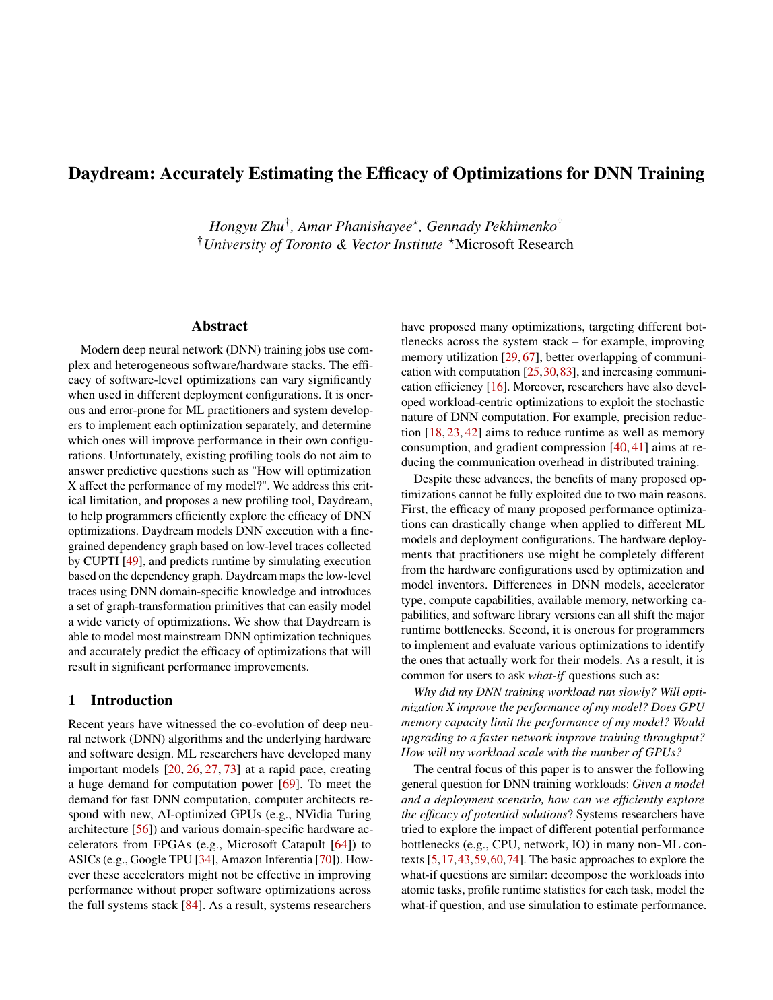

<strong>PDF p.2</strong> - 被 E001、E003、E004、E006、E007、E019 引用

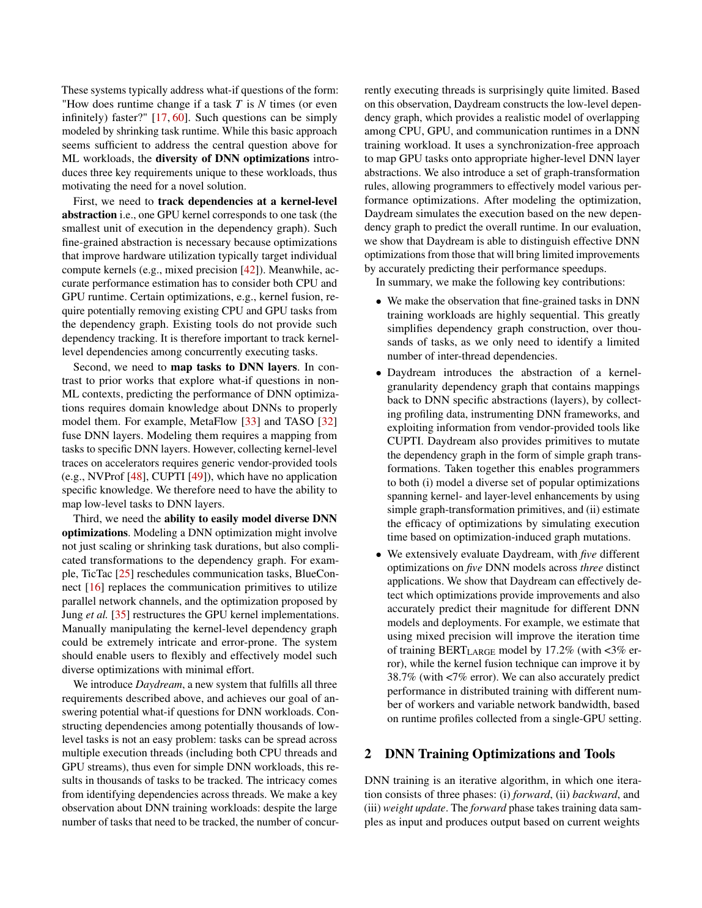

<strong>PDF p.3</strong> - 被 E004、E016 引用

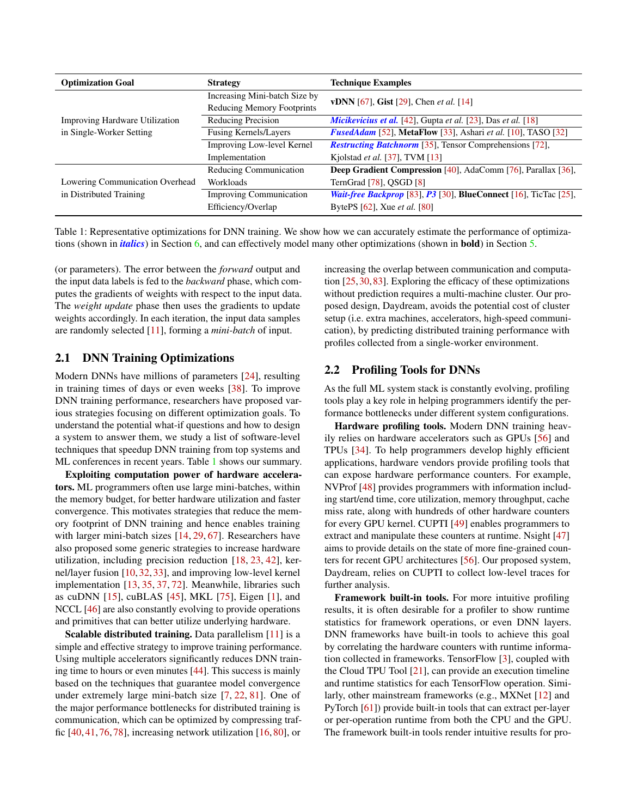

<strong>PDF p.4</strong> - 被 E007 引用

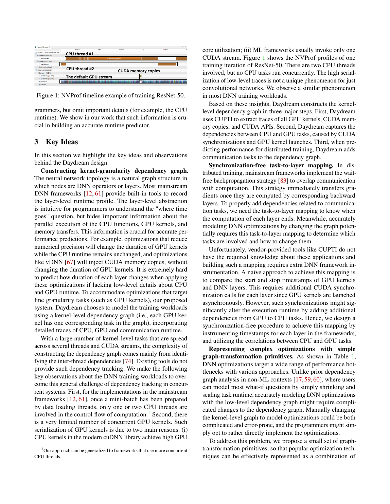

<strong>PDF p.5</strong> - 被 E001、E005、E006、E007、E008、E014、E015 引用

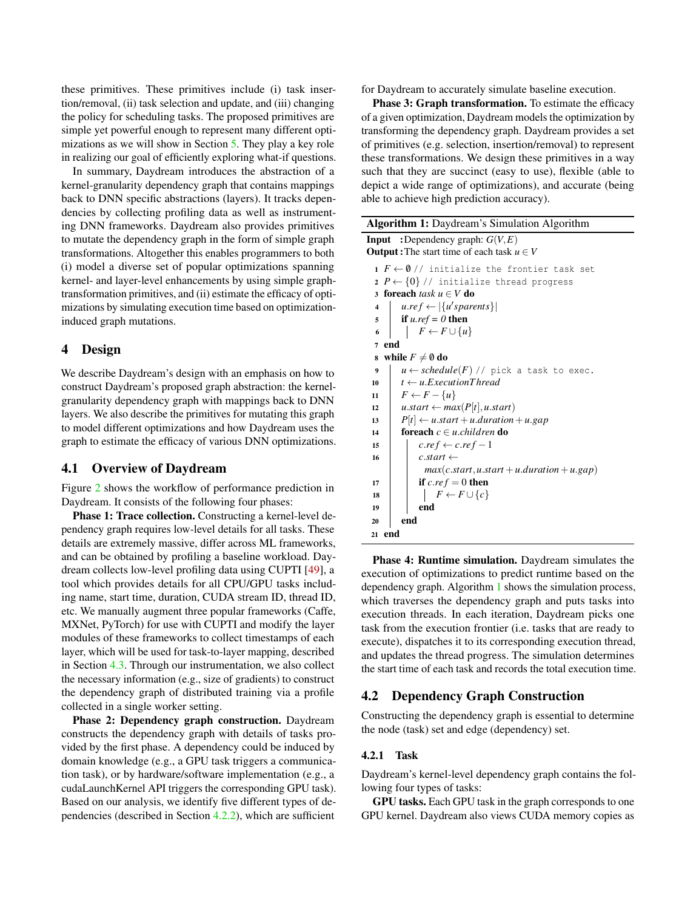

<strong>PDF p.6</strong> - 被 E006、E007、E009、E011、E015 引用

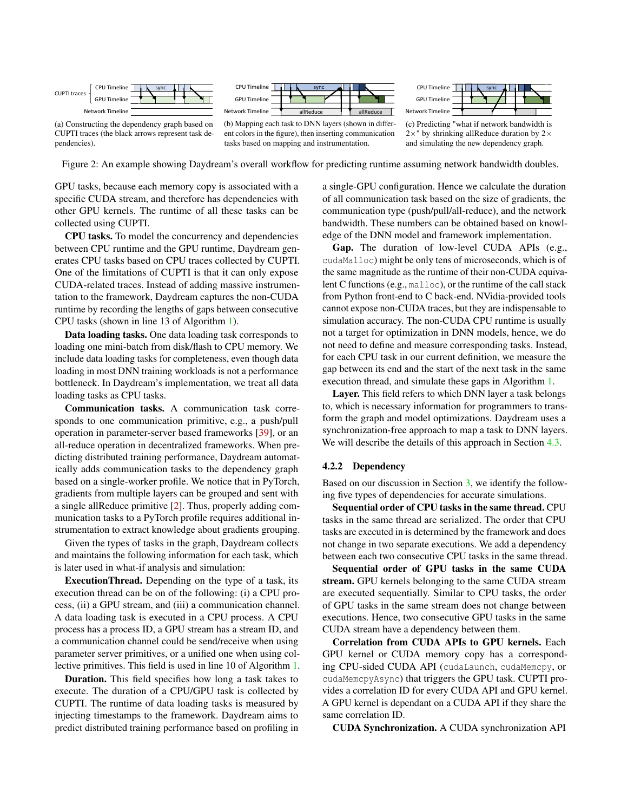

<strong>PDF p.7</strong> - 被 E009、E010、E011、E015、E016 引用

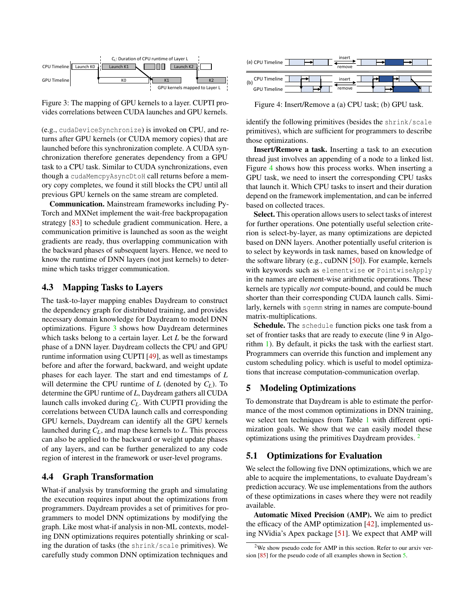

<strong>PDF p.8</strong> - 被 E010、E011、E015、E016 引用

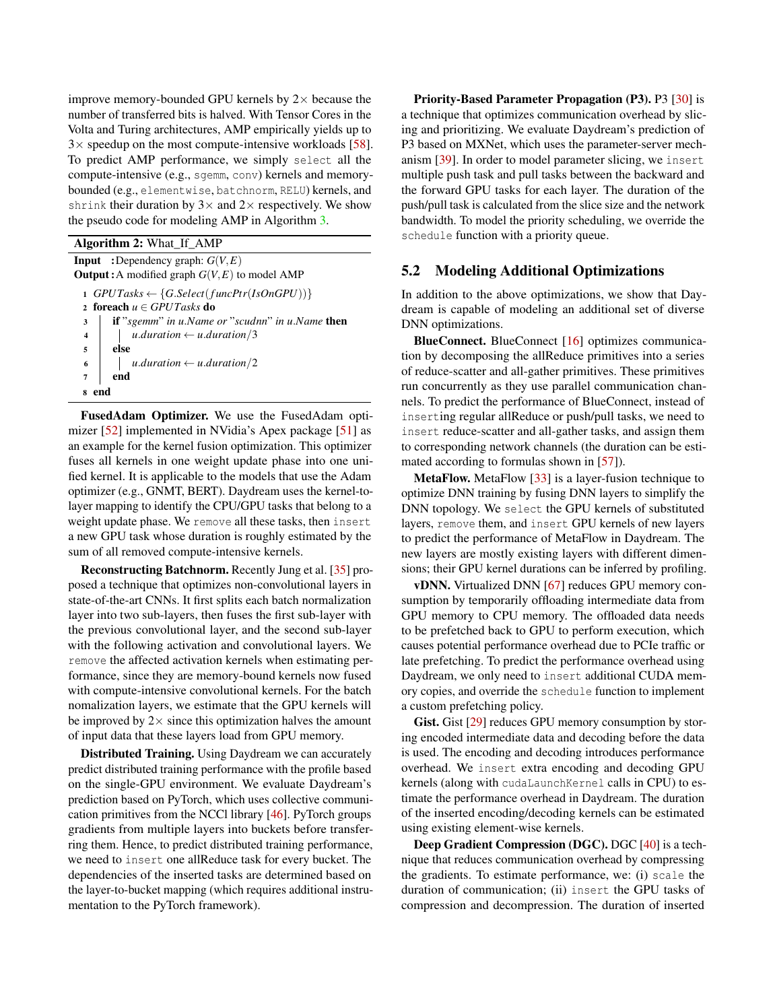

<strong>PDF p.9</strong> - 被 E015、E016、E017、E018、E019 引用

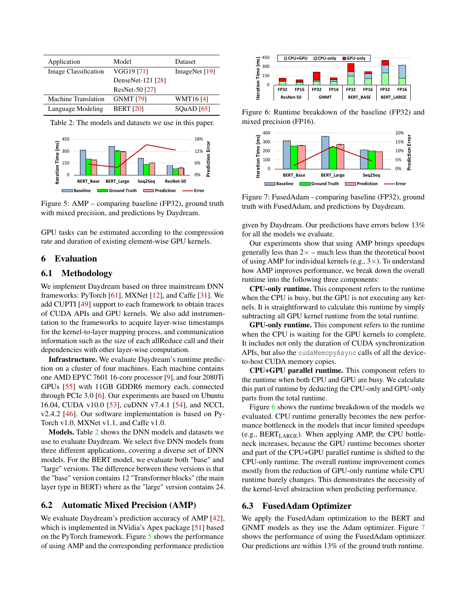

<strong>PDF p.10</strong> - 被 E012、E019 引用

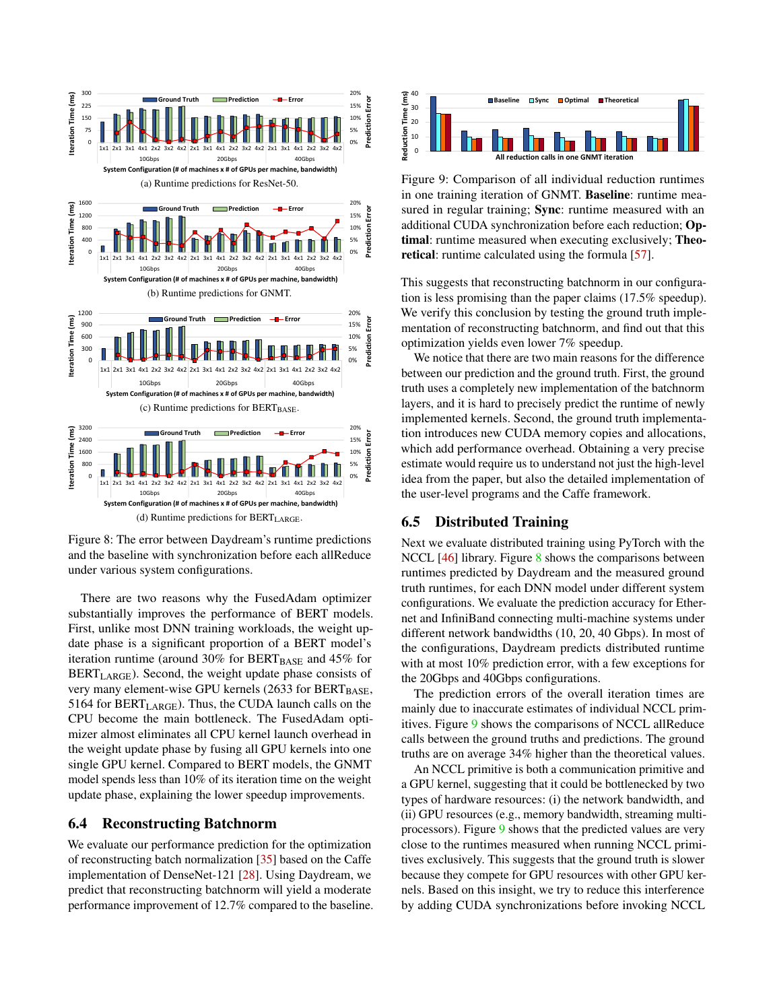

<strong>PDF p.11</strong> - 被 E012、E019 引用

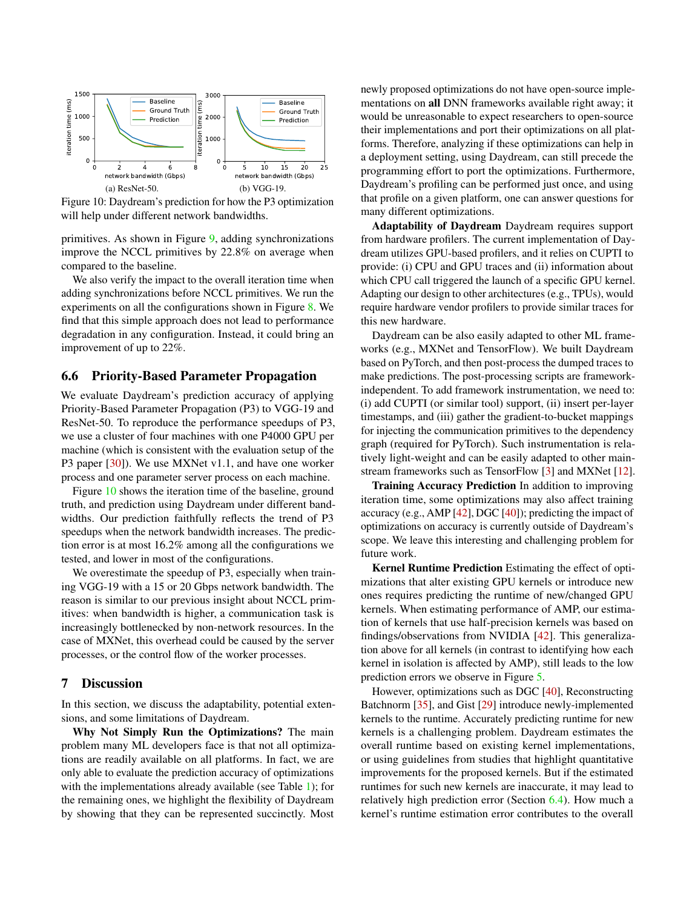

<strong>PDF p.12</strong> - 被 E013、E019、E020 引用

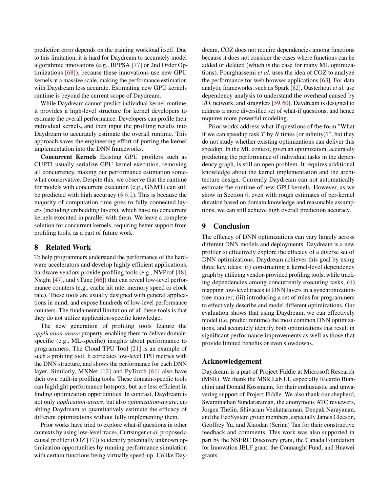

<!-- EVIDENCE_SCREENSHOTS:END -->
