# dPRO：跨 worker 全局数据流图、细粒度通信与自动优化

> 证据截图说明：正文中的 `原文截图 E###` 可跳转到文末证据卡片。截图按 PDF 物理页码生成；原有章节、图表、算法和段落定位保持不变。

## 0. 文献与证据口径

- 论文：Hao Hu et al., **dPRO: A Generic Performance Diagnosis and Optimization Toolkit for Expediting Distributed DNN Training**，MLSys 2022。
- arXiv：<https://arxiv.org/abs/2205.02473>
- MLSys 正式 PDF：<https://proceedings.mlsys.org/paper_files/paper/2022/file/b422680f3db0986ddd7f8f126baaf0fa-Paper.pdf>
- 开源仓库/AE release：<https://github.com/joapolarbear/dpro/releases/tag/MLSys2022_AE>
- Artifact DOI：<https://doi.org/10.6084/m9.figshare.19165622>
- 本地原文：[dpro.pdf](sources/dpro.pdf)
- 版本：本地文件为 arXiv 2205.02473 版，共 13 个 PDF 页；正式 MLSys 排版为 15 页，页码不可直接互换。
- 页码约定：下文“PDF p.N”指本地 arXiv PDF 阅读器 1-based 页码，即文本抽取中的 P(N-1)。定位同时给出节/图/算法，避免不同版式造成歧义。
- 证据类型：“论文事实”与“本文归纳/推断”分开陈述；开源状态核验截至 2026-08-06。

## 1. 一句话定位

dPRO 从 TensorFlow/MXNet 与通信库采集跨 worker 的计算和细粒度通信 trace，利用事务 ID 与时钟对齐构造全局 data-flow graph（DFG），再通过资源队列回放、关键路径分析和图优化 pass 自动搜索 op fusion、tensor fusion/partition 等优化。相较 Daydream，它的核心推进是把“单机 kernel DAG”扩展为“跨 worker 的全局算子—通信因果图”。

证据：摘要、§1，PDF pp.1–2；系统框架见 Figure 3、§3，PDF p.4。 〔[原文截图 E001](#evidence-e001)〕

## 2. 要解决的问题

### 2.1 诊断与优化割裂

现有 profiler 往往只展示单 worker 或粗粒度通信时间，用户还要人工判断瓶颈、实现优化、再实测。dPRO 希望提供从 profiling、全局回放、关键路径诊断到自动搜索优化方案的一体化工具。

证据：§1，PDF pp.1–2；§3，PDF p.4。 〔[原文截图 E002](#evidence-e002)〕

### 2.2 为什么必须构造全局 DFG

分布式训练中的真实关键路径跨越：计算 op、梯度就绪、通信排队、发送/接收、另一 worker 上的后续计算。将 all-reduce 或 push/pull 当一个黑盒持续时间，会把“等待进入通信队列”和“实际传输”混在一起，也无法正确变换 tensor fusion、partition、调度顺序。

证据：§2.2，PDF pp.2–3，特别是 coarse-grained communication profiling 的讨论与对 Daydream 偏差的动机分析。 〔[原文截图 E003](#evidence-e003)〕

### 2.3 两个跨机难点

1. 各机器时钟存在毫秒或亚毫秒偏移，直接拼 trace 会产生接收早于发送等不可能时间线。
2. profiler 通常看到的是接收 API/回调何时被调度，不一定是数据在网络中真实到达的时刻；必须借助通信语义匹配事务。

证据：§2.2 和 §4.2，PDF pp.3、5。 〔[原文截图 E004](#evidence-e004)〕

## 3. 系统组成

dPRO 由三部分组成：

- **Profiler**：跨框架采集 computation、communication 和 memory 事件；
- **Replayer**：构造全局 DFG，执行时间对齐、回放和关键路径分析；
- **Optimizer**：以 pass registry 对 DFG 做融合、切分、调度和内存相关变换，并借助局部回放评估候选。

证据：§3、Figure 3，PDF p.4。 〔[原文截图 E005](#evidence-e005)〕

## 4. Trace、图和跨 rank 因果

### 4.1 采集粒度

- 计算节点主要是框架 computation operator，而非 Daydream/Lumos 那样的每个 CUDA kernel。
- 通信不只记一个 collective 总时间，而是插入细粒度 send/recv 或 PUSH/PULL 事件。
- 本地框架图为每个张量插入 `In`/`Out` 虚拟节点，明确 producer/consumer 边界。
- 通信库 trace 记录 tensor/chunk、方向、对端和 step 等标识，以匹配跨 worker 的同一事务。

证据：§4.1 “Global DFG Construction”，PDF pp.4–5。 〔[原文截图 E006](#evidence-e006)〕

### 4.2 通信事务 ID 与 Middleman

全局通信边通过唯一 transaction ID 连接生产者、发送、接收和消费者；论文用 “Middleman” 抽象将本地虚拟通信端点拼成全局拓扑。

- Parameter Server：ID 包含 sender/receiver IP、tensor name、push/pull 等。
- Ring AllReduce：一个 tensor 被切成 chunk，并跨多步传递，因此 ID 还包括 chunk ID 与 step ID；每个 hop 的 send/recv 可被匹配。

这比“通信 op 名称 + duration”强得多，因为它显式保留了消息身份和跨 rank 因果。

证据：§4.1、Figure 4，PDF pp.4–5。 〔[原文截图 E007](#evidence-e007)〕

### 4.3 全局时钟对齐

dPRO 为每个物理节点求一个时钟偏移量 `θ`。优化目标利用两个观察：

1. 对齐后，同类接收事件的持续时间离散度应较小；接收开始不能早于对应发送开始。
2. 同一物理机上的 worker 共享时钟偏移。

同时加入依赖顺序约束，保证校正后的前驱仍早于后继。该约束优化由 CVXPY 求解，论文报告通常数秒完成。

证据：§4.2 “Time Alignment”，PDF p.5，公式与约束位于该小节。 〔[原文截图 E008](#evidence-e008)〕

本文归纳：这一步得到的是对一次历史观测最自洽的全局时间基准；它并没有自动生成拓扑变化后新的 rank 到达过程，后者仍需图变换和时长模型。

## 5. 回放算法与性能语义

### 5.1 基本算法

dPRO 使用修改后的 Kahn 拓扑算法：

- 每个 worker、parameter server 和 communication link 被视为一个有 FIFO 队列与当前 device time 的“device”；
- 候选节点只有在图依赖满足后才能进入相应资源；
- 在可执行设备中推进最小 device time，更新节点开始/结束时间；
- 节点持续时间取多次观测均值，论文实验默认用 warm-up 后 10 个 iteration；
- 全部设备完成后的最大时间作为一次迭代时间。

证据：§4.3 “Distributed Training Replay”，PDF pp.5–6。 〔[原文截图 E009](#evidence-e009)〕

### 5.2 资源序边与关键路径

原始数据依赖不足以表达共享资源 FIFO。回放会根据实际/模拟调度添加 resource-order edges，使最终 DFG 同时包含数据因果与资源序；随后从迭代终点逆向追踪关键路径。

证据：§4.3，PDF pp.5–6。 〔[原文截图 E010](#evidence-e010)〕

### 5.3 计算、通信、重叠和框架开销

- **计算**：以 framework op 的实测 duration 为主；融合后的 op 由离线 profile 或外部 cost model 给时长。
- **通信**：拆成细粒度 queue/send/recv/chunk 事件，显式进入链路队列。
- **重叠**：由跨 worker DFG 与不同 computation/communication devices 并行推进自然产生。
- **框架开销**：取决于框架 graph 与 profiler 可见事件；Python/runtime 内部未建成 kernel 级完整执行图，因此 host 细节不如 Lumos。

证据：§4.1–§4.3，PDF pp.4–6；优化候选时长来源见 §5，PDF pp.6–8。 〔[原文截图 E011](#evidence-e011)〕

## 6. 优化器与 what-if

### 6.1 主要 graph passes

- **Operator fusion**：融合可兼容 computation ops，减少 launch 与中间访问；与 XLA 做比较。
- **Tensor fusion**：合并小 tensor 通信，摊薄通信启动开销。
- **Tensor partition**：把大 tensor 切块，以更早开始传输和改善计算—通信重叠。
- **Communication scheduling**：改变通信 task 顺序。
- **Memory optimization**：论文框架包含相关 pass，并用模型估计峰值内存。

证据：§5.1–§5.3，PDF pp.6–8。 〔[原文截图 E012](#evidence-e012)〕

### 6.2 避免组合爆炸

dPRO 不穷举所有变换组合，而是：

- 用定理和启发式约束 fusion/partition 候选；
- 用 **Coarsened View** 合并重复/相似结构，缩小图；
- 用 **Partial Replay** 只回放变换影响的通信子图；
- 利用 Transformer block 和 worker 间的 **symmetry**，只评估代表结构。

证据：§5.2–§5.4、相关算法/图，PDF pp.6–8。 〔[原文截图 E013](#evidence-e013)〕

### 6.3 what-if 边界

dPRO 擅长对现有图上的局部算子/通信变换做搜索；论文结论提到其思想可扩到 model/pipeline parallelism，但没有提供相应大规模实验。新模型结构、新 kernel、新网络拓扑仍需要额外 cost model 和新的跨 rank 图生成规则。

证据：§7 Conclusion，PDF p.11；本文归纳基于实验覆盖范围。 〔[原文截图 E014](#evidence-e014)〕

## 7. 实现、开源与成熟度

### 7.1 论文实现

- 支持 TensorFlow 2.4 graph mode 与 MXNet。
- 为 NCCL 增加约 318 行代码，采集 chunk 级 SEND/RECV timestamp；为 ps-lite 增加约 400 行 PUSH/PULL 采集代码。
- Replayer 约 3,653 行 Python；Optimizer 约 5,745 行。
- 修改/集成 XLA、Horovod、BytePS。
- CLI 提供 `dpro profile`、`dpro replay`、`dpro optimize`；应用侧 wrapper 约需 2 行。

证据：§6 “Implementation”，PDF p.8。 〔[原文截图 E015](#evidence-e015)〕

### 7.2 开源状态

官方 GitHub 存在 MLSys 2022 artifact evaluation release，并给出 Figshare artifact。该 artifact 明确面向论文复现，包含 synthetic/sample data；安装可能超过两小时，离线分析不要求特殊硬件。

因此成熟度应表述为：**有可核验研究原型和 AE 工件，但不是现代生产训练栈的开箱即用组件**。框架版本、定制通信库和实验依赖都较旧。

## 8. 实验与量化结果

### 8.1 环境与工作负载

- 最大 128×Tesla V100 32GB，分布在 16 台服务器；100Gbps ConnectX-5，节点内 NVLink。
- CUDA 10.2、cuDNN 7.6.5。
- BERT Base、ResNet50、VGG16、InceptionV3。
- TensorFlow/MXNet；Horovod/BytePS；TCP/RDMA。
- 默认 16 GPU、每 GPU batch size 32；使用 warm-up 后 10 个 iteration 的均值。

证据：§6.1，PDF p.8。 〔[原文截图 E016](#evidence-e016)〕

### 8.2 回放准确性和采集开销

- dPRO 在大多数组合中回放误差低于 5%；对照的 Daydream 最大可到 70.2%。
- 去掉 time alignment 时误差最高 36.7%；加入后多数低于 5%，证明跨机时钟校正是全局因果图的必要组成。
- profiler 平均开销为 5.86%。
- 峰值内存估计最大误差 5.25%。
- 128 GPU 伸缩实验中 dPRO 多数仍低于 5%，最大约 5.6%；Daydream 最大约 73.8%。

证据：§6.2、Figures 8–10，PDF pp.8–9；scale-out 结果见 §6.5，PDF p.10。 〔[原文截图 E017](#evidence-e017)〕

### 8.3 优化收益与搜索成本

- 搜索时间在组合使用 coarsening、partial replay、symmetry 后：ResNet 从 14.60h 降至 0.29h，VGG16 从 11.97h 到 0.04h，InceptionV3 从 16.75h 到 0.47h，BERT 从超过 24h 到 0.49h。
- operator fusion 相对 XLA 最高改善 51.843%。
- tensor fusion 最高改善 19.1%。
- 组合优化相对 XLA 最高 62.95%，相对 Horovod/BytePS 最高 26.44%。
- 128 GPU 上自动优化相对 XLA 最多达到 3.48×。

证据：§6.3–§6.5、Table/Figures 对应 optimizer evaluation，PDF pp.9–11。 〔[原文截图 E018](#evidence-e018)〕

注意：收益数字是特定旧版框架/通信栈的实测对比，不等同于算法在当前 Megatron/DeepSpeed 或 Ascend 上的预期收益。

## 9. 优点

1. **跨 rank 消息身份是一等公民**：transaction ID、chunk、step、sender/receiver 比粗粒度 collective duration 更接近真实因果。
2. **显式处理跨机时钟偏移**：避免把独立主机 trace 简单按绝对时间拼接。
3. **通信队列与链路资源进入回放**：可区分排队、传输和计算重叠。
4. **从诊断到优化闭环**：关键路径、graph pass、候选搜索和局部回放在同一表示上。
5. **实际开源原型**：四篇路线一论文中，它提供了最明确的可核验 artifact。
6. **规模验证优于 Daydream**：覆盖到 128 GPU、PS/AllReduce、TCP/RDMA 和多个框架。

## 10. 局限、代价和可扩展性

### 10.1 表示与语义局限

- computation 以框架 op 为主，不能完整解释 CUDA stream/event、融合 kernel 内部或 host runtime 的细节。
- graph mode 和固定训练迭代假设较强；PyTorch eager/compile、CUDA Graph、异步 runtime 与动态控制流未验证。
- 通信虽细到 chunk/hop，但仍基于已有通信实现采集；换 collective 算法、拓扑、拥塞模式需要新模型。
- 论文主要覆盖数据并行和传统 CNN/BERT；未评估 TP/PP/EP/CP、MoE token routing、LLM inference 或 KV cache。

### 10.2 成本与扩展

- 全量全局 DFG 随 worker、op、chunk 和 iteration 增长；若不做 coarsening/symmetry，候选搜索可达十几小时或超过一天。
- 采集细粒度通信需要修改 NCCL/ps-lite，并非纯黑盒接入。
- time alignment 是事后优化，能修复时钟参考系，但不能补回 profiler 没有记录的真正 packet/collective 内部状态。
- 用 10 次 iteration 均值隐藏了抖动分布；性能尾延迟、straggler 与输入相关变化没有成为一等模型。

### 10.3 论文外推风险

论文结论暗示可扩到 model/pipeline parallelism，但没有实证；因此将 dPRO 直接标为“支持现代 3D 并行”的说法不成立。

## 11. 与真实录制回放的差异

| 语义层 | dPRO 已做到 | 仍缺失 |
|---|---|---|
| 全局时间因果 | 对齐跨机时钟、匹配 send/recv、资源队列 DES | 新拓扑下 rank arrival 的重新生成、真实拥塞/流控状态 |
| 逻辑工作量 | tensor name/chunk/方向等通信标识 | 原始/有效/padded shape、动态 token 数、数据依赖工作量 |
| 执行路径 | 固定 graph mode 下的 op 拓扑 | branch、top-k、index/count、稀疏专家选择等决策记录 |
| 数值与状态 | 不负责 | tensor value、参数/优化器/RNG/KV cache 版本及读写关系 |
| 物理绑定 | worker/server/link “device” | logical rank 与 physical device/NIC 的可重绑定模型 |
| 目标变换 | 优化 pass 改图 | 对每一字段声明 preserve/recompute/derive/constrain/rebind/reject |

dPRO 比 Daydream 更接近“跨 rank 因果回放”，但仍然是性能模型，不是功能等价的分布式 record/replay。

## 12. 对 Ascend 训练/推理系统的启示

### 12.1 最值得复用的设计

1. 为每个 HCCL 事务生成稳定身份：`group_id + collective_ordinal + tensor/logical_id + chunk + step + src/dst`。
2. 将 rank-local 图与 cross-rank 消息边分层构建；先保证本地物理计划正确，再拼全局因果计划。
3. 对每个 host/device/link 建独立资源日历；回放的开始时间至少取依赖、资源与 rank arrival 的最大值。
4. 不依赖全局绝对时钟作为唯一真相；优先记录消息匹配和因果，时钟对齐只用于 duration/可视化校正。
5. 把 coarsening、symmetry 与 partial replay 作为千卡级可扩展性的基本机制，而非后期优化。

### 12.2 需要增强

- Ascend profiler/HCCL trace 必须给出稳定 correlation；如果只能看到通信 op 总时长，dPRO 的优势无法落地。
- 针对 TP/PP/EP/CP/DCP，要记录 communicator membership、rank 逻辑坐标和 physical binding，并支持目标拓扑重绑定。
- MoE 需把 dispatch/combine 的 token counts、expert assignment、capacity/padding 和 all-to-all bytes 写入 Observation Ledger。
- 推理需加入 request arrival、batch formation、prefill/decode phase、KV cache allocate/evict/version 与调度决策。
- 新硬件/网络的 duration provider 应可插拔：实测表、解析模型、ML 预测器或全栈通信仿真器均可，但不能混淆“观测值”和“回放语义”。

### 12.3 推荐定位

dPRO 最适合作为本项目 **L3 跨 rank 因果图、通信身份、时钟对齐和局部回放优化** 的直接参考。它不应负责 L0/L1 数值与路径重建；对现代 LLM 还需用 Lumos 式 stream/event 图与 Echo/全栈通信模型补齐。

## 13. 最终评价

dPRO 将 trace replay 从单机关键路径推进到全局 DFG，并首次把消息匹配、时钟对齐、资源队列和自动优化系统性连起来。其方法对当前录制回放最有价值的部分不是“<5%”这一结果，而是跨 rank 因果的身份化表达。不过它的计算粒度、框架版本和并行范式已经落后于现代 LLM；在 Ascend 场景中应提炼其事务 ID、分层建图和 partial replay，而不是直接复刻整套实现。

<!-- EVIDENCE_SCREENSHOTS:BEGIN -->

## 原文证据截图附录

正文中的 `原文截图 E###` 与本节证据卡片一一对应。卡片保留原笔记行号和原有页码/章节定位，并跳转到后面的页图；每个物理页在本篇笔记中只展示一次。截图用于快速核读，正式引用仍以原论文为准。

<strong>E001</strong> - 原笔记第 22 行 - PDF p.1, 2, 4

<strong>原定位：</strong> <code>证据：摘要、§1，PDF pp.1–2；系统框架见 Figure 3、§3，PDF p.4。</code>

<strong>页图：</strong> <a href="#source-page-p001">PDF p.1</a> · <a href="#source-page-p002">PDF p.2</a> · <a href="#source-page-p004">PDF p.4</a>

<strong>E002</strong> - 原笔记第 30 行 - PDF p.1, 2, 4

<strong>原定位：</strong> <code>证据：§1，PDF pp.1–2；§3，PDF p.4。</code>

<strong>页图：</strong> <a href="#source-page-p001">PDF p.1</a> · <a href="#source-page-p002">PDF p.2</a> · <a href="#source-page-p004">PDF p.4</a>

<strong>E003</strong> - 原笔记第 36 行 - PDF p.2, 3

<strong>原定位：</strong> <code>证据：§2.2，PDF pp.2–3，特别是 coarse-grained communication profiling 的讨论与对 Daydream 偏差的动机分析。</code>

<strong>页图：</strong> <a href="#source-page-p002">PDF p.2</a> · <a href="#source-page-p003">PDF p.3</a>

<strong>E004</strong> - 原笔记第 43 行 - PDF p.3

<strong>原定位：</strong> <code>证据：§2.2 和 §4.2，PDF pp.3、5。</code>

<strong>页图：</strong> <a href="#source-page-p003">PDF p.3</a>

<strong>E005</strong> - 原笔记第 53 行 - PDF p.4

<strong>原定位：</strong> <code>证据：§3、Figure 3，PDF p.4。</code>

<strong>页图：</strong> <a href="#source-page-p004">PDF p.4</a>

<strong>E006</strong> - 原笔记第 64 行 - PDF p.4, 5

<strong>原定位：</strong> <code>证据：§4.1 “Global DFG Construction”，PDF pp.4–5。</code>

<strong>页图：</strong> <a href="#source-page-p004">PDF p.4</a> · <a href="#source-page-p005">PDF p.5</a>

<strong>E007</strong> - 原笔记第 75 行 - PDF p.4, 5

<strong>原定位：</strong> <code>证据：§4.1、Figure 4，PDF pp.4–5。</code>

<strong>页图：</strong> <a href="#source-page-p004">PDF p.4</a> · <a href="#source-page-p005">PDF p.5</a>

<strong>E008</strong> - 原笔记第 86 行 - PDF p.5

<strong>原定位：</strong> <code>证据：§4.2 “Time Alignment”，PDF p.5，公式与约束位于该小节。</code>

<strong>页图：</strong> <a href="#source-page-p005">PDF p.5</a>

<strong>E009</strong> - 原笔记第 102 行 - PDF p.5, 6

<strong>原定位：</strong> <code>证据：§4.3 “Distributed Training Replay”，PDF pp.5–6。</code>

<strong>页图：</strong> <a href="#source-page-p005">PDF p.5</a> · <a href="#source-page-p006">PDF p.6</a>

<strong>E010</strong> - 原笔记第 108 行 - PDF p.5, 6

<strong>原定位：</strong> <code>证据：§4.3，PDF pp.5–6。</code>

<strong>页图：</strong> <a href="#source-page-p005">PDF p.5</a> · <a href="#source-page-p006">PDF p.6</a>

<strong>E011</strong> - 原笔记第 117 行 - PDF p.4, 5, 6, 7, 8

<strong>原定位：</strong> <code>证据：§4.1–§4.3，PDF pp.4–6；优化候选时长来源见 §5，PDF pp.6–8。</code>

<strong>页图：</strong> <a href="#source-page-p004">PDF p.4</a> · <a href="#source-page-p005">PDF p.5</a> · <a href="#source-page-p006">PDF p.6</a> · <a href="#source-page-p007">PDF p.7</a> · <a href="#source-page-p008">PDF p.8</a>

<strong>E012</strong> - 原笔记第 129 行 - PDF p.6, 7, 8

<strong>原定位：</strong> <code>证据：§5.1–§5.3，PDF pp.6–8。</code>

<strong>页图：</strong> <a href="#source-page-p006">PDF p.6</a> · <a href="#source-page-p007">PDF p.7</a> · <a href="#source-page-p008">PDF p.8</a>

<strong>E013</strong> - 原笔记第 140 行 - PDF p.6, 7, 8

<strong>原定位：</strong> <code>证据：§5.2–§5.4、相关算法/图，PDF pp.6–8。</code>

<strong>页图：</strong> <a href="#source-page-p006">PDF p.6</a> · <a href="#source-page-p007">PDF p.7</a> · <a href="#source-page-p008">PDF p.8</a>

<strong>E014</strong> - 原笔记第 146 行 - PDF p.11

<strong>原定位：</strong> <code>证据：§7 Conclusion，PDF p.11；本文归纳基于实验覆盖范围。</code>

<strong>页图：</strong> <a href="#source-page-p011">PDF p.11</a>

<strong>E015</strong> - 原笔记第 158 行 - PDF p.8

<strong>原定位：</strong> <code>证据：§6 “Implementation”，PDF p.8。</code>

<strong>页图：</strong> <a href="#source-page-p008">PDF p.8</a>

<strong>E016</strong> - 原笔记第 176 行 - PDF p.8

<strong>原定位：</strong> <code>证据：§6.1，PDF p.8。</code>

<strong>页图：</strong> <a href="#source-page-p008">PDF p.8</a>

<strong>E017</strong> - 原笔记第 186 行 - PDF p.8, 9, 10

<strong>原定位：</strong> <code>证据：§6.2、Figures 8–10，PDF pp.8–9；scale-out 结果见 §6.5，PDF p.10。</code>

<strong>页图：</strong> <a href="#source-page-p008">PDF p.8</a> · <a href="#source-page-p009">PDF p.9</a> · <a href="#source-page-p010">PDF p.10</a>

<strong>E018</strong> - 原笔记第 196 行 - PDF p.9, 10, 11

<strong>原定位：</strong> <code>证据：§6.3–§6.5、Table/Figures 对应 optimizer evaluation，PDF pp.9–11。</code>

<strong>页图：</strong> <a href="#source-page-p009">PDF p.9</a> · <a href="#source-page-p010">PDF p.10</a> · <a href="#source-page-p011">PDF p.11</a>

## 原文页面图库（按页去重）

同一页可能支撑多个证据点；下面按物理页集中展示，每个截图文件只嵌入一次。

<strong>PDF p.1</strong> - 被 E001、E002 引用

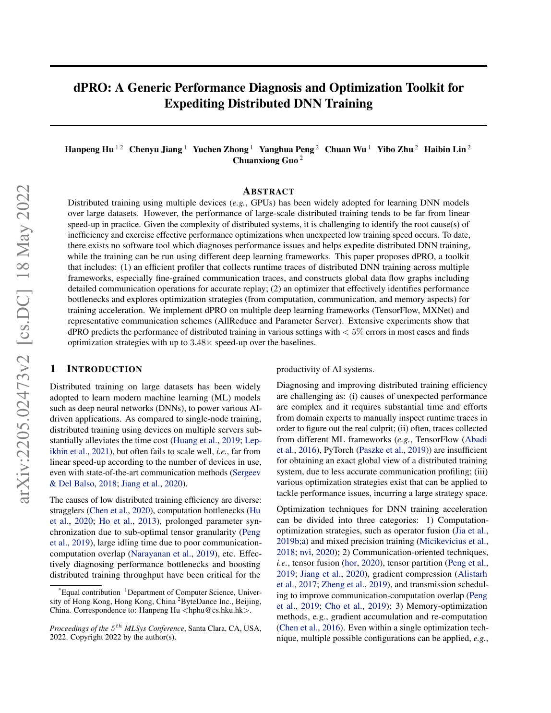

<strong>PDF p.2</strong> - 被 E001、E002、E003 引用

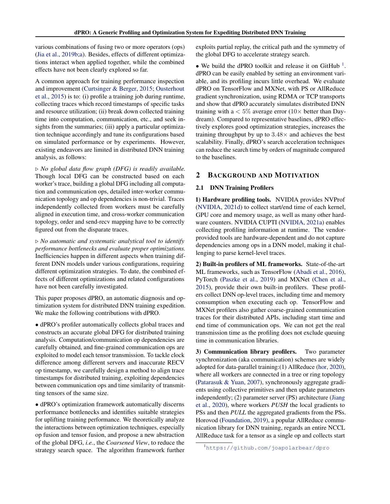

<strong>PDF p.3</strong> - 被 E003、E004 引用

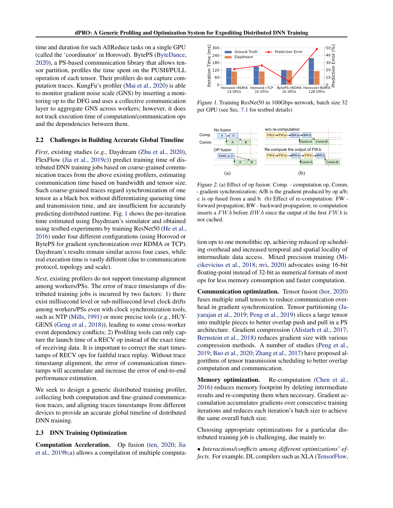

<strong>PDF p.4</strong> - 被 E001、E002、E005、E006、E007、E011 引用

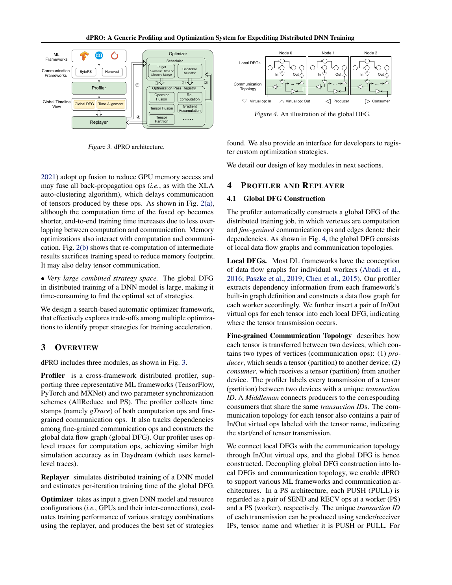

<strong>PDF p.5</strong> - 被 E006、E007、E008、E009、E010、E011 引用

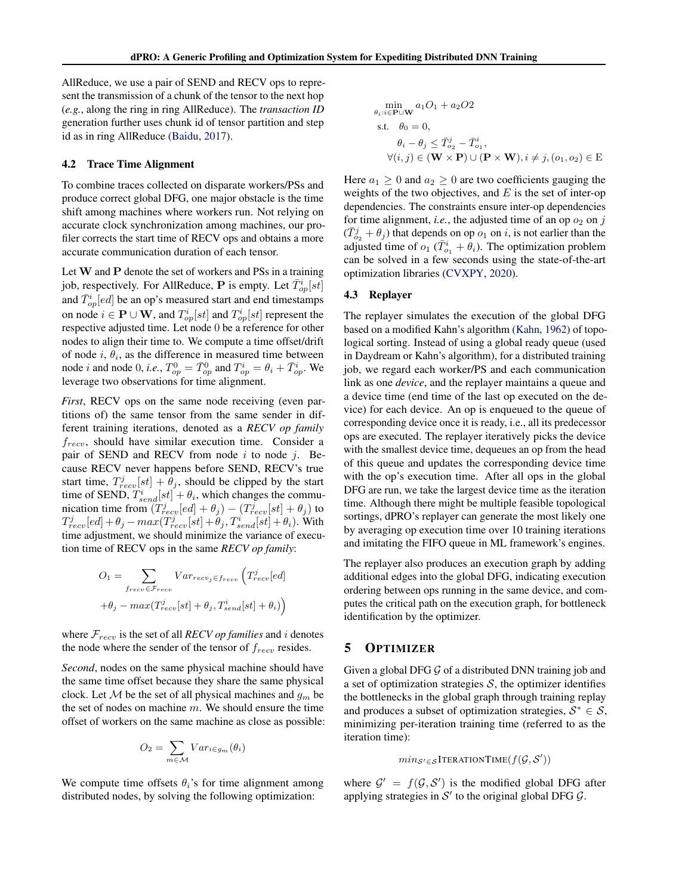

<strong>PDF p.6</strong> - 被 E009、E010、E011、E012、E013 引用

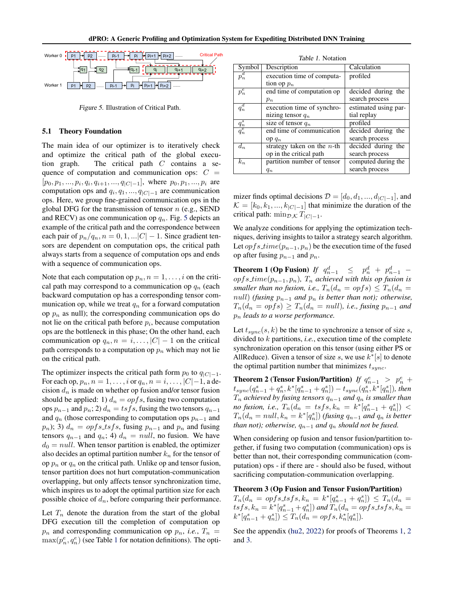

<strong>PDF p.7</strong> - 被 E011、E012、E013 引用

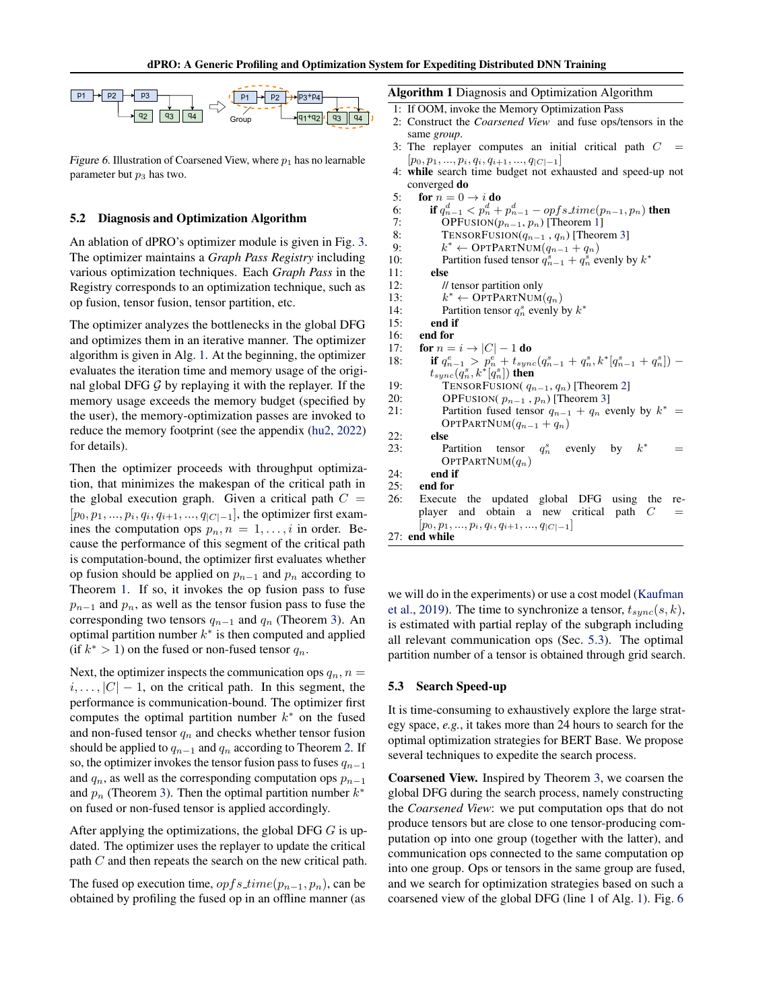

<strong>PDF p.8</strong> - 被 E011、E012、E013、E015、E016、E017 引用

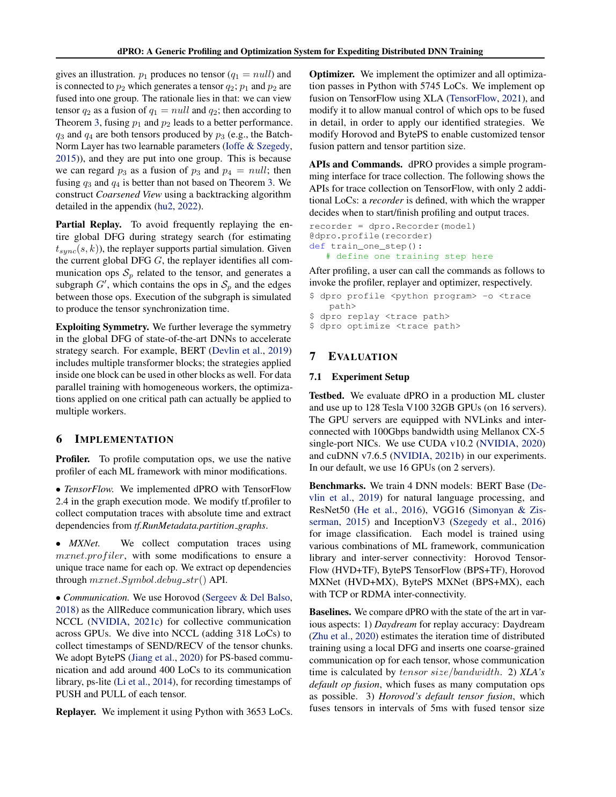

<strong>PDF p.9</strong> - 被 E017、E018 引用

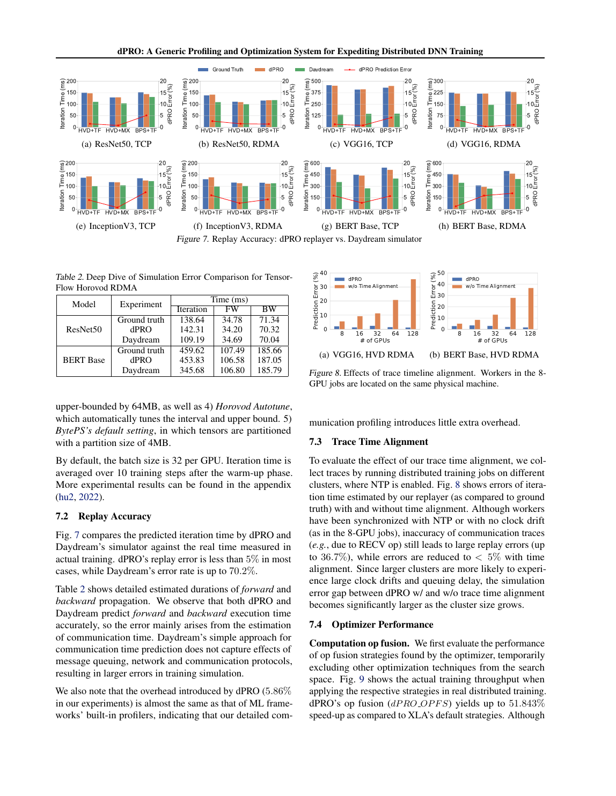

<strong>PDF p.10</strong> - 被 E017、E018 引用

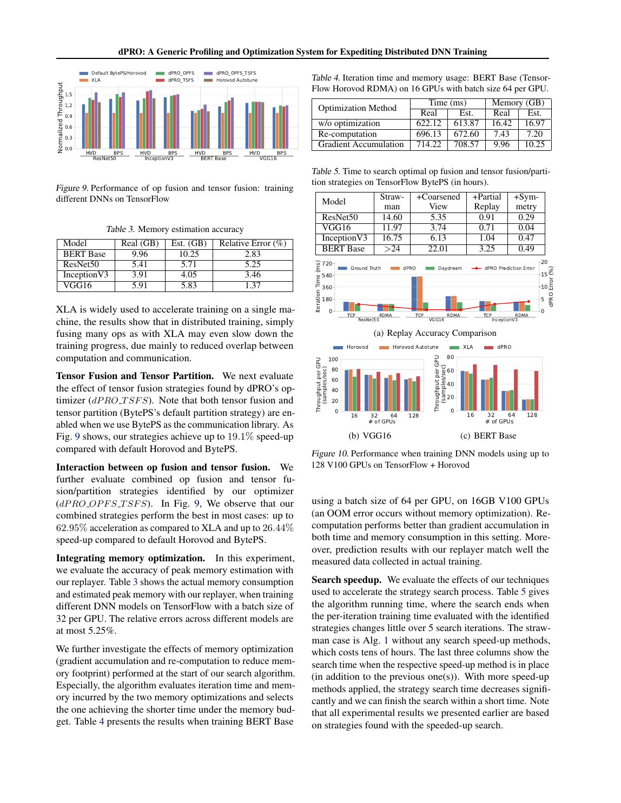

<strong>PDF p.11</strong> - 被 E014、E018 引用

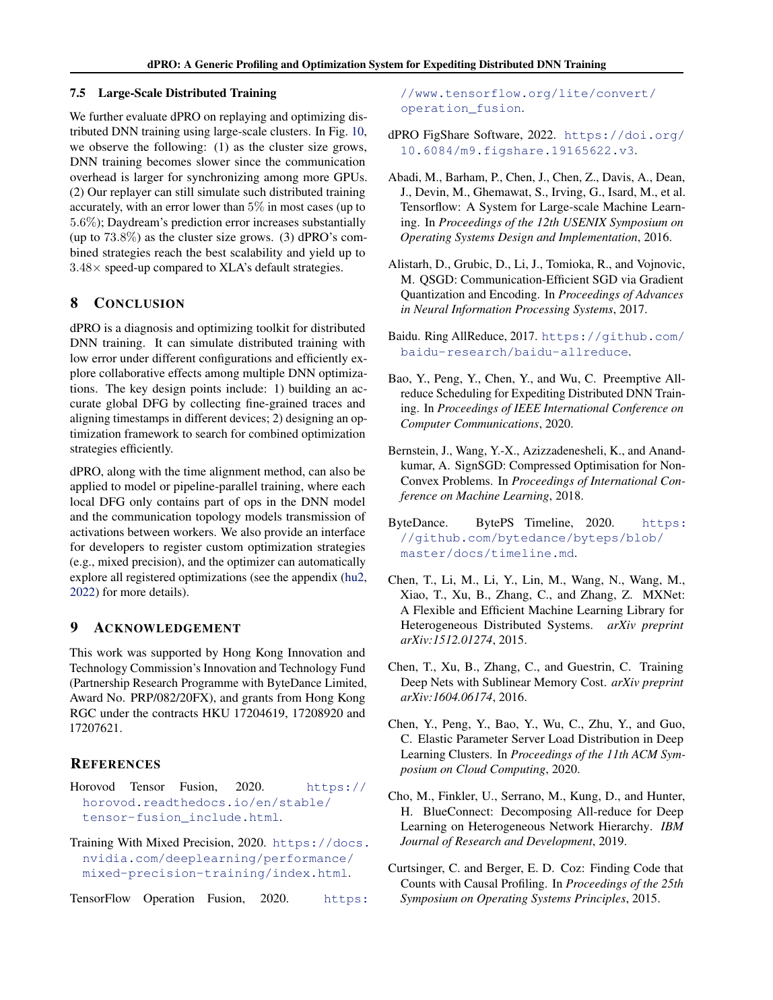

<!-- EVIDENCE_SCREENSHOTS:END -->
