# Echo：面向超大规模 LLM 训练的 ex-situ workload tracing 与快速时间线合成

> 证据截图说明：正文中的 `原文截图 E###` 可跳转到文末证据卡片。截图按 PDF 物理页码生成；原有章节、图表、算法和段落定位保持不变。

## 0. 文献与证据口径

- 论文：**Echo: Simulating Distributed Training At Scale**，arXiv:2412.12487。
- arXiv：<https://arxiv.org/abs/2412.12487>
- 本地原文：[echo.pdf](sources/echo.pdf)
- 版本：arXiv v1，2024-12-17；截至 2026-08-06，arXiv 页面仍只列 v1。本地 PDF 共 18 页，正文至 PDF p.13，之后为参考文献与附录。
- 页码约定：下文“PDF p.N”按阅读器从 1 开始计数，对应文本抽取 P(N-1)。同时给出节、图、表或公式定位。
- 证据类型：“论文事实”是原文可定位陈述；“本文归纳/推断”是面向本项目录制回放的判断；未找到源码时明确写为“未核验”，不据此断言从未存在。

## 1. 一句话定位

Echo 用一张 GPU 按 rank 逐个初始化并执行 3D 并行训练中的局部工作负载，同时拦截通信使每个 rank 能独立跑完；之后用白盒 NCCL collective 时延模型和 XGBoost compute–communication overlap slowdown 模型补齐成本，再通过事件驱动的多 rank 时间线合成器预测大规模 LLM 训练。它更像“脱离目标集群采工作负载 + 性能模型 + DES”，而不是从一次真实大集群执行直接录下完整全局 trace。

证据：摘要、§1，PDF pp.1–2；架构 Figure 4、§4，PDF pp.5–6。 〔[原文截图 E001](#evidence-e001)〕

## 2. 要解决的问题

### 2.1 大模型仿真的三个瓶颈

论文把现有方法的不足归纳为：

1. **目标 workload 难获得**：真实运行 70B/175B 甚至更大模型需要大量 GPU，不能为了模拟先部署一次完整集群。
2. **packet/cycle 级网络模拟太慢**：例如论文报告 SimAI 在 32 核 CPU 上模拟 128 GPU 的一个 iteration 需要 7,655 秒，难以做大搜索。
3. **compute–communication overlap 会相互减速**：仅把独占 compute 和独占 collective 时间重叠会过度乐观。

证据：§1、§3，PDF pp.1–4；SimAI 例子与 overlap 观察见 §3，PDF p.4。 〔[原文截图 E002](#evidence-e002)〕

### 2.2 为什么常见粗粒度模型不够

现代 LLM 有框架自定义 fused op、3D parallelism、pipeline schedule、多个 CUDA stream 和大量 collective。论文认为只使用通用 op lookup 或把通信视为一个固定时长节点，既无法忠实捕获框架实际 workload，也无法描述重叠干扰。

证据：§2、Table 1，PDF pp.2–3。 〔[原文截图 E003](#evidence-e003)〕

## 3. 总体架构

Echo 接收：训练框架、模型、DP/TP/PP group 配置、GPU 类型、集群拓扑及 NCCL 环境。主要模块为：

- **Workload Tracer**：在单 GPU 上生成各 rank 的本地 workload graph；
- **Collective Communication Estimator**：用分解后的白盒模型估计 NCCL collective；
- **Timeline Composer**：按计算、通信、memcpy 资源时间线做事件驱动合成；
- **ML Validator / Slowdown Predictor**：校正 compute 与 communication 并发时的相互干扰；
- **Profile Database**：保存 collective 参数和 overlap 训练样本。

证据：§4、Figure 4，PDF p.5。 〔[原文截图 E004](#evidence-e004)〕

## 4. Ex-situ workload tracing

### 4.1 单 GPU 逐 rank 执行

Echo 劫持/重定向模型并行初始化：依次假设当前进程是 rank 0、rank 1……，初始化该 rank 应持有的子模型，并在同一张 GPU 上跑完整训练 step。这样可以获得每个 rank 的框架特定计算工作负载，而无需同时占用整个目标集群。

证据：§4.1 “Ex-situ Workload Tracing”，PDF pp.5–6。 〔[原文截图 E005](#evidence-e005)〕

### 4.2 通信拦截

真实 collective/P2P 不执行；拦截器记录通信类型、所属 group、消息大小和调用位置等元数据，并返回能让单 rank 程序继续执行的单设备值/占位结果。通信在局部图中以 placeholder 节点保留，之后由通信估计器给时长并由时间线合成器跨 rank 匹配。

证据：§4.1，PDF pp.5–6。 〔[原文截图 E006](#evidence-e006)〕

### 4.3 图中记录什么

论文描述的图包括：

- computation op：输入/输出节点、op type、shape、name、实测 time 等；
- communication op：collective/P2P、group 与 message size 等；
- memcpy；
- op 之间的局部执行依赖。

证据：§4.1、Figure 5 附近，PDF pp.5–6。 〔[原文截图 E007](#evidence-e007)〕

本文推断：相较仅复制 rank 0 trace，这一机制能看见不同 pipeline stage/TP rank 的不同局部工作量；但它仍需要为每个独特 rank 配置顺序执行和初始化，采集成本近似随“不同 rank 子图数”增长，并受单卡显存可容纳该 rank 子模型的约束。

## 5. 多 rank 图、到达与时间线合成

### 5.1 跨 rank 依赖不是 trace 天然给出的

因为各 rank 是先后独立采的，原始 trace 没有同一次真实运行中的全局时钟和跨 rank 因果。Echo 在 composer 中使用预定义/匹配规则重建通信依赖和 pipeline schedule；论文以 1F1B 为例，并提供 API 允许自定义规则。

证据：§4.2 “Timeline Composition”，PDF p.6。 〔[原文截图 E008](#evidence-e008)〕

### 5.2 事件驱动合成

系统维护计算、通信、memcpy 时间线，在依赖和资源允许时推进事件。collective 的有效开始还受各参与 rank 到达影响；P2P 则要等匹配的发送/接收就绪。

证据：§4.2 和 §5，PDF pp.6–7。 〔[原文截图 E009](#evidence-e009)〕

本文归纳：Echo 构造的是“Execution Recipe + 预测的 Physical Binding/Cost”，而不是复用历史全局时间戳。其正确性依赖框架适配器和规则能重建目标配置下的合法 rank arrival。

## 6. 白盒集合通信模型

### 6.1 同步阶段与执行阶段

Echo 把 NCCL kernel 分为 synchronization 和 execution：collective 必须等 communicator 中最后一个 rank launch 才能真正开始；P2P 要等匹配 peer 准备。这样避免用单 rank launch timestamp 作为通信开始。

证据：§5.1，PDF p.6。 〔[原文截图 E010](#evidence-e010)〕

### 6.2 时延分解

总运行时间被拆为：

`connection setup + intra-node transport + reduction + inter-node transport`。

Ring all-gather、reduce-scatter、all-reduce 与 tree all-reduce 分别由设备数 `N`、服务器数 `M`、每机 GPU 数 `K`、tensor size、协议/算法、chunk 数及若干校准参数 `α/β/γ/δ/η` 计算。

证据：§5.2、Equation (1)–(5)，PDF pp.6–7。 〔[原文截图 E011](#evidence-e011)〕

### 6.3 如何校准

Echo 在较小集群上做 exhaustive offline profiling，枚举：

- GPU/服务器规模；
- tensor size；
- IB/TCP/NVLink 等网络环境；
- collective、NCCL algorithm/protocol/channel/chunk 等。

作者修改 NCCL/使用 NPKit 取得 chunk size、轮数以及 setup、intra、inter、reduce 分项时间。其外推假设是 Clos 网络在小规模后呈较稳定的分层特性。

证据：§5.3，PDF p.7；实现细节 §7，PDF p.8。 〔[原文截图 E012](#evidence-e012)〕

### 6.4 模型边界

论文在 §9 明确承认当前模型没有显式模拟拓扑细节和带宽 contention。因此它比 packet-level DES 快得多，但可能漏掉链路共享、路由热点、拥塞控制和多 job 干扰。

证据：§9 Limitations，PDF p.12。 〔[原文截图 E013](#evidence-e013)〕

## 7. Compute–communication overlap slowdown

### 7.1 现象

论文观察到超过 50% 的 compute op 会和通信重叠，训练 step 可因重叠干扰慢到 1.48×。常见 kernel 的平均 slowdown 为 37.76%；对 GPT-2 的样本，单 kernel slowdown 最大 8×、平均 1.70×。

证据：§3、Figures 2–3，PDF p.4。 〔[原文截图 E014](#evidence-e014)〕

### 7.2 XGBoost 预测器

每个并发样本的特征包括：

- 通信侧：NCCL protocol、algorithm、collective、bucket、channels 等；
- 计算侧：独占 baseline time、SM throughput、memory/DRAM throughput、occupancy、L1/L2 hit rate 等硬件计数器。

使用 XGBoost 预测 slowdown，再修正并发计算/通信节点的 duration。训练数据由 Nsight Compute/System 与数据库采集。

证据：§6，PDF pp.7–8；实现 §7，PDF p.8。 〔[原文截图 E015](#evidence-e015)〕

本文推断：这是经验插值器，能补足纯 DAG 的“持续时间不受重叠影响”假设，但泛化范围受 GPU 微架构、NCCL 版本、kernel 集合和训练样本覆盖限制；论文没有给出跨供应商或 Ascend 的泛化证明。

## 8. 支持的 what-if

论文的输入接口和实验表明可探索：

- DP/TP/PP 组合和目标 GPU 数；
- 模型规模；
- GPU 类型与节点内/节点间网络环境；
- NCCL algorithm/protocol/collective 配置；
- pipeline schedule/框架执行配置（有适配规则时）。

证据：Figure 4、§4–§8，PDF pp.5–12。 〔[原文截图 E016](#evidence-e016)〕

明确未支持：expert parallel/MoE、sequence/context parallel、ZeRO；当前只针对训练。

证据：§9，PDF p.12。 〔[原文截图 E017](#evidence-e017)〕

## 9. 实现、落地与开源状态

### 9.1 论文实现

- PyTorch 2.1、DeepSpeed 0.13.1、Megatron-LM commit `53a350ed`、NCCL 2.22.3。
- 总计约 10K LoC：约 2K 用于 Megatron 适配，3K 用于 DeepSpeed/PyTorch，5K 为 Echo 核心。
- `torch.fx` 用于 forward graph；grad fn/hooks 用于 backward、optimizer 与通信 placeholder；Megatron 还使用 decorator/context manager；图输出为 JSON。
- NCCL/collective profiling 使用 NPKit；训练 slowdown 数据使用 Nsight Compute、Nsight Systems 与 SQLite。
- 通信校准最多在 4 nodes/32 GPUs 上做，再外推更大规模。

证据：§7 Implementation，PDF p.8。 〔[原文截图 E018](#evidence-e018)〕

### 9.2 开源状态

论文只写 “plan to open-source Echo”。截至 2026-08-06，本次对 arXiv、论文链接和公开检索的核验未找到可确认的官方代码仓库。因此应标记为：**论文原型已实现且在内部集群验证；公开复现与可部署性未验证**。

这尤其影响两项核心能力的可复现性：修改 NCCL 的白盒采样，以及 overlap slowdown 的训练数据/模型。

## 10. 实验与量化结果

### 10.1 环境

- 模型：VGG19 与 GPT 13B–175B，FP32。
- 主集群：96×H800（12 台×8 GPU），节点内 400 GB/s NVLink，每 GPU 400 Gbps NDR InfiniBand。
- 辅助环境：8×A800；overlap 数据还使用 RTX 3090。
- profiling 从第 5 step 开始，预热 2 step，随后 5 step 求均值。

证据：§8.1，PDF pp.8–9。 〔[原文截图 E019](#evidence-e019)〕

### 10.2 组件准确性

- computation estimator 最大误差 8.31%；Proteus/FlexFlow 对 GPT-13B 的误差为 91.53%/109.14%，论文把差异归因于框架自定义融合等真实 workload 细节。
- intra-node collective 平均误差：A800 8.43%，H800 7.24%；NCCL Predictor 对照为 26.75%/28.33%。
- 2/4/8 server 的 inter-node 平均误差分别 11.36%/12.59%/13.75%；4MB/16MB 条件下 NCCL Predictor 平均约 27.6%。
- 约 5,000 个 kernel 的 slowdown 测试中，模型平均误差 4.67%，Proteus 为 18.83%；RTX 环境论文报告约 8× 精度改善。

证据：§8.2–§8.4、Tables 3–7，PDF pp.9–11。 〔[原文截图 E020](#evidence-e020)〕

### 10.3 端到端与模拟速度

- GPT-70B 在 96 GPU 上端到端误差约 7%；GPT-175B 约 8%。
- GPT-13B 在 64 GPU 上约 9%；论文测试的端到端结果均低于约 8.6%/接近该量级，具体应以相应图表配置逐项读取。
- 128 GPU：Echo 模拟 83.4 秒，SimAI 为 7,655 秒，约 91.8×。
- 8,192 GPU：Echo 用 4,976.9 秒，约 1.38 小时完成一次模拟。
- 摘要给出的代表性结论：GPT-175B/96×H800 的 step-time 误差平均约 8%，模拟时间低于 2 分钟；整体以 “91.4% accuracy” 概括。

证据：§8.5、Figure 8/对应端到端结果、Table 8，PDF pp.11–12；摘要，PDF p.1。 〔[原文截图 E021](#evidence-e021)〕

注意：8,192 GPU 是模拟器运行规模，不是真实 8,192 GPU ground truth 验证。

## 11. 优点

1. **不要求先占用目标规模集群**：ex-situ tracing 把大集群 workload 获取降到单 GPU 顺序执行。
2. **保留框架真实实现细节**：比纯解析模型更容易捕获 Megatron/DeepSpeed 的 fused op 和实际 op shape。
3. **collective 白盒分解兼顾速度与结构**：比单一回归表可解释，比 packet DES 快很多。
4. **显式建模 rank arrival/synchronization**：至少在 collective 开始语义上避免“谁先 launch 谁先传输”的错误。
5. **把 overlap contention 作为 duration 的上下文变量**：弥补多数 trace replay 对资源干扰的忽略。
6. **针对现代 3D LLM 训练**：模型规模、框架版本和 GPU 规模明显比 Daydream/dPRO 更新。

## 12. 局限、成本与可扩展性

### 12.1 论文明确局限

- 不显式模拟网络 topology/bandwidth contention。
- 不支持 EP/MoE、sequence/context parallel、ZeRO。
- 当前只实现训练，未覆盖 serving/inference。

证据：§9，PDF p.12。 〔[原文截图 E022](#evidence-e022)〕

### 12.2 Trace 与图生成风险

- 单 rank 拦截通信后返回占位值，只有在后续控制流和 shape 不依赖真实远端数值时才安全；数据依赖分支、MoE routing 和跨 rank 动态 metadata 会破坏这一假设。
- 逐 rank 初始化/执行不是零成本；独特 rank 数很多、checkpoint 很大或单 rank shard 仍超显存时会受限。
- 跨 rank 依赖来自框架知识/预定义规则，不是同一次真实执行中直接观测到的 causal ledger；新 schedule 需要新增规则。
- 默认可代表 step 的局部 trace 未建模运行时自适应、抖动、straggler 和故障。

### 12.3 模型风险

- 通信参数来自小集群，依赖 Clos 稳定性假设；大规模共享网络拥塞可能显著偏离。
- overlap XGBoost 依赖特定 GPU、NCCL、指标集合和训练数据；换 Ascend/HCCL 需要完全重新采样。
- 没有建模内存可行性，目标配置即使时间看起来更优也可能 OOM。
- 模拟时间仍随 rank/task 数增长；8,192 GPU 的 1.38 小时适合离线设计搜索，但不是交互式秒级反馈。

## 13. 与真实录制回放的差异

| 语义层 | Echo 已做到 | 仍缺失 |
|---|---|---|
| 逻辑计划 | 框架实际 op、shape、通信 placeholder | 数值语义、动态决策、状态版本与完整 workload extent |
| rank-local 物理计划 | 每 rank 的真实 framework execution trace | 目标设备上真实 kernel 选择、stream/runtime 自适应 |
| cross-rank 因果 | group/消息、collective 同步、P2P 匹配和规则化 schedule | 一次真实全局执行的完整 arrival ledger、网络争用与流控 |
| duration | 实测 compute + 白盒 collective + ML slowdown | 新供应商硬件上的可迁移 duration 与尾延迟分布 |
| 功能等价 | 不保证 | tensor/RNG/optimizer/branch/KV cache 的等价回放 |

“Ex-situ tracing”解决了基线 workload 难获得的问题，却没有自动解决功能性 replay：拦截通信能够继续跑，不等于其计算路径与真实多 rank 数值执行完全相同。

## 14. 对 Ascend 训练/推理录制回放的启示

### 14.1 值得借鉴

1. **单设备多 rank workload 生成器**：对静态 3D 并行训练，可在一张 NPU 上逐逻辑 rank 初始化 local shard，拦截 HCCL，生成 rank-local recipe。
2. **通信 placeholder 契约**：至少保存 group、logical rank set、collective/P2P、ordinal、message bytes、root/peer、dtype 与 shape。
3. **分层通信 duration provider**：setup、节点内、reduce、节点间分开校准，便于换拓扑和 HCCL algorithm。
4. **把 overlap slowdown 做成上下文函数**：`duration = f(op/kernel features, concurrent comm features, hardware state)`，不要把独占时长当常量。
5. **composer 需要 rank arrival**：collective 起点是参与 rank 都满足前驱后的 rendezvous，而不是某一条 trace 的原始 launch timestamp。

### 14.2 Ascend/MoE 必须额外解决

- HCCL collective 的 algorithm、transport、chunk/channel、RDMA/PCIe/HCCS/片上链路参数需要可观测或可校准。
- MoE 的 expert selection、token counts、capacity factor、drop/pad、dispatch/combine indices 必须录入 Observation Ledger；不能让假通信值影响 routing 后还认为 workload 真实。
- 目标 `EP/TP/PP/DP/CP/DCP` 改变时，应从逻辑 plan 重算 rank-local plan 和跨 rank 消息，而不是仅复制旧 rank trace。
- 推理需要 request arrival、continuous batching、prefill/decode、speculative decoding 决策和 KV cache 状态；Echo 当前不提供这些。
- overlap predictor 应由 Ascend profiler 的 AICore/vector/memory/HCCL 指标重新构建，并按芯片/驱动/HCCL 版本管理 calibration provenance。

### 14.3 推荐定位

Echo 适合作为本项目 **“无目标集群先生成 workload + 快速通信估算 + 重叠干扰校正”** 的参考。它应位于记录逻辑配方和 Observation Ledger 之后：只有动态决策已被 capture/recompute，ex-situ 单 rank 执行才有语义保障。

## 15. 最终评价

Echo 的最大贡献不是又一个 DES，而是把大规模 LLM 性能预测的三个缺口——工作负载获取、collective 速度模型、overlap interference——组合成可在单 GPU 起步的流程。其准确性和规模结果很有吸引力，但核心实现未公开、通信无争用、动态并行与推理缺失。对 Ascend 录制回放，应吸收其 ex-situ 与分层成本模型，同时用更强的 Observation Ledger 防止“能跑完占位执行”被误当成“工作量和路径都真实”。

<!-- EVIDENCE_SCREENSHOTS:BEGIN -->

## 原文证据截图附录

正文中的 `原文截图 E###` 与本节证据卡片一一对应。卡片保留原笔记行号和原有页码/章节定位，并跳转到后面的页图；每个物理页在本篇笔记中只展示一次。截图用于快速核读，正式引用仍以原论文为准。

<strong>E001</strong> - 原笔记第 19 行 - PDF p.1, 2, 5, 6

<strong>原定位：</strong> <code>证据：摘要、§1，PDF pp.1–2；架构 Figure 4、§4，PDF pp.5–6。</code>

<strong>页图：</strong> <a href="#source-page-p001">PDF p.1</a> · <a href="#source-page-p002">PDF p.2</a> · <a href="#source-page-p005">PDF p.5</a> · <a href="#source-page-p006">PDF p.6</a>

<strong>E002</strong> - 原笔记第 31 行 - PDF p.1, 2, 3, 4

<strong>原定位：</strong> <code>证据：§1、§3，PDF pp.1–4；SimAI 例子与 overlap 观察见 §3，PDF p.4。</code>

<strong>页图：</strong> <a href="#source-page-p001">PDF p.1</a> · <a href="#source-page-p002">PDF p.2</a> · <a href="#source-page-p003">PDF p.3</a> · <a href="#source-page-p004">PDF p.4</a>

<strong>E003</strong> - 原笔记第 37 行 - PDF p.2, 3

<strong>原定位：</strong> <code>证据：§2、Table 1，PDF pp.2–3。</code>

<strong>页图：</strong> <a href="#source-page-p002">PDF p.2</a> · <a href="#source-page-p003">PDF p.3</a>

<strong>E004</strong> - 原笔记第 49 行 - PDF p.5

<strong>原定位：</strong> <code>证据：§4、Figure 4，PDF p.5。</code>

<strong>页图：</strong> <a href="#source-page-p005">PDF p.5</a>

<strong>E005</strong> - 原笔记第 57 行 - PDF p.5, 6

<strong>原定位：</strong> <code>证据：§4.1 “Ex-situ Workload Tracing”，PDF pp.5–6。</code>

<strong>页图：</strong> <a href="#source-page-p005">PDF p.5</a> · <a href="#source-page-p006">PDF p.6</a>

<strong>E006</strong> - 原笔记第 63 行 - PDF p.5, 6

<strong>原定位：</strong> <code>证据：§4.1，PDF pp.5–6。</code>

<strong>页图：</strong> <a href="#source-page-p005">PDF p.5</a> · <a href="#source-page-p006">PDF p.6</a>

<strong>E007</strong> - 原笔记第 74 行 - PDF p.5, 6

<strong>原定位：</strong> <code>证据：§4.1、Figure 5 附近，PDF pp.5–6。</code>

<strong>页图：</strong> <a href="#source-page-p005">PDF p.5</a> · <a href="#source-page-p006">PDF p.6</a>

<strong>E008</strong> - 原笔记第 84 行 - PDF p.6

<strong>原定位：</strong> <code>证据：§4.2 “Timeline Composition”，PDF p.6。</code>

<strong>页图：</strong> <a href="#source-page-p006">PDF p.6</a>

<strong>E009</strong> - 原笔记第 90 行 - PDF p.6, 7

<strong>原定位：</strong> <code>证据：§4.2 和 §5，PDF pp.6–7。</code>

<strong>页图：</strong> <a href="#source-page-p006">PDF p.6</a> · <a href="#source-page-p007">PDF p.7</a>

<strong>E010</strong> - 原笔记第 100 行 - PDF p.6

<strong>原定位：</strong> <code>证据：§5.1，PDF p.6。</code>

<strong>页图：</strong> <a href="#source-page-p006">PDF p.6</a>

<strong>E011</strong> - 原笔记第 110 行 - PDF p.6, 7

<strong>原定位：</strong> <code>证据：§5.2、Equation (1)–(5)，PDF pp.6–7。</code>

<strong>页图：</strong> <a href="#source-page-p006">PDF p.6</a> · <a href="#source-page-p007">PDF p.7</a>

<strong>E012</strong> - 原笔记第 123 行 - PDF p.7, 8

<strong>原定位：</strong> <code>证据：§5.3，PDF p.7；实现细节 §7，PDF p.8。</code>

<strong>页图：</strong> <a href="#source-page-p007">PDF p.7</a> · <a href="#source-page-p008">PDF p.8</a>

<strong>E013</strong> - 原笔记第 129 行 - PDF p.12

<strong>原定位：</strong> <code>证据：§9 Limitations，PDF p.12。</code>

<strong>页图：</strong> <a href="#source-page-p012">PDF p.12</a>

<strong>E014</strong> - 原笔记第 137 行 - PDF p.4

<strong>原定位：</strong> <code>证据：§3、Figures 2–3，PDF p.4。</code>

<strong>页图：</strong> <a href="#source-page-p004">PDF p.4</a>

<strong>E015</strong> - 原笔记第 148 行 - PDF p.7, 8

<strong>原定位：</strong> <code>证据：§6，PDF pp.7–8；实现 §7，PDF p.8。</code>

<strong>页图：</strong> <a href="#source-page-p007">PDF p.7</a> · <a href="#source-page-p008">PDF p.8</a>

<strong>E016</strong> - 原笔记第 162 行 - PDF p.5, 6, 7, 8, 9, 10, 11, 12

<strong>原定位：</strong> <code>证据：Figure 4、§4–§8，PDF pp.5–12。</code>

<strong>页图：</strong> <a href="#source-page-p005">PDF p.5</a> · <a href="#source-page-p006">PDF p.6</a> · <a href="#source-page-p007">PDF p.7</a> · <a href="#source-page-p008">PDF p.8</a> · <a href="#source-page-p009">PDF p.9</a> · <a href="#source-page-p010">PDF p.10</a> · <a href="#source-page-p011">PDF p.11</a> · <a href="#source-page-p012">PDF p.12</a>

<strong>E017</strong> - 原笔记第 166 行 - PDF p.12

<strong>原定位：</strong> <code>证据：§9，PDF p.12。</code>

<strong>页图：</strong> <a href="#source-page-p012">PDF p.12</a>

<strong>E018</strong> - 原笔记第 178 行 - PDF p.8

<strong>原定位：</strong> <code>证据：§7 Implementation，PDF p.8。</code>

<strong>页图：</strong> <a href="#source-page-p008">PDF p.8</a>

<strong>E019</strong> - 原笔记第 195 行 - PDF p.8, 9

<strong>原定位：</strong> <code>证据：§8.1，PDF pp.8–9。</code>

<strong>页图：</strong> <a href="#source-page-p008">PDF p.8</a> · <a href="#source-page-p009">PDF p.9</a>

<strong>E020</strong> - 原笔记第 204 行 - PDF p.9, 10, 11

<strong>原定位：</strong> <code>证据：§8.2–§8.4、Tables 3–7，PDF pp.9–11。</code>

<strong>页图：</strong> <a href="#source-page-p009">PDF p.9</a> · <a href="#source-page-p010">PDF p.10</a> · <a href="#source-page-p011">PDF p.11</a>

<strong>E021</strong> - 原笔记第 214 行 - PDF p.1, 11, 12

<strong>原定位：</strong> <code>证据：§8.5、Figure 8/对应端到端结果、Table 8，PDF pp.11–12；摘要，PDF p.1。</code>

<strong>页图：</strong> <a href="#source-page-p001">PDF p.1</a> · <a href="#source-page-p011">PDF p.11</a> · <a href="#source-page-p012">PDF p.12</a>

<strong>E022</strong> - 原笔记第 235 行 - PDF p.12

<strong>原定位：</strong> <code>证据：§9，PDF p.12。</code>

<strong>页图：</strong> <a href="#source-page-p012">PDF p.12</a>

## 原文页面图库（按页去重）

同一页可能支撑多个证据点；下面按物理页集中展示，每个截图文件只嵌入一次。

<strong>PDF p.1</strong> - 被 E001、E002、E021 引用

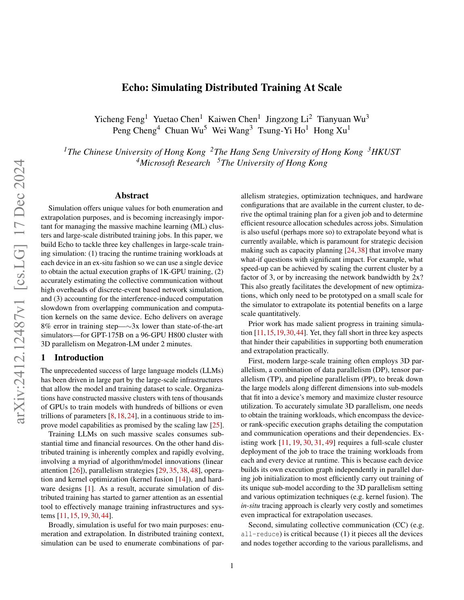

<strong>PDF p.2</strong> - 被 E001、E002、E003 引用

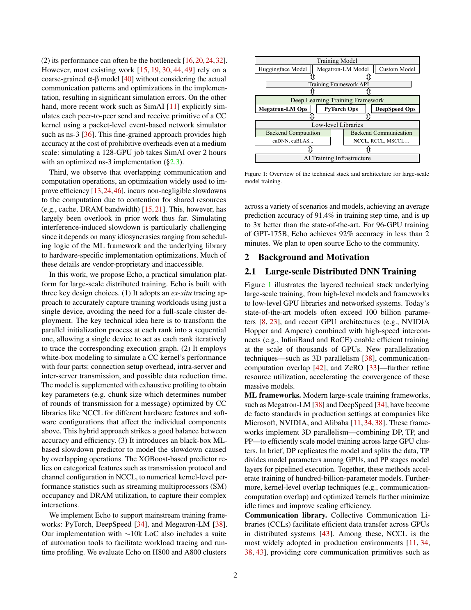

<strong>PDF p.3</strong> - 被 E002、E003 引用

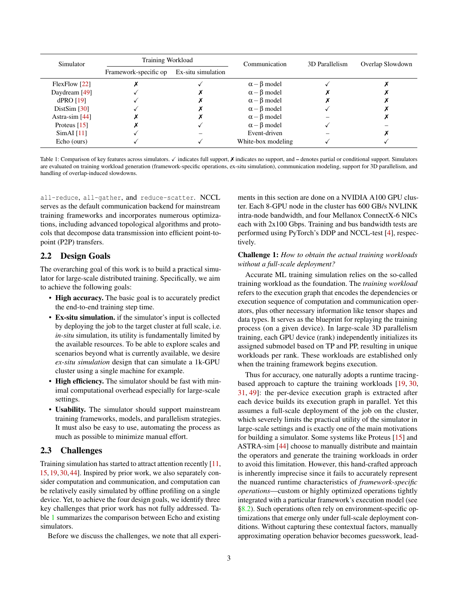

<strong>PDF p.4</strong> - 被 E002、E014 引用

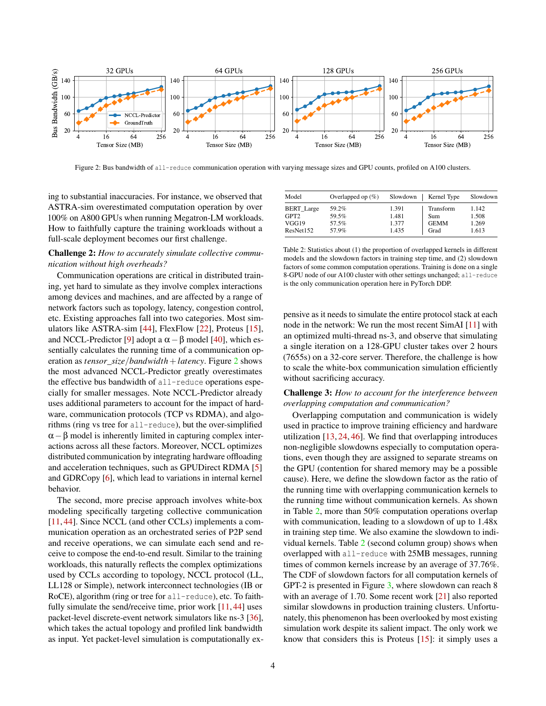

<strong>PDF p.5</strong> - 被 E001、E004、E005、E006、E007、E016 引用

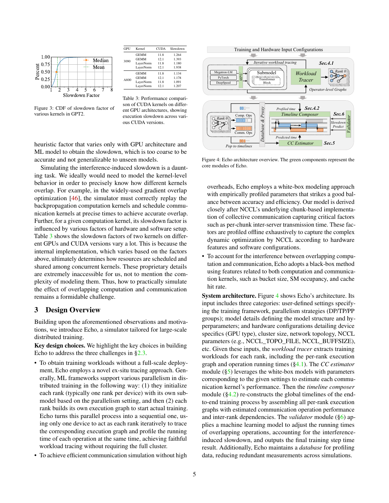

<strong>PDF p.6</strong> - 被 E001、E005、E006、E007、E008、E009、E010、E011、E016 引用

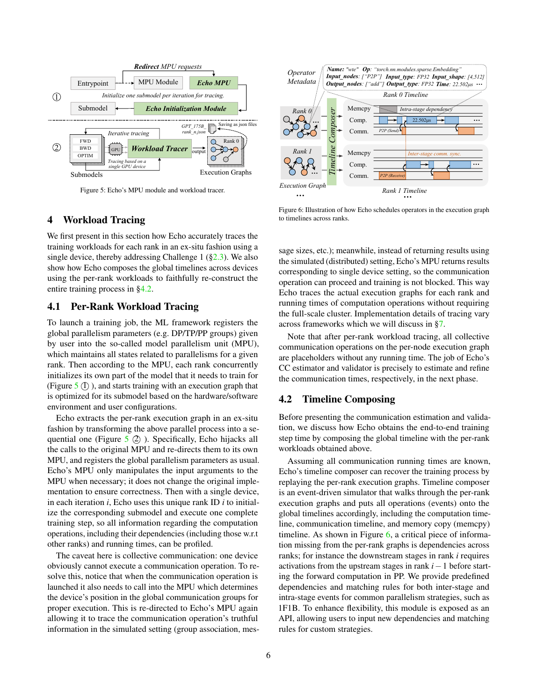

<strong>PDF p.7</strong> - 被 E009、E011、E012、E015、E016 引用

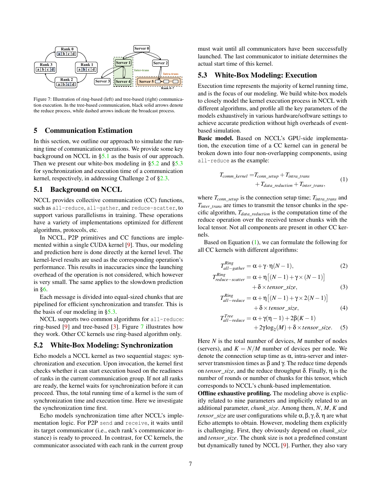

<strong>PDF p.8</strong> - 被 E012、E015、E016、E018、E019 引用

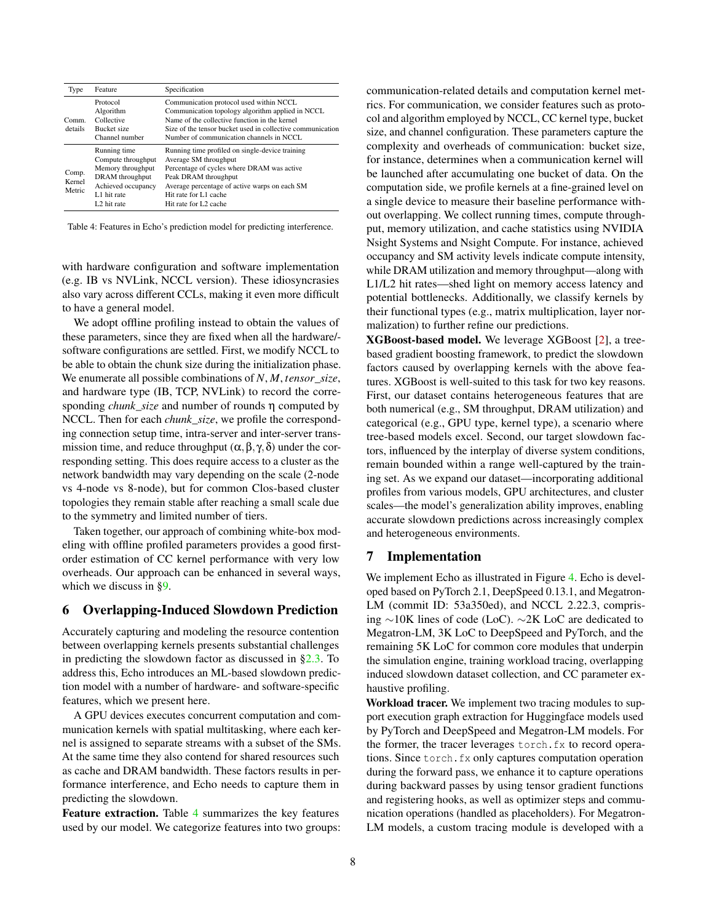

<strong>PDF p.9</strong> - 被 E016、E019、E020 引用

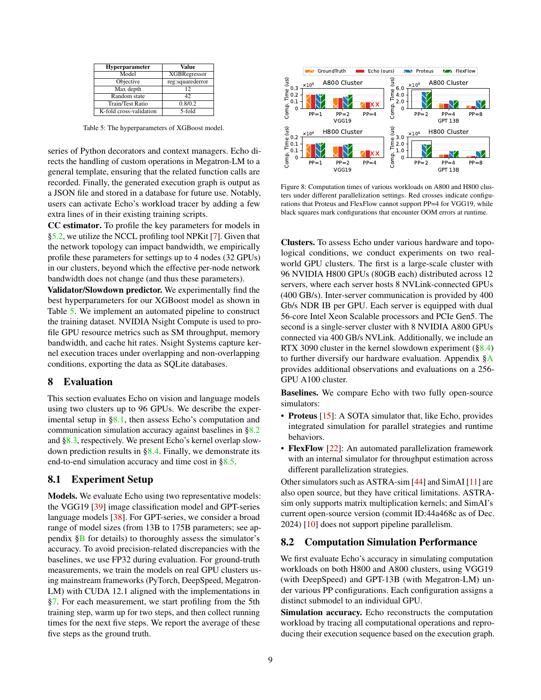

<strong>PDF p.10</strong> - 被 E016、E020 引用

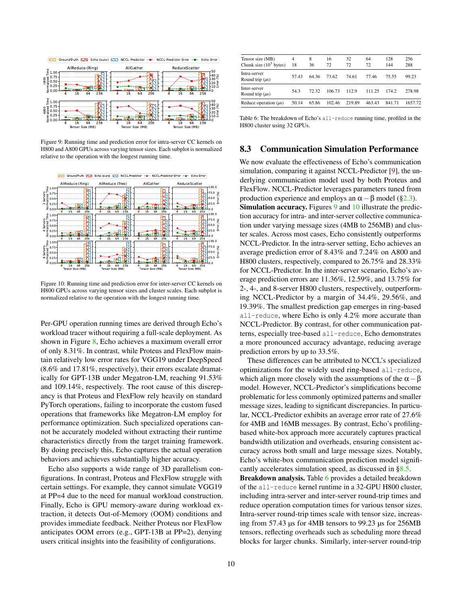

<strong>PDF p.11</strong> - 被 E016、E020、E021 引用

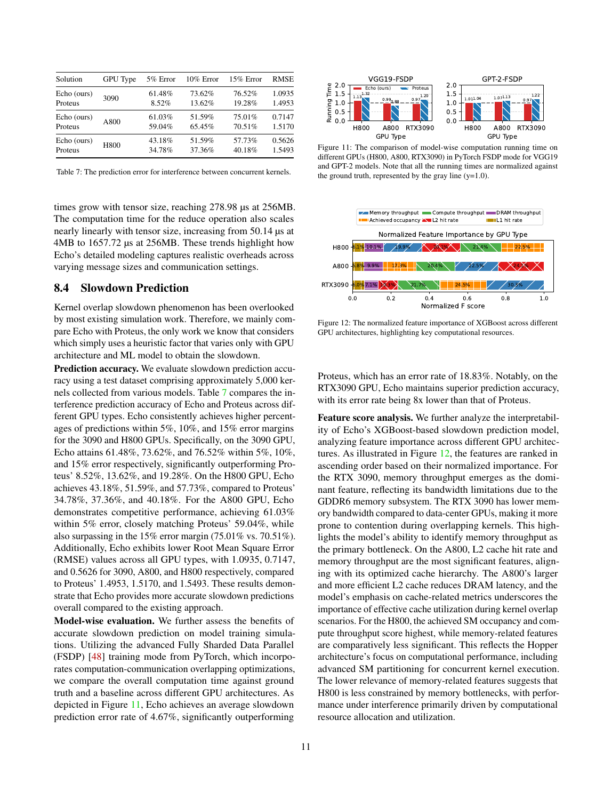

<strong>PDF p.12</strong> - 被 E013、E016、E017、E021、E022 引用

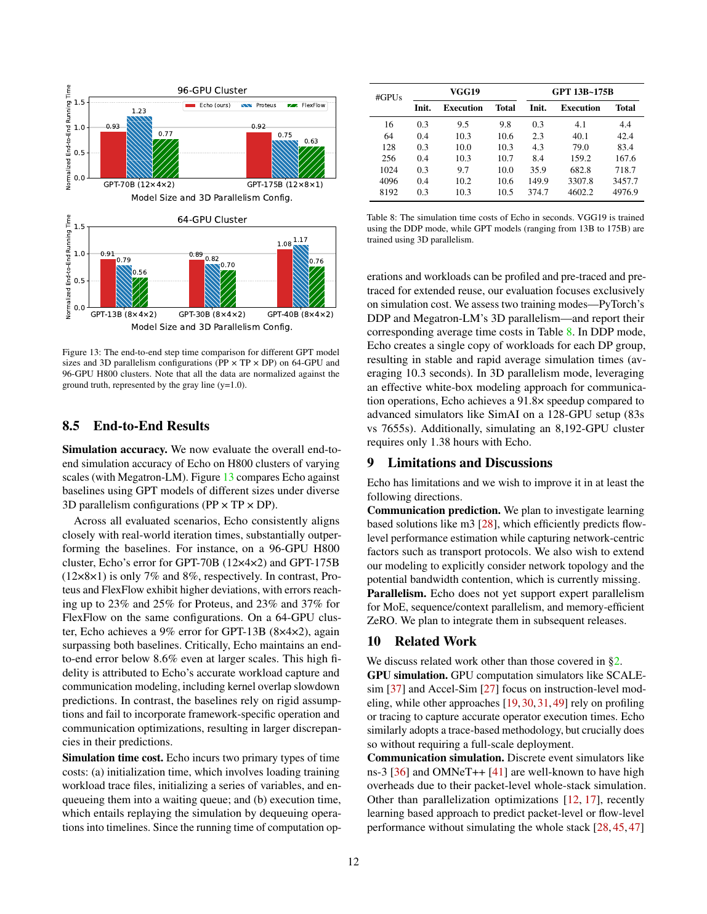

<!-- EVIDENCE_SCREENSHOTS:END -->
