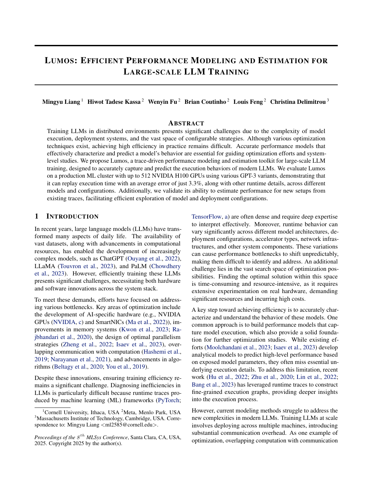
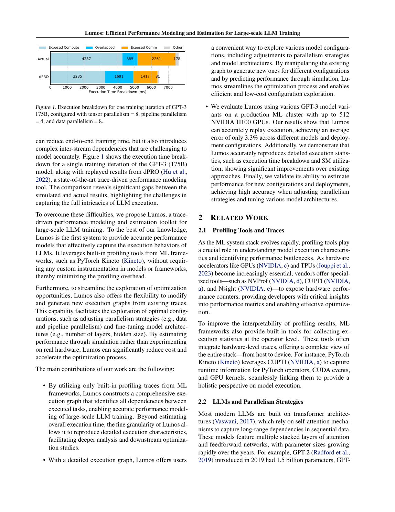
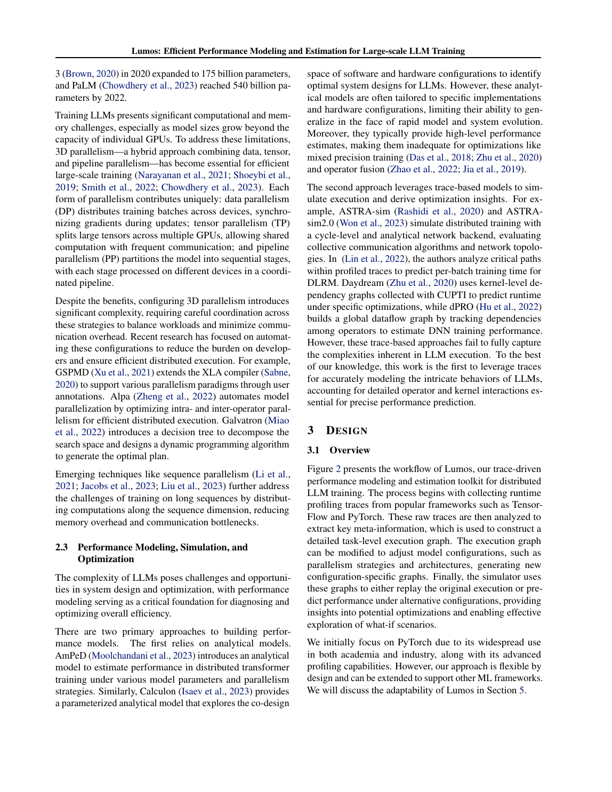
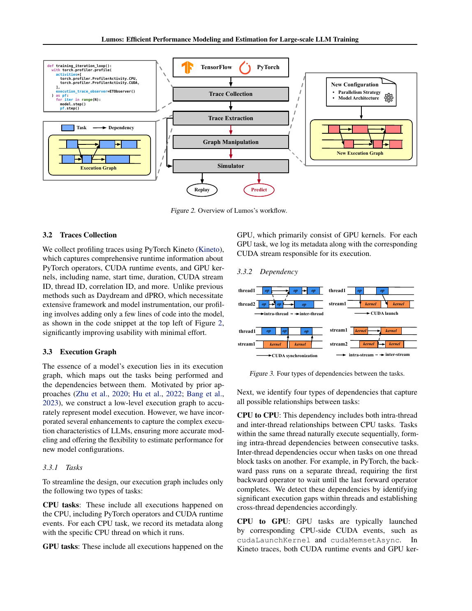
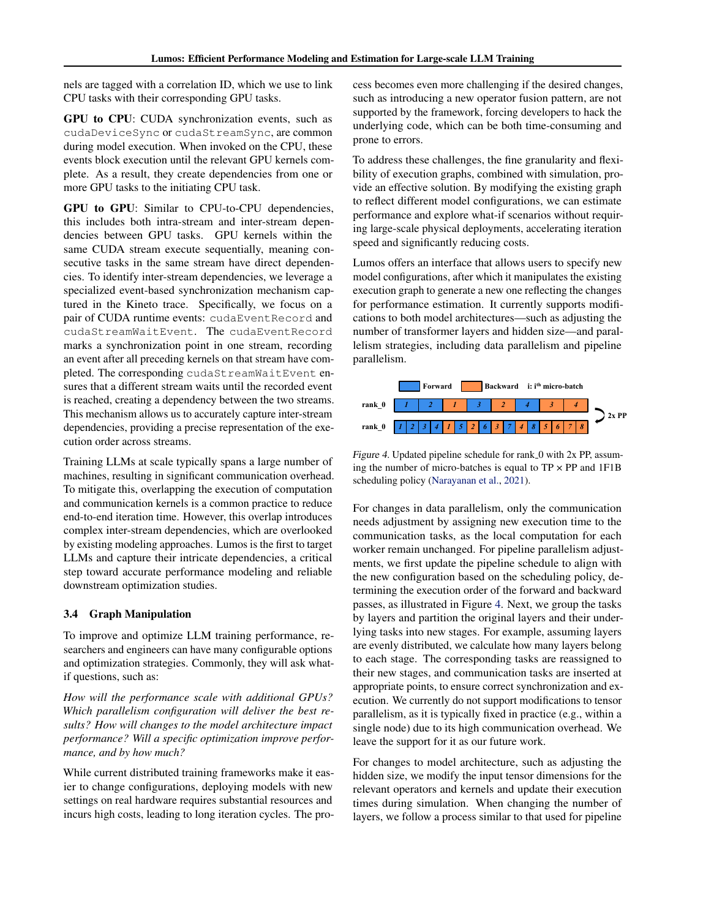
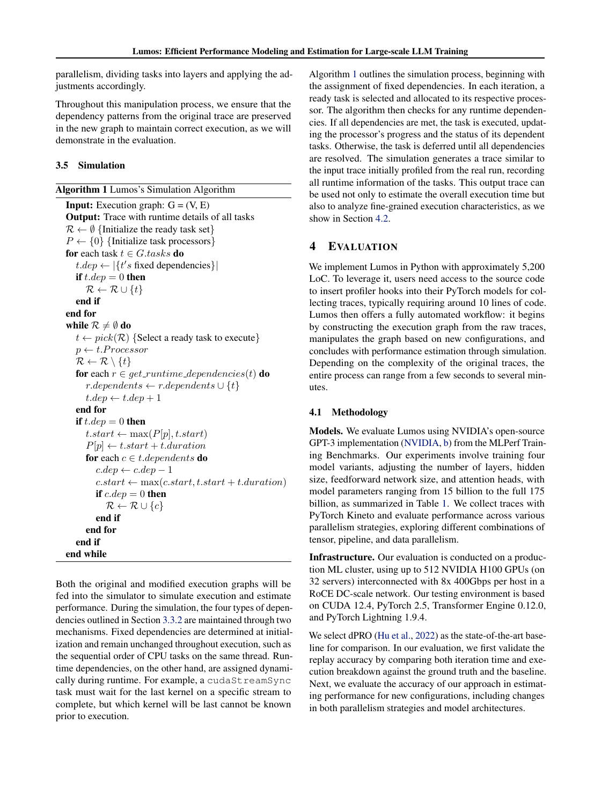
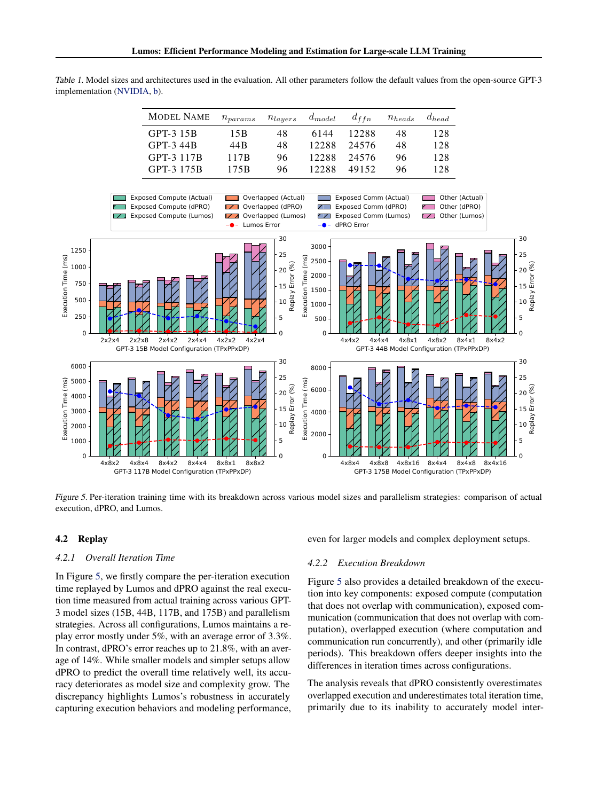
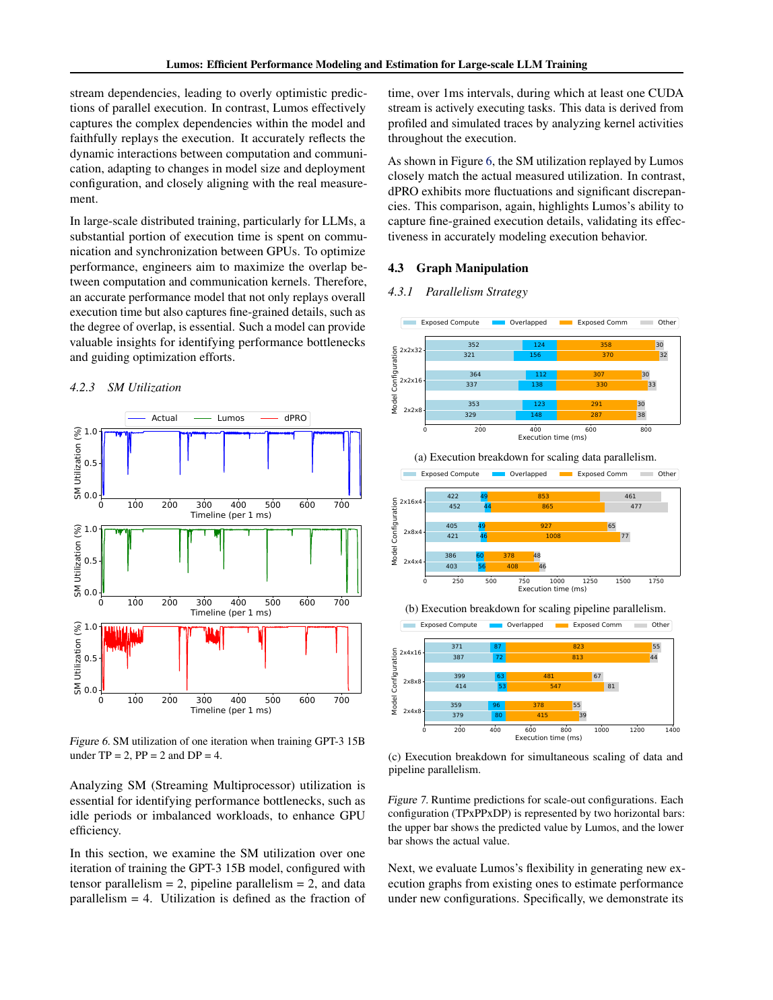
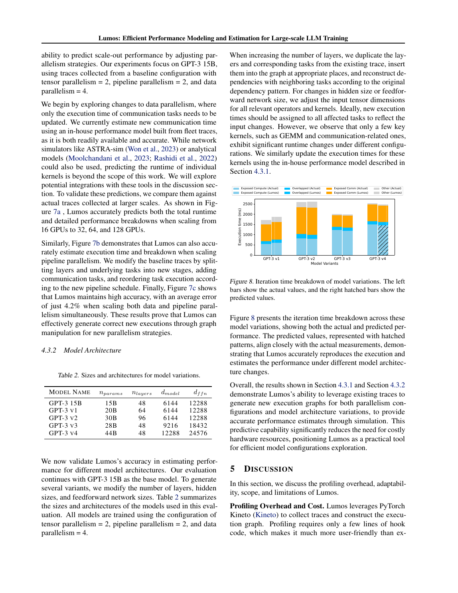
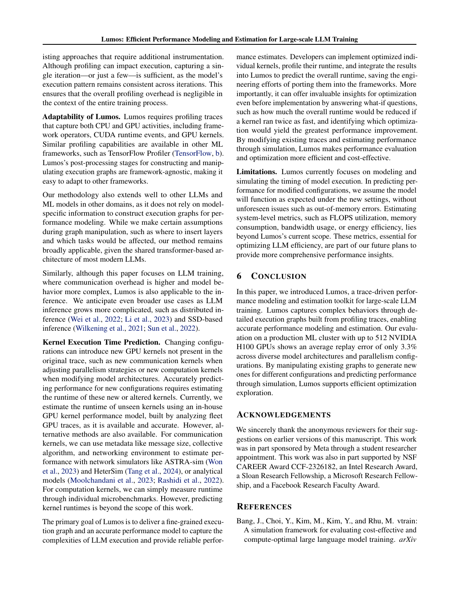

# Lumos：基于 Kineto 全执行栈依赖的现代 LLM trace replay

> 证据截图说明：正文中的 `原文截图 E###` 可跳转到文末证据卡片。截图按 PDF 物理页码生成；原有章节、图表、算法和段落定位保持不变。

## 0. 文献与证据口径

- 论文：Mingyu Liang et al., **Lumos: Efficient Performance Modeling and Estimation for Large-scale LLM Training**，MLSys 2025。
- MLSys 正式 PDF：<https://proceedings.mlsys.org/paper_files/paper/2025/file/a66caa1703fe34705a4368c3014c1966-Paper-Conference.pdf>
- 作者页面：<https://mingyu-liang.github.io/files/mlsys25-lumos.pdf>
- 本地原文：[lumos.pdf](sources/lumos.pdf)
- 版本：MLSys 2025 终稿，共 13 个 PDF 页；正文至 PDF p.10。 〔[原文截图 E001](#evidence-e001)〕
- 页码约定：下文“PDF p.N”按阅读器 1-based 页码，对应文本抽取 P(N-1)。同时给出节、Figure/Table/Algorithm 定位。
- 证据类型：“论文事实”来自原文；“本文归纳/推断”是针对当前录制回放架构的分析；开源核验截至 2026-08-06。

## 1. 一句话定位

Lumos 直接使用 PyTorch Kineto 产生的 operator、CUDA runtime 与 GPU kernel trace，在 CPU thread、CUDA stream、launch correlation、同步 API 和 CUDA event 间恢复完整依赖图；随后通过带固定/运行时依赖的离散事件模拟，回放现代 LLM 3D 并行训练，并通过图变换预测 DP/PP 与模型层数/hidden size 变化。它是四篇中对真实 CUDA stream/event 物理执行计划刻画最细、对 H100 大模型验证最新的一篇。

证据：摘要、§1，PDF pp.1–2；§3，PDF pp.3–6。 〔[原文截图 E002](#evidence-e002)〕

## 2. 要解决的问题

### 2.1 旧 trace replay 在现代 LLM 上失真

LLM 训练使用多 stream、3D parallelism 和大量计算—通信重叠。论文以 GPT-3 175B、TP=8/PP=4/DP=8 为例：dPRO 回放把 overlapped 部分估成 1,691 ms、exposed compute 3,235 ms、exposed communication 1,417 ms；真实值分别为 885、4,287、2,261 ms，端到端被明显低估。

证据：§1、Figure 1，PDF p.2。 〔[原文截图 E003](#evidence-e003)〕

作者认为关键缺口是旧方法未完整恢复跨 stream 依赖，因此把本应串行/等待的工作错误地并发执行。

证据：§1，PDF p.2；§4.2.2，PDF pp.7–8。 〔[原文截图 E004](#evidence-e004)〕

### 2.2 工程接入过重

Daydream/dPRO 需要框架或通信库定制 instrumentation。Lumos 的目标是只依赖框架内置 profiler；论文称不修改 framework/model 内部，应用侧通常增加约 10 行 profiler hook 即可。

证据：§1，PDF p.2；§3.2，Figure 2，PDF p.4；实现说明 §4，PDF p.6。 〔[原文截图 E005](#evidence-e005)〕

## 3. 工作流

1. 用 PyTorch Kineto 收集原始 trace；
2. 抽取 task 与依赖，构造低层 execution graph；
3. 原图可直接 replay；
4. 用户指定新并行度或模型架构后，对图分层、复制、重排和补通信，产生新图；
5. simulator 输出完整模拟 trace、迭代时间、时间分解和利用率。

证据：§3.1、Figure 2，PDF pp.3–4。 〔[原文截图 E006](#evidence-e006)〕

## 4. Trace 中记录什么

Kineto 捕获：

- PyTorch operator；
- CUDA runtime event；
- GPU kernel；
- 名称、开始时间、持续时间；
- CUDA stream ID、CPU thread ID、correlation ID 等元数据。

execution graph 只设两大 task 类：

- **CPU task**：PyTorch op 与 CUDA runtime event，绑定 CPU thread；
- **GPU task**：GPU kernel，绑定 CUDA stream。通信 kernel 也作为 GPU task 出现在实际执行图中。

证据：§3.2、§3.3.1，PDF p.4。 〔[原文截图 E007](#evidence-e007)〕

注意：论文的“仅使用内置 trace”不是完全零代码接入；§4 明确说用户需拿到模型源码并插入约 10 行 profiler hook。更准确的说法是“不需要修改框架/模型执行逻辑或通信库”。

## 5. 四类依赖

### 5.1 CPU→CPU

- 同一 thread 的相邻 task 按程序序连接。
- 不同 thread 的阻塞关系通过显著 execution gap 检测。例如 backward 在线程 2 开始前等待 forward 在线程 1 完成。

证据：§3.3.2、Figure 3，PDF pp.4–5。 〔[原文截图 E008](#evidence-e008)〕

### 5.2 CPU→GPU

`cudaLaunchKernel`、`cudaMemsetAsync` 等 runtime event 与对应 GPU kernel 共享 correlation ID，据此建立 launch edge。

证据：§3.3.2，PDF pp.4–5。 〔[原文截图 E009](#evidence-e009)〕

### 5.3 GPU→CPU

`cudaDeviceSync`、`cudaStreamSync` 等 CPU 事件要等待相关 GPU kernel 完成，因此形成 GPU→CPU 边。

证据：§3.3.2，PDF p.5。 〔[原文截图 E010](#evidence-e010)〕

### 5.4 GPU→GPU

- 同一 stream 内 kernel 串行。
- 跨 stream 依赖由 `cudaEventRecord` 与 `cudaStreamWaitEvent` 匹配：一个 stream 记录事件，另一个 stream 等待它。

证据：§3.3.2、Figure 3，PDF p.5。 〔[原文截图 E011](#evidence-e011)〕

这是 Lumos 相对 dPRO 最关键的技术增量：显式恢复 event/wait 后，计算与 NCCL stream 的重叠不会被过度放大。

## 6. 模拟算法

### 6.1 固定依赖与运行时依赖

- **Fixed dependency**：建图时已经确定，例如同 CPU thread 的程序序。
- **Runtime dependency**：要在模拟推进时才能确定。例如 `cudaStreamSync` 必须等待该 stream 当时最后一个 kernel，但“最后一个”可能因前面的变换/调度而变化。

证据：§3.5、Algorithm 1 后两段，PDF p.6。 〔[原文截图 E012](#evidence-e012)〕

### 6.2 时间推进

Algorithm 1 初始化 ready set 与每个 processor 的进度。对 ready task：

1. 绑定其 CPU thread/GPU stream processor；
2. 动态补充 runtime dependencies；
3. 只有全部依赖满足才执行；
4. `start = max(processor_available, predecessors_finish)`；
5. 更新 processor 进度，释放后继。

输出是一份与输入 profiler trace 同结构的模拟 trace，因此不仅能给总时长，还能计算 exposed compute、exposed communication、overlap、idle/other 和时间分辨率下的“SM utilization”。

证据：§3.5、Algorithm 1，PDF p.6；§4.2，PDF pp.7–8。 〔[原文截图 E013](#evidence-e013)〕

本文归纳：其“SM utilization”并非硬件 occupancy/真实 active warps，而定义为每 1ms 窗内是否至少一个 CUDA stream 正在执行 task 的时间占比。引用该图时不应把它解释成 Nsight 的硬件 SM 利用率。

证据：§4.2.3，Figure 6，PDF p.8。 〔[原文截图 E014](#evidence-e014)〕

## 7. 图变换与 what-if

### 7.1 Data parallelism

作者假设每个 worker 的本地计算不变，因此改变 DP 时只更新通信 task 的 duration。

证据：§3.4，PDF p.5。 〔[原文截图 E015](#evidence-e015)〕

### 7.2 Pipeline parallelism

1. 根据 1F1B 等 scheduling policy 重算 forward/backward 顺序；
2. 按 layer 分组原 task；
3. 假设层均匀分配，重新切分到 stages；
4. 重排 task 并在 stage 边界插入通信；
5. 尽量保持原 trace 的局部依赖模式。

证据：§3.4、Figure 4，PDF pp.5–6。 〔[原文截图 E016](#evidence-e016)〕

### 7.3 Tensor parallelism

当前不支持修改 TP。作者理由是实践中 TP 常固定在节点内且通信开销高，留作未来工作。

证据：§3.4，PDF p.5。 〔[原文截图 E017](#evidence-e017)〕

### 7.4 模型架构

- 改 layer 数：复制现有 transformer layer 及其 task，并按原依赖模式接回图。
- 改 hidden/FFN size：修改相关 op/kernel 的输入 tensor dimension，并更新受影响 task duration。
- 作者观察主要变化集中在 GEMM 与 communication kernel，因此只更新这些关键 task。

证据：§3.4，PDF pp.5–6；§4.3.2、Table 2、Figure 8，PDF p.9。 〔[原文截图 E018](#evidence-e018)〕

### 7.5 时长提供器

对新通信或改变 shape 的 kernel，论文使用 Meta 内部、由 fleet traces 构建的 in-house performance model。作者明确说“预测单个 kernel runtime”超出本文范围；替代方案可为 ASTRA-sim/解析通信模型或 computation microbenchmark。

证据：§4.3.1，PDF p.9；§5 “Kernel Execution Time Prediction”，PDF p.10。 〔[原文截图 E019](#evidence-e019)〕

因此 Lumos 的图与 DES 可以复现，但完整 what-if 准确性还依赖未公开的内部 duration provider。

## 8. 计算、通信、重叠和框架开销

### 8.1 计算

原配置沿用实测 GPU kernel duration；架构改变后为关键 GEMM 等 task 更新时长。没有通用 kernel 模型。

### 8.2 通信

原配置中的 NCCL kernel 和相关 runtime/event 由 Kineto trace 捕获；扩 DP/PP 后，通信 task duration 由内部模型更新。论文没有像 Echo 那样展示 collective 的 algorithm/protocol/chunk 白盒结构，也没有像 dPRO 那样给跨 worker transaction ID 细节。

### 8.3 重叠

通过 CPU thread、GPU stream、event record/wait 和 sync 的完整依赖重建。这是论文精度提升的主要解释。Lumos 模拟的是 trace 中已经体现的 contention 后 duration；对新并发模式是否重新预测 slowdown，论文没有给出 Echo 式上下文模型。

### 8.4 框架开销

PyTorch operator 与 CUDA runtime 都是 CPU task，因而比纯 GPU 图更能保存 host launch/sync/idle。但 Python 数据加载、编译、allocator 或分布式控制面若未被 profiler 明确表达，仍可能只以 gap/时间差残留，无法语义化重算。

证据：§3.2–§3.3，PDF pp.4–5；本文归纳其未覆盖部分。 〔[原文截图 E020](#evidence-e020)〕

## 9. 实现、开源与成熟度

### 9.1 论文实现

- Python 约 5,200 LoC；
- 应用侧约 10 行 profiler hook；
- 从 trace 建图、图变换到模拟自动化；
- 单个 workflow 随 trace 复杂度从数秒到数分钟。

证据：§4 开头，PDF p.6。 〔[原文截图 E021](#evidence-e021)〕

### 9.2 开源状态

论文和作者 PDF 页面没有给出 Lumos 代码仓库；截至 2026-08-06，本次公开检索未确认官方 release。论文使用的关键 fleet-trace kernel/communication performance model也未公开。

成熟度应标记为：**在生产集群实现并验证的研究/内部工具，公开可复现性未验证**。

## 10. 实验与量化结果

### 10.1 环境与模型

- NVIDIA MLPerf Training 的开源 GPT-3 实现；模型 15B、44B、117B、175B。
- 多种 TP×PP×DP 组合。
- 最高 512×H100、32 台服务器，每 host 8×400Gbps RoCE。
- CUDA 12.4、PyTorch 2.5、Transformer Engine 0.12.0、PyTorch Lightning 1.9.4。

证据：§4.1、Table 1，PDF pp.6–7。 〔[原文截图 E022](#evidence-e022)〕

### 10.2 原配置 replay

- 所有配置平均误差 3.3%，多数低于 5%。
- dPRO 平均误差 14%，最大 21.8%。
- 分解为 exposed compute、overlapped、exposed communication、other 后，dPRO 系统性高估 overlap 并低估总时间；Lumos 与真实值更接近。
- GPT-3 15B、TP=2/PP=2/DP=4 的 1ms 窗口 utilization 曲线与真实 trace 接近；dPRO 波动和偏差更大。

证据：§4.2.1–§4.2.3、Figures 5–6，PDF pp.7–8。 〔[原文截图 E023](#evidence-e023)〕

### 10.3 新配置预测

- 以 GPT-3 15B、TP=2/PP=2/DP=4、16 GPU trace 为基线，扩 DP 到 32/64/128 GPU，修改 PP，或同时修改 DP+PP。
- 同时扩 DP 与 PP 时平均误差 4.2%。
- 架构变化覆盖 20B/30B（增 layer）和 28B/44B（增 hidden/FFN）；Figure 8 展示预测时间分解与实测接近，但正文没有给统一的 architecture-change 平均误差数字。

证据：§4.3.1、Figure 7，PDF pp.8–9；§4.3.2、Table 2、Figure 8，PDF p.9。 〔[原文截图 E024](#evidence-e024)〕

注意：scale-out/architecture 预测调用了内部 fleet performance model；不能把结果全部归因于依赖图算法。

## 11. 优点

1. **真实低层全栈关联**：PyTorch op、CUDA runtime、kernel、thread、stream、event 和 correlation 同图。
2. **正确处理跨 stream 依赖**：对 LLM compute–communication overlap 尤其关键。
3. **接入轻**：不修改 PyTorch/NCCL，仅增加少量 profiler hook。
4. **输出模拟 trace 而非单一数字**：支持时间分解、利用率曲线、关键路径/下游分析。
5. **实验现代且规模大**：H100、PyTorch 2.5、15B–175B、最高 512 GPU。
6. **从复现扩展到图变换**：可从一个基线预测部分新 DP/PP 和架构配置。

## 12. 局限、代价和可扩展性

### 12.1 论文明确局限

- 目前只模拟 timing。
- 假设新配置能够正常运行，不检查 OOM 等不可行情况。
- 不预测 FLOPS utilization、memory consumption、bandwidth usage 或 energy efficiency。
- 新/改变 kernel 的 runtime 预测超出范围。

证据：§5 “Kernel Execution Time Prediction”与“Limitations”，PDF p.10。 〔[原文截图 E025](#evidence-e025)〕

### 12.2 并行策略与工作负载边界

- 只支持改变 DP/PP，不支持改变 TP；EP/MoE、CP、SP、DCP、ZeRO 未展示。
- PP 分层假设层可均匀切分，难覆盖 embedding/head 不对称、virtual pipeline、interleaving 与 heterogeneous stages。
- 改 layer 数主要复制原 layer，改 hidden 主要更新关键 GEMM/communication；新 fusion、不同 kernel family、allocator 行为和编译选择可能破坏模板复用。
- inference 只在 Discussion 中声称“可适用”，没有 serving、prefill/decode、continuous batching 或 KV cache 实验。

证据：§3.4，PDF pp.5–6；§5 Adaptability，PDF p.10。 〔[原文截图 E026](#evidence-e026)〕

### 12.3 Trace 假设与成本

- 作者认为一到少量 iteration 足够，因为执行模式稳定；动态 shape、稀疏路由、输入相关分支、重编译和周期性 optimizer/checkpoint task 会违背此假设。
- 单次建图/模拟数秒至数分钟，已适合交互式离线分析；但论文未给 graph 节点数、内存复杂度和千卡级模拟器自身伸缩曲线。
- 依赖显著 gap 推断跨 CPU thread 因果存在启发式误连/漏连风险。

证据：§5 “Profiling Overhead and Cost”，PDF pp.9–10；流程耗时见 §4，PDF p.6。 〔[原文截图 E027](#evidence-e027)〕

## 13. 与真实录制回放的差异

| 维度 | Lumos | 真正 record/replay 仍需 |
|---|---|---|
| 时间/资源因果 | 很强：thread/stream/event/sync/runtime dependency | 目标拓扑下新 rank arrival 和通信身份完整重建 |
| 逻辑 workload | op/kernel metadata、部分 input dimension | raw/valid/padded/storage extent、动态 token/sequence/expert counts |
| 数值与路径 | 不记录 | 输入/tensor/state/RNG，top-k/index/branch 等决策 |
| 通信身份 | trace 中的 NCCL kernel/相关 API | group membership、logical rank、ordinal、P2P message match、bytes/chunk |
| 状态生命周期 | 不建模 | parameter/optimizer/KV cache/allocator 的 object/version/read-write |
| 可行性 | 假定目标配置可运行 | memory、shape、collective 一致性、死锁与能力约束校验 |

所以 Lumos 很接近“物理执行计划的时间回放”，但不提供数值回放、路径回放或执行配方在任意目标配置上的语义证明。

## 14. 对 Ascend 训练/推理录制回放的启示

### 14.1 直接借鉴

1. Ascend trace schema 应统一 host framework op、ACL/runtime API、device kernel、memcpy、HCCL kernel，并保留 `thread_id/stream_id/correlation_id`。
2. 依赖恢复必须覆盖四象限：host→host、host→device、device→host、device→device；尤其是 event record/wait 和 stream sync。
3. simulator 必须区分 fixed dependency 与 runtime dependency，避免图变换后仍引用“原 trace 中最后一个 kernel”。
4. 输出模拟 trace 而非只输出 step time，便于与 Ascend profiler 对齐验证 exposed compute/comm、overlap、idle 和关键路径。
5. duration provider 与 replay engine 解耦；Observation Ledger 记录 duration 是实测、查表、拟合还是解析预测。

### 14.2 需要补齐

- HCCL 事件要有跨 rank identity 和 communicator ordinal；只有 device kernel stream 依赖仍不足以拼全局图。
- 采集动态 workload：sequence length、token count、expert load、dispatch/combine、padding 和消息真实 bytes。
- 记录高层逻辑 plan 与 rank-local physical plan 的映射；目标并行度变换从逻辑 plan 重新 lowering，而非盲目复制 kernel 图。
- 引入 memory/state model，至少能在图变换后检查 OOM、workspace、KV cache/optimizer state 和生命周期。
- 训练与推理分开设计：推理到达过程、batch merge/split、prefill/decode、KV cache 状态决定了时间线，不能假设一个 iteration 模板稳定。

### 14.3 推荐定位

Lumos 是本项目 **rank-local 物理计划和 stream/event 级 DES** 的最佳直接参考；dPRO 补跨 rank 消息因果，Echo 补 ex-situ workload 和 overlap/通信 cost，前置 survey 的 Execution Recipe/Physical Binding/Observation Ledger 则补语义可迁移性。

## 15. 最终评价

Lumos 证明，在现代 LLM 上准确 replay 的首要问题往往不是更复杂的数学模型，而是不要漏掉真实 runtime 依赖。它以较轻的接入成本，在 512×H100 上取得平均 3.3% 原配置回放误差，工程价值很高。但它对新配置的准确性部分依赖未公开 fleet model，且只覆盖 timing、DP/PP 和规则化 GPT 训练。对 Ascend，应优先复刻其四类依赖与运行时依赖机制，再补全跨 rank、动态 workload、状态和内存语义。

<!-- EVIDENCE_SCREENSHOTS:BEGIN -->

## 原文证据截图附录

正文中的 `原文截图 E###` 与本节证据卡片一一对应。卡片保留原笔记行号和原有页码/章节定位，并跳转到后面的页图；每个物理页在本篇笔记中只展示一次。截图用于快速核读，正式引用仍以原论文为准。

<strong>E001</strong> - 原笔记第 12 行 - PDF p.10

<strong>原定位：</strong> <code>- 版本：MLSys 2025 终稿，共 13 个 PDF 页；正文至 PDF p.10。</code>

<strong>页图：</strong> <a href="#source-page-p010">PDF p.10</a>

<strong>E002</strong> - 原笔记第 20 行 - PDF p.1, 2, 3, 4, 5, 6

<strong>原定位：</strong> <code>证据：摘要、§1，PDF pp.1–2；§3，PDF pp.3–6。</code>

<strong>页图：</strong> <a href="#source-page-p001">PDF p.1</a> · <a href="#source-page-p002">PDF p.2</a> · <a href="#source-page-p003">PDF p.3</a> · <a href="#source-page-p004">PDF p.4</a> · <a href="#source-page-p005">PDF p.5</a> · <a href="#source-page-p006">PDF p.6</a>

<strong>E003</strong> - 原笔记第 28 行 - PDF p.2

<strong>原定位：</strong> <code>证据：§1、Figure 1，PDF p.2。</code>

<strong>页图：</strong> <a href="#source-page-p002">PDF p.2</a>

<strong>E004</strong> - 原笔记第 32 行 - PDF p.2, 7, 8

<strong>原定位：</strong> <code>证据：§1，PDF p.2；§4.2.2，PDF pp.7–8。</code>

<strong>页图：</strong> <a href="#source-page-p002">PDF p.2</a> · <a href="#source-page-p007">PDF p.7</a> · <a href="#source-page-p008">PDF p.8</a>

<strong>E005</strong> - 原笔记第 38 行 - PDF p.2, 4, 6

<strong>原定位：</strong> <code>证据：§1，PDF p.2；§3.2，Figure 2，PDF p.4；实现说明 §4，PDF p.6。</code>

<strong>页图：</strong> <a href="#source-page-p002">PDF p.2</a> · <a href="#source-page-p004">PDF p.4</a> · <a href="#source-page-p006">PDF p.6</a>

<strong>E006</strong> - 原笔记第 48 行 - PDF p.3, 4

<strong>原定位：</strong> <code>证据：§3.1、Figure 2，PDF pp.3–4。</code>

<strong>页图：</strong> <a href="#source-page-p003">PDF p.3</a> · <a href="#source-page-p004">PDF p.4</a>

<strong>E007</strong> - 原笔记第 65 行 - PDF p.4

<strong>原定位：</strong> <code>证据：§3.2、§3.3.1，PDF p.4。</code>

<strong>页图：</strong> <a href="#source-page-p004">PDF p.4</a>

<strong>E008</strong> - 原笔记第 76 行 - PDF p.4, 5

<strong>原定位：</strong> <code>证据：§3.3.2、Figure 3，PDF pp.4–5。</code>

<strong>页图：</strong> <a href="#source-page-p004">PDF p.4</a> · <a href="#source-page-p005">PDF p.5</a>

<strong>E009</strong> - 原笔记第 82 行 - PDF p.4, 5

<strong>原定位：</strong> <code>证据：§3.3.2，PDF pp.4–5。</code>

<strong>页图：</strong> <a href="#source-page-p004">PDF p.4</a> · <a href="#source-page-p005">PDF p.5</a>

<strong>E010</strong> - 原笔记第 88 行 - PDF p.5

<strong>原定位：</strong> <code>证据：§3.3.2，PDF p.5。</code>

<strong>页图：</strong> <a href="#source-page-p005">PDF p.5</a>

<strong>E011</strong> - 原笔记第 95 行 - PDF p.5

<strong>原定位：</strong> <code>证据：§3.3.2、Figure 3，PDF p.5。</code>

<strong>页图：</strong> <a href="#source-page-p005">PDF p.5</a>

<strong>E012</strong> - 原笔记第 106 行 - PDF p.6

<strong>原定位：</strong> <code>证据：§3.5、Algorithm 1 后两段，PDF p.6。</code>

<strong>页图：</strong> <a href="#source-page-p006">PDF p.6</a>

<strong>E013</strong> - 原笔记第 120 行 - PDF p.6, 7, 8

<strong>原定位：</strong> <code>证据：§3.5、Algorithm 1，PDF p.6；§4.2，PDF pp.7–8。</code>

<strong>页图：</strong> <a href="#source-page-p006">PDF p.6</a> · <a href="#source-page-p007">PDF p.7</a> · <a href="#source-page-p008">PDF p.8</a>

<strong>E014</strong> - 原笔记第 124 行 - PDF p.8

<strong>原定位：</strong> <code>证据：§4.2.3，Figure 6，PDF p.8。</code>

<strong>页图：</strong> <a href="#source-page-p008">PDF p.8</a>

<strong>E015</strong> - 原笔记第 132 行 - PDF p.5

<strong>原定位：</strong> <code>证据：§3.4，PDF p.5。</code>

<strong>页图：</strong> <a href="#source-page-p005">PDF p.5</a>

<strong>E016</strong> - 原笔记第 142 行 - PDF p.5, 6

<strong>原定位：</strong> <code>证据：§3.4、Figure 4，PDF pp.5–6。</code>

<strong>页图：</strong> <a href="#source-page-p005">PDF p.5</a> · <a href="#source-page-p006">PDF p.6</a>

<strong>E017</strong> - 原笔记第 148 行 - PDF p.5

<strong>原定位：</strong> <code>证据：§3.4，PDF p.5。</code>

<strong>页图：</strong> <a href="#source-page-p005">PDF p.5</a>

<strong>E018</strong> - 原笔记第 156 行 - PDF p.5, 6, 9

<strong>原定位：</strong> <code>证据：§3.4，PDF pp.5–6；§4.3.2、Table 2、Figure 8，PDF p.9。</code>

<strong>页图：</strong> <a href="#source-page-p005">PDF p.5</a> · <a href="#source-page-p006">PDF p.6</a> · <a href="#source-page-p009">PDF p.9</a>

<strong>E019</strong> - 原笔记第 162 行 - PDF p.9, 10

<strong>原定位：</strong> <code>证据：§4.3.1，PDF p.9；§5 “Kernel Execution Time Prediction”，PDF p.10。</code>

<strong>页图：</strong> <a href="#source-page-p009">PDF p.9</a> · <a href="#source-page-p010">PDF p.10</a>

<strong>E020</strong> - 原笔记第 184 行 - PDF p.4, 5

<strong>原定位：</strong> <code>证据：§3.2–§3.3，PDF pp.4–5；本文归纳其未覆盖部分。</code>

<strong>页图：</strong> <a href="#source-page-p004">PDF p.4</a> · <a href="#source-page-p005">PDF p.5</a>

<strong>E021</strong> - 原笔记第 195 行 - PDF p.6

<strong>原定位：</strong> <code>证据：§4 开头，PDF p.6。</code>

<strong>页图：</strong> <a href="#source-page-p006">PDF p.6</a>

<strong>E022</strong> - 原笔记第 212 行 - PDF p.6, 7

<strong>原定位：</strong> <code>证据：§4.1、Table 1，PDF pp.6–7。</code>

<strong>页图：</strong> <a href="#source-page-p006">PDF p.6</a> · <a href="#source-page-p007">PDF p.7</a>

<strong>E023</strong> - 原笔记第 221 行 - PDF p.7, 8

<strong>原定位：</strong> <code>证据：§4.2.1–§4.2.3、Figures 5–6，PDF pp.7–8。</code>

<strong>页图：</strong> <a href="#source-page-p007">PDF p.7</a> · <a href="#source-page-p008">PDF p.8</a>

<strong>E024</strong> - 原笔记第 229 行 - PDF p.8, 9

<strong>原定位：</strong> <code>证据：§4.3.1、Figure 7，PDF pp.8–9；§4.3.2、Table 2、Figure 8，PDF p.9。</code>

<strong>页图：</strong> <a href="#source-page-p008">PDF p.8</a> · <a href="#source-page-p009">PDF p.9</a>

<strong>E025</strong> - 原笔记第 251 行 - PDF p.10

<strong>原定位：</strong> <code>证据：§5 “Kernel Execution Time Prediction”与“Limitations”，PDF p.10。</code>

<strong>页图：</strong> <a href="#source-page-p010">PDF p.10</a>

<strong>E026</strong> - 原笔记第 260 行 - PDF p.5, 6, 10

<strong>原定位：</strong> <code>证据：§3.4，PDF pp.5–6；§5 Adaptability，PDF p.10。</code>

<strong>页图：</strong> <a href="#source-page-p005">PDF p.5</a> · <a href="#source-page-p006">PDF p.6</a> · <a href="#source-page-p010">PDF p.10</a>

<strong>E027</strong> - 原笔记第 268 行 - PDF p.6, 9, 10

<strong>原定位：</strong> <code>证据：§5 “Profiling Overhead and Cost”，PDF pp.9–10；流程耗时见 §4，PDF p.6。</code>

<strong>页图：</strong> <a href="#source-page-p006">PDF p.6</a> · <a href="#source-page-p009">PDF p.9</a> · <a href="#source-page-p010">PDF p.10</a>

## 原文页面图库（按页去重）

同一页可能支撑多个证据点；下面按物理页集中展示，每个截图文件只嵌入一次。

<strong>PDF p.1</strong> - 被 E002 引用

<strong>PDF p.2</strong> - 被 E002、E003、E004、E005 引用

<strong>PDF p.3</strong> - 被 E002、E006 引用

<strong>PDF p.4</strong> - 被 E002、E005、E006、E007、E008、E009、E020 引用

<strong>PDF p.5</strong> - 被 E002、E008、E009、E010、E011、E015、E016、E017、E018、E020、E026 引用

<strong>PDF p.6</strong> - 被 E002、E005、E012、E013、E016、E018、E021、E022、E026、E027 引用

<strong>PDF p.7</strong> - 被 E004、E013、E022、E023 引用

<strong>PDF p.8</strong> - 被 E004、E013、E014、E023、E024 引用

<strong>PDF p.9</strong> - 被 E018、E019、E024、E027 引用

<strong>PDF p.10</strong> - 被 E001、E019、E025、E026、E027 引用

<!-- EVIDENCE_SCREENSHOTS:END -->
