# Habitat：基于源 GPU 运行时信息的跨 GPU 训练性能预测

> 证据截图说明：正文中的 `原文截图 E###` 可跳转到文末证据卡片。截图按 PDF 物理页码生成；原有章节、图表、算法和段落定位保持不变。


> 论文：Geoffrey X. Yu, Yubo Gao, Pavel Golikov, Gennady Pekhimenko, **Habitat: A Runtime-Based Computational Performance Predictor for Deep Neural Network Training**, USENIX ATC 2021, pp. 503–521。  
> 原文：[USENIX 论文 PDF](https://www.usenix.org/system/files/atc21-yu.pdf)；[会议页面](https://www.usenix.org/conference/atc21/presentation/yu)；[开源仓库](https://github.com/geoffxy/habitat)。  
> 版本核对：这是正式会议论文，不是“边缘推理延迟预测”论文；目标是**单 GPU DNN 训练迭代**的跨 GPU 预测。  
> 页码口径：PDF 共 20 页。PDF 第 1 页是 USENIX 封面；正文 PDF 第 2–20 页对应会议印刷页 503–521。下文以“PDF页/印刷页”双标注；段落号按该小节正文自然段计，不含公式、列表和图注。

## 1. 一句话结论与路线归类

Habitat 先在用户已有的“源 GPU”上录制一轮训练迭代，把迭代拆成 PyTorch operation 与底层 kernel；再对目标 GPU 逐 operation 预测：kernel 在两代 GPU 间保持相似时用解析式 **wave scaling**，kernel 实现会随 GPU 改变时用预训练 MLP；最后把各 operation 的预测时间相加得到迭代时间。

它属于“profiling → 预测模型 → 系统级组合”，但并不是严格意义上的“目标 GPU 查表”：

- **原文事实：** 必须能在源 GPU 上运行目标模型与相同 batch size，并采到实际 operation/kernel 信息；目标 GPU 不必运行目标模型。
- **原文事实：** MLP 训练阶段在六种 GPU 上大规模随机采样 operation 配置；wave scaling 依赖源 GPU 的实测 kernel 时间和性能计数器。
- **归纳：** 它是“源运行 trace + 解析跨 GPU 缩放 + 少数算子 MLP”的混合 predictor，比纯 lookup table 更靠近本项目的 Observation→CostModel 层。
- **边界：** 论文主体不模拟分布式通信、计算通信重叠、排队、动态 scheduler、KV 状态或推理请求到达；这些在论文中被明确留给未来工作。

定位：PDF 2–3/印刷 503–504，Abstract、§1 第 7–10 段及贡献列表；PDF 5/印刷 506，§3.2 第 1–3 段。 〔[原文截图 E001](#evidence-e001)〕

## 2. 问题定义

### 2.1 要解决什么

用户通常无法为了选卡而先购买或租用所有候选 GPU；公共 benchmark 又只覆盖少数模型/GPU。Habitat 要回答：给定一个 PyTorch DNN、一个固定 batch size、一个用户已有的源 GPU和一个目标 GPU，目标 GPU 上**一轮训练迭代的执行时间**是多少，并由此计算训练吞吐和租用成本归一化吞吐。

定位：PDF 2–3/印刷 503–504，§1 第 1–10 段；PDF 4/印刷 505，§2.2–§2.5；PDF 5/印刷 506，§3.2 第 1 段。 〔[原文截图 E002](#evidence-e002)〕

### 2.2 为什么训练迭代可预测

论文的三个观察是：

1. 训练是短迭代的重复，因此一轮迭代可代表整体硬件效率；
2. DNN 虽有很多调用，但 unique operation 种类较少；
3. 用户通常已有一张开发 GPU，可提供目标模型真实的 runtime/kernel 元数据。

定位：PDF 5/印刷 506，§3.1 的 Observation 1–3 三段。 〔[原文截图 E003](#evidence-e003)〕

### 2.3 输入与输出

| 层 | 输入 | 输出 |
|---|---|---|
| 用户接口 | PyTorch 训练迭代闭包、源 GPU、目标 GPU、固定 batch size | 目标 GPU 的迭代执行时间 |
| operation trace | 一轮中实际执行的 operation、参数/输入、前向与反向语义 | 可独立重跑的 operation 列表 |
| wave scaling | 源 kernel 时间、thread blocks、block size、算术强度、源/目标 GPU 带宽/频率/occupancy | 目标 kernel 时间 |
| MLP | operation shape/参数 + 目标 GPU 的容量、带宽、SM 数、峰值 FLOPS | 该 operation 前向+反向时间 |
| 汇总 | 全部 operation 的目标预测时间 | 迭代时间、吞吐、cost-normalized throughput |

定位：PDF 3/印刷 504，Listing 1 与其后第 1–4 段；PDF 5/印刷 506，§3.2；PDF 6/印刷 507，§4.1。 〔[原文截图 E004](#evidence-e004)〕

## 3. 采集流程与可视为“表”的 schema

### 3.1 在线录制：一轮训练迭代

Habitat monkey-patch PyTorch operation，用 wrapper 截获用户在 `track()` 区间内执行的每个 operation。为避免极短调用计时不准，它用原先截获的相同输入把 operation 独立重跑多次，用 CUDA event 测 operation 的前向和（若有）反向时间；同时通过 CUPTI 采集组成该 operation 的 kernel 时间与性能指标。

定位：PDF 6/印刷 507，§4.1 第 1–3 段（定位词 `monkey patching`、`re-runs each operation independently`、`Kernel metadata and metrics`）。 〔[原文截图 E005](#evidence-e005)〕

可映射为如下记录：

```text
OperationProfileKey:
  framework_op
  input/output shapes and operation parameters
  forward/backward role
  source_gpu

OperationObservation:
  forward_time
  backward_time
  ordered kernels[]:
    kernel_name
    duration
    grid/thread-block count B
    block size
    CUPTI bytes read/written and FLOP efficiency
```

上面是对论文信息的**工程归纳**，不是论文给出的序列化格式；论文没有公布一个正式 trace schema。

### 3.2 wave scaling 的缓存键

性能计数器采集很慢，Habitat 用 `(kernel name, launch configuration)` 缓存指标，launch configuration 包括 thread block 数与 block size；只为迭代时间贡献位于约 99.5 百分位以上的 operation 采性能指标，缺指标时将 `γ=1`，即近似为内存带宽受限。

定位：PDF 7/印刷 508，§4.2 最后一段（定位词 `cache measured metrics`、`99.5th percentile`）。 〔[原文截图 E006](#evidence-e006)〕

### 3.3 MLP 离线数据表

论文为四类 kernel-varying operation 建独立数据集，随机采样输入配置，在六张 GPU 上用同一随机种子采相同配置；OOM/非法配置被丢弃。表 1 的规模为：

| operation | operation 特征 | GPU 特征 | unique 配置数 × GPU 数 |
|---|---:|---:|---:|
| 2D convolution | 7 | 4 | 91,138 × 6 |
| LSTM | 7 | 4 | 124,176 × 6 |
| BMM | 4 | 4 | 131,022 × 6 |
| Linear | 4 | 4 | 155,596 × 6 |

operation 维度范围：卷积采 batch 1–64、输入通道 3–2048、输出通道 16–2048、kernel 1–11、padding 0–3、stride 1–4、image 1–256 及 bias；LSTM 采 batch 1–128、输入/hidden 1–1280、sequence 1–64、layer 1–6、双向/bias；BMM 的 batch 1–128、三个矩阵维 1–1024；Linear 的 batch 1–3500、输入/输出 feature 1–32768、bias。

定位：PDF 7–8/印刷 508–509，§4.3.1、表 1，第 1–6 段。 〔[原文截图 E007](#evidence-e007)〕

## 4. 预测方法

### 4.1 operation 分类：kernel-alike 与 kernel-varying

- kernel-alike：不同 GPU 上仍由相同/相似 kernel 实现；使用 wave scaling。论文评估中约占 unique operation 的 95%，但只占迭代时间约 46%。
- kernel-varying：cuDNN/cuBLAS 等会按 GPU 架构选择不同 kernel；对 Conv2D、LSTM、BMM、Linear 使用 operation-specific MLP。评估中约占 unique operation 的 5%，却占时间约 54%。

定位：PDF 5/印刷 506，§3.2 第 3 段；PDF 10/印刷 511，§5.2.3 第 1–3 段。 〔[原文截图 E008](#evidence-e008)〕

论文没有给出一个自动、普适的 kernel-varying 判定算法。哪些 operation 进入 MLP 是实现支持集与工程判断的一部分，这是迁移时必须重新验证的隐藏 schema。

### 4.2 wave scaling

令 `T_o/T_d` 为源/目标 kernel 时间，`B` 为 thread blocks 数，`W_o/W_d` 为每个 wave 可容纳的 blocks 数，`D_o/D_d` 为实测内存带宽，`C_o/C_d` 为频率，`γ∈[0,1]` 表示内存带宽受限程度。论文 Eq. (1) 以 wave 数、带宽比和频率比缩放源时间；实际用大 wave 数近似后的 Eq. (2)。`W_i` 由 CUDA occupancy calculator 计算，`D_i` 是预先一次性实测并随 Habitat 配置发布，`C_i` 来自规格。

`γ` 由 roofline 算术强度 `x` 与目标 GPU ridge point `R=P/D` 的位置确定：`x<R` 时从 1 线性降到 0.5，超过 `R` 后随 `R/x` 逼近 0。算术强度从 CUPTI 的 FLOP efficiency 和 DRAM 读写字节经验计算。

定位：PDF 6/印刷 507，§3.3、Eq. (1)–(2)；PDF 7/印刷 508，§4.2、图 2、Eq. (3)。 〔[原文截图 E009](#evidence-e009)〕

优点是样本少、解释性强；缺点是显式假设 kernel code/launch 行为可跨 GPU 对齐，而且论文脚注承认没有建模 ISA 等更复杂时钟效应。

### 4.3 MLP

每个 operation 一张 MLP：输入为 operation/layer 维度，加目标 GPU 的内存容量、内存带宽、SM 数、峰值 FLOPS；8 个 hidden layer、每层 1024 ReLU，输出一个前向+反向总时间。训练 80 epoch，Adam，初始 LR `5e-4`、40 epoch 后 `1e-4`，weight decay `1e-4`，batch 512；80/20 train/test，输入标准化，loss 为 MAPE；正式模型评估用到的配置不进入 MLP 训练集。

定位：PDF 6/印刷 507，§3.4 第 2–3 段；PDF 8/印刷 509，§4.3.2–§4.3.3、表 1。 〔[原文截图 E010](#evidence-e010)〕

这是对未覆盖 shape 的 learned interpolation/extrapolation，但没有物理约束输出，也没有不确定度/OOD 拒绝策略；论文 2025 年的 NeuSight 实验后来显示，直接 latency MLP 对新 GPU/新 shape 可能灾难性外推，这也是 Habitat 的重要边界，详见本目录 `03_neusight_gpu_forecasting.md`。

### 4.4 端到端组合

Habitat 对一轮 trace 中每个 operation 单独预测，再直接求和得到 iteration time。论文评估指标是 wall-clock iteration execution time，吞吐为 `batch_size / iteration_time`，成本归一化吞吐再除以 GPU 每小时租金。

定位：PDF 5/印刷 506，§3.2 第 2 段；PDF 9/印刷 510，§5.1 `Metrics` 段。 〔[原文截图 E011](#evidence-e011)〕

这里没有 DAG 调度、并发 stream、通信重叠或 queue 模型。对当前录制回放项目而言，Habitat cost model 只能给 Operator/Kernel node 的服务时间，不能独立生成 Distributed Execution Graph 的端到端时间线。

## 5. 冷启动、跨 GPU 与跨模型泛化

### 5.1 冷启动成本

- 用户侧必须在源 GPU 上真正跑得动**同模型、同 batch size**的一轮训练。
- wave scaling 所需 GPU 带宽事先测一次；目标 GPU occupancy/规格需可得。
- 四类 MLP 由论文作者离线在六张 GPU、约 50 万级 unique operation 配置上采样，并发布预训练模型；用户不需要每个模型重训 MLP。
- 性能计数器采集需要特殊权限，且 metric replay 慢，论文用缓存和只测重要 operation 降本。

定位：PDF 3/印刷 504，Listing 1；PDF 6–8/印刷 507–509，§4.1–§4.3；开源仓库 README 的 Running From Source。 〔[原文截图 E012](#evidence-e012)〕

### 5.2 跨 GPU

正式评估覆盖 P4000、P100、V100、RTX 2070、RTX 2080Ti、T4，跨 Pascal/Volta/Turing、桌面/工作站/服务器等级。所有 6×5=30 个源→目标有向 GPU 对都评估。

定位：PDF 8–9/印刷 509–510，表 2、§5.2 第 1 段。 〔[原文截图 E013](#evidence-e013)〕

### 5.3 跨模型

支持 ResNet-50、Inception v3、Transformer、GNMT、DCGAN。泛化来自“operation building blocks 可复用”，不是学习完整模型 embedding。测试模型实际 operation 配置不在 MLP 训练集中，但它们仍在论文采样范围附近；没有真正的现代 LLM、MoE、FlashAttention 或动态图验证。

定位：PDF 8–10/印刷 509–511，表 4、§5.2.1–§5.2.4。 〔[原文截图 E014](#evidence-e014)〕

## 6. 计算、通信、重叠、排队与状态

| 维度 | 论文能力 | 证据与边界 |
|---|---|---|
| 单卡计算 | 主体能力 | operation→kernel，wave scaling/MLP |
| 分布式通信 | 主体未实现 | §6.1.1 仅讨论把 Habitat 计算预测作为已有 DP 通信模型输入 |
| 计算通信重叠 | 未实现 | §6.1.1 明确把通信和 overlap 视为另两项待组合任务；model/pipeline parallel 需新技术 |
| 调度排队 | 未实现 | 固定一轮迭代，不是在线 serving |
| 动态 batch/shape | 只支持用户给定、源卡可运行的 batch | 更大 batch 建议对几个可运行 batch 做线性回归外推，留作未来工作 |
| mixed precision | 主体未实现 | §6.1.2 建议串联 Daydream；示例平均误差 16.1% |
| 数值/状态 | 不建模 | 论文验证 synthetic data 值不影响其训练计算时间，但这不能外推到 MoE/index/KV 动态路径 |

定位：PDF 12–13/印刷 513–514，§6.1.1–§6.1.3。 〔[原文截图 E015](#evidence-e015)〕

## 7. 误差定义与关键实验结果

### 7.1 定义与测量

论文把预测误差按相对百分比报告；MLP 的训练 loss 明确为 MAPE。ground truth 用 CUDA event；先 3 次 warmup 丢弃，再取 3 次测量平均；kernel 用 CUPTI。正文没有报告置信区间、跨运行方差或 tail error。

定位：PDF 8–9/印刷 509–510，§4.3.3 的公式与 §5.1 `Measurements` 段。 〔[原文截图 E016](#evidence-e016)〕

### 7.2 主要结果

- 全部 GPU/模型平均迭代时间误差 11.8%。按模型：ResNet-50 13.4%、Inception v3 9.5%、Transformer 12.6%、GNMT 11.2%、DCGAN 12.3%。
- MLP 覆盖的 Conv2D/LSTM/BMM/Linear 平均 operation error 18.0%；wave scaling operation error 29.8%，但高误差的长尾 op 对端到端贡献很小。
- 简单 peak-FLOPS 比例预测 DCGAN 误差至少 42.5%、最高 64.9%；Habitat 对相同预测平均 10.2%、最大 21.8%。
- GNMT 选云卡案例平均误差 10.7%，仍正确排序性能和成本；DCGAN 案例平均误差 7.7%，正确判断 V100 相对 2080Ti 仅约 1.1×。
- Habitat+Daydream 做混合精度跨 GPU 预测平均误差 16.1%；只用 Daydream 转换实测 FP32 的误差 10.7%。

定位：PDF 4/印刷 505，图 1；PDF 9–10/印刷 510–511，图 3–5、§5.2；PDF 11–12/印刷 512–513，图 6–7、§5.3；PDF 13/印刷 514，§6.1.2。 〔[原文截图 E017](#evidence-e017)〕

## 8. 实现、开源与落地成熟度

**原文事实：** Habitat 是 PyTorch Python library，论文给出 `OperationTracker` API，并声明开源。仓库含 Python analyzer、C++/CUDA/CUPTI 组件、Docker、实验模型和预训练模型下载，Apache-2.0 主许可证；运行需要从源码编译与 GPU performance-counter 权限。

**现状核验（2026-08-06）：** GitHub 页面显示公共仓库约 11 次提交、无 release，README 仍强调只能源码构建。它是可复现实验原型，不是活跃演进的生产 predictor。这里的现状属于仓库事实，不是 2021 论文结论。

**成熟度判断：研究原型（中）。** 方法、代码和预训练模型都存在，API 清楚；但软件栈是 PyTorch 1.4/CUDA 10.1/cuDNN 7 的时代，目标是单卡静态训练迭代，不能直接承担现代 LLM serving 或昇腾分布式回放。

定位：PDF 3/印刷 504，Listing 1 与开源声明；PDF 6/印刷 507，§4；PDF 8/印刷 509，§5.1；仓库 README。 〔[原文截图 E018](#evidence-e018)〕

## 9. 优点、缺点与适用边界

### 优点

1. 利用源 GPU 的真实 kernel 选择和 runtime 信息，避免纯 FLOP/规格模型失真。
2. wave scaling 解释性强，对 95% 的 unique kernel-alike op 无需逐类训练 ML。
3. MLP 按 operation 类型复用，支持自定义 DNN，不要求完整模型出现在训练集中。
4. 显式区分 kernel-alike/kernel-varying，承认 vendor library 会换实现。
5. 已有公开代码、预训练模型与完整采样范围。

### 缺点

1. 必须在源 GPU 上跑得动相同 batch；无法解决源卡内存不足或模型根本不可执行的冷启动。
2. 直接 latency MLP 无物理上界、OOD 检测和置信度；跨架构太远时可能严重外推。
3. operation 时间直接相加，不刻画 kernel overlap、通信、队列、host 开销和跨-rank arrival。
4. 假定源/目标 kernel-alike 分类稳定；编译器 fusion、graph capture、layout/tiling 改变会破坏该假设。
5. 单精度、单卡、固定 batch 为主体；分布式、mixed precision 和超源卡 batch 只是讨论。
6. 论文脚注“数据值不影响训练计算时间”只在所测 dense 模型/配置成立，不能套到现代 MoE、稀疏 attention、KV/index、conditional execution。

## 10. 与本项目“录制回放”的关系

### 10.1 能直接借鉴的部分

Habitat 证明了**一次源运行的物理观测可用来校准目标硬件成本**，适合放进 V0.8 的三分法：

```text
Execution Recipe
  semantic_op_id, global/local ABI, valid extent, dtype, layout, phase

Physical Binding
  kernel implementation, launch/tiling, format, target NPU specs

Observation Ledger
  source operation/kernel time, performance counters, evidence locator

Cost Model
  analytic scaling or learned predictor -> target service time
```

不能借鉴的是把 source duration 直接当 Recipe 属性。Habitat 的缩放时间只能作为目标 binding 的 cost estimate，并必须通过目标实测回填。

### 10.2 对查表 schema 的启示

对昇腾至少应把 key 从 `op + shape` 扩展为：

```text
semantic_op_id / op_type
global/local logical shape + valid extent
storage shape + ND/NZ/packing + stride
dtype + quantization + scale/offset shape
implementation/fusion/graph mode
tiling/workspace key（可观测则录）
parallel coordinates/group
phase and scheduler bucket
SoC/CANN/torch_npu/framework versions
```

Habitat 只覆盖其中 operation shape、kernel、launch 和 GPU 特征；本项目必须补上状态、index/count、collective、graph 地址/alias 与版本。

### 10.3 昇腾迁移方案

1. **录制端：** 在 vLLM Ascend/SGLang NPU 关键 sink 建 `OperatorObservation`；用 torch_npu/CANN Profiler 采 kernel、输入输出 shape/dtype/format、stream、duration；框架 hook 补 semantic ID、valid extent、MoE split、KV state。
2. **分类端：** 将 `kernel-alike` 改为“同语义、同 CANN implementation family、同 layout/tiling regime”；CANN 或 SoC 变化后默认重新分类，不能按 op 名继承。
3. **解析模型：** CUDA wave 公式不能原样套 NPU。需为 AICore 的 Cube/Vector pipeline、core 数、HBM/片上带宽、blockDim、tiling 数据建立 NPU-specific scaling；不可见字段标 unknown。
4. **ML 模型：** 对 MatMul/GMM/attention/quant/fusion 分模型，输入加入 storage shape、format、dtype、quant、有效长度、tiling/workspace、SoC 规格；输出使用 log-latency 或 bounded utilization，并带 OOD/置信度。
5. **组合端：** 预测值只作为 DEG 节点 service time；由 event-driven replay 按 stream/DAG/collective arrival 组合，不能简单求和。
6. **校验端：** 同 phase 重放，分 op、rank、collective ordinal 比较 MAPE/分位误差，并把未命中表、OOD、fallback 单列。

以上 1–6 是**面向本项目的推断/设计**，不是 Habitat 原文已经支持的能力。

## 11. 最终评价

Habitat 最有价值的思想不是“MLP 预测 latency”，而是：真实源运行揭示了目标模型实际使用的 operation/kernel，解析模型与 ML 应按 kernel 稳定性分工。对昇腾录制回放，它适合作为第一代 operator cost calibration 的参考；但必须由 V0.8 的 Recipe/Binding/Observation 分离、状态/决策记录和跨-rank DAG 来补齐，不能被误称为完整回放系统。

<!-- EVIDENCE_SCREENSHOTS:BEGIN -->

## 原文证据截图附录

正文中的 `原文截图 E###` 与本节证据卡片一一对应。卡片保留原笔记行号和原有页码/章节定位，并跳转到后面的页图；每个物理页在本篇笔记中只展示一次。截图用于快速核读，正式引用仍以原论文为准。

<a id="evidence-e001"></a>

<details>
<summary><strong>E001</strong> - 原笔记第 22 行 - PDF p.2, 3, 5</summary>

<p><strong>原定位：</strong> <code>定位：PDF 2–3/印刷 503–504，Abstract、§1 第 7–10 段及贡献列表；PDF 5/印刷 506，§3.2 第 1–3 段。</code></p>

<p><strong>页图：</strong> <a href="#source-page-p002">PDF p.2</a> · <a href="#source-page-p003">PDF p.3</a> · <a href="#source-page-p005">PDF p.5</a></p>

</details>

<a id="evidence-e002"></a>

<details>
<summary><strong>E002</strong> - 原笔记第 30 行 - PDF p.2, 3, 4, 5</summary>

<p><strong>原定位：</strong> <code>定位：PDF 2–3/印刷 503–504，§1 第 1–10 段；PDF 4/印刷 505，§2.2–§2.5；PDF 5/印刷 506，§3.2 第 1 段。</code></p>

<p><strong>页图：</strong> <a href="#source-page-p002">PDF p.2</a> · <a href="#source-page-p003">PDF p.3</a> · <a href="#source-page-p004">PDF p.4</a> · <a href="#source-page-p005">PDF p.5</a></p>

</details>

<a id="evidence-e003"></a>

<details>
<summary><strong>E003</strong> - 原笔记第 40 行 - PDF p.5</summary>

<p><strong>原定位：</strong> <code>定位：PDF 5/印刷 506，§3.1 的 Observation 1–3 三段。</code></p>

<p><strong>页图：</strong> <a href="#source-page-p005">PDF p.5</a></p>

</details>

<a id="evidence-e004"></a>

<details>
<summary><strong>E004</strong> - 原笔记第 52 行 - PDF p.3, 5, 6</summary>

<p><strong>原定位：</strong> <code>定位：PDF 3/印刷 504，Listing 1 与其后第 1–4 段；PDF 5/印刷 506，§3.2；PDF 6/印刷 507，§4.1。</code></p>

<p><strong>页图：</strong> <a href="#source-page-p003">PDF p.3</a> · <a href="#source-page-p005">PDF p.5</a> · <a href="#source-page-p006">PDF p.6</a></p>

</details>

<a id="evidence-e005"></a>

<details>
<summary><strong>E005</strong> - 原笔记第 60 行 - PDF p.6</summary>

<p><strong>原定位：</strong> <code>定位：PDF 6/印刷 507，§4.1 第 1–3 段（定位词 `monkey patching`、`re-runs each operation independently`、`Kernel metadata and metrics`）。</code></p>

<p><strong>页图：</strong> <a href="#source-page-p006">PDF p.6</a></p>

</details>

<a id="evidence-e006"></a>

<details>
<summary><strong>E006</strong> - 原笔记第 88 行 - PDF p.7</summary>

<p><strong>原定位：</strong> <code>定位：PDF 7/印刷 508，§4.2 最后一段（定位词 `cache measured metrics`、`99.5th percentile`）。</code></p>

<p><strong>页图：</strong> <a href="#source-page-p007">PDF p.7</a></p>

</details>

<a id="evidence-e007"></a>

<details>
<summary><strong>E007</strong> - 原笔记第 103 行 - PDF p.7, 8</summary>

<p><strong>原定位：</strong> <code>定位：PDF 7–8/印刷 508–509，§4.3.1、表 1，第 1–6 段。</code></p>

<p><strong>页图：</strong> <a href="#source-page-p007">PDF p.7</a> · <a href="#source-page-p008">PDF p.8</a></p>

</details>

<a id="evidence-e008"></a>

<details>
<summary><strong>E008</strong> - 原笔记第 112 行 - PDF p.5, 10</summary>

<p><strong>原定位：</strong> <code>定位：PDF 5/印刷 506，§3.2 第 3 段；PDF 10/印刷 511，§5.2.3 第 1–3 段。</code></p>

<p><strong>页图：</strong> <a href="#source-page-p005">PDF p.5</a> · <a href="#source-page-p010">PDF p.10</a></p>

</details>

<a id="evidence-e009"></a>

<details>
<summary><strong>E009</strong> - 原笔记第 122 行 - PDF p.6, 7</summary>

<p><strong>原定位：</strong> <code>定位：PDF 6/印刷 507，§3.3、Eq. (1)–(2)；PDF 7/印刷 508，§4.2、图 2、Eq. (3)。</code></p>

<p><strong>页图：</strong> <a href="#source-page-p006">PDF p.6</a> · <a href="#source-page-p007">PDF p.7</a></p>

</details>

<a id="evidence-e010"></a>

<details>
<summary><strong>E010</strong> - 原笔记第 130 行 - PDF p.6, 8</summary>

<p><strong>原定位：</strong> <code>定位：PDF 6/印刷 507，§3.4 第 2–3 段；PDF 8/印刷 509，§4.3.2–§4.3.3、表 1。</code></p>

<p><strong>页图：</strong> <a href="#source-page-p006">PDF p.6</a> · <a href="#source-page-p008">PDF p.8</a></p>

</details>

<a id="evidence-e011"></a>

<details>
<summary><strong>E011</strong> - 原笔记第 138 行 - PDF p.5, 9</summary>

<p><strong>原定位：</strong> <code>定位：PDF 5/印刷 506，§3.2 第 2 段；PDF 9/印刷 510，§5.1 `Metrics` 段。</code></p>

<p><strong>页图：</strong> <a href="#source-page-p005">PDF p.5</a> · <a href="#source-page-p009">PDF p.9</a></p>

</details>

<a id="evidence-e012"></a>

<details>
<summary><strong>E012</strong> - 原笔记第 151 行 - PDF p.3, 6, 7, 8</summary>

<p><strong>原定位：</strong> <code>定位：PDF 3/印刷 504，Listing 1；PDF 6–8/印刷 507–509，§4.1–§4.3；开源仓库 README 的 Running From Source。</code></p>

<p><strong>页图：</strong> <a href="#source-page-p003">PDF p.3</a> · <a href="#source-page-p006">PDF p.6</a> · <a href="#source-page-p007">PDF p.7</a> · <a href="#source-page-p008">PDF p.8</a></p>

</details>

<a id="evidence-e013"></a>

<details>
<summary><strong>E013</strong> - 原笔记第 157 行 - PDF p.8, 9</summary>

<p><strong>原定位：</strong> <code>定位：PDF 8–9/印刷 509–510，表 2、§5.2 第 1 段。</code></p>

<p><strong>页图：</strong> <a href="#source-page-p008">PDF p.8</a> · <a href="#source-page-p009">PDF p.9</a></p>

</details>

<a id="evidence-e014"></a>

<details>
<summary><strong>E014</strong> - 原笔记第 163 行 - PDF p.8, 9, 10</summary>

<p><strong>原定位：</strong> <code>定位：PDF 8–10/印刷 509–511，表 4、§5.2.1–§5.2.4。</code></p>

<p><strong>页图：</strong> <a href="#source-page-p008">PDF p.8</a> · <a href="#source-page-p009">PDF p.9</a> · <a href="#source-page-p010">PDF p.10</a></p>

</details>

<a id="evidence-e015"></a>

<details>
<summary><strong>E015</strong> - 原笔记第 177 行 - PDF p.12, 13</summary>

<p><strong>原定位：</strong> <code>定位：PDF 12–13/印刷 513–514，§6.1.1–§6.1.3。</code></p>

<p><strong>页图：</strong> <a href="#source-page-p012">PDF p.12</a> · <a href="#source-page-p013">PDF p.13</a></p>

</details>

<a id="evidence-e016"></a>

<details>
<summary><strong>E016</strong> - 原笔记第 185 行 - PDF p.8, 9</summary>

<p><strong>原定位：</strong> <code>定位：PDF 8–9/印刷 509–510，§4.3.3 的公式与 §5.1 `Measurements` 段。</code></p>

<p><strong>页图：</strong> <a href="#source-page-p008">PDF p.8</a> · <a href="#source-page-p009">PDF p.9</a></p>

</details>

<a id="evidence-e017"></a>

<details>
<summary><strong>E017</strong> - 原笔记第 195 行 - PDF p.4, 9, 10, 11, 12, 13</summary>

<p><strong>原定位：</strong> <code>定位：PDF 4/印刷 505，图 1；PDF 9–10/印刷 510–511，图 3–5、§5.2；PDF 11–12/印刷 512–513，图 6–7、§5.3；PDF 13/印刷 514，§6.1.2。</code></p>

<p><strong>页图：</strong> <a href="#source-page-p004">PDF p.4</a> · <a href="#source-page-p009">PDF p.9</a> · <a href="#source-page-p010">PDF p.10</a> · <a href="#source-page-p011">PDF p.11</a> · <a href="#source-page-p012">PDF p.12</a> · <a href="#source-page-p013">PDF p.13</a></p>

</details>

<a id="evidence-e018"></a>

<details>
<summary><strong>E018</strong> - 原笔记第 205 行 - PDF p.3, 6, 8</summary>

<p><strong>原定位：</strong> <code>定位：PDF 3/印刷 504，Listing 1 与开源声明；PDF 6/印刷 507，§4；PDF 8/印刷 509，§5.1；仓库 README。</code></p>

<p><strong>页图：</strong> <a href="#source-page-p003">PDF p.3</a> · <a href="#source-page-p006">PDF p.6</a> · <a href="#source-page-p008">PDF p.8</a></p>

</details>

## 原文页面图库（按页去重）

同一页可能支撑多个证据点；下面按物理页集中展示，每个截图文件只嵌入一次。

<a id="source-page-p002"></a>

<details>
<summary><strong>PDF p.2</strong> - 被 E001、E002 引用</summary>

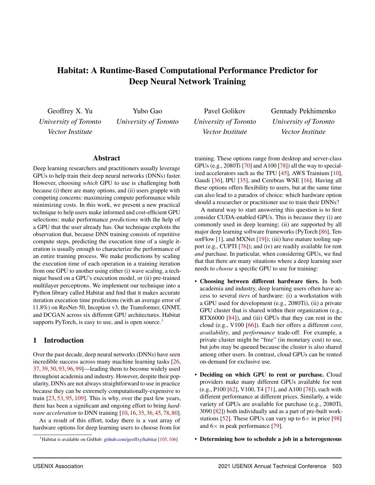

</details>

<a id="source-page-p003"></a>

<details>
<summary><strong>PDF p.3</strong> - 被 E001、E002、E004、E012、E018 引用</summary>

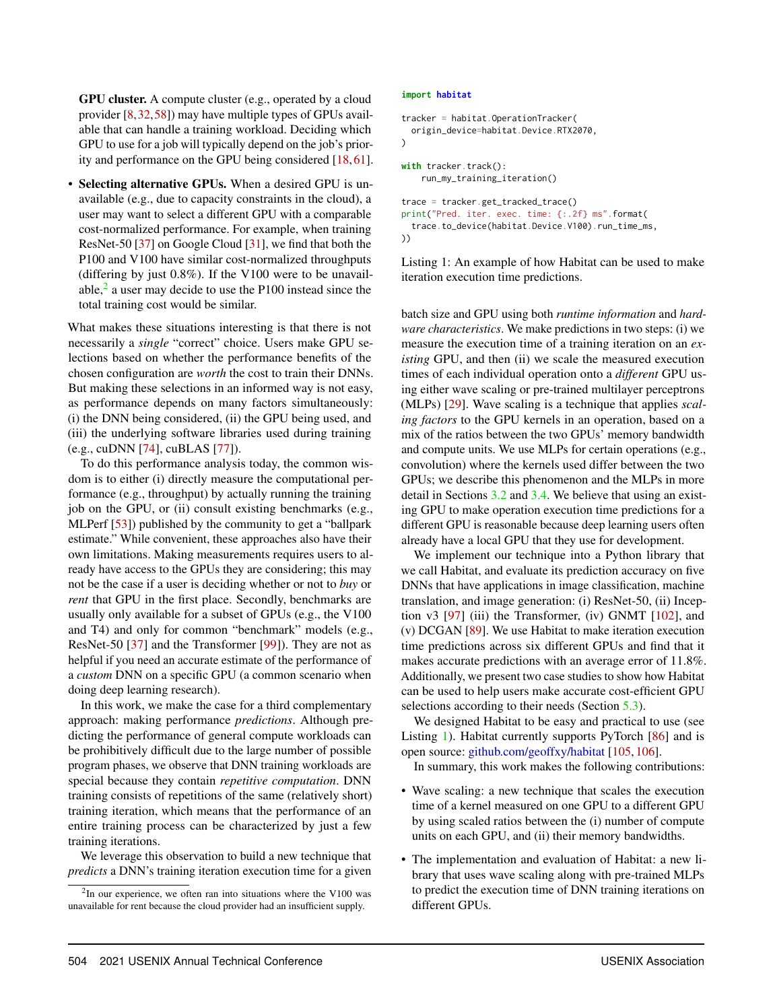

</details>

<a id="source-page-p004"></a>

<details>
<summary><strong>PDF p.4</strong> - 被 E002、E017 引用</summary>

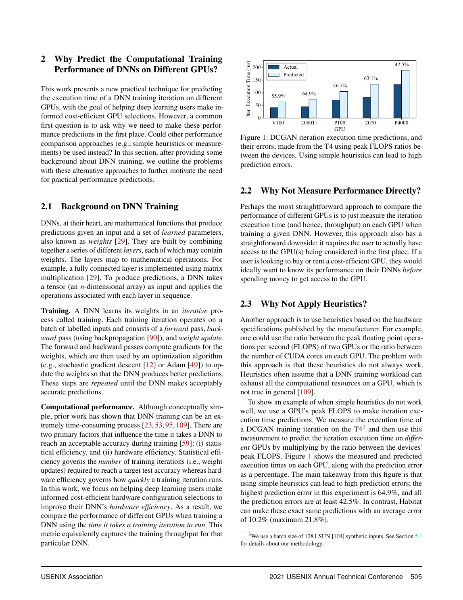

</details>

<a id="source-page-p005"></a>

<details>
<summary><strong>PDF p.5</strong> - 被 E001、E002、E003、E004、E008、E011 引用</summary>

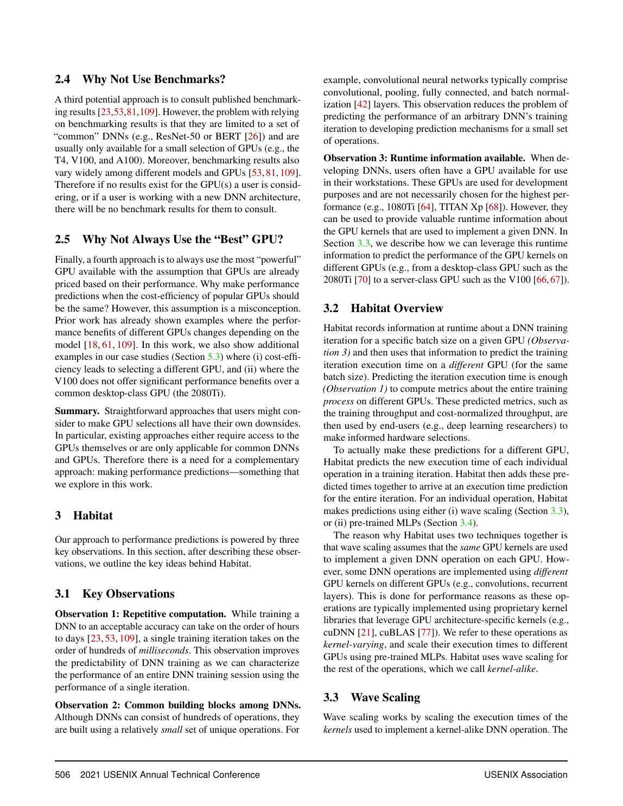

</details>

<a id="source-page-p006"></a>

<details>
<summary><strong>PDF p.6</strong> - 被 E004、E005、E009、E010、E012、E018 引用</summary>

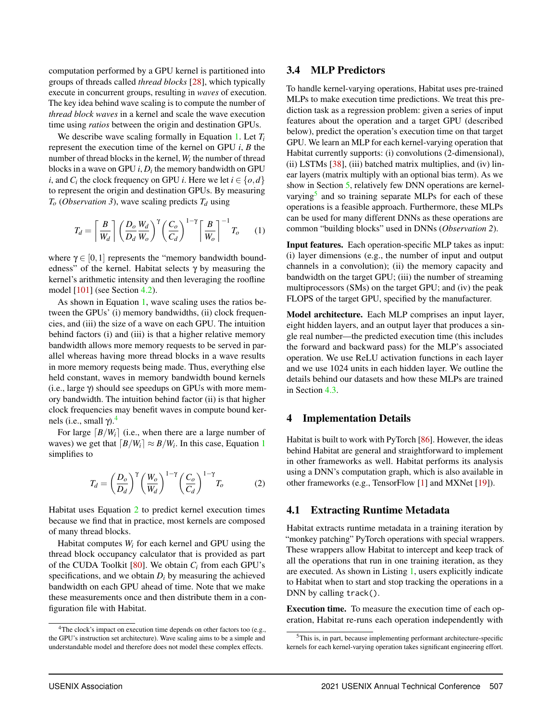

</details>

<a id="source-page-p007"></a>

<details>
<summary><strong>PDF p.7</strong> - 被 E006、E007、E009、E012 引用</summary>

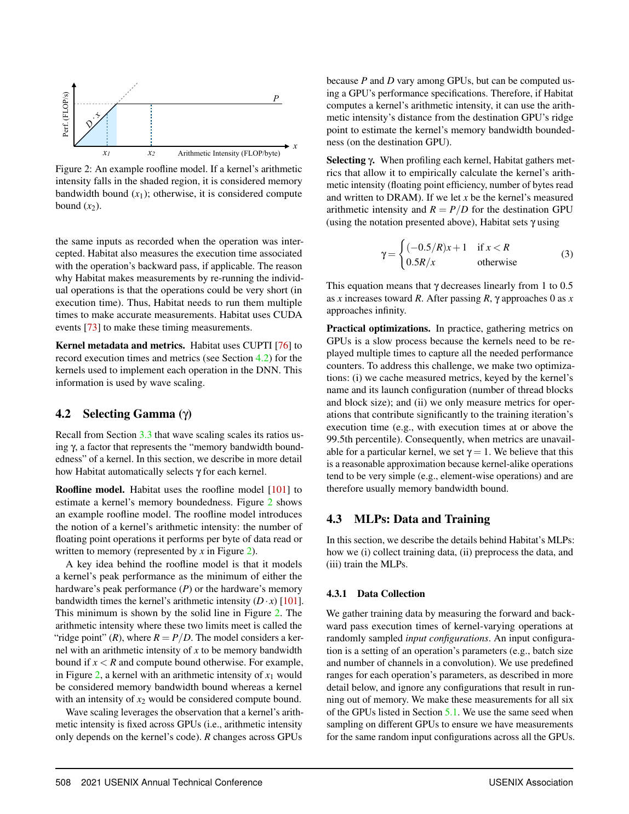

</details>

<a id="source-page-p008"></a>

<details>
<summary><strong>PDF p.8</strong> - 被 E007、E010、E012、E013、E014、E016、E018 引用</summary>

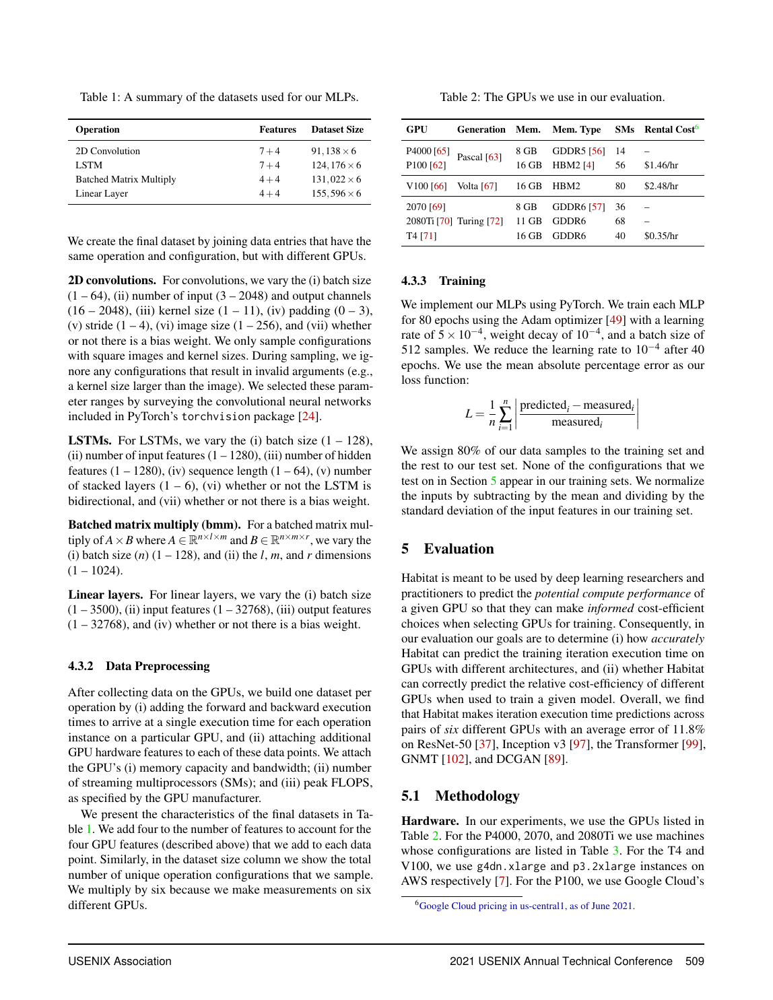

</details>

<a id="source-page-p009"></a>

<details>
<summary><strong>PDF p.9</strong> - 被 E011、E013、E014、E016、E017 引用</summary>

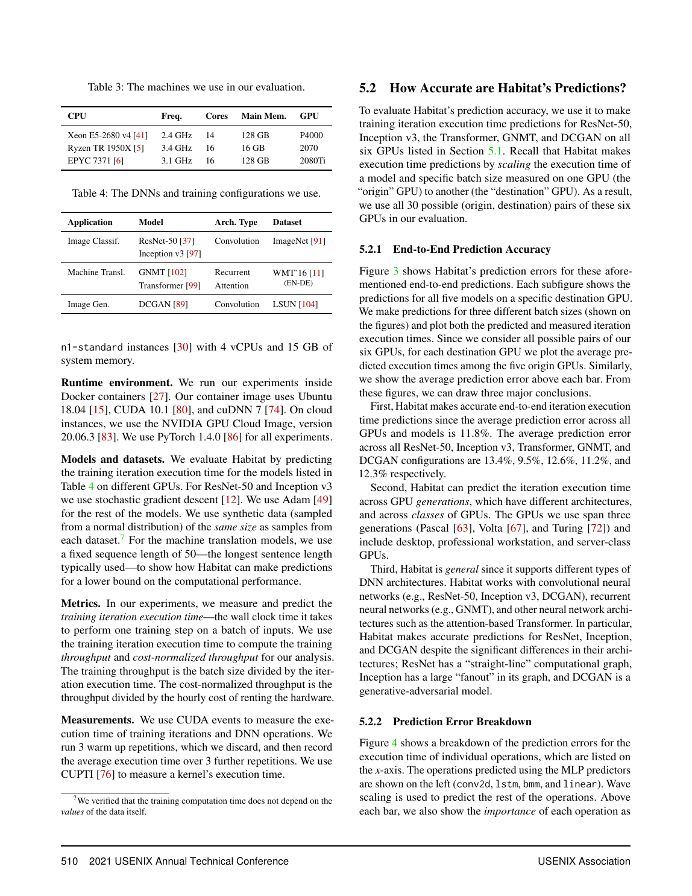

</details>

<a id="source-page-p010"></a>

<details>
<summary><strong>PDF p.10</strong> - 被 E008、E014、E017 引用</summary>

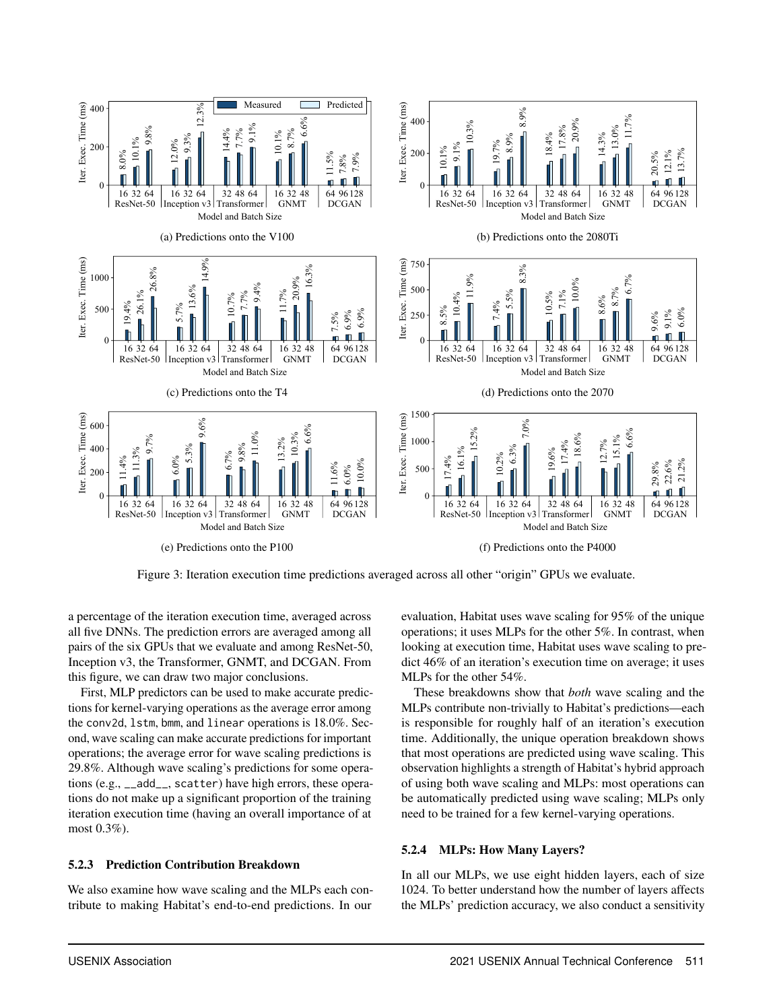

</details>

<a id="source-page-p011"></a>

<details>
<summary><strong>PDF p.11</strong> - 被 E017 引用</summary>

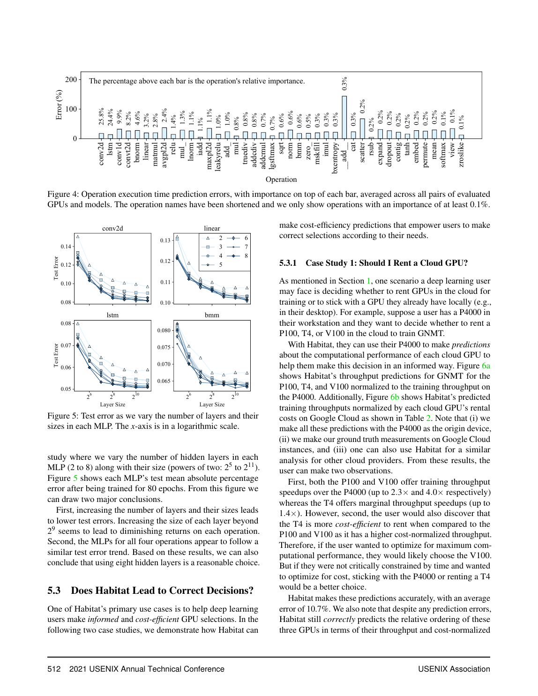

</details>

<a id="source-page-p012"></a>

<details>
<summary><strong>PDF p.12</strong> - 被 E015、E017 引用</summary>

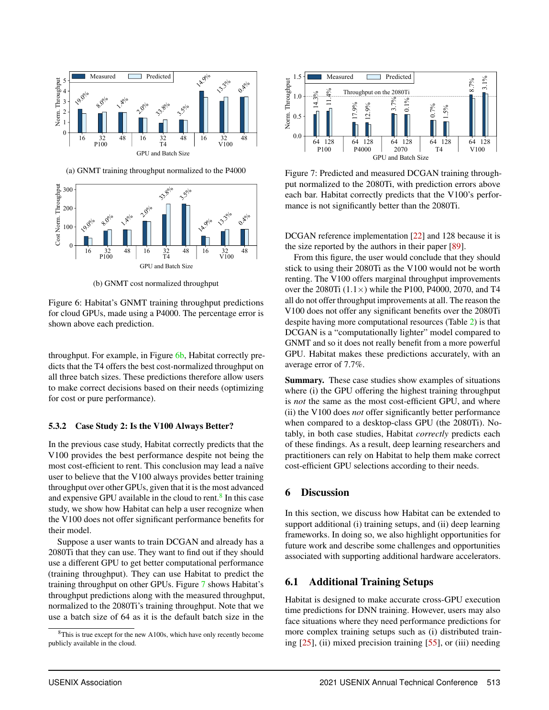

</details>

<a id="source-page-p013"></a>

<details>
<summary><strong>PDF p.13</strong> - 被 E015、E017 引用</summary>

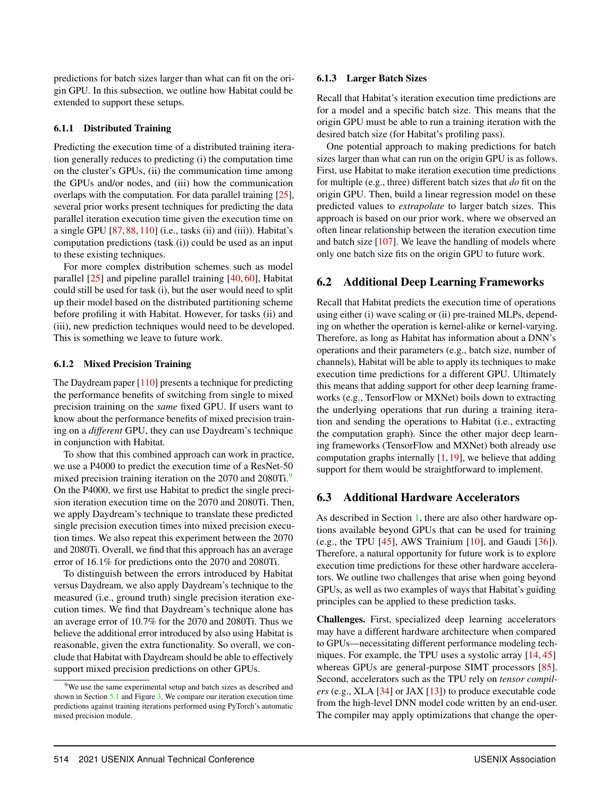

</details>

<!-- EVIDENCE_SCREENSHOTS:END -->
