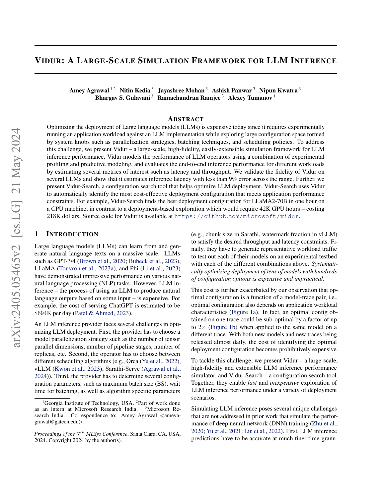
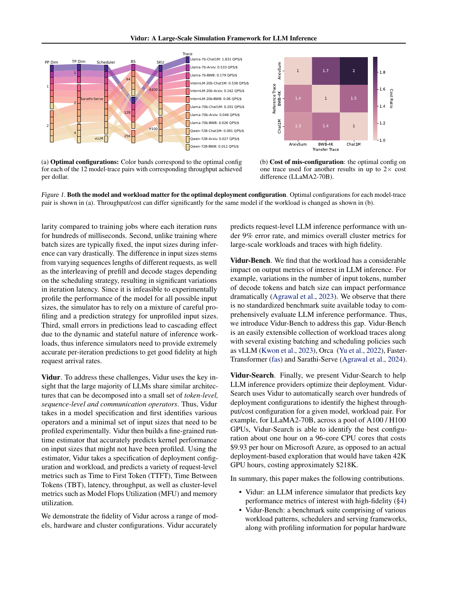
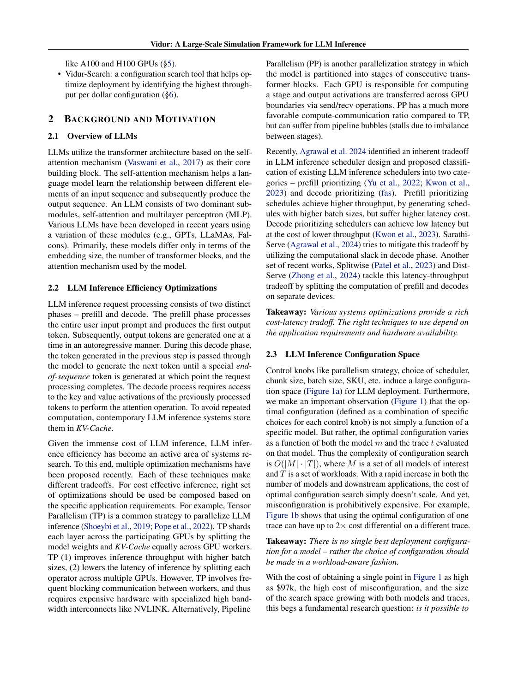

# Vidur：LLM 推理的 profiling + 随机森林运行时表 + 事件驱动系统仿真

> 证据截图说明：正文中的 `原文截图 E###` 可跳转到文末证据卡片。截图按 PDF 物理页码生成；原有章节、图表、算法和段落定位保持不变。


> 论文：Amey Agrawal, Nitin Kedia, Jayashree Mohan, Ashish Panwar, Nipun Kwatra, Bhargav S. Gulavani, Ramachandran Ramjee, Alexey Tumanov, **Vidur: A Large-Scale Simulation Framework for LLM Inference**, MLSys 2024。  
> 原文：[arXiv PDF（2405.05465v2）](https://arxiv.org/pdf/2405.05465)；[arXiv 页面](https://arxiv.org/abs/2405.05465)；[开源仓库](https://github.com/microsoft/vidur)。  
> 版本核对：PDF 标为 `arXiv:2405.05465v2, 21 May 2024`，正文首页注明 MLSys 2024。Vidur 既是本路线“查表+拟合”的代表，也是一个 serving 事件驱动模拟器；它不是只对静态图求和。  
> 页码口径：PDF 共 16 页，正文页 1–11、参考文献与附录页 11–16；下文“PDF页”从文件第一页起算。段落号按小节正文自然段计，不含图、表和 bullet。

## 1. 一句话结论

Vidur 把 LLM 层分解为少量 token-level、sequence-level 和 communication operator，用单 GPU/离线通信 microbenchmark 采有限样本，再以随机森林插值生成大范围 runtime lookup table；在线仿真时，三层 scheduler、KV-cache memory manager 和事件驱动执行器根据真实请求长度/到达 trace 动态形成 batch，查询 operator 表并推进时间，从而输出 TTFT、TBT、端到端延迟、吞吐、MFU、KV 利用率等指标，并由 Vidur-Search 做 deployment what-if 搜索。

定位：PDF 1–2，Abstract、§1 第 7–12 段；PDF 4–6，§4.1–§4.5、图 2。 〔[原文截图 E001](#evidence-e001)〕

## 2. 解决的问题与关键挑战

### 2.1 问题

LLM provider 的配置空间同时包含 TP/PP/replica 数、GPU SKU、scheduler、batch 上限、chunk size 等；最优配置还依赖 workload trace。同模型把一个 trace 的最优配置迁到另一个 trace，成本可恶化至约 2×。真实硬件穷举昂贵，因此需要高保真、低成本、可扩展的推理模拟。

定位：PDF 1–3，§1 第 2–6 段、图 1；§2.3 第 1–3 段。 〔[原文截图 E002](#evidence-e002)〕

### 2.2 为什么训练模拟器不够

论文列出三类推理特有挑战：

1. iteration 只有数毫秒，比训练数百毫秒更敏感；
2. prefill/decode、请求长度、在线 batch 大小与混合构成都动态变化；
3. 单 batch 时间的小误差会改变后续 batching，形成 cascading error，负载接近容量时尤其严重。

定位：PDF 4，§3 的 `Time Scale`、`Varying Iteration Times`、`Cascading Errors` 三段。 〔[原文截图 E003](#evidence-e003)〕

### 2.3 输入与输出

| 模块 | 输入 | 输出 |
|---|---|---|
| Model onboarding | declarative model spec：层数、model/hidden dim、attention/KV heads 等；目标 GPU/并行配置 | 待 profile 的 operator 与 sharding 组合 |
| Offline Profiler | token/sequence/communication operator 参数样本 | 原始 runtime profiles |
| Runtime Estimator | profile 样本 | 每类 operator 的 RF predictor 与预生成 runtime lookup tables |
| Simulator | model spec、GPU SKU/拓扑、replica/TP/PP、scheduler 参数、请求长度和到达 trace | event timeline 与 request/replica/cluster metrics |
| Vidur-Search | 模型、workload、GPU 候选、卡数上限、TTFT/TBT SLO | 最大 QPS/$ 的配置及 Pareto 可视化 |

定位：PDF 4，图 2 与 §4.2；PDF 6–7，§5.2、§6。 〔[原文截图 E004](#evidence-e004)〕

## 3. Profiling 设计与 runtime 表 schema

### 3.1 Operator triaging

Vidur 不是统一用 `op + full shape` 作为 key，而是先按 runtime 的最小充分输入分三桶：

| bucket | 代表算子 | 论文声称的 runtime 决定量 |
|---|---|---|
| token-level | Linear/MLP、activation、normalization、pointwise/reduction | 本轮 batch 的总 current tokens；具体矩阵维还由 model spec/TP shard 决定 |
| sequence-level | attention | current query tokens + 请求 context；再按 prefill/decode 压缩 |
| communication | all-reduce、all-gather、send/recv | message data amount；profile 按 topology 区分 |

定位：PDF 5，§4.3 `Operator Triaging` 段与三项列表。 〔[原文截图 E005](#evidence-e005)〕

这是 Vidur 最值得借鉴的 schema 思想：不同 operator 的“shape”要先还原成真实 workload sufficient statistics。

### 3.2 token-level 采样

根据 model spec 枚举不同 TP sharding configuration，在单 GPU 上用标准 PyTorch kernel 执行并由 CUPTI 计时。这样不必为每个多 GPU 并行度建真实集群；profile key 至少含 operator type、模型派生矩阵维、TP shard 和 total tokens。

定位：PDF 5，§4.3 `Profiling Token-level Operators` 第 1 段。 〔[原文截图 E006](#evidence-e006)〕

论文没有给出采样点具体网格、重复次数、warmup、数据库列、随机森林超参数或 lookup table 的序列化格式，均应标为**未披露**。

### 3.3 attention 输入降维

Prefill attention：一批 `P` 个 prompt 长度为 `p_i`，计算量近似正比于 `Σ p_i²`；Vidur 把它等价成一个长度 `sqrt(Σ p_i²)` 的单 prefill 输入查询 predictor。

Decode attention：论文认为 PagedAttention v2/FlashDecoding 能有效处理 context skew，且 decode 主要 memory-bound，因此用本 batch **总 KV-cache read volume**，而不是完整 per-request context vector 作为 runtime key。

定位：PDF 5–6，§4.3 `Profiling Sequence-level Operators` 两段，公式文字从 `Σ p_i²` 到 `total KV-Cache reads`。 〔[原文截图 E007](#evidence-e007)〕

这两个降维假设有清晰边界：新的 sparse attention、不同 page/block locality、极端长度 skew、KV 压缩/量化或实现 fallback 可能使相同统计量产生不同 latency。

### 3.4 通信 profile

独立、model-agnostic 地对 all-reduce、all-gather、send/recv 在不同 topology/profile 点上建表，key 主要为通信类型、数据量、topology。

定位：PDF 6，§4.3 `Profiling Communication Operators` 段。 〔[原文截图 E008](#evidence-e008)〕

论文没有给出 group rank placement、算法、protocol、并发流、peer arrival、wait/transit 分解等字段；因此“message bytes 相同”并不等于本项目要求的 distributed-performance 等价。

### 3.5 可落地的统一表

下面是对论文的**工程化还原**，不是原文公布的 schema：

```text
RuntimeProfileKey:
  device_sku
  topology_class
  model_operator_kind
  parallel_shard_spec
  phase: prefill | decode
  token_stat:
    total_current_tokens
    prefill_sum_sq_tokens
    total_kv_read_tokens_or_bytes
  tensor_dims_from_model_spec
  communication_kind
  message_bytes

RuntimeProfileValue:
  measured_runtime
  evidence/profiler_version

PredictedRuntimeTable:
  same normalized key -> RF-predicted runtime
```

## 4. 插值/拟合：为什么是随机森林

有限 profile 无法覆盖所有 tensor 组合。论文比较了三类直觉：MLP 对闭源 CUBLAS/cuDNN 算子通常数据需求大；简单 polynomial regression 又抓不住 tile/wave quantization 造成的非线性；作者发现 Random Forest 在 data frugality 与 fidelity 间最平衡，因此训练小 RF 对未采样参数插值，再生成 operation-wise lookup table供仿真热路径查询。

定位：PDF 5–6，§4.4 全部两段；PDF 5，§4.2 第 1 段（`produces operation-wise runtime lookup tables`）。 〔[原文截图 E009](#evidence-e009)〕

原文没有：

- RF 的 tree 数、深度、feature transform；
- train/test split 与单 operator 插值误差；
- 明确区分 interpolation 与 extrapolation；
- OOD 检测、置信区间或拒绝机制；
- lookup 表的覆盖率/未命中率。

因此只能确认“RF + 预生成表”，不能从论文复现完整采样策略。

## 5. 系统级组合：事件驱动而非简单求和

### 5.1 三层 scheduler

1. Global scheduler：跨 replica route，支持 round-robin、least-outstanding，也支持推迟绑定的 stateful route。
2. Replica scheduler：batching + KV memory management。memory planner 依据 model spec/parallelism 计算 KV 可用空间；memory manager 为 batching policy 提供 API。论文实现 FasterTransformer、Orca、Sarathi-Serve、vLLM、LightLLM，每种少于 150 行 Python。
3. Replica-stage scheduler：pipeline stage 内 microbatch 调度；论文版只支持 synchronous PP。

定位：PDF 6，§4.5 第 1–3 段。 〔[原文截图 E010](#evidence-e010)〕

### 5.2 计算、通信、重叠、排队与状态

| 维度 | Vidur 处理 | 边界 |
|---|---|---|
| 计算 | 按动态 batch 生成 operator 输入，查 runtime 表 | operator sufficient statistic 和 RF 误差 |
| 通信 | all-reduce/all-gather/send-recv profile table | 论文未披露跨-rank arrival/wait 分解 |
| pipeline | synchronous stage scheduler，可表达 bubble | 异步通信/sequence parallel/speculative pipeline 列未来工作 |
| 计算通信重叠 | 论文版能力有限 | §4.5 明确 async communication 是未来扩展目标 |
| 排队 | 显式模拟请求到达、global route、batching、scheduling delay | 这正是比静态求和更强之处 |
| KV 状态 | memory planner/manager 跟踪 capacity、分配、preempt/restart 指标 | 不是数值 KV 内容/slot 语义回放 |
| graph/kernel | profile 自优化 vLLM/CUDA graph 的实际成本 | 不输出/复用原 graph 地址或 kernel DAG |

定位：PDF 5–7，§4.3–§5.2；PDF 8–9，§7.1–§7.2。 〔[原文截图 E011](#evidence-e011)〕

## 6. 冷启动、跨 GPU、跨模型与跨 workload 泛化

### 6.1 冷启动

模型 onboarding 分两步：从 declarative spec 自动生成 operator/shard profile 组合；只采最少数据，RF 扩展到大参数域。并行策略由 domain knowledge 在单 GPU 上生成 local shard profile，避免每个 TP/PP 真机部署。

定位：PDF 4–5，§4.1 `Automatic Profiling for Parallelism Strategies`、§4.2、图 2。 〔[原文截图 E012](#evidence-e012)〕

论文没有量化“新增一个模型到底需多少 profile 点/GPU 小时”；但声称通信 profile 可跨模型复用，架构相似让 operator 集较小。

### 6.2 跨 GPU

论文评估 A100 80GB 和 H100 80GB；同一 SKU/拓扑上的 profile 产生对应表。它不像 Habitat/NeuSight 那样重点解决“目标 GPU 未见过且无访问权”的硬件 forecasting；新增 SKU 仍需 initial profiling。

定位：PDF 8，§7.1 `Models and Environment`；PDF 2，§1 对 Vidur 的描述。 〔[原文截图 E013](#evidence-e013)〕

### 6.3 跨模型

评估 LLaMA2-7B/70B、InternLM-20B、Qwen-72B，TP1/2/4；泛化依赖共同 transformer operators 与 declarative model spec。论文没有验证 MoE、稀疏 attention、量化、speculative decoding 或不同 vendor NPU。

定位：PDF 8，§7.1；PDF 4–5，§4.1–§4.3。 〔[原文截图 E014](#evidence-e014)〕

### 6.4 跨 workload

Vidur-Bench 使用 Chat-1M、Arxiv-Summarization、Bilingual-Web-Book 及 4K 截断版本。它们的 prompt/decode 比、长度方差差异很大；最优配置会随 trace 变化，同一 LLaMA2-70B 迁错配置可产生 2× 成本开销。

定位：PDF 6，表 1；PDF 8–10，§7.1 `Workloads`、§7.3、图 1/5/6。 〔[原文截图 E015](#evidence-e015)〕

## 7. 误差定义与实验结果

### 7.1 指标口径

静态 workload：比较 normalized request execution latency，排除 scheduling delay，避免离线队列等待淹没执行误差；动态 workload：normalized E2E latency = request E2E latency / output length，并比较 median/P95。系统还输出 TTFT、TBT、batch、busy/idle、MFU、memory/KV utilization。

定位：PDF 6–7，§5.2；PDF 9，§7.2 `Evaluation Metric` 段。 〔[原文截图 E016](#evidence-e016)〕

### 7.2 关键结果

- 静态 trace 上四模型×三 workload：P95 normalized execution latency 误差最高约 3.33%；图 3 的 median/P95 单点多在 ±3% 内。
- 动态 Poisson 到达、负载为系统容量 85%：几乎所有场景误差 <5%；7B 受 CPU overhead 影响更大。
- 附录：95% 容量时，大模型仍高保真；LLaMA2-7B cascading error 最大达 12.65%。
- 搜索四模型×三 workload、A100/H100、TP/PP/scheduler/batch/chunk 等共 35,565 次：实际估算成本约 113.99 万美元；96-core CPU 仿真约 12.5 小时、125 美元。
- 摘要中的代表案例：LLaMA2-70B 找最优配置约 1 小时 CPU，而真机探索需约 42K GPU-hours、约 218K 美元。
- SLO sensitivity：LLaMA2-70B Chat-1M 的 TBT SLO 从 0.12s 放宽到 0.14s，成本可约降 1.85×。

定位：PDF 1 Abstract；PDF 8–9，图 3/4 与 §7.2；PDF 9–10，§7.3 与图 5/6；PDF 15，附录 A.1/A.2、表 2。 〔[原文截图 E017](#evidence-e017)〕

### 7.3 误差解释边界

作者明确指出接近 capacity tipping point 时微小 operator/runtime 误差会通过 batching/queue 放大；7B 的 CPU overhead 是主要误差源之一。这与本项目 V0.6“观测时间不能简单当固有算子时间”一致：runtime table 误差只是系统误差的一部分，scheduler 和 host overhead 也必须建模。

定位：PDF 9，§7.2 `Dynamic Workloads` 第 2–3 段；PDF 15，附录 A.1。 〔[原文截图 E018](#evidence-e018)〕

## 8. 实现、开源与成熟度

**原文事实：** 源码在 `microsoft/vidur`，仿真器为 Python；真实 baseline 是扩展的优化 vLLM fork，支持 scheduler、chunked prefill、telemetry、CUDA graph；论文声明多种 batching policy 和 Vidur-Search。

**现状核验（2026-08-06）：** 公共仓库 MIT，README 给出 mamba/venv 安装、命令行、模型/device 支持表、A100/H100/A40 profile，支持 TP/PP 组合，并导出 Chrome trace；主分支仍以 Llama/InternLM/Qwen dense 模型和若干固定硬件 profile 为主。README 说明 prefix cache、更多 route 等改进位于 canary 且有 sharp edges。

**成熟度判断：研究系统（中高）。** 代码、预置数据、文档、真实 serving trace 和搜索闭环齐全，明显强于只给算法的 predictor；但不是任意模型/任意硬件开箱即用，模型与 SKU onboarding、runtime table质量、scheduler 语义对齐仍是主要工程成本。

定位：PDF 1 Abstract、PDF 8 §7.1；GitHub README。 〔[原文截图 E019](#evidence-e019)〕

## 9. 优点、缺点与适用边界

### 优点

1. 用 operator triaging 把不可穷举的 batch/history 空间压缩成可 profile 的充分统计量。
2. RF 相比大 MLP 更节省 profile，lookup table 让事件模拟热路径快。
3. 并行 shard profile 可由 model spec 在单 GPU 生成，显著降低 TP/PP onboarding 成本。
4. scheduler、KV capacity、到达、排队和动态 batch 被真正放入事件模拟，因此能输出 tail latency/SLO/容量，而不只是模型一次 forward 时间。
5. 结构模块化：Profiler/Estimator 与 scheduler/benchmark/search 分离，便于替换 serving policy。
6. 公开实现和真实 trace，论文对动态负载的 fidelity 验证较完整。

### 缺点

1. attention 降维假设实现相关；只看 `Σp²` 或总 KV bytes 会忽略长度 skew、block locality、稀疏 index、page/graph bucket 和 fallback。
2. 通信只按 data amount/topology 建成本，论文未说明 arrival skew、wait/transit、stream overlap 与 HCCL/NCCL 算法身份。
3. RF 没有 OOD 置信度；表外 extrapolation 和 runtime regime 切换不可见。
4. 论文版 synchronous PP；async comm、sequence parallel、speculative pipeline 均未实现。
5. 评估环境有限于单节点 A100/H100 和 TP≤4 的代表设置，未验证大规模多节点、MoE EP、量化和 NPU。
6. CUDA graph/host overhead 由特定优化 vLLM baseline 隐含吸收；换框架、版本或 graph 实现必须重新校准。

## 10. 与录制回放的关系

### 10.1 它更像“预测驱动的合成回放”，不是 trace 重放

Vidur 输入 workload trace（请求到达、prompt/decode 长度）与配置，让 scheduler 重新生成目标 batch；它不会保存原运行每个 kernel/collective 的全局依赖图再逐事件 replay。因此：

- 可回答 scheduler、batch、TP/PP、GPU SKU 的 deployment what-if；
- 不能保证原 token 值导致的 MoE/index/branch、KV slot、graph 地址或精确 collective arrival 被复现；
- cost table 属于 `Physical Binding / Cost Model`，scheduler 事件属于 `Target Recipe`，仿真输出属于新的 `Observation`。

### 10.2 对本项目的直接启示

Vidur 的三类 operator schema可以直接扩展为本项目的 `CostModelFeature`：

```text
token-level:
  raw/padded/valid tokens + M/N/K + dtype/layout/quant + shard

sequence-level:
  phase + per-request lengths summary + effective KV bytes
  + block locality + sparse-index distribution + implementation

communication:
  kind + group + ordered ranks + split vector + bytes
  + rank placement + predecessor/arrival class + runtime version
```

### 10.3 昇腾迁移方案

1. 用 vLLM Ascend/SGLang NPU `ModelAdapterSpec` 生成 target local ownership，替代 Vidur 的 CUDA-only shard generator。
2. profile 必须区分 logical/storage shape、ND/NZ、dtype/quant、CANN op/kernel/tiling、graph mode；同 shape 不同 binding 建不同 regime。
3. 对 dense MatMul、GMM、attention、KV、quant/fusion 建 RF/GBDT 或小模型；表 value 保存样本数、分位延迟、版本和置信度，不只一个 mean。
4. 将 MoE `expert_counts/rank_splits/M_e`、sparse attention locality、KV block/slot digest纳入 sufficient statistics，避免把动态值压掉。
5. 对 HCCL 以 `(group_id, ordinal, kind, splits, bytes, placement)` 建意图；网络传输成本与 arrival/wait 分开，事件驱动器通过跨-rank DAG 自然产生等待。
6. scheduler 使用目标框架真实规则或框架 hook 回放 R0/R1；不能用 Vidur 的 vLLM policy 代表所有 NPU serving stack。
7. validation 同时做 operator table error、batch-path digest、collective sequence、arrival skew 和端到端 TTFT/TBT；负载至少覆盖 50/85/95% capacity，观察 cascading error。

以上为**迁移设计推断**，不是论文已实现的昇腾能力。

## 11. 最终评价

Vidur 是四篇中最贴近“查表+拟合后组合出系统性能”的论文：它不仅说明怎样建表，还展示了 cost model 如何嵌入 scheduler、KV capacity、请求排队和 configuration search。对本项目最重要的保留项是 operator triaging 与事件驱动组合；最需要补齐的是 value/state/physical binding 与跨-rank因果。若直接把 Vidur 的 `total tokens / total KV reads / message bytes` 当通用特征，会在 MoE、稀疏 attention、复杂 KV allocator 和昇腾 graph/tiling 上失真。

<!-- EVIDENCE_SCREENSHOTS:BEGIN -->

## 原文证据截图附录

正文中的 `原文截图 E###` 与本节证据卡片一一对应。卡片保留原笔记行号和原有页码/章节定位，并跳转到后面的页图；每个物理页在本篇笔记中只展示一次。截图用于快速核读，正式引用仍以原论文为准。

<a id="evidence-e001"></a>

<details>
<summary><strong>E001</strong> - 原笔记第 15 行 - PDF p.1, 2, 4, 5, 6</summary>

<p><strong>原定位：</strong> <code>定位：PDF 1–2，Abstract、§1 第 7–12 段；PDF 4–6，§4.1–§4.5、图 2。</code></p>

<p><strong>页图：</strong> <a href="#source-page-p001">PDF p.1</a> · <a href="#source-page-p002">PDF p.2</a> · <a href="#source-page-p004">PDF p.4</a> · <a href="#source-page-p005">PDF p.5</a> · <a href="#source-page-p006">PDF p.6</a></p>

</details>

<a id="evidence-e002"></a>

<details>
<summary><strong>E002</strong> - 原笔记第 23 行 - PDF p.1, 2, 3</summary>

<p><strong>原定位：</strong> <code>定位：PDF 1–3，§1 第 2–6 段、图 1；§2.3 第 1–3 段。</code></p>

<p><strong>页图：</strong> <a href="#source-page-p001">PDF p.1</a> · <a href="#source-page-p002">PDF p.2</a> · <a href="#source-page-p003">PDF p.3</a></p>

</details>

<a id="evidence-e003"></a>

<details>
<summary><strong>E003</strong> - 原笔记第 33 行 - PDF p.4</summary>

<p><strong>原定位：</strong> <code>定位：PDF 4，§3 的 `Time Scale`、`Varying Iteration Times`、`Cascading Errors` 三段。</code></p>

<p><strong>页图：</strong> <a href="#source-page-p004">PDF p.4</a></p>

</details>

<a id="evidence-e004"></a>

<details>
<summary><strong>E004</strong> - 原笔记第 45 行 - PDF p.4, 6, 7</summary>

<p><strong>原定位：</strong> <code>定位：PDF 4，图 2 与 §4.2；PDF 6–7，§5.2、§6。</code></p>

<p><strong>页图：</strong> <a href="#source-page-p004">PDF p.4</a> · <a href="#source-page-p006">PDF p.6</a> · <a href="#source-page-p007">PDF p.7</a></p>

</details>

<a id="evidence-e005"></a>

<details>
<summary><strong>E005</strong> - 原笔记第 59 行 - PDF p.5</summary>

<p><strong>原定位：</strong> <code>定位：PDF 5，§4.3 `Operator Triaging` 段与三项列表。</code></p>

<p><strong>页图：</strong> <a href="#source-page-p005">PDF p.5</a></p>

</details>

<a id="evidence-e006"></a>

<details>
<summary><strong>E006</strong> - 原笔记第 67 行 - PDF p.5</summary>

<p><strong>原定位：</strong> <code>定位：PDF 5，§4.3 `Profiling Token-level Operators` 第 1 段。</code></p>

<p><strong>页图：</strong> <a href="#source-page-p005">PDF p.5</a></p>

</details>

<a id="evidence-e007"></a>

<details>
<summary><strong>E007</strong> - 原笔记第 77 行 - PDF p.5, 6</summary>

<p><strong>原定位：</strong> <code>定位：PDF 5–6，§4.3 `Profiling Sequence-level Operators` 两段，公式文字从 `Σ p_i²` 到 `total KV-Cache reads`。</code></p>

<p><strong>页图：</strong> <a href="#source-page-p005">PDF p.5</a> · <a href="#source-page-p006">PDF p.6</a></p>

</details>

<a id="evidence-e008"></a>

<details>
<summary><strong>E008</strong> - 原笔记第 85 行 - PDF p.6</summary>

<p><strong>原定位：</strong> <code>定位：PDF 6，§4.3 `Profiling Communication Operators` 段。</code></p>

<p><strong>页图：</strong> <a href="#source-page-p006">PDF p.6</a></p>

</details>

<a id="evidence-e009"></a>

<details>
<summary><strong>E009</strong> - 原笔记第 120 行 - PDF p.5, 6</summary>

<p><strong>原定位：</strong> <code>定位：PDF 5–6，§4.4 全部两段；PDF 5，§4.2 第 1 段（`produces operation-wise runtime lookup tables`）。</code></p>

<p><strong>页图：</strong> <a href="#source-page-p005">PDF p.5</a> · <a href="#source-page-p006">PDF p.6</a></p>

</details>

<a id="evidence-e010"></a>

<details>
<summary><strong>E010</strong> - 原笔记第 140 行 - PDF p.6</summary>

<p><strong>原定位：</strong> <code>定位：PDF 6，§4.5 第 1–3 段。</code></p>

<p><strong>页图：</strong> <a href="#source-page-p006">PDF p.6</a></p>

</details>

<a id="evidence-e011"></a>

<details>
<summary><strong>E011</strong> - 原笔记第 154 行 - PDF p.5, 6, 7, 8, 9</summary>

<p><strong>原定位：</strong> <code>定位：PDF 5–7，§4.3–§5.2；PDF 8–9，§7.1–§7.2。</code></p>

<p><strong>页图：</strong> <a href="#source-page-p005">PDF p.5</a> · <a href="#source-page-p006">PDF p.6</a> · <a href="#source-page-p007">PDF p.7</a> · <a href="#source-page-p008">PDF p.8</a> · <a href="#source-page-p009">PDF p.9</a></p>

</details>

<a id="evidence-e012"></a>

<details>
<summary><strong>E012</strong> - 原笔记第 162 行 - PDF p.4, 5</summary>

<p><strong>原定位：</strong> <code>定位：PDF 4–5，§4.1 `Automatic Profiling for Parallelism Strategies`、§4.2、图 2。</code></p>

<p><strong>页图：</strong> <a href="#source-page-p004">PDF p.4</a> · <a href="#source-page-p005">PDF p.5</a></p>

</details>

<a id="evidence-e013"></a>

<details>
<summary><strong>E013</strong> - 原笔记第 170 行 - PDF p.2, 8</summary>

<p><strong>原定位：</strong> <code>定位：PDF 8，§7.1 `Models and Environment`；PDF 2，§1 对 Vidur 的描述。</code></p>

<p><strong>页图：</strong> <a href="#source-page-p002">PDF p.2</a> · <a href="#source-page-p008">PDF p.8</a></p>

</details>

<a id="evidence-e014"></a>

<details>
<summary><strong>E014</strong> - 原笔记第 176 行 - PDF p.4, 5, 8</summary>

<p><strong>原定位：</strong> <code>定位：PDF 8，§7.1；PDF 4–5，§4.1–§4.3。</code></p>

<p><strong>页图：</strong> <a href="#source-page-p004">PDF p.4</a> · <a href="#source-page-p005">PDF p.5</a> · <a href="#source-page-p008">PDF p.8</a></p>

</details>

<a id="evidence-e015"></a>

<details>
<summary><strong>E015</strong> - 原笔记第 182 行 - PDF p.6, 8, 9, 10</summary>

<p><strong>原定位：</strong> <code>定位：PDF 6，表 1；PDF 8–10，§7.1 `Workloads`、§7.3、图 1/5/6。</code></p>

<p><strong>页图：</strong> <a href="#source-page-p006">PDF p.6</a> · <a href="#source-page-p008">PDF p.8</a> · <a href="#source-page-p009">PDF p.9</a> · <a href="#source-page-p010">PDF p.10</a></p>

</details>

<a id="evidence-e016"></a>

<details>
<summary><strong>E016</strong> - 原笔记第 190 行 - PDF p.6, 7, 9</summary>

<p><strong>原定位：</strong> <code>定位：PDF 6–7，§5.2；PDF 9，§7.2 `Evaluation Metric` 段。</code></p>

<p><strong>页图：</strong> <a href="#source-page-p006">PDF p.6</a> · <a href="#source-page-p007">PDF p.7</a> · <a href="#source-page-p009">PDF p.9</a></p>

</details>

<a id="evidence-e017"></a>

<details>
<summary><strong>E017</strong> - 原笔记第 201 行 - PDF p.1, 8, 9, 10, 15</summary>

<p><strong>原定位：</strong> <code>定位：PDF 1 Abstract；PDF 8–9，图 3/4 与 §7.2；PDF 9–10，§7.3 与图 5/6；PDF 15，附录 A.1/A.2、表 2。</code></p>

<p><strong>页图：</strong> <a href="#source-page-p001">PDF p.1</a> · <a href="#source-page-p008">PDF p.8</a> · <a href="#source-page-p009">PDF p.9</a> · <a href="#source-page-p010">PDF p.10</a> · <a href="#source-page-p015">PDF p.15</a></p>

</details>

<a id="evidence-e018"></a>

<details>
<summary><strong>E018</strong> - 原笔记第 207 行 - PDF p.9, 15</summary>

<p><strong>原定位：</strong> <code>定位：PDF 9，§7.2 `Dynamic Workloads` 第 2–3 段；PDF 15，附录 A.1。</code></p>

<p><strong>页图：</strong> <a href="#source-page-p009">PDF p.9</a> · <a href="#source-page-p015">PDF p.15</a></p>

</details>

<a id="evidence-e019"></a>

<details>
<summary><strong>E019</strong> - 原笔记第 217 行 - PDF p.1, 8</summary>

<p><strong>原定位：</strong> <code>定位：PDF 1 Abstract、PDF 8 §7.1；GitHub README。</code></p>

<p><strong>页图：</strong> <a href="#source-page-p001">PDF p.1</a> · <a href="#source-page-p008">PDF p.8</a></p>

</details>

## 原文页面图库（按页去重）

同一页可能支撑多个证据点；下面按物理页集中展示，每个截图文件只嵌入一次。

<a id="source-page-p001"></a>

<details>
<summary><strong>PDF p.1</strong> - 被 E001、E002、E017、E019 引用</summary>



</details>

<a id="source-page-p002"></a>

<details>
<summary><strong>PDF p.2</strong> - 被 E001、E002、E013 引用</summary>



</details>

<a id="source-page-p003"></a>

<details>
<summary><strong>PDF p.3</strong> - 被 E002 引用</summary>



</details>

<a id="source-page-p004"></a>

<details>
<summary><strong>PDF p.4</strong> - 被 E001、E003、E004、E012、E014 引用</summary>


</details>

<a id="source-page-p005"></a>

<details>
<summary><strong>PDF p.5</strong> - 被 E001、E005、E006、E007、E009、E011、E012、E014 引用</summary>


</details>

<a id="source-page-p006"></a>

<details>
<summary><strong>PDF p.6</strong> - 被 E001、E004、E007、E008、E009、E010、E011、E015、E016 引用</summary>


</details>

<a id="source-page-p007"></a>

<details>
<summary><strong>PDF p.7</strong> - 被 E004、E011、E016 引用</summary>


</details>

<a id="source-page-p008"></a>

<details>
<summary><strong>PDF p.8</strong> - 被 E011、E013、E014、E015、E017、E019 引用</summary>


</details>

<a id="source-page-p009"></a>

<details>
<summary><strong>PDF p.9</strong> - 被 E011、E015、E016、E017、E018 引用</summary>


</details>

<a id="source-page-p010"></a>

<details>
<summary><strong>PDF p.10</strong> - 被 E015、E017 引用</summary>


</details>

<a id="source-page-p015"></a>

<details>
<summary><strong>PDF p.15</strong> - 被 E017、E018 引用</summary>


</details>

<!-- EVIDENCE_SCREENSHOTS:END -->
