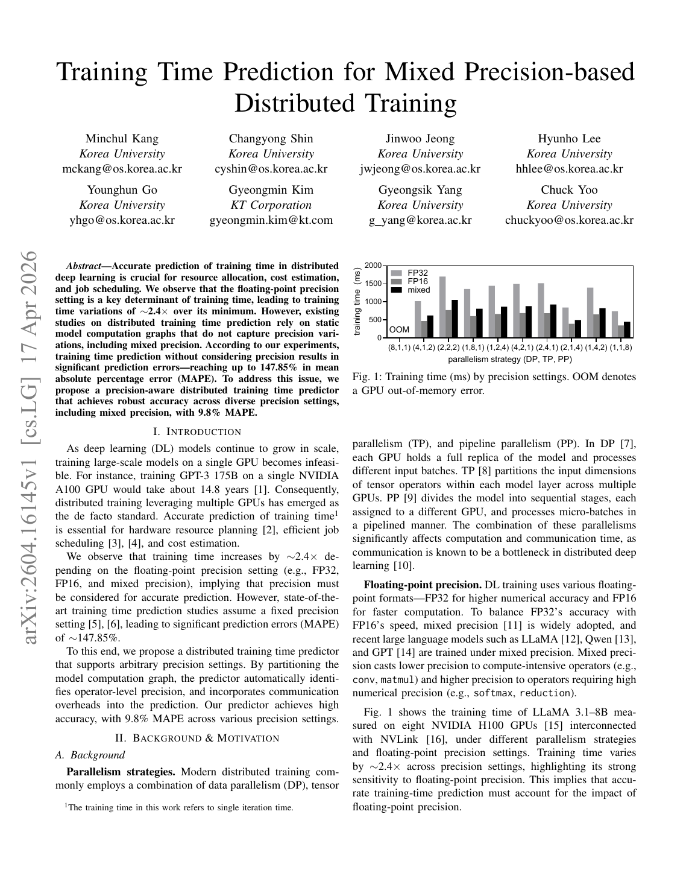
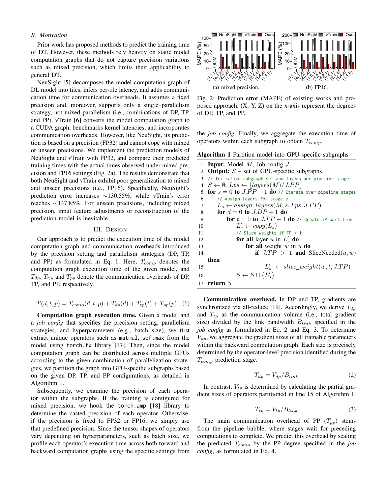
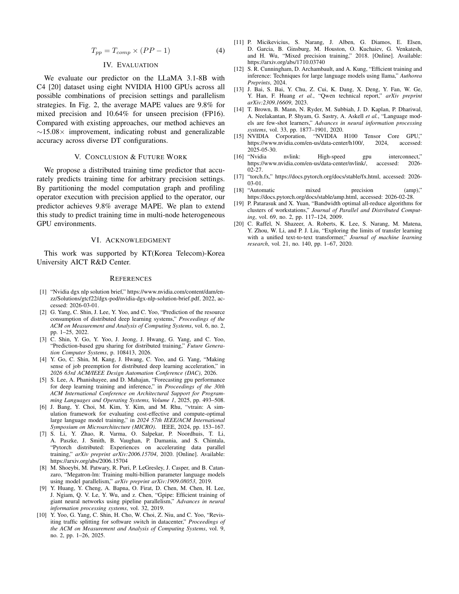

# Training Time Prediction for Mixed Precision-based Distributed Training：3 页精度感知训练时间预测器

> 证据截图说明：正文中的 `原文截图 E###` 可跳转到文末证据卡片。截图按 PDF 物理页码生成；原有章节、图表、算法和段落定位保持不变。


> 论文：Minchul Kang, Changyong Shin, Jinwoo Jeong, Hyunho Lee, Younghun Go, Gyeongmin Kim, Gyeongsik Yang, Chuck Yoo, **Training Time Prediction for Mixed Precision-based Distributed Training**。  
> 原文：[arXiv PDF（2604.16145v1）](https://arxiv.org/pdf/2604.16145)；[arXiv 页面](https://arxiv.org/abs/2604.16145)。  
> 版本核对：2026-04-17 提交的 arXiv v1，仅 3 页（含参考文献）；没有会议/期刊发表信息。用户简称“精度感知预测器”与摘要中的 `precision-aware distributed training time predictor` 对应，但这不是系统名。  
> 页码口径：PDF 共 3 页，以下从文件第一页起算；因篇幅很短，除页码/章节/图表外尽量给该小节段落定位。

## 1. 证据强度先说明

这是四篇中证据最弱的一篇：正文只有约 2 页，给出问题、一个 graph partition 算法、四个总时间公式和单一模型/单一硬件实验。论文没有披露代码、profile 数据 schema、operation 采样点、计时方法、软件版本、重复次数、模型超参数、模型拟合方式、overlap 处理、误差分布或 artifact。因此可以确认“方法骨架”，不能把它描述为已经充分实现和验证的成熟 predictor。

上述判断来自 PDF 全文内容缺失项，是**证据审计结论**，不是作者自述。

## 2. 问题与贡献

### 2.1 问题

分布式训练的 FP32、FP16 和 mixed precision 会改变 operator dtype、kernel 及通信字节，论文在 8×H100 的 LLaMA 3.1-8B 实验中观察到不同精度的迭代时间相对最小值可差约 2.4×。现有 predictor（文中以 NeuSight、vTrain 为例）基于固定精度的静态计算图，对 mixed/unseen precision 泛化差；作者复现的 baseline 在混合/FP16 设置下 MAPE 可达 130.55%/147.85%。

定位：PDF 1，Abstract；§I 第 2–3 段；§II.B 第 1 段；图 1/图 2。 〔[原文截图 E001](#evidence-e001)〕

### 2.2 方法贡献

给定 model 与 job config（precision、DP/TP/PP、batch 等），用 Torch.fx 提取 unique operator 与图；按 DP/TP/PP 将全图分成 GPU-specific subgraph；hook `torch.amp` 得到 mixed precision 下**每个 operator 实际 cast 后 precision**；按实际 shape+precision profile 前向/反向 operation；再用精度感知的 gradient/activation volume 估 DP/TP/PP 通信，合成单 iteration time。

定位：PDF 1–2，§I 第 3 段；§III `Computation graph execution time` 第 1–2 段、Algorithm 1。 〔[原文截图 E002](#evidence-e002)〕

## 3. 输入与输出

| 项 | 内容 |
|---|---|
| Model | PyTorch model；论文实验为 LLaMA 3.1-8B |
| Job config | precision（FP32/FP16/mixed）、DP/TP/PP degree、batch 等 hyperparameter、link bandwidth |
| Graph source | Torch.fx 提取 forward/backward 相关 operator；mixed precision 通过 torch.amp hook 标注 |
| Profile input | unique operator、partition 后 local weight/shape、actual operator precision、forward/backward role |
| 输出 | 单 iteration training time `T(d,t,p)`；不是完整训练到收敛时间 |

定位：PDF 1 脚注 1；PDF 2，§III 第 1–4 段、Eq. (1)–(4)、Algorithm 1。 〔[原文截图 E003](#evidence-e003)〕

## 4. Graph partition 与 profiling schema

### 4.1 Algorithm 1

`Partition model into GPU-specific subgraphs`：

1. 按 `floor(layers/PP)` 给每个 pipeline stage 分 layer；
2. 对每个 DP rank 与 TP rank 复制 stage layer；
3. 若 `TP>1` 且该 layer/weight 需要 slice，则按 TP rank 切 weight；
4. 将结果加入 GPU-specific subgraph 集 `S`。

定位：PDF 2，Algorithm 1 第 1–17 行。 〔[原文截图 E004](#evidence-e004)〕

算法只展示 PP layer 分配和 TP weight slicing；没有处理 uneven layer、virtual PP、interleaved 1F1B、sequence/context/expert parallel、tied weight、optimizer shard、activation checkpoint、FSDP/ZeRO 或动态 graph。

### 4.2 Precision 识别

Mixed precision 时 hook `torch.amp` 判定每个 operator 的 casted precision；全 FP32/FP16 时直接用预设 precision。作者强调 mixed precision 不是“全图一个 dtype”：compute-heavy conv/matmul 可能用低精度，softmax/reduction 等保持高精度。

定位：PDF 1，§II.A `Floating-point precision` 第 1 段；PDF 2，§III `Computation graph execution time` 第 2 段。 〔[原文截图 E005](#evidence-e005)〕

### 4.3 Operation profile

shape 随 batch 等 hyperparameter 变化，论文称“using the specific settings from the job config” profile 每个 operator 的 forward 与 backward execution time，再在每个 GPU subgraph 中求和为 `T_comp`。

定位：PDF 2，§III `Computation graph execution time` 第 2 段末。 〔[原文截图 E006](#evidence-e006)〕

论文未说明未覆盖 shape 如何处理。没有 RF/MLP/插值/解析 extrapolation 的描述；从文字看更接近“对给定 job config 的 unique operation 精确 microbenchmark + 求和”，不是训练一个可跨 shape 泛化的预测模型。

### 4.4 可推导的最小 profile key

下面是根据正文的**工程归纳**，不是作者公布的 schema：

```text
PrecisionAwareOpKey:
  op_type
  forward_or_backward
  local input/output/weight shape
  actual operator dtype after AMP cast
  TP/PP partition identity
  job hyperparameters
  target GPU/software stack

OpObservation:
  execution_time
```

至少还应补 layout、fusion、kernel/tiling、optimizer/gradient accumulation、CUDAGraph/compile mode 与版本，否则相同 shape+dtype 仍可能换 kernel。

## 5. 总时间模型

### 5.1 总式

```text
T(d,t,p) = T_comp(d,t,p) + T_dp(d) + T_tp(t) + T_pp(p)    Eq. (1)
```

定位：PDF 2，§III 首段、Eq. (1)。 〔[原文截图 E007](#evidence-e007)〕

### 5.2 DP/TP 通信

论文认为 DP/TP 通过 all-reduce 同步 gradient：

```text
T_dp = V_dp / B_link                                           Eq. (2)
T_tp = V_tp / B_link                                           Eq. (3)
```

`V_dp` 是 backward graph 全部 trainable parameter 的 gradient size，dtype 来自 operation-level precision；`V_tp` 是 Algorithm 1 中被 TP partition 的 operation 的 partial-gradient size。

定位：PDF 2，§III `Communication overhead` 第 1 段、Eq. (2)–(3)。 〔[原文截图 E008](#evidence-e008)〕

该模型没有 ring/tree 算法系数、group size、latency term、protocol/chunk、rank placement、contention、peer arrival 或计算通信 overlap。严格地说，它把“通信字节/峰值或配置带宽”当传输时间，这对真实 NCCL/HCCL 只是粗下界/一阶近似。

### 5.3 PP bubble

```text
T_pp = T_comp × (PP - 1)                                      Eq. (4)
```

作者把 PP 主要开销归因于 stage 等待，直接按 PP degree 缩放 compute time。

定位：PDF 2–3，§III `Communication overhead` 第 2 段、Eq. (4)。 〔[原文截图 E009](#evidence-e009)〕

该公式没有 microbatch 数、stage imbalance、forward/backward 不同耗时、1F1B/interleaving、send/recv cost 或 schedule，因此不能代表现代 pipeline simulator。

## 6. 冷启动、泛化与系统组合

### 6.1 冷启动

对每个 job config 需提图、partition、识别 dtype、profile unique operator。论文没有给出 profile 点数量、耗时、缓存复用和跨 job config 查表规则；因此冷启动成本无法量化。

### 6.2 跨 precision

这是论文的主能力：不同 precision 通过 actual operator dtype 改变 compute profile与 gradient/activation bytes，而不是把 FP32 总时间乘常数。mixed→FP16 被作为 unseen precision 泛化测试。

定位：PDF 1–3，§II.B、§III、§IV 图 2。 〔[原文截图 E010](#evidence-e010)〕

### 6.3 跨 GPU

没有验证。全部实验是 8×H100 NVLink；结论明确把 multi-node heterogeneous GPU 作为 future work。

定位：PDF 1 图 1说明；PDF 3，§IV 与 §V。 〔[原文截图 E011](#evidence-e011)〕

### 6.4 跨模型

没有验证。只测 LLaMA 3.1-8B+C4。Torch.fx/AMP 方法原则上可用于其他 PyTorch 模型，但这是**合理推断**，不是实验结论。

### 6.5 调度、重叠、排队与状态

| 维度 | 能力 |
|---|---|
| 单 iteration compute graph | 支持，按 GPU subgraph 的 op profile 求和 |
| DP/TP/PP | 支持解析一阶项 |
| mixed parallelism | 论文枚举所有 8 GPU 的 DP×TP×PP 组合 |
| overlap | 未建模，Eq. (1) 直接相加 |
| pipeline schedule | 未建模，只用 Eq. (4) |
| queue/job scheduler | 未建模 |
| online serving/KV state | 不在问题范围 |
| numerical correctness | 不预测，只识别 precision 对 performance 的影响 |

## 7. 误差与实验

### 7.1 环境

LLaMA 3.1-8B、C4 数据、8×NVIDIA H100、NVLink；遍历 precision setting 与 10 组 `(DP,TP,PP)` 组合，包括 `(8,1,1)`、`(4,1,2)`、`(2,2,2)`、`(1,8,1)`、`(1,2,4)`、`(4,2,1)`、`(2,4,1)`、`(2,1,4)`、`(1,4,2)`、`(1,1,8)`；部分组合 OOM。

定位：PDF 1，图 1；PDF 3，§IV、图 2。 〔[原文截图 E012](#evidence-e012)〕

### 7.2 指标

MAPE。摘要称忽略 precision 可高达 147.85% MAPE；作者复现 FP32 训练的 NeuSight/vTrain 后转到 mixed/FP16，NeuSight error 增约 130.55%，vTrain 达约 147.85%。本文方法 mixed precision 平均 9.8%，unseen FP16 平均 10.64%，相对现有方法约 15.08× 改进。

定位：PDF 1 Abstract、§II.B；PDF 2 图 2；PDF 3 §IV。 〔[原文截图 E013](#evidence-e013)〕

### 7.3 结果能说明什么、不能说明什么

能说明：在该单模型、单节点 H100、给定 parallelism 网格上，operator-level precision 明显提高平均预测准确率。

不能说明：跨 GPU、跨模型、跨节点、真实网络拥塞、不同 pipeline schedule、不同 batch/seq shape 的泛化，也不能证明 9.8% 来自哪一模块，因为没有 ablation、per-op error 或通信/计算误差分解。

## 8. 实现、开源与成熟度

- **原文明确：** 使用 Torch.fx、torch.amp hook，提出 Algorithm 1 和 profile/analytic aggregation。
- **原文未明确：** 无系统名、无代码链接、无仓库、无 artifact、无实现语言/LOC/运行命令、无采样数据。
- arXiv 页面 Code/Data 区没有论文关联代码条目；截至 2026-08-06，无法从论文核实开源实现。

**成熟度判断：概念验证/短文（低）。** 应作为“precision 必须进入 profile key 和通信字节模型”的提醒，而不是可直接落地的预测器基线。

## 9. 优点、缺点与适用边界

### 优点

1. 抓住 mixed precision 的核心：每个 operator 的实际 dtype，而非全图一个 label。
2. dtype 同时进入 compute profile 和 communication volume，因果链清楚。
3. Torch.fx + AMP hook 的插桩入口明确，易做最小 prototype。
4. Algorithm 1 把 parallel configuration 转成 local subgraph，避免仅以 world size 缩放。

### 缺点

1. 3 页短文信息严重不足，profile schema/计时/实现/数据均不可复现。
2. 不是查表插值器：未覆盖 shape 的预测机制没有给出。
3. compute time 直接求和，忽略多 stream、kernel fusion/graph、host overhead。
4. 通信公式只有 volume/bandwidth，PP bubble 公式过度简化。
5. 只测 LLaMA 3.1-8B、8×H100、单节点，泛化主张有限。
6. FP16/mixed 的 numerical stability、loss scaling、overflow/retry、optimizer state、gradient accumulation 未建模。
7. 没有不确定度、tail error、重复实验或统计显著性。

## 10. 与录制回放和昇腾迁移的关系

### 10.1 对 V0.8 schema 的补强

本项目的 `TensorDescriptor/OperatorRecord` 必须把 precision 细化到每个 operand/role：

```text
logical dtype
storage dtype / packed dtype
accumulation dtype
scale/offset dtype and shape
AMP/autocast guard and result
quantization/fusion implementation
forward/backward/optimizer role
```

否则同一个 graph/op/shape 在 FP32、BF16、FP16、W8A8 下的 compute、workspace、communication bytes 和 numerical path 都会被混表。

### 10.2 昇腾迁移方案

1. 用 `torch.fx`/Dynamo graph 作为静态起点，但以实际 `torch_npu`/CANN Profiler 的 input dtype/format 校验 autocast 后结果；不能只相信 Python AMP policy。
2. 把 job config lower 成 TP/DP/PP/EP/CP/DCP 的 `RankOwnership` 与 local ABI，不能只实现 Algorithm 1 的 weight slice。
3. profile key 加 BF16/FP16/FP32/INT8/FP8、accumulation dtype、ND/NZ、quant scale/offset、CANN implementation、tiling/workspace、graph mode。
4. 通信 volume 由实际 collective tensor dtype/split 计算；HCCL cost 用实测/模型并与 arrival/wait 分开，禁止 `V/B` 直接冒充端到端通信。
5. PP 使用真实 schedule event DAG（microbatch、forward/backward、send/recv、bubble），不使用 `T_comp×(PP-1)`。
6. mixed precision 可能改变 router top-k/branch/overflow，路径回放需记录 Decision digest 和 loss-scaling state；只做 workload replay时也要标明数值路径未保证。
7. 实验至少扩展到 BF16/FP16/量化、多个模型、不同 batch/seq、多个 HCCL topology，并分别报告 op、comm、bubble、iteration MAPE。

以上为**本项目推断/设计**，不是论文已实现能力。

## 11. 最终评价

这篇论文不宜和 Habitat/Vidur/NeuSight 等量齐观：它提供了一个重要但窄的设计修正——precision 是 operation-level 一等特征，并影响 local compute 与通信字节；但其 profiling、拟合、分布式时间模型和工程实现都不足以支撑生产录制回放。路线二可以吸收它的 precision-aware schema，不能采用其 `T_comp + V/B + 简化 PP bubble` 作为最终系统模型。

<!-- EVIDENCE_SCREENSHOTS:BEGIN -->

## 原文证据截图附录

正文中的 `原文截图 E###` 与本节一一对应。卡片保留原笔记行号和原有页码/章节定位；图片按 PDF 物理页生成。截图用于快速核读，正式引用仍以原论文为准。

<a id="evidence-e001"></a>

<details>
<summary><strong>E001</strong> - 原笔记第 23 行 - PDF p.1</summary>

<p><strong>原定位：</strong> <code>定位：PDF 1，Abstract；§I 第 2–3 段；§II.B 第 1 段；图 1/图 2。</code></p>



</details>

<a id="evidence-e002"></a>

<details>
<summary><strong>E002</strong> - 原笔记第 29 行 - PDF p.1, 2</summary>

<p><strong>原定位：</strong> <code>定位：PDF 1–2，§I 第 3 段；§III `Computation graph execution time` 第 1–2 段、Algorithm 1。</code></p>




</details>

<a id="evidence-e003"></a>

<details>
<summary><strong>E003</strong> - 原笔记第 41 行 - PDF p.1, 2</summary>

<p><strong>原定位：</strong> <code>定位：PDF 1 脚注 1；PDF 2，§III 第 1–4 段、Eq. (1)–(4)、Algorithm 1。</code></p>


</details>

<a id="evidence-e004"></a>

<details>
<summary><strong>E004</strong> - 原笔记第 54 行 - PDF p.2</summary>

<p><strong>原定位：</strong> <code>定位：PDF 2，Algorithm 1 第 1–17 行。</code></p>


</details>

<a id="evidence-e005"></a>

<details>
<summary><strong>E005</strong> - 原笔记第 62 行 - PDF p.1, 2</summary>

<p><strong>原定位：</strong> <code>定位：PDF 1，§II.A `Floating-point precision` 第 1 段；PDF 2，§III `Computation graph execution time` 第 2 段。</code></p>


</details>

<a id="evidence-e006"></a>

<details>
<summary><strong>E006</strong> - 原笔记第 68 行 - PDF p.2</summary>

<p><strong>原定位：</strong> <code>定位：PDF 2，§III `Computation graph execution time` 第 2 段末。</code></p>


</details>

<a id="evidence-e007"></a>

<details>
<summary><strong>E007</strong> - 原笔记第 100 行 - PDF p.2</summary>

<p><strong>原定位：</strong> <code>定位：PDF 2，§III 首段、Eq. (1)。</code></p>


</details>

<a id="evidence-e008"></a>

<details>
<summary><strong>E008</strong> - 原笔记第 113 行 - PDF p.2</summary>

<p><strong>原定位：</strong> <code>定位：PDF 2，§III `Communication overhead` 第 1 段、Eq. (2)–(3)。</code></p>


</details>

<a id="evidence-e009"></a>

<details>
<summary><strong>E009</strong> - 原笔记第 125 行 - PDF p.2, 3</summary>

<p><strong>原定位：</strong> <code>定位：PDF 2–3，§III `Communication overhead` 第 2 段、Eq. (4)。</code></p>




</details>

<a id="evidence-e010"></a>

<details>
<summary><strong>E010</strong> - 原笔记第 139 行 - PDF p.1, 2, 3</summary>

<p><strong>原定位：</strong> <code>定位：PDF 1–3，§II.B、§III、§IV 图 2。</code></p>


</details>

<a id="evidence-e011"></a>

<details>
<summary><strong>E011</strong> - 原笔记第 145 行 - PDF p.1, 3</summary>

<p><strong>原定位：</strong> <code>定位：PDF 1 图 1说明；PDF 3，§IV 与 §V。</code></p>


</details>

<a id="evidence-e012"></a>

<details>
<summary><strong>E012</strong> - 原笔记第 170 行 - PDF p.1, 3</summary>

<p><strong>原定位：</strong> <code>定位：PDF 1，图 1；PDF 3，§IV、图 2。</code></p>


</details>

<a id="evidence-e013"></a>

<details>
<summary><strong>E013</strong> - 原笔记第 176 行 - PDF p.1, 2, 3</summary>

<p><strong>原定位：</strong> <code>定位：PDF 1 Abstract、§II.B；PDF 2 图 2；PDF 3 §IV。</code></p>


</details>

<!-- EVIDENCE_SCREENSHOTS:END -->
