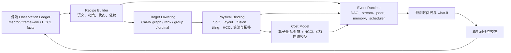

# 路线三综述：训练侧全栈/统一仿真框架

## 0. 范围、证据与先给结论

本组覆盖 SimAI、ASTRA-sim 2.0、Proteus、FlexFlow、ParallelSim、Multiverse。阅读前已对齐本项目的 V0.5 详细版、V0.6、V0.7、V0.8 和路线二汇总，沿用五层边界：

1. **Execution Recipe**：可移植的工作负载语义、控制决策、状态与依赖；
2. **Physical Binding**：rank/device/kernel/layout/tiling/graph/collective 到目标系统的绑定；
3. **Observation Ledger**：源端/目标端观测事实及来源、版本、时间基准、置信度；
4. **Cost Model**：为目标事件提供服务时间；
5. **Event Runtime**：按 DAG、stream、peer 和共享资源组合时间线，让等待/重叠自然出现。

核心结论：

- 六篇不是一种系统。**SimAI** 是框架驱动 workload + 计算成本 + CCL/包网络 DES；**ASTRA-sim 2.0** 是标准执行图和多保真系统/网络骨架；**Proteus** 是并行策略编译器 + 运行时行为模拟；**FlexFlow** 是 SOAP 策略搜索器内的快速 task-graph 模拟；**Multiverse** 是并行执行大量独立仿真实验的 GPU runtime；**ParallelSim** 因全文受限只能确认 IR subgraph 与分层引擎摘要。
- “全栈”在这些论文中通常指性能层次贯通，**不等于执行训练数值、完整框架状态、GPU/NPU kernel 微架构或 CCL/NIC 软件栈**。
- 对本项目最可取的组合不是照搬一篇，而是：以 **ASTRA/Proteus 风格 IR 与 lowering** 承载 Recipe/Binding，以 **SimAI 风格 CCL 决策和包网络**提高通信保真，以 **Proteus 风格 runtime/memory**补调度，以 **Multiverse 风格 SPME**加速批量 what-if；FlexFlow 的 delta simulation 用于增量重算。
- 所有源 trace duration 都只能进入 Observation Ledger/Cost Model，不能充当目标 Recipe 的固有语义。这一点与 V0.8 一致。

## 1. 原文身份与获取状态

| 系统 | 正式身份 | 本轮原文 | 证据状态 |
|---|---|---|---|
| SimAI | USENIX NSDI 2025，pp. 541–558 | [USENIX PDF](https://www.usenix.org/system/files/nsdi25-wang-xizheng-simai.pdf) | 完整，PDF/印刷页已映射 |
| ASTRA-sim 2.0 | IEEE ISPASS 2023，pp. 283–294 | [arXiv:2303.14006](https://arxiv.org/abs/2303.14006) | 完整，按 arXiv PDF 页 |
| Proteus | IEEE TPDS 35(10), 2024, pp. 1867–1878 | [arXiv:2306.02267](https://arxiv.org/abs/2306.02267) | 完整，按 arXiv v1 PDF 页；不伪造终版页映射 |
| FlexFlow | SysML 2019 | [arXiv:1807.05358](https://arxiv.org/abs/1807.05358) | 完整，按 arXiv PDF 页 |
| ParallelSim | CCF T HPC 8, 2026, pp. 221–236 | [Springer DOI](https://link.springer.com/article/10.1007/s42514-025-00271-w) | 全文订阅限制，仅官方未分页摘要/元数据 |
| Multiverse | USENIX NSDI 2025，pp. 473–488 | [USENIX PDF](https://www.usenix.org/system/files/nsdi25-gui.pdf) | 完整，PDF/印刷页已映射 |

身份纠错：ASTRA-sim 2.0 是 ISPASS 2023，不是 MICRO；用户所列 NSDI’25 “Multi-exp. Parallel Sim”正式题名为 *Accelerating Design Space Exploration for LLM Training Systems with Multi-experiment Parallel Simulation*，系统名 Multiverse；ParallelSim 的 DOI 含 `2025`，但正式落地页显示 2026-03-16 发布。

## 2. 六篇方法定位：不要混为一谈

| 系统 | 核心输入 | 核心机制 | 主要输出/用途 | 更准确的类别 |
|---|---|---|---|---|
| SimAI | Megatron/DeepSpeed 配置、模型、拓扑、计算 DB | 单机 mock 框架路径；SimCCL 复刻 NCCL；NS-3/UNISON DES | 端到端时间、网络/硬件/并行 what-if | 执行驱动 workload 生成 + 多层性能仿真 |
| ASTRA-sim 2.0 | PyTorch/FlexFlow execution trace | compute/memory/comm DAG；多维拓扑；可换网络/内存后端 | 大规模体系结构和网络 DSE | trace/图驱动模块化仿真骨架 |
| Proteus | 模型 + 用户给定 Strategy Tree | 策略编译成 DEG；HTAE 双层调度、带宽共享、overlap、内存 | 任意并行策略性能/OOM | 声明式策略编译 + runtime 仿真 |
| FlexFlow | operator graph + SOAP candidate | task graph；测量 op + `s/b`；MCMC/delta sim | 候选策略排序并真实执行最优项 | 策略搜索系统，模拟器是内部 oracle |
| ParallelSim | Python/PyTorch → IR subgraphs | 摘要称 hierarchical engine、stage 间/内解耦 | 并行策略选择 | 待全文确认；不能细分 |
| Multiverse | 已注记计算时间的 Chakra/ASTRA-like workload | GPU ECS、SPME、机内解析/机间包 DES | 同时跑大量 topology/CCA/parallel/CC 实验 | 多实验仿真加速 runtime |

**判别要点**：

- SimAI-WG 生成的是目标框架路径，不是源 trace 重放。
- Proteus/FlexFlow 的策略由用户或搜索器提供，不是从真实执行自动恢复。
- ASTRA-sim 最接近统一 trace runtime，但 trace 不含完整训练状态/数据语义。
- Multiverse 主要提升“每单位 host 时间能跑多少实验”，不提升上游 Recipe 本身的真实性。
- 网络仿真不等于全栈：ASTRA 默认解析网络假设无拥塞，Proteus/FlexFlow 更粗；SimAI 与 Multiverse 的机间网络才进入包级 DES。

## 3. 分层覆盖对比

符号：`●` 论文核心覆盖，`◐` 有抽象/部分覆盖，`○` 未见实质覆盖，`?` 全文不足。

| 层/系统 | SimAI | ASTRA-sim 2.0 | Proteus | FlexFlow | ParallelSim | Multiverse |
|---|---:|---:|---:|---:|---:|---:|
| 框架/策略语义 | ● 单机 mock 框架 | ◐ 外部 execution graph | ● Strategy Tree | ● SOAP strategy | ? IR frontend | ◐ 外部 workload |
| 算子图/依赖 | ● | ● | ● | ● | ? | ● 输入依赖 |
| kernel/编译细节 | ◐ 可拆 kernel/查表 | ○ roofline/外部时间 | ○ op profile | ○ op profile | ? | ○ 外部 duration |
| collective 算法/CCL | ● 修改 NCCL | ◐ topology-aware algorithm | ◐ alpha-beta+NCCL 修正 | ○ `s/b` P2P | ? | ◐ CCA/NCCL flow |
| 机内网络 | ● SimCCL+network | ◐ 解析/可换后端 | ◐ 层次链路公平共享 | ○ link FIFO | ? | ● 校准解析模型 |
| 机间网络/拥塞 | ● packet/RDMA | ◐ 默认无拥塞，可换后端 | ○ | ○ | ? | ● packet DES+CC/route |
| 调度/重叠 | ◐ 依赖/DES | ◐ system layer | ● HTAE + `γ` | ◐ FIFO 事件 | ? | ● ECS + 经验 overlap |
| 内存/OOM | ○ 无完整模型 | ◐ local/remote service | ● 生命周期/OOM | ○ | ? | ◐ 容量预检 OOM |
| 数值/optimizer 状态 | ○ | ○ | ○ | ○ | ? | ○ |
| 批量 DSE 加速 | ◐ PDES 单实验 | ◐ 快速解析 | ◐ 秒级单策略 | ● delta search | ? | ● SPME 多实验 |

结论：没有一篇同时覆盖训练状态、框架决策、kernel/编译、CCL、网络、内存和调度。所谓“统一”必须按层核验。

## 4. 成本输入、事件执行与 overlap

| 系统 | 计算成本 | 通信成本 | 事件执行/调度 | overlap 形成方式 |
|---|---|---|---|---|
| SimAI | 实测模块/kernel DB；未知 GPU 按 FLOPS/BW 外推 | SimCCL 选算法/route → P2P → NS-3 | DES + UNISON PDES | 依赖与资源时间线自然组合 |
| ASTRA-sim 2.0 | ET FLOPs+roofline，或外部 NPU/实测 | 默认 `latency×hops + size/bw`；可换网络后端 | 每 NPU graph engine + callbacks | system 层支持，但不等价真实 stream runtime |
| Proteus | 目标硬件 op profiler | alpha-beta、拓扑/channel 修正；共享链路公平分配 | HTAE scheduler/executor/三队列 | 固定、实测校准的 `γ` 修正 |
| FlexFlow | 目标设备 op 多次实测平均 | `size/bw`，link FIFO | ready queue，Algorithm 1；增量 Algorithm 2 | 不同 compute/link resource 可并行 |
| ParallelSim | 未知 | 未知 | 摘要称 stage 间/内分层引擎 | 摘要称针对 profiling/overlap 做适配，细节未知 |
| Multiverse | workload 已注记 no-overlap duration | 机内 `α+size/β`；机间 packet DES | 固定 step ECS、pull sync、megakernel | profiling 的 ratio/extension model |

方法论判断：

- **优先让 overlap 由 Event Runtime 产生**。Proteus/Multiverse 的经验修正只应作为受控 fallback，并带 model/op/hardware/software 的适用域。
- **duration 不是语义**。同一 Recipe 换 GPU/NPU、编译器或拓扑，计算/通信成本应重新生成。
- **网络保真度应分档**。早期 DSE 可用解析模型，涉及拥塞、多 rail、RoCE、CCL 算法差异或 small-message pipeline 时切换 flow/packet 后端。

## 5. 精度、规模和实验口径

| 系统 | 论文主要精度证据 | 真机/规模 | 需要同时看到的限制 |
|---|---|---|---|
| SimAI | 端到端 <4%，概括平均 1.9%；通信 A100/H100 平均 3.9%/2.3% | 最高 1024 GPU | EP 均衡；计算查表/外推；小消息 NIC pipeline 不完整 |
| ASTRA-sim 2.0 | 4/16 V100 ring、64MB–1.5GB all-reduce 平均误差 5% | 解析模拟到 4K NPU | 端到端真实训练校准不是重点；默认无拥塞 |
| Proteus | 180 个结果平均 3.0%，最大 14.7%；2 个 OOM 错误 | 真机最高 32 GPU | 每模型主要 2 个专家选定策略；目标机 profiling/`γ` |
| FlexFlow | 模拟与真实差异均 <30%，排序保持 | 真机最高 64 GPU | 目标是策略排序；旧 P100/K80；通信模型极简 |
| ParallelSim | 官方摘要称平均 1.83% | 16 DGX A100 nodes | 样本、分母、最大误差、模型和校准均未知，不能横比 |
| Multiverse | 机内 collective 约 0.7%–1.2%；1024 GPU E2E <3% | 单 H100 模拟目标 54K GPU；真机到 1024 GPU | compute duration 外部输入；机内/overlap 经验校准；并发数字内部不一致 |

**固定 Recipe 与 system capacity**：这些论文的“最优策略”或“系统吞吐”经常同时改变并行策略、micro-batch 或目标资源，不能直接当作固定源执行的 fidelity。回放验收至少要分别报告：

- `fixed_recipe`：同一语义和决策下，时间线/事件/尾延迟偏差；
- `system_capacity`：允许目标系统重新选择 batch、并行、调度后的最优吞吐。

## 6. What-if 能力

| 问题 | 最适合参考 | 原因与限制 |
|---|---|---|
| GPU/NPU、主机/NIC 采购 | SimAI | 计算 DB+CCL+packet 网络，并有生产采用；新设备外推仍需校准 |
| 层次拓扑、wafer、远端内存 | ASTRA-sim 2.0 | 多维 topology 和 memory backend；主要是一阶 DSE |
| TP/PP/DP、recompute、ZeRO/OOM | Proteus | Strategy Tree+DEG+HTAE；规模/网络保真有限 |
| 大空间逐算子切分搜索 | FlexFlow | SOAP+MCMC+delta simulation；只适合其假设内的排序 |
| 10K topology/CCA/CC sweep | Multiverse | SPME/ECS 并发大量独立实验；上游成本必须先给准 |
| ParallelSim 的策略搜索 | 待补证 | 只能确认摘要声称可选最优策略 |

## 7. 开源、落地和复现成熟度

| 系统 | 实现/公开性 | 落地判断 |
|---|---|---|
| SimAI | [GitHub](https://github.com/aliyun/SimAI)；论文称 simulation service/设计采用 | 生产内部落地证据最强；公开重现仍受内部 benchmark/硬件限制 |
| ASTRA-sim 2.0 | [GitHub](https://github.com/astra-sim/astra-sim)；生态持续演进 | 成熟研究基础设施；注意当前 Chakra 版本与论文 2.0 时点差异 |
| Proteus | 论文称约 9K LoC Python；本轮未找到可核验公共仓库 | 已实现并实验，不等于开源；profile/artifact 复现受限 |
| FlexFlow | [GitHub](https://github.com/flexflow/FlexFlow) 和现行项目公开 | 有真实 distributed runtime；论文模拟器是优化组件，历史版本需 commit 对齐 |
| ParallelSim | 全文和官方仓库未核验 | 只能记为摘要级论文证据 |
| Multiverse | [GitHub](https://github.com/NASP-THU/multiverse)，论文称约 13K C++ | 开放研究原型，GPU SPME 工程证据较完整 |

## 8. 五层架构总映射

### 8.1 Execution Recipe

- **最值得组合**：Proteus Strategy Tree 表达策略；ASTRA ET/Proteus DEG 表达 lowered 事件图；SimAI-WG 借目标框架生成实际路径。
- **必须补齐**：动态 shape、随机种子、micro-batch/optimizer/recompute 状态、MoE token→expert 路由、collective group/ordinal、数据依赖控制流。
- **不能混入**：任何源机 duration、源 GPU/NPU 固有 kernel 名、源拓扑 wait。

### 8.2 Physical Binding

- **通信参考**：SimAI 的 CCL algorithm/channel/route；Multiverse 的 CCA→flow/topology；ASTRA 的层次拓扑。
- **计算参考不足**：六篇都没有完整覆盖编译图、fusion、layout、tiling、kernel variant 到目标设备的确定性绑定。
- **本项目要求**：建立 `logical op → target graph/compiler node → target kernel(s)` 与 `collective → group/ordinal/algo/chunk/route` 双向可审计映射。

### 8.3 Observation Ledger

- 六篇普遍使用 Nsight/profile/benchmark，但多把观测直接塞进 DB 或 correction factor。
- 本项目必须独立保存 tool/version、host/rank/device/stream、clock domain、warm-up、样本分布、异常值策略、来源 run 和置信度，才能支撑校准与回归。

### 8.4 Cost Model

- 计算：从 FlexFlow/Proteus/SimAI 的实测表起步，逐步加入解析/ML OOD 预测；key 必须包含硬件与编译栈。
- 通信：按保真档提供 HCCL microbenchmark 表、校准解析 collective、flow/packet DES；绝不把源 wait/duration 当目标固有成本。
- overlap：优先资源事件模型，经验参数必须显式标记适用域和置信度。

### 8.5 Event Runtime

- ASTRA/Proteus 提供 DAG/调度骨架；SimAI 提供网络完成事件；Multiverse 提供批量 ECS 执行；FlexFlow 提供局部变更的增量重算。
- 最低资源模型应包括：device compute streams、DMA/communication streams、HCCL peer/group 次序、链路/NIC/rail、host launch，以及 tensor/workspace 生命周期。

## 9. 面向 Ascend/CANN/HCCL 的建议架构

### 分阶段落地

1. **MVP：事件 IR 与可核验绑定**  
   采用 ASTRA ET/Proteus DEG 的共同子集：compute、memory、collective、P2P、dependency。每个事件强制携带 logical ID、rank/device/stream、group/ordinal、phase 和 provenance。

2. **CANN 计算成本**  
   先以实测 DB 覆盖主要 shape，键为 `SoC × CANN/torch_npu × op/kernel ABI × dtype × shape × layout × fusion × tiling × stream`；未覆盖项输出预测值和置信区间，不静默插值。

3. **HCCL 双档通信**  
   快速档使用按 collective/rank/message/topology/version 校准的解析表；高保真档把 HCCL collective lower 成 chunk/flow，经 NIC/link/rail Event Runtime 产生拥塞和 wait。group 与 ordinal 是一等字段。

4. **Runtime 与内存**  
   参考 Proteus 的 scheduler/executor/tensor refcount，但用 stream/task/kernel/HCCL 资源事件代替全局 overlap `γ`；加入 workspace、persistent buffer、allocator cache、fusion buffer 与 OOM。

5. **批量 what-if**  
   单实验 fidelity 稳定后，再采用 Multiverse SPME/ECS 与 FlexFlow delta simulation 加速拓扑、并行、HCCL 算法和容量扫描。

## 10. 建议的验证矩阵

| 维度 | fixed_recipe 验证 | system_capacity 验证 |
|---|---|---|
| 单算子/kernel | 相同 shape/dtype/layout/tiling 的时延分布 | 编译/融合/tiling 自动选择后的最佳吞吐 |
| HCCL collective | 相同 group/ordinal/algorithm/message 的时间与 flow | 允许算法/通道/分片重选后的最优带宽 |
| 单 rank 时间线 | op→kernel、stream 次序、空洞与 overlap | runtime 重调度后的吞吐 |
| 多 rank | collective 边界、straggler、PP bubble | TP/PP/DP/EP 重新配置的集群吞吐 |
| 网络 | 固定 flow/route 下 wait/transit | 路由、rail、CC 参数优化 |
| 内存 | tensor/workspace 生命周期和 OOM 一致性 | recompute/shard/offload 的容量边界 |

至少报告 mean/p50/p95/max 和结构性不一致，不只给一个平均百分比；对动态 MoE、变长序列、多 rail 拥塞和小消息 pipeline 单列 OOD 套件。

## 11. 各篇最值得吸收与不应照搬的部分

| 系统 | 吸收 | 不应直接照搬 |
|---|---|---|
| SimAI | 框架路径生成、CCL 决策复刻、packet network、生产校准 | EP 均衡；粗 GPU 外推；把 NCCL 内部实现假定可移植到 HCCL |
| ASTRA-sim 2.0 | 统一 ET、可换后端、层次拓扑/内存接口 | 默认无拥塞解析网络、只凭 FLOPs/size 的 compute |
| Proteus | Strategy Tree→DEG、双层调度、内存生命周期 | 固定 `γ`、公平带宽、32 GPU 范围外无证据的泛化 |
| FlexFlow | SOAP 候选生成、delta simulation、排序式 DSE | 数据无关、满带宽、FIFO、`s/b` 作为最终 fidelity |
| ParallelSim | Python/PyTorch→IR、分层引擎的待验证思路 | 在未读全文前引用 1.83% 做横向优劣结论 |
| Multiverse | ECS/SPME 批量执行、机内/机间分档、pull sync | 认为多实验加速能补齐 compute/Recipe；直接沿用 NCCL 校准 |

## 12. 未解决问题与后续调研优先级

1. 获取 ParallelSim 合法全文，补页码、IR schema、overlap/通信/内存/代码和误差口径。
2. 实际 checkout/build SimAI、ASTRA-sim、FlexFlow、Multiverse，锁定论文 commit、license、样例和可复现资产；本轮只核验了公开入口。
3. 研究 HCCL 可观测/可插桩边界：是否能获得 group、ordinal、algo/protocol/channel/chunk/route；若不能，定义黑盒校准档。
4. 把本路线与路线一 Daydream/dPRO/Echo/Lumos 对齐：哪些字段来自 trace，哪些必须由目标 lowering 产生。
5. 设计统一误差协议，严格区分 fixed_recipe、system_capacity、训练 step 吞吐、collective 微基准和网络 flow 指标。

## 13. 分篇笔记

- [SimAI](./01_simai.md)
- [ASTRA-sim 2.0](./02_astra_sim_2.md)
- [Proteus](./03_proteus.md)
- [FlexFlow](./04_flexflow.md)
- [ParallelSim（摘要级证据）](./05_parallelsim.md)
- [Multiverse](./06_multiverse.md)
