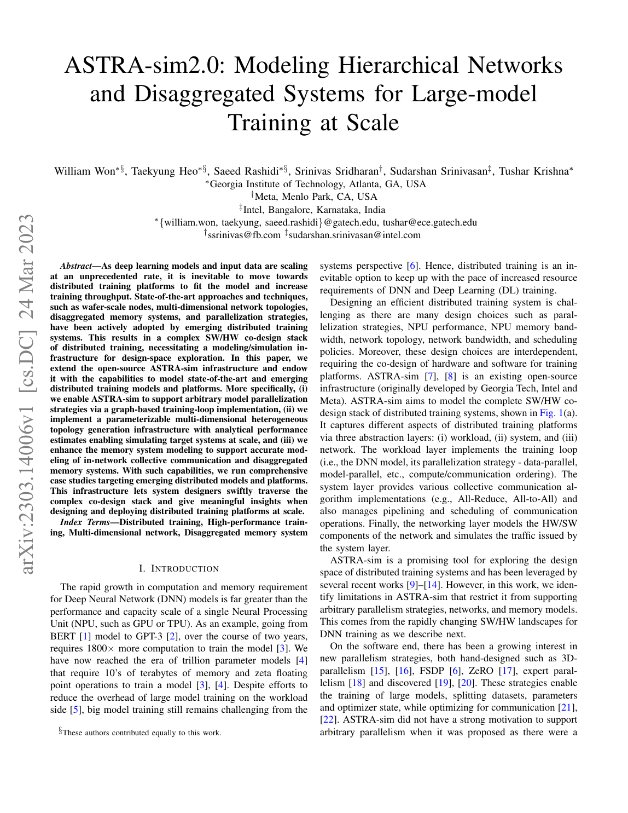
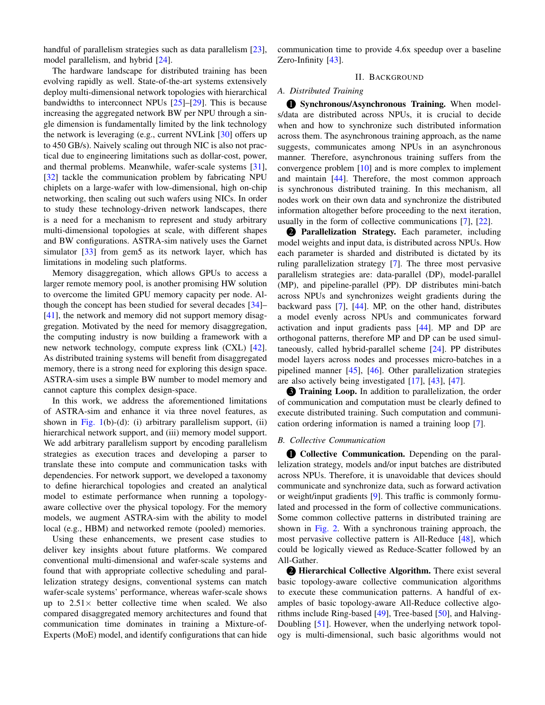
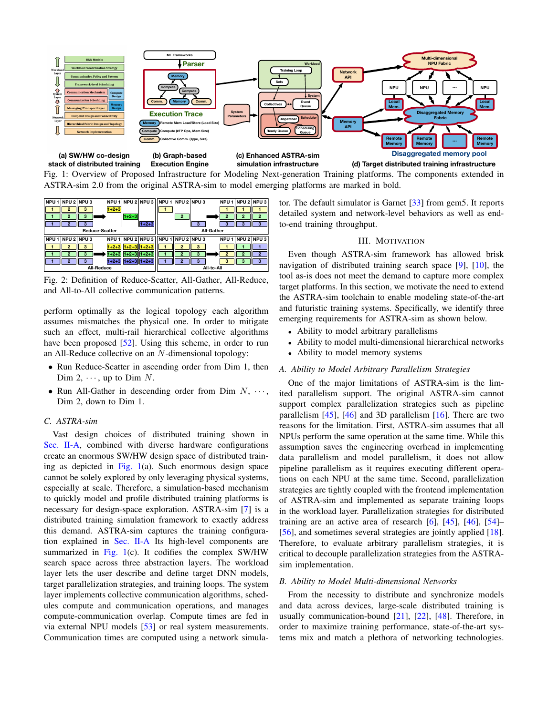
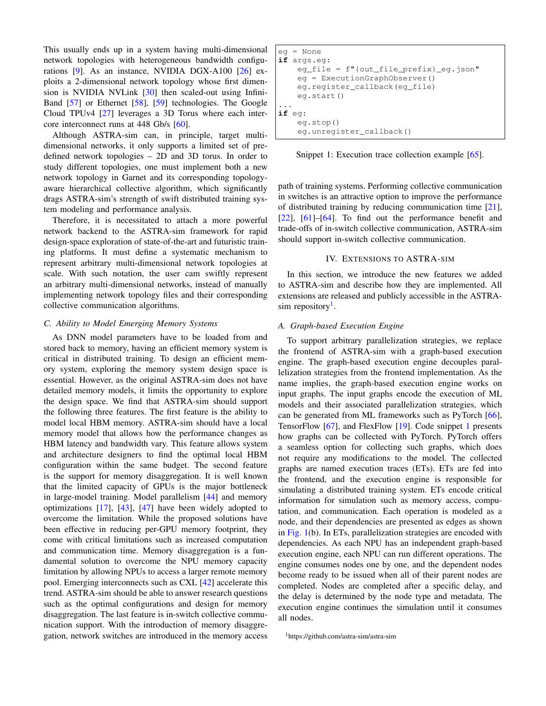
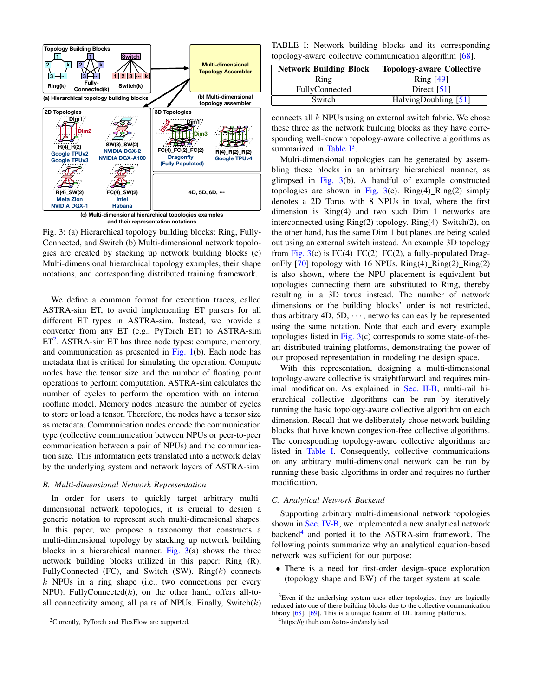
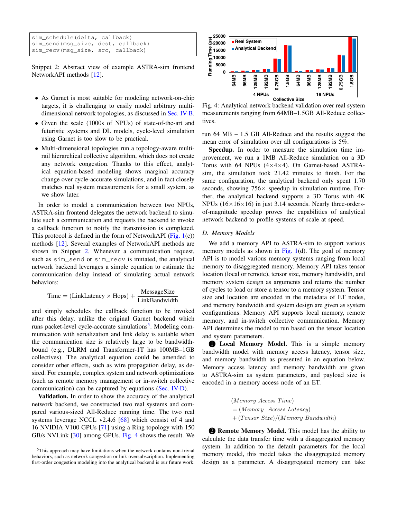
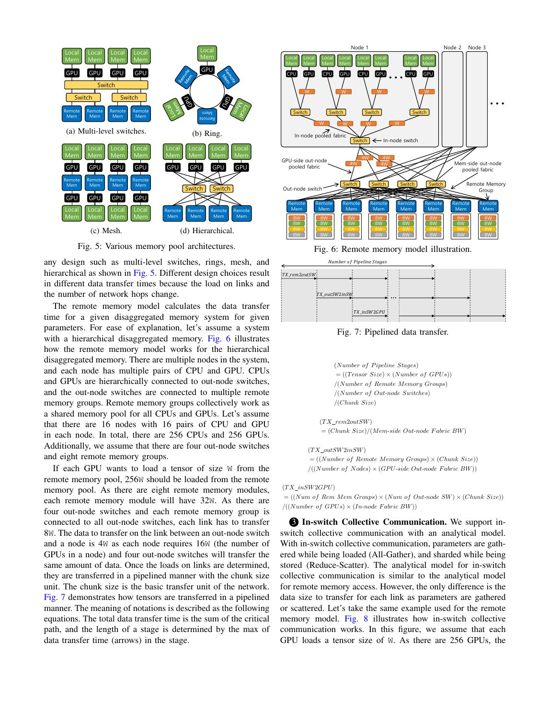
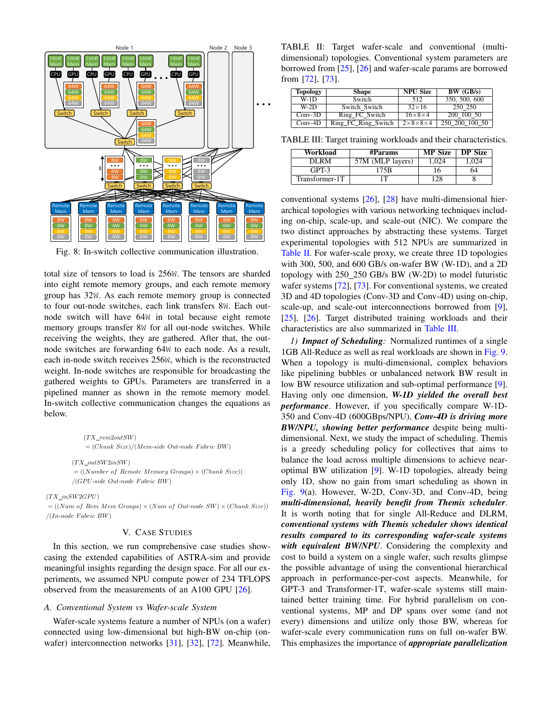
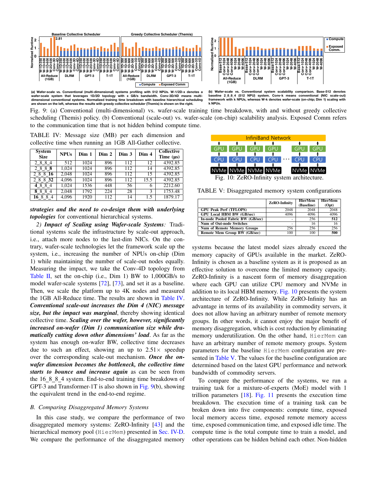
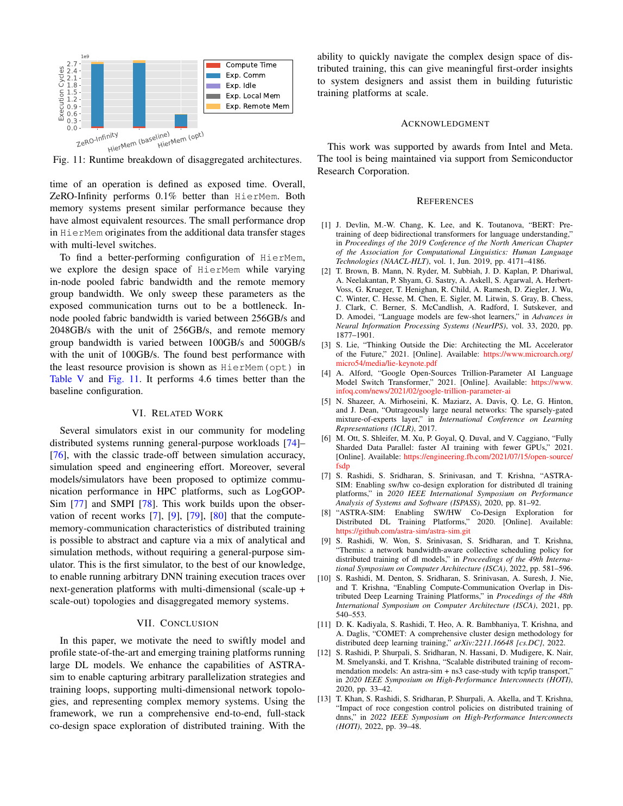

# ASTRA-sim 2.0：执行图、层次网络与内存的模块化训练仿真

> 证据截图说明：正文中的 `原文截图 E###` 可跳转到文末证据卡片。截图按 PDF 物理页码生成；原有章节、图表、算法和段落定位保持不变。

## 1. 论文身份与页码约定

- 正式题名：*ASTRA-sim2.0: Modeling Hierarchical Networks and Disaggregated Systems for Large-model Training at Scale*。
- 作者：Saeed Rashidi 等；IEEE ISPASS 2023，正式页 283–294，DOI `10.1109/ISPASS57527.2023.00035`。
- 原文：[arXiv](https://arxiv.org/abs/2303.14006)、[项目与代码](https://github.com/astra-sim/astra-sim)。
- 本文引用本地 arXiv PDF 的 p.1–12；该版本没有嵌入 283–294 的印刷页码，因此不臆造页映射。

## 2. 一句话结论

**原文事实**：ASTRA-sim 2.0 用统一 execution trace 表示 compute、memory、collective/P2P 节点和依赖，以可组合的多维拓扑、集合通信算法、解析或外部网络后端、局部/远端内存模型执行大规模训练时序。（PDF p.1，Abstract；p.3–8，§III–IV） 〔[原文截图 E001](#evidence-e001)〕

**归纳**：它是六篇中最接近“标准化执行图 + 可替换仿真后端”的基础设施，但默认解析网络显式假设无拥塞，计算只用 roofline/外部时间；“可扩到全栈协同设计”不能解释为已复刻框架、kernel、CCL 和真实网络栈。

## 3. 解决什么问题

**原文事实**：论文面向大模型训练系统的模型并行、层次网络、in-network collective 与 disaggregated memory 联合设计。作者认为旧版 ASTRA-sim 的 workload 表达难以容纳任意并行依赖，网络接口也限制层次/异构拓扑和大规模快速探索。（PDF p.1–3，Abstract、§I、§II） 〔[原文截图 E002](#evidence-e002)〕

**原文事实**：2.0 的扩展包括：图式 training loop、参数化多维拓扑、解析网络后端、内存模型以及 in-network collectives/远端内存案例。（PDF p.3，§III，Fig. 1） 〔[原文截图 E003](#evidence-e003)〕

## 4. 架构与方法

### 4.1 三层模块化架构

**原文事实**：Fig. 1 把系统分为 workload、system、network 三层。Workload 负责训练图；system 处理 collective、调度与 compute/communication overlap；network 可接解析模型或更细模拟器。计算时间可来自外部 NPU model 或实机测量。（PDF p.3，§III 第1–5段，Fig. 1） 〔[原文截图 E004](#evidence-e004)〕

**归纳**：这里的 NPU 是通用 neural processing unit 概念，不等于已支持 Ascend NPU/CANN。

### 4.2 Execution Trace：compute/memory/communication 图

**原文事实**：ASTRA-sim 可通过 PyTorch Execution Graph Observer 在不改模型代码的情况下抓图，也可接 FlexFlow execution trace；每个 NPU 有独立 graph engine，节点在所有 parent 完成后 ready。（PDF p.4，§IV-A，Snippet 1 后第1–4段） 〔[原文截图 E005](#evidence-e005)〕

**原文事实**：统一 ET 节点分三类：compute 节点记录 tensor size/FLOPs 并用内部 roofline 估计周期；memory 节点记录读写 tensor size；communication 节点记录 collective/P2P 类型和通信量，随后由 system/network 转为延迟。（PDF p.5，§IV-A 第1–2段，Fig. 1 右上角） 〔[原文截图 E006](#evidence-e006)〕

**归纳**：ET 已覆盖“事件类型、代价元数据、依赖”，但没有训练状态值、算子输入内容、随机性、动态控制流结果、kernel/layout/tiling 或 CCL ordinal，因此是性能执行图，不是语义完整录制。

### 4.3 层次网络与集合通信

**原文事实**：作者用 Ring、FullyConnected、Switch 三种 building block 按层次堆叠任意维网络，并为每一维选择 topology-aware collective；示例涵盖 TPU、DGX、Dragonfly 等 2D/3D 结构。（PDF p.5–6，§IV-B，Fig. 3，Table I） 〔[原文截图 E007](#evidence-e007)〕

**原文事实**：解析后端的核心式为 `Time = LinkLatency × Hops + MessageSize / LinkBandwidth`，完成后经 callback 通知 system 层；它依赖已知的、congestion-free 的 topology-aware collective。论文脚注明确说非平凡拥塞/oversubscription 的估计仍是限制与未来工作。（PDF p.6，§IV-C，Snippet 2 前后、脚注 4） 〔[原文截图 E008](#evidence-e008)〕

**原文事实**：64 MB–1.5 GB all-reduce 在 4/16 张 V100 ring 上的平均误差为 5%；64 NPU 3D torus 案例中，Garnet 需 21.42 分钟，解析后端 1.70 秒（756×），并在 3.14 秒内模拟 4K NPU。（PDF p.6，§IV-C “Validation”与“Simulation speed”，Fig. 4） 〔[原文截图 E009](#evidence-e009)〕

### 4.4 内存与远端内存

**原文事实**：local memory 用启动延迟与 `size/bandwidth` 估计；remote memory 引入分层 pool 和 pipeline，把请求在设备/网络阶段组合。论文还建模 in-switch collectives。（PDF p.6–8，§IV-D，Fig. 5–8及相邻公式） 〔[原文截图 E010](#evidence-e010)〕

**边界**：这是带宽/延迟和分层访问层面的抽象，不是 allocator、缓存、页迁移、碎片或 tensor 生命周期的完整实现。

### 4.5 事件执行、调度和重叠

- **依赖（原文事实）**：节点由 parent 完成事件激活，各 NPU 独立推进 execution graph。（PDF p.4，§IV-A） 〔[原文截图 E011](#evidence-e011)〕
- **collective（原文事实）**：system 层把 communication 节点交给所选 collective/网络后端，并通过完成 callback 恢复图执行。（PDF p.5–6，§IV-B–C） 〔[原文截图 E012](#evidence-e012)〕
- **重叠（原文事实）**：system 层职责明确包含 compute/communication overlap；论文没有证明它复刻 PyTorch/NCCL 的全部 stream/launch 次序。（PDF p.3，§III，Fig. 1） 〔[原文截图 E013](#evidence-e013)〕
- **调度（证据边界）**：论文支持更换 collective scheduling/网络算法，但没有给出一个与真实训练 runtime 等价的通用 stream scheduler。

## 5. What-if、实验和定量结果

**原文事实**：所有 §V 案例统一假定 A100 的实测 234 TFLOPS 计算能力。（PDF p.8，§V 开头） 〔[原文截图 E014](#evidence-e014)〕

**原文事实**：作者比较 512 NPU 的 wafer-scale 与 conventional 多维拓扑，并引入 Themis 调度。对 AllReduce/DLRM，在等带宽条件下 conventional 可接近 wafer；GPT-3/Transformer-1T 因并行映射不同，wafer 更占优。scale-up wafer 的 collective 加速最高 2.51×。（PDF p.8–9，§V-A，Table II–IV，Fig. 9） 〔[原文截图 E015](#evidence-e015)〕

**原文事实**：分层远端内存案例中，未优化 HierMem 与 Zero-Infinity 接近（后者约快 0.1%）；优化后的 HierMem 相对基线最高 4.6×。（PDF p.9–10，§V-B，Fig. 11，Table V） 〔[原文截图 E016](#evidence-e016)〕

**归纳**：这些是架构 what-if 案例，不是同一 workload 在全栈真实集群上的端到端误差验证。论文最强的实测精度证据是特定 ring all-reduce 的 5%，而非所有模型/拓扑的统一误差。

## 6. 实现、开源、复现与成熟度

- **原文事实**：论文注明实现开放，并支持 PyTorch/FlexFlow execution trace 和多个网络后端接口。
- **当前核验**：ASTRA-sim 官方 GitHub 仓库公开；当前项目文档已演进到 Chakra trace 和多保真后端。本文只把论文中的 2.0 功能当作历史定点事实，不能把当前主干能力倒灌到 2023 论文。
- **成熟度判断（归纳）**：活跃、模块化的研究基础设施，适合体系结构/网络 DSE；精确复现实机框架、CCL、kernel 的能力取决于外部 trace、成本和后端质量。

## 7. 优点、缺点与适用边界

### 优点

1. ET 格式将 compute、memory、communication 和依赖统一，天然适合作为回放中间表示。
2. workload/system/network 解耦，允许同一 Recipe 替换硬件拓扑、collective 或网络保真度。
3. 多维层次拓扑与远端内存覆盖比单纯通信查表更广。
4. 解析后端能在秒级探索数千 NPU，适合早期 DSE。

### 缺点/边界

1. 默认解析网络假定无拥塞，无法表达 oversubscription、flow 竞争和复杂 NIC/CCL pipeline。
2. compute 只用 roofline/外部测量；没有 kernel 微架构、融合、layout/tiling 或编译器选择。
3. ET 不执行数值，也没有 optimizer 状态、动态 shape/MoE 路由等数据依赖语义。
4. 内存是服务时间模型，不等于真实 allocator/缓存/生命周期回放。
5. 论文案例以架构对比为主，端到端真实训练校准弱于 SimAI、Proteus、Multiverse。

## 8. 与录制回放五层架构的关系

| 五层 | ASTRA-sim 2.0 对应物 | 判断 |
|---|---|---|
| Execution Recipe | ET 的 compute/memory/comm 节点与 DAG | 中强；性能依赖充分，训练语义不足 |
| Physical Binding | NPU/rank、层次拓扑、collective mapping | 中等；CCL 内部选择和 kernel binding 弱 |
| Observation Ledger | 外部测量或抓取图 | 原始数据入口有，缺 provenance/版本/置信度 schema |
| Cost Model | roofline、local/remote memory、解析/外部网络 | 多档可换，但默认模型粗 |
| Event Runtime | graph engine + system/network callback | 强，适合 DES 回放骨架 |

**归纳**：它最值得借鉴的是统一 ET 与后端接口，而不是默认解析公式。若用于异构回放，Recipe 应只保存逻辑操作和依赖，source duration 留在 Ledger；目标成本由所选设备/网络模型生成。

## 9. Ascend/CANN/HCCL 启示

1. 将现有 V0.8 Recipe lowering 成 ASTRA 风格 `compute/memory/collective/P2P` 节点，是可行的第一版事件 IR；每个节点还应带 rank/group/collective ordinal、stream 与 phase。
2. CANN 计算节点不能只带 FLOPs/tensor size；需由 SoC+CANN+shape/dtype/layout/fusion/tiling 的成本模型给出服务时间和置信区间。
3. HCCL 需要单独的 collective algorithm/channel/chunk binding。第一阶段可用校准解析后端；出现 RoCE 拥塞、oversubscription、多 rail 或竞争流时必须切换包/流级后端。
4. 内存节点可作为 HBM/DDR/远端内存 what-if 起点，但 OOM 与运行时一致性仍需 tensor 生命周期、workspace、allocator 和 recompute 语义。
5. 使用 Chakra/ET 生态时必须做版本化 schema 适配，不能把当前仓库格式未经核验地当成论文 2.0 原格式。

<!-- EVIDENCE_SCREENSHOTS:BEGIN -->

## 原文证据截图附录

正文中的 `原文截图 E###` 与本节一一对应。卡片保留原笔记行号和原有页码/章节定位；图片按 PDF 物理页生成。截图用于快速核读，正式引用仍以原论文为准。

<strong>E001</strong> - 原笔记第 15 行 - PDF p.1

<strong>原定位：</strong> <code>**原文事实**：ASTRA-sim 2.0 用统一 execution trace 表示 compute、memory、collective/P2P 节点和依赖，以可组合的多维拓扑、集合通信算法、解析或外部网络后端、局部/远端内存模型执行大规模训练时序。（PDF p.1，Abstract；p.3–8，§III–IV）</code>

<strong>E002</strong> - 原笔记第 21 行 - PDF p.1, 2, 3

<strong>原定位：</strong> <code>**原文事实**：论文面向大模型训练系统的模型并行、层次网络、in-network collective 与 disaggregated memory 联合设计。作者认为旧版 ASTRA-sim 的 workload 表达难以容纳任意并行依赖，网络接口也限制层次/异构拓扑和大规模快速探索。（PDF p.1–3，Abstract、§I、§II）</code>

<strong>E003</strong> - 原笔记第 23 行 - PDF p.3

<strong>原定位：</strong> <code>**原文事实**：2.0 的扩展包括：图式 training loop、参数化多维拓扑、解析网络后端、内存模型以及 in-network collectives/远端内存案例。（PDF p.3，§III，Fig. 1）</code>

<strong>E004</strong> - 原笔记第 29 行 - PDF p.3

<strong>原定位：</strong> <code>**原文事实**：Fig. 1 把系统分为 workload、system、network 三层。Workload 负责训练图；system 处理 collective、调度与 compute/communication overlap；network 可接解析模型或更细模拟器。计算时间可来自外部 NPU model 或实机测量。（PDF p.3，§III 第1–5段，Fig. 1）</code>

<strong>E005</strong> - 原笔记第 35 行 - PDF p.4

<strong>原定位：</strong> <code>**原文事实**：ASTRA-sim 可通过 PyTorch Execution Graph Observer 在不改模型代码的情况下抓图，也可接 FlexFlow execution trace；每个 NPU 有独立 graph engine，节点在所有 parent 完成后 ready。（PDF p.4，§IV-A，Snippet 1 后第1–4段）</code>

<strong>E006</strong> - 原笔记第 37 行 - PDF p.5

<strong>原定位：</strong> <code>**原文事实**：统一 ET 节点分三类：compute 节点记录 tensor size/FLOPs 并用内部 roofline 估计周期；memory 节点记录读写 tensor size；communication 节点记录 collective/P2P 类型和通信量，随后由 system/network 转为延迟。（PDF p.5，§IV-A 第1–2段，Fig. 1 右上角）</code>

<strong>E007</strong> - 原笔记第 43 行 - PDF p.5, 6

<strong>原定位：</strong> <code>**原文事实**：作者用 Ring、FullyConnected、Switch 三种 building block 按层次堆叠任意维网络，并为每一维选择 topology-aware collective；示例涵盖 TPU、DGX、Dragonfly 等 2D/3D 结构。（PDF p.5–6，§IV-B，Fig. 3，Table I）</code>

<strong>E008</strong> - 原笔记第 45 行 - PDF p.6

<strong>原定位：</strong> <code>**原文事实**：解析后端的核心式为 `Time = LinkLatency × Hops + MessageSize / LinkBandwidth`，完成后经 callback 通知 system 层；它依赖已知的、congestion-free 的 topology-aware collective。论文脚注明确说非平凡拥塞/oversubscription 的估计仍是限制与未来工作。（PDF p.6，§IV-C，Snippet 2 前后、脚注 4）</code>

<strong>E009</strong> - 原笔记第 47 行 - PDF p.6

<strong>原定位：</strong> <code>**原文事实**：64 MB–1.5 GB all-reduce 在 4/16 张 V100 ring 上的平均误差为 5%；64 NPU 3D torus 案例中，Garnet 需 21.42 分钟，解析后端 1.70 秒（756×），并在 3.14 秒内模拟 4K NPU。（PDF p.6，§IV-C “Validation”与“Simulation speed”，Fig. 4）</code>

<strong>E010</strong> - 原笔记第 51 行 - PDF p.6, 7, 8

<strong>原定位：</strong> <code>**原文事实**：local memory 用启动延迟与 `size/bandwidth` 估计；remote memory 引入分层 pool 和 pipeline，把请求在设备/网络阶段组合。论文还建模 in-switch collectives。（PDF p.6–8，§IV-D，Fig. 5–8及相邻公式）</code>

<strong>E011</strong> - 原笔记第 57 行 - PDF p.4

<strong>原定位：</strong> <code>- **依赖（原文事实）**：节点由 parent 完成事件激活，各 NPU 独立推进 execution graph。（PDF p.4，§IV-A）</code>

<strong>E012</strong> - 原笔记第 58 行 - PDF p.5, 6

<strong>原定位：</strong> <code>- **collective（原文事实）**：system 层把 communication 节点交给所选 collective/网络后端，并通过完成 callback 恢复图执行。（PDF p.5–6，§IV-B–C）</code>

<strong>E013</strong> - 原笔记第 59 行 - PDF p.3

<strong>原定位：</strong> <code>- **重叠（原文事实）**：system 层职责明确包含 compute/communication overlap；论文没有证明它复刻 PyTorch/NCCL 的全部 stream/launch 次序。（PDF p.3，§III，Fig. 1）</code>

<strong>E014</strong> - 原笔记第 64 行 - PDF p.8

<strong>原定位：</strong> <code>**原文事实**：所有 §V 案例统一假定 A100 的实测 234 TFLOPS 计算能力。（PDF p.8，§V 开头）</code>

<strong>E015</strong> - 原笔记第 66 行 - PDF p.8, 9

<strong>原定位：</strong> <code>**原文事实**：作者比较 512 NPU 的 wafer-scale 与 conventional 多维拓扑，并引入 Themis 调度。对 AllReduce/DLRM，在等带宽条件下 conventional 可接近 wafer；GPT-3/Transformer-1T 因并行映射不同，wafer 更占优。scale-up wafer 的 collective 加速最高 2.51×。（PDF p.8–9，§V-A，Table II–IV，Fig. 9）</code>

<strong>E016</strong> - 原笔记第 68 行 - PDF p.9, 10

<strong>原定位：</strong> <code>**原文事实**：分层远端内存案例中，未优化 HierMem 与 Zero-Infinity 接近（后者约快 0.1%）；优化后的 HierMem 相对基线最高 4.6×。（PDF p.9–10，§V-B，Fig. 11，Table V）</code>

<!-- EVIDENCE_SCREENSHOTS:END -->
