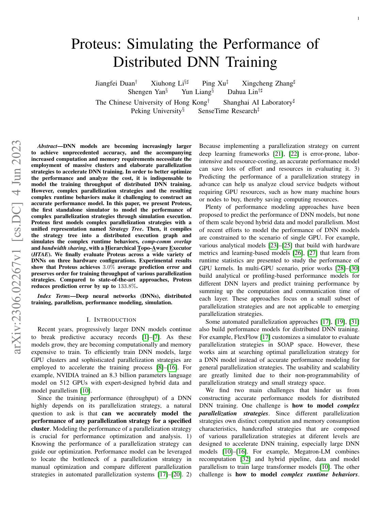
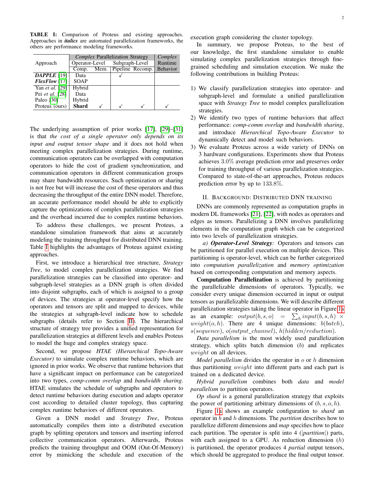
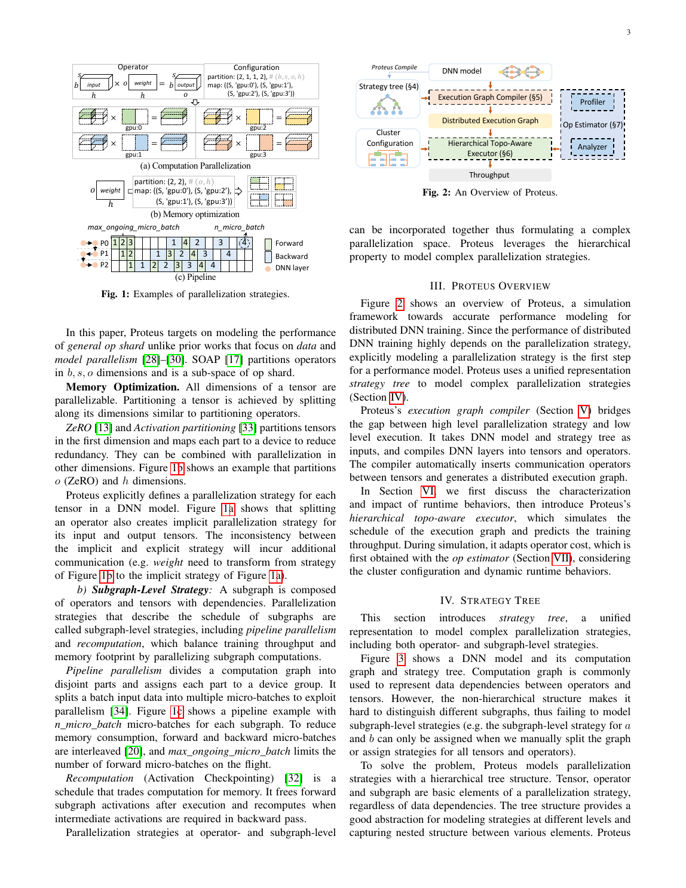
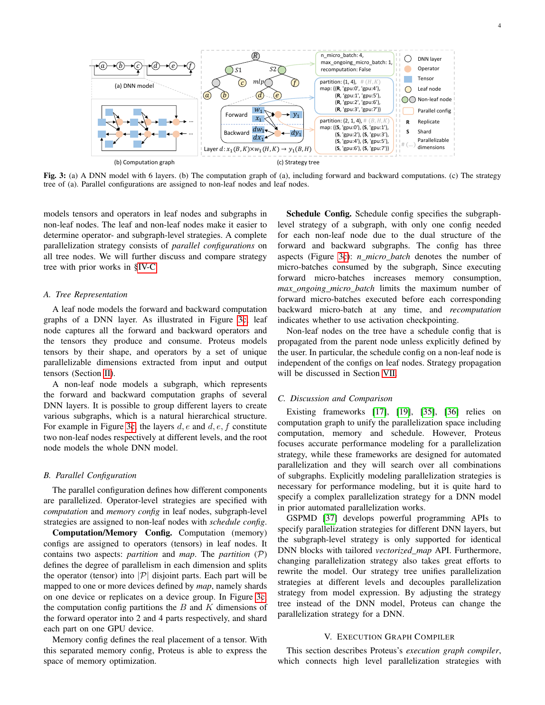
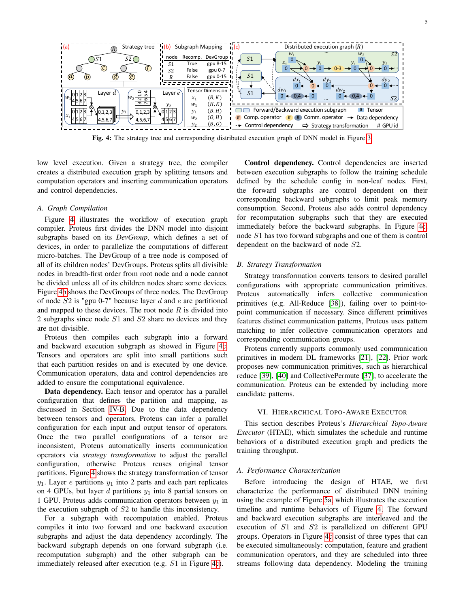
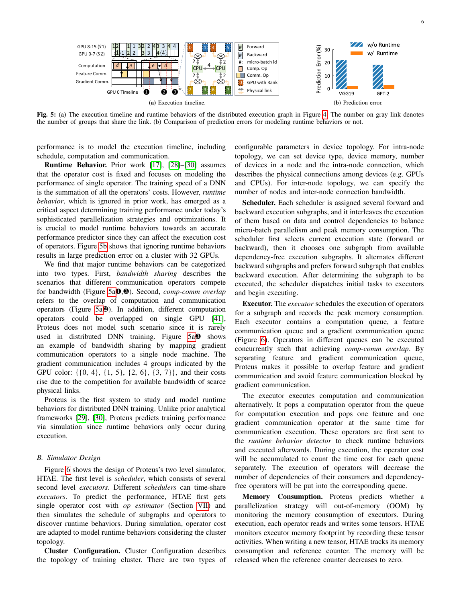
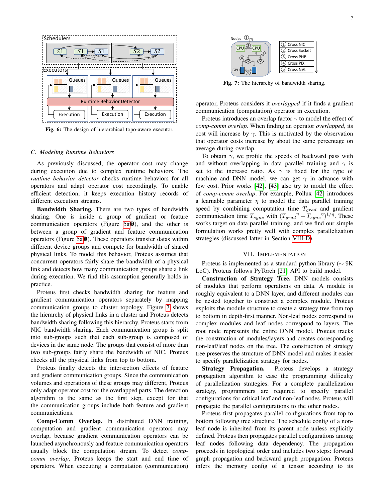
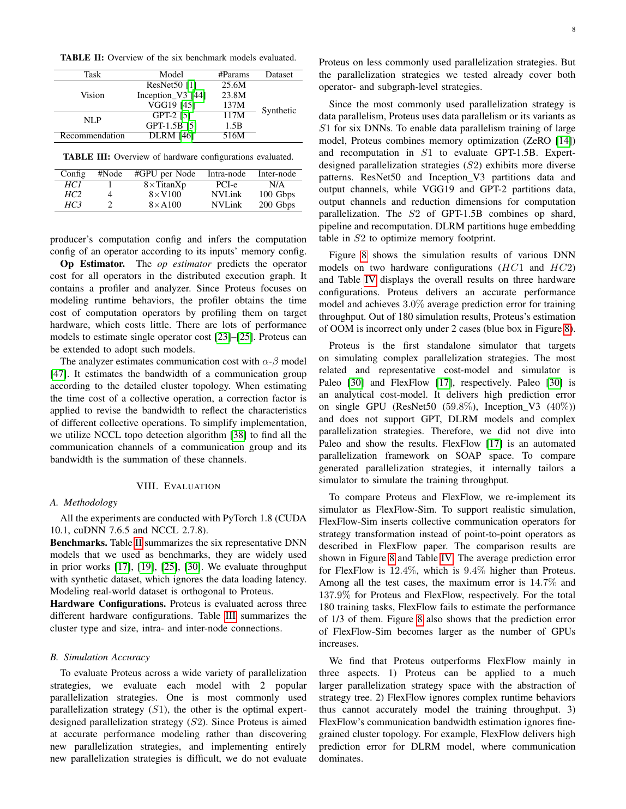
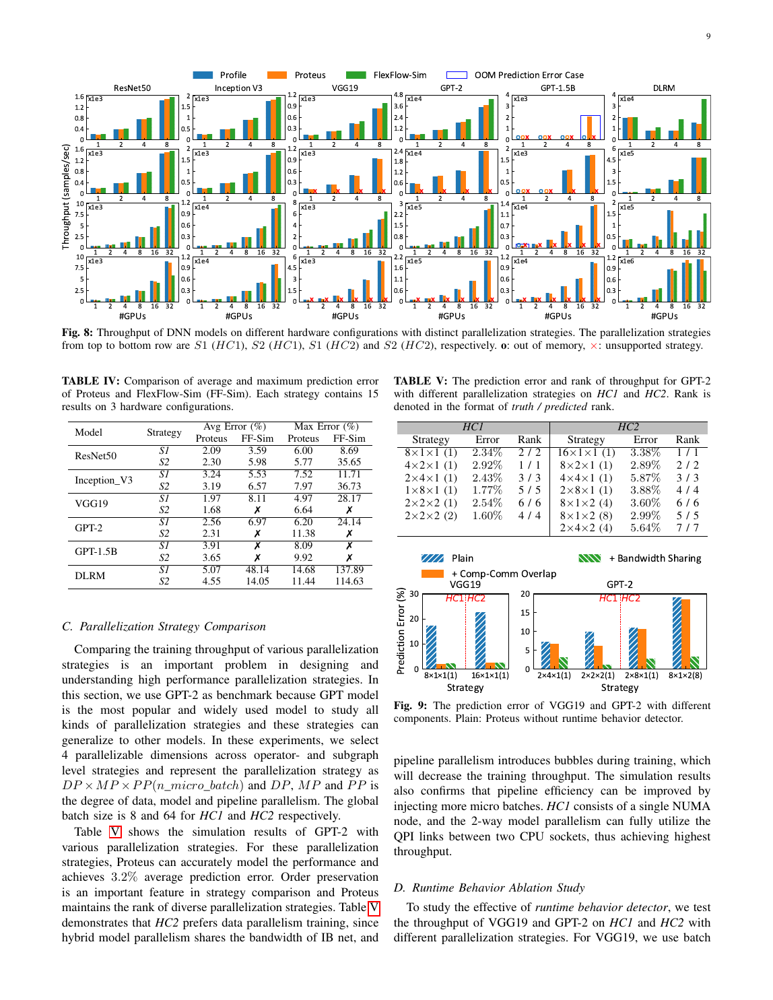
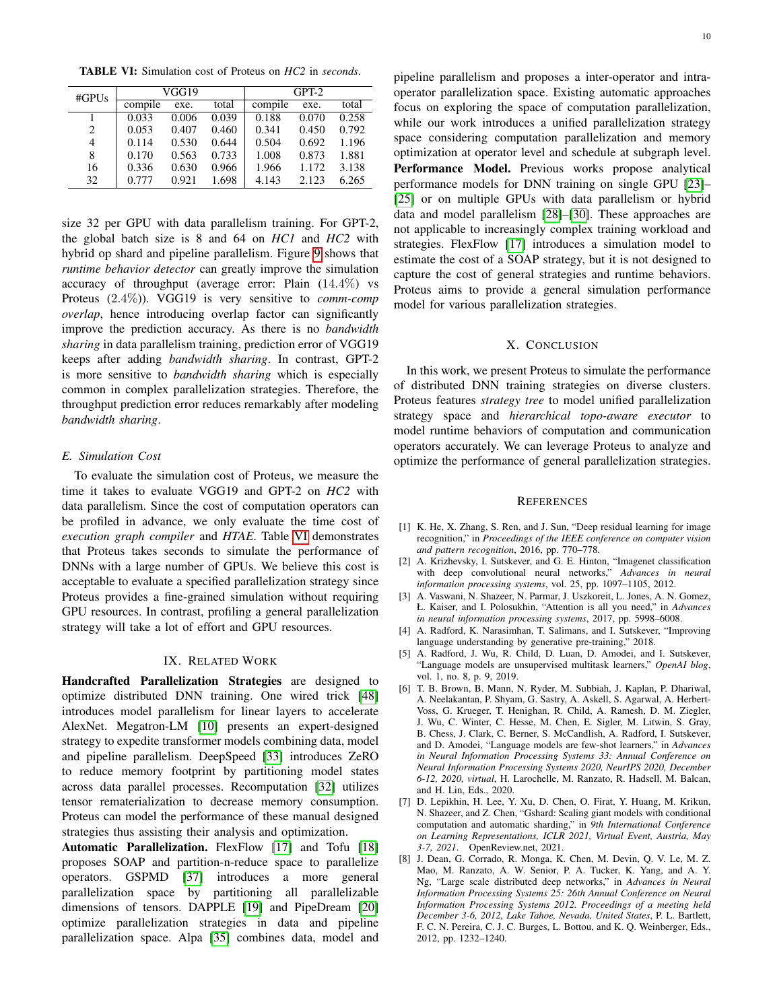

# Proteus：面向任意并行策略的分布式训练性能模拟

> 证据截图说明：正文中的 `原文截图 E###` 可跳转到文末证据卡片。截图按 PDF 物理页码生成；原有章节、图表、算法和段落定位保持不变。

## 1. 论文身份与页码约定

- 正式题名：*Proteus: Simulating the Performance of Distributed DNN Training*。
- 作者：Jiangfei Duan 等；开放稿为 [arXiv:2306.02267](https://arxiv.org/abs/2306.02267)。后发表于 IEEE TPDS 35(10), 1867–1878, 2024，DOI `10.1109/TPDS.2024.3443255`。
- 本文页码对应 arXiv v1 PDF p.1–12；TPDS 最终版虽然印刷范围为 1867–1878，但未假设其版式与 arXiv 完全同页。

## 2. 一句话结论

**原文事实**：Proteus 用层次化 Strategy Tree 表达算子切分/映射、流水和重计算，将其编译成 distributed execution graph，再用 Hierarchical Training Architecture Emulator（HTAE）模拟调度、算子、通信重叠、带宽共享和峰值内存；180 个结果平均误差 3.0%。（PDF p.1，Abstract；p.3–10，§IV–VIII） 〔[原文截图 E001](#evidence-e001)〕

**归纳**：它的核心价值不是重放实测 trace，而是把“任意声明式并行策略”编译成可执行性能图。策略和运行时行为表达明显强于 FlexFlow，但网络/CCL、overlap 与算子成本高度经验化，验证规模止于 32 GPU。

## 3. 问题与模型边界

**原文事实**：作者要预测同时包含 operator-level tensor partition、memory optimization、subgraph-level pipeline 和 recomputation 的复杂策略，认为只求和单算子成本会遗漏带宽共享、compute-communication overlap、调度和内存行为。（PDF p.2，§II；p.5–7，§VI） 〔[原文截图 E002](#evidence-e002)〕

**原文事实**：Proteus 接收用户给定的模型与并行策略，并不负责自动策略搜索；论文实验中的策略来自常用配置和专家最优配置。（PDF p.3，§III；p.8，§VIII-B 第1–2段） 〔[原文截图 E003](#evidence-e003)〕

**归纳**：这是一套 strategy-to-performance simulator，不是 training trace recorder；其输入本身已经包含大量目标侧意图。

## 4. 方法与框架

### 4.1 Strategy Tree：组合算子级与子图级策略

**原文事实**：Strategy Tree 的叶子是前向/反向 tensor 和 operator，内部节点是 subgraph。每个节点可带 computation/memory 配置；operator 可沿任意 tensor 维切分并映射 device，subgraph 还能带 schedule 配置，包括 `n_micro_batch`、`max_ongoing_micro_batch` 和 recomputation。（PDF p.3–4，§IV，Fig. 3） 〔[原文截图 E004](#evidence-e004)〕

**原文事实**：这种层次表示可把不同策略限定在不同子图，统一 data/model/pipeline parallelism、ZeRO 类内存优化和 recomputation。（PDF p.4，§IV-B–D） 〔[原文截图 E005](#evidence-e005)〕

**设计推断**：Strategy Tree 很像录制回放中的高层 Execution Recipe，但它由用户/搜索器声明，而不是由一次真实执行自动恢复；若用于回放，要额外证明 tree 与源执行决策一致。

### 4.2 编译为 Distributed Execution Graph

**原文事实**：编译器创建 DeviceGroup，按 tree 配置切分 tensor/operator，插入通信节点和控制依赖。对于已识别的策略转换，使用 collective pattern；无法模式化时回退到 P2P 通信。（PDF p.5，§V，Fig. 4） 〔[原文截图 E006](#evidence-e006)〕

**归纳**：这一步完成“逻辑策略 → rank/device 上的计算通信图”lowering，是 Physical Binding 的雏形；但没有绑定真实 kernel、layout/tiling、CCL channel 或算法实例。

### 4.3 HTAE：两级调度器、执行器和运行时行为

**原文事实**：HTAE 在每个 device 上抽象 computation、feature communication、gradient communication 三类队列/stream，使 compute 与 communication 以及两类通信按规则并发。（PDF p.5–6，§VI-A–B，Fig. 5–6） 〔[原文截图 E007](#evidence-e007)〕

**原文事实**：上层 scheduler 在 forward/backward subgraph 之间交错，先按当前状态（forward/backward）从 dependency-free subgraphs 选一个，并倾向 forward 以提高流水并控制峰值内存；下层 executor 逐算子排队执行。（PDF p.6，§VI-B “Scheduler”与“Executor”） 〔[原文截图 E008](#evidence-e008)〕

**原文事实**：执行器对 tensor 维护引用计数，分配新 tensor、引用归零后释放，并以此跟踪峰值内存和判定 OOM。（PDF p.6，§VI-B “Memory Consumption”） 〔[原文截图 E009](#evidence-e009)〕

### 4.4 带宽共享、拓扑和 overlap

**原文事实**：Proteus 对共享物理链路的通信假设公平带宽分配，并检查 NIC/socket/PHB/PIX/NVL 等层次连接来计算冲突。（PDF p.7，§VI-C，Fig. 7） 〔[原文截图 E010](#evidence-e010)〕

**原文事实**：compute-communication overlap 用固定因子 `γ` 修正；该因子通过在目标机器/模型上比较有、无重叠的 backward 时间进行 profiling。（PDF p.7，§VI-C “Comp-comm overlap”） 〔[原文截图 E011](#evidence-e011)〕

**边界**：`γ` 不是由每个 kernel、stream、DMA engine 或链路事件自然产生的结果，换模型、shape、编译器或硬件时需要重新校准；公平共享也不能表达 NCCL/HCCL chunk、协议、队头阻塞和拥塞控制。

### 4.5 算子与通信成本

**原文事实**：系统约 9K 行 Python。算子 profiler 在目标硬件上测量；通信以 alpha-beta 模型为基础，并加入 NCCL topology/channel 影响和 collective correction factor。（PDF p.7–8，§VII） 〔[原文截图 E012](#evidence-e012)〕

**归纳**：Proteus 的端到端精度来自“目标硬件 profiling + 经验 runtime 修正”，不是可迁移的解析 kernel 模型，也不是网络包级模拟。

## 5. 实验、精度、规模与复现口径

**原文事实**：评估包含 ResNet50、InceptionV3、VGG19、GPT-2、GPT-1.5B、DLRM；平台分别为 1×8 TitanXp PCIe、4×8 V100 NVLink+100 Gbps、2×8 A100 NVLink+200 Gbps。软件为 PyTorch 1.8、CUDA 10.1、cuDNN 7.6.5、NCCL 2.7.8。（PDF p.8，§VIII-A，Table II–III） 〔[原文截图 E013](#evidence-e013)〕

**原文事实**：180 个预测结果平均误差 3.0%，仅 2 个 OOM 判断错误，最大误差 14.7%；FlexFlow-Sim 对照平均 12.4%、最大 137.9%，且约三分之一策略不支持。（PDF p.8–9，§VIII-B，Fig. 8，Table IV） 〔[原文截图 E014](#evidence-e014)〕

**口径限制（原文事实）**：每个模型主要验证两种策略：常见策略 S1 与专家给出的最优策略 S2，而不是从庞大策略空间均匀抽样。（PDF p.8，§VIII-B 第1–2段） 〔[原文截图 E015](#evidence-e015)〕

**原文事实**：GPT-2 若干策略的排序被完整保持，平均误差 3.2%。（PDF p.9，§VIII-C，Table V） 〔[原文截图 E016](#evidence-e016)〕

**原文事实**：消融中，不模拟 runtime behavior 的 Plain 误差 14.4%，完整 Proteus 为 2.4%，说明调度、共享与 overlap 修正是主要精度来源。（PDF p.9–10，§VIII-D，Fig. 9） 〔[原文截图 E017](#evidence-e017)〕

**原文事实**：模拟到 32 GPU 时，VGG19 总模拟时间最高 1.698 秒，GPT-2 最高 6.265 秒。（PDF p.10，§VIII-E，Table VI） 〔[原文截图 E018](#evidence-e018)〕

**归纳**：结果说明在相同机器、模型和校准条件下的插值精度很好；尚不能支持跨硬件、跨 CCL 或数百/数千设备的外推结论。

## 6. What-if 与落地实现

**原文事实**：Proteus 可替换 Strategy Tree 中的切分、映射、pipeline/recompute 参数，预测吞吐、运行时间和 OOM，适合策略比较。（PDF p.3–7，§III–VI） 〔[原文截图 E019](#evidence-e019)〕

- **已实现**：论文明确称有约 9K LoC Python library，并给出完整实验结果。
- **公开性证据缺口**：本轮没有在论文、作者页或可核验搜索结果中找到对应公开仓库。不能因为“implemented”就写成“open source”。
- **复现边界**：operation profiler 数据、机器拓扑和 `γ` 校准是复现实验的必要输入；论文没有把它们定义成带版本/来源的 Observation Ledger。

## 7. 优点、缺点与适用边界

### 优点

1. Strategy Tree 同时表达算子切分、设备映射、流水、重计算和内存优化。
2. 编译成 DEG 后统一处理控制依赖与通信插入，比手写 trace 更系统。
3. 显式建模双层调度、三类队列、内存生命周期、带宽共享和 overlap。
4. 在 180 个已校准样本上有较强精度，且模拟速度为秒级。

### 缺点/边界

1. 需要目标 GPU profiling；没有新硬件/新编译栈外推方法。
2. 通信为 alpha-beta+修正，带宽公平共享；不是 packet、真实 NCCL scheduler 或网络拥塞模拟。
3. 单一 `γ` 把复杂 overlap 压成机器/模型经验量，OOD 风险高。
4. 不执行数值和动态数据路径，也没有 kernel/layout/tiling/融合绑定。
5. 论文验证上限为 32 GPU；公共代码与 artifact 未核实。

## 8. 与录制回放五层架构的关系

| 五层 | Proteus 对应物 | 判断 |
|---|---|---|
| Execution Recipe | Strategy Tree | 强于纯 trace，但属于声明式目标策略，不证明来自源执行 |
| Physical Binding | DeviceGroup、tensor/operator split、collective/P2P lowering | 中强；缺 kernel/CCL 细绑定 |
| Observation Ledger | operator profiler、通信校准、overlap `γ` | 有测量输入，缺独立 ledger 与 provenance |
| Cost Model | op profile、alpha-beta、correction、`γ` | 目标内插强，跨域外推弱 |
| Event Runtime | DEG + HTAE scheduler/executor/memory | 强；网络事件保真度有限 |

**归纳**：Proteus 证明了只拼算子耗时不够，runtime behavior 必须进入 Event Runtime；同时也说明 `γ` 这类经验项应留在 Cost Model/校准层，不能污染 Recipe。

## 9. Ascend/CANN/HCCL 启示

1. 可用 Strategy Tree 作为训练并行适配器的中间层：记录 TP/PP/DP/EP、micro-batch、recompute、ZeRO/optimizer shard，再 lower 到全局 DEG。
2. DeviceGroup lowering 必须补齐 HCCL group、collective ordinal、rank pair、split/chunk 和目标 topology；“匹配到 collective，否则 P2P”需要可审计规则。
3. operator profiler 应以 CANN/SoC/shape/dtype/layout/fusion/tiling 为复合键，并记录 warm-up、统计量、版本和置信度。
4. 不宜直接照搬全局 `γ`。Ascend 侧应从 stream/task/kernel/HCCL 事件重建资源竞争，让 overlap 尽量由 Event Runtime 产生；只能观测到宏观行为时再使用分层、带适用域的经验修正。
5. 内存引用计数是 OOM 的良好骨架，但要加入 CANN workspace、持久 buffer、allocator cache、碎片和通信 fusion buffer。
6. 首轮验证应超过论文 32 卡尺度，并专门覆盖多机 RoCE、动态 MoE 失衡和 pipeline bubble。

<!-- EVIDENCE_SCREENSHOTS:BEGIN -->

## 原文证据截图附录

正文中的 `原文截图 E###` 与本节证据卡片一一对应。卡片保留原笔记行号和原有页码/章节定位，并跳转到后面的页图；每个物理页在本篇笔记中只展示一次。截图用于快速核读，正式引用仍以原论文为准。

<strong>E001</strong> - 原笔记第 14 行 - PDF p.1

<strong>原定位：</strong> <code>**原文事实**：Proteus 用层次化 Strategy Tree 表达算子切分/映射、流水和重计算，将其编译成 distributed execution graph，再用 Hierarchical Training Architecture Emulator（HTAE）模拟调度、算子、通信重叠、带宽共享和峰值内存；180 个结果平均误差 3.0%。（PDF p.1，Abstract；p.3–10，§IV–VIII）</code>

<strong>页图：</strong> <a href="#source-page-p001">PDF p.1</a>

<strong>E002</strong> - 原笔记第 20 行 - PDF p.2

<strong>原定位：</strong> <code>**原文事实**：作者要预测同时包含 operator-level tensor partition、memory optimization、subgraph-level pipeline 和 recomputation 的复杂策略，认为只求和单算子成本会遗漏带宽共享、compute-communication overlap、调度和内存行为。（PDF p.2，§II；p.5–7，§VI）</code>

<strong>页图：</strong> <a href="#source-page-p002">PDF p.2</a>

<strong>E003</strong> - 原笔记第 22 行 - PDF p.3

<strong>原定位：</strong> <code>**原文事实**：Proteus 接收用户给定的模型与并行策略，并不负责自动策略搜索；论文实验中的策略来自常用配置和专家最优配置。（PDF p.3，§III；p.8，§VIII-B 第1–2段）</code>

<strong>页图：</strong> <a href="#source-page-p003">PDF p.3</a>

<strong>E004</strong> - 原笔记第 30 行 - PDF p.3, 4

<strong>原定位：</strong> <code>**原文事实**：Strategy Tree 的叶子是前向/反向 tensor 和 operator，内部节点是 subgraph。每个节点可带 computation/memory 配置；operator 可沿任意 tensor 维切分并映射 device，subgraph 还能带 schedule 配置，包括 `n_micro_batch`、`max_ongoing_micro_batch` 和 recomputation。（PDF p.3–4，§IV，Fig. 3）</code>

<strong>页图：</strong> <a href="#source-page-p003">PDF p.3</a> · <a href="#source-page-p004">PDF p.4</a>

<strong>E005</strong> - 原笔记第 32 行 - PDF p.4

<strong>原定位：</strong> <code>**原文事实**：这种层次表示可把不同策略限定在不同子图，统一 data/model/pipeline parallelism、ZeRO 类内存优化和 recomputation。（PDF p.4，§IV-B–D）</code>

<strong>页图：</strong> <a href="#source-page-p004">PDF p.4</a>

<strong>E006</strong> - 原笔记第 38 行 - PDF p.5

<strong>原定位：</strong> <code>**原文事实**：编译器创建 DeviceGroup，按 tree 配置切分 tensor/operator，插入通信节点和控制依赖。对于已识别的策略转换，使用 collective pattern；无法模式化时回退到 P2P 通信。（PDF p.5，§V，Fig. 4）</code>

<strong>页图：</strong> <a href="#source-page-p005">PDF p.5</a>

<strong>E007</strong> - 原笔记第 44 行 - PDF p.5, 6

<strong>原定位：</strong> <code>**原文事实**：HTAE 在每个 device 上抽象 computation、feature communication、gradient communication 三类队列/stream，使 compute 与 communication 以及两类通信按规则并发。（PDF p.5–6，§VI-A–B，Fig. 5–6）</code>

<strong>页图：</strong> <a href="#source-page-p005">PDF p.5</a> · <a href="#source-page-p006">PDF p.6</a>

<strong>E008</strong> - 原笔记第 46 行 - PDF p.6

<strong>原定位：</strong> <code>**原文事实**：上层 scheduler 在 forward/backward subgraph 之间交错，先按当前状态（forward/backward）从 dependency-free subgraphs 选一个，并倾向 forward 以提高流水并控制峰值内存；下层 executor 逐算子排队执行。（PDF p.6，§VI-B “Scheduler”与“Executor”）</code>

<strong>页图：</strong> <a href="#source-page-p006">PDF p.6</a>

<strong>E009</strong> - 原笔记第 48 行 - PDF p.6

<strong>原定位：</strong> <code>**原文事实**：执行器对 tensor 维护引用计数，分配新 tensor、引用归零后释放，并以此跟踪峰值内存和判定 OOM。（PDF p.6，§VI-B “Memory Consumption”）</code>

<strong>页图：</strong> <a href="#source-page-p006">PDF p.6</a>

<strong>E010</strong> - 原笔记第 52 行 - PDF p.7

<strong>原定位：</strong> <code>**原文事实**：Proteus 对共享物理链路的通信假设公平带宽分配，并检查 NIC/socket/PHB/PIX/NVL 等层次连接来计算冲突。（PDF p.7，§VI-C，Fig. 7）</code>

<strong>页图：</strong> <a href="#source-page-p007">PDF p.7</a>

<strong>E011</strong> - 原笔记第 54 行 - PDF p.7

<strong>原定位：</strong> <code>**原文事实**：compute-communication overlap 用固定因子 `γ` 修正；该因子通过在目标机器/模型上比较有、无重叠的 backward 时间进行 profiling。（PDF p.7，§VI-C “Comp-comm overlap”）</code>

<strong>页图：</strong> <a href="#source-page-p007">PDF p.7</a>

<strong>E012</strong> - 原笔记第 60 行 - PDF p.7, 8

<strong>原定位：</strong> <code>**原文事实**：系统约 9K 行 Python。算子 profiler 在目标硬件上测量；通信以 alpha-beta 模型为基础，并加入 NCCL topology/channel 影响和 collective correction factor。（PDF p.7–8，§VII）</code>

<strong>页图：</strong> <a href="#source-page-p007">PDF p.7</a> · <a href="#source-page-p008">PDF p.8</a>

<strong>E013</strong> - 原笔记第 66 行 - PDF p.8

<strong>原定位：</strong> <code>**原文事实**：评估包含 ResNet50、InceptionV3、VGG19、GPT-2、GPT-1.5B、DLRM；平台分别为 1×8 TitanXp PCIe、4×8 V100 NVLink+100 Gbps、2×8 A100 NVLink+200 Gbps。软件为 PyTorch 1.8、CUDA 10.1、cuDNN 7.6.5、NCCL 2.7.8。（PDF p.8，§VIII-A，Table II–III）</code>

<strong>页图：</strong> <a href="#source-page-p008">PDF p.8</a>

<strong>E014</strong> - 原笔记第 68 行 - PDF p.8, 9

<strong>原定位：</strong> <code>**原文事实**：180 个预测结果平均误差 3.0%，仅 2 个 OOM 判断错误，最大误差 14.7%；FlexFlow-Sim 对照平均 12.4%、最大 137.9%，且约三分之一策略不支持。（PDF p.8–9，§VIII-B，Fig. 8，Table IV）</code>

<strong>页图：</strong> <a href="#source-page-p008">PDF p.8</a> · <a href="#source-page-p009">PDF p.9</a>

<strong>E015</strong> - 原笔记第 70 行 - PDF p.8

<strong>原定位：</strong> <code>**口径限制（原文事实）**：每个模型主要验证两种策略：常见策略 S1 与专家给出的最优策略 S2，而不是从庞大策略空间均匀抽样。（PDF p.8，§VIII-B 第1–2段）</code>

<strong>页图：</strong> <a href="#source-page-p008">PDF p.8</a>

<strong>E016</strong> - 原笔记第 72 行 - PDF p.9

<strong>原定位：</strong> <code>**原文事实**：GPT-2 若干策略的排序被完整保持，平均误差 3.2%。（PDF p.9，§VIII-C，Table V）</code>

<strong>页图：</strong> <a href="#source-page-p009">PDF p.9</a>

<strong>E017</strong> - 原笔记第 74 行 - PDF p.9, 10

<strong>原定位：</strong> <code>**原文事实**：消融中，不模拟 runtime behavior 的 Plain 误差 14.4%，完整 Proteus 为 2.4%，说明调度、共享与 overlap 修正是主要精度来源。（PDF p.9–10，§VIII-D，Fig. 9）</code>

<strong>页图：</strong> <a href="#source-page-p009">PDF p.9</a> · <a href="#source-page-p010">PDF p.10</a>

<strong>E018</strong> - 原笔记第 76 行 - PDF p.10

<strong>原定位：</strong> <code>**原文事实**：模拟到 32 GPU 时，VGG19 总模拟时间最高 1.698 秒，GPT-2 最高 6.265 秒。（PDF p.10，§VIII-E，Table VI）</code>

<strong>页图：</strong> <a href="#source-page-p010">PDF p.10</a>

<strong>E019</strong> - 原笔记第 82 行 - PDF p.3, 4, 5, 6, 7

<strong>原定位：</strong> <code>**原文事实**：Proteus 可替换 Strategy Tree 中的切分、映射、pipeline/recompute 参数，预测吞吐、运行时间和 OOM，适合策略比较。（PDF p.3–7，§III–VI）</code>

<strong>页图：</strong> <a href="#source-page-p003">PDF p.3</a> · <a href="#source-page-p004">PDF p.4</a> · <a href="#source-page-p005">PDF p.5</a> · <a href="#source-page-p006">PDF p.6</a> · <a href="#source-page-p007">PDF p.7</a>

## 原文页面图库（按页去重）

同一页可能支撑多个证据点；下面按物理页集中展示，每个截图文件只嵌入一次。

<strong>PDF p.1</strong> - 被 E001 引用

<strong>PDF p.2</strong> - 被 E002 引用

<strong>PDF p.3</strong> - 被 E003、E004、E019 引用

<strong>PDF p.4</strong> - 被 E004、E005、E019 引用

<strong>PDF p.5</strong> - 被 E006、E007、E019 引用

<strong>PDF p.6</strong> - 被 E007、E008、E009、E019 引用

<strong>PDF p.7</strong> - 被 E010、E011、E012、E019 引用

<strong>PDF p.8</strong> - 被 E012、E013、E014、E015 引用

<strong>PDF p.9</strong> - 被 E014、E016、E017 引用

<strong>PDF p.10</strong> - 被 E017、E018 引用

<!-- EVIDENCE_SCREENSHOTS:END -->
