# FlexFlow：以快速任务图模拟驱动 SOAP 并行策略搜索

> 证据截图说明：正文中的 `原文截图 E###` 可跳转到文末证据卡片。截图按 PDF 物理页码生成；原有章节、图表、算法和段落定位保持不变。

## 1. 论文身份与页码约定

- 正式题名：*Beyond Data and Model Parallelism for Deep Neural Networks*，系统名 FlexFlow。
- 作者：Zhihao Jia 等；SysML 2019；开放稿 [arXiv:1807.05358](https://arxiv.org/abs/1807.05358)，当前项目见 [FlexFlow](https://flexflow.ai/) 与 [GitHub](https://github.com/flexflow/FlexFlow)。
- 本文引用 arXiv PDF p.1–15；不要把当前 FlexFlow 项目新增能力倒推成 2019 论文能力。

## 2. 一句话结论

**原文事实**：FlexFlow 定义 Sample、Operation、Attribute、Parameter 四维 SOAP 策略空间，用 MCMC 搜索；每个候选策略被编译为计算/通信 task graph，以实测算子时间和 `size/bandwidth` 通信成本做快速离散事件模拟，最终由 Legion runtime 执行。（PDF p.1–8，Abstract、§3–7） 〔[原文截图 E001](#evidence-e001)〕

**归纳**：这篇工作的主角是自动并行策略搜索，模拟器是排序候选的内部工具。它不是通用 trace replay，也不是全栈网络/CCL 仿真；假设稠密算子、输入内容不影响时间、通信满带宽且 FIFO，在今天的大规模 MoE/HCCL 场景过于粗糙。

## 3. 问题与 SOAP 搜索空间

**原文事实**：作者希望超越仅 data/model parallel 的固定策略，在四个维度切分算子：Sample 维切 batch，Operation 维切计算域，Attribute 维切输入/输出维度，Parameter 维切权重。（PDF p.1–5，§1、§3–4，Fig. 1、3、4） 〔[原文截图 E002](#evidence-e002)〕

**原文事实**：系统架构包括 optimizer、simulator 与 distributed runtime：optimizer 在策略空间中提出候选，simulator 估时，最终策略交给 Legion runtime。（PDF p.4，§3.2，Fig. 2） 〔[原文截图 E003](#evidence-e003)〕

**原文事实/边界**：论文明确假定执行时间可预测且与输入内容无关，并说明当前支持 dense matrices；数据依赖的稀疏结构不在目标内。（PDF p.4，§3.3 “Assumptions and Limitations”） 〔[原文截图 E004](#evidence-e004)〕

## 4. 模拟器设计

### 4.1 四个关键假设

**原文事实**：§5 给出：A1，task 执行时间方差低且不依赖数据；A2，传输时间由数据量/带宽估计且能充分利用带宽；A3，同设备 task FIFO；A4，runtime overhead 可忽略。（PDF p.5，§5 第1–4段） 〔[原文截图 E005](#evidence-e005)〕

**归纳**：这些假设使模拟器极快，却排除了 kernel 并发、collective 协议/延迟、拥塞、多流仲裁、动态 MoE、runtime launch 和调度开销。

### 4.2 从策略到 task graph

**原文事实**：每个 partitioned operator 生成 normal task；共享 tensor 跨设备时插入 communication task，并为设备间 link 建 communication device。边只表示依赖。（PDF p.5–6，§5.1，Fig. 5，Table 2） 〔[原文截图 E006](#evidence-e006)〕

**原文事实**：normal task 的 `exeTime` 在目标 device 上多次运行并取平均，按 operation type 与 output size 缓存；communication task 为 tensor size `s` 除以带宽 `b`。（PDF p.6，§5.1，Table 2 后第2–3段） 〔[原文截图 E007](#evidence-e007)〕

**原文事实**：不同设备上的计算和 communication device 可并行，因此 compute/communication overlap 由图和资源可用时间自然出现；同一设备按 FIFO 排队。（PDF p.5–6，§5–5.1） 〔[原文截图 E008](#evidence-e008)〕

### 4.3 Full simulation 与 delta simulation

**原文事实**：Algorithm 1 以 readyTime 排序的全局队列推进 task，`startTime=max(readyTime, device.last.endTime)`，完成后更新 successor；算法近似 Dijkstra 式遍历。（PDF p.6–7，§5.2，Algorithm 1） 〔[原文截图 E009](#evidence-e009)〕

**原文事实**：MCMC 一次只改变一个 operator 配置，Algorithm 2 只更新受影响 task 与 device timeline；作者称 delta simulation 与 full simulation 结果相同。（PDF p.7，§5.3，Algorithm 2） 〔[原文截图 E010](#evidence-e010)〕

**边界**：这里没有链路竞争或 collective scheduler；一个 link 被抽象为单个 FIFO resource，`s/b` 也没有启动延迟。

## 5. 搜索与真实执行

**原文事实**：optimizer 用 MCMC；每步随机选 operator/config，根据式 (1)–(2) 的接受概率在局部与全局探索间平衡。（PDF p.7–8，§6.1–6.2，Equation 1–2） 〔[原文截图 E011](#evidence-e011)〕

**原文事实**：实际执行由 Legion 完成，算子调用 cuDNN/cuBLAS，以 operation 为调度粒度。（PDF p.8，§7） 〔[原文截图 E012](#evidence-e012)〕

**归纳**：模拟器输出不是端到端回放时间线的最终产品，而是搜索器的相对排序 oracle；真实 runtime 又是另一套执行系统。

## 6. 实验、精度与定量结果

**原文事实**：评估包含 6 个 CNN/RNN 模型；平台一为 4 节点×4 P100，节点内 NVLink、节点间 100 GB/s EDR；平台二为 16 节点×4 K80，节点内 PCIe、节点间 56 GB/s EDR。（PDF p.8–9，§8.1，Table 3，Fig. 6。这里沿用论文单位，不替其校正为 Gbps。） 〔[原文截图 E013](#evidence-e013)〕

**原文事实**：相对 data/expert 策略，FlexFlow 的训练吞吐提升最高约 1.3–3.3×；NMT 在 64 K80 上每轮快 1.7–2.4×，data transfer 降低 2–5.5×，计算时间约低 20%。（PDF p.9–10，§8.2，Fig. 7–8） 〔[原文截图 E014](#evidence-e014)〕

**原文事实**：Inception 端到端训练比 TensorFlow 快 38%。（PDF p.10，§8.2，Fig. 9） 〔[原文截图 E015](#evidence-e015)〕

**原文事实**：相比 REINFORCE，FlexFlow 结果快 3.4–3.8×，搜索耗时 14–40 秒而对照需 12–27 小时；相比 OptCNN 快 1.2–1.6×。（PDF p.10–11，§8.2，Fig. 10） 〔[原文截图 E016](#evidence-e016)〕

**原文事实**：模拟与真实执行的相对差异均小于 30%，且候选策略排序保持；delta simulation 相对 full simulation 加速 2.2–6.9×。（PDF p.11，§8.3.1–8.3.2，Fig. 11，Table 4） 〔[原文截图 E017](#evidence-e017)〕

**归纳**：小于 30% 对“搜索排序”足够，却明显弱于 SimAI/Proteus 报告的端到端误差；它不能作为高保真复现源训练时间线的直接证据。

## 7. 实现、开源、落地与复现

- **原文事实**：论文实现了 simulator、MCMC optimizer 和 Legion-based distributed runtime，并在真实 P100/K80 集群执行选中策略。
- **当前事实**：FlexFlow 项目与 GitHub 公开可访问，且多年后已扩展很多功能。
- **证据边界**：论文没有为本文所读版本提供完整环境封存、profile 表或仓库 commit；当前仓库可用不等于 2019 结果可一键复现。
- **成熟度判断（归纳）**：是落地执行的并行系统，而论文内模拟器更像策略优化组件，不是面向任意 trace 的独立产品。

## 8. 优点、缺点与边界

### 优点

1. SOAP 把并行策略从少数模板拓展到逐算子多维切分。
2. strategy→task graph→runtime 路径完整，选中策略可真实执行。
3. delta simulation 将局部搜索的重复计算显著压缩。
4. 即使绝对误差不低，策略排序在评估中保持，符合其搜索用途。

### 缺点/边界

1. 只支持稠密、数据无关的成本假设，无法覆盖动态 MoE/稀疏路由。
2. 网络只有 `size/bandwidth`、FIFO 和满带宽；没有 collective、拓扑路径、链路竞争或 NIC/CCL。
3. 没有显式内存/OOM、pipeline/EP、kernel/layout/tiling 和编译器融合模型。
4. 算子时间依赖目标实机测量，不能预测全新硬件。
5. 评估设备和软件栈较早，最大 64 GPU；绝对误差允许到 30%。

## 9. 与录制回放五层架构的关系

| 五层 | FlexFlow 对应物 | 判断 |
|---|---|---|
| Execution Recipe | operator graph + SOAP config | 部分；用于候选策略，不含源运行状态/动态决策 |
| Physical Binding | task→device 与 link | 粗；无 rank group、collective/CCL、kernel binding |
| Observation Ledger | 平均 op 测量 | 极简查表，缺来源/版本/方差/时钟 ledger |
| Cost Model | op cache + `s/b` | 简单、目标机内插；无 OOD 与拥塞 |
| Event Runtime | FIFO task graph simulator | 中等；可生成 overlap，但资源模型太粗 |

**归纳**：FlexFlow 可作为“候选并行 Recipe 生成器”，不应作为真实源 trace 回放器或网络仿真器。它也提供一个重要方法论：若任务是排序策略，模型可较粗；若任务是 fidelity replay，则同一误差口径不够。

## 10. Ascend/CANN/HCCL 启示

1. SOAP 可用于生成目标 Ascend 集群的候选算子切分，再交给更高保真 Cost Model/Event Runtime 过滤，而不是直接使用论文 `s/b` 模拟器给出最终结论。
2. normal task 查表键要扩展为 CANN 版本、SoC、shape/dtype/layout、融合/tiling、stream 和动态 shape 桶；保存均值之外的分布与置信度。
3. communication task 必须 lower 成 HCCL collective/P2P，并绑定 group、ordinal、算法、chunk、目标拓扑与竞争资源。
4. 真实回放不能采用“输入内容无关”作为全局假设；MoE、稀疏算子、动态序列长度应成为 Recipe 中的显式决策或分布。
5. delta simulation 思路可用于 what-if：Recipe 只改一个并行/拓扑参数时，增量重算受影响事件；但必须验证跨 rank/collective 的影响闭包。

<!-- EVIDENCE_SCREENSHOTS:BEGIN -->

## 原文证据截图附录

正文中的 `原文截图 E###` 与本节证据卡片一一对应。卡片保留原笔记行号和原有页码/章节定位，并跳转到后面的页图；每个物理页在本篇笔记中只展示一次。截图用于快速核读，正式引用仍以原论文为准。

<strong>E001</strong> - 原笔记第 14 行 - PDF p.1, 2, 3, 4, 5, 6, 7, 8

<strong>原定位：</strong> <code>**原文事实**：FlexFlow 定义 Sample、Operation、Attribute、Parameter 四维 SOAP 策略空间，用 MCMC 搜索；每个候选策略被编译为计算/通信 task graph，以实测算子时间和 `size/bandwidth` 通信成本做快速离散事件模拟，最终由 Legion runtime 执行。（PDF p.1–8，Abstract、§3–7）</code>

<strong>页图：</strong> <a href="#source-page-p001">PDF p.1</a> · <a href="#source-page-p002">PDF p.2</a> · <a href="#source-page-p003">PDF p.3</a> · <a href="#source-page-p004">PDF p.4</a> · <a href="#source-page-p005">PDF p.5</a> · <a href="#source-page-p006">PDF p.6</a> · <a href="#source-page-p007">PDF p.7</a> · <a href="#source-page-p008">PDF p.8</a>

<strong>E002</strong> - 原笔记第 20 行 - PDF p.1, 2, 3, 4, 5

<strong>原定位：</strong> <code>**原文事实**：作者希望超越仅 data/model parallel 的固定策略，在四个维度切分算子：Sample 维切 batch，Operation 维切计算域，Attribute 维切输入/输出维度，Parameter 维切权重。（PDF p.1–5，§1、§3–4，Fig. 1、3、4）</code>

<strong>页图：</strong> <a href="#source-page-p001">PDF p.1</a> · <a href="#source-page-p002">PDF p.2</a> · <a href="#source-page-p003">PDF p.3</a> · <a href="#source-page-p004">PDF p.4</a> · <a href="#source-page-p005">PDF p.5</a>

<strong>E003</strong> - 原笔记第 22 行 - PDF p.4

<strong>原定位：</strong> <code>**原文事实**：系统架构包括 optimizer、simulator 与 distributed runtime：optimizer 在策略空间中提出候选，simulator 估时，最终策略交给 Legion runtime。（PDF p.4，§3.2，Fig. 2）</code>

<strong>页图：</strong> <a href="#source-page-p004">PDF p.4</a>

<strong>E004</strong> - 原笔记第 24 行 - PDF p.4

<strong>原定位：</strong> <code>**原文事实/边界**：论文明确假定执行时间可预测且与输入内容无关，并说明当前支持 dense matrices；数据依赖的稀疏结构不在目标内。（PDF p.4，§3.3 “Assumptions and Limitations”）</code>

<strong>页图：</strong> <a href="#source-page-p004">PDF p.4</a>

<strong>E005</strong> - 原笔记第 30 行 - PDF p.5

<strong>原定位：</strong> <code>**原文事实**：§5 给出：A1，task 执行时间方差低且不依赖数据；A2，传输时间由数据量/带宽估计且能充分利用带宽；A3，同设备 task FIFO；A4，runtime overhead 可忽略。（PDF p.5，§5 第1–4段）</code>

<strong>页图：</strong> <a href="#source-page-p005">PDF p.5</a>

<strong>E006</strong> - 原笔记第 36 行 - PDF p.5, 6

<strong>原定位：</strong> <code>**原文事实**：每个 partitioned operator 生成 normal task；共享 tensor 跨设备时插入 communication task，并为设备间 link 建 communication device。边只表示依赖。（PDF p.5–6，§5.1，Fig. 5，Table 2）</code>

<strong>页图：</strong> <a href="#source-page-p005">PDF p.5</a> · <a href="#source-page-p006">PDF p.6</a>

<strong>E007</strong> - 原笔记第 38 行 - PDF p.6

<strong>原定位：</strong> <code>**原文事实**：normal task 的 `exeTime` 在目标 device 上多次运行并取平均，按 operation type 与 output size 缓存；communication task 为 tensor size `s` 除以带宽 `b`。（PDF p.6，§5.1，Table 2 后第2–3段）</code>

<strong>页图：</strong> <a href="#source-page-p006">PDF p.6</a>

<strong>E008</strong> - 原笔记第 40 行 - PDF p.5, 6

<strong>原定位：</strong> <code>**原文事实**：不同设备上的计算和 communication device 可并行，因此 compute/communication overlap 由图和资源可用时间自然出现；同一设备按 FIFO 排队。（PDF p.5–6，§5–5.1）</code>

<strong>页图：</strong> <a href="#source-page-p005">PDF p.5</a> · <a href="#source-page-p006">PDF p.6</a>

<strong>E009</strong> - 原笔记第 44 行 - PDF p.6, 7

<strong>原定位：</strong> <code>**原文事实**：Algorithm 1 以 readyTime 排序的全局队列推进 task，`startTime=max(readyTime, device.last.endTime)`，完成后更新 successor；算法近似 Dijkstra 式遍历。（PDF p.6–7，§5.2，Algorithm 1）</code>

<strong>页图：</strong> <a href="#source-page-p006">PDF p.6</a> · <a href="#source-page-p007">PDF p.7</a>

<strong>E010</strong> - 原笔记第 46 行 - PDF p.7

<strong>原定位：</strong> <code>**原文事实**：MCMC 一次只改变一个 operator 配置，Algorithm 2 只更新受影响 task 与 device timeline；作者称 delta simulation 与 full simulation 结果相同。（PDF p.7，§5.3，Algorithm 2）</code>

<strong>页图：</strong> <a href="#source-page-p007">PDF p.7</a>

<strong>E011</strong> - 原笔记第 52 行 - PDF p.7, 8

<strong>原定位：</strong> <code>**原文事实**：optimizer 用 MCMC；每步随机选 operator/config，根据式 (1)–(2) 的接受概率在局部与全局探索间平衡。（PDF p.7–8，§6.1–6.2，Equation 1–2）</code>

<strong>页图：</strong> <a href="#source-page-p007">PDF p.7</a> · <a href="#source-page-p008">PDF p.8</a>

<strong>E012</strong> - 原笔记第 54 行 - PDF p.8

<strong>原定位：</strong> <code>**原文事实**：实际执行由 Legion 完成，算子调用 cuDNN/cuBLAS，以 operation 为调度粒度。（PDF p.8，§7）</code>

<strong>页图：</strong> <a href="#source-page-p008">PDF p.8</a>

<strong>E013</strong> - 原笔记第 60 行 - PDF p.8, 9

<strong>原定位：</strong> <code>**原文事实**：评估包含 6 个 CNN/RNN 模型；平台一为 4 节点×4 P100，节点内 NVLink、节点间 100 GB/s EDR；平台二为 16 节点×4 K80，节点内 PCIe、节点间 56 GB/s EDR。（PDF p.8–9，§8.1，Table 3，Fig. 6。这里沿用论文单位，不替其校正为 Gbps。）</code>

<strong>页图：</strong> <a href="#source-page-p008">PDF p.8</a> · <a href="#source-page-p009">PDF p.9</a>

<strong>E014</strong> - 原笔记第 62 行 - PDF p.9, 10

<strong>原定位：</strong> <code>**原文事实**：相对 data/expert 策略，FlexFlow 的训练吞吐提升最高约 1.3–3.3×；NMT 在 64 K80 上每轮快 1.7–2.4×，data transfer 降低 2–5.5×，计算时间约低 20%。（PDF p.9–10，§8.2，Fig. 7–8）</code>

<strong>页图：</strong> <a href="#source-page-p009">PDF p.9</a> · <a href="#source-page-p010">PDF p.10</a>

<strong>E015</strong> - 原笔记第 64 行 - PDF p.10

<strong>原定位：</strong> <code>**原文事实**：Inception 端到端训练比 TensorFlow 快 38%。（PDF p.10，§8.2，Fig. 9）</code>

<strong>页图：</strong> <a href="#source-page-p010">PDF p.10</a>

<strong>E016</strong> - 原笔记第 66 行 - PDF p.10, 11

<strong>原定位：</strong> <code>**原文事实**：相比 REINFORCE，FlexFlow 结果快 3.4–3.8×，搜索耗时 14–40 秒而对照需 12–27 小时；相比 OptCNN 快 1.2–1.6×。（PDF p.10–11，§8.2，Fig. 10）</code>

<strong>页图：</strong> <a href="#source-page-p010">PDF p.10</a> · <a href="#source-page-p011">PDF p.11</a>

<strong>E017</strong> - 原笔记第 68 行 - PDF p.11

<strong>原定位：</strong> <code>**原文事实**：模拟与真实执行的相对差异均小于 30%，且候选策略排序保持；delta simulation 相对 full simulation 加速 2.2–6.9×。（PDF p.11，§8.3.1–8.3.2，Fig. 11，Table 4）</code>

<strong>页图：</strong> <a href="#source-page-p011">PDF p.11</a>

## 原文页面图库（按页去重）

同一页可能支撑多个证据点；下面按物理页集中展示，每个截图文件只嵌入一次。

<strong>PDF p.1</strong> - 被 E001、E002 引用

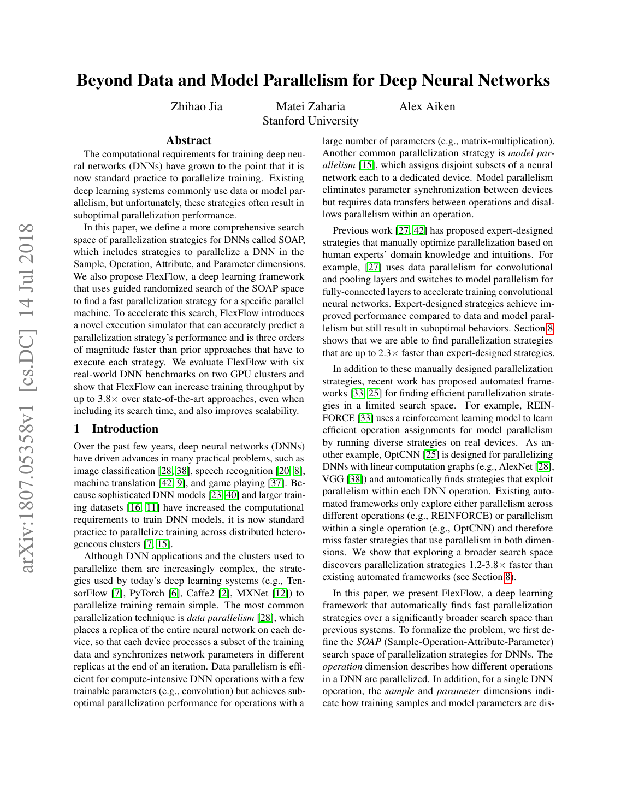

<strong>PDF p.2</strong> - 被 E001、E002 引用

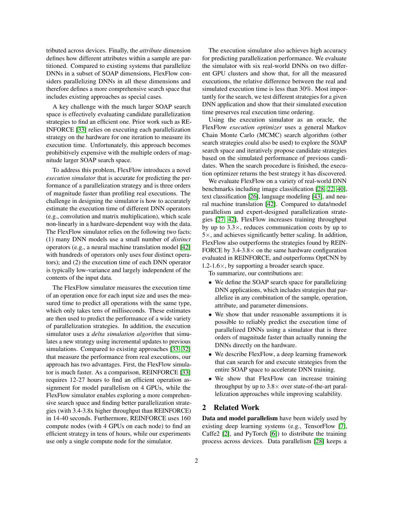

<strong>PDF p.3</strong> - 被 E001、E002 引用

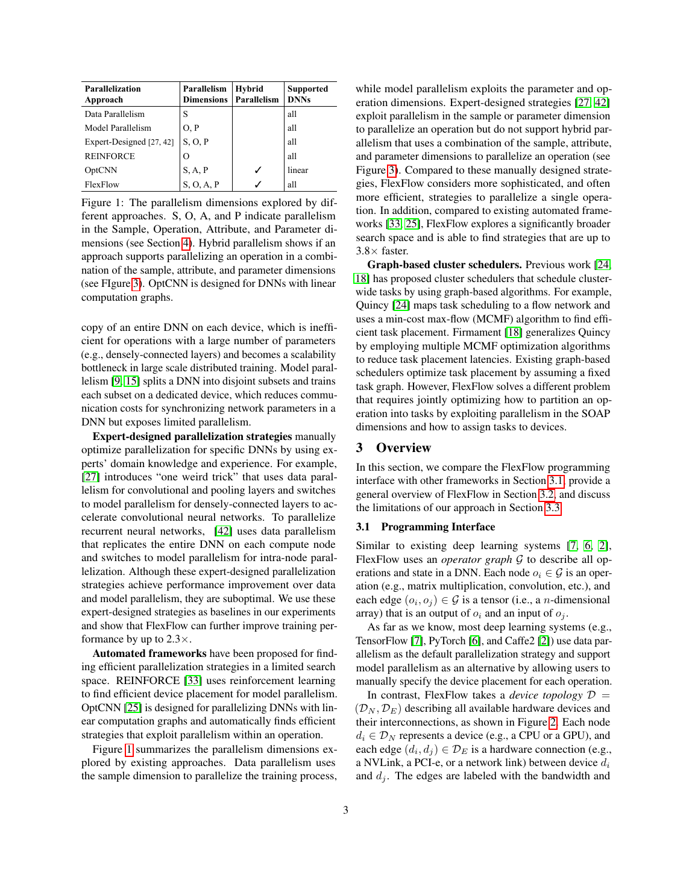

<strong>PDF p.4</strong> - 被 E001、E002、E003、E004 引用

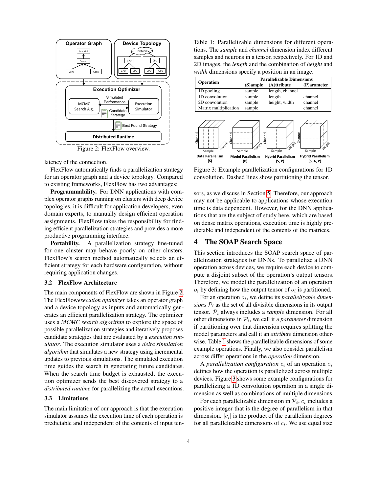

<strong>PDF p.5</strong> - 被 E001、E002、E005、E006、E008 引用

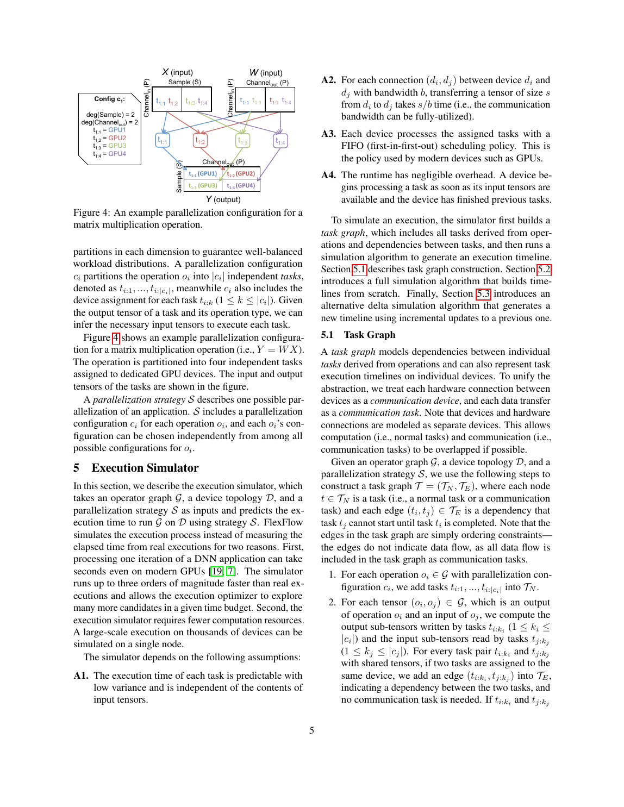

<strong>PDF p.6</strong> - 被 E001、E006、E007、E008、E009 引用

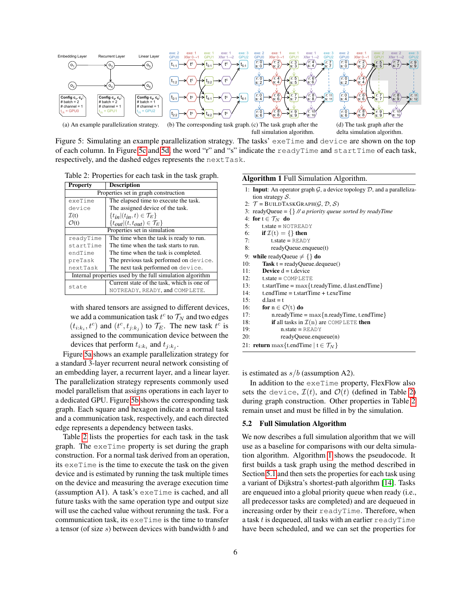

<strong>PDF p.7</strong> - 被 E001、E009、E010、E011 引用

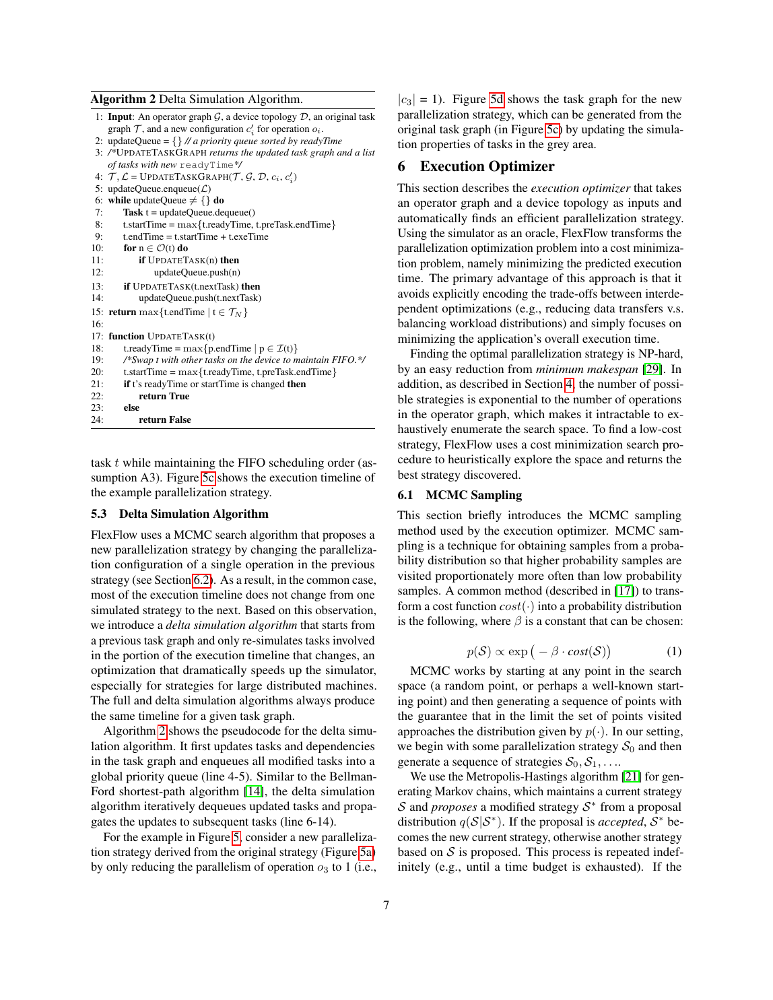

<strong>PDF p.8</strong> - 被 E001、E011、E012、E013 引用

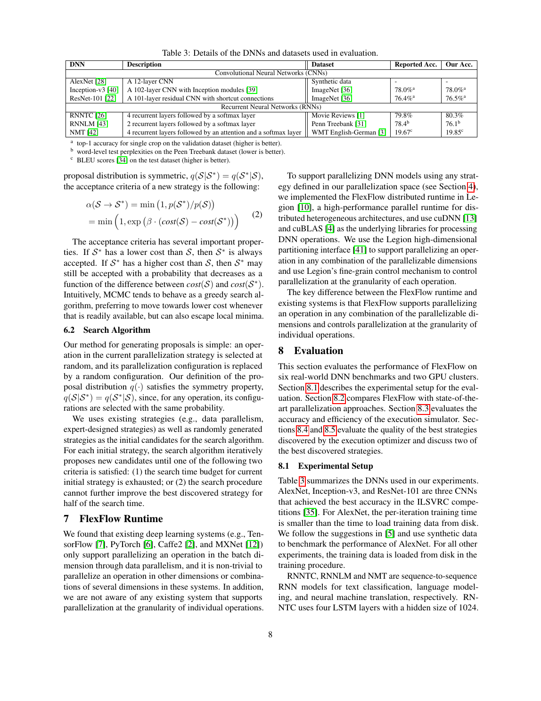

<strong>PDF p.9</strong> - 被 E013、E014 引用

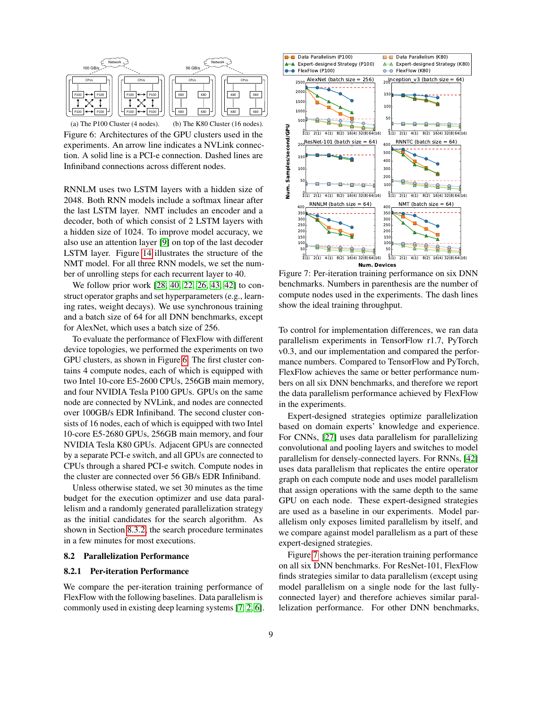

<strong>PDF p.10</strong> - 被 E014、E015、E016 引用

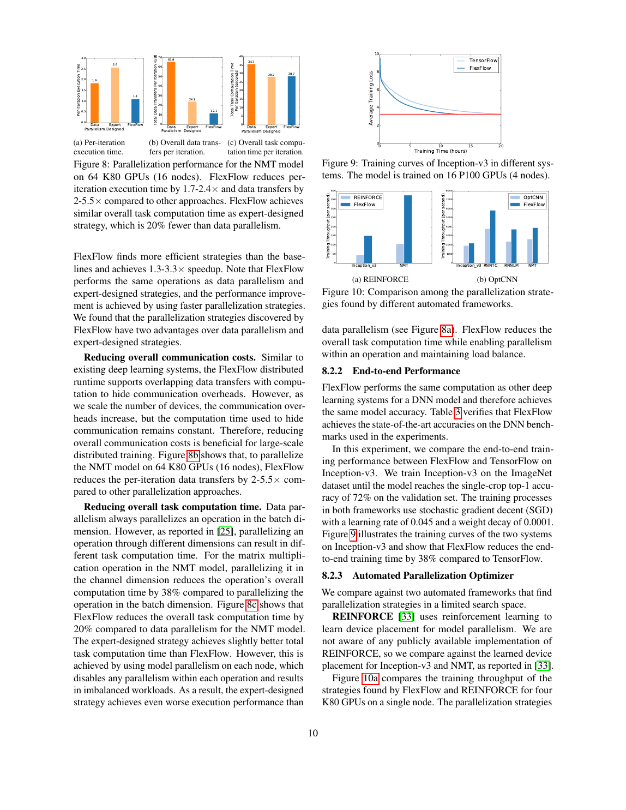

<strong>PDF p.11</strong> - 被 E016、E017 引用

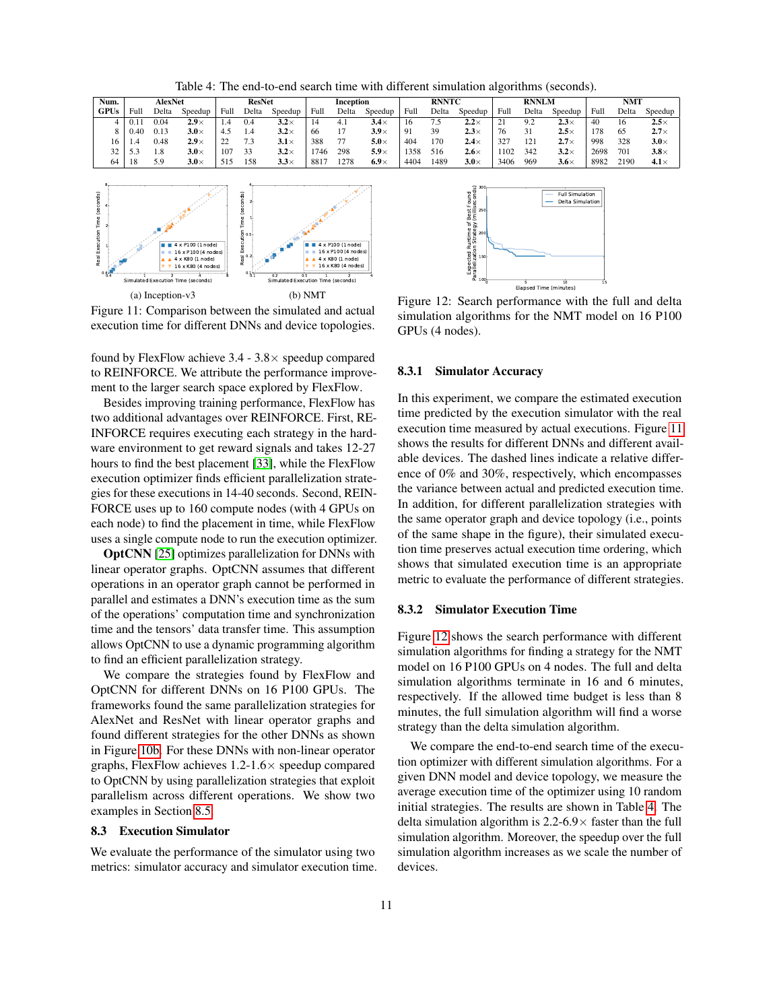

<!-- EVIDENCE_SCREENSHOTS:END -->
