# Multiverse：用 GPU 并行执行大量训练系统仿真实验

> 证据截图说明：正文中的 `原文截图 E###` 可跳转到文末证据卡片。截图按 PDF 物理页码生成；原有章节、图表、算法和段落定位保持不变。

## 1. 论文身份与页码约定

- 正式题名：*Accelerating Design Space Exploration for LLM Training Systems with Multi-experiment Parallel Simulation*，系统名 Multiverse。
- 作者：Gui 等；USENIX NSDI 2025，正式印刷页 473–488。
- 原文：[USENIX 论文页](https://www.usenix.org/conference/nsdi25/presentation/gui)、[正式 PDF](https://www.usenix.org/system/files/nsdi25-gui.pdf)、[代码仓库](https://github.com/NASP-THU/multiverse)。
- 封面为 PDF p.1；正文 PDF p.2/印刷 p.473 起，本文同时标注两者。 〔[原文截图 E001](#evidence-e001)〕

## 2. 一句话结论

**原文事实**：Multiverse 将训练系统 DES 重构为 ECS/data-oriented design，在 GPU 上以一份程序并行执行多个独立实验；计算时间由输入 workload 注记，机内 collective 用校准解析模型，机间通信用包级 DES，并加入拉式同步和 megakernel。论文报告四类 DSE 用例 57.4–73.2× 加速、单 GPU 可模拟 54K GPU 的目标集群、1024 GPU 真机端到端误差低于 3%。（PDF p.2–13/印刷 p.473–484，Abstract、§1–6）

**归纳**：它的核心创新是“同一 GPU 上高吞吐跑很多仿真实验”，不是更完整地恢复训练语义。它适合横向 what-if sweep，不会自动解决单个实验的 Recipe、kernel 成本或 HCCL 保真度。

## 3. 问题定义：多实验并行，而非单次仿真加速

**原文事实**：论文区分 single-program/single-experiment、multi-program/single-experiment、single-program/multi-experiment、multi-program/multi-experiment（SPSE/MPSE/SPME/MPME），主张用 SPME 在 GPU 上共享程序并同时执行大量独立配置。（PDF p.2–5/印刷 p.473–476，§1–2，Fig. 1、3） 〔[原文截图 E002](#evidence-e002)〕

**原文事实**：不同目标实验相互独立；一张/多张 GPU 被划分来运行不同实验，而不是用多 GPU 并行加速同一个仿真实验。（PDF p.10–12/印刷 p.481–483，§5–6） 〔[原文截图 E003](#evidence-e003)〕

## 4. 系统架构与输入

### 4.1 Workload 和总体组件

**原文事实**：用户提供类似 ASTRA-sim/Chakra 的逐 GPU workload，包含计算节点（如 Embedding、Attention、MLP）与 collective；论文假定 computation nodes 已由 Chakra 注记计算时间。Fig. 4 的 system simulator 调度 workload，并连接机内解析通信、机间网络 DES、GPU memory simulator 与 ECS GPU runtime。（PDF p.6/印刷 p.477，§3.1，Fig. 4） 〔[原文截图 E004](#evidence-e004)〕

**原文事实**：论文称输入可表达 TP/PP/DP 等典型并行策略。机间 collective 通过 collective communication algorithm/NCCL 分解成 P2P，作者劫持 NCCL API 测量每条 flow 的起止开销并校准。（PDF p.6/印刷 p.477，§3.1 “System Simulator”） 〔[原文截图 E005](#evidence-e005)〕

**归纳**：Multiverse 不生成计算成本，也不从 Python 框架恢复 workload；它消费外部 Recipe/成本。因此“全栈”覆盖比 SimAI 更窄。

### 4.2 ECS/DOD 仿真引擎

**原文事实**：Task entity 保存 type、load、predecessor/successor；Flow entity 表示网络包/流。Schedule、Analytical、Send、NIC、Forward 等 system 以 component column 形式批量处理不同实验中的同类实体。（PDF p.7–8/印刷 p.478–479，§3.2–3.3，Fig. 5–6） 〔[原文截图 E006](#evidence-e006)〕

**原文事实**：引擎以固定 simulation step 推进；ECS 图编译后由 GPU megakernel 在每个 step 执行，相同 system 可跨实验使用所有 GPU cores。（PDF p.6–8/印刷 p.477–479，§3.1 “GPU Runtime”、§3.3） 〔[原文截图 E007](#evidence-e007)〕

### 4.3 分层通信与 overlap

**原文事实**：机内 collective 使用按 operator、GPU 类型和 GPU 数校准的 `y = α + comm_size / β`（版面写作同义线性形式）；与实测相比误差约 0.7%–1%，而 ASTRA-sim 对照在不同消息段误差 20%–72%。（PDF p.8–9/印刷 p.479–480，§4.1，Fig. 7） 〔[原文截图 E008](#evidence-e008)〕

**原文事实**：输入 computation duration 是 no-overlap 时间；当它与 collective 重叠时，Multiverse 根据 profiling 得到的 overlap ratio/extension model 修正，参数按 model、operation、GPU 等校准。（PDF p.9/印刷 p.480，§4.1 “Computation-communication overlap”） 〔[原文截图 E009](#evidence-e009)〕

**原文事实**：机间 collective 进入 packet-level DES，模拟 packet event、链路正确性与丢包；flow 完成后通知 system simulator。（PDF p.6/印刷 p.477，§3.1 “Inter-server Network Simulator”） 〔[原文截图 E010](#evidence-e010)〕

**边界**：机内为经验解析模型，机间才是 packet DES；不能笼统写成“端到端包级网络”。overlap 也含经验校准，并非完全由资源事件自然涌现。

### 4.4 内存、同步和 megakernel

**原文事实**：模拟前按 parallel group size 等检查 GPU memory，超限返回 OOM。（PDF p.6/印刷 p.477，§3.1 “GPU Memory Simulator”） 〔[原文截图 E011](#evidence-e011)〕

**原文事实**：为避免 GPU 上 push event 的高频写冲突，系统使用 pull-based synchronization；又把 ECS systems 与管理代码融合为统一 megakernel。（PDF p.9–10/印刷 p.480–481，§4.2–4.3，Fig. 8–9） 〔[原文截图 E012](#evidence-e012)〕

## 5. 实现与当前功能边界

**原文事实**：实现基于 Madrona，约 13K 行 C++；支持 DCQCN、HPCC、DCTCP 及 ECMP/packet spray。lookahead 取最小链路时延。（PDF p.10/印刷 p.481，§5） 〔[原文截图 E013](#evidence-e013)〕

**原文事实/内部口径差异**：§3.1 称 workload 支持 TP、PP、DP，Table 1 的 DSE 也写 TP/DP/PP group size；但 §5 的实现段明确列出 TP/DP，以及 ring AllReduce/AllGather/ReduceScatter，没有同样明确写出 PP 和其他 collective。本文据此把 PP 视为 workload/DSE 可表达、实现细节仍需代码核验，而不是默认完整支持。（PDF p.6、10–11/印刷 p.477、481–482，§3.1、§5、Table 1） 〔[原文截图 E014](#evidence-e014)〕

**原文事实**：论文明确给出开源仓库；当前仓库公开可访问。本轮没有构建或复跑 54K 目标规模。

## 6. 实验、精度、规模和 what-if

**原文事实**：运行仿真的 host 是 H100 GPU+80 核 CPU；真实校准集群有 128 servers×8 H100、每机 8×ConnectX-7（2×200 Gbps）、900 GB/s NVLink，验证 128/1024 GPU。（PDF p.10–11/印刷 p.481–482，§6.1） 〔[原文截图 E015](#evidence-e015)〕

**原文事实**：Table 1 包含 10K 个 128-GPU topology 实验、500 个 1024-GPU CCA 实验、100 个 8192-GPU TP/DP/PP 配置和 4 个 54K-GPU congestion-control 实验；四类用例加速 57.4–73.2×，大规模案例为 43.1×。（PDF p.10–12/印刷 p.481–483，§6.1，Table 1、Fig. 10–13） 〔[原文截图 E016](#evidence-e016)〕

**原文事实**：单张 H100 可承载目标系统 54K GPU、4.5K switch、162K link 的模拟。（PDF p.11–12/印刷 p.482–483，§6.1） 〔[原文截图 E017](#evidence-e017)〕

**原文事实/论文内部不一致**：Abstract 写“1024 GPU 时并发 52 个实验、8192 GPU 时 13 个”；§6.1 正文则写 128/1024/8192 GPU 时分别并发 520/70/5 个。两处数字无法由正文直接调和，故并列保留，不挑一个当真值。（PDF p.2/印刷 p.473，Abstract；PDF p.12/印刷 p.483，§6.1 “Concurrent simulation”） 〔[原文截图 E018](#evidence-e018)〕

**原文事实**：8 A100 机内 collective 在 2–2560 MB 消息范围内，Multiverse 小消息误差 1.0%–1.2%、大消息低于 0.8%；ASTRA-sim 对照小消息最高 72.1%、大消息高于 22%。1024 GPU 端到端误差低于 3%。（PDF p.12/印刷 p.483，§6.2，Fig. 14–15） 〔[原文截图 E019](#evidence-e019)〕

**原文事实**：消融显示：机内解析模型相对 packet 模拟加速 1.7–1.8×；pull synchronization 为 3.2–5.4×；megakernel 为 16.6–18.6%。（PDF p.13/印刷 p.484，§6.3，Fig. 16） 〔[原文截图 E020](#evidence-e020)〕

## 7. 优点、缺点与边界

### 优点

1. 把大量独立模拟映射为 ECS 列式批处理，显著提升 DSE 吞吐。
2. 机内/机间采用不同保真度，在速度与精度间做清晰分层。
3. 机间包级网络支持拥塞控制和路由 what-if。
4. 对 1024 GPU 真机有端到端验证，且代码公开。

### 缺点/边界

1. 核心贡献是多实验吞吐，不是 Recipe 恢复或单实验语义保真。
2. 计算 duration 必须已注记；没有 kernel、编译器、layout/tiling 或新 GPU 成本模型。
3. 不执行训练数值、数据依赖状态和动态 MoE/EP；论文实现段的 PP/collective 支持口径需代码复核。
4. 机内通信与 overlap 依赖实测经验模型，跨硬件/软件 OOD 未论证。
5. memory 主要是预检 OOM，非 tensor 生命周期/allocator 仿真。
6. 固定 step/最小链路时延 lookahead 的量化误差边界没有充分展开；单个超大实验也不因 SPME 自动加速。

## 8. 与录制回放五层架构的关系

| 五层 | Multiverse 对应物 | 判断 |
|---|---|---|
| Execution Recipe | 外部 Chakra/ASTRA-like workload | 消费者，不负责完整生成；语义取决于输入 |
| Physical Binding | GPU group、CCA、flow、topology/route | 通信较强；kernel/编译绑定弱 |
| Observation Ledger | 机内 collective、NCCL overhead、overlap profiling | 有校准事实，无统一 provenance ledger |
| Cost Model | 外部 compute duration + 机内解析/机间 packet model | 分层合理，计算端空缺 |
| Event Runtime | GPU ECS/DOD、pull sync、megakernel | 很强，特色是多实验并行吞吐 |

**归纳**：Multiverse 更适合成为 V0.8 Event Runtime 的“批量 what-if 后端”，不是录制器。它要求 Recipe、Binding 和 compute Cost Model 在上游已准备好。

## 9. Ascend/CANN/HCCL 启示

1. 若要批量探索 Ascend 集群拓扑、并行策略和拥塞控制，可将标准事件 IR 映射成 ECS entity/component，在 GPU/NPU host 上跑 SPME；先验证单实验等价性，再追求并发量。
2. 输入 computation duration 应由 CANN Cost Model 生成，不能直接把源机 msprof duration 复制到目标配置。
3. 用 HCCL 校准替换 NCCL 假设：按 collective、rank 数、消息量、SoC、HCCL/CANN 版本、链路层次分别拟合机内模型；机间需要 HCCL 实际算法展开或可解释 flow lowering。
4. 对 RoCE/多 rail/拥塞控制使用 packet/flow 后端，对纯机内常规 collective 使用解析后端；保真度选择应写入 Physical Binding 和实验 manifest。
5. ECS entity 必须补上 rank/group/ordinal/stream/phase、依赖来源和 cost provenance，才能与 Observation Ledger 对齐。
6. 论文的并发数字有内部冲突，Ascend 原型应报告可重复的“每实验目标规模、并发数、host 显存、step/lookahead、wall-clock”完整口径。

<!-- EVIDENCE_SCREENSHOTS:BEGIN -->

## 原文证据截图附录

正文中的 `原文截图 E###` 与本节证据卡片一一对应。卡片保留原笔记行号和原有页码/章节定位，并跳转到后面的页图；每个物理页在本篇笔记中只展示一次。截图用于快速核读，正式引用仍以原论文为准。

<strong>E001</strong> - 原笔记第 11 行 - PDF p.1, 2

<strong>原定位：</strong> <code>- 封面为 PDF p.1；正文 PDF p.2/印刷 p.473 起，本文同时标注两者。</code>

<strong>页图：</strong> <a href="#source-page-p001">PDF p.1</a> · <a href="#source-page-p002">PDF p.2</a>

<strong>E002</strong> - 原笔记第 21 行 - PDF p.2, 3, 4, 5

<strong>原定位：</strong> <code>**原文事实**：论文区分 single-program/single-experiment、multi-program/single-experiment、single-program/multi-experiment、multi-program/multi-experiment（SPSE/MPSE/SPME/MPME），主张用 SPME 在 GPU 上共享程序并同时执行大量独立配置。（PDF p.2–5/印刷 p.473–476，§1–2，Fig. 1、3）</code>

<strong>页图：</strong> <a href="#source-page-p002">PDF p.2</a> · <a href="#source-page-p003">PDF p.3</a> · <a href="#source-page-p004">PDF p.4</a> · <a href="#source-page-p005">PDF p.5</a>

<strong>E003</strong> - 原笔记第 23 行 - PDF p.10, 11, 12

<strong>原定位：</strong> <code>**原文事实**：不同目标实验相互独立；一张/多张 GPU 被划分来运行不同实验，而不是用多 GPU 并行加速同一个仿真实验。（PDF p.10–12/印刷 p.481–483，§5–6）</code>

<strong>页图：</strong> <a href="#source-page-p010">PDF p.10</a> · <a href="#source-page-p011">PDF p.11</a> · <a href="#source-page-p012">PDF p.12</a>

<strong>E004</strong> - 原笔记第 29 行 - PDF p.6

<strong>原定位：</strong> <code>**原文事实**：用户提供类似 ASTRA-sim/Chakra 的逐 GPU workload，包含计算节点（如 Embedding、Attention、MLP）与 collective；论文假定 computation nodes 已由 Chakra 注记计算时间。Fig. 4 的 system simulator 调度 workload，并连接机内解析通信、机间网络 DES、GPU memory simulator 与 ECS GPU runtime。（PDF p.6/印刷 p.477，§3.1，Fig. 4）</code>

<strong>页图：</strong> <a href="#source-page-p006">PDF p.6</a>

<strong>E005</strong> - 原笔记第 31 行 - PDF p.6

<strong>原定位：</strong> <code>**原文事实**：论文称输入可表达 TP/PP/DP 等典型并行策略。机间 collective 通过 collective communication algorithm/NCCL 分解成 P2P，作者劫持 NCCL API 测量每条 flow 的起止开销并校准。（PDF p.6/印刷 p.477，§3.1 “System Simulator”）</code>

<strong>页图：</strong> <a href="#source-page-p006">PDF p.6</a>

<strong>E006</strong> - 原笔记第 37 行 - PDF p.7, 8

<strong>原定位：</strong> <code>**原文事实**：Task entity 保存 type、load、predecessor/successor；Flow entity 表示网络包/流。Schedule、Analytical、Send、NIC、Forward 等 system 以 component column 形式批量处理不同实验中的同类实体。（PDF p.7–8/印刷 p.478–479，§3.2–3.3，Fig. 5–6）</code>

<strong>页图：</strong> <a href="#source-page-p007">PDF p.7</a> · <a href="#source-page-p008">PDF p.8</a>

<strong>E007</strong> - 原笔记第 39 行 - PDF p.6, 7, 8

<strong>原定位：</strong> <code>**原文事实**：引擎以固定 simulation step 推进；ECS 图编译后由 GPU megakernel 在每个 step 执行，相同 system 可跨实验使用所有 GPU cores。（PDF p.6–8/印刷 p.477–479，§3.1 “GPU Runtime”、§3.3）</code>

<strong>页图：</strong> <a href="#source-page-p006">PDF p.6</a> · <a href="#source-page-p007">PDF p.7</a> · <a href="#source-page-p008">PDF p.8</a>

<strong>E008</strong> - 原笔记第 43 行 - PDF p.8, 9

<strong>原定位：</strong> <code>**原文事实**：机内 collective 使用按 operator、GPU 类型和 GPU 数校准的 `y = α + comm_size / β`（版面写作同义线性形式）；与实测相比误差约 0.7%–1%，而 ASTRA-sim 对照在不同消息段误差 20%–72%。（PDF p.8–9/印刷 p.479–480，§4.1，Fig. 7）</code>

<strong>页图：</strong> <a href="#source-page-p008">PDF p.8</a> · <a href="#source-page-p009">PDF p.9</a>

<strong>E009</strong> - 原笔记第 45 行 - PDF p.9

<strong>原定位：</strong> <code>**原文事实**：输入 computation duration 是 no-overlap 时间；当它与 collective 重叠时，Multiverse 根据 profiling 得到的 overlap ratio/extension model 修正，参数按 model、operation、GPU 等校准。（PDF p.9/印刷 p.480，§4.1 “Computation-communication overlap”）</code>

<strong>页图：</strong> <a href="#source-page-p009">PDF p.9</a>

<strong>E010</strong> - 原笔记第 47 行 - PDF p.6

<strong>原定位：</strong> <code>**原文事实**：机间 collective 进入 packet-level DES，模拟 packet event、链路正确性与丢包；flow 完成后通知 system simulator。（PDF p.6/印刷 p.477，§3.1 “Inter-server Network Simulator”）</code>

<strong>页图：</strong> <a href="#source-page-p006">PDF p.6</a>

<strong>E011</strong> - 原笔记第 53 行 - PDF p.6

<strong>原定位：</strong> <code>**原文事实**：模拟前按 parallel group size 等检查 GPU memory，超限返回 OOM。（PDF p.6/印刷 p.477，§3.1 “GPU Memory Simulator”）</code>

<strong>页图：</strong> <a href="#source-page-p006">PDF p.6</a>

<strong>E012</strong> - 原笔记第 55 行 - PDF p.9, 10

<strong>原定位：</strong> <code>**原文事实**：为避免 GPU 上 push event 的高频写冲突，系统使用 pull-based synchronization；又把 ECS systems 与管理代码融合为统一 megakernel。（PDF p.9–10/印刷 p.480–481，§4.2–4.3，Fig. 8–9）</code>

<strong>页图：</strong> <a href="#source-page-p009">PDF p.9</a> · <a href="#source-page-p010">PDF p.10</a>

<strong>E013</strong> - 原笔记第 59 行 - PDF p.10

<strong>原定位：</strong> <code>**原文事实**：实现基于 Madrona，约 13K 行 C++；支持 DCQCN、HPCC、DCTCP 及 ECMP/packet spray。lookahead 取最小链路时延。（PDF p.10/印刷 p.481，§5）</code>

<strong>页图：</strong> <a href="#source-page-p010">PDF p.10</a>

<strong>E014</strong> - 原笔记第 61 行 - PDF p.6

<strong>原定位：</strong> <code>**原文事实/内部口径差异**：§3.1 称 workload 支持 TP、PP、DP，Table 1 的 DSE 也写 TP/DP/PP group size；但 §5 的实现段明确列出 TP/DP，以及 ring AllReduce/AllGather/ReduceScatter，没有同样明确写出 PP 和其他 collective。本文据此把 PP 视为 workload/DSE 可表达、实现细节仍需代码核验，而不是默认完整支持。（PDF p.6、10–11/印刷 p.477、481–482，§3.1、§5、Table 1）</code>

<strong>页图：</strong> <a href="#source-page-p006">PDF p.6</a>

<strong>E015</strong> - 原笔记第 67 行 - PDF p.10, 11

<strong>原定位：</strong> <code>**原文事实**：运行仿真的 host 是 H100 GPU+80 核 CPU；真实校准集群有 128 servers×8 H100、每机 8×ConnectX-7（2×200 Gbps）、900 GB/s NVLink，验证 128/1024 GPU。（PDF p.10–11/印刷 p.481–482，§6.1）</code>

<strong>页图：</strong> <a href="#source-page-p010">PDF p.10</a> · <a href="#source-page-p011">PDF p.11</a>

<strong>E016</strong> - 原笔记第 69 行 - PDF p.10, 11, 12

<strong>原定位：</strong> <code>**原文事实**：Table 1 包含 10K 个 128-GPU topology 实验、500 个 1024-GPU CCA 实验、100 个 8192-GPU TP/DP/PP 配置和 4 个 54K-GPU congestion-control 实验；四类用例加速 57.4–73.2×，大规模案例为 43.1×。（PDF p.10–12/印刷 p.481–483，§6.1，Table 1、Fig. 10–13）</code>

<strong>页图：</strong> <a href="#source-page-p010">PDF p.10</a> · <a href="#source-page-p011">PDF p.11</a> · <a href="#source-page-p012">PDF p.12</a>

<strong>E017</strong> - 原笔记第 71 行 - PDF p.11, 12

<strong>原定位：</strong> <code>**原文事实**：单张 H100 可承载目标系统 54K GPU、4.5K switch、162K link 的模拟。（PDF p.11–12/印刷 p.482–483，§6.1）</code>

<strong>页图：</strong> <a href="#source-page-p011">PDF p.11</a> · <a href="#source-page-p012">PDF p.12</a>

<strong>E018</strong> - 原笔记第 73 行 - PDF p.2, 12

<strong>原定位：</strong> <code>**原文事实/论文内部不一致**：Abstract 写“1024 GPU 时并发 52 个实验、8192 GPU 时 13 个”；§6.1 正文则写 128/1024/8192 GPU 时分别并发 520/70/5 个。两处数字无法由正文直接调和，故并列保留，不挑一个当真值。（PDF p.2/印刷 p.473，Abstract；PDF p.12/印刷 p.483，§6.1 “Concurrent simulation”）</code>

<strong>页图：</strong> <a href="#source-page-p002">PDF p.2</a> · <a href="#source-page-p012">PDF p.12</a>

<strong>E019</strong> - 原笔记第 75 行 - PDF p.12

<strong>原定位：</strong> <code>**原文事实**：8 A100 机内 collective 在 2–2560 MB 消息范围内，Multiverse 小消息误差 1.0%–1.2%、大消息低于 0.8%；ASTRA-sim 对照小消息最高 72.1%、大消息高于 22%。1024 GPU 端到端误差低于 3%。（PDF p.12/印刷 p.483，§6.2，Fig. 14–15）</code>

<strong>页图：</strong> <a href="#source-page-p012">PDF p.12</a>

<strong>E020</strong> - 原笔记第 77 行 - PDF p.13

<strong>原定位：</strong> <code>**原文事实**：消融显示：机内解析模型相对 packet 模拟加速 1.7–1.8×；pull synchronization 为 3.2–5.4×；megakernel 为 16.6–18.6%。（PDF p.13/印刷 p.484，§6.3，Fig. 16）</code>

<strong>页图：</strong> <a href="#source-page-p013">PDF p.13</a>

## 原文页面图库（按页去重）

同一页可能支撑多个证据点；下面按物理页集中展示，每个截图文件只嵌入一次。

<strong>PDF p.1</strong> - 被 E001 引用

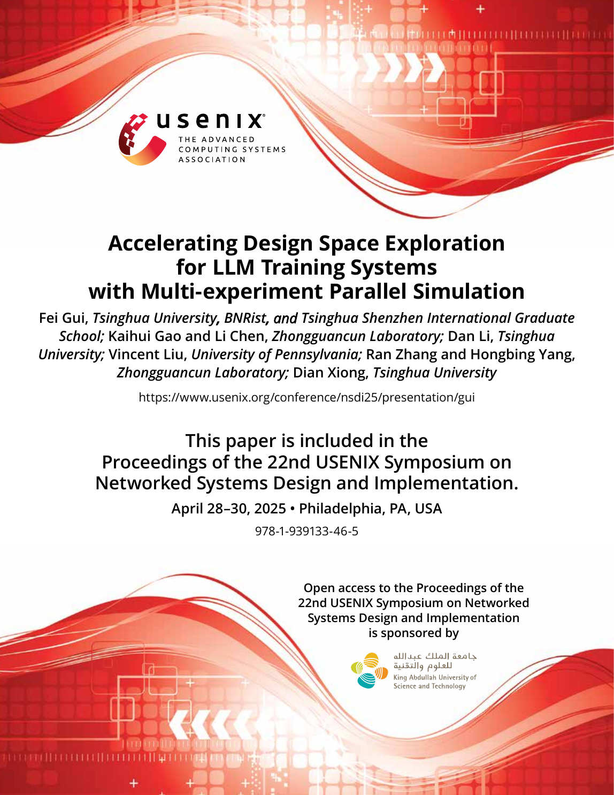

<strong>PDF p.2</strong> - 被 E001、E002、E018 引用

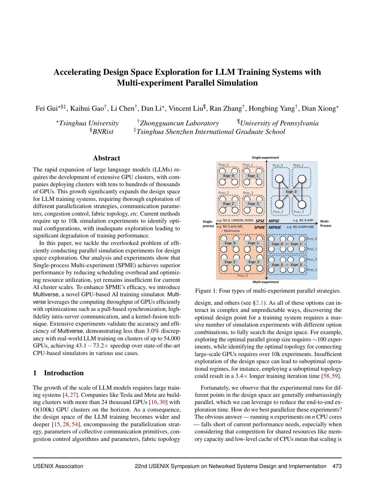

<strong>PDF p.3</strong> - 被 E002 引用

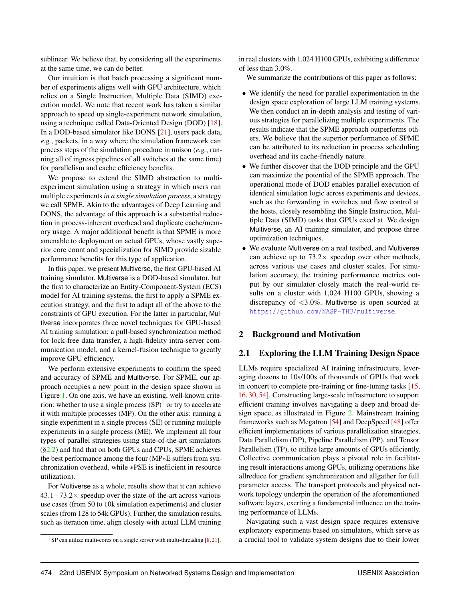

<strong>PDF p.4</strong> - 被 E002 引用

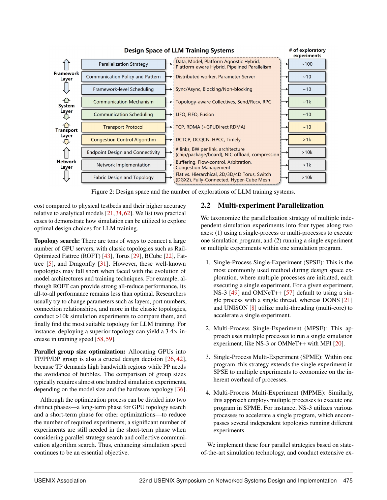

<strong>PDF p.5</strong> - 被 E002 引用

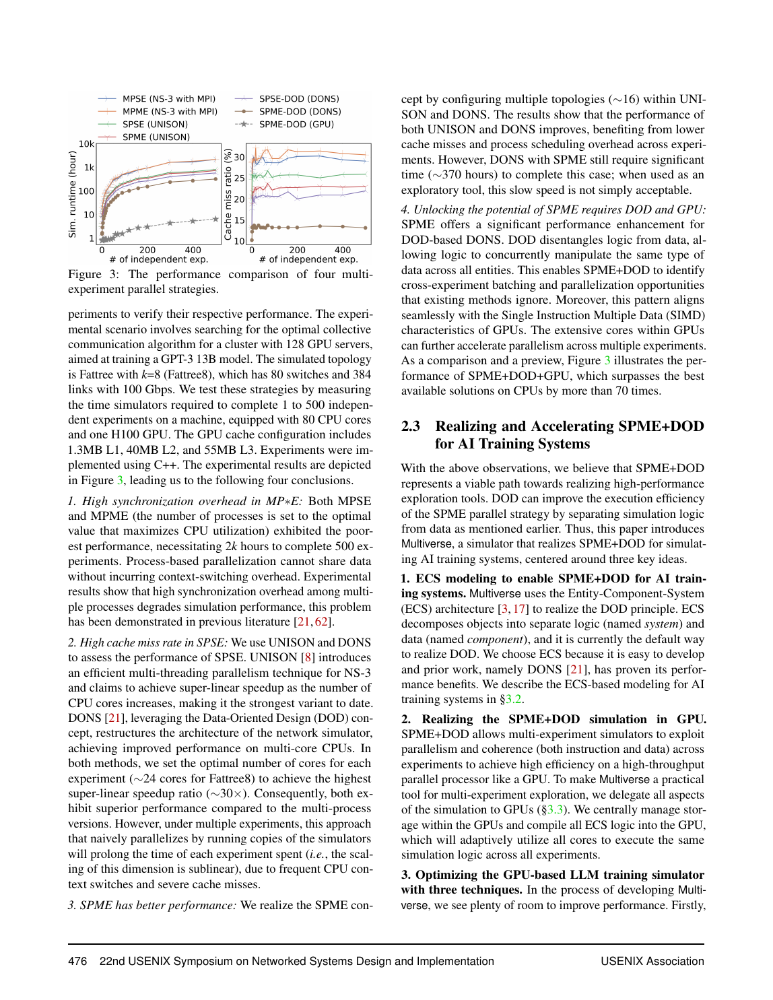

<strong>PDF p.6</strong> - 被 E004、E005、E007、E010、E011、E014 引用

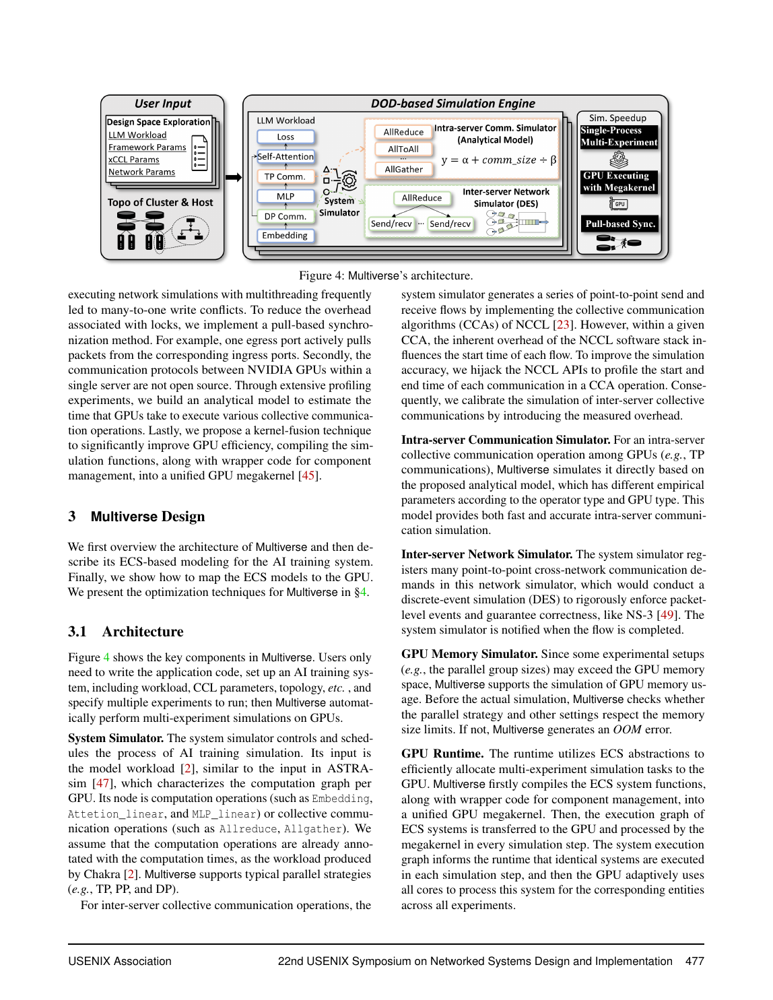

<strong>PDF p.7</strong> - 被 E006、E007 引用

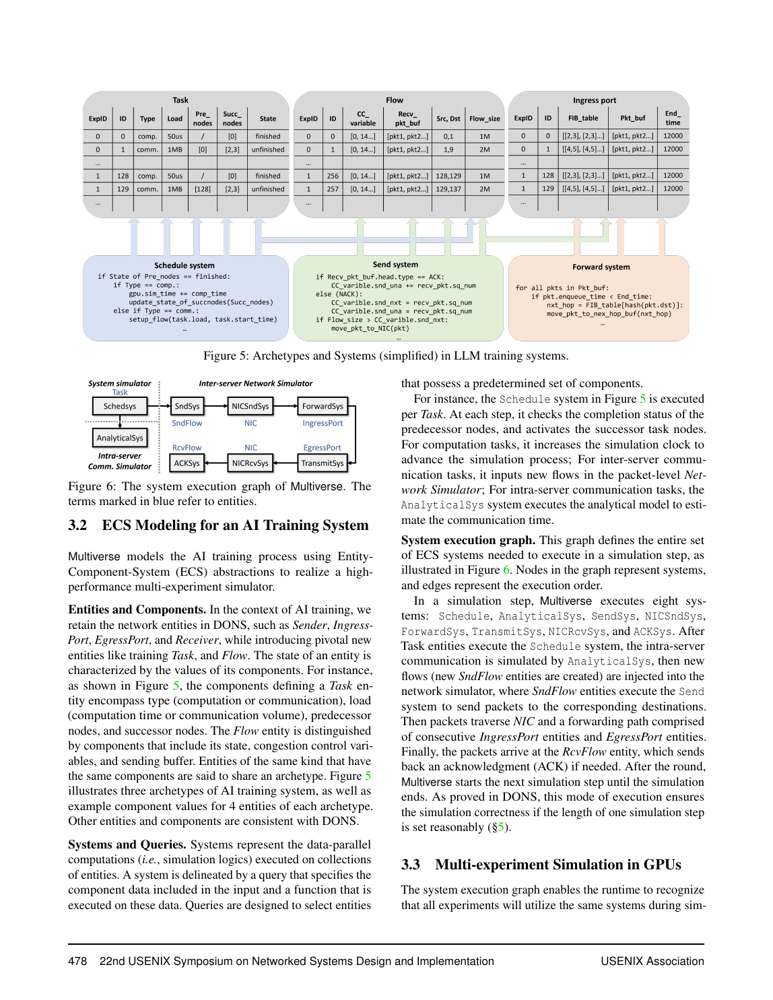

<strong>PDF p.8</strong> - 被 E006、E007、E008 引用

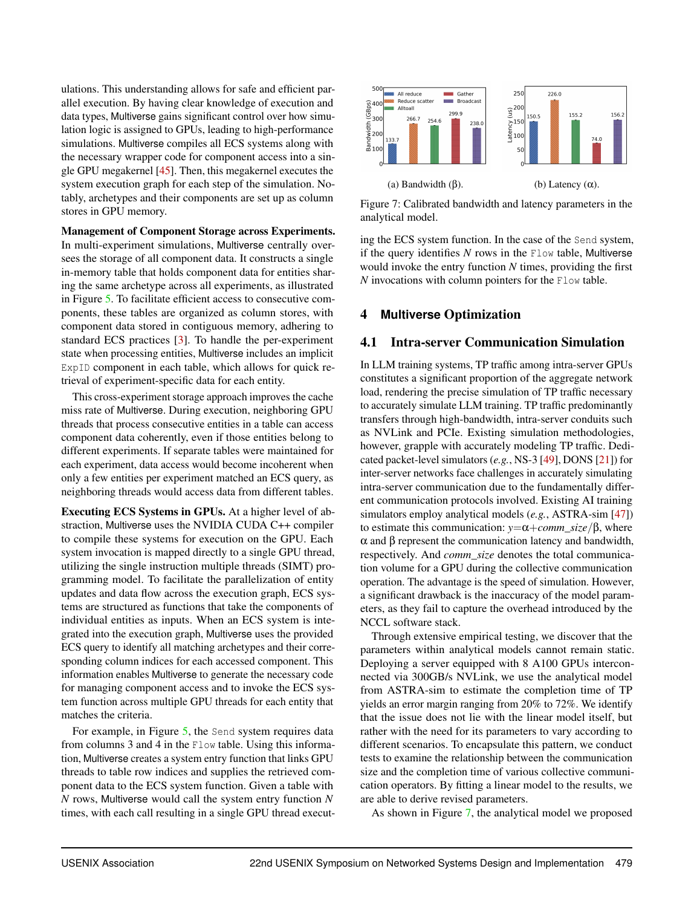

<strong>PDF p.9</strong> - 被 E008、E009、E012 引用

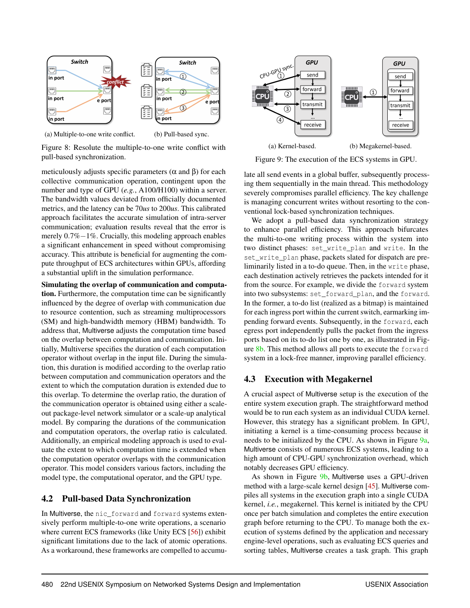

<strong>PDF p.10</strong> - 被 E003、E012、E013、E015、E016 引用

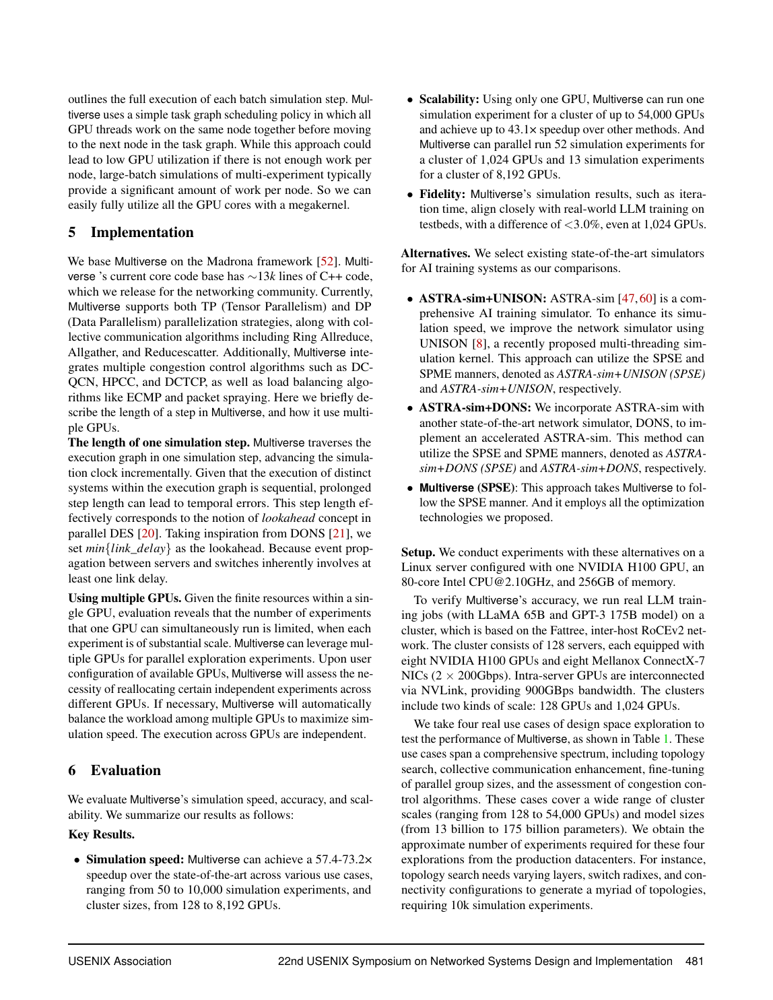

<strong>PDF p.11</strong> - 被 E003、E015、E016、E017 引用

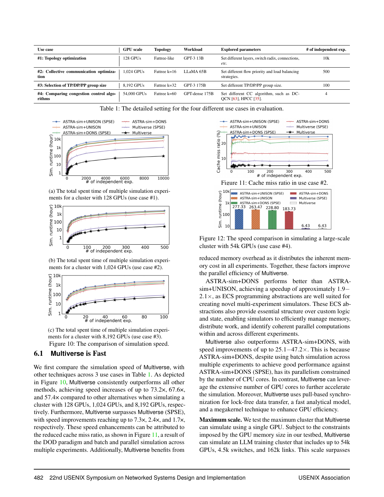

<strong>PDF p.12</strong> - 被 E003、E016、E017、E018、E019 引用

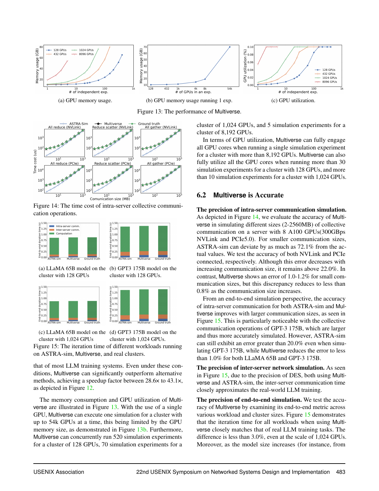

<strong>PDF p.13</strong> - 被 E020 引用

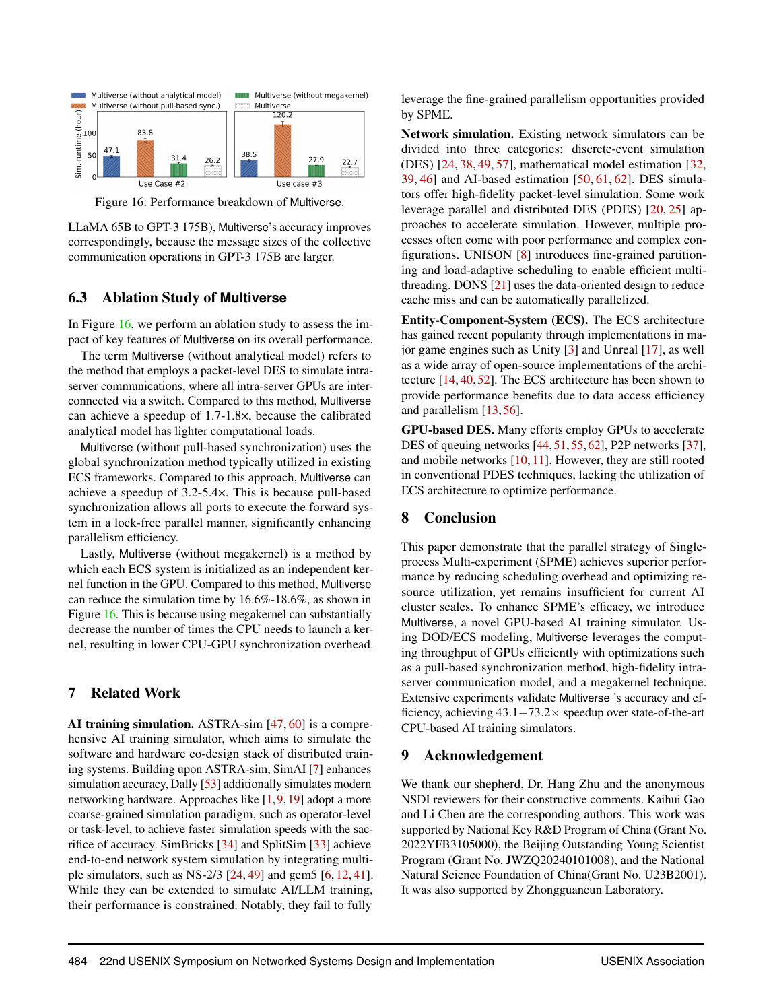

<!-- EVIDENCE_SCREENSHOTS:END -->
