# Vidur：面向大规模 LLM 推理的事件驱动仿真

> 证据截图说明：正文中的 `原文截图 E###` 可跳转到文末证据卡片。截图按 PDF 物理页码生成；原有章节、图表、算法和段落定位保持不变。

> 论文：*Vidur: A Large-Scale Simulation Framework for LLM Inference*，MLSys 2024，arXiv:2405.05465v2。本文引用的“PDF 第 N 页”是下载文件的物理页码；论文正文印刷页码与 PDF 第 1–11 页一致，参考文献和附录位于 PDF 第 11–16 页。 〔[原文截图 E001](#evidence-e001)〕
>
> 证据标记：**[论文事实]** 表示论文正文直接给出；**[综合判断]** 表示结合全文得到的归纳；**[迁移推断]** 表示面向 Ascend/CANN/HCCL 的工程建议；**[未知]** 表示论文没有足够信息。

## 1. 解决的问题与核心方法

**[论文事实]** Vidur 要解决的是：LLM serving 的迭代很短、每轮 batch 构成不断变化，单轮运行时间的小误差还会改变后续 batching，从而级联成端到端误差。论文把挑战概括为 time scale、varying iteration times、cascading errors（PDF 第 4 页，§3 三个小标题；其中 “Cascading Errors” 段说明预测误差会改变 batching pattern）。 〔[原文截图 E002](#evidence-e002)〕

框架由两部分组成（PDF 第 4 页，§4 开头第 1 段，Figure 2）： 〔[原文截图 E003](#evidence-e003)〕

1. **Model onboarding**：声明式模型规格 → 离线 profiler → runtime estimator；
2. **Simulator runtime**：层次化 scheduler、trace generator、metrics tracker；输入模型、GPU、replica 数、TP/PP、调度器、请求 trace，输出请求/副本/集群指标。

其关键取舍不是对每个输入形状查表，而是先把算子按决定运行时间的变量分类，再用少量 profile 与回归模型预测未见形状（PDF 第 4–6 页，§4.1–§4.3）。因此 Vidur 同时属于“查表+拟合”和“事件驱动 serving 仿真”：cost model 负责单轮服务时间，scheduler/runtime 负责让误差通过真实的动态 batching 传播。 〔[原文截图 E004](#evidence-e004)〕

## 2. 算子与通信代价模型

### 2.1 算子分型

**[论文事实]** Vidur 将算子分成三类（PDF 第 5 页，§4.2；该节围绕 token-level、sequence-length-dependent、communication 三类展开）： 〔[原文截图 E005](#evidence-e005)〕

- token-level operators：只依赖本轮所有请求的 token 总数，例如 MLP；
- sequence-length-dependent operators：主要是 attention，依赖各请求的 prompt/KV 长度；
- communication operators：依赖传输数据量、设备数和拓扑。

Prefill attention 用等效长度降低维度：若 batch 中 prompt 长度为 p_i，总工作量与 Σp_i² 成正比，等效为长度 sqrt(Σp_i²) 的单请求（PDF 第 5 页，§4.3 “Attention Operations” 第 1 段）。Decode attention 则用总 KV-cache 读取量建模，并假设 PagedAttention v2/FlashDecoding 已能较好处理序列长度不均（PDF 第 6 页，§4.3 延续段，定位词 “total amount of KV-cache”）。 〔[原文截图 E006](#evidence-e006)〕

**[论文事实]** 运行时间预测器使用随机森林；作者认为其可表达分段、非线性关系且推理开销低（PDF 第 6 页，§4.3 “Runtime Estimation”）。通信中的 all-reduce、all-gather、send/receive 按数据量、设备数及实际互联拓扑 profile（PDF 第 6 页，§4.3 “Communication Operations”）。 〔[原文截图 E007](#evidence-e007)〕

### 2.2 Cost Model 的边界

**[综合判断]** 模型学习的是“聚合形状 → 时延”，而不是“原始执行路径 → 时延”。特别是 decode attention 将整个 batch 压缩为总 KV 读取量，无法表达 KV 页碎片、不同请求尾长、不同 kernel 分支、CUDA Graph padding、prefix cache 命中、speculative decoding 接受率等现代运行时状态。论文附录也显示，在 95% 容量附近，LLaMA2-7B 的最大误差达到 12.65%，作者将其归因于 CPU overhead 及级联误差（PDF 第 15 页，Appendix A，Figure 9 相邻段）。 〔[原文截图 E008](#evidence-e008)〕

## 3. Serving 工作负载、调度与状态

### 3.1 到达与长度分布

**[论文事实]** 论文使用三类真实 trace（PDF 第 7 页，§5.1，Table 1）： 〔[原文截图 E009](#evidence-e009)〕

| Trace | 请求数 | 平均 prompt | 平均 decode | 特征 |
|---|---:|---:|---:|---|
| Chat1M | 2M | 786 | 215 | 对话型，另有截断版本 |
| Arxiv | 203K | 9,882 | 411 | 超长 prompt |
| BWB | 195K | 2,418 | 3,654 | 长生成 |

动态验证中请求按 Poisson 到达，并把负载设到实机容量的 85%（PDF 第 9 页，§7.2，Figure 4 前后段）。因此它能研究 arrival rate、prompt/decode 长度与 batching 的联合作用，但论文没有声称恢复生产 trace 中更复杂的 burst、相关性、会话轮次或工具调用等待。 〔[原文截图 E010](#evidence-e010)〕

### 3.2 三层调度

**[论文事实]** 层次化 scheduler 分为（PDF 第 6 页，§4.4）： 〔[原文截图 E011](#evidence-e011)〕

- global scheduler：把请求路由到 replica，支持 round-robin、least outstanding requests，以及 deferred/stateful 策略；
- replica scheduler：包含 memory planner/manager 与 batching，可实现 FasterTransformer、Orca、Sarathi、vLLM、LightLLM 风格策略，论文称每个策略少于 150 行 Python；
- stage scheduler：处理 pipeline stage，论文版本只支持同步 pipeline parallelism。

作者明确把异步通信、sequence parallelism、speculative pipeline 等列为未来工作（PDF 第 6 页，§4.4 末段）。Sarathi 的 chunked prefill 可作为配置搜索变量，chunk size 为 512/1K/2K（PDF 第 9 页，§7.3，Figure 5 相邻实验设置）。 〔[原文截图 E012](#evidence-e012)〕

### 3.3 KV cache、抢占和请求状态

**[论文事实]** Replica scheduler 跟踪 memory capacity、KV-cache 占用、请求 admission，并记录 preempt/restart 次数（PDF 第 6 页，§4.4 “Replica Scheduler”；PDF 第 7 页，§5.2 指标段）。 〔[原文截图 E013](#evidence-e013)〕

**[综合判断]** Vidur 的 Serving State 是“容量/请求进度级”，不是“页/块/槽位级”。论文没有给出 page/block ID、物理 slot、prefix hash、KV layout/version、swap 传输事件或 token 值，因此可以复现容量压力引发的调度效果，不能作为功能回放去验证 KV 内容或 allocator 的精确行为。

### 3.4 指标

**[论文事实]** 指标覆盖：每请求 scheduling delay、prefill completion、TTFT、TBT、preempt/restart；每 replica 的 batch、token、busy/idle、memory、compute；集群的 FLOPs、显存等（PDF 第 7 页，§5.2）。配置搜索使用 P90 TTFT < 2 s、P99 TBT < 200 ms 等 SLO，并优化 QPS/$（PDF 第 9 页，§7.3）。论文使用 TBT 术语，未细分现代文献中 ITL/TPOT 的统计口径；读者不应直接把其均值或 percentile 与其他论文混用。 〔[原文截图 E014](#evidence-e014)〕

## 4. 离散事件与时间推进

**[论文事实]** Vidur 以请求到达和每次迭代完成为推进点，scheduler 根据当前队列、KV 容量与策略形成 batch，runtime estimator 给出该 batch 的运行时间，再更新请求进度与指标（架构见 PDF 第 4 页 Figure 2；调度器见第 6 页 §4.4）。 〔[原文截图 E015](#evidence-e015)〕

**[综合判断]** 这是“迭代级离散事件仿真”，并非 kernel trace 回放。单次迭代内的算子重叠和通信等待被吸收到预测时延中；通信时延被当作可 profile 的 cost，而不是由发送端/接收端实际到达、网络资源争用与 collective rendezvous 自然涌现。对录制回放系统而言，这一层最适合做 L2-W workload replay/容量规划，不足以单独承担 L2-P physical replay。

## 5. 校准、验证与关键结果

**[论文事实]** 实机基线是优化过的 vLLM fork；硬件为 A100/H100 80GB，4 GPU 机内互联为 pairwise NVLink（PDF 第 8 页，§7.1）。 〔[原文截图 E016](#evidence-e016)〕

- 静态 batch 的 P95 normalized execution latency 最大误差 3.33%（PDF 第 8 页，§7.2，Figure 3）； 〔[原文截图 E017](#evidence-e017)〕
- Poisson 动态负载、85% capacity 下，多数组合端到端误差小于 5%（PDF 第 9 页，§7.2，Figure 4）； 〔[原文截图 E018](#evidence-e018)〕
- 在 95% capacity 的附录压力测试中，小模型最大误差 12.65%（PDF 第 15 页，Appendix A，Figure 9）； 〔[原文截图 E019](#evidence-e019)〕
- 全部搜索共 35,565 次仿真，若实机运行预计消耗约 113.99 万美元 GPU 成本；仿真约 12.5 小时 CPU、125 美元（PDF 第 15 页，Appendix B）。 〔[原文截图 E020](#evidence-e020)〕

**[论文事实]** What-if 案例显示：Qwen 的 MHA 相比 LLaMA 的 GQA 读取约 8 倍 KV 数据，成本约高 2 倍；将 TBT SLO 从 0.12 s 放宽到 0.14 s，某案例成本约下降 1.85 倍（PDF 第 9–10 页，§7.3，Figure 5–6 相邻分析）。这些是特定模型、trace、硬件和 SLO 下的实验结果，不应外推为通用比例。 〔[原文截图 E021](#evidence-e021)〕

## 6. 落地、开源与成熟度

**[论文事实]** 论文给出公开实现；截至本次调研（2026-08-06），官方仓库为 https://github.com/microsoft/vidur ，MIT 许可，包含模型规格、profiling、预置 profile、仿真器与示例配置。

**[综合判断]** 成熟度为“公开研究原型，路径清楚，适合二次开发”。优点是：代码小而模块化、策略可替换、校准成本低、可在 CPU 上做大规模搜索。局限是：论文对应 2024 年 serving 栈；PD disaggregation、prefix caching、speculative decoding、CUDA Graph、复杂 MoE/EP、精细网络争用和 KV 页状态均不完整。公开仓库后续能力可能超出论文，复现实验时应固定 commit、profile 数据和 vLLM fork，不能把当前 README 的能力反向归到 2024 论文。

## 7. 优点、缺点与失效边界

### 优点

- 用算子语义降维，profile 覆盖量远小于穷举 shape；
- 把预测模型嵌入真实的动态 batching 循环，能观察级联效应；
- global/replica/stage 三层调度便于替换策略；
- 指标直接面向 TTFT/TBT/SLO/QPS/$，适合容量规划和配置搜索。

### 缺点与失效边界

- 高负载、小模型、CPU overhead 占比高时误差放大；
- RF 插值依赖 profile 覆盖，跨硬件、跨 kernel/backend 必须重采；
- decode attention 的总 KV 量特征会丢失分布尾部和 kernel 路径；
- 同步 PP、粗粒度通信模型无法回答 overlap、straggler、peer wait；
- KV 只到容量级，无法验证 paging/prefix/slot/version 等实现细节；
- 没有恢复 token 值与控制分支，不是功能、数值或路径等价回放。

## 8. 与录制回放分层的对应

| 录制回放模块 | Vidur 中的对应 | 完整度 |
|---|---|---|
| Execution Recipe | 模型、trace、TP/PP、scheduler、batching 规则 | 中高；缺 token/会话/现代运行时细节 |
| Physical Binding | GPU 型号、replica、TP/PP、网络 profile | 中；没有 rank-设备-kernel/graph 地址契约 |
| Observation Ledger | 离线 operator/communication profile、实机验证结果 | 中；未强调 provenance、原始事件与证据分级 |
| Cost Model | 分类特征 + Random Forest | 高，是核心贡献 |
| Event Runtime | 迭代级、层次化 scheduler | 高；迭代内部较粗 |
| Serving State | 请求进度、KV 容量、preempt/restart | 中低；无 page/block/slot/prefix/spec 状态 |

结论：Vidur 最接近“**工作负载回放 + 预测型性能回放**”。它不是算子/kernel trace 的物理回放，也不是 KV/数值功能回放。

## 9. Ascend / CANN / HCCL 迁移建议

**[迁移推断]** 可直接复用其 simulator runtime 与调度接口，但 cost/binding 必须重建：

1. 用 Ascend Profiler 采集 MatMul、FlashAttention、RMSNorm、MoE/GMM 等算子，并把原始、有效、padding、storage shape 分开记录；不能直接复用 A100/H100 profile。
2. Cost key 至少包含 SoC/NPU 型号、CANN/torch_npu 版本、算子实现、dtype、layout、TP/EP shard、Graph/非 Graph 模式和动态 shape 桶。
3. HCCL 不应只按 message size 查表；应记录 group、rank mapping、拓扑、算法、peer ready/wait。若目标是高保真通信回放，应在 Event Runtime 中显式构造 collective rendezvous 和链路资源竞争。
4. 对 vLLM/SGLang on Ascend，应补充 block-table、KV page/slot、prefix hash、chunked prefill 进度、抢占/换入换出、Graph bucket 等 Serving State。
5. 建议把 Vidur RF 作为 fallback cost model：命中 Observation Ledger 时优先使用实测分布；未命中时才预测，并标注外推距离与置信度。

## 10. 一句话评价

Vidur 是“用少量 profile 驱动动态 serving 仿真”的经典基线：便宜、可搜索、指标贴近部署，但其状态和时间粒度不足以替代精细的执行 trace/通信/KV 回放。

<!-- EVIDENCE_SCREENSHOTS:BEGIN -->

## 原文证据截图附录

正文中的 `原文截图 E###` 与本节一一对应。卡片保留原笔记行号和原有页码/章节定位；图片按 PDF 物理页生成。截图用于快速核读，正式引用仍以原论文为准。

<strong>E001</strong> - 原笔记第 6 行 - PDF p.11, 12, 13, 14, 15, 16

<strong>原定位：</strong> <code>&gt; 论文：*Vidur: A Large-Scale Simulation Framework for LLM Inference*，MLSys 2024，arXiv:2405.05465v2。本文引用的“PDF 第 N 页”是下载文件的物理页码；论文正文印刷页码与 PDF 第 1–11 页一致，参考文献和附录位于 PDF 第 11–16 页。</code>

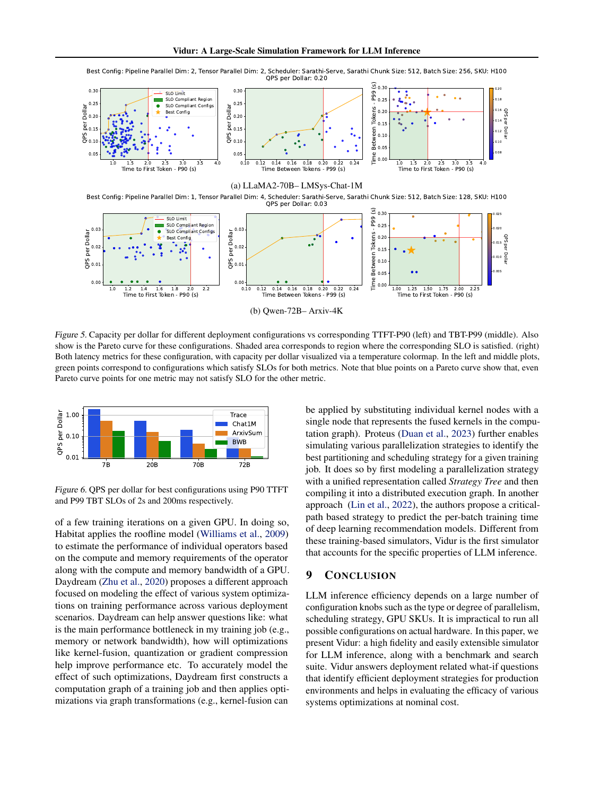

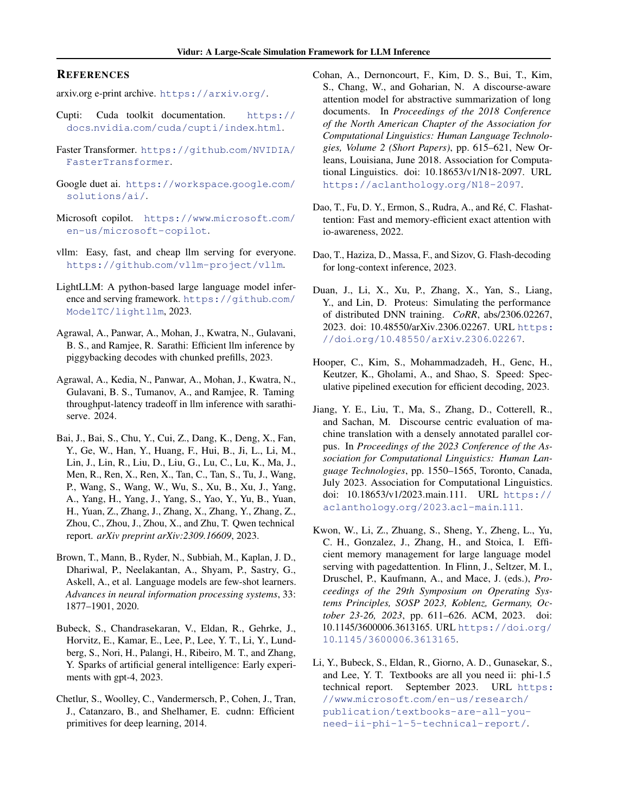

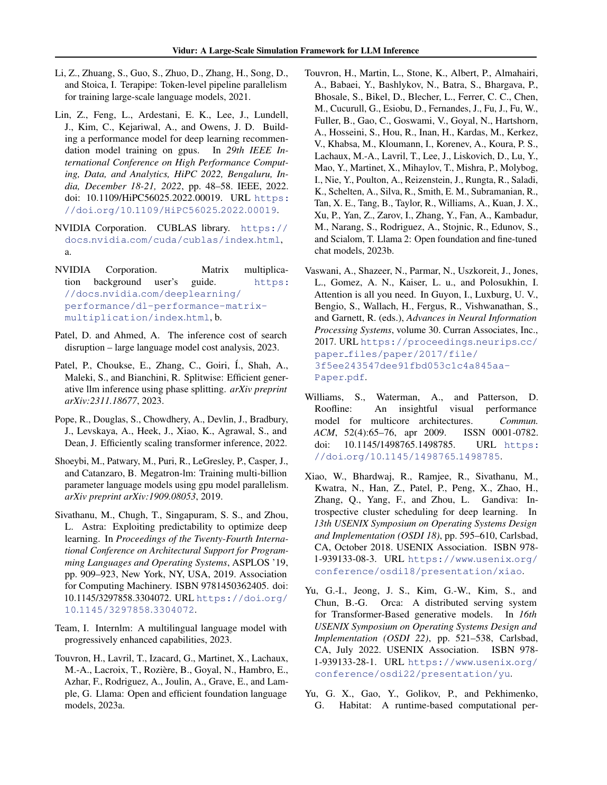

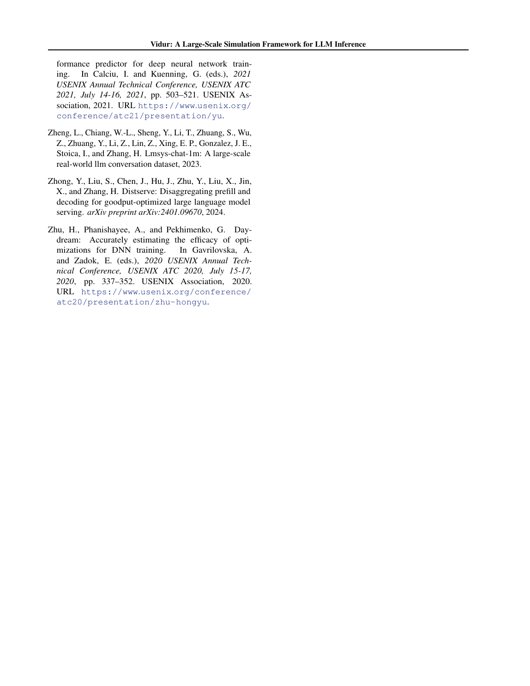

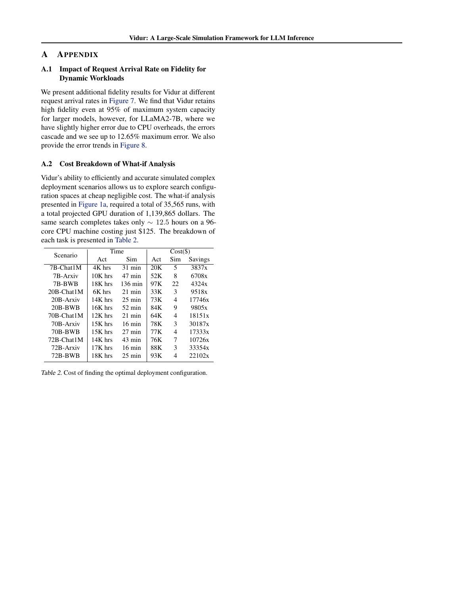

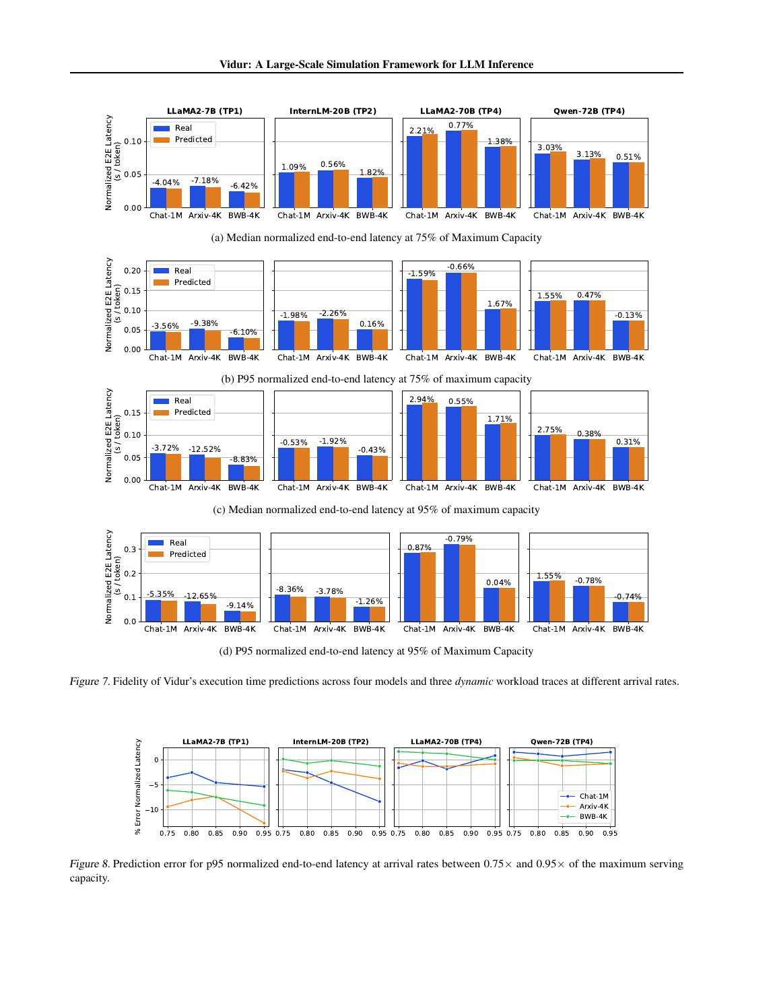

<strong>E002</strong> - 原笔记第 12 行 - PDF p.4

<strong>原定位：</strong> <code>**[论文事实]** Vidur 要解决的是：LLM serving 的迭代很短、每轮 batch 构成不断变化，单轮运行时间的小误差还会改变后续 batching，从而级联成端到端误差。论文把挑战概括为 time scale、varying iteration times、cascading errors（PDF 第 4 页，§3 三个小标题；其中 “Cascading Errors” 段说明预测误差会改变 batching pattern）。</code>

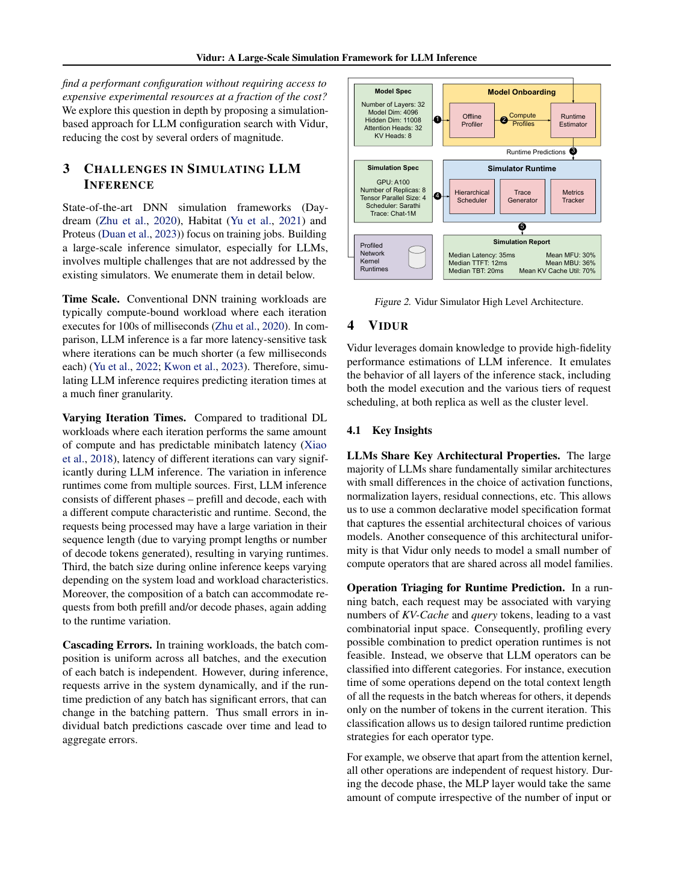

<strong>E003</strong> - 原笔记第 14 行 - PDF p.4

<strong>原定位：</strong> <code>框架由两部分组成（PDF 第 4 页，§4 开头第 1 段，Figure 2）：</code>

<strong>E004</strong> - 原笔记第 19 行 - PDF p.4, 5, 6

<strong>原定位：</strong> <code>其关键取舍不是对每个输入形状查表，而是先把算子按决定运行时间的变量分类，再用少量 profile 与回归模型预测未见形状（PDF 第 4–6 页，§4.1–§4.3）。因此 Vidur 同时属于“查表+拟合”和“事件驱动 serving 仿真”：cost model 负责单轮服务时间，scheduler/runtime 负责让误差通过真实的动态 batching 传播。</code>

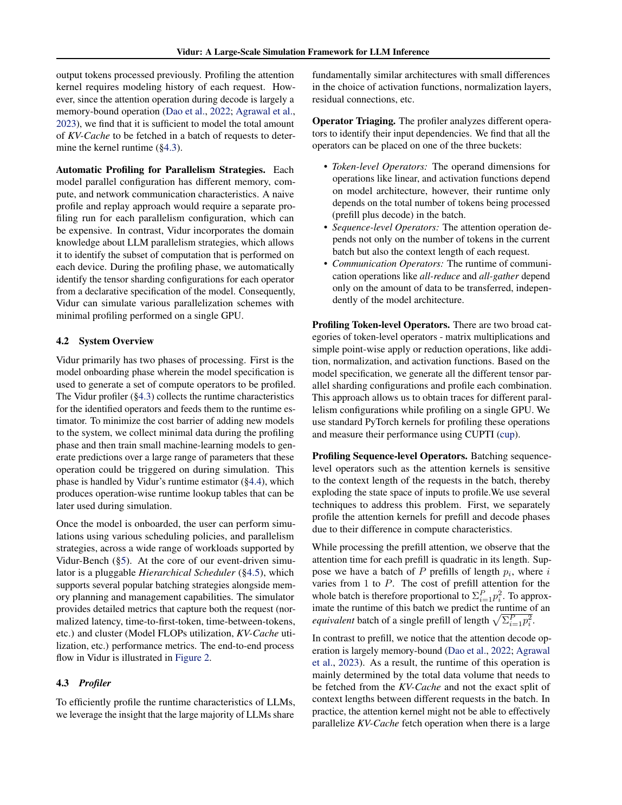

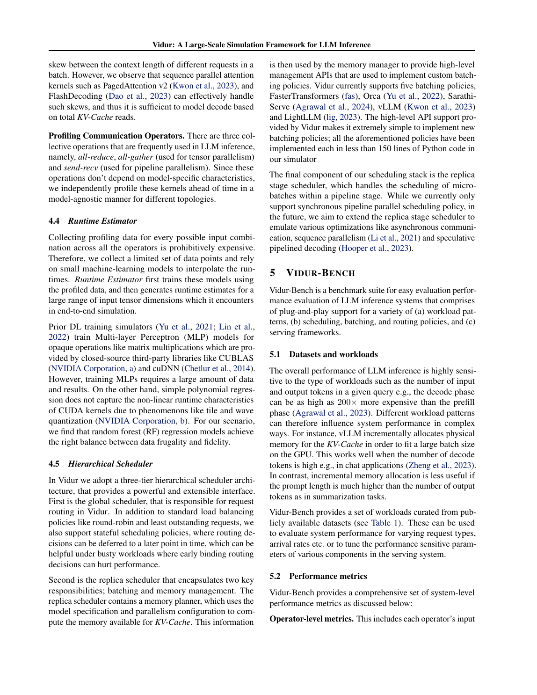

<strong>E005</strong> - 原笔记第 25 行 - PDF p.5

<strong>原定位：</strong> <code>**[论文事实]** Vidur 将算子分成三类（PDF 第 5 页，§4.2；该节围绕 token-level、sequence-length-dependent、communication 三类展开）：</code>

<strong>E006</strong> - 原笔记第 31 行 - PDF p.5, 6

<strong>原定位：</strong> <code>Prefill attention 用等效长度降低维度：若 batch 中 prompt 长度为 p_i，总工作量与 Σp_i² 成正比，等效为长度 sqrt(Σp_i²) 的单请求（PDF 第 5 页，§4.3 “Attention Operations” 第 1 段）。Decode attention 则用总 KV-cache 读取量建模，并假设 PagedAttention v2/FlashDecoding 已能较好处理序列长度不均（PDF 第 6 页，§4.3 延续段，定位词 “total amount of KV-cache”）。</code>

<strong>E007</strong> - 原笔记第 33 行 - PDF p.6

<strong>原定位：</strong> <code>**[论文事实]** 运行时间预测器使用随机森林；作者认为其可表达分段、非线性关系且推理开销低（PDF 第 6 页，§4.3 “Runtime Estimation”）。通信中的 all-reduce、all-gather、send/receive 按数据量、设备数及实际互联拓扑 profile（PDF 第 6 页，§4.3 “Communication Operations”）。</code>

<strong>E008</strong> - 原笔记第 37 行 - PDF p.15

<strong>原定位：</strong> <code>**[综合判断]** 模型学习的是“聚合形状 → 时延”，而不是“原始执行路径 → 时延”。特别是 decode attention 将整个 batch 压缩为总 KV 读取量，无法表达 KV 页碎片、不同请求尾长、不同 kernel 分支、CUDA Graph padding、prefix cache 命中、speculative decoding 接受率等现代运行时状态。论文附录也显示，在 95% 容量附近，LLaMA2-7B 的最大误差达到 12.65%，作者将其归因于 CPU overhead 及级联误差（PDF 第 15 页，Appendix A，Figure 9 相邻段）。</code>

<strong>E009</strong> - 原笔记第 43 行 - PDF p.7

<strong>原定位：</strong> <code>**[论文事实]** 论文使用三类真实 trace（PDF 第 7 页，§5.1，Table 1）：</code>

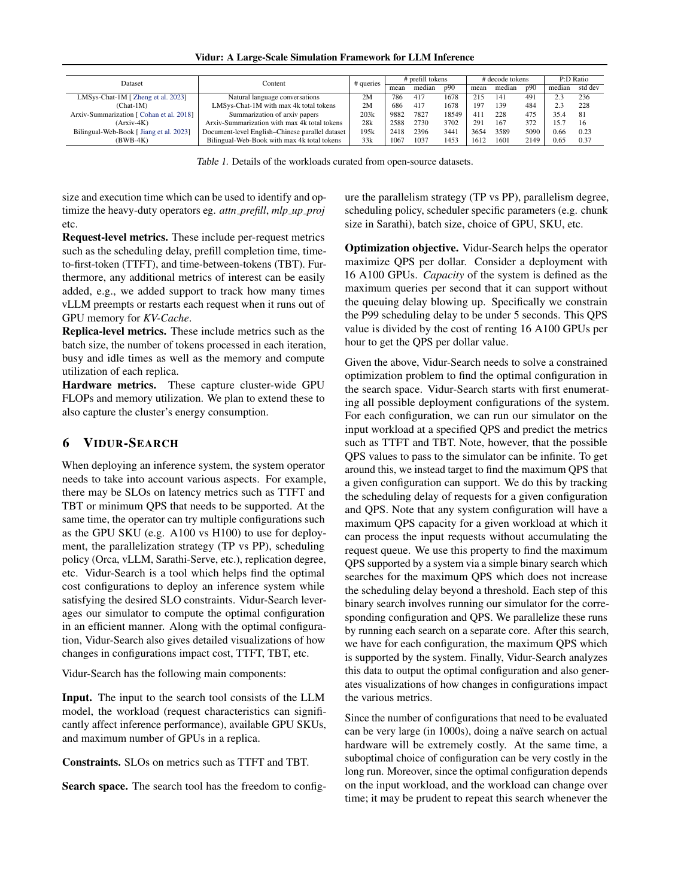

<strong>E010</strong> - 原笔记第 51 行 - PDF p.9

<strong>原定位：</strong> <code>动态验证中请求按 Poisson 到达，并把负载设到实机容量的 85%（PDF 第 9 页，§7.2，Figure 4 前后段）。因此它能研究 arrival rate、prompt/decode 长度与 batching 的联合作用，但论文没有声称恢复生产 trace 中更复杂的 burst、相关性、会话轮次或工具调用等待。</code>

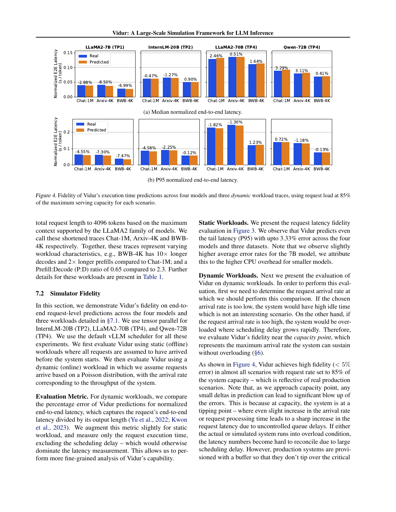

<strong>E011</strong> - 原笔记第 55 行 - PDF p.6

<strong>原定位：</strong> <code>**[论文事实]** 层次化 scheduler 分为（PDF 第 6 页，§4.4）：</code>

<strong>E012</strong> - 原笔记第 61 行 - PDF p.6, 9

<strong>原定位：</strong> <code>作者明确把异步通信、sequence parallelism、speculative pipeline 等列为未来工作（PDF 第 6 页，§4.4 末段）。Sarathi 的 chunked prefill 可作为配置搜索变量，chunk size 为 512/1K/2K（PDF 第 9 页，§7.3，Figure 5 相邻实验设置）。</code>

<strong>E013</strong> - 原笔记第 65 行 - PDF p.6, 7

<strong>原定位：</strong> <code>**[论文事实]** Replica scheduler 跟踪 memory capacity、KV-cache 占用、请求 admission，并记录 preempt/restart 次数（PDF 第 6 页，§4.4 “Replica Scheduler”；PDF 第 7 页，§5.2 指标段）。</code>

<strong>E014</strong> - 原笔记第 71 行 - PDF p.7, 9

<strong>原定位：</strong> <code>**[论文事实]** 指标覆盖：每请求 scheduling delay、prefill completion、TTFT、TBT、preempt/restart；每 replica 的 batch、token、busy/idle、memory、compute；集群的 FLOPs、显存等（PDF 第 7 页，§5.2）。配置搜索使用 P90 TTFT &lt; 2 s、P99 TBT &lt; 200 ms 等 SLO，并优化 QPS/$（PDF 第 9 页，§7.3）。论文使用 TBT 术语，未细分现代文献中 ITL/TPOT 的统计口径；读者不应直接把其均值或 percentile 与其他论文混用。</code>

<strong>E015</strong> - 原笔记第 75 行 - PDF p.4

<strong>原定位：</strong> <code>**[论文事实]** Vidur 以请求到达和每次迭代完成为推进点，scheduler 根据当前队列、KV 容量与策略形成 batch，runtime estimator 给出该 batch 的运行时间，再更新请求进度与指标（架构见 PDF 第 4 页 Figure 2；调度器见第 6 页 §4.4）。</code>

<strong>E016</strong> - 原笔记第 81 行 - PDF p.8

<strong>原定位：</strong> <code>**[论文事实]** 实机基线是优化过的 vLLM fork；硬件为 A100/H100 80GB，4 GPU 机内互联为 pairwise NVLink（PDF 第 8 页，§7.1）。</code>

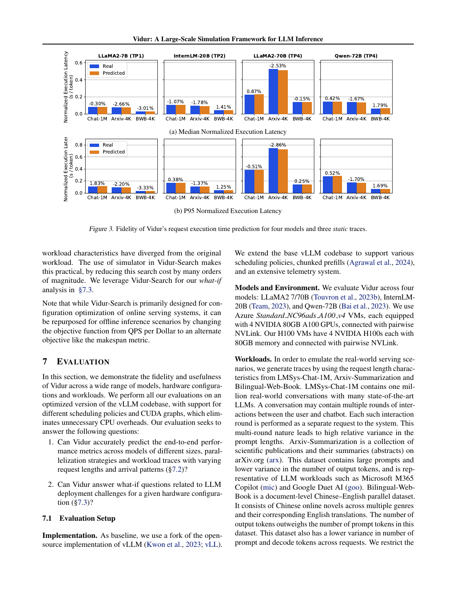

<strong>E017</strong> - 原笔记第 83 行 - PDF p.8

<strong>原定位：</strong> <code>- 静态 batch 的 P95 normalized execution latency 最大误差 3.33%（PDF 第 8 页，§7.2，Figure 3）；</code>

<strong>E018</strong> - 原笔记第 84 行 - PDF p.9

<strong>原定位：</strong> <code>- Poisson 动态负载、85% capacity 下，多数组合端到端误差小于 5%（PDF 第 9 页，§7.2，Figure 4）；</code>

<strong>E019</strong> - 原笔记第 85 行 - PDF p.15

<strong>原定位：</strong> <code>- 在 95% capacity 的附录压力测试中，小模型最大误差 12.65%（PDF 第 15 页，Appendix A，Figure 9）；</code>

<strong>E020</strong> - 原笔记第 86 行 - PDF p.15

<strong>原定位：</strong> <code>- 全部搜索共 35,565 次仿真，若实机运行预计消耗约 113.99 万美元 GPU 成本；仿真约 12.5 小时 CPU、125 美元（PDF 第 15 页，Appendix B）。</code>

<strong>E021</strong> - 原笔记第 88 行 - PDF p.9, 10

<strong>原定位：</strong> <code>**[论文事实]** What-if 案例显示：Qwen 的 MHA 相比 LLaMA 的 GQA 读取约 8 倍 KV 数据，成本约高 2 倍；将 TBT SLO 从 0.12 s 放宽到 0.14 s，某案例成本约下降 1.85 倍（PDF 第 9–10 页，§7.3，Figure 5–6 相邻分析）。这些是特定模型、trace、硬件和 SLO 下的实验结果，不应外推为通用比例。</code>

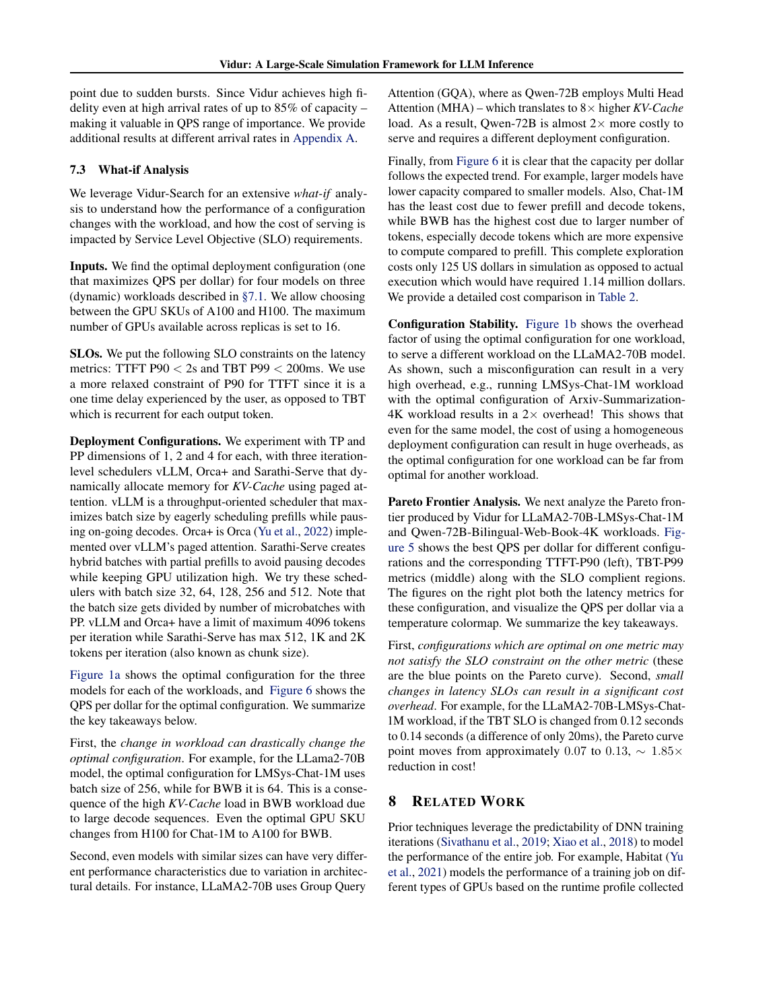

<!-- EVIDENCE_SCREENSHOTS:END -->
