# LLMServingSim：迭代级调度、硬件模拟与系统模拟的组合框架

> 证据截图说明：正文中的 `原文截图 E###` 可跳转到文末证据卡片。截图按 PDF 物理页码生成；原有章节、图表、算法和段落定位保持不变。

> 论文正式标题：*LLMServingSim: A HW/SW Co-Simulation Infrastructure for LLM Inference Serving at Scale*，IISWC 2024。本文页码均为 PDF 物理页码；正文第 1–13 页，Artifact Appendix 第 14–15 页。
>
> 证据标记：**[论文事实]**、**[综合判断]**、**[迁移推断]**、**[未知]**。

## 1. 目标与总体架构

**[论文事实]** LLMServingSim 面向的是硬件/系统协同设计：现有 LLM serving 仿真要么缺少迭代级动态调度，要么逐算子、逐层硬件模拟太慢，也难把异构加速器编译/模拟栈接入。论文提出三点（PDF 第 1–2 页，Abstract 与 §1 贡献段）： 〔[原文截图 E001](#evidence-e001)〕

1. 每次 autoregressive iteration 都经过 scheduler → hardware execution engine → graph conversion → ASTRA-sim system simulation；
2. 利用 decoder block 和非 attention 算子在迭代间重复，缓存单 block 的硬件模拟结果；
3. 以 plug-in 方式接入不同 accelerator compiler/simulator，并支持 NPU+PIM 等异构 operator mapping。

Figure 4 给出完整工作流（PDF 第 4 页，§4.1）：Request Trace/Scheduler、Execution Engine Stack、Graph Converter、ASTRA-sim 通过 Chakra execution graph 串联。它不是只给整个 batch 一个经验时延，而是先产生算子图，再由硬件模拟器给节点代价，最终由系统模拟器重建跨设备时间线。 〔[原文截图 E002](#evidence-e002)〕

## 2. 工作负载与 Serving 调度

### 2.1 Trace 输入

**[论文事实]** Artifact Appendix 规定输入 trace 为 TSV，每行包含 input length、output length、arrival time（PDF 第 15 页，Appendix A.4 “Data sets”）。实验使用 ShareGPT 与 Alpaca，模型覆盖 GPT-3/LLaMA 7B–175B（PDF 第 8 页 §6.1；第 14 页 Artifact checklist）。ShareGPT 请求按 Poisson 到达（PDF 第 8 页，§6.2，Figure 6 相邻设置）。 〔[原文截图 E003](#evidence-e003)〕

**[综合判断]** Trace 保留长度和到达时间，但不保留 token 内容、prefix 相等关系、会话轮次、工具调用、spec draft/accept 结果，因此不能直接研究内容相关缓存与分支。

### 2.2 Iteration-level scheduling 与 continuous batching

**[论文事实]** Scheduler 比较 request arrival time 与内部 timer，选择当前可调度请求；每轮硬件/系统仿真结束后，把结果反馈给 scheduler，更新时间并形成下一轮 batch（PDF 第 5 页，§4.1 “Iteration-level scheduling” 第 2 段）。论文采用 Orca 式 selective/iteration-level batching：不同序列长度的 attention 可以分开处理，其他算子共享 batch（PDF 第 3 页，§2；PDF 第 5 页该小节）。 〔[原文截图 E004](#evidence-e004)〕

Artifact 配置包含 max batch、batch delay、Orca scheduling、TP/PP/hybrid、设备内存与 vLLM KV management 等约 16 个参数（PDF 第 15 页，Appendix A.4 “How to run”）。因此它具备 continuous batching 的核心闭环，但论文没有给出 vLLM 当前版本中 priority、deadline、prefix-aware routing、chunked prefill 或 speculative decoding 的详细状态机。 〔[原文截图 E005](#evidence-e005)〕

### 2.3 KV paging、换出与恢复

**[论文事实]** 这是该论文比 Vidur 更细的一点。Scheduler 根据每个请求长度计算所需 KV page，并按迭代增长动态分配；若设备内存不足，会把最后加入请求的完整 KV pages 与 sequence 移到 host memory，后续容量允许时再 reload。Graph converter 显式插入 memory store/load transfer operators，并把传输时间交给系统模拟器（PDF 第 5 页，§4.1 “KV cache-aware memory modeling”；Figure 5 左侧相邻段）。 〔[原文截图 E006](#evidence-e006)〕

**[综合判断]** 它模拟了“页数量、换出/换入和数据传输”这一性能语义，但论文没有给出 page/block ID、slot mapping、block table、prefix hash、引用计数、版本或 KV 数值。因此仍是性能状态，而非可验证 allocator/缓存正确性的功能状态。

## 3. 并行、异构映射与网络

**[论文事实]** Graph converter 支持 tensor parallel、pipeline parallel 及 hybrid；TP 会在执行图中插入 AllReduce，PP 将 decoder blocks 分配到不同节点并串接（PDF 第 5 页，§4.1 “Supporting for LLM parallelism strategies”）。Algorithm 1 将 request lengths、devices、free KV memory、current time 作为输入，依次进行 batch formatting、sub-batch partition、operator profiling/mapping、execution engine、scheduling 与 graph conversion（PDF 第 6 页，Algorithm 1）。 〔[原文截图 E007](#evidence-e007)〕

异构 NPU/PIM 场景中，operator mapper 把不同算子放入 NPU/PIM pool，插入数据搬运节点；greedy scheduler 同时考虑依赖与设备 availability，允许不同 sub-batch 在不同 accelerator 上重叠（PDF 第 6–7 页，§4.2，Figure 5 与 Algorithm 1 后续段）。 〔[原文截图 E008](#evidence-e008)〕

**[论文事实]** 系统层以 Chakra execution graph 驱动 ASTRA-sim，因此 collective、interconnect、数据传输在系统仿真中推进，而非单纯相加（PDF 第 4–6 页，§4.1）。不过论文实验主要是抽象 NPU/PIM 拓扑，未展示生产以太网/IB 的拥塞校准，也没有逐 peer arrival/wait 的实机 profiler 对账。 〔[原文截图 E009](#evidence-e009)〕

## 4. Operator/kernel 代价与加速

**[论文事实]** 原型接入 GeneSys 作为 NPU compiler/simulator，另有 PolyMath 与 in-house PIM simulator（PDF 第 8 页，§6.1）。为避免每轮、每层重复模拟： 〔[原文截图 E010](#evidence-e010)〕

- 只编译/模拟一个 decoder block，再外推到多层；
- 将 attention 与 non-attention 分离，缓存可复用部分；
- 复用以前形状的硬件模拟结果。

该机制见 PDF 第 7 页，§4.3 “Accelerating the simulation”，并在 Figure 9 验证：缓存/复用带来 6.4–12.2× 加速，某些任务从 198–215.7 s 降到 16.3–33.6 s（PDF 第 9 页，§6.4，Figure 9）。 〔[原文截图 E011](#evidence-e011)〕

**[综合判断]** 其 cost model 比简单查表更接近“编译器/微架构驱动”，适合尚不存在的 accelerator what-if；代价是速度仍受 cycle-level simulator 限制，而且“一 block 外推”会忽略层间不对称、cache 热度、pipeline 边界和 kernel autotuning 差异。

## 5. 指标、事件推进和 what-if

**[论文事实]** 每个 iteration 的执行图在 ASTRA-sim 完成后推进 scheduler timer；输出包括请求吞吐、仿真吞吐和 simulation time TSV（PDF 第 5 页 §4.1；第 15 页 Appendix A.4）。正文主要比较 cycle、throughput 与 request latency，没有像 Vidur/Frontier 那样系统报告 TTFT、TBT/ITL、TPOT percentile 或 SLO violation。 〔[原文截图 E012](#evidence-e012)〕

可探索的 what-if 包括：TP/PP/hybrid、设备数、NPU/PIM 配比、batch size/delay、Orca scheduling、KV 内存和网络。论文从 8 扩到 2048 NPUs；GPT-3 175B 在 2048 NPU 上模拟一个 iteration 仍需 4.13 小时，揭示 cycle-level backend 的可扩展性上限（PDF 第 10 页，§6.5，Figure 10）。 〔[原文截图 E013](#evidence-e013)〕

## 6. 校准、验证与实验结果

**[论文事实]** 实机验证平台为 4×RTX 3090 24GB、Xeon Gold 6326、vLLM；仿真主机为 Xeon 6226R 96GB。模拟 NPU 为 128×128 systolic array、1GHz、24GB，链路 64GB/s、100ns；PIM 为 32GB、1TB/s（PDF 第 8 页，§6.1）。 〔[原文截图 E014](#evidence-e014)〕

- 对 vLLM 的 GPT-3/LLaMA 7B/30B、TP=1/4，论文报告性能趋势吻合，Abstract 汇总误差小于 14.7%（PDF 第 1 页 Abstract；详细图见第 8–9 页 Figure 6）； 〔[原文截图 E015](#evidence-e015)〕
- 对 NeuPIMs 的 NPU-PIM 场景，Alpaca 256 requests，误差小于 20%，几何平均 8.88%（PDF 第 9 页，§6.3，Figure 7）； 〔[原文截图 E016](#evidence-e016)〕
- 相比 mNPUsim、GeneSys、NeuPIMs，平均仿真加速分别为 490.98×、34.71×、44.97×（PDF 第 9 页，§6.4，Figure 8）。 〔[原文截图 E017](#evidence-e017)〕

Abstract 的 “91.5× faster” 是整体摘要口径；正文 Figure 8 的三个 backend 口径不同，不应混成一个统一 speedup。

## 7. 落地与开源成熟度

**[论文事实]** Artifact Appendix 给出公开 C++/Python 实现、MIT/CC4 许可、Zenodo DOI 10.5281/zenodo.12803583；建议 Ubuntu 18.04、x86-64、约 30GB 空间，完整 artifact 可从几十秒运行到 24 小时（PDF 第 14–15 页）。官方仓库为 https://github.com/casys-kaist/LLMServingSim 。 〔[原文截图 E018](#evidence-e018)〕

**[综合判断]** 截至 2026-08-06，仓库已演进为 LLMServingSim 2.0，并宣传 disaggregation、MoE、DP/EP 等新能力。本文只把 2024 PDF 和其 artifact 明确描述的能力记作论文事实；当前仓库新功能需要按新版本单独验证。原论文版本的成熟度是“可公开复现的学术 co-simulator”，但依赖多套 simulator、编译器和配置，搭建成本明显高于 Vidur/APEX。

## 8. 优缺点与失效边界

### 优点

- 将请求调度、算子图、微架构执行和网络系统仿真串成闭环；
- KV page 换出/换入被转化为显式传输算子；
- 可插入新 accelerator compiler/simulator，适合架构设计；
- 通过 block/attention 复用显著削减硬件模拟成本；
- 有公开 artifact、数据格式和运行参数。

### 缺点与失效边界

- cycle-level backend 在大规模场景仍可能极慢；
- 一个 decoder block 外推不能覆盖层间异构、MoE 路由与多种 graph bucket；
- 原论文调度语义停留在 Orca/vLLM paging 基线，缺少 chunk/prefix/spec/PD 等现代状态；
- KV 是容量与搬运级，不是 block-table/slot/version 级；
- 指标体系对 TTFT/ITL/SLO 不完整；
- 实机网络/collective 校准证据有限，异构结果依赖模拟器本身的准确性。

## 9. 与录制回放框架的对应

| 模块 | LLMServingSim 对应 | 完整度 |
|---|---|---|
| Execution Recipe | 长度/到达 trace、Orca batching、TP/PP、异构 mapping | 中高；缺内容/会话/现代 runtime 分支 |
| Physical Binding | NPU/PIM 拓扑、设备 pool、图节点映射 | 高于 Vidur；仍是模拟配置而非目标实机绑定清单 |
| Observation Ledger | compiler/simulator 结果与少量实机验证 | 中；缺统一 profiler provenance |
| Cost Model | cycle-level hardware simulation + 缓存复用 | 高、但昂贵 |
| Event Runtime | scheduler + Chakra graph + ASTRA-sim | 高 |
| Serving State | 请求进度、KV page 数、host swap | 中；缺 block/slot/prefix/spec |

它最接近“**全栈性能仿真**”，而不是“录下实机 kernel trace 再重放”。输入是合成/请求 trace 与模型配置，执行图和时间由 simulator 生成；所以它能做新硬件 what-if，却不能证明路径或数值等价。

## 10. Ascend / CANN / HCCL 迁移建议

**[迁移推断]**

1. 把 Execution Engine Stack 替换为 CANN/AscendC/TBE 的离线编译与 microbenchmark 层；对成熟 NPU 优先用实测 profile，对未来芯片才使用 analytical/cycle-level model。
2. Graph converter 需要保留 CANN Graph 与 eager 路径差异、动态 shape 桶、tiling key、workspace、stream/event 依赖，不能只输出抽象 attention/MLP。
3. HCCL 节点应携带通信域、rank list、root、算法、message/storage extent，并在 ASTRA/网络层显式等待所有 rank ready；这样 collective 的 wait/transit 才能由因果关系产生。
4. KV swap 在 Ascend 上应区分 HBM↔host、HBM↔远端 cache、page table 更新和同步事件；若接 vLLM/SGLang Ascend backend，还需记录 block table 与 slot mapping。
5. 建议保留其多保真结构：常见 shape 命中 Observation Ledger，少见 shape 用回归，未知芯片用 compiler/cycle simulator；每条结果标注来源和置信度，避免把不同 fidelity 混为“实测”。

## 11. 一句话评价

LLMServingSim 把“serving 调度—硬件执行—网络仿真”真正连成闭环，尤其适合异构硬件设计；但它仍是生成式 co-simulation，不是原始执行路径的录制回放，现代 serving 状态与大规模仿真成本是主要边界。

<!-- EVIDENCE_SCREENSHOTS:BEGIN -->

## 原文证据截图附录

正文中的 `原文截图 E###` 与本节一一对应。卡片保留原笔记行号和原有页码/章节定位；图片按 PDF 物理页生成。截图用于快速核读，正式引用仍以原论文为准。

<strong>E001</strong> - 原笔记第 12 行 - PDF p.1, 2

<strong>原定位：</strong> <code>**[论文事实]** LLMServingSim 面向的是硬件/系统协同设计：现有 LLM serving 仿真要么缺少迭代级动态调度，要么逐算子、逐层硬件模拟太慢，也难把异构加速器编译/模拟栈接入。论文提出三点（PDF 第 1–2 页，Abstract 与 §1 贡献段）：</code>

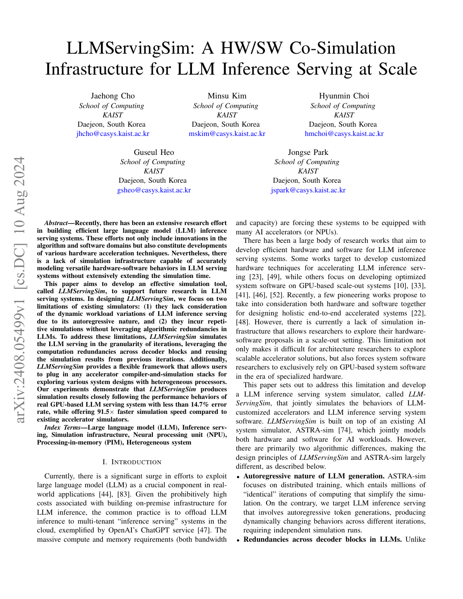

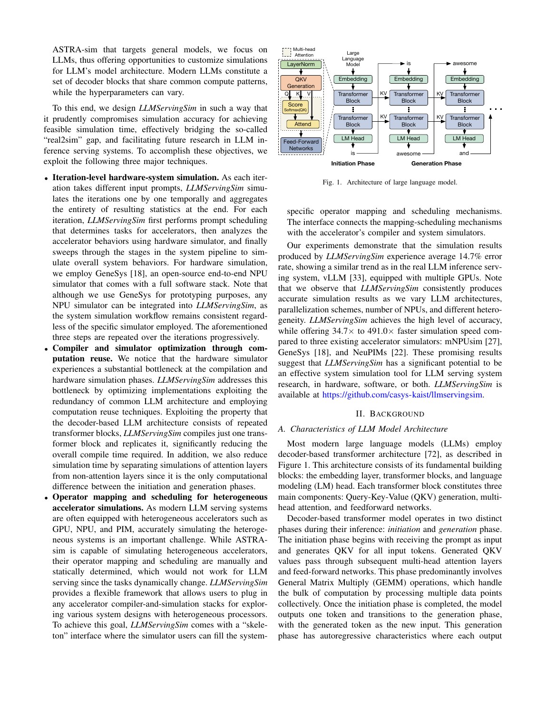

<strong>E002</strong> - 原笔记第 18 行 - PDF p.4

<strong>原定位：</strong> <code>Figure 4 给出完整工作流（PDF 第 4 页，§4.1）：Request Trace/Scheduler、Execution Engine Stack、Graph Converter、ASTRA-sim 通过 Chakra execution graph 串联。它不是只给整个 batch 一个经验时延，而是先产生算子图，再由硬件模拟器给节点代价，最终由系统模拟器重建跨设备时间线。</code>

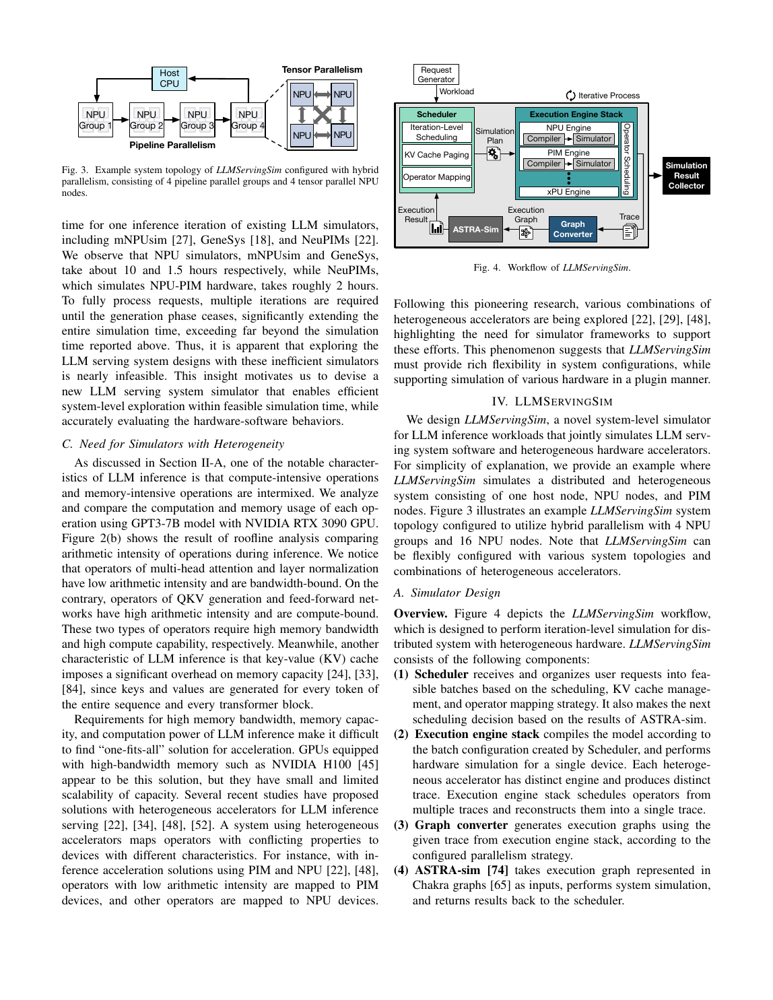

<strong>E003</strong> - 原笔记第 24 行 - PDF p.8, 15

<strong>原定位：</strong> <code>**[论文事实]** Artifact Appendix 规定输入 trace 为 TSV，每行包含 input length、output length、arrival time（PDF 第 15 页，Appendix A.4 “Data sets”）。实验使用 ShareGPT 与 Alpaca，模型覆盖 GPT-3/LLaMA 7B–175B（PDF 第 8 页 §6.1；第 14 页 Artifact checklist）。ShareGPT 请求按 Poisson 到达（PDF 第 8 页，§6.2，Figure 6 相邻设置）。</code>

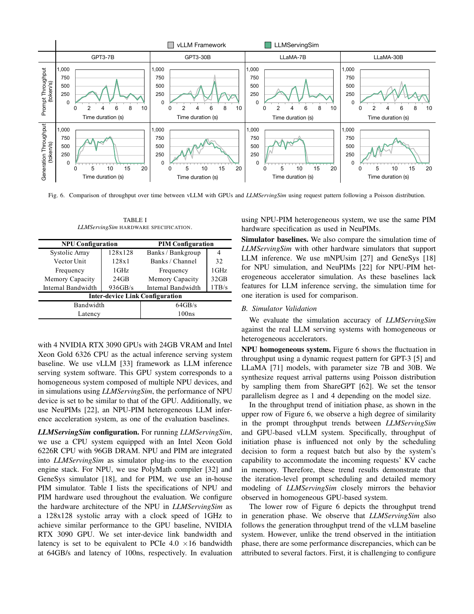

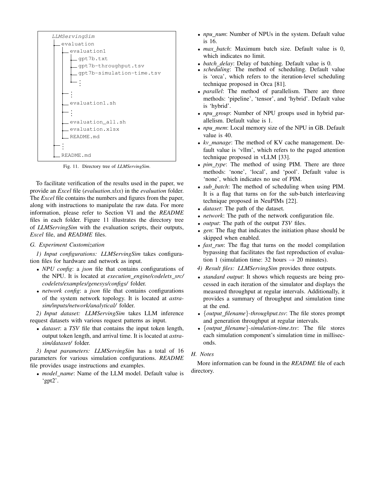

<strong>E004</strong> - 原笔记第 30 行 - PDF p.3, 5

<strong>原定位：</strong> <code>**[论文事实]** Scheduler 比较 request arrival time 与内部 timer，选择当前可调度请求；每轮硬件/系统仿真结束后，把结果反馈给 scheduler，更新时间并形成下一轮 batch（PDF 第 5 页，§4.1 “Iteration-level scheduling” 第 2 段）。论文采用 Orca 式 selective/iteration-level batching：不同序列长度的 attention 可以分开处理，其他算子共享 batch（PDF 第 3 页，§2；PDF 第 5 页该小节）。</code>

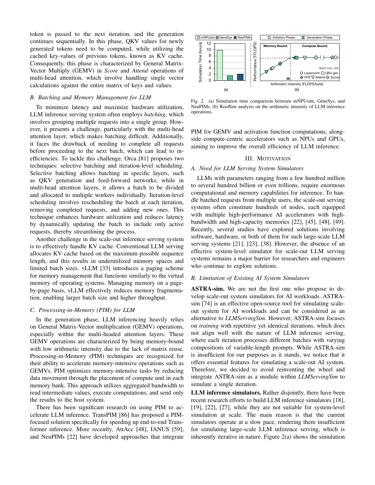

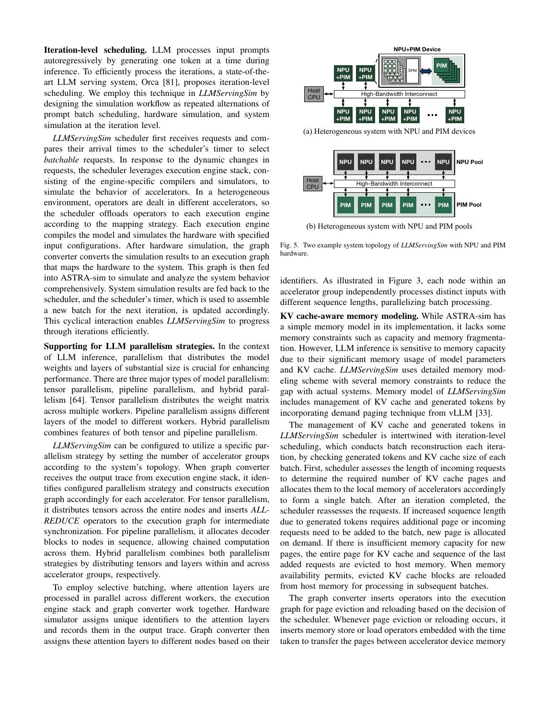

<strong>E005</strong> - 原笔记第 32 行 - PDF p.15

<strong>原定位：</strong> <code>Artifact 配置包含 max batch、batch delay、Orca scheduling、TP/PP/hybrid、设备内存与 vLLM KV management 等约 16 个参数（PDF 第 15 页，Appendix A.4 “How to run”）。因此它具备 continuous batching 的核心闭环，但论文没有给出 vLLM 当前版本中 priority、deadline、prefix-aware routing、chunked prefill 或 speculative decoding 的详细状态机。</code>

<strong>E006</strong> - 原笔记第 36 行 - PDF p.5

<strong>原定位：</strong> <code>**[论文事实]** 这是该论文比 Vidur 更细的一点。Scheduler 根据每个请求长度计算所需 KV page，并按迭代增长动态分配；若设备内存不足，会把最后加入请求的完整 KV pages 与 sequence 移到 host memory，后续容量允许时再 reload。Graph converter 显式插入 memory store/load transfer operators，并把传输时间交给系统模拟器（PDF 第 5 页，§4.1 “KV cache-aware memory modeling”；Figure 5 左侧相邻段）。</code>

<strong>E007</strong> - 原笔记第 42 行 - PDF p.5, 6

<strong>原定位：</strong> <code>**[论文事实]** Graph converter 支持 tensor parallel、pipeline parallel 及 hybrid；TP 会在执行图中插入 AllReduce，PP 将 decoder blocks 分配到不同节点并串接（PDF 第 5 页，§4.1 “Supporting for LLM parallelism strategies”）。Algorithm 1 将 request lengths、devices、free KV memory、current time 作为输入，依次进行 batch formatting、sub-batch partition、operator profiling/mapping、execution engine、scheduling 与 graph conversion（PDF 第 6 页，Algorithm 1）。</code>

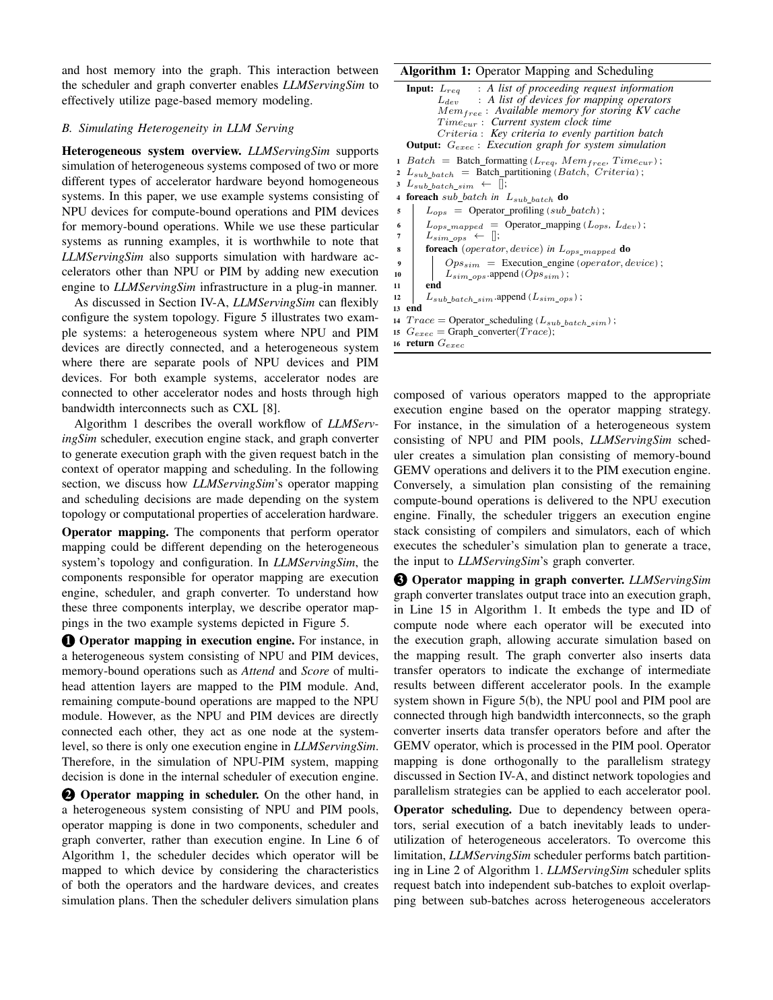

<strong>E008</strong> - 原笔记第 44 行 - PDF p.6, 7

<strong>原定位：</strong> <code>异构 NPU/PIM 场景中，operator mapper 把不同算子放入 NPU/PIM pool，插入数据搬运节点；greedy scheduler 同时考虑依赖与设备 availability，允许不同 sub-batch 在不同 accelerator 上重叠（PDF 第 6–7 页，§4.2，Figure 5 与 Algorithm 1 后续段）。</code>

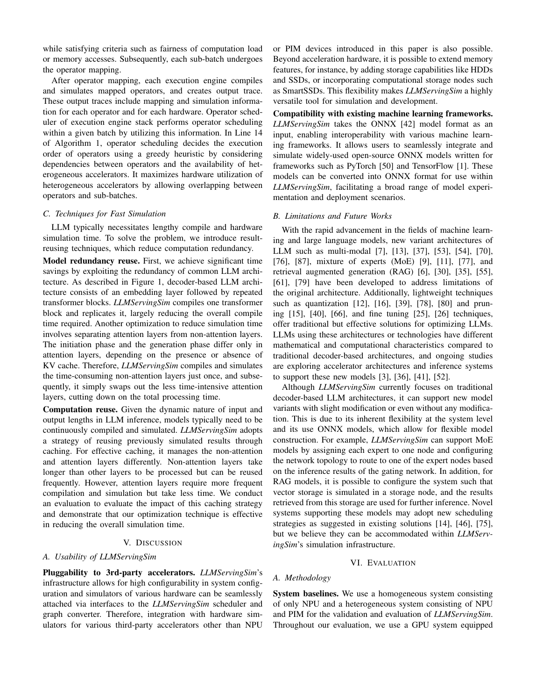

<strong>E009</strong> - 原笔记第 46 行 - PDF p.4, 5, 6

<strong>原定位：</strong> <code>**[论文事实]** 系统层以 Chakra execution graph 驱动 ASTRA-sim，因此 collective、interconnect、数据传输在系统仿真中推进，而非单纯相加（PDF 第 4–6 页，§4.1）。不过论文实验主要是抽象 NPU/PIM 拓扑，未展示生产以太网/IB 的拥塞校准，也没有逐 peer arrival/wait 的实机 profiler 对账。</code>

<strong>E010</strong> - 原笔记第 50 行 - PDF p.8

<strong>原定位：</strong> <code>**[论文事实]** 原型接入 GeneSys 作为 NPU compiler/simulator，另有 PolyMath 与 in-house PIM simulator（PDF 第 8 页，§6.1）。为避免每轮、每层重复模拟：</code>

<strong>E011</strong> - 原笔记第 56 行 - PDF p.7, 9

<strong>原定位：</strong> <code>该机制见 PDF 第 7 页，§4.3 “Accelerating the simulation”，并在 Figure 9 验证：缓存/复用带来 6.4–12.2× 加速，某些任务从 198–215.7 s 降到 16.3–33.6 s（PDF 第 9 页，§6.4，Figure 9）。</code>

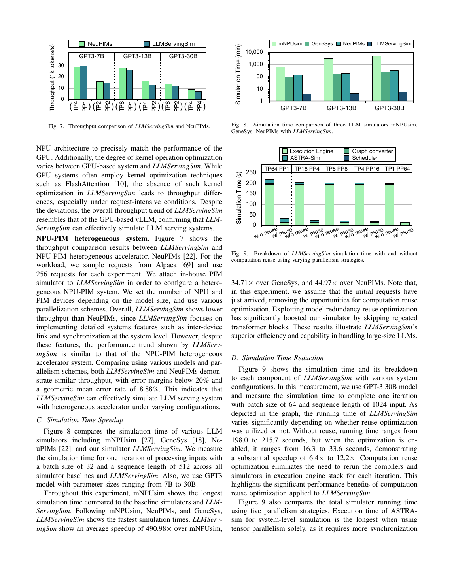

<strong>E012</strong> - 原笔记第 62 行 - PDF p.5

<strong>原定位：</strong> <code>**[论文事实]** 每个 iteration 的执行图在 ASTRA-sim 完成后推进 scheduler timer；输出包括请求吞吐、仿真吞吐和 simulation time TSV（PDF 第 5 页 §4.1；第 15 页 Appendix A.4）。正文主要比较 cycle、throughput 与 request latency，没有像 Vidur/Frontier 那样系统报告 TTFT、TBT/ITL、TPOT percentile 或 SLO violation。</code>

<strong>E013</strong> - 原笔记第 64 行 - PDF p.10

<strong>原定位：</strong> <code>可探索的 what-if 包括：TP/PP/hybrid、设备数、NPU/PIM 配比、batch size/delay、Orca scheduling、KV 内存和网络。论文从 8 扩到 2048 NPUs；GPT-3 175B 在 2048 NPU 上模拟一个 iteration 仍需 4.13 小时，揭示 cycle-level backend 的可扩展性上限（PDF 第 10 页，§6.5，Figure 10）。</code>

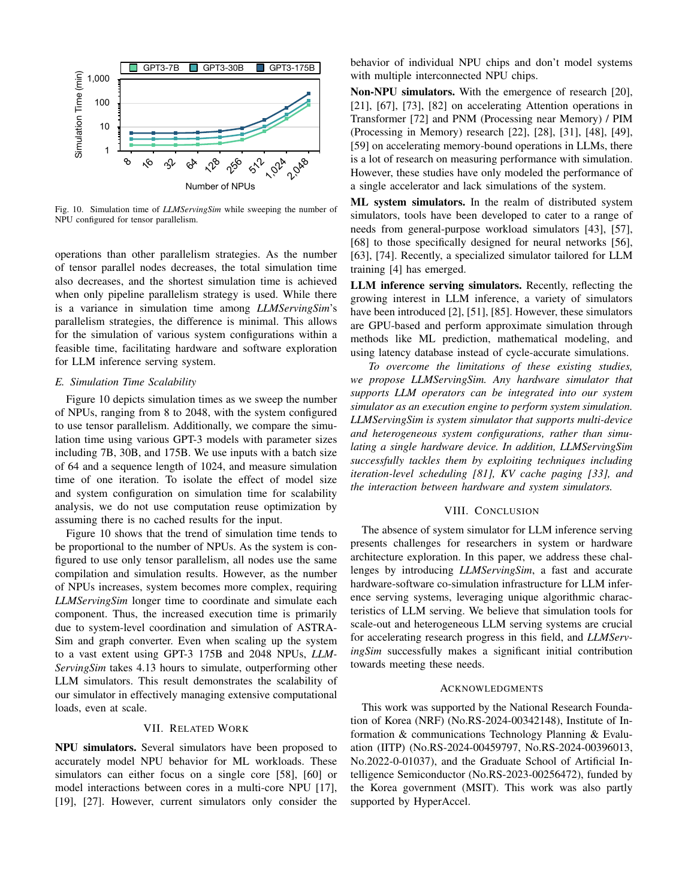

<strong>E014</strong> - 原笔记第 68 行 - PDF p.8

<strong>原定位：</strong> <code>**[论文事实]** 实机验证平台为 4×RTX 3090 24GB、Xeon Gold 6326、vLLM；仿真主机为 Xeon 6226R 96GB。模拟 NPU 为 128×128 systolic array、1GHz、24GB，链路 64GB/s、100ns；PIM 为 32GB、1TB/s（PDF 第 8 页，§6.1）。</code>

<strong>E015</strong> - 原笔记第 70 行 - PDF p.1

<strong>原定位：</strong> <code>- 对 vLLM 的 GPT-3/LLaMA 7B/30B、TP=1/4，论文报告性能趋势吻合，Abstract 汇总误差小于 14.7%（PDF 第 1 页 Abstract；详细图见第 8–9 页 Figure 6）；</code>

<strong>E016</strong> - 原笔记第 71 行 - PDF p.9

<strong>原定位：</strong> <code>- 对 NeuPIMs 的 NPU-PIM 场景，Alpaca 256 requests，误差小于 20%，几何平均 8.88%（PDF 第 9 页，§6.3，Figure 7）；</code>

<strong>E017</strong> - 原笔记第 72 行 - PDF p.9

<strong>原定位：</strong> <code>- 相比 mNPUsim、GeneSys、NeuPIMs，平均仿真加速分别为 490.98×、34.71×、44.97×（PDF 第 9 页，§6.4，Figure 8）。</code>

<strong>E018</strong> - 原笔记第 78 行 - PDF p.14, 15

<strong>原定位：</strong> <code>**[论文事实]** Artifact Appendix 给出公开 C++/Python 实现、MIT/CC4 许可、Zenodo DOI 10.5281/zenodo.12803583；建议 Ubuntu 18.04、x86-64、约 30GB 空间，完整 artifact 可从几十秒运行到 24 小时（PDF 第 14–15 页）。官方仓库为 https://github.com/casys-kaist/LLMServingSim 。</code>

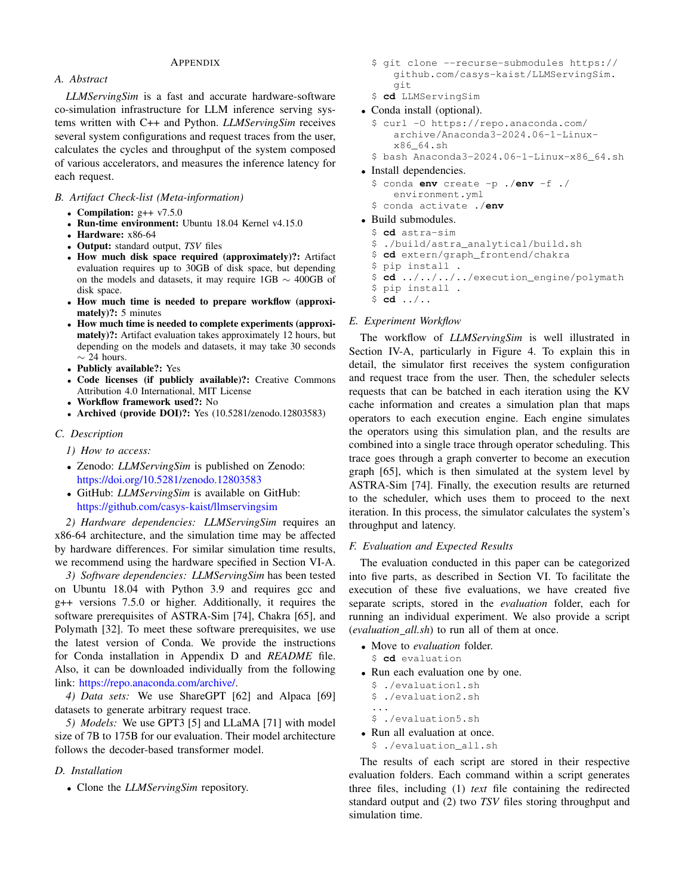

<!-- EVIDENCE_SCREENSHOTS:END -->
