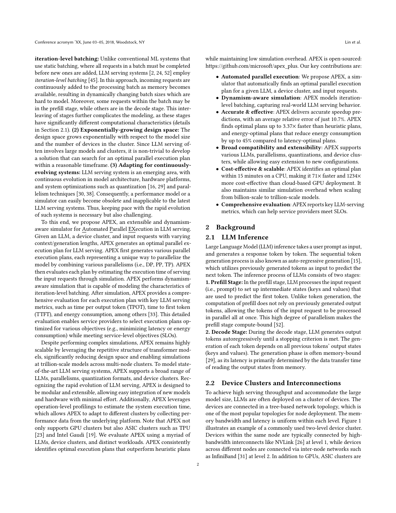
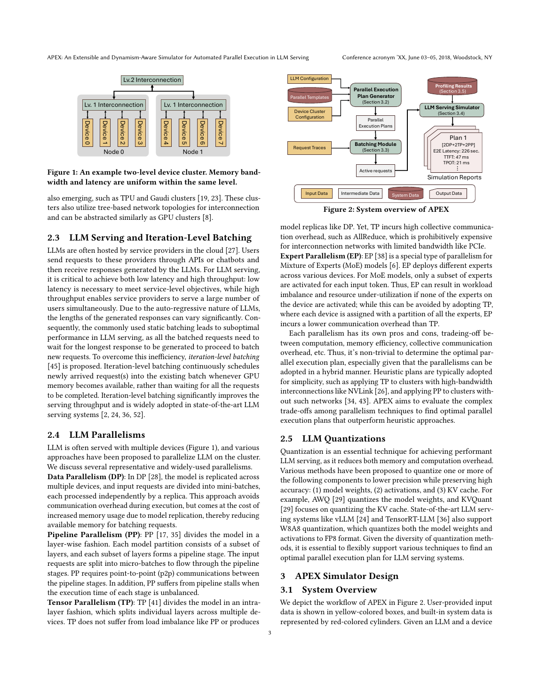
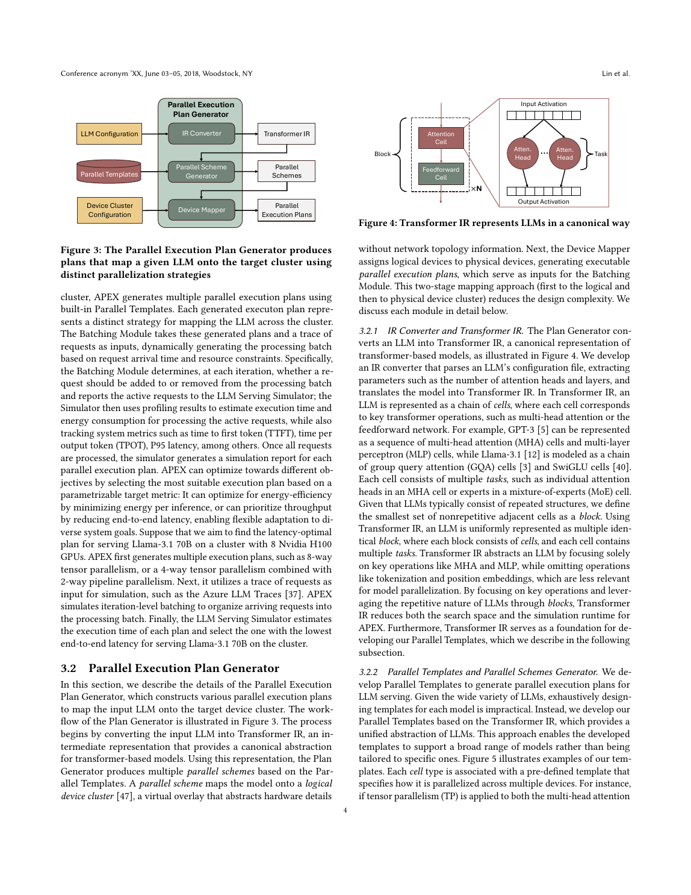
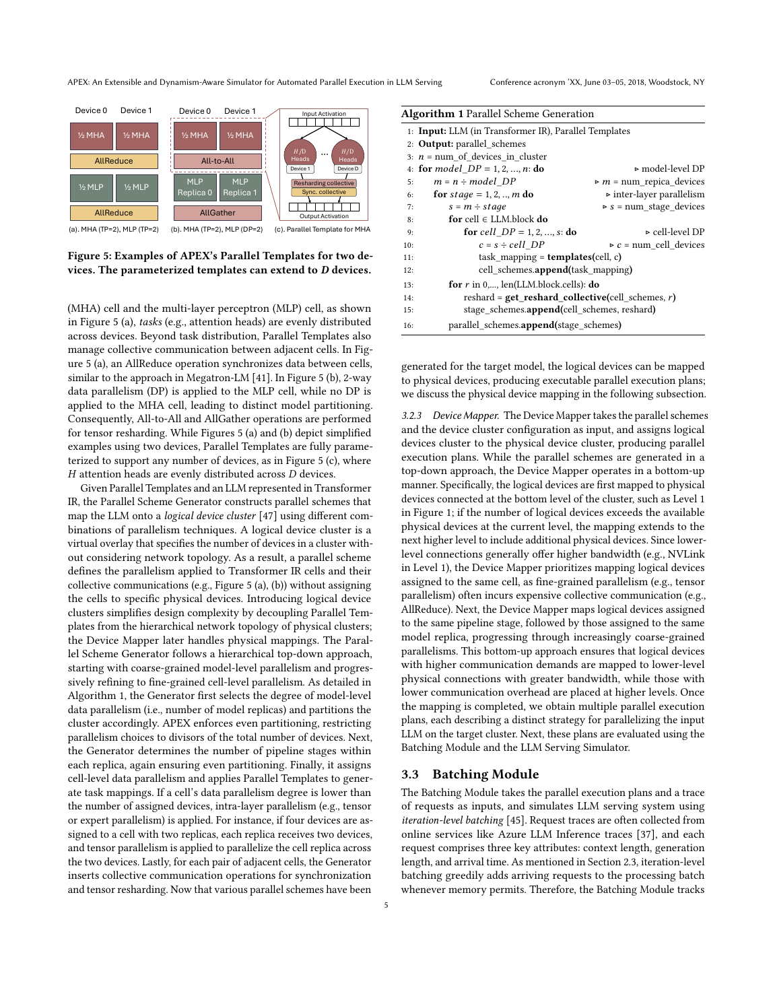
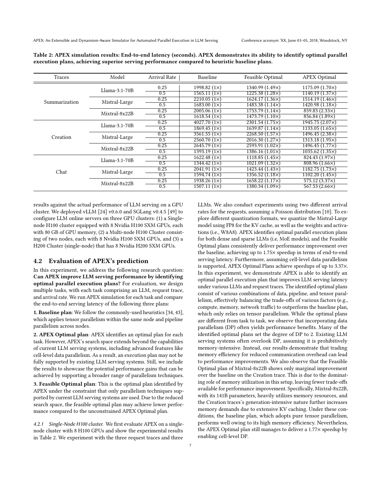
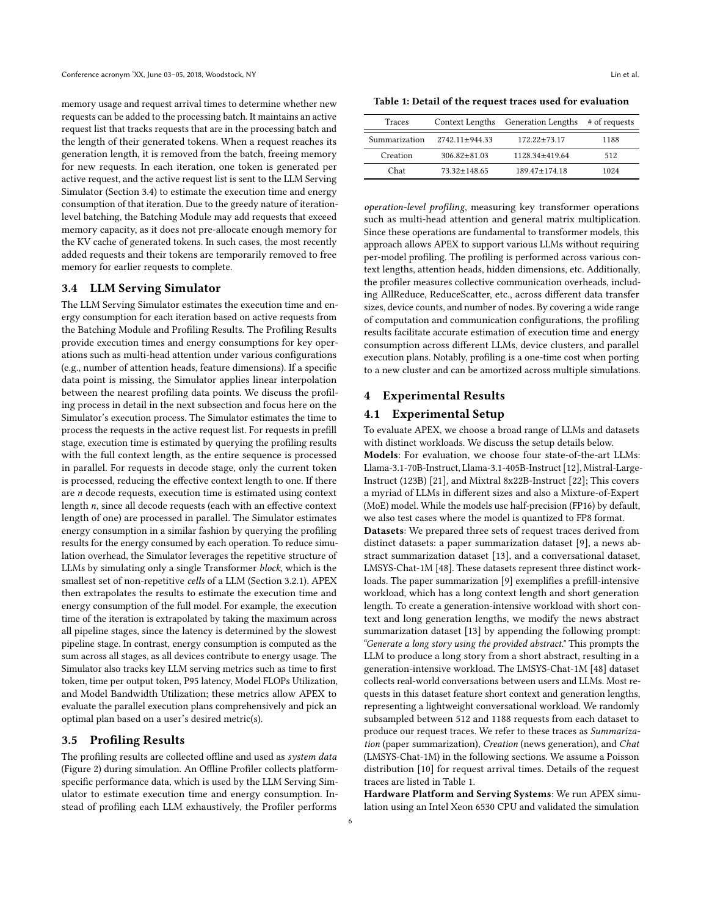
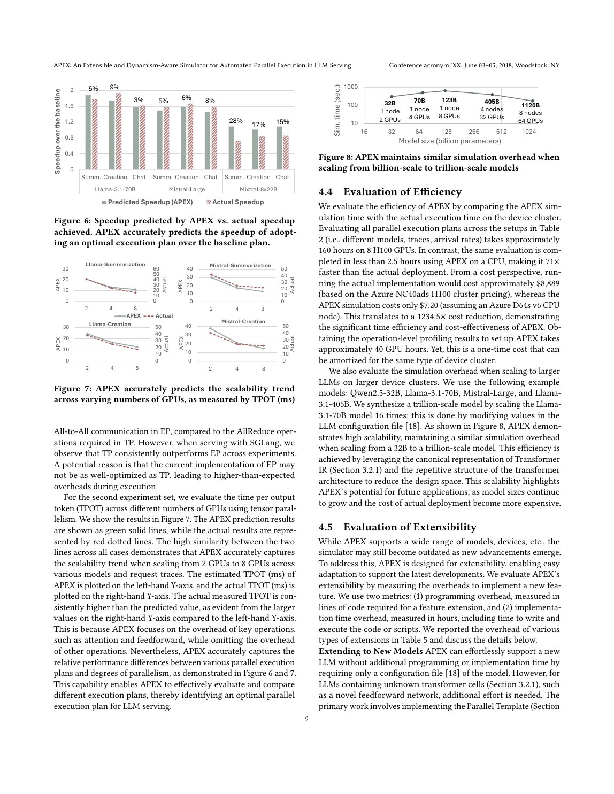
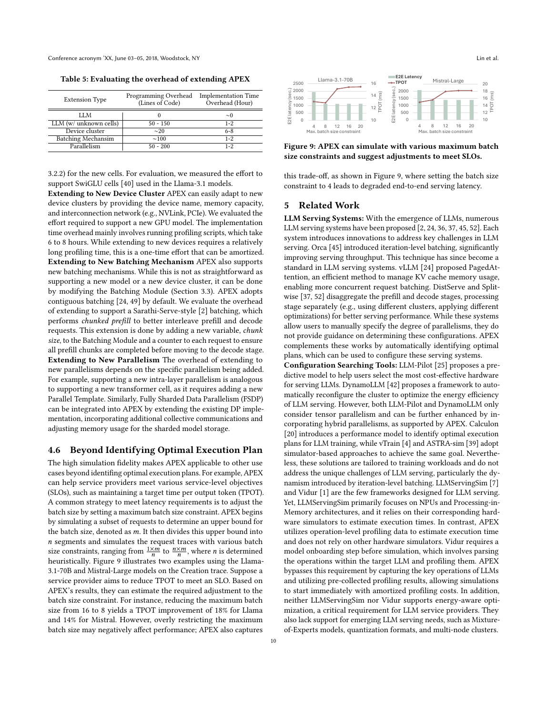
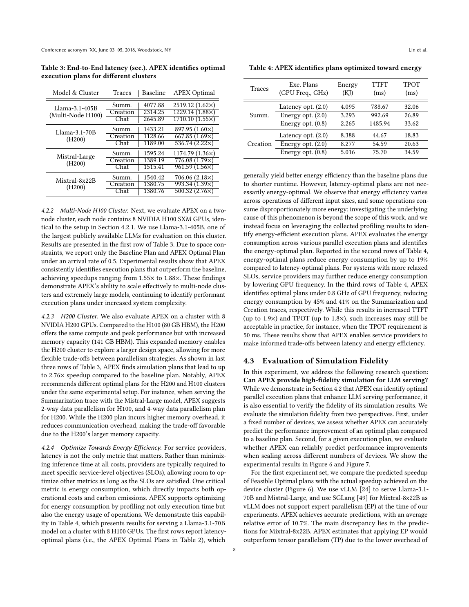

# APEX：自动搜索 LLM Serving 并行执行方案的动态仿真器

> 证据截图说明：正文中的 `原文截图 E###` 可跳转到文末证据卡片。截图按 PDF 物理页码生成；原有章节、图表、算法和段落定位保持不变。

> 论文：*APEX: An Extensible and Dynamism-Aware Simulator for Automated Parallel Execution in LLM Serving*，arXiv:2411.17651v2，2025-04-29。本文页码均为 PDF 物理页码。
>
> 版本说明：该 arXiv 条目的早期标题是 *Toward High-Performance LLM Serving: A Simulation-Based Approach for Identifying Optimal Parallelism*；本调研以用户链接当前下载到的 v2 PDF 为准。PDF 页眉仍保留 “Conference acronym 'XX” 等模板占位，故不能从论文自身确认正式录用 venue。
>
> 证据标记：**[论文事实]**、**[综合判断]**、**[迁移推断]**、**[未知]**。

## 1. 问题与方法概览

**[论文事实]** APEX 解决的是 LLM serving 并行策略组合爆炸：模型计算、显存、通信、请求动态 batching 和硬件拓扑相互耦合，手工选择 TP/PP/DP/EP 往往不是最优。其方法是把模型表示成 Transformer IR，基于 Parallel Templates 枚举 cell 级并行方案，将逻辑设备映射到物理拓扑，再用请求级 batching simulator 与 profile database 评估 TTFT、TPOT、吞吐、能耗和 SLO（PDF 第 2 页，§1 贡献段；第 3–6 页，§3，Figure 2–5）。 〔[原文截图 E001](#evidence-e001)〕

框架的核心模块为（PDF 第 3–4 页，§3.1，Figure 2）： 〔[原文截图 E002](#evidence-e002)〕

- Model Representation：block → cells → tasks；
- Parallel Scheme Generator：从模板组合模型级、stage 级、cell 级并行；
- Device Mapper：逻辑 cluster 到物理设备/层次化网络；
- Batching Module：读请求 trace，迭代级形成 batch；
- LLM Serving Simulator：查询代价、推进请求并汇总指标。

**[综合判断]** APEX 的主要创新是“自动并行搜索”，而不是最高保真的 serving 状态复现。它比 Vidur 的并行空间更细，但 scheduler、KV 和网络时间线更抽象。

## 2. 模型 IR、并行与物理映射

### 2.1 Transformer IR

**[论文事实]** 模型被拆成 Transformer blocks；每个 block 再拆成 attention、MLP 等 cells，cell 内是 GEMM/attention/collective 等 tasks。Tokenization 和 positional embedding 被忽略，理由是其占比小（PDF 第 3–4 页，§3.1，Figure 3 相邻段）。对录制回放而言，这意味着端到端前后处理不在其因果图中。 〔[原文截图 E003](#evidence-e003)〕

### 2.2 并行方案生成

**[论文事实]** Parallel Templates 定义 cell 的数据切分、task mapping 和同步 collective。Figure 5 展示两设备 MHA/MLP 的 TP、DP 与 AllReduce/AllGather；Algorithm 1 从 model-level DP 开始，自顶向下选择 PP stage，再在 cell 内组合 TP/DP/EP，必要时插入 reshard collective（PDF 第 5 页，§3.2.2，Figure 5、Algorithm 1）。 〔[原文截图 E004](#evidence-e004)〕

论文支持的设计空间包括 DP、PP、TP、EP，以及更细的 cell-level data parallel。后者在当时 vLLM/SGLang 中未必可执行，因此作者把结果分成 feasible optimal 与 unconstrained APEX（PDF 第 7 页，§4.2，Table 2 前后段）。 〔[原文截图 E005](#evidence-e005)〕

### 2.3 Device Mapper

**[论文事实]** Device Mapper 先把逻辑设备映射到低层、带宽更高的物理连接，再逐级扩展；通信重的 cell 尽量放在 NVLink 等低层域，较粗粒度并行可跨更高层网络（PDF 第 5 页，§3.2.3）。 〔[原文截图 E006](#evidence-e006)〕

**[综合判断]** 这是 topology-aware binding，但尚不是可执行重放所需的完整 Physical Binding：论文未给出 rank-device-stream、实际 kernel、collective algorithm/channel、graph address 和 storage layout 等约束。

## 3. Serving 工作负载、调度与状态

### 3.1 请求分布

**[论文事实]** 每个请求包含 context length、generation length、arrival time，按 Poisson 到达。Table 1 给出三类 trace（PDF 第 6 页，§3.5，Table 1）： 〔[原文截图 E007](#evidence-e007)〕

| 类型 | 请求数 | context length | generation length |
|---|---:|---:|---:|
| Summarization | 1,188 | 2,742 ± 944 | 172 ± 73 |
| Creation | 512 | 307 ± 81 | 1,128 ± 420 |
| Chat | 1,024 | 73 ± 149 | 189 ± 174 |

**[综合判断]** 长度分布可驱动 prefill/decode 比例，但没有 token、prefix、session/agent round、burst correlation 或 route key。

### 3.2 Iteration batching、admission 与抢占

**[论文事实]** Batching Module 维护 active request list；每轮给每个 decode 请求生成一个 token，记录 generated length，并在显存允许时贪心接纳新请求。若超过显存，会临时移除最近加入的请求及其 token，随后重新进入处理（PDF 第 5–6 页，§3.3，定位词 “active request list” 与 “most recently added requests”）。 〔[原文截图 E008](#evidence-e008)〕

默认实现是 contiguous batching。作为可扩展性例子，作者约用 100 行代码加入 Sarathi 式 chunked prefill：增加 chunk-size 与 request counter（PDF 第 9–10 页，§4.5 “Batching Schemes”）。 〔[原文截图 E009](#evidence-e009)〕

**[综合判断]** 论文的 “temporarily removed” 近似抢占/重启，但没有说明 KV 是 swap、discard 还是 recompute，也没有 page/block/slot 状态。它可以估算容量引发的 batch 变化，不能复现 vLLM/SGLang 的具体 eviction 或 recomputation 路径。

### 3.3 Prefill/decode 与指标

**[论文事实]** Prefill 查询完整 context length；decode 将 batch 折叠为 context length n 的查询，并假设每请求每轮一个 token。单 block 代价外推到全模型，PP iteration time 取最慢 stage，能耗为各 stage 求和（PDF 第 6 页，§3.4）。指标包括 TTFT、TPOT、P95 latency、MFU、MBU 和能耗（同页 §3.4 末段）。 〔[原文截图 E010](#evidence-e010)〕

论文主要使用 TPOT，不系统报告 ITL/TBT 的完整分布；SLO what-if 可约束 TTFT/TPOT，但没有给出 queueing deadline、goodput 或 violation ratio 的统一定义。

## 4. Operator/kernel、通信与时间推进

### 4.1 代价模型

**[论文事实]** APEX 离线 profile attention、GEMM 与 collective；未见形状用相邻采样点线性插值。通信 profile 覆盖 AllReduce、ReduceScatter 等，不同传输大小、设备数与跨节点配置；新集群只需一次 profile（PDF 第 6 页，§3.5 “Profiling Database”）。 〔[原文截图 E011](#evidence-e011)〕

**[综合判断]** 这是典型“查表+插值”。它没有用输入 shape 之外的运行时特征表达 CUDA Graph padding、KV block 分布、MoE load imbalance、CPU launch overhead 或网络并发。因此相对 speedup 往往比绝对时延更可靠。

### 4.2 Event model

**[论文事实]** 请求按 arrival 加入队列，每个 iteration 形成 batch；并行执行计划给出 cell/task 与设备映射，模拟器汇总 PP stages 的耗时并推进请求（PDF 第 5–6 页，§3.3–§3.4）。 〔[原文截图 E012](#evidence-e012)〕

**[综合判断]** 论文没有展示全局 event queue、stream overlap、collective peer-ready、链路并发或 prefill/decode 传输事件。因此 APEX 更像“迭代级解析/查表仿真”，不是 trace-DAG 的离散事件回放。网络代价依附于 task，不足以区分 message、wait、transit。

## 5. 校准、实验与关键数字

**[论文事实]** 实验主机为 Xeon 6530；实机基线使用 vLLM 0.6.0 与 SGLang 0.4.5，集群包括 8×H100 80GB、16×H100 多机和 8×H200 141GB（PDF 第 7 页，§4.1）。 〔[原文截图 E013](#evidence-e013)〕

- Table 2：unconstrained APEX 方案最高 3.37×；只保留当前 serving 系统可实现方案时最高 1.75×（PDF 第 7–8 页，§4.2，Table 2）； 〔[原文截图 E014](#evidence-e014)〕
- H200 上最高 2.76×，405B 模型在 16×H100 上最高 1.88×（PDF 第 8 页，§4.2 末段）； 〔[原文截图 E015](#evidence-e015)〕
- 相对 speedup 平均误差 10.7%（PDF 第 8–9 页，§4.3，Figure 6–7）；Mixtral EP 的误差为 28%/17%/15%，作者归因于 SGLang EP 实现不如模拟器假设的理想实现（同节）； 〔[原文截图 E016](#evidence-e016)〕
- APEX 的绝对 TPOT 系统性偏低，因为省略了 “other operations”，但相对趋势较准（PDF 第 9 页，§4.3 “Absolute Performance” 段）； 〔[原文截图 E017](#evidence-e017)〕
- 搜索若实机运行约需 160 GPUh；APEX 少于 2.5 CPUh，71× 更快，估算成本 8,889 美元 vs 7.20 美元，约 1,234.5×（PDF 第 9 页，§4.4）；profile 约 40 GPUh，但可复用； 〔[原文截图 E018](#evidence-e018)〕
- 同频能耗最多下降 19%；降频到 0.8GHz 可最多下降 45%，代价是 TTFT/TPOT 增加（PDF 第 8 页，§4.2，Energy Table）。 〔[原文截图 E019](#evidence-e019)〕

**[论文事实]** Trillion-parameter 实验是把 Llama-70B 配置放大 16 倍得到的合成模型，不是实机 trillion 模型验证（PDF 第 9 页，§4.4 末段）。 〔[原文截图 E020](#evidence-e020)〕

## 6. What-if 与可扩展性

APEX 适合回答：模型/trace/硬件给定时，选择何种 TP/PP/DP/EP/cell-level 组合；逻辑设备如何映射到拓扑；batch/chunk size 如何影响 TTFT、TPOT、吞吐、能耗与 SLO；更大 HBM 或更多设备是否改变 Pareto 前沿。

**[论文事实]** 作者报告新增 unknown cell 约 50–150 LoC/1–2h，device cluster 约 20 LoC/6–8h，batching 约 100 LoC/1–2h，parallelism 约 50–200 LoC/1–2h（PDF 第 9–10 页，§4.5）。这些是作者经验，不等价于第三方复现成本。 〔[原文截图 E021](#evidence-e021)〕

不适合回答：具体 kernel/graph 是否走同一路径、KV allocator 是否正确、collective 是否因 peer late arrival 等待、token/prefix/spec 分支是否一致。

## 7. 落地、开源与成熟度

**[论文事实]** 官方公开仓库为 https://github.com/microsoft/apex_plus ，MIT 许可，并有 Zenodo DOI 10.5281/zenodo.15300595；截至 2026-08-06 可见模型、硬件 profile、validation 与配置搜索代码。

**[综合判断]** 成熟度为“公开研究原型”。代码公开提升了可复现性，但论文 PDF 仍有 venue 模板占位；应避免写成“已在某顶会落地”。另外 unconstrained 最优可能依赖 serving engine 尚不支持的 cell-level DP，论文已经用 feasible optimal 单独区分，这一点在结论中必须保留。

## 8. 优缺点与失效边界

### 优点

- 并行搜索空间细到 cell，能发现手工 TP/PP/EP 之外的组合；
- 逻辑方案与物理拓扑分离，便于快速换硬件；
- 以相对 speedup/能耗/SLO 为目标，搜索成本低；
- 模块扩展成本小，公开 profile 和验证目录可复用。

### 缺点与边界

- 绝对时延遗漏 other operations，论文已观察到系统性低估；
- 线性插值难处理 kernel dispatch、Graph bucket 与极端 shape；
- KV、抢占、chunk 状态过粗；无 prefix/spec/PD disaggregation；
- 通信是 profile cost，没有显式 peer arrival、拥塞与 overlap；
- 某些“最优”方案在实际 serving engine 中不可执行；
- 合成 trillion 模型与生产结果不能当成端到端实机验证。

## 9. 与录制回放分层的对应

| 模块 | APEX 对应 | 完整度 |
|---|---|---|
| Execution Recipe | 模型 IR、trace、batch、并行模板 | 中高 |
| Physical Binding | logical cluster → hierarchical devices | 中；缺具体 runtime binding |
| Observation Ledger | operator/collective profile DB | 中；缺原始事件/provenance |
| Cost Model | profile + linear interpolation | 中高 |
| Event Runtime | iteration/batch/stage 汇总 | 中低 |
| Serving State | active list、generated length、memory admission | 低；无 KV page/prefix/spec |

结论：APEX 是“**并行方案生成器 + 性能估算器**”，不是 functional/path replay；它适合 workload/performance what-if，且相对排序比绝对时间更可信。

## 10. Ascend / CANN / HCCL 迁移建议

**[迁移推断]**

1. 保留 Parallel Templates，但模板必须绑定到 Ascend 上真实可实现的 TP/EP/SP/PP primitives；unconstrained 与 executable 两套空间必须分开。
2. Device Mapper 需理解 SuperPod/机内互联/跨机 RoCE 的分层域，并把 rank placement、HCCL group、算法/通道约束写入 Physical Binding。
3. Profile DB key 应加入 CANN/torch_npu 版本、SoC、dtype、format、tiling、dynamic-shape bucket、workspace、Graph 模式；插值前先做合法性和路径一致性检查。
4. 把 HCCL collective 从单一 cost 扩展为 ready/wait/transit 事件，加入并发通信的带宽共享与 compute-communication overlap。
5. 接 vLLM/SGLang Ascend 时补齐 block-table、slot、prefix cache、chunked prefill、preemption/recompute、PD KV-transfer 状态；否则搜索出的 batch/并行方案可能与真实 runtime 不一致。
6. 报告时同时给 absolute error、relative ranking error、extrapolation distance 与 profile coverage，避免只用 speedup 掩盖系统性偏差。

## 11. 一句话评价

APEX 擅长低成本发现并行策略和拓扑映射机会，但其 serving 状态和事件模型较薄；把它纳入录制回放体系时，应定位为 Cost Model/搜索器，而非真实性基准。

<!-- EVIDENCE_SCREENSHOTS:BEGIN -->

## 原文证据截图附录

正文中的 `原文截图 E###` 与本节一一对应。卡片保留原笔记行号和原有页码/章节定位；图片按 PDF 物理页生成。截图用于快速核读，正式引用仍以原论文为准。

<strong>E001</strong> - 原笔记第 14 行 - PDF p.2

<strong>原定位：</strong> <code>**[论文事实]** APEX 解决的是 LLM serving 并行策略组合爆炸：模型计算、显存、通信、请求动态 batching 和硬件拓扑相互耦合，手工选择 TP/PP/DP/EP 往往不是最优。其方法是把模型表示成 Transformer IR，基于 Parallel Templates 枚举 cell 级并行方案，将逻辑设备映射到物理拓扑，再用请求级 batching simulator 与 profile database 评估 TTFT、TPOT、吞吐、能耗和 SLO（PDF 第 2 页，§1 贡献段；第 3–6 页，§3，Figure 2–5）。</code>

<strong>E002</strong> - 原笔记第 16 行 - PDF p.3, 4

<strong>原定位：</strong> <code>框架的核心模块为（PDF 第 3–4 页，§3.1，Figure 2）：</code>

<strong>E003</strong> - 原笔记第 30 行 - PDF p.3, 4

<strong>原定位：</strong> <code>**[论文事实]** 模型被拆成 Transformer blocks；每个 block 再拆成 attention、MLP 等 cells，cell 内是 GEMM/attention/collective 等 tasks。Tokenization 和 positional embedding 被忽略，理由是其占比小（PDF 第 3–4 页，§3.1，Figure 3 相邻段）。对录制回放而言，这意味着端到端前后处理不在其因果图中。</code>

<strong>E004</strong> - 原笔记第 34 行 - PDF p.5

<strong>原定位：</strong> <code>**[论文事实]** Parallel Templates 定义 cell 的数据切分、task mapping 和同步 collective。Figure 5 展示两设备 MHA/MLP 的 TP、DP 与 AllReduce/AllGather；Algorithm 1 从 model-level DP 开始，自顶向下选择 PP stage，再在 cell 内组合 TP/DP/EP，必要时插入 reshard collective（PDF 第 5 页，§3.2.2，Figure 5、Algorithm 1）。</code>

<strong>E005</strong> - 原笔记第 36 行 - PDF p.7

<strong>原定位：</strong> <code>论文支持的设计空间包括 DP、PP、TP、EP，以及更细的 cell-level data parallel。后者在当时 vLLM/SGLang 中未必可执行，因此作者把结果分成 feasible optimal 与 unconstrained APEX（PDF 第 7 页，§4.2，Table 2 前后段）。</code>

<strong>E006</strong> - 原笔记第 40 行 - PDF p.5

<strong>原定位：</strong> <code>**[论文事实]** Device Mapper 先把逻辑设备映射到低层、带宽更高的物理连接，再逐级扩展；通信重的 cell 尽量放在 NVLink 等低层域，较粗粒度并行可跨更高层网络（PDF 第 5 页，§3.2.3）。</code>

<strong>E007</strong> - 原笔记第 48 行 - PDF p.6

<strong>原定位：</strong> <code>**[论文事实]** 每个请求包含 context length、generation length、arrival time，按 Poisson 到达。Table 1 给出三类 trace（PDF 第 6 页，§3.5，Table 1）：</code>

<strong>E008</strong> - 原笔记第 60 行 - PDF p.5, 6

<strong>原定位：</strong> <code>**[论文事实]** Batching Module 维护 active request list；每轮给每个 decode 请求生成一个 token，记录 generated length，并在显存允许时贪心接纳新请求。若超过显存，会临时移除最近加入的请求及其 token，随后重新进入处理（PDF 第 5–6 页，§3.3，定位词 “active request list” 与 “most recently added requests”）。</code>

<strong>E009</strong> - 原笔记第 62 行 - PDF p.9, 10

<strong>原定位：</strong> <code>默认实现是 contiguous batching。作为可扩展性例子，作者约用 100 行代码加入 Sarathi 式 chunked prefill：增加 chunk-size 与 request counter（PDF 第 9–10 页，§4.5 “Batching Schemes”）。</code>

<strong>E010</strong> - 原笔记第 68 行 - PDF p.6

<strong>原定位：</strong> <code>**[论文事实]** Prefill 查询完整 context length；decode 将 batch 折叠为 context length n 的查询，并假设每请求每轮一个 token。单 block 代价外推到全模型，PP iteration time 取最慢 stage，能耗为各 stage 求和（PDF 第 6 页，§3.4）。指标包括 TTFT、TPOT、P95 latency、MFU、MBU 和能耗（同页 §3.4 末段）。</code>

<strong>E011</strong> - 原笔记第 76 行 - PDF p.6

<strong>原定位：</strong> <code>**[论文事实]** APEX 离线 profile attention、GEMM 与 collective；未见形状用相邻采样点线性插值。通信 profile 覆盖 AllReduce、ReduceScatter 等，不同传输大小、设备数与跨节点配置；新集群只需一次 profile（PDF 第 6 页，§3.5 “Profiling Database”）。</code>

<strong>E012</strong> - 原笔记第 82 行 - PDF p.5, 6

<strong>原定位：</strong> <code>**[论文事实]** 请求按 arrival 加入队列，每个 iteration 形成 batch；并行执行计划给出 cell/task 与设备映射，模拟器汇总 PP stages 的耗时并推进请求（PDF 第 5–6 页，§3.3–§3.4）。</code>

<strong>E013</strong> - 原笔记第 88 行 - PDF p.7

<strong>原定位：</strong> <code>**[论文事实]** 实验主机为 Xeon 6530；实机基线使用 vLLM 0.6.0 与 SGLang 0.4.5，集群包括 8×H100 80GB、16×H100 多机和 8×H200 141GB（PDF 第 7 页，§4.1）。</code>

<strong>E014</strong> - 原笔记第 90 行 - PDF p.7, 8

<strong>原定位：</strong> <code>- Table 2：unconstrained APEX 方案最高 3.37×；只保留当前 serving 系统可实现方案时最高 1.75×（PDF 第 7–8 页，§4.2，Table 2）；</code>

<strong>E015</strong> - 原笔记第 91 行 - PDF p.8

<strong>原定位：</strong> <code>- H200 上最高 2.76×，405B 模型在 16×H100 上最高 1.88×（PDF 第 8 页，§4.2 末段）；</code>

<strong>E016</strong> - 原笔记第 92 行 - PDF p.8, 9

<strong>原定位：</strong> <code>- 相对 speedup 平均误差 10.7%（PDF 第 8–9 页，§4.3，Figure 6–7）；Mixtral EP 的误差为 28%/17%/15%，作者归因于 SGLang EP 实现不如模拟器假设的理想实现（同节）；</code>

<strong>E017</strong> - 原笔记第 93 行 - PDF p.9

<strong>原定位：</strong> <code>- APEX 的绝对 TPOT 系统性偏低，因为省略了 “other operations”，但相对趋势较准（PDF 第 9 页，§4.3 “Absolute Performance” 段）；</code>

<strong>E018</strong> - 原笔记第 94 行 - PDF p.9

<strong>原定位：</strong> <code>- 搜索若实机运行约需 160 GPUh；APEX 少于 2.5 CPUh，71× 更快，估算成本 8,889 美元 vs 7.20 美元，约 1,234.5×（PDF 第 9 页，§4.4）；profile 约 40 GPUh，但可复用；</code>

<strong>E019</strong> - 原笔记第 95 行 - PDF p.8

<strong>原定位：</strong> <code>- 同频能耗最多下降 19%；降频到 0.8GHz 可最多下降 45%，代价是 TTFT/TPOT 增加（PDF 第 8 页，§4.2，Energy Table）。</code>

<strong>E020</strong> - 原笔记第 97 行 - PDF p.9

<strong>原定位：</strong> <code>**[论文事实]** Trillion-parameter 实验是把 Llama-70B 配置放大 16 倍得到的合成模型，不是实机 trillion 模型验证（PDF 第 9 页，§4.4 末段）。</code>

<strong>E021</strong> - 原笔记第 103 行 - PDF p.9, 10

<strong>原定位：</strong> <code>**[论文事实]** 作者报告新增 unknown cell 约 50–150 LoC/1–2h，device cluster 约 20 LoC/6–8h，batching 约 100 LoC/1–2h，parallelism 约 50–200 LoC/1–2h（PDF 第 9–10 页，§4.5）。这些是作者经验，不等价于第三方复现成本。</code>

<!-- EVIDENCE_SCREENSHOTS:END -->
