# Charon：统一、细粒度的训练/推理仿真器

> 证据截图说明：正文中的 `原文截图 E###` 可跳转到文末证据卡片。截图按 PDF 物理页码生成；原有章节、图表、算法和段落定位保持不变。

> 论文正式标题：*Charon: A Unified and Fine-Grained Simulator for Large-Scale LLM Training and Inference*，arXiv:2605.17164v2，MLSys 2026。本文页码均为 PDF 物理页码。MLSys 录用状态可由官方 proceedings 确认；截至 2026-08-06 未发现论文作者提供的公开代码仓库。
>
> 标题核验：arXiv v1 与本地 v2 PDF 首页/元数据、MLSys 2026 proceedings 均使用上述正式标题；调研初稿中的 *A Unified Simulator for Large-Scale LLM Training and Inference* 只是省略 “and Fine-Grained” 的简称，并非正式版本标题。
>
> 证据标记：**[论文事实]**、**[综合判断]**、**[迁移推断]**、**[未知]**。

## 1. 目标、定位与架构

**[论文事实]** Charon 试图用一个框架同时模拟大规模 LLM training 与 inference，并避免现有工具在模型表达、编译优化、算子/通信代价和细粒度 timeline 上的割裂。Table 1 声称覆盖原生 HuggingFace/PyTorch/vLLM 模型、operator-level graph、profiling/prediction/analytical 多后端、TP/PP/DP/EP/SP/ZeRO/DualPipe 与 3D trace（PDF 第 2 页，§1，Table 1）。 〔[原文截图 E001](#evidence-e001)〕

总体流程是（PDF 第 4–8 页，§3，Figure 2–5）： 〔[原文截图 E002](#evidence-e002)〕

1. 直接实例化原生 PyTorch/HuggingFace/vLLM 模型；
2. 用 FX/torch.compile tracing 得到计算图；
3. compiler passes 做 fusion、quantization 和并行 rewrite，插入 collective/send-recv；
4. scheduler 按依赖生成设备 timeline；
5. 每个 operator 由 profiling、prediction、analytical 或 fused backend 估时；
6. 汇总 latency、memory、utilization 与 3D trace，并执行设计空间搜索。

**[综合判断]** Charon 的强项是 Execution Recipe 到可执行 operator graph 的编译映射，以及 compute/communication/overlap 的统一代价；其 serving scheduler 和 KV 状态明显弱于 Frontier。

## 2. 原生模型、计算图与编译变换

### 2.1 图捕获

**[论文事实]** Charon 不要求用户手写 abstract model spec，而是直接 trace 原生实现。为降低图规模，它通常只 trace 一个 Transformer block，再按层数复制；对于非对称层或 PP，可保留不同 layer graph（PDF 第 4 页，§3.1 “Graph Tracing”）。 〔[原文截图 E003](#evidence-e003)〕

论文还说明可分别 trace prefill 与 decode graph，从而“enable disaggregated serving”（PDF 第 4–5 页，§3.1 末段）。 〔[原文截图 E004](#evidence-e004)〕

**[综合判断]** 这里的 disaggregated serving 证据只到“可分开生成两个计算图”。论文没有给出 prefill worker 到 decode worker 的 KV-transfer、route、admission、backpressure、缓存一致性或跨 cluster DES，因此不能把它等同于 Frontier 的 PDD 仿真。

### 2.2 Compiler passes

**[论文事实]** 编译器执行 graph fusion、rewrite、quantization，以及 TP/SP/EP/PP/DP/FSDP/ZeRO/DualPipe 等变换；根据并行语义插入 AllReduce、AllGather、ReduceScatter、Send/Recv，并生成每设备执行图（PDF 第 5–6 页，§3.2，Figure 3–4）。 〔[原文截图 E005](#evidence-e005)〕

**[综合判断]** 这为 Physical Binding 提供了比“按整层估时”更细的基础，尤其适合回答 fusion、precision 与并行 rewrite 如何改变算子图。但论文没有说明 CUDAGraph capture、kernel autotuning key、地址/allocator、KV block table 等低层绑定。

## 3. Serving workload、调度与指标

### 3.1 Prefill/decode 与 continuous batching

**[论文事实]** 推理验证使用 vLLM，并比较 Qwen3-8B、Llama3-8B、Qwen3-30B-A3B 在 TP=1/2/4 下的 TTFT/TPOT（PDF 第 9–10 页，§4.2，Figure 7）。论文的图模型能区分 prefill 与 decode operator shape。 〔[原文截图 E006](#evidence-e006)〕

**[未知]** 正文没有给出请求 trace 的 arrival process、continuous batching 算法、batch admission、queue discipline、chunked prefill、preemption/recompute、prefix caching、speculative decoding 或 replica routing 的完整定义。也没有说明 TTFT/TPOT 是单请求静态测量还是某种动态负载 percentile 的统一口径。因此 Charon 的 serving 结果不应与 Vidur/Frontier 的 Poisson/ShareGPT 动态 SLO 结果直接横比。

### 3.2 KV cache 与请求状态

**[论文事实]** Memory analysis 的重点是 training activation、temporary tensor liveness、参数/梯度/优化器状态，并通过 operator graph 精确跟踪 allocate/use/free（PDF 第 7 页，§3.2 “Memory Analysis”）。 〔[原文截图 E007](#evidence-e007)〕

**[未知]** 论文没有给出 serving KV page/block、slot mapping、watermark、swap/recompute、prefix hash、MTP token 状态或 session state。由此可判定：它的 Serving State 不是一个完整的在线 serving 状态机。

### 3.3 指标

**[论文事实]** 推理侧报告 TTFT、TPOT、TPS/user、TPS/GPU，并做 Pareto 搜索（PDF 第 11–13 页，§5.2，Figure 13）；某生产案例以 100ms E2E 为约束（PDF 第 13 页，§5.3）。论文没有系统给出 TBT/ITL 分布、SLO violation rate、goodput、排队时延或 per-request timeline。 〔[原文截图 E008](#evidence-e008)〕

## 4. 多后端 Cost Model

**[论文事实]** Figure 5 与 §3.3 将算子后端分为（PDF 第 7–8 页）： 〔[原文截图 E009](#evidence-e009)〕

- Profiling Engine：在目标 GPU 上运行 operator+shape，结果缓存到 database；
- Prediction Engine：为未见 shape 使用按 operator 类型训练的 Random Forest；
- Analytical Engine：计算用 roofline，通信用分层拓扑/算法/带宽模型；
- Fused Engine：按算子选择不同 backend，在速度与精度间折中。

支持 FP32/BF16/FP16/FP8/INT8，并显式考虑 precision 对 kernel latency、带宽、内存 footprint 的影响（PDF 第 7 页，§3.3 开头段）。 〔[原文截图 E010](#evidence-e010)〕

### 4.1 计算模型

**[论文事实]** 未命中 profile 的算子由 RF 根据 operator type 与 input shape 预测；analytical engine 用 FLOPs、memory accesses 与 hardware peak/bandwidth 计算 roofline 时间（PDF 第 7–8 页，§3.3(a)–(c)）。Fused operator 若可直接 profile/predict 则走对应 backend，否则回退到子算子（Figure 5 右侧）。 〔[原文截图 E011](#evidence-e011)〕

### 4.2 通信与 overlap

**[论文事实]** 通信解析模型按分层拓扑、每跳 latency、effective bandwidth、ring/tree collective 和 congestion 估时（PDF 第 8 页，§3.3(c) 延续段）。Overlap 模型分两层：compute-communication overlap 用 slowdown ratio；communication-communication overlap 用带宽竞争模型（PDF 第 8 页，§3.4）。 〔[原文截图 E012](#evidence-e012)〕

**[综合判断]** Charon 比 Vidur/APEX 更认真处理 overlap 与通信资源，但仍是 scheduler + analytical/profile cost 生成 timeline。论文没有证明 collective 的 peer-ready/wait 是从请求/算子 DAG 的真实到达自然产生，也没有与 profiler 的 message/wait/transit 分项校验。

## 5. Event model 与时间推进

**[论文事实]** Scheduler 根据 per-device operator graph 的数据依赖和通信依赖，将节点放到设备时间线上；3D trace 用于展示计算、通信和 overlap（PDF 第 6 页，§3.2 “Scheduling and Timeline Generation”，Figure 4）。 〔[原文截图 E013](#evidence-e013)〕

**[综合判断]** 其事件粒度是 operator/communication，细于 Vidur/APEX 的 iteration 汇总；但 serving 请求生命周期并未成为一等事件源。换言之，Charon 的 Event Runtime 强在“图如何执行”，弱在“请求怎样进入、组成 batch、改变 KV 与被路由”。这更像编译/执行驱动的 operator replay predictor，而不是完整 serving replay。

## 6. 校准、实验与关键数字

### 6.1 平台与基线

**[论文事实]** 训练对比 ASTRA-sim、SimAI；推理对比 Vidur 和 vLLM。硬件包括 H800/A100（训练）与 H20/L20（推理）（PDF 第 9 页，§4.1）。 〔[原文截图 E014](#evidence-e014)〕

### 6.2 推理精度

**[论文事实]** Figure 7 报告 Qwen3-8B、Llama3-8B、Qwen3-30B-A3B，TP=1/2/4 的 normalized TTFT/TPOT；论文摘要称 inference error 小于 5.35%（PDF 第 1 页 Abstract；第 9–10 页 §4.2，Figure 7）。 〔[原文截图 E015](#evidence-e015)〕

Table 2(b) 给出部分 Hopper operator 的 profile/simulation 微秒数（PDF 第 10 页，§4.3，Table 2）： 〔[原文截图 E016](#evidence-e016)〕

| Operator | Prefill profile/sim | Decode profile/sim |
|---|---:|---:|
| Attention | 3923 / 3906 | 58.206 / 72.1 |
| FFN | 9232 / 9195 | 93.47 / 109 |
| Others | 141 / 142 | 6.84 / 12 |

这些数据表明 prefill 大算子很准，而 decode 的短算子相对误差明显更大；不能只引用端到端 5.35% 而忽略 micro-level 边界。

### 6.3 Prediction Engine

**[论文事实]** RF 的 MAE：Linear 1.44%、RMSNorm 1.12%、FlashAttention-3 2.22%；对应解析模型为 6.60%、5.70%、31.84%（PDF 第 10–11 页，§4.4，Figure 10）。这支持“profile+prediction”用于未见 shape，但测试仍在论文定义的硬件与数据域内。 〔[原文截图 E017](#evidence-e017)〕

### 6.4 大规模与生产案例

**[论文事实]** 论文称 training 大规模误差低于 3.74%（PDF 第 1 页 Abstract；训练扩展见 §4）。推理侧： 〔[原文截图 E018](#evidence-e018)〕

- 动态 sequence parallelism 只用于 prefill，在 8 张 Ada GPU 的 Llama3-70B 案例中 attention block latency 降低 15%（PDF 第 11–12 页，§5.1，Figure 12）； 〔[原文截图 E019](#evidence-e019)〕
- 推理 Pareto 搜索约 2 分钟；放宽 per-user TPS 时，某些方案可把 TPS/GPU 提高到 7×（PDF 第 12–13 页，§5.2，Figure 13）； 〔[原文截图 E020](#evidence-e020)〕
- 作者称生产配置在 100ms E2E 约束下明显优于人工调优（PDF 第 13 页，§5.3）。 〔[原文截图 E021](#evidence-e021)〕

**[未知]** 生产案例未给出足以外部复核的精确 speedup、模型、流量分布、硬件配置和对照表，因此只能记为作者定性报告，不能作为可复现实验证据。

## 7. 落地、开源与成熟度

**[论文事实]** Charon 是 ByteDance Seed/UT Austin 论文，已进入 MLSys 2026 proceedings；论文展示内部集群 profile 与生产案例，说明存在实际实现。

**[公开实现现状]** 截至 2026-08-06，未找到作者官方代码/artifact 链接，论文正文也未给出仓库。因此外部读者无法核对约 3D trace、编译 passes、profile DB、调度器或复现实验。

**[综合判断]** 成熟度应分两面：内部工程落地证据较强，公开可复现性低。不能因为有生产实验就推断其对外可用，也不能把论文支持列表当作开源接口承诺。

## 8. 优缺点与失效边界

### 优点

- 原生 PyTorch/HF/vLLM graph，减少手写抽象模型与真实实现的漂移；
- compiler passes 把 fusion、precision 与多维并行显式写入 operator graph；
- profiling/prediction/analytical/fused 多后端便于做多保真权衡；
- operator-level compute/communication/overlap timeline 适合训练与推理统一分析；
- 设计空间覆盖动态 SP、并行、硬件和精度。

### 缺点与边界

- serving request scheduler、arrival、continuous batching 描述不足；
- KV paging、prefix、spec、chunk、preemption、session/agent state 缺失；
- “prefill/decode 分图”不等于完整 PDD serving；
- decode 短算子微观误差可能较大；
- 生产案例细节不足，且无公开代码；
- 直接 trace 原生模型仍可能因 graph break、custom op、backend rewrite 与实际 compiled graph 不一致。

## 9. 与录制回放分层的对应

| 模块 | Charon 对应 | 完整度 |
|---|---|---|
| Execution Recipe | 原生模型 graph + compiler passes + parallel strategy | 高 |
| Physical Binding | per-device operator graph、拓扑、precision | 中高；缺 runtime 低层 binding |
| Observation Ledger | profile DB | 中；公开 provenance/原始事件不可见 |
| Cost Model | profile/RF/roofline/communication/fused | 高 |
| Event Runtime | operator/communication scheduler 与 3D timeline | 中高；请求级 DES 弱 |
| Serving State | prefill/decode shape | 低；KV/调度/现代 runtime 状态缺失 |

结论：Charon 最像“**图编译驱动的 operator-level 性能预测器**”。它对 Physical Binding/Cost Model 很有价值，对完整 serving replay 的 Control Plane/Serving State 不能单独承担。

## 10. Ascend / CANN / HCCL 迁移建议

**[迁移推断]**

1. 借鉴其“原生图 + compiler passes”，从 torch_npu/FX/export 捕获图开始，但必须同时保存编译前语义图与 CANN 编译后的真实算子/kernel 图，建立稳定 ID 映射。
2. CANN fusion、format cast、TransData、tiling、dynamic shape、workspace 和 Graph mode 都要进入 Physical Binding；只复制 Transformer block 会漏掉首尾层、PP 边界和不对称 MoE 层。
3. 建多后端 cost：目标机 profile 优先；同路径未见 shape 用 RF；缺失时用 roofline；每个节点附 evidence_source 与 extrapolation confidence。
4. HCCL 解析模型要用 Ascend Profiler 校准不同拓扑/算法，并把 group/rank、peer ready、wait/transit、并发带宽竞争写进事件图。
5. 若用于 vLLM/SGLang serving，必须外接 Frontier 式 Control Plane：arrival、routing、continuous batching、KV block、prefix、chunk、preemption、PD transfer、spec token state。
6. 由于无开源代码，建议吸收架构思想而非把 Charon 作为直接实现基线；可复现基线优先选择 Vidur/Frontier/LLMServingSim。

## 11. 一句话评价

Charon 把原生模型、编译图和多保真算子/通信模型统一得很好，但对 serving 请求状态描述不足且未开源；它更适合作为录制回放的图构建与 Cost Model 参考，而不是 Serving State/Event Runtime 主框架。

<!-- EVIDENCE_SCREENSHOTS:BEGIN -->

## 原文证据截图附录

正文中的 `原文截图 E###` 与本节一一对应。卡片保留原笔记行号和原有页码/章节定位；图片按 PDF 物理页生成。截图用于快速核读，正式引用仍以原论文为准。

<strong>E001</strong> - 原笔记第 14 行 - PDF p.2

<strong>原定位：</strong> <code>**[论文事实]** Charon 试图用一个框架同时模拟大规模 LLM training 与 inference，并避免现有工具在模型表达、编译优化、算子/通信代价和细粒度 timeline 上的割裂。Table 1 声称覆盖原生 HuggingFace/PyTorch/vLLM 模型、operator-level graph、profiling/prediction/analytical 多后端、TP/PP/DP/EP/SP/ZeRO/DualPipe 与 3D trace（PDF 第 2 页，§1，Table 1）。</code>

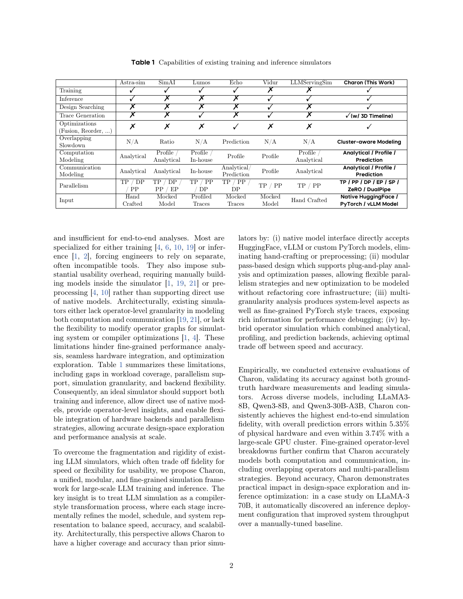

<strong>E002</strong> - 原笔记第 16 行 - PDF p.4, 5, 6, 7, 8

<strong>原定位：</strong> <code>总体流程是（PDF 第 4–8 页，§3，Figure 2–5）：</code>

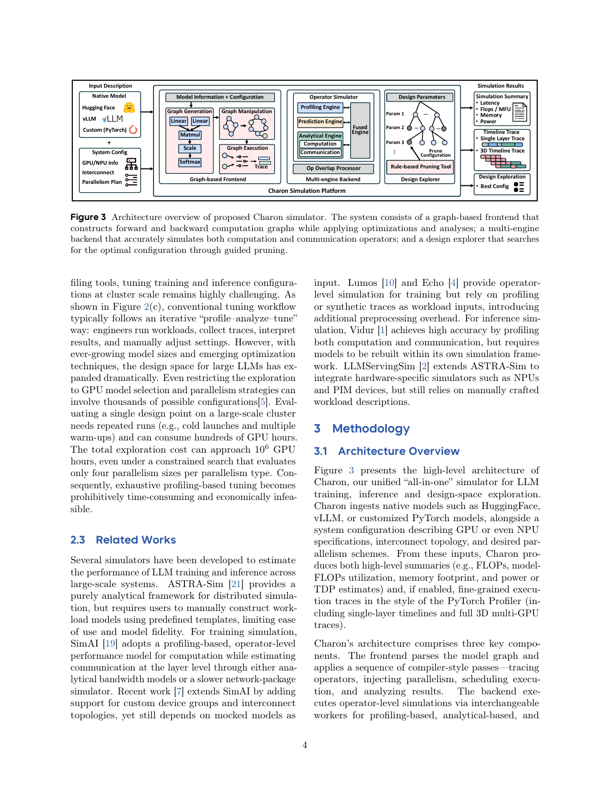

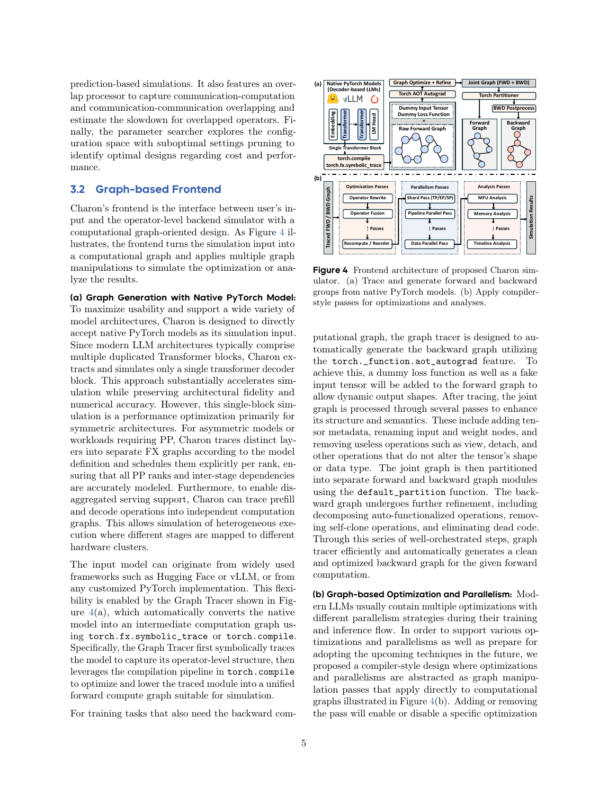

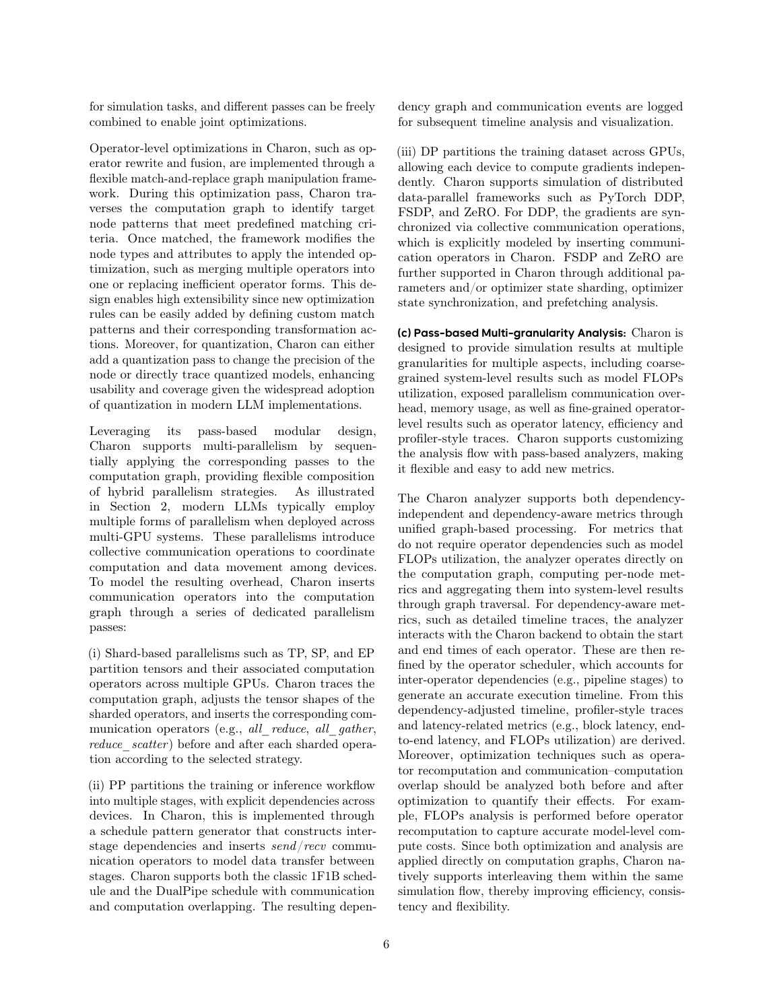

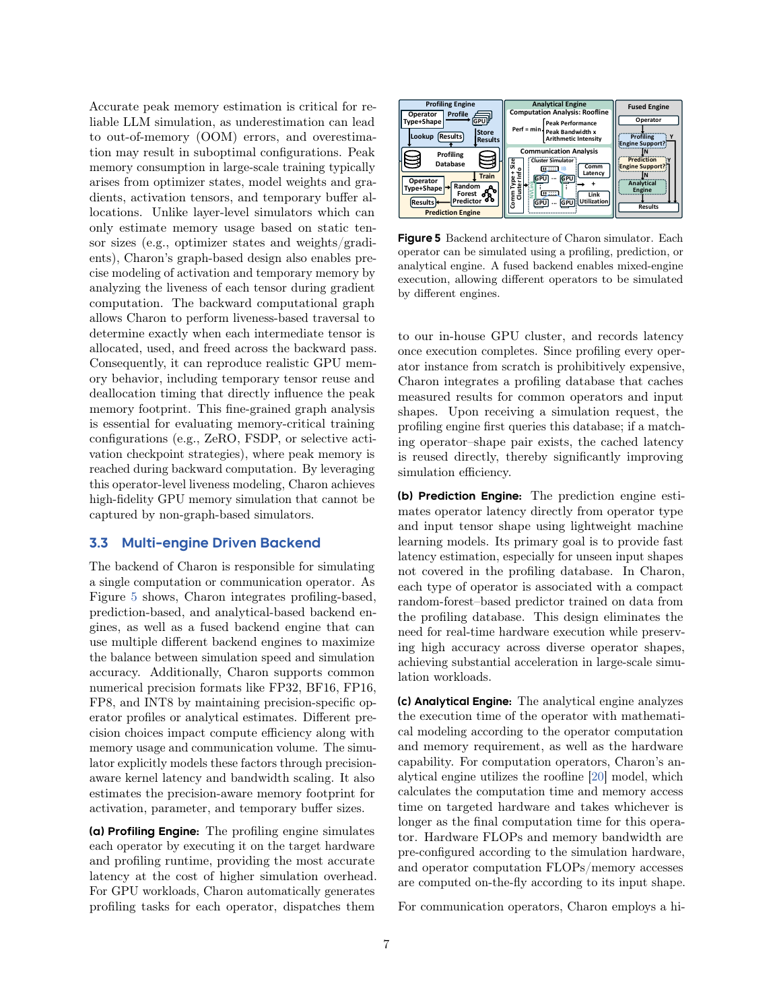

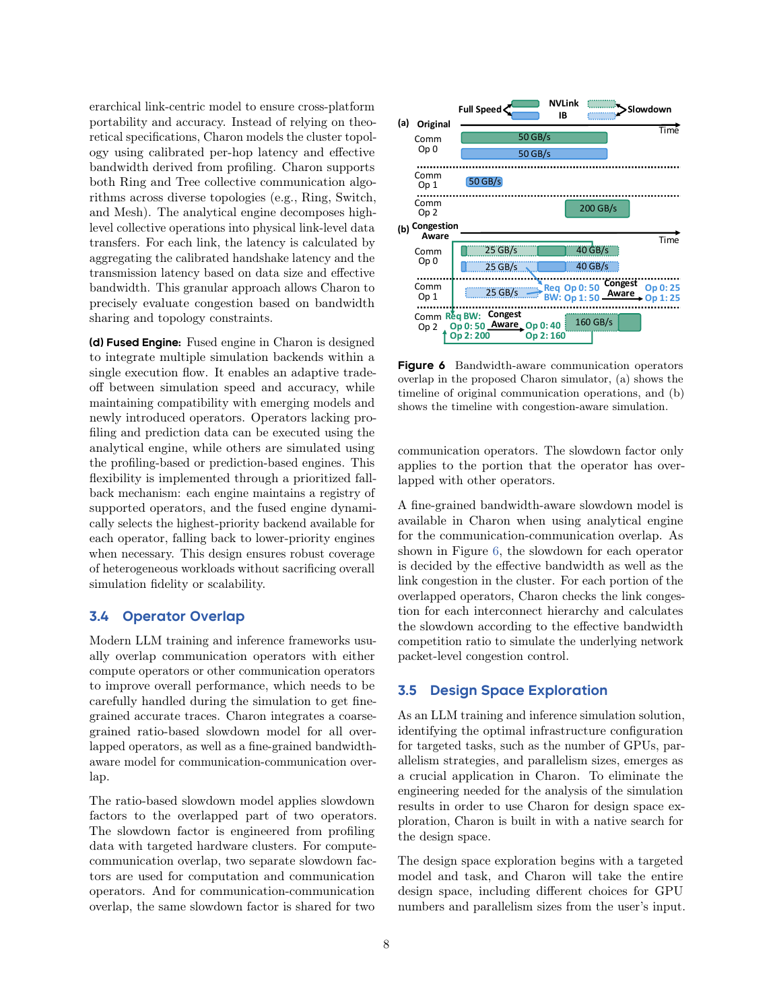

<strong>E003</strong> - 原笔记第 31 行 - PDF p.4

<strong>原定位：</strong> <code>**[论文事实]** Charon 不要求用户手写 abstract model spec，而是直接 trace 原生实现。为降低图规模，它通常只 trace 一个 Transformer block，再按层数复制；对于非对称层或 PP，可保留不同 layer graph（PDF 第 4 页，§3.1 “Graph Tracing”）。</code>

<strong>E004</strong> - 原笔记第 33 行 - PDF p.4, 5

<strong>原定位：</strong> <code>论文还说明可分别 trace prefill 与 decode graph，从而“enable disaggregated serving”（PDF 第 4–5 页，§3.1 末段）。</code>

<strong>E005</strong> - 原笔记第 39 行 - PDF p.5, 6

<strong>原定位：</strong> <code>**[论文事实]** 编译器执行 graph fusion、rewrite、quantization，以及 TP/SP/EP/PP/DP/FSDP/ZeRO/DualPipe 等变换；根据并行语义插入 AllReduce、AllGather、ReduceScatter、Send/Recv，并生成每设备执行图（PDF 第 5–6 页，§3.2，Figure 3–4）。</code>

<strong>E006</strong> - 原笔记第 47 行 - PDF p.9, 10

<strong>原定位：</strong> <code>**[论文事实]** 推理验证使用 vLLM，并比较 Qwen3-8B、Llama3-8B、Qwen3-30B-A3B 在 TP=1/2/4 下的 TTFT/TPOT（PDF 第 9–10 页，§4.2，Figure 7）。论文的图模型能区分 prefill 与 decode operator shape。</code>

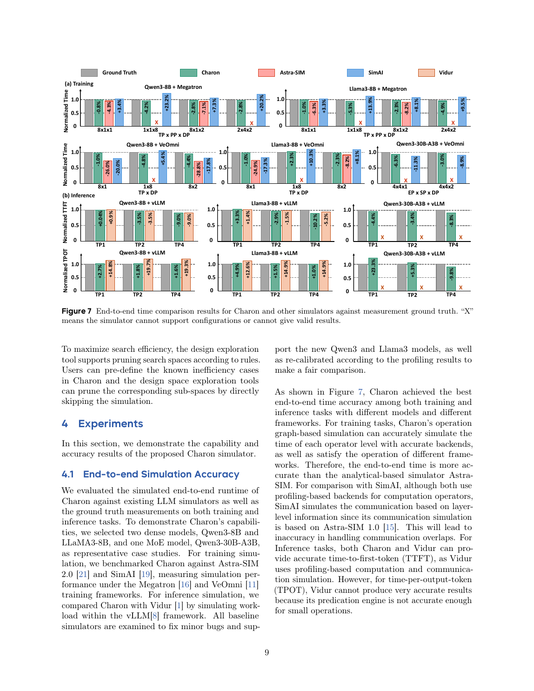

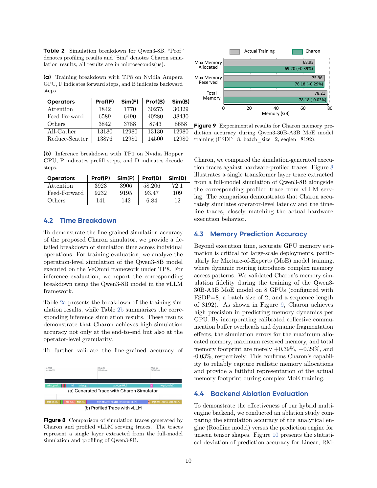

<strong>E007</strong> - 原笔记第 53 行 - PDF p.7

<strong>原定位：</strong> <code>**[论文事实]** Memory analysis 的重点是 training activation、temporary tensor liveness、参数/梯度/优化器状态，并通过 operator graph 精确跟踪 allocate/use/free（PDF 第 7 页，§3.2 “Memory Analysis”）。</code>

<strong>E008</strong> - 原笔记第 59 行 - PDF p.11, 12, 13

<strong>原定位：</strong> <code>**[论文事实]** 推理侧报告 TTFT、TPOT、TPS/user、TPS/GPU，并做 Pareto 搜索（PDF 第 11–13 页，§5.2，Figure 13）；某生产案例以 100ms E2E 为约束（PDF 第 13 页，§5.3）。论文没有系统给出 TBT/ITL 分布、SLO violation rate、goodput、排队时延或 per-request timeline。</code>

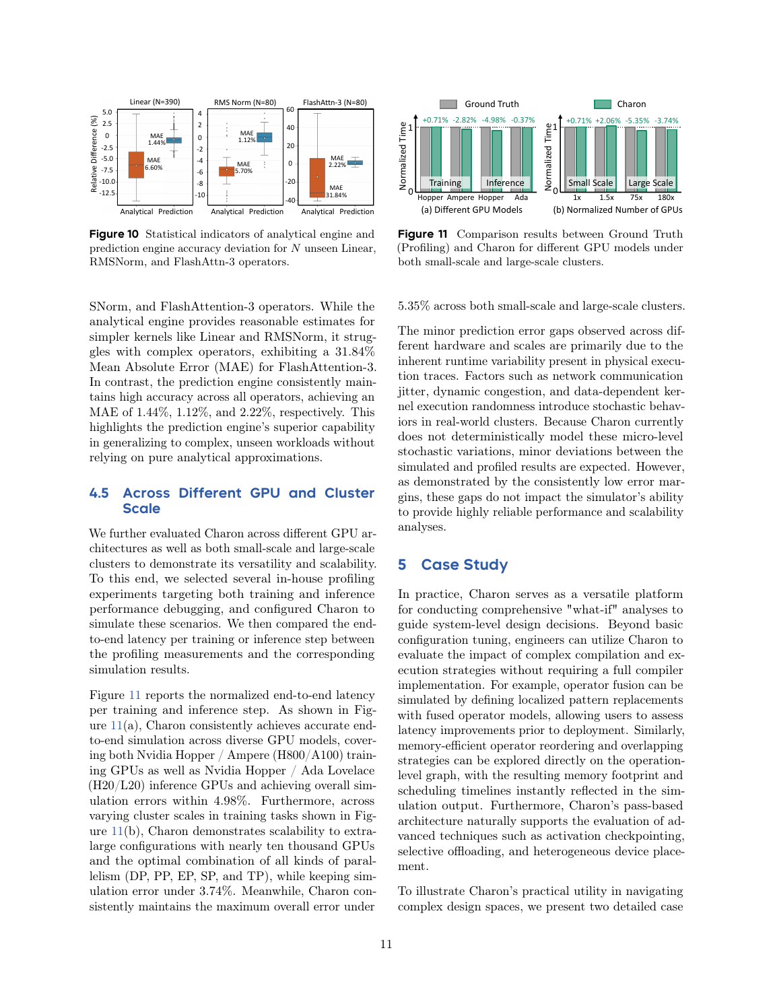

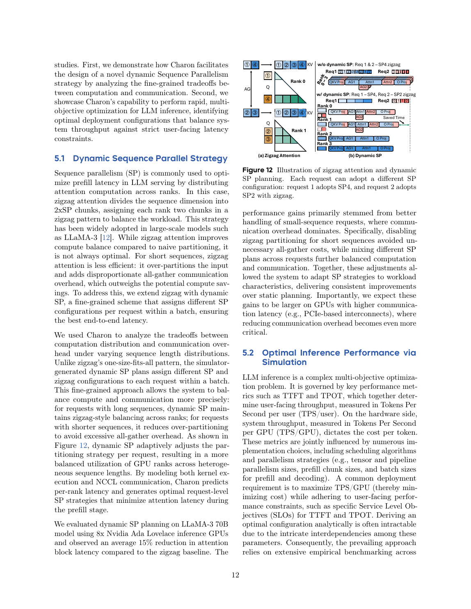

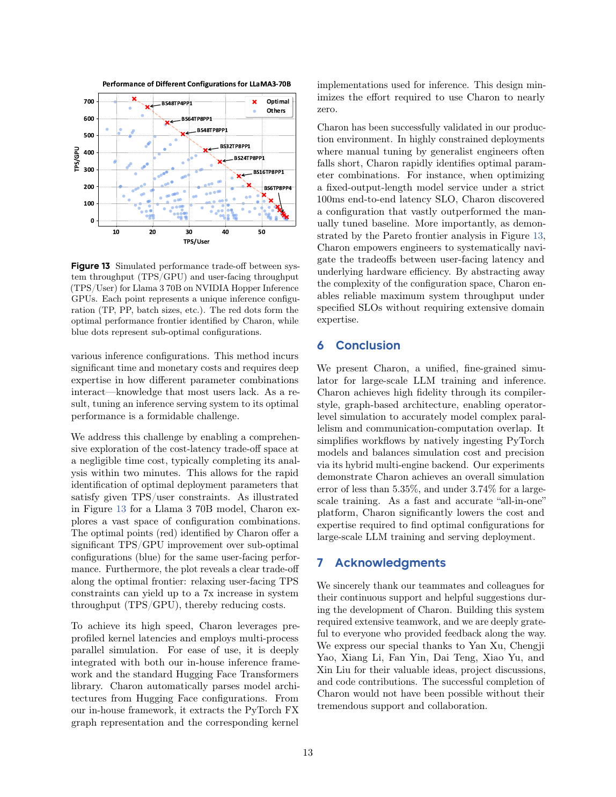

<strong>E009</strong> - 原笔记第 63 行 - PDF p.7, 8

<strong>原定位：</strong> <code>**[论文事实]** Figure 5 与 §3.3 将算子后端分为（PDF 第 7–8 页）：</code>

<strong>E010</strong> - 原笔记第 70 行 - PDF p.7

<strong>原定位：</strong> <code>支持 FP32/BF16/FP16/FP8/INT8，并显式考虑 precision 对 kernel latency、带宽、内存 footprint 的影响（PDF 第 7 页，§3.3 开头段）。</code>

<strong>E011</strong> - 原笔记第 74 行 - PDF p.7, 8

<strong>原定位：</strong> <code>**[论文事实]** 未命中 profile 的算子由 RF 根据 operator type 与 input shape 预测；analytical engine 用 FLOPs、memory accesses 与 hardware peak/bandwidth 计算 roofline 时间（PDF 第 7–8 页，§3.3(a)–(c)）。Fused operator 若可直接 profile/predict 则走对应 backend，否则回退到子算子（Figure 5 右侧）。</code>

<strong>E012</strong> - 原笔记第 78 行 - PDF p.8

<strong>原定位：</strong> <code>**[论文事实]** 通信解析模型按分层拓扑、每跳 latency、effective bandwidth、ring/tree collective 和 congestion 估时（PDF 第 8 页，§3.3(c) 延续段）。Overlap 模型分两层：compute-communication overlap 用 slowdown ratio；communication-communication overlap 用带宽竞争模型（PDF 第 8 页，§3.4）。</code>

<strong>E013</strong> - 原笔记第 84 行 - PDF p.6

<strong>原定位：</strong> <code>**[论文事实]** Scheduler 根据 per-device operator graph 的数据依赖和通信依赖，将节点放到设备时间线上；3D trace 用于展示计算、通信和 overlap（PDF 第 6 页，§3.2 “Scheduling and Timeline Generation”，Figure 4）。</code>

<strong>E014</strong> - 原笔记第 92 行 - PDF p.9

<strong>原定位：</strong> <code>**[论文事实]** 训练对比 ASTRA-sim、SimAI；推理对比 Vidur 和 vLLM。硬件包括 H800/A100（训练）与 H20/L20（推理）（PDF 第 9 页，§4.1）。</code>

<strong>E015</strong> - 原笔记第 96 行 - PDF p.1

<strong>原定位：</strong> <code>**[论文事实]** Figure 7 报告 Qwen3-8B、Llama3-8B、Qwen3-30B-A3B，TP=1/2/4 的 normalized TTFT/TPOT；论文摘要称 inference error 小于 5.35%（PDF 第 1 页 Abstract；第 9–10 页 §4.2，Figure 7）。</code>

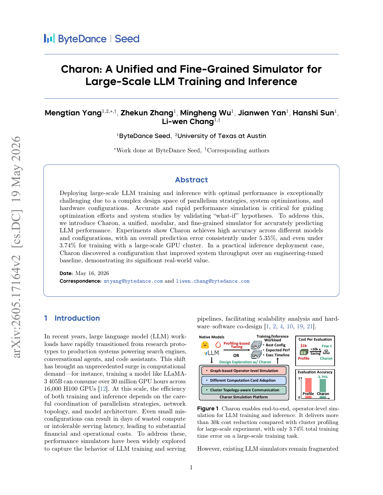

<strong>E016</strong> - 原笔记第 98 行 - PDF p.10

<strong>原定位：</strong> <code>Table 2(b) 给出部分 Hopper operator 的 profile/simulation 微秒数（PDF 第 10 页，§4.3，Table 2）：</code>

<strong>E017</strong> - 原笔记第 110 行 - PDF p.10, 11

<strong>原定位：</strong> <code>**[论文事实]** RF 的 MAE：Linear 1.44%、RMSNorm 1.12%、FlashAttention-3 2.22%；对应解析模型为 6.60%、5.70%、31.84%（PDF 第 10–11 页，§4.4，Figure 10）。这支持“profile+prediction”用于未见 shape，但测试仍在论文定义的硬件与数据域内。</code>

<strong>E018</strong> - 原笔记第 114 行 - PDF p.1

<strong>原定位：</strong> <code>**[论文事实]** 论文称 training 大规模误差低于 3.74%（PDF 第 1 页 Abstract；训练扩展见 §4）。推理侧：</code>

<strong>E019</strong> - 原笔记第 116 行 - PDF p.11, 12

<strong>原定位：</strong> <code>- 动态 sequence parallelism 只用于 prefill，在 8 张 Ada GPU 的 Llama3-70B 案例中 attention block latency 降低 15%（PDF 第 11–12 页，§5.1，Figure 12）；</code>

<strong>E020</strong> - 原笔记第 117 行 - PDF p.12, 13

<strong>原定位：</strong> <code>- 推理 Pareto 搜索约 2 分钟；放宽 per-user TPS 时，某些方案可把 TPS/GPU 提高到 7×（PDF 第 12–13 页，§5.2，Figure 13）；</code>

<strong>E021</strong> - 原笔记第 118 行 - PDF p.13

<strong>原定位：</strong> <code>- 作者称生产配置在 100ms E2E 约束下明显优于人工调优（PDF 第 13 页，§5.3）。</code>

<!-- EVIDENCE_SCREENSHOTS:END -->
