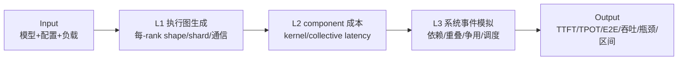

# AI Infra 性能预测基础：给后训练与强化学习研究者的桥接教程

> 目标不是把你训练成 CUDA 工程师，而是让你读后面的 11 篇论文时，能判断作者到底预测了什么、依赖了哪些已知条件、哪些结论不能外推。

## 0. 先建立一个总心智模型

你在后训练/RL 中常把一次更新理解为：样本 → rollout / forward → reward / loss → backward → optimizer。性能系统看到的层次更细：

```mermaid
flowchart LR
    A["模型语义<br/>Transformer / MoE / loss"] --> B["框架执行图<br/>PyTorch / JAX / vLLM"]
    B --> C["编译与运行时<br/>fusion / tactic / schedule"]
    C --> D["算子<br/>GEMM / attention / norm"]
    D --> E["kernel<br/>grid / block / tile / stream"]
    E --> F["芯片<br/>SM / Tensor Core / HBM / cache"]
    F --> G["分布式运行时<br/>rank / collective / topology"]
    G --> H["训练或服务调度<br/>microbatch / queue / KV cache"]
    H --> I["可观测结果<br/>latency / throughput / memory / cost"]
```



最重要的结论是：**“一个模型有多少 FLOPs”不是“它运行多久”的同义词。** 中间每一层都可能改变真实执行路径。

可以把这套栈类比成一次 RL 实验：

- 模型数学类似“算法定义”；
- 编译器选出的 kernel 类似“具体实现与环境”；
- 多卡拓扑与调度类似“采样 actor、learner 和队列的资源编排”；
- 端到端吞吐取决于关键路径、等待和重叠，而不只是每个局部步骤的独立速度。

## 1. 从 Transformer 数学到 GPU kernel

### 1.1 Tensor、shape、算子和 kernel 不是同一层概念

以 Transformer 的一个线性层为例：

$$
Y = XW,
\quad X\in\mathbb{R}^{(B S)\times H},
\quad W\in\mathbb{R}^{H\times H_{out}}
$$

这里：

- `B` 是 batch size；
- `S` 是 sequence length；
- `H` 是 hidden size；
- `Y = XW` 是**语义算子**；
- 在 GPU 上执行它的具体实现可能是 cuBLAS、CUTLASS、Triton 或厂商私有 GEMM **kernel**；
- 同一个 GEMM shape 还可能有多个 tactic：不同 tile、warp 数、pipeline stage、split-K、Tensor Core 指令和 workspace。

算子像“我要把两张表做矩阵乘”；kernel 像“具体由哪支施工队、如何分块、用什么机器完成”。论文如果只知道算子，不知道 kernel route，就还缺了一层关键离散变量。

### 1.2 为什么 shape 会影响性能，而且不是平滑影响

把 `M×K` 与 `K×N` 的 GEMM 切成固定 tile。若 tile 是 `128×128`：

- `M=N=1024` 时，两个方向都恰好 8 个 tile，边界浪费小；
- `M=N=1025` 时，两个方向都需要 9 个 tile，最后一排和一列绝大部分线程可能没有有效工作；
- 库还可能在 1024 与 1025 选择不同 kernel。

所以只增加 1 个元素，耗时也可能阶跃，而不是增加约 `1/1024`。shape 变化主要通过五条路径生效：

1. FLOPs 和内存字节数变化；
2. tile 数、wave 数与尾波利用率变化；
3. 对齐、padding、stride 和 layout 变化；
4. 编译器或库切换 tactic / fusion / attention backend；
5. 每 rank 的分片 shape 以及通信消息大小变化。

这也是为什么“改 batch、seqLen、TP 数后直接复用旧 kernel 时间”通常不可靠。

### 1.3 动态 sequence length 为什么尤其难

对一个 decoder-only Transformer：

- 线性层工作量通常近似随 `B×S` 增长；
- 朴素 self-attention 的一部分工作量随 `B×S²` 增长；
- FlashAttention 改变了内存访问方式，但 shape、head dimension、causal mask 和 tile 仍影响 route；
- 推理 decode 每步只有少量新 query token，却要读取历史 KV cache，表现更接近 memory-bound；
- 服务端会把不同请求动态组成 batch，实际每次迭代的 shape 是调度结果，不只是用户输入。

因此，“每个请求 seqLen 不同”会同时影响 L1 的执行图/shape、L2 的 kernel 成本和 L3 的排队/批处理过程。

## 2. GPU 执行层：SM、warp、block、grid、tile、wave

### 2.1 一套够用的层次关系

CUDA 的抽象可以先记为：

```text
一个 kernel launch
└── 一个 grid
    └── 很多 thread block
        └── 很多 thread
            └── 硬件按每 32 个 thread 组成一个 warp 调度

GPU
└── 很多 SM（Streaming Multiprocessor）
    ├── warp scheduler
    ├── registers / shared memory / L1
    ├── CUDA/SIMT cores
    └── Tensor Cores（适合矩阵乘累加）
```

block 是调度和资源驻留的重要单位。同一 block 的线程驻留在同一个 SM，并共享该 SM 的寄存器、shared memory 等有限资源。一个 SM 能同时驻留多少 block/warp，取决于 kernel 的资源需求，这就是 occupancy 讨论的一部分。CUDA 官方文档给出的经典 warp 大小是 32。[CUDA Programming Guide](https://docs.nvidia.com/cuda/cuda-programming-guide/01-introduction/programming-model.html)

### 2.2 tile 是算法分块，block 是执行映射

在 GEMM 中，kernel 往往让一个 thread block 负责输出矩阵的一个 tile。例如：

- 输出 `M=N=4096`；
- 每个 block 计算 `128×128` 输出 tile；
- grid 至少有 `32×32=1024` 个 block。

tile 是“问题如何切块”；block/grid 是“切块如何映射成 GPU 工作”。两者经常相关，但不是严格同义词。

### 2.3 wave 与尾波效应

假设 GPU 有 80 个 SM，并简化为每个 SM 同时跑 1 个目标 block：

- 1024 个 block 需要 `ceil(1024/80)=13` waves；
- 前 12 waves 基本装满，最后一 wave 只有 64 个 block；
- 最后一 wave 的填充率是 `64/80=80%`。

若只有 81 个 block，则需要 2 waves，第二 wave 只有 1 个 block。即使 FLOPs 只比 80 blocks 多一点，尾波也可能让时间明显增加。这就是 Habitat/NeuSight 一类论文强调 wave/tile 的原因。

真实情况还会受每个 SM 可并发多个 block、寄存器、shared memory、warp occupancy 和指令流水影响，所以 wave 是有效机制特征，但不是完整真值。

## 3. 内存层次与 Roofline

### 3.1 GPU 不只有“算力”

数据可能经过：

```text
register → shared memory / L1 → L2 → HBM/device memory → 跨卡互联/网络
最快、最小                                             最慢、最大
```

矩阵乘通常有机会重复使用 tile 中的数据，算术强度高；逐元素加法每读几个字节只做少量运算，通常更受带宽限制。

### 3.2 Roofline 的核心公式

设：

- 工作量为 `F` FLOPs；
- 必须搬运 `Q` bytes；
- 峰值计算吞吐为 `P_peak` FLOP/s；
- 峰值带宽为 `BW_peak` byte/s；
- 算术强度 `AI = F/Q` FLOP/byte。

理想可达性能上界：

$$
P \le \min(P_{peak}, AI\cdot BW_{peak})
$$

等价的乐观时间下界：

$$
T \ge T_{roof}=\max\left(\frac{F}{P_{peak}},\frac{Q}{BW_{peak}}\right)
$$

这个下界回答：“即使完美利用硬件，至少要多久？”它不是实际预测。launch overhead、低 occupancy、尾波、cache miss、同步、指令混合和不理想 tactic 都会让真实时间更长。

### 3.3 一个数值例子

假设某算子：

- `F = 10^12` FLOPs；
- `Q = 100 GB`；
- GPU 峰值 `P_peak = 100 TFLOP/s`；
- HBM 带宽 `BW_peak = 2 TB/s`。

则：

- 计算下界 `10^12 / 10^14 = 0.01s = 10ms`；
- 带宽下界 `100GB / 2000GB/s = 0.05s = 50ms`；
- Roofline 下界是 50ms，说明在该简化口径下偏 memory-bound。

若实测为 80ms，灰盒模型可以学 slowdown 或利用率，而不是从零学习 80ms。例如：

$$
T_{pred}=T_{roof}\cdot \exp(z),\quad z\ge 0
$$

这里 ML 只学非负残差 `z`，从结构上避免预测到物理下界以下。NeuSight 的思想与此同类，但实现细化到了 kernel 类型和 tile/wave。

### 3.4 为什么 Roofline 也会算错

最难的不是公式，而是 `F`、`Q` 和有效 ceiling 的口径：

- 权重是否被多个 batch token 重用？
- 流量算逻辑 bytes、HBM bytes，还是 L2/L1 bytes？
- Tensor Core、SIMT、特殊函数单元应使用哪个峰值？
- fusion 后中间张量是否真的落到 HBM？
- 稀疏、量化、layout conversion、padding 是否改变工作量？

Nsight Compute 甚至提供 L1、L2、device memory 等分层 Roofline，正说明单一 HBM Roofline 只能做粗粒度瓶颈归因。[Nsight Compute](https://docs.nvidia.com/nsight-compute/NsightCompute/index.html)

## 4. route、tactic、fusion 和 autotuning

### 4.1 route 是离散分支

在本笔记库中，`route` 泛指“同一语义算子最终走哪条实现路径”，可能包含：

- backend：cuBLAS、cuDNN、CUTLASS、Triton、FlashAttention；
- algorithm/tactic：具体 GEMM/conv/attention 算法；
- tile、warp、stage、split-K；
- dtype/layout/alignment；
- 是否 fusion；
- 是否使用 Tensor Core、SIMT 或新架构指令。

route 是离散变量。跨 route 平滑回归时延，相当于把“轿车、卡车和高铁”放在一起仅按里程拟合时间，容易在切换边界失效。

### 4.2 fusion 为什么既减少工作又改变 kernel

未融合：

```text
GEMM → 写 HBM → bias add → 写 HBM → GELU → 写 HBM
```

融合后可能变成：

```text
GEMM + bias + GELU → 一次写 HBM
```

它减少 launch 和中间流量，但也改变寄存器压力、tile、occupancy 与生成代码。因此不能总用三个旧 kernel 时间简单相减得到融合时间。nn-Meter 先探测目标设备的融合规则；Daydream 则通过图变换表达要评估的融合优化，但新 task 时长仍需要估计来源。

### 4.3 autotuning 在做什么

一个编译器可能为同一 GEMM 生成数百个 schedule：

1. 合法性规则去掉明显不可行项；
2. 解析 heuristic 或 cost model 排出 top-K；
3. 在目标硬件实测 top-K；
4. 缓存赢家，后续相同指纹直接复用。

Ansor、TenSet、TPU cost model、TLP 的核心任务大多是第 2 步：**让好的候选更早被测到**。这和输出经过校准的绝对端到端 latency 是不同任务。

## 5. Profiling、trace 与依赖图

### 5.1 一条 trace 里有什么

常见事件包括：

- CPU 发起算子和 kernel launch；
- GPU kernel 开始/结束；
- H2D/D2H/D2D copy；
- NCCL collective；
- stream/event 同步；
- framework、operator、kernel 的关联 ID；
- rank、device、thread 和时间戳。

CUPTI、PyTorch Profiler、Nsight Systems/Compute 等工具分别提供不同层次的可观测性。

### 5.2 时间线不等于依赖图

看到 A 在 B 前面发生，不一定代表 B 数据依赖 A；也可能只是资源排队。反过来，两个事件在不同设备时钟域中，时间戳未对齐也会制造虚假先后关系。

依赖图通常需要组合：

- 数据依赖；
- host launch 顺序；
- CUDA stream 顺序；
- event/synchronization；
- send/recv 或 collective 对应关系；
- 资源竞争约束。

Daydream 从 profile 构图后做图变换和回放；dPRO 进一步构建跨设备全局 DFG 并处理时钟对齐。

### 5.3 为什么“把算子时间相加”经常错

如果计算 kernel 8ms、AllReduce 6ms：

- 完全串行是 14ms；
- 完全重叠是约 8ms；
- 部分重叠可能是 9–13ms；
- 两者还可能争夺 SM、copy engine、PCIe/NVLink/HBM，导致单独测量时长失效。

所以 L2 预测单个 component 时间后，仍需 L3 沿依赖和资源状态推进事件。

## 6. 分布式基础：rank 到底是什么

### 6.1 一句话定义

在 PyTorch Distributed 的常见语境中，**rank 是一个进程在某个 process group 里的整数编号。** 若组大小 `world_size=16`，rank 通常是 `0..15`。PyTorch 官方也将 rank 定义为 process group 内进程的唯一标识。[PyTorch Distributed](https://docs.pytorch.org/docs/stable/distributed)

更一般地说，rank 是“通信域里的逻辑参与者编号”：NCCL communicator 常把一个 rank 关联到一张 CUDA device，但 API 也允许一个进程管理多个 device/rank。因此不要脱离具体 runtime，绝对化成“rank 永远等于 OS 进程”或“rank 永远等于 GPU”。后文采用最常见的 PyTorch 一进程一卡模型。

它不是：

- GPU 型号；
- GPU 的固定物理编号；
- 节点编号；
- “主卡/从卡”的性能等级；
- 模型参数矩阵的秩。

### 6.2 global rank、local rank、group rank

假设 2 台机器，每台 8 张 GPU，一进程控制一张 GPU：

| 机器 | GPU 本地编号 | global rank | local rank |
| --- | ---: | ---: | ---: |
| node 0 | 0..7 | 0..7 | 0..7 |
| node 1 | 0..7 | 8..15 | 0..7 |

- `global rank`：整个作业中的编号；
- `local rank`：本节点内用于选择设备的编号；
- `group rank`：在某个子 process group 中的编号。

同一个进程可以同时属于多个组，并在不同组内拥有不同 group rank。

### 6.3 rank 本身不让程序变快或变慢，映射会

编号 `rank=7` 本身没有性能含义。但 rank 到角色、GPU 和拓扑的映射会影响：

- 它拿到哪一片 tensor / expert / pipeline stage；
- 它和谁做 AllReduce、AllGather、AllToAll 或 send/recv；
- 通信走 NVLink、PCIe、同机还是跨机网络；
- 某个 rank 是否负载更多或成为 straggler；
- pipeline 首尾 stage 的工作是否不同；
- MoE token 是否倾斜到特定 expert rank。

端到端 step 往往被最慢 rank 或最慢同步组卡住。因此性能报告不能只给平均 rank；要看每 rank 分布和临界 rank。

### 6.4 一个 process group 例子

4 个 rank 各有向量：

```text
rank 0: [1, 2]
rank 1: [3, 4]
rank 2: [5, 6]
rank 3: [7, 8]
```

sum AllReduce 后，每个 rank 都拿到 `[16, 20]`。NCCL 要求 collective 的参与 rank 按匹配的 count/dtype 调用；否则可能 hang 或出错。[NCCL collectives](https://docs.nvidia.com/deeplearning/nccl/archives/nccl_2243/user-guide/docs/usage/collectives.html)

常见 collective：

| 原语 | 直觉 | 常见用途 |
| --- | --- | --- |
| AllReduce | 大家求和，每人都拿完整结果 | DDP 梯度同步 |
| ReduceScatter | 先归约，再让每人拿一片 | FSDP/ZeRO、TP |
| AllGather | 每人贡献一片，最后每人拿全集 | 参数/activation 重组 |
| AllToAll | 每人分别给每个人一片 | MoE token dispatch/combine |
| Broadcast | 一个 root 发给所有人 | 参数/状态初始化 |
| Send/Recv | 点到点传输 | pipeline stage 间 activation |

## 7. DP、TP、PP、EP 各自在切什么

### 7.1 DP：Data Parallelism

每个 DP replica 通常有完整模型，处理不同样本：

```text
DP rank 0: batch A → forward/backward ┐
DP rank 1: batch B → forward/backward ├─ gradient AllReduce / ReduceScatter
DP rank 2: batch C → forward/backward ┤
DP rank 3: batch D → forward/backward ┘
```

DP 数从 1 增到 4 的影响：

- 若 local batch 不变，global batch 约放大 4 倍，单 rank operator shape 可能基本不变；
- 计算可并行，但增加梯度同步；
- 若 global batch 固定，local batch 变小，GEMM shape 和 kernel 效率也会变；
- 优化器语义、梯度累积和学习率策略可能随 global batch 改变；
- 弱缩放与强缩放必须分开讨论。

### 7.2 TP：Tensor Parallelism

TP 把一个层内部的 tensor/权重切到多卡。以 `Y=XW` 为例，按 `W` 的列切分：

```text
rank 0: W[:, 0:N/2] → Y_left
rank 1: W[:, N/2:N] → Y_right
随后可能 AllGather 拼回完整 Y
```

TP 数增加的影响：

- 每 rank GEMM 的 `N` 或 `K` 变小，算子 shape 直接改变；
- tile/wave/occupancy 可能恶化，小 GEMM 未必充分利用大 GPU；
- activation collective 增多或消息结构变化；
- 同机 NVLink 与跨机网络差异巨大；
- hidden size/head count 必须满足分片合法性和对齐要求。

所以 TP=2 绝不是“把 TP=1 的计算时间除以 2 再加一点通信”。

### 7.3 PP：Pipeline Parallelism

PP 按层切模型，stage 之间传 activation，并用 microbatch 填流水线：

```text
时间 →
stage 0: MB0 F | MB1 F | MB2 F | ...
stage 1:   等待 | MB0 F | MB1 F | ...
```

PP 数增加的影响：

- 每 rank 只持有部分层，内存下降；
- stage 间产生 send/recv；
- 出现 pipeline bubble；
- stage 切分不均会由最慢 stage 限制吞吐；
- microbatch 数/大小改变每次执行 shape；
- 训练还有 forward/backward 调度（如 1F1B）和 activation checkpointing。

PyTorch 的 pipeline 文档也强调，PP 不仅切权重，还必须切执行过程并让多个 microbatch 在不同 stage 并发。[PyTorch Pipeline Parallelism](https://docs.pytorch.org/docs/stable/distributed.pipelining.html)

### 7.4 EP：Expert Parallelism

MoE 将不同 expert 放在不同 rank 上。router 决定每个 token 去哪些 expert：

```text
tokens → router → AllToAll dispatch → local experts → AllToAll combine
```

EP 数增加的影响：

- 每 rank 持有的 expert 数下降；
- AllToAll 范围和消息切分改变；
- 每个 expert 实际 token 数是数据依赖的动态 shape；
- load imbalance、capacity factor、drop/padding 会决定尾部；
- 平均 token 数相同也可能因方差和最热 expert 不同而产生不同 step 时间。

这正是静态 shape 模型难以直接覆盖 MoE 的原因。

### 7.5 并行维度组合与 rank 坐标

在把四个并行维度视为彼此独立、正交切分的**教学模型**中，可以写成：

$$
world\_size = DP\times TP\times PP\times EP
$$

并把 global rank 映射成坐标 `(dp, tp, pp, ep)`。这只是便于理解的因子化；实际 MoE runtime 中 EP 可能是对某个 DP/model-parallel 维度的再分组，而不是额外独立相乘。系统还可能有 context parallel、sequence parallel、FSDP、独立 coordinator 或非一进程一卡。因此生产配置必须以 runtime 实际创建的 process groups 为准。

以 16 张卡、`DP=2, TP=4, PP=2, EP=1` 为例：

- 每个 pipeline stage 内有 TP=4 的 tensor group；
- 相同 `(tp, pp)` 位置的两个 replica 形成 DP group；
- 相邻 PP stage 的对应 rank 传 activation；
- global rank 只是把这些坐标编码成整数，具体编码顺序由 runtime 决定。

## 8. batch size、卡数和机数如何改变性能

### 8.1 batch size 影响至少六层

1. 算子 shape：GEMM 的 `M` 常包含 `B×S`；
2. kernel route：大 batch 可能选择不同 tactic；
3. GPU 利用率：小 batch 启动开销和尾波占比高；
4. 内存：activation、KV cache、optimizer state；
5. 服务调度：等待更多请求合批会提高吞吐但增加 latency；
6. 分布式：global/local/micro batch 的定义决定 DP/PP 每 rank shape。

必须明确说的是哪一种 batch：

- `global batch`：整个训练 step 的样本总数；
- `local batch`：每个 DP replica 处理的样本数；
- `microbatch`：一次前后向或一个 pipeline slot 的小批次；
- `effective batch`：包含梯度累积后的等效 batch；
- inference continuous batch：某次 scheduler iteration 临时拼出的活动 token/sequence 集合。

### 8.2 卡数增加不是单调加速

更多卡可能：

- 降低每卡计算量；
- 增加通信和同步；
- 让每卡 shape 过小、利用率下降；
- 改变 kernel 数、fusion 和 graph；
- 改变内存可行性，使原本不能运行的配置可运行；
- 增加故障/straggler 暴露面。

因此需要画 scaling curve，而不是假设线性缩放。

### 8.3 机数增加通常比同机加卡更敏感

同一节点 GPU 可能通过 NVLink/NVSwitch 通信，跨节点则经过 NIC、PCIe、InfiniBand/RoCE 和交换网络。跨机后会新增：

- 更低带宽、更高 latency；
- 拓扑层次和拥塞；
- NIC 共享与 rail mapping；
- collective 算法切换；
- 时钟同步、软件栈和节点抖动问题。

只知道“16 卡”不够，还必须知道“1×16、2×8 还是 4×4”、rank placement 和链路能力。

## 9. 训练与 LLM 推理是两类系统

### 9.1 训练 step

典型训练关键路径：

```text
data → forward → loss → backward → gradient communication → optimizer
```

还可能包含：activation recomputation、gradient accumulation、ZeRO/FSDP 参数 AllGather、optimizer offload、checkpoint、RL rollout 与 learner 之间的队列。

PyTorch DDP 会在反向过程中按 bucket 触发 gradient AllReduce，因此通信可以与尚未完成的 backward 部分重叠，而不是最后一次性相加。[PyTorch DDP](https://docs.pytorch.org/docs/stable/generated/torch.nn.parallel.DistributedDataParallel.html)

### 9.2 LLM inference 的 prefill 与 decode

- **prefill**：一次处理 prompt 的多个 token，通常有较大 GEMM，更偏 compute-bound；
- **decode**：每步为每个请求产生少量新 token，同时读取历史 KV cache，通常更偏 memory-bound；
- **KV cache**：每层保存历史 key/value，长度随请求进展增长；
- **continuous batching**：请求可在不同时间加入/退出 batch；
- **chunked prefill**：把长 prompt 分块并与 decode 混排。

vLLM 文档明确指出，chunked prefill 在 token budget 内混合 prefill/decode，以权衡 TTFT、ITL 和吞吐。[vLLM optimization guide](https://docs.vllm.ai/en/latest/configuration/optimization/)

所以服务性能不能只跑一个静态 `model.forward()`；必须模拟请求到达、KV 占用、scheduler policy、preemption 和动态 batch。

## 10. 用户给出的 Input → L1 → L2 → L3 → Output

这是本项目最重要的分层接口。



### 10.1 Input：必须输入的不只是模型名字

最低应包含：

- 模型结构与执行语义：层、hidden、head、MoE/router、训练/推理路径；
- workload：batch/seq 分布、输出长度、请求到达或训练 schedule；
- dtype、layout、量化、checkpoint/fusion；
- DP/TP/PP/EP 等并行策略；
- GPU/NPU、节点拓扑、软件/编译器/库版本；
- runtime/scheduler 配置，例如 vLLM/SGLang batching/KV 策略。

“Llama-70B + 8 卡”远不足以唯一确定执行。

### 10.2 L1：把目标配置编译成可执行语义

L1 输出的是每个 rank 的目标执行图：

- 每个算子的有效/补齐/存储 shape；
- 参数和 activation 如何 shard；
- fusion 与可能的 kernel route；
- collective 或 send/recv 的消息大小、参与组和依赖；
- PP microbatch、MoE route、训练 forward/backward/optimizer 顺序。

如果 TP 从 1 改到 4，应该在 L1 重新推导每 rank shape，而不是在 L2 把旧时间除以 4。Proteus 和 Vidur 的核心价值之一就是显式生成目标配置下的图/shape。

### 10.3 L2：回答“每一个 component 本身要多久”

component 可以是：

- GPU/NPU kernel；
- fused kernel；
- memory copy；
- collective 或点到点通信；
- CPU/runtime overhead。

候选成本路由：

1. 完整指纹命中 → 直接查实测缓存；
2. 同 route、支持域内 → 机制约束模型预测；
3. 接近边界 → benchmark top-K；
4. 新 route/OOD → microbenchmark 并回填。

Habitat、nn-Meter、NeuSight 和四篇编译器 cost-model 论文主要贡献位于这里。

### 10.4 L3：回答“这些 component 组合起来，系统要多久”

L3 需要推进：

- 数据/控制依赖；
- CPU launch 与 GPU stream；
- compute-communication overlap；
- 网络/HBM/SM 等资源共享；
- pipeline bubble；
- 请求队列、batch、KV cache、preemption；
- rank 同步与 straggler。

最终时间由关键路径与资源状态决定。Daydream、dPRO、Proteus、Vidur 都覆盖 L3，但获取 L1/L2 输入的方式不同。

### 10.5 Output：绝对值、排序和解释要分开

可输出：

- 绝对指标：step time、TTFT、TPOT/ITL、E2E、吞吐、显存；
- 尾部指标：P95/P99、SLA violation；
- 排序：哪种 schedule/并行策略更优；
- 归因：critical path、最慢 rank、通信/计算占比；
- 不确定性：置信区间、OOD flag、fallback 来源。

排名模型得分未必是毫秒；一个 top-1 很准的 cost model 也可能完全不适合做容量规划。

## 11. 没有模型代码、运行时和目标 GPU/NPU，能得出什么

### 11.1 不能得出的结论

若不做任何模型/运行时假设，也没有目标硬件测量，就不能严谨给出：

- 某业务模型在某配置下的真实 latency/throughput；
- 某个 DP/TP/PP/EP 组合一定更优；
- vLLM 与 SGLang 某版本的生产排序；
- 某种新 GPU/NPU 上的 SLA 或成本；
- 动态 seqLen/MoE route 下的尾延迟。

原因不是 ML 模型不够大，而是 Input 和 L1 根本没有被唯一确定。

### 11.2 仍然可以做的三类工作

1. **方法链路验证**：用作者发布的 profile/opgraph/predictor/label，验证代码能否加载和产生相同 artifact；
2. **公开数据上的受控对照**：固定数据切分，比较 Roofline、直接拟合、灰盒残差和分段校准；
3. **预注册实验设计**：明确下一批真实模型/shape/硬件需要采什么，怎样防泄漏，什么结果会推翻方案。

这些能支持“方案是否值得继续”，不能替代最终真机业务结论。本项目现有无目标 GPU/NPU 实验就属于前两类。

### 11.3 真正进入业务验证时的最小闭环

```text
至少一个真实模型实现
× 至少一个明确 runtime/version
× 代表性 shape/workload 分布
× 目标硬件与拓扑
× 重复测量和环境元数据
→ L1 对齐 → L2 component 对齐 → L3 端到端对齐
```

建议先从一个 dense Transformer 训练 step 和一个 LLM inference workload 开始，再扩展 MoE、动态 route 与复杂服务调度。

## 12. 性能模型常见评价指标

设真实值 `y_i`、预测值 `ŷ_i`：

$$
APE_i=\left|\frac{\hat y_i-y_i}{y_i}\right|,
\quad MAPE=\frac1n\sum_i APE_i
$$

注意：

- MAPE 会让小 `y` 样本权重很高；
- 全局平均可能掩盖某 GPU、op 或 rank 的系统偏差；
- 容量规划尤其怕 underprediction；
- 调优更关心 top-k recall、Spearman/Kendall、regret；
- SLA 更关心 P95/P99、校准和区间覆盖率。

因此建议至少报告：macro-MAPE、MdAPE、P95 APE、signed bias、P95 underprediction、within-10/20%、按 device×op 分组，以及 shape-cluster bootstrap CI。

## 13. 11 篇论文在 L1/L2/L3 中的位置

| 论文 | L1：图/shape/策略 | L2：component 成本 | L3：组合与时间推进 | 最像在回答什么 |
| --- | --- | --- | --- | --- |
| Daydream | 从真实 profile 恢复图，再做图变换 | 多数复用已测 task 时间 | 依赖图回放 | 已观测配置上的优化 what-if |
| Habitat | 接收已有 kernel/shape | wave scaling + 特定 kernel MLP | 基本不是重点 | 同实现跨 GPU 成本 |
| nn-Meter | kernel/fusion 检测 | 分 kernel 回归并求和 | 串行推理图聚合 | 边缘推理/NAS latency |
| dPRO | 跨设备全局 DFG | 从目标集群 trace 得到 | 全局模拟和组合优化 | 分布式训练诊断 |
| Proteus | 策略树编译目标执行图 | profile 支撑 op/overlap 参数 | HTAE 模拟 | DP/TP/PP 策略比较 |
| Vidur | 声明式推导分片 shape | 目标 GPU profile + 插值 | 请求级离散事件模拟 | LLM serving 配置搜索 |
| NeuSight | 依赖 opgraph/kernel metadata | tile/wave + Roofline + 利用率学习 | 图求和/较粗通信 | 新 GPU/模型 component 外推 |
| TPU cost model | 编译器 IR/fusion/tile 候选 | GNN 预测候选成本 | 不负责服务模拟 | XLA 编译决策 |
| TLP/MTL-TLP | TVM schedule primitive 序列 | 学习候选分数并迁移 | 不负责服务模拟 | tensor program 搜索 |
| Ansor | 生成 schedule 搜索空间 | GBDT cost model 排序/指导测量 | 不负责服务模拟 | 自动调优 |
| TenSet | 标准化 task/schedule 数据 | 比较 ranking/regression models | 不负责服务模拟 | cost-model 数据与评估 |

这张表不是说每篇只属于一个层，而是指出其主要建模责任。读论文时始终问：**它的输入由谁提供？它没有建模的层由谁负责？**

## 14. 推荐阅读顺序

若只用 2 小时：

1. 本文第 0、1、6、7、10、11 节；
2. Daydream：理解 profile/replay；
3. Habitat：理解跨 GPU 机制缩放；
4. Proteus：理解并行策略如何改变目标图；
5. Vidur：理解 component profile 如何接到 serving simulator；
6. NeuSight：理解 Roofline 约束残差；
7. 最后看 Ansor/TenSet/TPU/TLP，区分“候选排序”与“绝对 latency”。

## 15. 最小术语表

| 术语 | 简明解释 |
| --- | --- |
| operator/op | 框架或数学层的语义操作，如 matmul、layernorm |
| kernel | 在加速器上实际启动的一段设备代码 |
| tactic/algorithm | 同一 op 的具体实现方案 |
| fusion | 把多个 op 合成一个 kernel/compiled region |
| tile | 把问题划分出的局部计算块 |
| grid/block/warp | CUDA kernel 的执行层次；warp 通常为 32 threads |
| SM | GPU 上调度并执行多个 warp/block 的多处理器 |
| occupancy | SM 上驻留的 active warp/block 相对硬件能力的比例 |
| wave | 一批可并行铺到 SM 上的 block；不足一批形成尾波 |
| HBM | GPU 高带宽设备内存 |
| arithmetic intensity | FLOPs / bytes，用于判断计算或带宽倾向 |
| Roofline | 由峰值算力和带宽给出的乐观性能上界/时间下界 |
| trace | 实际执行事件与时间戳记录 |
| DFG/DAG | 数据流/依赖图 |
| rank | 进程在某 process group 中的整数编号 |
| world size | process group 中进程数 |
| collective | 多 rank 协同通信原语 |
| OOD | 输入超出训练/校准支持分布 |
| cost model | 预测候选程序、kernel 或系统配置成本的模型 |
| discrete-event simulation | 按事件、依赖和资源状态推进虚拟时间 |
| TTFT | 从请求到达至首 token 的时间 |
| TPOT/ITL | 相邻输出 token 的平均/间隔时间口径 |

## 16. 一手背景资料

- [CUDA Programming Guide：thread/block/grid/SM](https://docs.nvidia.com/cuda/cuda-programming-guide/01-introduction/programming-model.html)
- [Nsight Compute：Roofline 与分层内存 ceiling](https://docs.nvidia.com/nsight-compute/NsightCompute/index.html)
- [PyTorch Distributed：rank、world size、process group](https://docs.pytorch.org/docs/stable/distributed)
- [NCCL：collective 语义](https://docs.nvidia.com/deeplearning/nccl/archives/nccl_2243/user-guide/docs/usage/collectives.html)
- [PyTorch Tensor Parallel](https://docs.pytorch.org/docs/stable/distributed.tensor.parallel.html)
- [PyTorch Pipeline Parallel](https://docs.pytorch.org/docs/stable/distributed.pipelining.html)
- [PyTorch DDP](https://docs.pytorch.org/docs/stable/generated/torch.nn.parallel.DistributedDataParallel.html)
- [vLLM：chunked prefill 与调度权衡](https://docs.vllm.ai/en/latest/configuration/optimization/)
