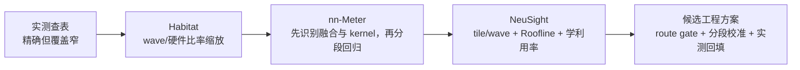
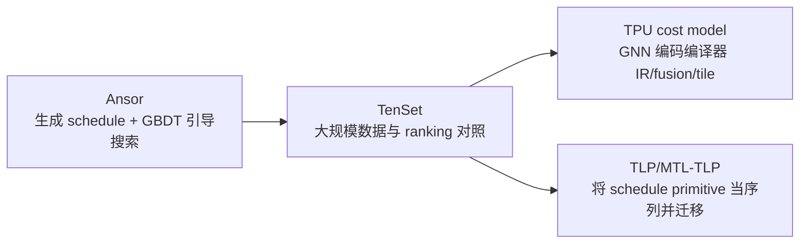

# 11 篇论文快速阅读地图

## 1. 先别按年份背论文，先按它们回答的问题分类

这 11 篇论文并不是在解决同一个回归问题。最容易混淆的地方，是把“预测一个 kernel 的时间”“给编译候选排序”“模拟整个分布式训练”和“模拟在线请求”都叫性能预测。

| 问题 | 典型输入 | 典型输出 | 代表论文 |
| --- | --- | --- | --- |
| 已经跑过一次，某优化会快多少？ | profile trace + 图变换规则 | 优化后迭代时间 | Daydream |
| 同一个 kernel 换 GPU 会多久？ | source/target GPU 属性 + kernel 特征 | kernel latency | Habitat、NeuSight |
| 一个移动模型在某设备会多久？ | 模型图 + 设备融合规则 + 分 kernel 模型 | inference latency | nn-Meter |
| 分布式训练到底卡在哪里，组合优化是否有效？ | 多 rank trace + 全局依赖 | 迭代时间、瓶颈、优化组合 | dPRO |
| DP/TP/PP 策略还没部署，哪个更好？ | 模型、策略、拓扑 + op profile | 策略吞吐/内存 | Proteus |
| LLM serving 的并行、batch、scheduler 怎么选？ | workload + declarative model + profile | TTFT/E2E/吞吐 | Vidur |
| 编译器生成了很多实现，先测哪些？ | IR/schedule/tile 候选 | 相对成本或排序 | Ansor、TenSet、TPU cost model、TLP |

## 2. 两条主演进轴，加一条旁支

### 2.1 系统轴：图是“观测”出来，还是“生成”出来

- Daydream 擅长“在已观察配置附近做 what-if”；
- dPRO 把观察范围扩到跨设备并诊断通信；
- Proteus 不要求先把每个候选策略完整跑一遍，而是从策略描述生成图；
- Vidur 把 LLM inference 的请求到达、continuous batching、KV cache 和 scheduler 纳入系统时间。

这不是严格替代关系。dPRO 的诊断信息可能比离线策略 simulator 更细；Vidur 聚焦 inference，不能替代训练 simulator。

### 2.2 component 轴：从直接复用，到机制特征，再到受约束残差

真正的经验不是“ML 越多越先进”，而是：

1. 能解析计算的量不要让 ML 重学；
2. 离散算法分支要显式区分；
3. 在同一机制区间内学习连续残差；
4. 新 route/OOD 时拒绝强行预测，回到测量；
5. 绝对值预测最终需要目标域校准。

### 2.3 编译器旁支：目标主要是搜索，不是 SLA

这组论文常用“更快找到好程序”作为成功标准。cost model 的 score 即使能很好排序，也未必是校准后的毫秒数。因此它们适合 L2 的 tactic shortlist，不应直接充当端到端容量模型。

## 3. “硬编码 → 拟合 → 灰盒”该如何准确理解

这是一个有用的工程叙事，但不是这些论文真实的单线历史。

### 3.1 所谓硬编码/解析模型

它显式写出机制，例如：

- FLOPs、bytes、Roofline；
- tile 数和 wave 数；
- collective 的消息大小与带宽/latency；
- pipeline 依赖和调度规则。

优点是可解释、数据少、能做一定外推；短板是难覆盖 cache、tactic、重叠、launch 和软件实现细节。

### 3.2 所谓纯拟合

输入 shape/硬件特征，直接回归 latency；或者输入 schedule 特征，学习候选分数。

优点是在训练分布内吸收复杂实现常数；短板是离散 route、全新硬件和新 shape 下容易失真。注意：Ansor/TenSet 的 ranking 不是传统意义的绝对时延拟合。

### 3.3 所谓灰盒

灰盒把已知机制写进结构，把 ML 限定到机制没解释的部分。例如：

$$
T_{pred}=T_{mechanism}(shape,hardware,route)\times C_{learned}(features)
$$

或者：

$$
T_{pred}=T_{launch}+\Phi(T_{compute}/\eta_c,T_{memory}/\eta_m)+T_{tail}
$$

其中 `η` 或残差由数据学习，但输出受物理下界/支持域约束。

灰盒并不自动正确。若 route 分类错了、字节口径错了、目标硬件有新指令，错误的机制先验反而会拖累模型。NeuSight 数据上的 H100 本地对照正提供了这种反例，所以还需要 OOD gate 和真实校准。

## 4. 每篇论文都用这 10 个问题读

1. 它预测的对象是 kernel、operator、graph、iteration 还是 request？
2. 预测前必须先拿到什么 profile、trace、IR、kernel metadata？
3. shape 是显式推导、从 trace 观察，还是被当作普通特征？
4. kernel/tactic/fusion route 已知吗？若变化怎么办？
5. 输出是毫秒、吞吐、相对加速还是未校准的排序分数？
6. 是否建模 CPU/GPU、计算/通信和多 stream 的重叠？
7. 是同硬件插值、跨 shape、跨模型还是跨硬件外推？
8. 实验中的“新”到底新在哪里，训练/测试是否泄漏相同 shape 或 kernel？
9. 论文原文数字与后续论文复测是否被混在一起？
10. 放进 Input→L1→L2→L3→Output 后，它缺的层由谁补？

## 5. 原表中最需要防止的数字误读

| 论文 | 应采用的精确口径 |
| --- | --- |
| Daydream | `<3%` AMP、`<7%` fusion 是 BERT-large 突出案例；正文跨模型约在 13% 内。`73.8%` 是 dPRO 后续比较，不是 Daydream 自报。 |
| Habitat | 原文是 6 GPU、5 模型平均 11.8%；数百百分比误差来自 NeuSight 后测，不是 Habitat 原文。 |
| nn-Meter | ±10% 内准确率约 99.0%/99.1% 对应移动 CPU/GPU；Intel VPU 为 83.4%。 |
| dPRO | 不是“串行模拟器”；核心是全局 DFG 与细粒度通信。实证集中于 DP、PS、AllReduce，不能据此宣称全面验证现代 TP/PP/MoE。 |
| Proteus | 180 个结果平均误差 3.0%，最大 14.7%，另有 2 个 OOM 误判；有限策略排序实验不构成普遍排序保证。 |
| Vidur | 作者 PDF 写 request latency `<9%`，proceedings 摘要写 latency/throughput `<5%`，应标版本/口径差异。42K GPU 小时→1 CPU 小时是 LLaMA2-70B 配置搜索案例。 |
| NeuSight | 121.4%→2.3% 是 GPT-3/H100 联合未见单例；整体推理/训练为 9.7%/7.3%，OOD GPU 平均 8.1%。 |
| TPU cost model | 随机 tile split learned 3.7% 优于 analytic 6.1%，但 manual OOD split learned 6.3% 反而差于 analytic 2.3%。 |
| TLP/MTL-TLP | 9.1×/3.0×、7% 数据下 4.7×/2.9×是达到同等质量的搜索时间加速，不是绝对 latency 误差。 |
| Ansor/TenSet | Ansor 原始 cost model 是 GBDT + 加权平方误差；TenSet 才系统比较 MLP+ranking/MSE/XGBoost。TenSet 数据包含真实 runtime。 |

## 6. 面向后训练/RL工作的对应关系

| 你熟悉的后训练问题 | 性能预测里对应的系统问题 |
| --- | --- |
| rollout 长度不同 | 动态 seqLen、KV cache、continuous batch |
| actor/learner 速率不匹配 | 异步队列、backpressure、L3 事件模拟 |
| policy/reference/reward 多模型共存 | 多模型内存、kernel/通信资源争用 |
| sequence packing | 每步有效 shape、padding、route 和 load balance |
| MoE token 分布 | EP AllToAll、动态 expert shape、最慢 rank |
| gradient accumulation | local/micro/effective batch 与 PP/DP schedule |
| ZeRO/FSDP | 参数 AllGather、梯度 ReduceScatter、内存-通信权衡 |
| 只优化平均 tokens/s | 可能掩盖 P95 latency、straggler 和同步尾部 |

例如做 PPO/GRPO 时，即使 learner 的单次 forward/backward component 成本预测准确，整个训练吞吐仍可能由 rollout 生成、reward model、样本过滤、跨节点传输或队列空转决定。这与“L2 准确不等于 L3 准确”完全相同。

## 7. 三条推荐阅读路线

### 路线 A：30 分钟建立全局认识

1. [AI Infra 基础教程](00_ai_infra_primer.md)第 0、1、6、10、11 节；
2. 本文第 1、2、5 节；
3. 每篇笔记的“30 秒总结”和“读完记住 5 点”。

### 路线 B：2–3 小时理解系统性能外推

1. Daydream；
2. dPRO；
3. Proteus；
4. Vidur；
5. 回看 Input→L1→L2→L3 的责任边界。

### 路线 C：2–3 小时理解灰盒 component 模型

1. Habitat；
2. nn-Meter；
3. NeuSight；
4. TPU cost model / Ansor / TenSet / TLP 中任选两篇，理解“排序头”；
5. 对照主报告中的实测缓存、机制残差、分段校准与 OOD fallback。

## 8. 读完后应该形成的结论

- 性能外推的第一难点常不是回归器，而是目标执行图、shape、route 和通信组是否被正确生成；
- rank 是进程在通信组内的编号，真正影响性能的是 rank 的角色、数据分片和物理拓扑映射；
- batch、seqLen、DP/TP/PP/EP、卡数、机数会同时改变 L1、L2 和 L3，不能只用比例缩放；
- 解析模型给边界和结构，数据模型补实现残差，实测负责离散新路径和校准；
- 没有模型代码/runtime/目标硬件时，只能做方法和公开 artifact 级结论，不能声称业务端到端结论；
- 最终可靠系统应允许回答“我不知道，因此需要测量”，而不是对所有 OOD 点强制给出高置信预测。
