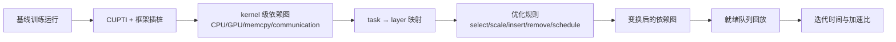

# Daydream：用依赖图回答“这个训练优化值不值得做？”

## 元信息与一手资料

- 论文：*Daydream: Accurately Estimating the Efficacy of Optimizations for DNN Training*
- 作者：Hongyu Zhu、Amar Phanishayee、Gennady Pekhimenko
- 会议：USENIX ATC 2020，pp. 337–352
- 一手资料：[USENIX 论文页](https://www.usenix.org/conference/atc20/presentation/zhu-hongyu) · [正式论文 PDF](https://www.usenix.org/system/files/atc20-zhu-hongyu.pdf) · [arXiv 版本](https://arxiv.org/abs/2006.03318)
- 代码状态：论文没有给出一个可直接复现实验的完整官方 artifact；方法依赖当时的 CUPTI、CUDA 10、框架插桩与 NVIDIA GPU 环境。

## 30 秒总结

Daydream 不是“拿模型结构直接预测任意硬件上的训练时延”，而是先在一个**基线配置**上 profile，得到 CPU 调用、GPU kernel、内存拷贝和通信之间的细粒度依赖图；再由工程师把“AMP、kernel fusion、通信调度”等候选优化翻译成图变换；最后回放变换后的图，估计迭代时间和加速比。

最贴切的类比是：先把一场已经演过的舞台剧录成“演员出场、道具搬运、灯光等待”的流程图；想知道删掉一个换景、让两名演员并行出场会快多少，不必先重排整场戏，而是在流程图上改动后重新排时间。它擅长的是**同一工作负载附近的优化 what-if**，不是 shape、GPU、并行语义都变化时的零样本外推。

## 论文背景与解决的问题

传统 profiler 能回答“时间花在哪里”，却很难回答“尚未实现的优化 X 能快多少”。DNN 训练尤其难，因为：

1. 优化粒度很细。混合精度改变的是部分 GPU kernel 的时长，fusion 甚至会删掉和新增 CPU/GPU 任务。
2. 端到端时间不是各 kernel 时长简单相加。CPU 发射、GPU 执行、内存拷贝、通信可能重叠，真正决定迭代时间的是依赖图的关键路径。
3. 低层 profiler 不认识 DNN layer。CUPTI 知道某个 CUDA kernel 在什么时候运行，却不知道它属于哪一层的 forward、backward 或 optimizer step；而许多优化恰恰以 layer 为描述对象。
4. 不同优化对应不同的结构变化。AMP 可近似为缩短任务，FusedAdam 要删除许多小 kernel 后插入一个大 kernel，P3 则改变通信调度优先级。

因此论文的问题是：**给定一个已能运行的训练 workload 和部署环境，如何用一次 profile，低成本评估多个软件优化的端到端收益？**

## 必要的 AI Infra 背景

### Operator、kernel 和 CUDA API 不是同一层

以 PyTorch 的 `Linear + GELU` 为例：

- `Linear`、`GELU` 是框架层 operator/layer；
- 后端可能把 `Linear` 落成 cuBLAS GEMM kernel，把 GELU 落成一个 elementwise kernel；
- CPU 上先调用 `cudaLaunchKernel`，调用通常很快返回，GPU 随后异步执行 kernel。

所以 CPU 时间轴和 GPU 时间轴不是一条串行列表。若只把 GPU kernel 相加，会漏掉 CPU 发射瓶颈，也会错误处理 CPU/GPU 重叠。

### Stream、依赖与关键路径

同一 CUDA stream 中的 kernel 按序执行；不同 stream 理论上可以并发。CPU 的一次 launch 是对应 GPU kernel 的前驱；`cudaDeviceSynchronize` 又让 CPU 等待此前 GPU 工作完成。把任务作为节点、必须先后发生的关系作为边，就得到有向无环图 `G=(V,E)`。

端到端时间更接近图的 **makespan/关键路径长度**，不是 `Σ 所有节点时长`。例如 8 ms 的 AllReduce 若与 10 ms 的 backward 完全重叠，对迭代只增加约 0 ms；若依赖关系使它无法重叠，就可能增加完整的 8 ms。

### Wait-free backpropagation

数据并行训练中，每个参数梯度一旦由 backward 计算完成，就可以立即发起 AllReduce，而不必等整个 backward 结束。这样前面层的梯度通信可以和后续 backward 重叠。要构造这条依赖，系统必须知道“这个 kernel 属于哪一层、何时产生哪个 gradient bucket”。

## 输入、输出与关键假设

### 输入

- 基线训练的一次或少量迭代 trace：CPU CUDA API、GPU kernel、memcpy、stream/thread、时间和时长；
- 框架插桩产生的 layer 边界、forward/backward/update 阶段以及 gradient-to-bucket 映射；
- 待评估优化的图变换规则，以及新增/改变任务时长的外部估计；
- 分布式 what-if 时的 worker 数、通信原语和网络带宽等配置。

### 输出

- 变换后每个任务的模拟开始时间；
- 预测的单步/单迭代时间、加速比和瓶颈解释；
- 某优化在当前 workload 附近是“明显有效、收益有限还是可能变慢”的判断。

### 假设

- baseline trace 的任务种类、顺序和依赖在 what-if 后仍大体可复用，或能被人工图变换准确描述；
- CPU/GPU task duration 可直接复用或由领域规则缩放；
- 论文观察到当时主流框架通常只有一两个控制线程、一个主要 CUDA stream，低层任务高度串行，因而跨线程依赖数量有限；
- 新 kernel 的时长不是 Daydream 自动学出来的，必须来自已有实现、microbenchmark 或经验估计；
- 单 GPU profile 外推分布式时，通信成本按 gradient 大小、通信原语和网络带宽构造，这一近似不能完整刻画协议、排队和 GPU/通信资源争用。

## 方法流水线



论文把流程分成四阶段：

1. **Trace collection**：用 CUPTI 收集 CUDA API、GPU kernel 和 memcpy；在 Caffe、MXNet、PyTorch 中加入 layer 时间戳和分布式所需信息。
2. **Dependency graph construction**：构造四类 task——GPU、CPU、data loading、communication——并补齐五类依赖。
3. **Graph transformation**：用少量原语表达优化，包括缩放时长、插入/删除任务、按 layer 或 kernel 名选择任务、替换调度策略。
4. **Simulation**：从无前驱节点开始，按调度策略取出就绪任务，在各自执行线程上推进虚拟时间，得到整个图的 makespan。

## 理论描述与核心算法

### 图和任务属性

依赖图记为 `G=(V,E)`。每个任务 `u∈V` 至少带有：

- `u.duration`：任务自身时长；
- `u.gap`：当前 CPU CUDA API 结束到同线程下一 API 开始之间、CUPTI 看不到的非 CUDA CPU 时间；
- `u.ExecutionThread`：CPU thread、GPU stream 或通信 channel；
- `u.layer`：它所属的 DNN layer/阶段；
- `parents(u)` 与 `children(u)`：先后依赖。

论文使用的五类边是：同 CPU thread 顺序、同 GPU stream 顺序、CPU CUDA API 到对应 GPU kernel 的 correlation、GPU 工作到 CUDA synchronization 的等待关系，以及产生 gradient 的计算到通信任务的依赖。这里并非“所有任务串行”；图明确容许 CPU、GPU、通信并行，只是图构造利用了当时 workload **低层任务大多串行、并发线程有限**的经验。

### 同步无扰动的 task-to-layer 映射

若在每层结束时强行 `cudaDeviceSynchronize`，虽然容易知道本层有哪些 kernel，却会改变原执行。Daydream 改为：

1. 在 layer 的 CPU 入口和出口打时间戳，得到 CPU 区间 `C_L`；
2. 找出 `C_L` 内发出的 CUDA launch；
3. 用 CUPTI correlation ID 找到这些 launch 对应的 GPU kernel；
4. 把 kernel 标记为 layer `L` 的 forward/backward/update 任务。

这就是“synchronization-free”：通过 launch 关联而不是人为同步完成映射。

### 回放算法

令 `F` 为所有前驱都已完成的 frontier，`P[t]` 为执行线程 `t` 的当前虚拟时间。选出任务 `u` 后：

```text
u.start = max(P[t], max_{p in parents(u)} finish(p))
P[t] = u.start + u.duration + u.gap
```

随后减少子节点的未完成前驱计数，计数归零就进入 `F`。默认调度器从 frontier 里选“最早可开始”的任务，也允许替换调度策略，以表达 P3 这类通信优先级优化。

### 优化如何变成图变换

- **AMP**：按 kernel 名和类型选择任务；论文示例把 compute-intensive GEMM/conv 缩短约 3 倍、memory-bound elementwise 等缩短约 2 倍。
- **FusedAdam**：删除一个 optimizer update 中成千上万个小 CPU launch 和 GPU elementwise kernel，插入一个融合 kernel；新 kernel 时长用被删 compute-intensive kernel 的总和粗估。
- **Reconstructed BatchNorm**：删除被融合的 activation kernel，并按数据移动减少规则缩短 BatchNorm。
- **分布式训练**：按 gradient bucket 插入 AllReduce，令其依赖对应 backward layer，然后改变 worker 数、带宽或调度策略。

注意这些比例不是可跨所有 GPU、shape 和库版本成立的“物理定律”，而是论文当时使用的领域先验。

## Worked example：为什么 kernel 快 3 倍，训练未必快 3 倍

假设一个简化训练步有：

- CPU 发射与框架开销 4 ms；
- GPU GEMM 12 ms；
- GPU elementwise 4 ms；
- 其中 3 ms CPU 工作与 GPU 重叠。

基线关键路径可近似为 `4 + 12 + 4 - 3 = 17 ms`。若 AMP 使 GEMM 变成 4 ms、elementwise 变成 2 ms，而 CPU 时间不变，则新时间约 `4 + 4 + 2 - 可重叠部分`，不会是 3 倍加速。GPU 变快后，原先藏在 GPU 后面的 CPU launch 反而暴露成新瓶颈。

Daydream 的贡献正是保留 CPU/GPU 依赖后再重排时间，而不是对“整层时间”乘一个 AMP 系数。论文在 BERT-large 上也观察到类似现象：AMP 的单 kernel 理论收益很高，但端到端迭代改善只有 17.2%。

## 实验设置与原文结果

### 设置

- 框架：PyTorch 1.0、MXNet 1.1、Caffe 1.0；
- 软件：Ubuntu 16.04、CUDA 10.0、cuDNN 7.4.1、NCCL 2.4.2；
- 集群：4 台机器，每台 4 张 RTX 2080 Ti，PCIe 3.0；P3 复现实验另使用 P4000；
- 模型/任务：VGG-19、DenseNet-121、ResNet-50、GNMT、BERT base/large，覆盖图像分类、翻译和语言建模；
- 评估五类已有实现的优化，并展示另外多类优化可由图原语表达。

### 应正确引用的数字

- AMP：论文正文称所测模型预测误差均低于约 13%；BERT-large 的突出案例是预测其迭代时间改善 17.2%，误差 `<3%`。
- FusedAdam：BERT/GNMT 预测运行时间与真值相差不超过约 13%；BERT-large 的突出 fusion 案例误差 `<7%`。
- 分布式数据并行：多数 10/20/40 Gbps、不同机器/GPU 数配置误差不超过 10%，但存在例外；论文发现实际 NCCL primitive 平均比简单理论值慢 34%，原因包括与计算 kernel 争用 GPU 资源。
- P3：跨所测网络配置最大预测误差 16.2%，高带宽时因非网络开销和资源竞争被低估。

### 两个常见误读

1. **`<3% / <7%` 不是 Daydream 全路线的总体误差**，只是 BERT-large 的 AMP/fusion 两个代表案例；更完整口径应同时看到 AMP/FusedAdam 跨模型约 13% 的结果以及分布式/P3 的更高误差。
2. **`73.8%` 不是 Daydream 原论文结果**。这是后来的 dPRO 在最多 128 张 V100 上重新比较时报告的 Daydream 最大误差，属于后续论文复测；应单独标注来源。

## 与相关工作的比较

| 方法 | 能回答什么 | Daydream 的差异 |
| --- | --- | --- |
| NVProf/CUPTI/Nsight | “哪个 kernel 慢、硬件计数怎样” | Daydream 在其上补依赖、layer 语义和 what-if 回放 |
| 框架 profiler | “每个 operator/layer 花多久” | Daydream 保留 CPU/GPU/通信细粒度重叠，不只给时间汇总 |
| Coz 等 causal profiler | “若函数 T 虚拟加速 N 倍会怎样” | Daydream 还支持插入、删除任务和重写调度，能表达 fusion/通信优化 |
| Daydream 之后的 dPRO | 目标集群全局 DFG、细通信与组合优化 | dPRO 更重视跨设备时钟、通信协议/排队和自动优化搜索；代价是必须取得目标分布式 trace |
| Proteus | 从模型和并行策略生成目标执行图 | Daydream 从已观测 trace 出发；不原生编译任意 TP/PP 策略和新 shape |

## 优势

- 把“看 profile”提升为“改图后预测”，工程师可以在完整实现优化前做收益筛选；
- 同时包含 CPU、GPU、memcpy 和通信依赖，不能简单归类为纯串行求和；
- task-to-layer 映射把低层可测事实与高层 DNN 语义连接起来；
- 图变换原语少而通用，适合表示 AMP、fusion、压缩、offload 和通信调度等不同优化；
- 一次 profile 可回答同一配置附近的多个 what-if，特别适合优化 triage。

## 关键短板与不适用场景

- **shape 或 kernel route 大变**：batch、sequence length、TP 切分、编译器/库版本变化会改变 kernel、grid、算法和时长，旧 trace 不能无条件复用。
- **新 GPU/新 NPU 零样本预测**：Daydream 没有 component cost model；需要在目标硬件 profile 或外部给出新时长。
- **任意 TP/PP/EP 策略**：它能插入通信并外推当时的数据并行配置，但没有像 Proteus 那样从目标策略编译每 rank 的执行图，也未系统验证现代 TP/PP/MoE。
- **多 stream/并发 kernel**：论文明确指出 CUPTI 当时可能序列化并发 kernel；GNMT 仍能较准不等于一般多流服务可用。
- **通信竞争复杂时**：简单的 `tensor size / bandwidth` 无法充分反映 NCCL 协议、排队、链路拓扑以及通信 kernel 与计算的资源争用；dPRO 后测的大集群误差正暴露了这一点。
- **优化影响收敛/精度**：只预测系统时间，不预测 AMP、压缩等是否改变最终模型质量或 time-to-quality。

## 映射到“输入 → L1/L2/L3 → 输出”

| 层 | Daydream 在做什么 | 没做什么 |
| --- | --- | --- |
| 输入 | 已运行模型、部署配置、CUPTI trace、layer/gradient 映射、候选优化规则 | 不是只有模型名和 GPU 名就能工作 |
| L1 执行图 | 从**实测 trace**重建 kernel 级依赖图，并按优化规则变换 | 不从目标 DP/TP/PP 配置重新编译任意新执行图 |
| L2 算子成本 | 复用已测 duration，或用领域比例缩放；新任务靠外部估计 | 不学习可跨 shape/硬件外推的成本模型 |
| L3 系统模拟 | 在 CPU thread、GPU stream、通信 channel 上回放，保留依赖与部分重叠 | 对现代多流、复杂拓扑共享和动态路由建模不足 |
| 输出 | 迭代时间、优化加速比、瓶颈解释 | 不输出训练质量、SLA 分布或不确定性界 |

## 读完应记住的 5 点

1. Daydream 的中心对象是“**可变换、可回放的低层依赖图**”，不是一个端到端神经网络回归器。
2. 它解决的是已有 workload 附近的优化 what-if；基线 profile 是事实底座，优化模型由工程师提供。
3. 它不是纯串行：CPU、GPU、通信可以重叠；“高度串行”只是论文用于简化依赖构造的 workload 观察。
4. `<3% / <7%` 是 BERT-large 两个案例，`73.8%` 是 dPRO 后续复测，不能混成一个总体指标。
5. 在我们的灰盒架构里，Daydream 最值得继承的是 L1 依赖语义和 L3 回放框架；L2 必须换成能处理新 shape/新 GPU 的成本层，并增加 OOD 拒绝与校准。

## 术语表

| 术语 | 通俗解释 |
| --- | --- |
| CUPTI | NVIDIA 提供的 CUDA profiling 接口，可采集 API、kernel、memcpy、correlation ID 等低层事件 |
| CUDA stream | GPU 工作的有序队列；同 stream 通常按序，不同 stream 可能并发 |
| task | Daydream 图上的最小调度单元，可为 CPU API、GPU kernel、数据加载或通信 |
| dependency graph / DAG | 节点是任务、边表示“必须等谁完成”；无环才能按拓扑顺序推进 |
| frontier | 当前所有前驱均已完成、可以开始调度的任务集合 |
| makespan | 整张执行图从开始到结束的总墙钟时间 |
| wait-free backprop | 某层梯度一完成就立即通信，以和剩余 backward 重叠 |
| graph transformation | 通过选取、缩放、插入、删除和改调度来表达候选优化 |

## 逐条证据索引

- 问题定义、三项独特需求与贡献：正式论文 §1，pp. 337–340，[USENIX PDF](https://www.usenix.org/system/files/atc20-zhu-hongyu.pdf)。
- 四阶段设计、任务/依赖与回放算法：§4，pp. 341–343，[arXiv PDF](https://arxiv.org/pdf/2006.03318)。
- task-to-layer 映射和图变换原语：§4.3–4.4，pp. 342–343，[arXiv](https://arxiv.org/abs/2006.03318)。
- AMP、FusedAdam、分布式和 P3 的建模：§5–6，pp. 343–348，[USENIX 论文页](https://www.usenix.org/conference/atc20/presentation/zhu-hongyu)。
- 适配、新 kernel、并发 kernel 与训练精度边界：§7，pp. 348–349，[正式 PDF](https://www.usenix.org/system/files/atc20-zhu-hongyu.pdf)。
- `73.8%` 的后续复测来源：dPRO §7.5，而非 Daydream 原文，[dPRO PDF](https://proceedings.mlsys.org/paper_files/paper/2022/file/b422680f3db0986ddd7f8f126baaf0fa-Paper.pdf)。
