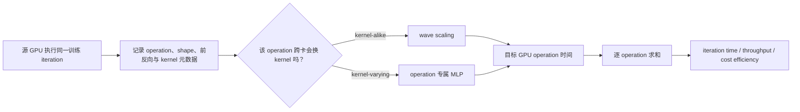

# Habitat：用手头 GPU 预测另一张 GPU 上的训练迭代时间

> 论文：*Habitat: A Runtime-Based Computational Performance Predictor for Deep Neural Network Training*，USENIX ATC 2021  
> 作者：Geoffrey X. Yu、Yubo Gao、Pavel Golikov、Gennady Pekhimenko  
> 技术路线：运行时画像 + 机理缩放 + 少量分类型 MLP  
> 一手资料：[USENIX 论文 PDF](https://www.usenix.org/system/files/atc21-yu.pdf) · [项目主页](https://www.geoffreyyu.com/habitat/) · [代码归档 DOI](https://doi.org/10.5281/zenodo.4885489) · [预训练模型与 kernel 元数据](https://doi.org/10.5281/zenodo.4876277)

## 30 秒总结

Habitat 回答的是一个很具体的问题：**“我能在手头的旧 GPU 上跑这个训练 step，但还没有目标 GPU；它在目标 GPU 上大概多快？”**

它先在源 GPU 上实际执行一个训练迭代，得到每个 PyTorch operation 的 shape、时间以及底层 CUDA kernel 信息。随后把 operation 分为两类：

- 如果不同 GPU 上大概率仍使用同一类 kernel，就用 GPU 的 wave 数、带宽和时钟做 **wave scaling**；
- 如果 cuDNN/cuBLAS 会因 GPU/shape 改换算法，例如卷积、LSTM、BMM、Linear，就用该 operation 专属的 MLP 直接预测目标卡时间。

最后把各 operation 的预测时间相加，得到一次训练迭代时间，再算吞吐和单位租金吞吐。论文在 6 张 GPU、5 个模型的 30 个有向跨卡组合上报告平均误差 11.8%。这不是“无模型、无实测、任意配置”的预测器：**源 GPU 必须能执行同一模型、同一 batch/shape；论文也没有原生建模分布式通信与计算重叠。**

一句类比：Habitat 像先在现有工厂实拍一条生产线，再根据新工厂的传送带速度、工位数量缩放大部分工序；对于会换整套机床的工序，则交给历史数据训练的回归器。

## 先记住这 5 点

1. Habitat 的预测对象是**同一模型、同一 batch size 的一次训练迭代**从源 GPU 到目标 GPU 的迁移。
2. 它是早期灰盒：能用 wave/带宽/时钟解释的用公式，算法会换的少数重算子用 MLP。
3. wave scaling 的关键不是“峰值 FLOPS 比例”，而是 thread block 被分成多少轮 wave 执行，以及每轮更偏计算还是内存。
4. 论文原始结论是 6 GPU、5 模型平均误差 11.8%；“220.9%/725.8%”是 NeuSight 在 2025 年用更新 GPU/模型重新训练和评测 Habitat 基线得到的结果，不是 Habitat 原论文结果。
5. 它主要属于 L2 算子成本层；L1 只复用源端实际执行出来的图，L3 只做 operation 时间求和，不能单独解决 TP/PP/多机通信与调度。

## 1. 背景：为什么“更强的 GPU”不一定更划算

对做后训练或强化学习的人，训练吞吐通常像一个业务指标：tokens/s、samples/s 或 rollout/s。但它来自一长串底层操作：Linear、BMM、Softmax、LayerNorm、反向传播、优化器更新等。不同 GPU 的峰值 FLOPS、显存带宽、SM 数量和价格不同，同一模型未必按“理论 FLOPS 比”加速。

例如，某卡峰值算力是另一张卡的 2 倍，但一个逐元素 LayerNorm kernel 大部分时间在搬 HBM 数据，真正限制它的是带宽；而一个很小的矩阵乘即使算力密集，也可能因为并行 tile 不够而无法填满所有 SM。于是：

- 只看峰值 FLOPS 会把 memory-bound 操作算得过快；
- 只查公开 benchmark 只能覆盖少数模型和 batch；
- 真正在所有候选 GPU 上跑一遍，要求用户已经拿到这些 GPU，违背选型阶段的现实约束。

Habitat 的现实假设是：开发者通常至少有一张 GPU。训练又是重复迭代的，所以测一个代表性 iteration，就可以估计训练期的大部分纯计算表现。

## 2. 必要的 AI Infra 背景

### 2.1 PyTorch operation 不等于 GPU kernel

你在模型代码里写的 `torch.nn.Linear` 是框架层 operation。它的前向、反向可能分别触发多个 CUDA kernel；具体 kernel 由 PyTorch、cuBLAS、cuDNN、输入 shape、dtype 和硬件共同决定。

Habitat 的建模单位表面上是 operation，但 wave scaling 需要进一步观察其底层 kernel。论文通过 monkey patch 包装 PyTorch operation，记录一次 iteration 的 operation；又用 CUDA events 重放单个 operation 测时间，用 CUPTI 获取 kernel 时间和性能计数器。

### 2.2 SM、thread block 和 wave

- **SM（Streaming Multiprocessor）**：GPU 上可并行执行线程块的一组计算资源，类似“车间”。
- **thread block**：CUDA 调度的基本工作组，类似一箱独立工件。
- **occupancy**：一个 SM 同时能驻留多少 block/warp，受寄存器、shared memory、线程数等约束。
- **wave**：所有 SM 在同一轮可并行吞下的一组 block。若 kernel 有 240 个 block，而整张卡一轮能驻留 40 个 block，就大约有 6 个 wave。

所谓 tail effect：若 41 个 block 分给每轮容量 40 的 GPU，第二轮只有 1 个 block，绝大部分 SM 空闲；shape 只增加一点，时间却可能跨一个 wave 台阶。

### 2.3 Roofline、算术强度和 ridge point

算术强度定义为：

$$
x=\frac{\text{FLOPs}}{\text{从显存读写的字节数}}
$$

GPU 的理论可达吞吐受两条上限约束：

$$
P_{roof}=\min(P, D\cdot x)
$$

其中 `P` 是峰值计算吞吐，`D` 是显存带宽。两条上限交点 `R = P / D` 称 ridge point：`x < R` 更偏 memory-bound，`x ≥ R` 更偏 compute-bound。

Habitat 没把 roofline 直接当时间答案，而是用它估计 wave scaling 中的“内存受限程度” γ。

### 2.4 为什么同一个 operation 会换 kernel

cuDNN/cuBLAS 会在多种实现中选路。例如卷积可以采用 direct、Winograd、FFT 等不同算法；GEMM 也会根据尺寸、对齐、dtype 和 GPU 架构选不同 tile。高层 operation 名相同，不代表底层代码相同。

Habitat 因而区分：

- **kernel-alike**：跨 GPU 使用相同或足够相似的 kernel，例如很多逐元素操作；
- **kernel-varying**：跨 GPU 可能更换实现，论文覆盖 Conv2D、LSTM、BMM、Linear。

## 3. 问题定义、输入输出与假设

### 3.1 输入

- 能在源 GPU 上实际执行的 PyTorch 训练 iteration；
- 固定的模型代码、训练过程和 batch size；
- 源 GPU 的 runtime 画像：operation 序列、输入参数、前反向时间、kernel 名、launch 配置、性能计数器；
- 目标 GPU 的内存容量/带宽、SM 数、峰值 FLOPS、时钟等硬件规格；
- kernel-varying operation 的预训练 MLP。

### 3.2 输出

- 目标 GPU 上一次训练迭代的预测时间；
- `throughput = batch_size / iteration_time`；
- `cost-normalized throughput = throughput / hourly rent`。

### 3.3 关键假设

1. 一个或少数 iteration 能代表整个稳定训练阶段；初始化、数据加载、checkpoint、评估等不在核心模型内。
2. 预测时模型与 batch/shape 不变。论文明确写的是“same batch size”。
3. operation 可独立重放并计时，单个 operation 的时间可以作为整体时间组成部分。
4. kernel-alike 类在源、目标 GPU 上确实保持同一种底层实现。
5. iteration 级时间可由 operation 预测时间相加近似；复杂的多流并发和系统级重叠不是它的重点。
6. 目标 GPU 的行为仍落在 wave 模型或 MLP 训练分布可以描述的范围内。

## 4. 方法全流程

### 4.1 在源 GPU 上采样一轮真实执行

Habitat 用 monkey patch 包装 PyTorch operation。用户用 `track()` 标记要画像的迭代区间。为准确测量很短的 operation，它会按原输入独立重放多次，并用 CUDA events 测前向和相应反向时间；CUPTI 提供底层 kernel 时间和算术强度所需计数器。

这一步解释了 Habitat 的“runtime-based”：它不是仅从模型参数量或 FLOPs 猜时间，而是以一次真实运行作为锚点。

### 4.2 对 kernel-alike 操作做 wave scaling

论文记：

- `T_i`：kernel 在 GPU `i` 上的时间；
- `B`：kernel 的 thread block 总数；
- `W_i`：GPU `i` 一轮 wave 可同时执行的 block 数；
- `D_i`：GPU `i` 的实测显存带宽；
- `C_i`：GPU `i` 的时钟频率；
- `o, d`：source/origin 和 destination；
- `γ ∈ [0, 1]`：memory-boundedness，越大越偏内存受限。

完整 wave scaling 为：

$$
T_d=
\left\lceil\frac{B}{W_d}\right\rceil
\left(\frac{D_o}{D_d}\frac{W_d}{W_o}\right)^\gamma
\left(\frac{C_o}{C_d}\right)^{1-\gamma}
\left\lceil\frac{B}{W_o}\right\rceil^{-1}T_o
$$

第一项与倒数第二项体现目标卡与源卡需要多少轮 wave；中间两项分别按内存和计算倾向缩放“每轮”的速度。

当 block 很多、取整影响小，论文采用简化式：

$$
T_d\approx
\left(\frac{D_o}{D_d}\right)^\gamma
\left(\frac{W_o}{W_d}\right)^{1-\gamma}
\left(\frac{C_o}{C_d}\right)^{1-\gamma}T_o
$$

注意：这不是一般意义上的精确 GPU 模拟。论文也明确承认时钟影响还与 ISA 等因素相关，但为了简单、可理解，没有继续建模。

### 4.3 用 roofline 选择 γ

目标卡 ridge point 为 `R = P / D`，源端 profile 得到 kernel 算术强度 `x`。Habitat 使用经验分段函数：

$$
\gamma=
\begin{cases}
1-\frac{0.5x}{R}, & x<R\\
\frac{0.5R}{x}, & x\ge R
\end{cases}
$$

因此：

- 极低算术强度时 `γ → 1`，主要按带宽缩放；
- 在 ridge point 处 `γ = 0.5`；
- 极高算术强度时 `γ → 0`，更多按并行度/时钟缩放。

由于 CUPTI 计数器采集慢，Habitat 缓存 `(kernel 名, block 数, block size)` 的计数；只为重要 operation 采集，论文示例阈值为时间处于 99.5 percentile 以上。若没有计数，则令 `γ = 1`，假设多数简单 kernel-alike 操作偏 memory-bound。

### 4.4 对 kernel-varying 操作用 MLP

对 Conv2D、LSTM、BMM、Linear 分别训练一个 MLP，输入包括：

- operation shape/参数，例如卷积 batch、通道、kernel size、stride；
- 目标 GPU 显存容量与带宽；
- SM 数；
- 厂商标称峰值 FLOPS。

输出是该 operation 在目标 GPU 上的前向加反向时间。每个 MLP 有 8 个隐藏层、每层 1024 单元、ReLU；用 Adam 训练 80 epoch，损失是 MAPE。论文数据量按 operation 分别约为：Conv2D 91,138、LSTM 124,176、BMM 131,022、Linear 155,596 个唯一配置，每个配置在 6 张卡测量。

这里“分段学习”的真正含义是**先按离散实现机制分流**：不要用一条连续公式强行穿过 cuDNN/cuBLAS 的算法切换台阶。

### 4.5 汇总成迭代时间

每个 operation 得到目标卡时间后直接相加：

$$
\hat T_{iter}=\sum_{op\in iteration}\hat T_{op}
$$

然后由 batch size 计算训练吞吐和价格归一化吞吐。这个汇总没有构造跨 GPU 通信图，也没有做系统级事件模拟。

## 5. 一个通俗 worked example

下面是教学例子，不是论文原始数据。

假设一个逐元素 kernel 在源卡耗时 `T_o = 4 ms`，总共 240 个 block：

- 源卡每 wave 能执行 `W_o = 20` 个 block，共 12 wave；
- 目标卡每 wave 能执行 `W_d = 40` 个 block，共 6 wave；
- 源/目标实测带宽为 500/1000 GB/s；
- 源/目标时钟为 1.2/1.5 GHz；
- roofline 判断它偏 memory-bound，令 `γ = 0.8`。

代入完整公式：

$$
T_d=6\times(0.5\times2)^{0.8}\times(0.8)^{0.2}\times\frac{1}{12}\times4
\approx1.91\text{ ms}
$$

目标卡 wave 容量翻倍、带宽翻倍且时钟略高，因此约快 2.1 倍。

但如果这个 operation 是 BMM，目标 GPU 上 cuBLAS 可能换成完全不同的 tile/tactic，源端 block/wave 关系不再可复用。Habitat 此时把形如 `[batch, M, K, N, 目标卡规格]` 的特征交给 BMM MLP。这个“先判断机制是否连续、再决定公式还是模型”的思想，比数字本身更值得继承。

## 6. 原论文实验与数字

### 6.1 实验设置

- GPU：P4000、P100、V100、RTX 2070、RTX 2080Ti、T4，覆盖 Pascal、Volta、Turing；
- 模型：ResNet-50、Inception v3、Transformer、GNMT、DCGAN；
- 框架：PyTorch 1.4.0；
- 所有 6 张 GPU 的有向 source→destination 组合，共 30 对；
- 每个模型评估 3 个 batch size；机器翻译模型固定 sequence length=50；
- 3 次 warmup 丢弃，再平均 3 次测量。

### 6.2 主要结果（Habitat 原文）

| 结果 | 原文数字 | 正确解读 |
| --- | ---: | --- |
| 跨卡端到端迭代时间平均误差 | 11.8% | 6 GPU × 5 模型 × 多 batch 的总体平均 |
| ResNet-50 | 13.4% | 模型维度平均误差 |
| Inception v3 | 9.5% | 同上 |
| Transformer | 12.6% | 同上，且实验固定 seq=50 |
| GNMT | 11.2% | 同上 |
| DCGAN | 12.3% | 同上 |
| 4 类 MLP operation 平均误差 | 18.0% | Conv2D/LSTM/BMM/Linear 的 operation 级平均 |
| wave scaling operation 平均误差 | 29.8% | 某些误差大的操作权重很小，不能直接等同端到端误差 |

95% 的“唯一 operation 类型/实例”采用 wave scaling，但只占平均迭代时间的 46%；其余 5% 使用 MLP，却占 54% 的时间。这恰好说明少数矩阵/卷积类重算子决定大部分运行时间。

论文两个选型案例分别显示：T4 可在 GNMT 上提供最佳租金归一化吞吐；DCGAN 上 V100 相对 2080Ti 仅约 1.1×，不一定值得租用。这说明预测不只为了一个 MAPE 数字，而是为了保持选型结论。

### 6.3 不要混淆“原论文”和“后续复测”

NeuSight（ASPLOS 2025）用更新的数据集重新训练 Habitat 风格基线，并在新 GPU/新模型上评估，报告：

- 端到端 inference/training 平均误差分别 220.9%/725.8%；
- OOD GPU 平均误差 724.3%，最大 4529.9%。

这些数字说明直接回归 latency 在强 OOD 条件下可能失效，但**它们不是 Habitat 2021 原论文的实验结果**。数据、软件版本、GPU、模型和 baseline 重训练方式都不同。正确写法是：“Habitat 原文在其 2021 范围内为 11.8%；NeuSight 后续复测展示了更强 OOD 下的退化。”

## 7. 与相关工作的区别

| 方法 | 需要什么 | 如何预测 | Habitat 的区别 |
| --- | --- | --- | --- |
| 公开 benchmark | 已有人跑过相同模型/配置 | 查表 | Habitat 可处理用户自己的模型，但仍需源卡实跑 |
| 纯解析模型 | 硬件细节和 operation 公式 | 手工推导时间 | Habitat 用源端真实执行锚定，并用 MLP覆盖换 kernel 操作 |
| 纯 ML 回归 | 大量 `(shape, GPU)→latency` 标签 | 直接拟合绝对时间 | Habitat 让多数 kernel-alike 操作走可解释 wave 公式 |
| Daydream | 同一硬件 profile + 图变换 | 评估优化前后 | Habitat 主要换 GPU；论文还演示与 Daydream 组合预测异卡 AMP |
| NeuSight | tile 元数据、GPU 规格、训练数据 | roofline 约束下学习 utilization | NeuSight 进一步把 MLP 从“直接学时间”改为“学有界利用率”，强调新 GPU/新 shape 外推 |

Habitat 的历史位置很重要：它已经不是“全硬编码”，也不是“所有东西都交给神经网络”，而是一个早期机制分流的混合方案。不过它的 MLP 分支仍直接输出 latency，物理约束只用于 wave 分支的 γ，所以强 OOD 时仍脆弱。

## 8. 优势

- **现实锚点强**：源 GPU 真跑一次，避免只看理论 FLOPS。
- **机制可解释**：wave、带宽、时钟和算术强度说明了缩放来源。
- **学习范围受控**：只为少数 kernel-varying operation 训练专属 MLP。
- **模型级复用**：operation 是常见积木，MLP 数据可以跨 DNN 复用。
- **适合早期 GPU 选型**：目标 GPU 不要求实跑模型，只需规格和已有预测器。

## 9. 关键短板与不适用场景

### 9.1 不能从“模型名字”凭空得到新配置结论

论文的源端 profile 针对**具体模型、具体 batch size 和 shape**。如果把 batch、sequence length、精度、并行切分改掉，operation shape、kernel 路径、block 数都会改变，需要重新得到相应图或画像。论文对超出源卡容量的大 batch 只提出用几个较小 batch 做线性外推的设想，并未作为完整验证能力。

### 9.2 kernel-alike 判断错误会直接破坏公式

驱动、cuDNN/cuBLAS 版本或 GPU 架构变化可能让原本“相似”的 operation 改换 kernel。wave scaling 没有显式算法路径检测器；它依赖预先划分的 operation 类型和源端元数据。

### 9.3 MLP 直接学绝对 latency，OOD 无硬边界

MLP 输入虽含 GPU 规格，但它仍可能在新架构、新 dtype、训练范围外的巨大 GEMM shape 上产生不物理的外推。NeuSight 的后续结果正是这个风险的实例，而不是对 Habitat 原实验的简单否定。

### 9.4 分布式不是 Habitat 本体解决的问题

论文把分布式迭代拆为：单卡计算、通信、计算通信重叠。Habitat 只可贡献第一项。对于 DP，可把单卡预测接到其他通信模型；对于模型并行/流水并行，用户还要先按策略拆图，通信与重叠需要新模型。

因此它不适合单独回答：

- TP/PP/EP 改变后每 rank 的局部 shape 与通信量；
- 多机网络拓扑、NCCL 算法、拥塞和带宽共享；
- pipeline bubble、microbatch 调度；
- 多流并发、异步预取和复杂 overlap。

### 9.5 动态 workload 覆盖弱

论文的机器翻译实验固定 seq=50。变长序列、MoE 动态路由、RL rollout 中动态 batch、服务端 continuous batching 都会让一次静态 iteration 不再代表整体分布。

### 9.6 软件栈与数据年代限制

原实验是 PyTorch 1.4、FP32 为主、Pascal/Volta/Turing。现代 Tensor Core、TF32/BF16/FP8、FlashAttention、`torch.compile` 融合和 Triton kernel 会改变“什么是一个 operation/kernel”以及算法选路。

## 10. 映射到“输入 → L1 → L2 → L3 → 输出”

| 层 | Habitat 在做什么 | 没有做什么 |
| --- | --- | --- |
| 输入 | 模型代码、固定训练配置、源/目标 GPU | 不能只有模型名字或参数量 |
| L1 执行图生成 | 从源 GPU 一次真实 PyTorch 执行中拦截 operation 图 | 不按新 DP/TP/PP 策略编译目标分布式图；不自动生成未运行的新 shape |
| L2 算子成本 | kernel-alike 用 wave scaling；kernel-varying 用 MLP | 不保证全新 kernel/tactic；MLP 分支没有严格物理边界 |
| L3 系统模拟 | 基本为 operation 预测时间求和 | 不模拟多流、通信、带宽共享、并行调度和关键路径 |
| 输出 | iteration time、throughput、cost-normalized throughput | 不直接输出多机 SLA、尾延迟或动态请求吞吐 |

对你们的灰盒方案，Habitat 最值得继承的是 L2 的**分流思想**，不应原样继承的是“MLP 直接输出绝对 latency”和“简单求和承担整个 L3”。

## 11. 对当前灰盒落地的启示

1. 真实 profile 应当是校准锚点，而不是把整张 trace 原封不动复用到所有 shape。
2. 先检测离散 kernel/tactic 区域，再在每个区域做连续缩放；算法切换边界必须单独采样。
3. Roofline 应作为硬边界或基线，ML 更适合学 utilization/residual，而不是无约束绝对时间。
4. 缓存键至少包含 operation/kernel family、dtype、完整局部 shape、layout、软件栈和硬件；只按 operation 名命中不够。
5. L2 的跨卡预测必须交给 L1 的目标 shape 推导和 L3 的事件模拟，三层不能互相替代。

## 12. 自测问题

1. 为什么 Habitat 不能简单按目标/源 GPU 峰值 FLOPS 比缩放所有 operation？
2. `B = 41, W = 40` 与 `B = 40, W = 40` 为什么可能出现时间台阶？
3. kernel-alike 和 kernel-varying 的划分错误分别会造成什么后果？
4. 为什么论文的 operation 级 wave scaling 平均误差 29.8%，端到端却仍能达到 11.8%？
5. 把 batch 32 改成 batch 128 时，哪些输入量需要重新获取？
6. 为什么 Habitat 可以成为 DP 模拟器的计算成本输入，却不能单独给出多机 DP iteration time？
7. NeuSight 的 725.8% 应该怎样引用才不误导？

## 13. 术语表

| 术语 | 通俗解释 |
| --- | --- |
| origin/source GPU | 手头能实际运行模型、提供画像的 GPU |
| destination/target GPU | 想预测但不一定能拿到的 GPU |
| operation | 框架层操作，如 Linear、BMM、LayerNorm |
| CUDA kernel | GPU 真正启动执行的一段设备程序 |
| kernel-alike | 不同 GPU 上底层实现足够相似，可按执行机制缩放 |
| kernel-varying | 库会因 GPU/shape 改换底层算法，需要数据驱动模型 |
| thread block | CUDA 的线程工作组和调度单元 |
| occupancy | 一个 SM 可同时驻留的活跃线程/warp/block 程度 |
| wave | 所有 SM 一轮可并行处理的一批 block |
| arithmetic intensity | 每搬运一字节数据完成多少 FLOP |
| ridge point | roofline 中从带宽受限转为算力受限的分界 |
| MAPE | 各样本绝对百分比误差的平均；小真值会放大该指标 |

## 14. 证据索引

- 论文摘要、6 GPU/5 模型与 11.8%：[USENIX PDF，第 1–2、7–9 页](https://www.usenix.org/system/files/atc21-yu.pdf)
- 三个关键观察、相同 batch 与两路预测：[论文 §3.1–3.2](https://www.usenix.org/system/files/atc21-yu.pdf)
- wave scaling 与公式：[论文 §3.3](https://www.usenix.org/system/files/atc21-yu.pdf)
- roofline 与 γ 分段函数：[论文 §4.2](https://www.usenix.org/system/files/atc21-yu.pdf)
- MLP 特征、数据与训练：[论文 §3.4、§4.3](https://www.usenix.org/system/files/atc21-yu.pdf)
- 分布式、混合精度和更大 batch 的边界：[论文 §6.1](https://www.usenix.org/system/files/atc21-yu.pdf)
- 后续 OOD 复测：[NeuSight ASPLOS 2025 PDF，§6.2](https://arxiv.org/pdf/2407.13853)
