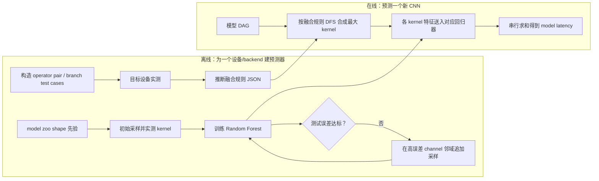

# nn-Meter：先探测设备真正执行的融合 kernel，再做分 kernel 时延回归

> 论文：*nn-Meter: Towards Accurate Latency Prediction of Deep-Learning Model Inference on Diverse Edge Devices*，ACM MobiSys 2021（Best Paper）  
> 作者：Li Lyna Zhang、Shihao Han、Jianyu Wei、Ningxin Zheng、Ting Cao、Yuqing Yang、Yunxin Liu  
> 技术路线：黑盒融合规则探测 + 自适应采样 + 分 kernel 随机森林回归  
> 一手资料：[论文 PDF](https://air.tsinghua.edu.cn/pdf/nn-Meter-Towards-Accurate-Latency-Prediction-of-Deep-Learning-Model-Inference-on-Diverse-Edge-Devices.pdf) · [DOI](https://doi.org/10.1145/3458864.3467882) · [Microsoft Research 项目页](https://www.microsoft.com/en-us/research/publication/nn-meter-towards-accurate-latency-prediction-of-deep-learning-model-inference-on-diverse-edge-devices/) · [官方代码](https://github.com/microsoft/nn-Meter)

## 30 秒总结

nn-Meter 回答的是：**“面对闭源、优化规则各异的边缘设备 runtime，怎样低成本预测一个新 CNN 的端到端推理时延？”**

它认为两个常见粒度都不理想：整个模型级回归难以泛化到新图；逐 operator 求和又看不到 runtime 的算子融合。于是把建模粒度放在 **kernel**：设备实际一次执行的单元，可能是单个 Conv，也可能是 `Conv++BN++ReLU` 这样的融合单元。

nn-Meter 先用小型测试图在黑盒设备上计时，推断哪些 operator 组合会被融合；再把任意 CNN 图按这些规则合并成 kernel。对每类 kernel，它从真实模型中构造先验分布，并围绕回归误差大的 channel 区域追加样本，训练 Random Forest。在线预测时识别 kernel、查对应回归器、把各 kernel 时延相加。

论文在 26,000 个 CNN 上报告落入 ±10% 误差带的比例：移动 CPU 99.0%、移动 GPU 99.1%、Intel VPU 83.4%。所以不能笼统写成“三种设备约 99%”。跨设备零样本迁移也不是它的强项：Adreno 640 预测器直接用于 630 时部分模型明显退化，重建 630 预测器后才回到 99.0%。

一句类比：如果 `Conv→BN→ReLU` 在某设备上会被厨师“一锅炒”，就不能把三道菜各自耗时相加；nn-Meter 先用试菜探出“一锅炒规则”，再学习每种锅和份量要多久。

## 先记住这 5 点

1. nn-Meter 中的 kernel 是**设备 runtime 的执行单元**，不一定等同于 NVIDIA CUDA 源码里的 kernel；在 CPU/VPU 上也用这个抽象。
2. 它的核心贡献不只是回归，而是先用黑盒 test cases 探测融合边界，避免把不会单独执行的 operator 各算一次。
3. 自适应采样专门追踪 shape→latency 的台阶和高误差区，而不是均匀撒点。
4. headline ±10% accuracy 是 CPU 99.0%、GPU 99.1%、VPU 83.4%；换设备/换 backend 需要重新探测和 profiling。
5. 它适合 2021 年边缘 CNN 串行推理；不能原样用于服务端多流 GPU、LLM continuous batching、训练反向与多机通信。

## 1. 背景：FLOPs 相同，为什么时延仍可能不同

做后训练时，我们习惯从 batch、sequence length、hidden size 推导 FLOPs。但在部署端，两个 FLOPs 相近的网络可能有完全不同的时延：

- 内存访问量不同；
- depthwise convolution 和普通 convolution 对硬件的利用方式不同；
- graph runtime 可能把 `Conv+BN+ReLU` 融合成一次执行；
- 某些 shape 正好满足向量化/对齐要求，另一些 shape 会跨硬件调度台阶；
- CPU、移动 GPU、VPU 的融合规则和 kernel 实现不一样。

论文把已有预测方法分成两类：

- **model-level**：把整个 DAG 输入 GCN/回归器。图和 shape 组合空间巨大，未见过的新图容易 OOD；
- **operator-level**：为 Conv、BN、ReLU 各建回归器，再求和。它忽略 runtime 已把三者融合，容易重复计算中间写回和启动开销。

nn-Meter 的折中是 kernel-level：比模型细、容易复用；又比原始 operator 更接近实际 runtime。

## 2. 必要的 AI Infra 背景

### 2.1 模型 DAG、operator 与 runtime backend

一个 CNN 可以表示为有向无环图（DAG）：节点是 Conv、Add、ReLU 等 operator，边是 tensor。TFLite、OpenVINO、SNPE、MNN 等 runtime 会把高层图变换成目标 CPU/GPU/VPU 能执行的计划。

同一个 TFLite 图交给不同 backend，执行单元可能不同：

- CPU：`Conv`、`BN`、`ReLU` 可能部分分开；
- 移动 GPU：为了少写一次显存，可能融合为 `Conv++BN++ReLU`；
- VPU：闭源 compiler 还可能采用另一组融合规则。

### 2.2 什么是 operator fusion

未融合时，Conv 输出要写内存，BN 再读写一次，ReLU 再读写一次。融合后，底层循环在生成一个输出元素时顺手完成 BN/ReLU，中间 tensor 不必反复落到外部内存。

融合会减少：

- kernel 启动/调度开销；
- 中间结果的内存读写；
- 某些临时 buffer。

因此 `T(Conv+BN+ReLU)` 通常明显小于 `T(Conv)+T(BN)+T(ReLU)`。

### 2.3 为什么 shape→latency 有台阶

以输出 channel 为例，硬件可能每次处理 8、16 或 32 个 channel。`Cout=64` 恰好整除，`Cout=65` 需要多开一轮并浪费大部分 lane。于是 FLOPs 只多约 1.6%，时间却可能跳一个台阶。

这和你熟悉的 RL 环境采样有点像：reward surface 不是处处光滑，而是被离散策略切换分成很多区域。对这种函数，随机均匀采样容易错过决策边界。

### 2.4 论文中的“±10% accuracy”

这里 accuracy 不是分类正确率，而是：

$$
Accuracy_{\pm10\%}=\frac{\#\{|\hat T-T|/T\le 10\%\}}{\#samples}
$$

它回答“多少模型的预测落在真值 ±10% 内”。它不能替代 P95 误差、最坏低估或 SLA 风险分析。

## 3. 问题定义、输入输出与假设

### 3.1 离线阶段输入

- 目标设备和 inference backend，例如 Pixel 4 CPU + TFLite 2.1；
- 可在设备上运行的 pairwise/branch test cases；
- 典型 CNN model zoo 提供的 shape 先验；
- 一批 kernel 配置在目标设备上的真实时延标签。

### 3.2 在线阶段输入

- 待预测 CNN 的模型 DAG；
- 各 operator 的类型、连接关系和配置，例如 `HW,K,S,Cin,Cout`；
- 已探测的目标 backend 融合规则；
- 每类 kernel 的设备专属回归器。

### 3.3 输出

- 每个融合 kernel 的预测时延；
- 所有 kernel 时延之和，即模型端到端推理 latency。

### 3.4 核心假设

1. edge backend 上 kernel 基本串行执行，即使图中没有数据依赖也不做多 kernel 并发；
2. 大部分重要 graph optimization 可以用有限的 operator 类型和三类连接模式探测；
3. 同一 backend 的融合规则在待预测模型上可复用；
4. sampled kernel shape 足以覆盖待预测分布，回归器能在区域内插值；
5. 推理期间设备状态相对稳定，当前 CPU 利用率、温控降频等动态资源不进入模型；
6. 论文只实证 CNN inference，没有训练反向、NLP/LLM 或分布式通信。

## 4. 方法全流程



## 5. 技术一：黑盒 kernel / 融合规则探测

### 5.1 为什么要黑盒探测

很多 edge backend 和 VPU compiler 不开源，即使开源，不同版本和硬件插件也可能有不同优化。nn-Meter 不要求读源代码，而是设计小模型，用**相连执行是否显著快于分开执行**来判断融合。

对于单入边、单出边的 `Op1→Op2`，论文使用：

$$
T_{Op1}+T_{Op2}-T_{(Op1,Op2)}
>\alpha\cdot\min(T_{Op1},T_{Op2})
$$

满足则认为发生融合。实验取 $\alpha=0.5$。

直觉是：连接图比两个单算子总和省下的时间，必须超过较短算子的一定比例，才不是测量噪声。

### 5.2 连接结构也影响融合

任意 DAG 可拆成三种基本局部结构：

- single inbound/outbound：链式 `A→B`；
- multi-outbound：一个节点输出给多个后继；
- multi-inbound：多个前驱汇入 Add/Concat 等节点。

多出边时随意融合会导致前驱重复计算、同时保存更多中间值，甚至引入依赖环；多入边时则要比较“左分支与汇合点融合”“右分支融合”或“不融合”哪个更符合实测时间。

nn-Meter 将探测结果保存为 JSON，例如某 backend 是否支持 `conv_bn`、`conv_relu`、`conv_add`，以及 multi-inbound/outbound 规则。

### 5.3 从规则到整图 kernel

算法从模型图做深度优先遍历（DFS），递归应用规则并寻找最大可融合单元。论文在 ResNet-18 子图示例中识别出：

- `maxpool`；
- `Conv++BN++ReLU`；
- `Conv++BN++Add++ReLU`。

这里的价值是把设备私有 runtime 行为变成可显式审计的离散规则，而不是让一个大模型隐式猜测。

## 6. 技术二：自适应采样和分 kernel 回归

### 6.1 为什么不能枚举

Conv 的核心配置可写为：

$$
(HW,K,S,C_{in},C_{out})
$$

论文从 24 个 CNN 观察到 $HW,K,S$ 候选较有限，但 channel 范围很大；完整 `Conv++BN++ReLU` 空间约 7 亿配置。逐点上设备测量不可行。

### 6.2 从模型先验开始

nn-Meter 先统计 24 个现有 CNN 中各维度出现的分布，形成 prior probability distribution $P$。初始采样量论文设为：

- Conv：10,000；
- DWConv：5,000；
- 其他 kernel：2,000。

这相当于告诉 sampler：“先去真实模型设计者常用的区域，不要大量测几百 MB、现实中几乎不会出现的卷积。”

### 6.3 围绕高误差点追加样本

初始样本训练回归器后，算法在测试集上找误差大的配置 $X^*$。对每个高误差点，固定 $HW,K,S$，在 channel 邻域细采样：

$$
C'\sim[0.4C,1.2C]
$$

论文每点取 $M=10$ 个邻域样本，并把新数据加入训练/测试集，迭代到误差阈值满足。它专门追逐由 channel 对齐、并行切分造成的 staircase pattern。

### 6.4 回归器和特征

论文为每类 kernel 训练 Random Forest Regression。Conv 类特征除了原始 shape，还包括 FLOPs 和参数量；其他 kernel 使用相应的输入/输出尺寸。

最终模型时间是：

$$
\hat T(m)=\sum_{o\in kernels(m)}f_o(x_o)
$$

其中 $f_o$ 是 kernel 类型 $o$ 的设备专属回归器，$x_o$ 是该 kernel 的 shape/派生特征。

## 7. 两个 worked examples

### 7.1 论文原始融合探测例子：Pool + ReLU

论文 Table 3 给出：

| backend | Pool 单独 | ReLU 单独 | 相连执行 | 结论 |
| --- | ---: | ---: | ---: | --- |
| VPU | 13 µs | 26 µs | 16 µs | 融合 |
| 移动 GPU | 5.08 µs | 3.50 µs | 6.00 µs | 融合 |
| 移动 CPU | 23.60 µs | 0.81 µs | 24.48 µs | 不融合 |

以 GPU 为例：

$$
5.08+3.50-6.00=2.58>0.5\times3.50=1.75
$$

所以记录 `pool_relu=true`。CPU 则为：

$$
23.60+0.81-24.48=-0.07\not>0.405
$$

所以记录 `pool_relu=false`。同一高层图在不同 backend 上会被切成不同 kernel，这正是“每设备建模”不可省略的原因。

### 7.2 Transformer 类比：为什么理念可迁移但论文结果不能直接迁移

假设现代 LLM 中存在：

```text
Linear → BiasAdd → GELU
```

若目标 GPU/backend 将三者融合成一个 epilogue kernel，逐 operator 回归后求和会重复计算中间 HBM 写回。nn-Meter 的方法论会要求：

1. 用试验图探测 `Linear+Bias+GELU` 在这个软件栈上是否融合；
2. 如果融合，把它当作一个 kernel family；
3. 对 `[M,K,N,dtype,layout]` 在算法切换边界附近自适应采样；
4. 用该 family 的实测数据校准。

但 nn-Meter 2021 没有做这组实验，也没有覆盖 FlashAttention、Triton、KV cache 或 continuous batching，所以不能把 CNN 的 99% headline 直接声称为 LLM 精度。

## 8. 原论文实验与数字

### 8.1 设备和数据集

- 移动 CPU：Pixel 4，Cortex-A76，TFLite 2.1；
- 移动 GPU：Xiaomi Mi 9，Adreno 640，TFLite 2.1；
- VPU：Intel NCS2，Myriad X，OpenVINO 2019 R2；
- 26,000 个 CNN；
- 14 类 operator、144,217 个唯一配置、2,012 种模型图；
- 覆盖 AlexNet/VGG/DenseNet/ResNet/GoogleNet/SqueezeNet/MobileNet/MnasNet/ProxylessNAS/NASBench201 等变体。

论文明确只评估 CNN；原因是当时 edge backend 对 NLP 模型支持不足。

### 8.2 Headline 结果的准确写法

| 设备 | 落入 ±10% 误差带的模型比例 |
| --- | ---: |
| 移动 CPU | 99.0% |
| 移动 GPU | 99.1% |
| Intel VPU | 83.4% |

因此“约 99%”只适用于 CPU/GPU，不适用于 VPU。

在专门的 unseen-model k-fold 实验中，nn-Meter 在所选模型族和三类设备上平均 ±10% accuracy 为 89.2%，对比 FLOPs 22.1%、FLOPs+MAC 17.1%、BRP-NAS 8.5%。这是比 full-dataset headline 更严格但范围不同的实验，二者也不应混写。

### 8.3 Ablation 与开销

- Conv/DWConv 平均占模型时间：CPU 94.2%、GPU 91.91%、VPU 75.5%；
- operator-level 求和的 ±10% accuracy：CPU 91.3%、GPU 53.7%、VPU 8.5%；
- 相同采样预算下，Conv 自适应采样 accuracy：CPU 71.78%、GPU 75.34%、VPU 54.33%；随机采样分别 21.92%、48.70%、23.98%；
- 单设备完成采样测量时间：CPU 2.5 天、GPU 1 天、VPU 4.4 天。

这些开销说明“为新设备重建”虽然比枚举便宜，却绝不是零成本。

### 8.4 跨设备泛化实验

论文把 Adreno 640 的 predictor 直接用于较老的 Adreno 630：含 Conv 和 DWConv 的部分模型表现尚可，但 Conv-dominated 模型 RMSPE 常超过 15%，因为两个 GPU 对 Conv 与 DWConv 的相对加速不同。重新在 Adreno 630 上采样并建 predictor 后，全体 ±10% accuracy 达到 99.0%。

正确结论是：nn-Meter 支持**高效重建设备专属 predictor**，而不是已经实现任意 edge device 零样本迁移。

## 9. 与相关工作的区别

| 方法 | 粒度/信息 | 主要问题 | nn-Meter 的应对 |
| --- | --- | --- | --- |
| FLOPs/MAC 代理 | 整模型统计量 | 看不到算子类型、融合、shape 台阶 | 为每类实际 kernel 建回归器 |
| NeuralPower/PALEO | operator/layer 级求和 | 忽略 graph runtime 融合 | 先探测融合再求和 |
| BRP-NAS | GCN 编码模型图 | 对新图/不同规模图泛化弱，需模型级标签 | kernel 是可跨模型复用的积木 |
| TVM cost model | 低层 schedule/AST/code 特征 | 需要可见的实现代码和 autotuning | 通过黑盒计时适配闭源 backend |
| cycle-accurate simulator | 微架构细节 | 构建慢、需要厂商细节 | 用实测 + 回归做工程近似 |
| Habitat | 跨 GPU training operation 成本 | 假设已知源端运行，换 kernel 用 MLP | nn-Meter 聚焦 edge inference 与融合规则探测，不做跨卡机理缩放 |
| NeuSight | tile+roofline 有界利用率 | 需要 GPU tile/硬件特征 | nn-Meter 更黑盒、更设备专属，但跨设备 OOD 更弱 |

## 10. 优势

- **执行语义对齐**：预测单位接近 backend 真正执行的融合单元。
- **适配闭源设备**：不要求读取 VPU compiler 源码。
- **图泛化优于 model-level**：新模型复用已有 kernel family。
- **采样效率较高**：利用模型先验并主动追踪高误差区。
- **可解释离散分支**：融合规则显式保存为 JSON，便于审计和手工修正。
- **很适合硬件感知 NAS**：大量候选 CNN 共享有限 kernel 类型，在线预测便宜。

## 11. 关键短板与不适用场景

### 11.1 设备/backend 绑定强

换芯片、换 runtime、重大版本升级都可能改变融合和 kernel 实现，需要重新做规则探测、采样、实测和训练。论文实测新 GPU 重建仍需约一天量级。

### 11.2 串行求和不适合服务端多流 GPU

论文明确假设 kernel 串行，并认为这在当时 edge 平台成立。服务端 CUDA 多流、推理并发、GPU MPS、异构 CPU+NPU pipeline、通信/计算 overlap 都会使：

$$
T_{model}\ne\sum T_{kernel}
$$

此时需要 L3 事件模拟、资源争用和关键路径，而不只是求和。

### 11.3 只覆盖 CNN inference

没有训练前反向、优化器、activation checkpoint；没有 LLM prefill/decode、KV cache、变长序列、continuous batching；也没有 DP/TP/PP/EP 通信。

### 11.4 黑盒 test case 看不到所有 ad-hoc 优化

某些 backend 会为特定输入尺寸硬编码实现，有限 pairwise test case 未必发现。论文承认闭源 backend 的未知条件优化难以归纳。

### 11.5 compiler autotuning 路径未覆盖

TVM 等系统会为每个 shape 生成并搜索新代码，kernel family 本身随 shape 变化。论文没有为这类 backend 构建 predictor，认为当时在 edge 上搜索代价过高并留作未来工作。

### 11.6 动态设备状态未建模

CPU 当前负载、DVFS、温控降频、电源模式、内存争用都可能影响 latency；原 predictor 是离线静态的，不会在 inference 时动态更新。

### 11.7 ±10% accuracy 可能掩盖失败样本

VPU 上很短模型受绝对误差累积影响，很长 VGG 又可能因单 kernel 与整图上下文不同而误差大。容量规划还应看 P95/P99、低估比例和校准区间，而不是只看总体命中率。

## 12. 映射到“输入 → L1 → L2 → L3 → 输出”

| 层 | nn-Meter 在做什么 | 没有做什么 |
| --- | --- | --- |
| 输入 | CNN DAG、operator shape、目标设备/backend | 不接受只有模型名/参数量的无结构输入 |
| L1 执行图生成 | 用已探测融合规则把 operator DAG 合成 kernel DAG | 不进行训练图、TP/PP/EP 分片或动态 LLM 调度编译 |
| L2 算子成本 | 分 kernel Random Forest；高误差区自适应采样 | 不用跨硬件物理模型做零样本外推 |
| L3 系统模拟 | 假设 kernel 串行，直接求和 | 不模拟并发、资源争用、通信、调度和 overlap |
| 输出 | 静态 CNN 单次 inference latency | 不输出训练吞吐、多机性能、服务尾延迟 |

nn-Meter 对你们灰盒架构的最大贡献是两个原则：**离散路径先探测/分类**、**非线性区选择性加密采样**。它的系统边界则提醒我们，L2 准确不等于 L3 端到端准确。

## 13. 对当前灰盒落地的启示

1. 缓存键不能只写 `Linear` 或 `Conv`；至少应包含 fusion/tactic family、dtype、layout、完整 shape、设备和软件栈。
2. 对 shape 曲线先做 change-point/路径分类，再对每段学 residual；对边界附近主动追加 microbenchmark。
3. 黑盒设备也能用差分测试探测规则：设计最小 pair、branch、fusion test suite，并记录规则置信度。
4. 从 CNN 迁移到 LLM 时要重新定义 kernel family，例如 GEMM epilogue、FlashAttention、RMSNorm、MoE dispatch，而不能沿用原 predictor。
5. 在线预测要把 L2 kernel 结果交给事件模拟器，显式处理 stream、batch scheduler、collective 和带宽共享。

## 14. 自测问题

1. 为什么 `Conv+BN+ReLU` 的时延通常小于三者独立时延之和？
2. nn-Meter 为什么不用一个 GNN 直接预测整个模型？
3. 多出边节点为什么不能简单和任一后继融合？
4. 自适应采样为什么主要在 channel 维度加密？
5. 99.0%、99.1%、83.4% 各代表什么，为什么不能写成“三种设备均约 99%”？
6. Adreno 640→630 实验说明的是零样本迁移成功，还是重建成本可接受？
7. 若在 vLLM 上同时跑 32 个请求，为什么直接求和会失效？

## 15. 术语表

| 术语 | 通俗解释 |
| --- | --- |
| backend | 把框架图落实到具体 CPU/GPU/VPU 的执行实现 |
| operator | 模型图里的高层节点，如 Conv、BN、ReLU |
| kernel（本文） | runtime 实际执行单元，可是单 operator 或融合组合 |
| fusion rule | 哪些 operator 类型/连接可以合成一个执行单元的规则 |
| injective operator | 每个输出元素可独立由对应输入元素计算，如 ReLU，容易融合 |
| DAG | 有向无环图，表示 tensor 数据依赖 |
| DFS | 深度优先遍历，用于递归寻找最大融合单元 |
| prior distribution | 从真实 model zoo 统计出的常见 shape 分布 |
| adaptive sampling | 根据当前模型的高误差区域决定下一批测量点 |
| Random Forest | 多棵决策树的集成回归器，适合学习分段/台阶关系 |
| RMSPE | 均方百分比误差的平方根，对大相对误差更敏感 |
| ±10% accuracy | 相对误差不超过 10% 的样本比例 |

## 16. 证据索引

- 系统动机、两项核心技术与 headline 结果：[论文摘要与 §1](https://air.tsinghua.edu.cn/pdf/nn-Meter-Towards-Accurate-Latency-Prediction-of-Deep-Learning-Model-Inference-on-Diverse-Edge-Devices.pdf)
- 串行 kernel 假设：[论文 §2.3](https://air.tsinghua.edu.cn/pdf/nn-Meter-Towards-Accurate-Latency-Prediction-of-Deep-Learning-Model-Inference-on-Diverse-Edge-Devices.pdf)
- 融合探测公式、连接结构和 DFS：[论文 §4](https://air.tsinghua.edu.cn/pdf/nn-Meter-Towards-Accurate-Latency-Prediction-of-Deep-Learning-Model-Inference-on-Diverse-Edge-Devices.pdf)
- 7 亿 Conv 空间、自适应采样算法和 Random Forest：[论文 §5](https://air.tsinghua.edu.cn/pdf/nn-Meter-Towards-Accurate-Latency-Prediction-of-Deep-Learning-Model-Inference-on-Diverse-Edge-Devices.pdf)
- 26,000 模型、99.0/99.1/83.4 与 ablation：[论文 §7.1–7.3](https://air.tsinghua.edu.cn/pdf/nn-Meter-Towards-Accurate-Latency-Prediction-of-Deep-Learning-Model-Inference-on-Diverse-Edge-Devices.pdf)
- Adreno 630 重建和设备开销：[论文 §7.4–7.5](https://air.tsinghua.edu.cn/pdf/nn-Meter-Towards-Accurate-Latency-Prediction-of-Deep-Learning-Model-Inference-on-Diverse-Edge-Devices.pdf)
- CNN/并发/动态资源等限制：[论文 §8](https://air.tsinghua.edu.cn/pdf/nn-Meter-Towards-Accurate-Latency-Prediction-of-Deep-Learning-Model-Inference-on-Diverse-Edge-Devices.pdf)
