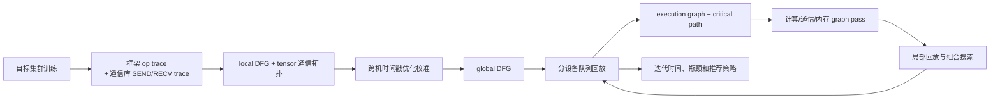

# dPRO：从单机 trace 回放走向分布式全局 DFG、诊断与组合优化

## 元信息与一手资料

- 论文：*dPRO: A Generic Performance Diagnosis and Optimization Toolkit for Expediting Distributed DNN Training*（PDF 页眉/早期版本也写作 *A Generic Profiling and Optimization System*）
- 作者：Hanpeng Hu、Chenyu Jiang、Yuchen Zhong、Yanghua Peng、Chuan Wu、Yibo Zhu、Haibin Lin、Chuanxiong Guo
- 会议：MLSys 2022
- 一手资料：[MLSys 论文页](https://proceedings.mlsys.org/paper_files/paper/2022/hash/b422680f3db0986ddd7f8f126baaf0fa-Abstract.html) · [正式 PDF](https://proceedings.mlsys.org/paper_files/paper/2022/file/b422680f3db0986ddd7f8f126baaf0fa-Paper.pdf) · [arXiv](https://arxiv.org/abs/2205.02473) · [官方代码](https://github.com/joapolarbear/dpro)

## 30 秒总结

dPRO 的核心不是“把所有任务当串行后求和”，而是把每个 worker/parameter server 的本地数据流图和每个 tensor 的细粒度 SEND/RECV 拓扑拼成一张**跨机器全局 DFG**。它解决跨机时钟偏移和 RECV 时间戳不准，再用分设备队列回放真实执行；在回放得到的关键路径上，联合搜索 operator fusion、tensor fusion/partition 和内存优化。

类比：Daydream 更像拿到一台机器的行车记录仪后推演改路；dPRO 则在整个物流园的卡车、仓库和道路上都装事件记录器，先校准不同摄像头的钟，再重建全园物流图，最后只优化真正卡住总交付时间的那条路线。

## 论文背景与解决的问题

分布式训练不随 GPU 数线性加速，原因可能来自计算、通信、内存或它们之间的相互作用。已有工具有三个缺口：

1. 框架 profiler 给出的通信事件太粗，常把通信库排队时间与真实传输混在一起；
2. 不同机器的时钟即使经 NTP 同步也会有亚毫秒/毫秒误差，足以破坏短通信事件的因果顺序；RECV profiler 常记录“何时挂起接收”而不是“数据真正到达”；
3. 单项优化并非越激进越好。operator fusion 减少 launch 与中间存储，却可能推迟梯度产生、破坏 computation–communication overlap；tensor fusion 降低小消息开销，也会让早完成的梯度等待；重计算省内存却增加计算并延后通信。

论文要回答两个问题：

- **诊断**：当前分布式训练的真实关键路径和瓶颈在哪里？
- **优化**：在计算、通信、内存多类 pass 相互作用时，怎样高效找到组合策略，而不是逐项试错？

## 必要的 AI Infra 背景

### AllReduce 与 Parameter Server

- **AllReduce**：每个 worker 都有梯度，通过 ring/tree 等 collective 得到全局聚合结果；没有中心参数服务器。
- **Parameter Server（PS）**：worker 把梯度 PUSH 到 PS，PS 聚合后再让 worker PULL 参数/结果。

框架层一次 `all_reduce(tensor)` 并不等于网络上的一个原子事件。Ring AllReduce 会把 tensor 切 chunk，在多个 step 中沿相邻 rank 做 SEND/RECV。若只给整次 collective 一个 `size / bandwidth` 时长，就看不到 chunk 排队、链路冲突和协议开销。

### Local DFG、global DFG 与 execution graph

- **Local DFG**：一个 worker 内 operator/tensor 的数据依赖。
- **Global DFG**：把多个 local DFG 经每个 tensor 的通信拓扑连起来；边是数据/因果依赖。
- **Execution graph**：回放时，资源队列还会决定同一设备上的实际先后顺序；dPRO 把这些顺序边补进 DFG 后，用其计算关键路径。

DFG 表示“哪些顺序合法”，execution graph 表示“这一次模拟具体选了哪个合法顺序”。

### 为什么跨机时间戳需要校准

假设 rank 0 的 SEND 显示 10.2 ms，rank 1 的 RECV end 显示 9.9 ms。不是数据穿越了时间，而是两个机器的钟有偏差。若直接拼 trace，就会出现接收早于发送、负通信时长或错误 overlap，且误差会沿迭代累积。

### Critical path

关键路径是从本步开始到结束的最长依赖链。优化非关键路径上的一个 2 ms op，端到端可能一毫秒都不省；缩短关键路径上的 2 ms 才可能直接减少 makespan。dPRO 因而每轮先回放、找新关键路径，再决定下一轮优化。

## 输入、输出与关键假设

### 输入

- 在**目标分布式集群和目标软件栈**上采集的多 rank trace；
- 框架本地图定义、operator 时间和依赖；
- Horovod/NCCL 或 BytePS/ps-lite 内的细粒度 SEND/RECV 事件、transaction/chunk/step ID；
- DNN 模型、GPU/链路拓扑、内存预算；
- 可选优化 pass registry，以及融合 op 的实测时长或外部 cost model。

### 输出

- 校准后的全局 timeline、global DFG 和关键路径；
- 单迭代时间与各阶段/通信瓶颈；
- 满足内存预算的 operator fusion、tensor fusion、tensor partition、recomputation/gradient accumulation 等组合策略。

### 关键假设

- 运行 trace 是目标配置行为的代表，operator 时长用约 10 个训练 iteration 平均；
- 框架执行引擎的资源队列可由 FIFO 近似；
- 可以进入通信库采到足够细的 SEND/RECV，并建立稳定 transaction ID；
- 搜索加速利用 DNN block 和同质数据并行 worker 的对称性；异构、动态路由或不同 rank 行为差异会削弱这一假设；
- 融合后的计算成本需要离线 profile 或额外 cost model，dPRO 本身不是跨硬件的 component predictor。

## 方法流水线



### 1. Profiler

框架 profiler 提供 operator 级本地图；通信库插桩把：

- PS 的 PUSH/PULL 拆成对应 worker/PS 两端的 SEND/RECV；
- Ring AllReduce 的 tensor partition 和每个 step 拆成 chunk 级 SEND/RECV。

每个本地 tensor 插入 `In/Out` 虚拟节点，再由 transaction ID 将生产者、通信 hop 和消费者连起来，构成 global DFG。

### 2. Trace time alignment

系统不假设 NTP 已足够准，而是把每个节点相对参考节点的时间偏移 `θ_i` 当优化变量；利用同类 RECV 时长应相近、同一物理机进程共享时钟、跨节点因果不能倒置三类约束求解。

### 3. Replayer

对每个 worker/PS 和每条通信 link 维护一个队列与 `device_time`。一个 op 的前驱全部完成后进入对应设备队列；每次选择 `device_time` 最小的设备，从其 FIFO 队首执行并推进时间。所有 op 完成后，最大设备时间即单迭代 makespan。

### 4. Optimizer

先处理 OOM，再迭代：回放 → 找关键路径 → 对计算段评估 op fusion，对通信段评估 tensor fusion/partition → 更新图 → 重新回放。Coarsened View、partial replay 和图对称性用于把搜索从十几/几十小时降到分钟级。

## 理论描述与公式

### 时间校准优化

记节点 `i` 上事件 `op` 的原始时间为 `\bar T^i_op`，校准后为：

```text
T^i_op = \bar T^i_op + θ_i
```

取节点 0 为参考，`θ_0=0`。论文构造两个目标：

- `O1`：让同一 RECV family（相同发送方、同 tensor/分片、跨 iteration）的有效传输时长方差尽量小；
- `O2 = Σ_{m∈M} Var_{i∈g_m}(θ_i)`：让同一物理机上的 worker/PS 偏移相近。

求解：

```text
min_{θ}  a1·O1 + a2·O2
s.t.     θ0 = 0
         adjusted_time(o2) >= adjusted_time(o1),  对所有跨节点依赖 (o1,o2)
```

这是一个约束优化问题，论文使用 CVXPY，称数秒内可解。

### 回放与关键路径目标

给定 global DFG `G` 和优化集合 `S`，目标是选择子集 `S'`：

```text
min_{S' ⊆ S} ITERATIONTIME(f(G,S'))
```

其中 `f` 是 graph pass 对图的变换。关键路径记作计算 op `p_n` 与对应通信 `q_n` 的序列。定义：

- `p_n^d`：计算 op duration，来自 profile；
- `p_n^e`：该 op 的结束时刻；
- `q_n^s`：tensor 大小；
- `q_n^d`：同步该 tensor 的时长，来自 partial replay；
- `q_n^e`：通信结束时刻；
- `k_n`：tensor 分片数；
- `T_n=max(p_n^e,q_n^e)`：走到第 `n` 组计算/通信都完成的时间。

### 三个定理直觉

论文定理不是在说“fusion 永远更好”，恰好相反：

1. **Operator fusion** 只有当计算节省大到足以抵消前一梯度通信被推迟、overlap 减少时才有利。
2. **Tensor fusion/partition** 只有当减少小消息开销的收益大于等待早到 tensor 与延后通信的损失时才有利；给定 tensor size `s`，先通过 `k*(s)=argmin_k t_sync(s,k)` 找最佳分片数。
3. 若一侧 fusion 已被证明有利，把对应计算和通信一起 fusion 可以避免破坏 overlap，并不差于只 fuse 一侧。

这些条件把盲目组合枚举变成关键路径上的规则化搜索。

## Worked example：为什么“把两个小梯度融合”可能更慢

设 backward 依次产生 `g1`、`g2`：

- `g1` 在 4 ms 时就绪，单独通信 3 ms，可在 4–7 ms 与后续计算重叠；
- `g2` 在 9 ms 时就绪，单独通信 3 ms，于 9–12 ms 完成；
- 两个小消息各有 1 ms 固定启动开销；融合后只需 4 ms 通信。

若融合，`g1` 必须等到 9 ms 和 `g2` 一起发，9–13 ms 完成。虽然总通信从 6 ms 降到 4 ms，但迭代结束从 12 ms 推迟到 13 ms，因为丢掉了 `g1` 的早期 overlap。

dPRO 不依据“通信总字节/总时长减少”直接接受 fusion，而是在 execution graph 上比较 `T_n`，并在每次图变换后重新找关键路径。这是它比单项启发式更重要的地方。

## 实验设置与原文结果

### 设置

- 生产集群最多 16 台服务器、128 张 Tesla V100 32GB；节点内 NVLink，节点间 100 Gbps Mellanox CX-5；默认 2 台/16 GPU；
- CUDA 10.2、cuDNN 7.6.5；
- 模型：ResNet-50、VGG-16、InceptionV3、BERT Base；默认每 GPU batch 32，大规模部分 batch 64；
- 框架/通信组合：TensorFlow、MXNet；Horovod AllReduce、BytePS Parameter Server；TCP 与 RDMA；
- 论文概览提到 profiler 设计支持 PyTorch，但主要实现/实验矩阵集中于 TensorFlow/MXNet 与上述通信栈。

### 原论文数字

- 回放精度：多数设置误差 `<5%`；最大规模实验中多数仍 `<5%`，最高 5.6%。
- 对比 Daydream：常规矩阵中 Daydream 最高误差 70.2%；128 GPU 扩展图中最高 73.8%。两者前向/反向计算估得接近，差距主要来自 dPRO 细通信建模，而非“Daydream 把所有任务串行”。
- profiler 额外开销：实验约 5.86%，接近框架自带 profiler。
- 单类通信优化：dPRO 的 tensor fusion/partition 相对默认 Horovod/BytePS 最高加速 19.1%。
- op + tensor 组合：相对 XLA 最高加速 62.95%，相对默认 Horovod/BytePS 最高 26.44%。
- 大规模综合策略：相对 XLA 默认最高 3.48×。
- 搜索加速：BERT Base strawman 超过 24 h；Coarsened View 后 22.01 h、加 partial replay 后 3.25 h、再加 symmetry 后 0.49 h。ResNet-50 从 14.60 h 降到 0.29 h。

### 数字归属纠错

`Daydream 大集群误差 73.8%` 是 **dPRO 2022 的后续对比实验**，不是 Daydream 2020 自己报告的结果。它说明 Daydream 的粗通信外推在这套 dPRO 测试环境中失效，但不能倒推 Daydream 原文所有配置都具有这一误差。

## 与相关工作的比较

| 方法 | 主要对象 | dPRO 的变化 |
| --- | --- | --- |
| NVProf/CUPTI | 单机低层 kernel/counter | dPRO 侧重框架 op + 通信库细 trace，并拼成跨设备因果图 |
| 框架 profiler | 本地 op 和粗 collective | dPRO 排除通信排队混淆，追踪 chunk/hop 级 SEND/RECV |
| Daydream | kernel 级依赖图、优化 what-if、单卡构造数据并行 | dPRO 从目标集群收全局 trace，校时钟、模拟通信协议/排队并自动联合搜索；因此更准但更不适合纯离线新硬件 |
| XLA/Horovod Autotune/BytePS 默认 | 各自优化一种局部策略 | dPRO 用统一 DFG 评价多 pass 的相互作用和共同关键路径 |
| Proteus | 从目标并行策略编译执行图 | dPRO 重建“已经实际运行”的全局 DFG；Proteus 更适合未运行 DP/TP/PP 策略的离线比较 |

## 优势

- 将本地 op 图与通信协议细节真正连接成 global DFG，适合因果诊断；
- 时间对齐不是简单依赖 NTP，而是利用事件 family、物理机与因果约束共同校准；
- replayer 对每个计算设备和通信 link 分队列，明确表达 overlap、排队和资源串行，不是总时长求和；
- 用关键路径和定理解释“为什么某 fusion 有益/有害”，并支持计算、通信、内存的组合；
- 局部回放、coarsening 与 block/worker symmetry 让大图搜索可用。

## 关键短板与不适用场景

- **必须先在目标集群采 trace**：它是诊断和 profile-guided 优化器，不是输入“新 GPU 型号 + 新模型”即可零样本外推的规划器。
- **通信栈侵入性强**：论文为 NCCL 增加约 318 LoC、为 ps-lite 增加约 400 LoC；现代 NCCL、UCC、HCCL、RoCE 拓扑或专有运行时需要重新适配。
- **实证范围集中**：验证主要是数据并行、PS/AllReduce、TensorFlow/MXNet、CNN/BERT Base；论文没有系统验证现代 TP/PP/EP、MoE all-to-all、长序列动态 shape。
- **不能称为“串行假设”**：它有全局 DFG、设备队列和细通信；真正边界是依赖已观测图、FIFO/平均 duration 近似，以及缺少复杂并行的现代实证。
- **优化搜索并非全局穷举最优证明**：围绕不断变化的关键路径进行规则化迭代，并利用 coarsening/symmetry；动态非对称 rank、straggler 和随机拥塞可能改变结果。
- **component 新成本仍需实测**：融合 op 的执行时间通过离线 profiling 或外部 cost model 获得，换 shape/硬件后仍要更新。

## 映射到“输入 → L1/L2/L3 → 输出”

| 层 | dPRO 在做什么 | 边界 |
| --- | --- | --- |
| 输入 | 目标集群多 rank 的框架/通信 trace、图定义、拓扑、内存预算和 pass registry | 没有目标运行就没有可靠 global DFG |
| L1 执行图 | local DFG + chunk/hop 通信拓扑 + 时间校准，形成 observed global DFG | 不是从任意新 TP/PP 策略静态编译图 |
| L2 算子成本 | 复用平均实测 op 时长；融合成本离线 profile；同步成本 partial replay | 不提供跨 GPU/shape 的通用成本外推 |
| L3 系统模拟 | 每 worker/PS/link 队列回放、补 execution order、计算关键路径 | FIFO、稳定时长、已观测通信行为是近似 |
| 输出 | 迭代时间、timeline、关键路径、瓶颈、组合优化策略与预计加速 | 不预测收敛质量、动态 serving SLA |

## 读完应记住的 5 点

1. dPRO 的技术中心是**细粒度通信的全局 DFG**，不是一般意义的时延回归器。
2. 它不依赖“所有任务串行”；相反，关键价值就是通过依赖和资源队列刻画计算–通信 overlap。
3. 时间校准很关键：亚毫秒事件中，普通 NTP 偏差和 RECV 语义会破坏因果。
4. Fusion 不是越多越好；减少局部开销可能延迟梯度、损失 overlap，必须放到关键路径上判断。
5. `<5%`、`3.48×` 建立在目标集群 trace 和论文的 DP/PS/AllReduce 范围内，不能无条件搬到无 trace 的新 GPU、TP/PP/MoE 环境。

## 术语表

| 术语 | 通俗解释 |
| --- | --- |
| rank/worker | 一个参与分布式训练的进程及其编号；通常每 GPU 一个进程 |
| Parameter Server | worker PUSH 梯度、从中心或分片 PS PULL 结果的架构 |
| AllReduce | 所有 rank 共同聚合数据，并让每个 rank 都得到结果的 collective |
| gTrace | dPRO 收集的全局计算和细通信时间戳数据 |
| global DFG | 覆盖所有 worker/PS 与 tensor 通信 hop 的全局数据流图 |
| transaction ID | 把发送端、接收端和同一 tensor/chunk/step 匹配起来的标识 |
| Kahn algorithm | 不断取出入度为零节点的经典拓扑排序算法 |
| critical path | 决定全局完成时间的最长依赖链 |
| tensor fusion | 把多个小 tensor 合成较大消息以减少固定通信开销 |
| tensor partition | 把大 tensor 切成 chunk，以便流水传输和更好 overlap |
| Coarsened View | 按理论安全规则把相邻 op/tensor 分组，缩小策略搜索图 |
| partial replay | 只模拟与一个候选 tensor 同步相关的通信子图，不重放全图 |

## 逐条证据索引

- 研究动机、贡献、框架/通信覆盖：论文 §1–3，[MLSys 正式 PDF](https://proceedings.mlsys.org/paper_files/paper/2022/file/b422680f3db0986ddd7f8f126baaf0fa-Paper.pdf)。
- global DFG、PS/AllReduce 的 SEND/RECV 拆解：§4.1，pp. 4–5，[arXiv PDF](https://arxiv.org/pdf/2205.02473)。
- 时间校准目标与因果约束：§4.2，p. 5，[正式论文](https://proceedings.mlsys.org/paper_files/paper/2022/hash/b422680f3db0986ddd7f8f126baaf0fa-Abstract.html)。
- 分设备队列回放和关键路径：§4.3–5.1，pp. 5–6，[arXiv](https://arxiv.org/abs/2205.02473)。
- Fusion/partition 三个定理及优化算法：§5.1–5.2，pp. 6–7；完整证明由论文附录引用，[官方代码仓库](https://github.com/joapolarbear/dpro)。
- Coarsened View、partial replay、symmetry：§5.3，pp. 7–8，[正式 PDF](https://proceedings.mlsys.org/paper_files/paper/2022/file/b422680f3db0986ddd7f8f126baaf0fa-Paper.pdf)。
- `<5%`、5.86%、组合优化与搜索时间：§7.1–7.4，pp. 8–10，[MLSys 论文页](https://proceedings.mlsys.org/paper_files/paper/2022/hash/b422680f3db0986ddd7f8f126baaf0fa-Abstract.html)。
- 128 GPU、5.6%、Daydream 73.8% 和 3.48×：§7.5，p. 11，[正式 PDF](https://proceedings.mlsys.org/paper_files/paper/2022/file/b422680f3db0986ddd7f8f126baaf0fa-Paper.pdf)。
