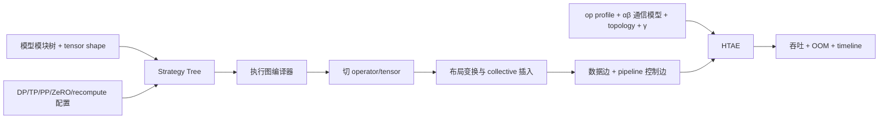

# Proteus：把 DP/TP/PP/ZeRO/重计算策略“编译”为可模拟的分布式执行图

## 元信息与一手资料

- 论文：*Proteus: Simulating the Performance of Distributed DNN Training*
- 作者：Jiangfei Duan、Xiuhong Li、Ping Xu、Xingcheng Zhang、Shengen Yan、Yun Liang、Dahua Lin
- 发表：IEEE Transactions on Parallel and Distributed Systems（TPDS），2024；预印本 2023
- 一手资料：[arXiv 摘要与版本](https://arxiv.org/abs/2306.02267) · [论文 PDF](https://arxiv.org/pdf/2306.02267) · [TPDS DOI](https://doi.org/10.1109/TPDS.2024.3443255) · [官方代码](https://github.com/JF-D/Proteus)
- Artifact 状态：作者公开了论文所述约 9K LoC Python 库、PyTorch 风格模型 API、集群配置和运行示例；仓库没有提供一键重跑全部论文表格的完整实验编排，因此“代码可用”与“全部表格可直接复现”仍需区分。

## 30 秒总结

Proteus 的突破点是：不再要求先实际跑出某个并行策略的完整 trace，而是用 **Strategy Tree** 表达 operator 级切分/放置、tensor 内存分片，以及 subgraph 级 pipeline、micro-batch 和 recomputation；然后把高层策略编译成每张 GPU 上的计算、通信和控制依赖图；最后用 **HTAE** 模拟计算–通信重叠、链路带宽共享和显存生命周期，输出吞吐与 OOM。

类比编译器：模型与并行策略像源代码，Strategy Tree 是中间表示，execution graph compiler 生成“每个 rank 真正要做什么”，HTAE 像一个不执行数值计算、只推进资源时间和内存状态的虚拟机。

## 论文背景与解决的问题

大模型训练往往组合多个层次的策略：

- operator 级：按 batch、hidden、output channel、reduction dimension 切分，也就是数据并行和各种 tensor/model parallel；
- memory 级：ZeRO、activation partition；
- subgraph 级：pipeline stage、micro-batch schedule、activation recomputation。

过去的解析模型常假设“一个 op 的时长只由输入/输出 shape 决定，模型总时间是 op cost 之和”。复杂并行下这个假设会失效：

1. 切分策略不一致时会自动引入 AllReduce/AllGather/SendRecv；
2. 多个通信 group 会争用同一 NIC、PCIe、NVLink；
3. 通信与计算重叠时，二者自身也可能变慢；
4. pipeline 的 bubble、micro-batch 排序、重计算和 tensor 释放共同决定吞吐和峰值显存。

论文的问题是：**只给模型、并行策略和集群配置，如何在不真实部署完整策略的情况下生成正确执行图，并预测吞吐/OOM？**

## 必要的 AI Infra 背景

### DP、TP/MP 与 PP 是不同维度的切分

对线性层：

```text
Y[b,s,o] = Σ_h X[b,s,h] · W[o,h]
```

- **DP** 切 `b`：每张卡处理不同样本，权重复制；backward 后通常 AllReduce 权重梯度。
- **TP/MP** 可切 `o` 或 `h`：权重分片。切 `h`（reduction dimension）后，每卡只得到部分和，必须跨卡归约；切 `o` 后输出通道天然分片，但下游若要求复制又需 AllGather。
- **PP** 切 layer/subgraph：不同 stage 放不同卡，micro-batch 像流水线上多个工件；stage 间 Send/Recv activation/gradient。

这三种并行可以相乘。例如 `DP=2, TP=4, PP=2` 需要 16 张卡；每个进程/rank 同时属于不同通信 group。

### Shard、Replicate 与 strategy transformation

同一个 tensor 在生产者和消费者处可能要求不同布局。生产者输出是 TP shard，消费者想要 replicate，运行时就必须插入集合通信把布局变换过去。Proteus 把这种“布局不一致 → 通信”作为编译规则，而不是要求用户手写每个 collective。

### Pipeline bubble 与 micro-batch

若两级 pipeline 只喂一个 batch，stage 2 等 stage 1 时会空闲，称 bubble。把 batch 切成多个 micro-batch 可以填满流水线，但会增加 activation 常驻和调度复杂度。`max_ongoing_micro_batch` 限制在对应 backward 前最多保留多少个 forward micro-batch，用于平衡并行度和显存。

### 通信拓扑不是只有“总带宽”

同样 8 张卡，NVLink 全连接、跨 PCIe switch、跨 CPU socket、跨 NIC 的有效带宽不同；两个 collective group 若同时穿过同一物理 link，需要共享带宽。忽略 group 到物理拓扑的映射，会在 DLRM、TP/PP 等通信密集策略上产生很大误差。

## 输入、输出与关键假设

### 输入

- 用 PyTorch 风格 API 描述的 DNN 模型/模块层次和 tensor shape；
- Strategy Tree：关键节点的 computation、memory、schedule config；
- 集群配置：GPU 类型/显存、每节点卡数、节点内链接、节点数、节点间带宽；
- 目标硬件上各 shape 的计算 op profile；
- 通信 `α–β` 参数、collective 修正系数、NCCL topology/channel 信息；
- 为计算–通信重叠实测的系数 `γ`。

### 输出

- 分布式 execution graph：每个设备/rank 的 tensor partition、计算 op、collective、SendRecv 及数据/控制边；
- 预测训练吞吐；
- 动态 tensor 生命周期和峰值显存，从而判断 OOM；
- 对给定候选并行策略的比较与解释。

### 关键假设

- 模型结构和各 tensor shape 是静态、可由 DSL/API 明确生成的；
- 计算 op 基础成本可提前在目标硬件 profile；
- 同一物理 link 上并发通信 group 近似公平分带宽；
- overlap 引起的 slowdown 可用对“机器类型 + DNN 模型”固定的 `γ` 近似；
- feature communication、gradient communication 和 computation 可分三个执行流；论文不模拟同 GPU 上一般的 compute–compute kernel overlap；
- pipeline 采用其实现支持的同步调度，通信 pattern 来自已支持集合，新增 collective 需扩展 pattern matcher。

## 方法流水线



### 1. Strategy Tree

- 叶节点对应 DNN layer，包含其 forward/backward operator 和 tensor；
- 非叶节点对应多层 subgraph，保留模型模块的嵌套结构；
- leaf 上配置 computation/memory，non-leaf 上配置 schedule；
- 用户只标关键节点，系统可沿树和数据依赖传播其余配置。

### 2. Execution Graph Compiler

编译器按设备组把模型切为 disjoint subgraph，再把每个 operator/tensor 切成驻留于单设备的 partition。若一个 tensor 的生产布局与消费布局不一致，执行 strategy transformation，模式匹配出 collective；若集合通信 pattern 不支持，则退回 point-to-point。重计算会生成两个 forward subgraph 和一个 backward subgraph；pipeline/memory 限制通过 control dependency 表达。

### 3. HTAE

Hierarchical Topo-Aware Executor 有两级：

- scheduler 在多个 forward/backward subgraph 间选择，权衡 micro-batch 并行和峰值显存；
- executor 为 computation、feature communication、gradient communication 分别维护队列，推进可执行 op、记录 tensor 引用计数和内存，并调用 runtime behavior detector 调整成本。

### 4. Op Estimator

基础计算成本在目标硬件 profile；通信用 `α–β` 模型和 NCCL topology channel 估计，并对不同 collective 加修正因子。Proteus 本身把重点放在系统行为，论文明确说单 op predictor 可以被其他模型替换。

## 理论/成本模型

### Strategy Tree 的配置语义

对 operator/tensor 的并行配置：

```text
Config = (Partition P, Map M)
```

`P=(p1,p2,...)` 指各可切维度的并行度，总 partition 数为 `|P|=Π_i p_i`；`M` 指每个 partition 是 shard 到一张设备，还是 replicate 到一个设备组。内存 config 单独描述 tensor 真正存放方式，因此能表达 ZeRO 一类“计算仍数据并行、状态却分片”的策略。

subgraph schedule config 包含：

```text
(n_micro_batch, max_ongoing_micro_batch, recomputation)
```

### 通信成本

基础上可理解为：

```text
T_comm ≈ α_collective + Bytes / β_effective
```

`α` 是启动/协议延迟，`β_effective` 来自实际通信 group 在 cluster topology 上可用的 channel 总带宽，并乘 collective 类型修正。若 `k` 个并发 group 经过同一 link，Proteus 近似让它们公平共享，该段 `β` 降为约 `β/k`；检测按 NIC → socket → PHB/PCIe → PIX → NVLink 的层次进行。

### 计算–通信重叠

运行时 detector 若发现 computation 与 gradient communication 同时执行，就按实测的重叠增幅 `γ` 放大被重叠 op 的成本。论文把 `γ` 定义为 increase ratio，官方代码也明确实现为：

```text
T_overlap_op = (1 + γ) · T_base_op
```

这里 `γ` 不是解析硬件常数，而是比较数据并行 backward 在有/无 overlap 时的速度得到的经验比例；论文称它对给定机器类型和 DNN 模型固定。这个设计简单有效，但也意味着换模型/硬件/运行时要重新 profile。

### 内存模型

每个 tensor 写出时计入对应 executor 的 memory，并维护 consumer 引用计数；每消费一次递减，归零后释放。模拟运行中的峰值若超过设备 memory 就报 OOM。它比只算“参数 + optimizer + activation 静态总和”更能反映 pipeline 与重计算的生命周期。

## Worked example：TP=2 + PP=2 如何自动长出通信

考虑两层 MLP 分到两个 pipeline stage，每层线性为 `X[B,S,H] @ W[O,H]`：

1. 在 stage 0 中按 `H` 做 TP=2。rank 0/1 各持一半 `H` 和权重，算出 `Y_partial`；因为 `H` 是 reduction dimension，两份 partial 必须 AllReduce 才得到完整 `Y`。
2. stage 1 若按 `O` 切分并要求输入 replicated，编译器发现 stage 0 输出布局与 stage 1 输入布局不一致，插入对应 collective/layout transformation。
3. PP=2 又要求 stage 0 与 stage 1 设备组间 Send/Recv activation；backward 反向发送 gradient。
4. 若 `n_micro_batch=4`，编译器复制/实例化四组 forward/backward subgraph，并加控制边表达 pipeline schedule。
5. HTAE 发现一个 TP collective 和 PP SendRecv 同时穿 NIC，降低二者有效带宽；若 gradient AllReduce 与 backward 重叠，再用 `γ` 调整。

这说明“P 的数量变化”不只是通信时间按比例缩放；它会改变每 rank shape、collective 类型/大小、group、pipeline bubble、内存生命周期和系统级竞争。

## 实验设置与原文结果

### 设置

- 软件：PyTorch 1.8、CUDA 10.1、cuDNN 7.6.5、NCCL 2.7.8；synthetic dataset，不计数据加载；
- 模型：ResNet-50、InceptionV3、VGG-19、GPT-2 117M、GPT-1.5B、DLRM 516M；
- 硬件：HC1 单节点 8×Titan Xp/PCIe；HC2 四节点、每节点 8×V100/NVLink、100 Gbps；HC3 两节点、每节点 8×A100/NVLink、200 Gbps；
- 每模型评测常用策略 S1 和 expert-designed S2，包含 DP、op shard、ZeRO、recomputation、pipeline 等；
- 计算 op 基础时长先在目标硬件 profile，模拟成本统计不含这部分 profiling。

### 原论文数字

- 180 个 simulation results 的训练吞吐平均预测误差 3.0%；最大误差 14.68%（正文概括 14.7%，来自 DLRM S1）；
- 180 个结果中有 2 个 OOM 判断错误；这与“全部 OOM 都预测正确”不同；
- 重实现的 FlexFlow-Sim 平均误差 12.4%、最大 137.9%，且 180 个 task 中约三分之一不支持/无法估计；
- runtime detector 消融：不建模 runtime behavior 平均误差 14.4%，完整 Proteus 为 2.4%；
- GPT-2 策略比较的平均误差 3.2%，在 HC1/HC2 表 V 所列 7/6 个候选上 truth rank 与 predicted rank 一致；
- 32 GPU 的模拟耗时：VGG-19 约 1.698 s，GPT-2 约 6.265 s（不含预先的 op profiling）。

### “保持策略排序”的正确口径

摘要说 preserves order，但正文系统性展示的是 **GPT-2、两种硬件配置、有限的一组 DP×MP×PP(micro-batch) 候选**。它是重要证据，却不是对所有模型、所有 MoE/动态 shape/任意策略空间的数学保证。更严谨的表述是：论文在表 V 的 GPT-2 策略组中完整保持排序。

## 与相关工作的比较

| 方法 | 主要做法 | Proteus 的差异 |
| --- | --- | --- |
| Paleo 等解析模型 | 单 op 解析成本，再加总 | Proteus 从高层策略生成 execution graph，并在运行模拟中处理 overlap/共享/显存 |
| FlexFlow | 搜索 SOAP（sample/operator/attribute/parameter）并带内部 simulator | Strategy Tree 表达更广的 operator+memory+subgraph 策略，通信用细 topology，HTAE 建模动态行为 |
| GSPMD/Alpa/DAPPLE/PipeDream | 自动并行框架/编译器，真正生成执行程序 | Proteus 的主要目标是评估一个指定策略，不负责完整发现或执行所有新策略 |
| Daydream/dPRO | 从已运行 trace 重建图并 replay | Proteus 不要求该目标策略先跑过；它从模型+策略编译图，但 L2 基础 op 和 `γ` 仍需目标 profiling |
| Vidur | LLM inference 请求/调度事件模拟 | Proteus 聚焦训练及 DP/MP/PP/重计算；Vidur 聚焦变长请求、KV cache 和 serving scheduler |

## 优势

- Strategy Tree 把 operator-level 和 subgraph-level 统一到一个可传播的层次 IR；
- shape/布局由目标策略显式推导，避免拿旧 rank 的 operator shape 直接缩放；
- 编译器能根据布局不一致自动插 collective，并加入 pipeline/recompute 控制依赖；
- HTAE 同时追踪拓扑、资源队列、overlap 和 tensor 生命周期，可预测吞吐与 OOM；
- 系统层接口与 component cost 解耦，理论上可以把 profiler 替换成 NeuSight/实测缓存等灰盒成本层。

## 关键短板与不适用场景

- **目标硬件 profiling 仍是前提**：每个目标 shape 的 computation op 成本由 profile 得到，不是新 shape/新 GPU 自动外推；`γ` 还绑定机器类型和 DNN 模型。
- **动态模型行为有限**：论文模型/shape 和策略树是静态的，未系统建模 MoE token routing、变长 sequence、条件分支、straggler 或在线 workload。
- **共享模型较简化**：并发 group 公平分带宽、统一 `γ` 是经验近似；真实 NCCL 协议、channel 调度、拥塞和计算/通信资源耦合可能非线性。
- **并发范围有限**：明确不模拟同 GPU 上一般的 compute–compute overlap；支持的 collective pattern 和 pipeline scheduler 有边界。
- **不包含数据管线**：实验使用 synthetic dataset，明确把真实数据加载视为正交问题；训练 I/O/CPU input bottleneck 需另层建模。
- **不是自动策略搜索器**：论文重点是准确评估指定策略；策略仍由用户/外部 search 产生。
- **效果不能无限外推**：3.0% 来自 6 个模型、3 套硬件、论文策略集合；2 个 OOM 误判和 DLRM 最大 14.7% 应同时保留。

## 映射到“输入 → L1/L2/L3 → 输出”

| 层 | Proteus 在做什么 | 边界 |
| --- | --- | --- |
| 输入 | 模型模块/shape、Strategy Tree、cluster topology、op profile、通信参数和 `γ` | 需要真实模型定义/规格，不可从模型名称凭空得到图 |
| L1 执行图 | 按目标 DP/TP/PP/ZeRO/recompute 编译每设备 partition、collective 和控制边 | 静态策略/shape 更可靠，动态路由需扩展 |
| L2 算子成本 | 目标机 compute profile + topology-aware `α–β` 通信模型 | 新 shape/新硬件仍需 microbenchmark；适合接入灰盒 component predictor |
| L3 系统模拟 | HTAE 调度 subgraph/op，建模 overlap、带宽共享、pipeline 与内存生命周期 | 公平共享、固定 `γ`、有限 stream/scheduler 是近似 |
| 输出 | training throughput、OOM、策略对比和 runtime 行为归因 | 不输出收敛质量、服务请求 SLA |

## 读完应记住的 5 点

1. Proteus 最关键的是从“observed trace replay”跨到“**目标策略 → 目标 execution graph 的编译**”。
2. Strategy Tree 不仅放 DP/TP，还把 tensor memory config、pipeline micro-batch 和 recomputation 放进统一 IR。
3. HTAE 不是简单加 op 时间；它在运行模拟中发现 overlap、链路共享和 tensor 释放。
4. L2 并未被解决掉：新 shape compute cost 和 overlap `γ` 仍要在目标机器 profile。
5. `3.0% / 14.7% / 2 个 OOM 错误`是完整精度口径；“排序保持”只在正文有限 GPT-2 候选组中充分展示。

## 术语表

| 术语 | 通俗解释 |
| --- | --- |
| Strategy Tree | 以模型模块层次为骨架、统一挂载 operator/memory/schedule 并行配置的 IR |
| DevGroup | 执行某 tree node/subgraph 的设备集合 |
| partition | 沿 tensor/operator 哪些维度切、各切几份 |
| map | 每个 partition 放在哪些设备、是 shard 还是 replicate |
| op shard | 可沿任意可并行维度切 operator 的一般化并行方式 |
| strategy transformation | 生产/消费布局不一致时插入通信完成布局变换 |
| feature communication | forward activation/特征相关通信，常阻塞计算 |
| gradient communication | backward 梯度同步，通常可异步与计算重叠 |
| HTAE | Hierarchical Topo-Aware Executor，层次化拓扑感知模拟器 |
| α–β model | 通信时间约等于固定启动延迟 `α` 加数据量除以带宽 `β` |
| overlap factor `γ` | 用实测概括计算–通信同时运行时 slowdown 的系数 |
| OOM | Out Of Memory，峰值显存超过设备容量 |

## 逐条证据索引

- 研究问题、贡献、Strategy Tree/HTAE 概览：论文 §1、§3，[arXiv PDF](https://arxiv.org/pdf/2306.02267)。
- DP/MP/op shard、ZeRO 与 pipeline 背景：§2，[arXiv 摘要页](https://arxiv.org/abs/2306.02267)。
- Strategy Tree 的 leaf/non-leaf 与三类 config：§4，pp. 3–4，[论文 PDF](https://arxiv.org/pdf/2306.02267)。
- Execution Graph Compiler、layout transformation、通信 pattern 与控制边：§5，pp. 4–5，[TPDS DOI](https://doi.org/10.1109/TPDS.2024.3443255)。
- HTAE、带宽公平共享、`γ`、显存生命周期：§6，pp. 5–7，[arXiv PDF](https://arxiv.org/pdf/2306.02267)；`cost × (1+γ)` 另由[官方实现](https://github.com/JF-D/Proteus/blob/main/proteus/simulator/simulator.py)交叉核对。
- 目标硬件 op profiling 与 `α–β` 通信估计：§7，p. 7，[论文](https://arxiv.org/abs/2306.02267)。
- 6 模型、3 硬件、180 点、3.0%、14.7%、2 个 OOM：§8.1–8.2，表 II–IV，[论文 PDF](https://arxiv.org/pdf/2306.02267)。
- GPT-2 有限策略排序、runtime 消融和 simulation cost：§8.3–8.5，表 V–VI、图 9，[TPDS DOI](https://doi.org/10.1109/TPDS.2024.3443255)。
