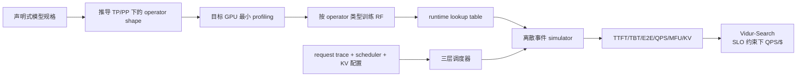

# Vidur：把 LLM 推理的变长请求、KV Cache、batching 与调度搬进离散事件模拟器

## 元信息与一手资料

- 论文：*Vidur: A Large-Scale Simulation Framework for LLM Inference*
- 作者：Amey Agrawal、Nitin Kedia、Jayashree Mohan、Ashish Panwar、Nipun Kwatra、Bhargav S. Gulavani、Ramachandran Ramjee、Alexey Tumanov
- 会议：MLSys 2024
- 一手资料：[MLSys 论文页](https://proceedings.mlsys.org/paper_files/paper/2024/hash/b74a8de47d2b3c928360e0a011f48351-Abstract-Conference.html) · [作者/微软 PDF](https://www.microsoft.com/en-us/research/wp-content/uploads/2024/05/vidur_mlsys24.pdf) · [arXiv](https://arxiv.org/abs/2405.05465) · [官方代码](https://github.com/microsoft/vidur)
- 本项目固定过的代码版本：`microsoft/vidur@8383d2935bc62723a212090baa9f98ada206fc14`；代码后续功能可能已变化，本文先解释 MLSys 论文方法。

## 30 秒总结

Vidur 解决的是 LLM **在线推理部署**，不是训练。它从声明式模型规格推导不同 TP/PP 下每卡 operator shape；只在目标 GPU 上 profile 一小批 token-level、attention 和通信点，用随机森林插值出大范围 runtime lookup；再在 CPU 上按请求到达、prefill/decode、动态 batch、KV Cache、抢占、TP/PP 和 serving scheduler 推进离散事件，预测 TTFT、TBT、端到端时延、吞吐、显存与成本。

类比：component cost model 告诉你“这一批 token 在 GPU 上要占用电梯几毫秒”；事件模拟器则决定成百上千位乘客何时到达、如何拼车、谁先上、谁因空间不够被请下去、几部电梯怎样分流。只知道单次电梯运行时间，无法得到排队尾延迟；只写排队规则，没有真实运行时间也无法做容量规划。

## 论文背景与解决的问题

LLM serving 的最优配置同时依赖：

- 模型：层数、hidden size、MHA/GQA、KV head 数等；
- 工作负载：prompt/output 长度分布、到达率、突发性；
- 并行：TP、PP、replica 数；
- scheduler：vLLM、Orca、Sarathi-Serve 等；
- batch/token cap、chunk size、KV Cache 策略、GPU SKU；
- TTFT/TBT 等 SLO 与 GPU 租用成本。

论文观察到：同一模型在一条 trace 上找到的最优配置，迁移到另一 trace 后成本可差到 2×。穷举几百/上千部署配置需要巨量 GPU 小时。因此目标是：**用少量 onboarding profile 加 CPU 模拟，回答某模型–workload 对在不同 TP/PP、batch、scheduler 和 GPU 上的 latency/throughput/cost what-if。**

## 必要的 AI Infra 背景

### Prefill 与 decode

用户输入 prompt 后：

- **Prefill** 一次处理整段 prompt，计算量大、矩阵乘法更容易吃满 GPU，并产生第一个 token；
- **Decode** 每轮只产生一个新 token，但每轮 attention 都要读取此前 token 的 key/value；单轮通常更 memory-bound，重复很多次。

因此 request 的输入长、输出短和输入短、输出长，会给系统完全不同的算力、内存与调度压力。

### KV Cache

为了不在每个 decode step 重新计算所有历史 token，serving runtime 保存各层的 key/value activation。KV Cache 随“并发序列数 × 上下文长度 × 层数 × KV heads × head dimension × dtype bytes”增长。它会直接限制 batch size；不足时可能拒绝、抢占或重启 request。

### Continuous batching

在线服务不会等待一批 request 全部结束再换下一批，而是在每个 iteration 把新 prefill、旧 decode 动态拼成 batch。一个请求结束后，下一请求立刻补位。于是 batch size、总 token 数和上下文总量每轮都变；同一模型的 iteration latency 不再像训练那样稳定。

### TTFT、TBT/TPOT 与容量拐点

- **TTFT**：请求到达至第一个 token 的时间，含排队和 prefill；
- **TBT/TPOT**：连续输出 token 的间隔；
- **capacity**：系统能稳定处理的最大 QPS。接近容量时，只增加一点 service time 或 arrival rate，队列就会急剧增长。

这也是为什么 component 误差 3% 并不保证 P99 SLA 只误 3%：在容量拐点附近，小误差会被排队非线性放大。

### TP 与 PP 在推理中的不同代价

- TP 把一层矩阵分到多卡，降低单卡计算/内存，但几乎每层都要 AllReduce/AllGather；
- PP 把层分到多个 stage，stage 间 SendRecv，可能产生 pipeline bubble；batch 又要切 micro-batch；
- replica 增加独立服务副本，提升并发，但每个副本要放一份模型，并需要全局路由。

## 输入、输出与关键假设

### 输入

- 声明式模型规格：层数、hidden/intermediate size、attention/KV head、dtype 等；
- GPU SKU 与 TP/PP topology；
- 目标 GPU 上少量 computation/attention/communication profile；
- workload trace：每个 request 的 prompt/output 长度与到达过程；
- global routing、replica batching/KV memory、pipeline stage schedule；
- batch cap、chunk size、token cap、SLO、GPU 价格等搜索参数。

### 输出

- request 级：scheduling delay、prefill completion、TTFT、TBT、normalized E2E latency、preemption/restart；
- replica/cluster 级：batch/token 数、busy/idle、MFU、memory/KV utilization；
- throughput/capacity、QPS per dollar、SLO 可行配置和 Pareto frontier；
- Chrome trace 等可视化 timeline。

### 关键假设

- 主流 decoder-only LLM 可由少数共享 operator 类覆盖；
- token-level op 主要由本轮总 token 数决定，prefill attention 可按平方和等效，decode attention 主要由总 KV 读取量决定；
- RF 在已 profile 区域内能插值 tile/wave 引起的阶跃；远离样本范围不是可靠外推；
- 目标 runtime 的 kernel、CUDA graph、scheduler 和 memory 行为与模拟器实现一致；
- 论文的 pipeline stage scheduler 只支持同步 PP，异步通信、sequence parallel、speculative pipelined decode 被列为未来扩展；
- 没有把小模型的所有 CPU/runtime overhead 都完整纳入，因此 7B 误差较大。

## 方法流水线



### 两阶段工作流

1. **Model onboarding**：根据模型规格枚举需要 profile 的 operator/shape，采最小数据，训练小型 runtime estimator，并预生成查询表。
2. **Simulation/search**：给定 workload、并行和 scheduler，用 lookup 为每次动态 batch 提供服务时间，推进请求生命周期；配置搜索对每个候选通过二分 QPS 找 capacity。

## 理论描述与成本分解

### Operator triaging

Vidur 不用一个大网络拟合所有 kernel，而是按输入依赖分三类：

1. **Token-level op**：Linear、activation、normalization 等，运行时间主要是本 iteration 总处理 token 数 `N_token` 与模型/TP shape 的函数；
2. **Sequence-level op**：attention，除本轮 query token 外还依赖各 request context；
3. **Communication op**：AllReduce、AllGather、SendRecv，主要依赖消息字节数和 topology，与具体模型族相对解耦。

这是一种“先按机制选特征，再做局部拟合”的灰盒思想。

### Prefill attention 的等效长度

若一个 batch 有 `P` 个 prefill，长度为 `p_i`，attention FLOPs 对每条序列近似与 `p_i²` 成正比，总成本代理为：

```text
C_prefill ∝ Σ_{i=1..P} p_i²
```

因此把它映射成单条等效长度：

```text
p_equiv = sqrt(Σ_i p_i²)
```

再查询/预测对应 runtime。这样比只用 `Σp_i` 更能表达 `[1024]` 与 `[512,512]` 的 attention 计算差异。

### Decode attention 的总 KV 读取代理

decode 近似 memory-bound，Vidur 用该 batch 的总 context/KV bytes 作为主要输入，而不保留每条序列的精确分配。PagedAttention v2、FlashDecoding 等能较好并行不均衡 context，是这一简化成立的经验前提。

### RF 插值

样本来自目标硬件的少量 shape 点。多层感知机需要较多数据，低阶 polynomial 又捕捉不了 tile/wave quantization 的台阶；论文选择 Random Forest，在数据量与非线性拟合间折中。重要的是它做的是**采样域内插值**，不是物理约束下的新 GPU 零样本外推。

### 三层 scheduler

- **Global scheduler**：把 request 路由到 replica，支持 round-robin、least outstanding request，以及延迟绑定的 stateful routing；
- **Replica scheduler**：负责 batching 和 KV memory；论文实现 FasterTransformer、Orca、Sarathi-Serve、vLLM、LightLLM 等策略；
- **Replica-stage scheduler**：在 PP stage 中排 micro-batch；论文版本为同步 PP。

### Capacity 二分搜索

对一个固定配置 `c`，系统存在最大稳定到达率 `λ*`。Vidur-Search 通过二分 `λ` 反复模拟，以 P99 scheduling delay 不超过 5 s 为容量判据：

```text
λ*(c) = max λ  s.t. P99(queue_delay(c,λ)) < 5s
score(c) = λ*(c) / GPU_cost(c)
```

再筛满足 TTFT/TBT SLO 的配置，选最大 QPS/$。

## Worked example：两个请求为什么不能只看 batch size=2

请求 A 在本轮 prefill 512 token，请求 B prefill 128 token：

```text
p_equiv = sqrt(512² + 128²) ≈ 527.8
```

attention 成本更接近单条 528 token，而不是单条 640 token；因为不同序列之间不互相 attention。与此同时，Linear/MLP 等 token-level op 仍主要看总 token `512+128=640`。

下一轮两条都进入 decode，假设 context 分别为 513 和 129。此时每条只产生一个 query token，但 attention 要读取约 `513+129=642` token 对应的 KV；runtime 主要由总 KV bytes 决定。若再加入一个 context 4000 的请求，batch size 仅从 2 变 3，KV 读取却暴涨，TBT 和显存压力都会大变。

因此 Vidur 在 L1 明确计算每轮 request 状态，在 L2 为不同 operator 使用不同充分统计量，在 L3 让 scheduler 和 KV memory 决定下一轮 batch；只把 `batch_size` 喂给一个总时延回归器是不够的。

## 实验设置与原文结果

### 设置

- 真实 baseline：优化过的 vLLM fork，加入多 scheduler、chunked prefill、telemetry 和 CUDA graphs；
- 模型：LLaMA2-7B/70B、InternLM-20B、Qwen-72B；
- 硬件：Azure A100 VM（每机 4×A100 80GB、pairwise NVLink）和 H100 VM（4×H100 80GB）；
- trace：LMSys-Chat-1M、Arxiv-Summarization、Bilingual-Web-Book，正文 fidelity 截断到总长 4096；
- 并行：20B TP2，70B/72B TP4，7B TP1；fidelity 使用默认 vLLM scheduler；
- 静态 workload 为所有请求预先到达；动态 workload 为 Poisson 到达，并在接近 capacity 的 load 上比较。

### 原论文数字

- 作者/微软 PDF 摘要口径：request-level inference latency 在所测范围误差 `<9%`；
- 静态 workload：四模型、三 trace 的 P95 normalized execution latency 最大误差约 3.33%；
- 动态 workload：在 85% capacity 时几乎所有场景误差 `<5%`；图中 7B Arxiv/BWB 的 median normalized E2E 误差约 -8.50%/-6.99%，这也解释 PDF 采用更保守 `<9%`；
- 附录显示 95% capacity 时，LLaMA2-7B 个别 normalized latency 误差可到约 -12.65%，并明确说明靠近容量拐点误差会被队列放大；
- 配置迁移：同一 LLaMA2-70B 将一条 trace 的最优配置用于另一 trace，成本最高可差 2×；
- LLaMA2-70B 的特定 search 案例：约 1 小时、96-core CPU（Azure 价约 $9.93/h），对比真实穷举约 42K GPU hours、约 $218K。

### `<9%` 与 `<5%` 的版本口径

[作者/微软 PDF](https://www.microsoft.com/en-us/research/wp-content/uploads/2024/05/vidur_mlsys24.pdf) 摘要写的是 inference latency `<9%`；[MLSys proceedings 页面](https://proceedings.mlsys.org/paper_files/paper/2024/hash/b74a8de47d2b3c928360e0a011f48351-Abstract-Conference.html) 摘要写 latency and throughput `<5%`。正文分场景结果支持“多数动态场景 `<5%`、更广 request latency 口径保守 `<9%`”。做总表时应同时指出版本差异，不宜无说明只选更漂亮的 `<5%`。

### `42K GPU h → 1 CPU h` 的正确口径

这是 **LLaMA2-70B、论文定义的搜索空间和三条 benchmark trace** 下的合计，不是任意一次搜索都固定节省 42K GPU h。附录表 2 将 70B 的 Chat-1M、Arxiv-4K、BWB-4K 分别估为 `12K + 15K + 15K = 42K GPU h`，对应模拟时间分别约 21、16、27 分钟；摘要将这轮 LLaMA2-70B 搜索概括为约 1 CPU 小时。该表全部 7B/20B/70B/72B × 三条 trace 的单项真实成本约 4K–18K GPU h、模拟约 16–136 分钟，因此不能把 42K 当成通用常数。

## 与相关工作的比较

| 方法 | 主要对象 | Vidur 的差异 |
| --- | --- | --- |
| Daydream | 训练 trace 依赖图与优化 what-if | Vidur 面对每轮不同的 inference batch，请求生命周期和 KV/scheduler 是一等状态 |
| Habitat | 训练 operator 跨 GPU 估计 | Vidur 用目标 GPU 少量 profile + RF 插值，不主张新 GPU 零样本；再接事件模拟 |
| dPRO | 目标集群分布式训练 global DFG | Vidur 不从多 rank 实测 trace 重建，而从 model/workload/scheduler 规格生成 inference 事件 |
| Proteus | DP/TP/PP 训练策略编译与 HTAE | Vidur 也推导 TP/PP shape，但重点是变长 request、continuous batching、KV Cache 和 TTFT/TBT |
| vLLM/Sarathi/Orca | 真正执行请求的 serving runtime/scheduler | Vidur 是其行为模型；实现语义漂移后 simulator 也必须同步更新 |

## 优势

- 把 LLM inference 独有的 prefill/decode、变长输入、KV Cache、动态 batch 和排队纳入一个完整状态机；
- 声明式规格自动推导 TP/PP 下的局部 shape，避免为每个并行配置部署完整模型再 profile；
- operator triaging 先用机制选特征，再用小模型插值，符合灰盒思路；
- scheduler 分层、策略可插拔，能比较 routing、batching、memory 与 PP schedule；
- 同时输出 request SLA 与 cluster utilization，并能在 SLO 下做 cost/capacity search；
- 一次 target onboarding profile 可支持大量 CPU-only what-if。

## 关键短板与不适用场景

- **必须有目标 GPU profile**：新 SKU/new kernel 不能凭规格零样本产生可信时长；发布 profile 可让本地 CPU 跑通，但不等于在本机验证论文精度。
- **插值边界**：RF 能拟合采样范围内台阶，但不会遵守 roofline 上下界；远离 batch/token/context 采样区，预测不可解释且可能不保守。
- **runtime/scheduler 版本绑定**：vLLM、PagedAttention、CUDA graph、preemption、chunked prefill 的实现变化会改变 L1/L3 语义，旧 simulator 需要重新对齐。
- **只覆盖推理**：没有 backward、optimizer、gradient collective、activation checkpointing，不能直接用于训练或 RL learner 性能。
- **并行/优化覆盖有限**：论文版仅同步 PP；异步 PP、sequence parallel、speculative pipeline、PD disaggregation、prefix cache、MoE routing 等需要新组件和验证。
- **CPU 与容量敏感性**：小模型 CPU overhead 未充分建模；接近 saturation 时微小 component 偏差会通过排队放大成明显 P95/P99 错误。
- **请求统计简化**：decode 用总 KV 读取量近似，依赖 attention kernel 能处理 context skew；若 kernel 对长尾序列分布敏感，充分统计量会失效。

## 映射到“输入 → L1/L2/L3 → 输出”

| 层 | Vidur 在做什么 | 边界 |
| --- | --- | --- |
| 输入 | 模型规格、GPU/topology、workload trace、scheduler、TP/PP/replica、SLO/价格 | 没有模型规格或 profile，不能“不做任何假设”得出明确绝对值 |
| L1 执行图/状态 | 推导分片 shape；把 request 分为 prefill/decode；生成每轮 batch、KV 和 TP/PP 操作 | 不是完整编译任意 vLLM/SGLang 代码，需手工保持语义一致 |
| L2 算子成本 | 目标机少量 profile；token/sequence/comm 分类；RF 插值成 lookup | 没有物理约束，远 OOD 或新 GPU 需 microbenchmark/新模型 |
| L3 系统事件模拟 | global routing、replica batching/KV、stage schedule、排队与请求生命周期 | scheduler/运行时漂移和容量非线性是主要风险 |
| 输出 | TTFT、TBT、E2E、throughput、capacity、MFU/MBU/KV、QPS/$ 与 Pareto | 不是模型质量、训练收敛或任意未支持优化的保证 |

## 与本项目本地实验的关系

本项目在无 NVIDIA GPU 的本地环境中，使用作者发布的 A100 profiles 运行过 Vidur 的 CPU-only 事件模拟。它验证的是：**发布 profile → RF runtime predictor → TP 图/调度 → request event → metrics/Chrome trace** 的软件链路可运行。由于没有 A100 ground truth，这不是论文 `<9%` 的复现；绝对时延仍来自作者数据而不是本机 CPU 测量。

## 读完应记住的 5 点

1. Vidur 的核心不是一个 RF，而是“模型/shape 推导 + component lookup + request/KV/scheduler 离散事件”的分层系统。
2. LLM 推理每轮 shape 都会变：prefill/decode 组成、总 token、context 和 KV bytes 都受真实请求与 scheduler 决定。
3. 不同 operator 需要不同充分统计量：token-level 看本轮 token，prefill attention 看平方和，decode attention看总 KV 读取。
4. `<9%` 是作者 PDF 的保守总体口径，proceedings `<5%` 与正文多数场景一致；42K→1 CPU h 是特定 search 案例。
5. 没有目标 profile 时可以跑模拟链路，但不能产生经验证的目标绝对值；生产灰盒方案要加入物理界、OOD 拒绝、按需 benchmark 和线上校准。

## 术语表

| 术语 | 通俗解释 |
| --- | --- |
| prefill | 一次处理完整 prompt 并生成首 token 的阶段 |
| decode | 每轮生成一个后续 token、反复读取历史 KV 的阶段 |
| KV Cache | 保存历史 token 各层 key/value activation，避免重复计算 |
| continuous batching | 每轮动态把不同请求的 prefill/decode 拼 batch，完成即补位 |
| TTFT | Time To First Token，请求到达至首 token 的时间 |
| TBT/TPOT | 相邻输出 token 的间隔/每输出 token 时间 |
| normalized E2E latency | 请求端到端时间除以输出 token 数，用于跨长度比较 |
| MFU | Model FLOPs Utilization，实际模型 FLOPs 相对硬件峰值的利用率 |
| MBU | Model Bandwidth Utilization，模型数据移动相对峰值带宽的利用率 |
| QPS | 每秒完成的 query/request 数 |
| chunked prefill | 把长 prompt 切成多轮较小 chunk，以便和 decode 混 batch |
| PagedAttention | 以分页方式管理非连续 KV Cache，降低内存碎片 |
| capacity point | 队列不发散时系统能承受的最大到达率附近 |
| discrete-event simulation | 不做真实张量运算，只按事件发生时刻推进虚拟时间和状态 |

## 逐条证据索引

- 研究动机、模型–trace 配置依赖、`<9%` 与 42K GPU h 案例：论文摘要与 §1，[作者 PDF](https://www.microsoft.com/en-us/research/wp-content/uploads/2024/05/vidur_mlsys24.pdf)。
- Prefill/decode、KV Cache、TP/PP 与 scheduler 背景：§2，pp. 2–3，[arXiv PDF](https://arxiv.org/pdf/2405.05465)。
- inference 模拟难点、变长 iteration 和 cascading error：§3，p. 3，[arXiv](https://arxiv.org/abs/2405.05465)。
- 声明式规格、operator triaging、单 GPU 自动 sharding profile：§4.1–4.3，pp. 4–5，[作者 PDF](https://www.microsoft.com/en-us/research/wp-content/uploads/2024/05/vidur_mlsys24.pdf)。
- prefill 平方和、decode KV 代理、通信 profile、RF：§4.3–4.4，p. 5，[论文 PDF](https://arxiv.org/pdf/2405.05465)。
- 三层 scheduler 与论文版同步 PP 边界：§4.5，pp. 5–6，[官方代码](https://github.com/microsoft/vidur)。
- Vidur-Search 容量二分、QPS/$：§6，pp. 6–7，[MLSys 论文页](https://proceedings.mlsys.org/paper_files/paper/2024/hash/b74a8de47d2b3c928360e0a011f48351-Abstract-Conference.html)。
- 四模型/三 workload、静态与 85% capacity 动态 fidelity：§7.1–7.2，pp. 7–9，[作者 PDF](https://www.microsoft.com/en-us/research/wp-content/uploads/2024/05/vidur_mlsys24.pdf)。
- 配置搜索、SLO 与成本案例：§7.3、附录表 2，pp. 9–10、14–15，[arXiv PDF](https://arxiv.org/pdf/2405.05465)。
- `<5%` proceedings 摘要版本：[MLSys 2024 页面](https://proceedings.mlsys.org/paper_files/paper/2024/hash/b74a8de47d2b3c928360e0a011f48351-Abstract-Conference.html)；与 PDF `<9%` 应并列说明。
