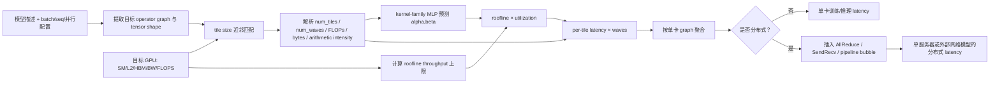

# NeuSight：把 kernel 拆成 tile/wave，让 ML 只学习 roofline 下的利用率

> 论文：*Forecasting GPU Performance for Deep Learning Training and Inference*，ASPLOS 2025  
> 作者：Seonho Lee、Amar Phanishayee、Divya Mahajan  
> 技术路线：tile/wave 解析分解 + roofline 物理上界 + 分 kernel MLP 学 utilization 曲线  
> 一手资料：[ASPLOS 版本 PDF（arXiv v3）](https://arxiv.org/pdf/2407.13853) · [DOI](https://doi.org/10.1145/3669940.3707265) · [官方代码与论文数据](https://github.com/scai-tech/NeuSight)

## 30 秒总结

NeuSight 要解决比 Habitat 更难的外推：**目标模型没见过、目标 GPU 也没参与训练，仍预测训练/推理时间。**

它的核心判断是：直接让 MLP 学 `(巨大 GEMM shape, GPU 规格)→latency`，在新 shape/新 GPU 上很容易胡乱外推。GPU 执行其实有更稳定的骨架：库把输出切成 tile，tile 分发给 SM，分多轮 wave 执行；吞吐又不可能超过计算峰值或内存带宽的 roofline。

因此 NeuSight 解析计算 tile 数和 wave 数，用 roofline 给吞吐设上限，MLP 不直接预测时间，而只预测利用率曲线的两个系数 $\alpha,\beta$。最后：

$$
\text{latency}=
\text{waves}\times
\frac{\text{FLOPs per tile}}
{\text{roofline throughput}\times\text{predicted utilization}}
$$

论文报告单设备端到端平均误差：inference 9.7%、training 7.3%；OOD GPU 平均 8.1%。著名的“121.4%→2.3%”只是 **GPT-3 + H100 同时未见**的一个 headline 案例，不是所有任务平均。它也不是纯解析器：tile size 仍来自 profiler/kernel 名和训练数据库的近邻匹配；分布式网络模型较粗，1–3840 节点结果只做了模拟、没有实机验证。

一句类比：传统 MLP 直接猜“整仓货物多久搬完”；NeuSight 先算每箱多大、总共多少箱、多少搬运工、需要几轮，再让 ML 只猜每个搬运工实际能发挥理论上限的几成。

## 先记住这 5 点

1. NeuSight 的灰盒边界是：**tile/wave/roofline 用机制，ML 只学 utilization**。
2. shape 的影响被显式拆为 tile 数、wave 台阶、FLOPs、内存量和算术强度，不再只作为一个原始向量交给 MLP。
3. “预测未见 GPU”仍需要公开硬件规格、旧 GPU 训练数据、可推断的 tile/tactic；不是对未知架构零信息预测。
4. 论文总体是 inference 9.7%、training 7.3%、OOD GPU 8.1%；121.4/30.8→2.3 仅是 GPT-3/H100 joint-OOD 个例。
5. 它是很强的 L2 方案，但 L1 图生成和 L3 分布式/服务模拟仍是简化版，必须与 Proteus/Vidur/dPRO 一类系统层方法组合。

## 1. 背景：为什么更大的神经网络也救不了直接 latency 回归

Habitat 对 BMM、Linear 等 kernel-varying operation 用 MLP 直接输出 latency。NeuSight 复现后观察到：即便把 MLP 加深，或换 Transformer predictor，在训练范围内误差能下降，shape 超出训练范围后仍有 70% 以上误差。

原因不是网络容量不够，而是目标函数混合了多种机制：

- GPU 有多少 SM；
- library 选了什么 tile/tactic；
- shape 会产生多少完整与尾部 tile；
- 总 tile 数跨过几个 wave 台阶；
- 算子是 compute-bound 还是 memory-bound；
- wave 是否足够多，能否用其他 warp 隐藏访存/依赖 stall；
- L2/HBM 容量是否让 library 换实现。

一个端到端 latency 数把这些变量全揉在一起。MLP 在训练区域能插值，却很难学会“任何 GPU 上都不允许超过峰值 FLOPS/带宽”这种外推规律。

NeuSight 的设计哲学可以用一句话概括：**不要让模型重新发现物理定律；把定律写进函数形式，只让模型学定律没有解释掉的利用率。**

## 2. 必要的 AI Infra 背景

### 2.1 GPU 的 SM、tile 和 wave

以 GEMM $C=A\times B$ 为例，输出 $C$ 可能是一个很大的 $M\times N$ 矩阵。cuBLAS/CUTLASS 不会让一个线程顺序算完，而是把 $C$ 切成许多 $t_M\times t_N$ tile。每个 thread block/CTA 负责一个或一组 tile，并在一个 SM 上执行。

- **tile**：输出矩阵的一小块工作集，例如 128×128；
- **SM**：可以并行执行 tile 的 GPU 计算簇；
- **wave**：所有 SM 一轮共同执行的一批 tile。

如果有 1,024 个 tile、120 个 SM，至少需要 $\lceil1024/120\rceil=9$ 个 wave。若 shape 稍增导致 1,081 个 tile，仍是 10 wave；时间会在 wave 边界呈台阶，而非严格随 FLOPs 平滑线性增加。

### 2.2 延迟隐藏为什么依赖 wave/并行线程

一个 warp 遇到 HBM 访问或数据依赖会 stall。GPU 的办法不是让这个 warp 更快，而是切换去执行另一个 ready warp。tile/wave 越多，通常可调度的独立线程越多，越能隐藏 stall，实际吞吐越接近 roofline 上限。

论文在 H100 上展示一个矩阵乘，batch 从 32 到 512 时峰值 FLOPS 利用率约从 53.2% 上升到 86.0%，说明“理论上限”与“实际使用比例”必须分开。

### 2.3 Roofline 是上限，不是实际速度

对 kernel $k$：

$$
K=\frac{FLOPs_k}{Mem_k}
$$

其中 $K$ 是算术强度。GPU 峰值计算吞吐为 $FLOPs_p$，峰值显存带宽为 $MemBW_p$，则：

$$
RooflineBW=\min(K\cdot MemBW_p,FLOPs_p)
$$

名字叫 `BW`，但量纲是 FLOP/s，实质是该 kernel 的理论最大计算吞吐。roofline 告诉我们不能比什么更快，却没告诉我们能达到 30%、70% 还是 90%。NeuSight 让 ML 学这部分 utilization。

### 2.4 library tactic、tile size 与算法路径

tile 并非只由 GEMM shape 解析决定。cuDNN、cuBLAS、CUTLASS、PyTorch 版本、dtype、layout 和 GPU 架构会共同选择实现。NeuSight 训练时用 PyTorch Profiler 获取 kernel 名和 thread block 数：

- matrix multiplication 从 kernel 名附带元数据推 tile size；
- 其他 kernel 用 block 数反推；
- 预测时从数据库按 kernel 名、输入维度和 GPU 特征找最近 tile 记录。

所以 NeuSight 是“tile-aware”，但不是一个能从公开 GPU 白皮书完全推导所有未来 library tactic 的编译器。

## 3. 问题定义、输入输出与假设

### 3.1 输入

- 模型描述：论文用 PyTorch/`torch.fx` 提取 operator/kernel graph；官方工具也提供 Hugging Face 风格模型配置 JSON；
- 每个 operator 的类型、输入/输出 tensor shape；
- 目标 GPU 的公开规格：显存容量、显存带宽、SM 数、L2 cache、峰值 FLOPS 等；
- 由旧 GPU/profile 建立的 tile 数据库；
- 五类 operator 的预训练 utilization MLP；
- 可选分布式策略：DP width、TP width、PP depth 和 schedule。

### 3.2 输出

- 每个 kernel/operator latency；
- 单 GPU 的端到端 training/inference latency；
- 单服务器 DP/TP/PP 场景的预测 latency；
- 结合外部网络模拟器时的多节点估计。

### 3.3 关键假设

1. kernel 可分成足够相似的 tile，tile 数和 wave 数能描述主要规模效应；
2. 每个 SM 一次执行一个 tile，kernel 时间近似随 wave 数线性累积，tile 内并发重叠被利用率函数吸收；
3. 实际吞吐不超过 roofline；
4. utilization 对 wave 数可用 $\alpha-\beta/n_{waves}$ 描述；
5. tile size 能从 profiler 元数据或训练数据库近邻可靠取得；
6. 单设备 graph 中 kernel 近似串行；
7. 未覆盖 operator 可按 memory-bound 处理；
8. 分布式主要在单服务器内，网络 collective 可用 link bandwidth/utilization 近似。

## 4. 方法全流程

## 5. 核心理论：从 tile 到端到端 latency

### 5.1 tile 数与 wave 数

设输出 tensor 有 $N$ 个维度，第 $i$ 维大小为 $x_i$，tile 第 $i$ 维为 $t_i$：

$$
num_{tiles}=\prod_{i=1}^{N}\left\lceil\frac{x_i}{t_i}\right\rceil
$$

目标 GPU 有 $num_{SM}$ 个 SM：

$$
num_{waves}=\left\lceil\frac{num_{tiles}}{num_{SM}}\right\rceil
$$

然后：

$$
Latency_{op}=Latency_{tile}\times num_{waves}
$$

取整显式保留了 shape 的台阶/尾波效应，这正是线性 FLOPs 回归容易遗漏的结构。

### 5.2 从 roofline 到每 tile 时间

$$
Latency_{tile}=\frac{FLOPs_{tile}}{AchievedBW}
$$

$$
AchievedBW=RooflineBW\times utilization
$$

其中 $RooflineBW$ 来自算力/带宽两条硬上限，$utilization$ 是设备和 kernel 实际达到上限的比例。

### 5.3 ML 只预测利用率曲线

NeuSight 使用：

$$
utilization=\alpha-\frac{\beta}{num_{waves}}
$$

$$
(\alpha,\beta)=\sigma(MLP(features))
$$

论文用 Sigmoid 把 $\alpha,\beta$ 各自限制到 0–1。随着 wave 增多，$-\beta/n_{waves}$ 的损失项变小，utilization 逼近上限 $\alpha$。这用很简洁的函数表达“并行工作不足时 stall 难隐藏，工作变多后趋于饱和”。但 $\alpha-\beta/n_{waves}$ **并不数学保证非负**，所以它只编码了 roofline 上界意图，并非把 utilization 严格钳制在 $[0,1]$。

这不是严格的 GPU 性能定理，而是**带物理上限偏置的经验函数形状**；它比直接 latency MLP 更有外推偏置，但仍需实测数据拟合。

**复现口径提醒：**论文公式按上面的 $\alpha-\beta/num_{waves}$ 表述，但同一节文字又称 MLP 最后一层输出“一维”，与公式需要两个系数不一致。核对公开仓库 commit [`6945927`](https://github.com/scai-tech/NeuSight/blob/6945927d9afcca2b9daf021f8395e53edc5b4eef/neusight/Model/mlp_wave.py) 后，代码让 MLP 输出 3 个量，实际计算 `gamma - alpha / num_wave`，`beta` 没进入该表达式；而且实际输入是 4 组压力比，论文第 5 个算术强度特征在代码中被注释。因此复测必须同时锁定公式版本、代码 commit、配置和 checkpoint，不能只按论文符号猜实现。

### 5.4 MLP 输入特征

论文训练 5 个独立 MLP：BMM、fully-connected、element-wise、Softmax、LayerNorm。每个 8 个隐藏层、每层 512 单元、ReLU。

论文表述中，原始硬件资源先除以 SM 数变成 per-SM 量，再构造 5 组归一化压力特征（公开实现差异见上面的复现提醒）：

1. $FLOPs_{tile}/PeakFLOPS_{SM}$：单 tile 计算工作相对一个 SM 算力；
2. $Memory_{tile}/MemoryBW_{SM}$：单 tile 搬运需求相对带宽；
3. $waves\times Memory_{tile}/L2Cache_{SM}$：工作集相对 L2；
4. $waves\times Memory_{tile}/MemorySize_{SM}$：工作集相对全局显存；
5. $(FLOPs_{tile}/Memory_{tile})/(PeakFLOPS/MemoryBW)$：算术强度相对 ridge point。

这些是 dimensionless 或接近资源压力的比值，比直接把“80 GB、132 SM、4096 hidden”扔给网络更容易跨设备比较。

### 5.5 未见 operator 与融合

- 未覆盖 operator：假定为 memory-bound，用 memory requirement / memory bandwidth 估时；
- 多个 vector operator 融合：累加 FLOPs，删除中间结果的内存读写；
- GEMM + activation 融合：使用 BMM/FC predictor，并调整计算量与内存量。

这比完全忽略 fusion 更合理，但依赖上游知道哪些 operator 已融合；它不是像 nn-Meter 那样用黑盒 test cases 自动探测所有规则。

## 6. 一个 worked example：4096×4096 GEMM 为什么只多 1 个元素也可能多 1 个 wave

下面是依据论文公式构造的教学例子，不是论文测量值。

设 GEMM 输出为 4096×4096，tile 为 128×128，目标 GPU 有 120 个 SM：

$$
num_{tiles}=\lceil4096/128\rceil^2=32^2=1024
$$

$$
num_{waves}=\lceil1024/120\rceil=9
$$

若 $K=4096$，每 tile 约有：

$$
FLOPs_{tile}=2\times128\times128\times4096\approx0.134\ GFLOP
$$

假设每 SM 对该 kernel 的 roofline 上限为 0.5 TFLOP/s，MLP 输出 $\alpha=0.85,\beta=0.40$：

$$
utilization=0.85-0.40/9\approx0.806
$$

$$
Latency_{tile}\approx\frac{0.134\ GFLOP}{0.5\ TFLOP/s\times0.806}\approx0.333\ ms
$$

$$
Latency_{op}\approx9\times0.333=3.0\ ms
$$

现在只把输出从 4096×4096 改为 4097×4097：

$$
num_{tiles}=33^2=1089,\quad num_{waves}=\lceil1089/120\rceil=10
$$

矩阵边长只多 1，tile 数却多 65，wave 从 9 跳到 10；最后一波还可能很空。NeuSight 的取整和 wave 公式会显式产生这一台阶。直接用 FLOPs 线性拟合则只会看到约 0.05% 的规模增长，很可能严重低估。

对 Transformer，这个例子对应：batch、sequence length、head 数、TP 切分改变 $M/N/K$，从而改变 tile 数、wave 数和利用率。也解释了为什么每次 seqLen 不同确实会影响延迟，而且影响不总是平滑的。

## 7. 从 kernel 到模型和分布式执行

### 7.1 单 GPU graph

论文用 `torch.fx` 提取训练/推理 operator graph和 tensor 维度，为每个节点附上 L2 预测，再按设备执行顺序累加。这里仍假设 kernel 串行，不模拟多 stream 并发。

### 7.2 DP、TP、PP

NeuSight 接受 parallel width/schedule，并向图中插入网络 operator：

- DP：梯度 AllReduce；
- Megatron 风格 TP：activation/partial result AllReduce；
- PP：stage 间 send/receive，并按 GPipe schedule 加 pipeline bubble。

AllReduce 用 ring 模型，send/receive 依据 link bandwidth；先在已有系统测 link utilization，再结合目标 peak bandwidth 外推。

论文强调分布式部分是“for completeness”：核心贡献仍是 per-kernel 新 GPU 外推。多服务器复杂拓扑建议结合 ASTRA-Sim/ns-3。

## 8. 原论文实验与数字

### 8.1 训练/测试硬件和模型

utilization predictor 的训练集使用较早 GPU：NVIDIA P4、P100、V100、T4、A100-40GB，以及 AMD MI100、MI210。测试包含 A100-80GB、L4、H100 和 AMD MI250 等 OOD GPU。

评估模型包括 BERT-Large、GPT-2 Large、GPT-3 XL/2.7B、OPT-1.3B、4-expert Switch Transformer。inference 对生成模型使用 first-token latency；training 使用一次 forward+backward iteration latency。

训练数据（所有点由 operator 实测获得）包括：

- BMM：87,627 点，batch/维度 1–1024；
- Fully-connected：32,256 点；
- Element-wise：26,066 点；
- Softmax：1,807 点；
- LayerNorm：1,501 点。

每个 operator 重复 25 次取平均；主实验用 FP32。NeuSight 用 AdamW 训练 100 epoch，损失用 symmetric MAPE；Habitat baseline 用 MAPE。

### 8.2 主要单设备结果

| 范围 | NeuSight | 对比/解读 |
| --- | ---: | --- |
| 全体 inference | 9.7% | roofline 31.2%、Habitat 220.9%、Li et al. 61.2% |
| 全体 training | 7.3% | roofline 31.9%、Habitat 725.8%、Li et al. 58.3% |
| OOD GPU 平均 | 8.1% | 最大 28.2% |
| Habitat 在同一更新数据上的 OOD GPU | 724.3% | 最大 4529.9%；是 NeuSight 的后续复测，不是 Habitat 原文 |
| AMD MI250 外推 inference/training | 8.8% / 15.7% | 用 MI100/MI210 数据训练 |
| 融合模型 inference | 15.7% | BERT 18.9%、GPT-2 12.5% |
| H100 FP16 Tensor Core BMM | 13% | 手工按 FP16 内存量和 Tensor Core 峰值调整特征 |

论文引言还给出所有场景综合数字 8.9%；详细 §6.2 则分开报告 9.7%/7.3%。引用时最好保留具体聚合口径。

### 8.3 “121.4% → 2.3%”到底代表什么

论文摘要说，在 **GPT-3 模型 + H100 GPU 两者都未用于训练**的案例上，已有方法误差分别为 121.4% 和 30.8%，NeuSight 为 2.3%。这是用来突出 joint OOD 的代表点，不是 NeuSight 的整体平均，也不是“任何 H100/GPT-3 shape 都 2.3%”。

### 8.4 分布式结果存在论文内部口径不一致

同一 ASPLOS/arXiv v3 PDF 中：

- 摘要/引言写 4-GPU 分布式训练平均误差 **5.4%**；
- §6.3 根据 Table 8 汇总写平均 **7.7%**，其中 H100 server 6.7%、A100 server 10.5%。

Table 8 的 11 个非 OOM 配置逐项算术平均约为 7.7%（单项 1.2%–13.1%），直接支持正文口径；论文没有解释摘要 5.4% 的聚合方式。严谨引用应并列报告两者，不能静默选一个。

### 8.5 1–3840 节点不是实机验证

论文模拟 1、4、384、768、3840 个节点，每节点 8×H100，节点内 TP=8、节点间 DP，以解析网络模型估算一 iteration。作者明确说受资源限制，无法在该规模真实集群验证。因此这组数字只能证明接口可接网络模型，不能证明 3840 节点端到端误差。

### 8.6 Artifact 可复现范围

官方仓库提供训练数据、模型 ground truth、预测结果和脚本。Artifact appendix 估计：用提供数据约 50 GB、准备约 1 小时、实验约 1 小时；若从头采集约 10 小时且需要论文列出的多种 GPU。仓库还提示 DNN 非确定性可让 latency prediction 结果约有 10% 波动。

## 9. 与相关工作的区别

| 方法 | 学习/解析对象 | 外推弱点 | NeuSight 的变化 |
| --- | --- | --- | --- |
| Roofline | 计算/带宽理论上限 | 不知道实际利用率和 wave 不足 | 用 MLP 学 roofline 以下的 utilization |
| Habitat | wave scaling + latency MLP | kernel-varying 分支直接回归时间，强 OOD 易失效 | 所有支持 family 均采用 tile/wave 骨架和受 roofline 约束的利用率模型 |
| Li et al. MICRO'23 | FLOPs/带宽的线性关系 | 小 shape 低利用率、跨 GPU 非线性 | 显式建模 wave 与饱和曲线 |
| nn-Meter | 设备专属融合 kernel 回归 | 换设备需重建，偏 edge CNN | 使用公开 GPU 特征做跨代/跨厂商外推 |
| cycle-accurate GPU simulator | 指令/微架构逐周期 | 新架构维护昂贵，模拟很慢 | 抽象到 tile 与公开资源，预测便宜 |
| Proteus/Vidur | 图/策略编译 + 系统事件模拟 | L2 operator cost 仍需 profile/插值 | NeuSight 可作为它们的跨卡 L2 成本模型 |

论文报告 Accel-Sim 类工具模拟 ResNet-50 batch 256 可耗时约 18 小时，用来说明逐周期模拟不适合快速探索未来模型/GPU组合。

## 10. 优势

- **外推 inductive bias 强**：tile/wave 和 ceiling 函数天然表达 shape 台阶。
- **物理可行性更好但不是严格双边约束**：roofline 与 sigmoid 限制预测吞吐的上界；论文公式不保证 utilization 非负。
- **ML 任务更简单**：不直接学跨几个数量级的绝对 latency，只学利用率曲线参数。
- **硬件特征可获取**：主要使用公开 GPU 规格，不要求目标卡性能计数器。
- **覆盖训练与推理**：模型图支持 forward/backward，而非仅 edge inference。
- **展示跨厂商潜力**：NVIDIA 与 AMD 各有训练/测试实验。

## 11. 关键短板与不适用场景

### 11.1 tile size/tactic 不是完全解析得到

NeuSight 依赖 profiler、kernel 名、thread block 数和 tile 数据库；预测时做近邻匹配。若新 GPU 的 library 使用全新 persistent kernel、split-K、warp-specialized、TMA/cluster 或不同 tile 命名，旧数据库可能给错离散路径。

因此它离你们“离散分支先分类”仍差一步：tile/tactic classifier 和不确定性检测应成为显式模块，近邻距离过远时回退 microbenchmark。

### 11.2 简化的一 tile/SM 与线性 wave 模型

真实 GPU 可能一个 SM 同时驻留多个 CTA，occupancy 受寄存器/shared memory 约束；边界 tile、persistent kernel、流水 load/compute、L2 cache 命中也不一定能被一个 $\alpha-\beta/waves$ 完全吸收。

### 11.3 operator family 覆盖有限

论文核心 MLP 只有 BMM、FC、element-wise、Softmax、LayerNorm；未知 operator 一律 memory-bound。它没有证明对 FlashAttention、sparse GEMM、quantization/dequantization、MoE dispatch/combine、optimizer fused kernel、embedding/AllToAll 都有效。

### 11.4 新 dtype/新硬件单元仍需人工调整

FP16 Tensor Core 实验通过修改内存量和峰值 FLOPS 特征适配。对 FP8、稀疏 Tensor Core、异步拷贝、压缩内存等全新特性，不能假设只换规格数字就自动泛化。

### 11.5 L1 仍需要模型/配置语义

论文需要模型描述并提取静态 graph/shape。没有 Transformers/vLLM/SGLang 代码、Hugging Face config、并行规则或等价 operator spec，就不能“不做任何假设”地生成明确 L1 图，也就无法给出最终端到端结论。

### 11.6 单设备聚合仍假设 kernel 串行

服务端多 stream、通信/计算 overlap、prefetch、并发请求会破坏直接求和。NeuSight 的 tile 模型解决的是单 kernel 内部并行，不等于解决 kernel 之间的调度并发。

### 11.7 分布式网络模型较粗

- 只在 4-GPU 单服务器做实测；
- DP/TP/PP 分别评估，不是任意混合策略；
- TP 限 Megatron 风格、PP 主要 GPipe；
- ring AllReduce + link utilization 难覆盖拓扑选路、NCCL 算法、拥塞、带宽共享、跨机层级网络；
- 不覆盖 EP 的 AllToAll、动态 token 路由和 rank imbalance；
- 3840 节点没有 ground truth。

### 11.8 推理不等于现代 LLM serving

生成模型用 first-token latency 评估，尚未建模逐 token decode、KV cache 容量/分页、continuous batching、抢占、prefix cache、请求到达分布和 P99 SLA。

### 11.9 动态 MoE/变长序列不充分

论文含 4-expert Switch Transformer，但方法输入仍是静态 graph/shape；没有展示随机路由、expert 热点、不同 rank token 数不均衡的分布式误差。

## 12. 映射到“输入 → L1 → L2 → L3 → 输出”

| 层 | NeuSight 在做什么 | 仍需补齐什么 |
| --- | --- | --- |
| 输入 | 模型描述、shape/batch、GPU 公开规格、可选 DP/TP/PP | 无代码/无 config 时没有足够语义；软件栈版本也应显式输入 |
| L1 执行图生成 | `torch.fx`/配置提取静态 operator graph；按策略插入部分通信节点 | 不做完整 compiler tactic 分类、任意混合并行、动态 MoE/serving graph |
| L2 算子成本 | tile/wave 解析 + roofline + MLP utilization；融合近似 | tile/tactic OOD 检测、更多 kernel family、目标域选择性校准 |
| L3 系统模拟 | 单卡串行聚合；单服务器 ring/SendRecv/GPipe 简模 | stream 并发、资源争用、带宽共享、跨机 topology、服务 scheduler |
| 输出 | 单卡/部分分布式训练推理 latency | 可靠的多机吞吐、P95/P99、容量/SLA 还需完整 L3 和误差界 |

NeuSight 最适合成为你们架构的 **L2 机制约束学习模型**，而不应直接承担整个端到端系统模拟。

## 13. 对当前灰盒落地的启示

1. 解析特征应优先包含 `num_tiles`、`num_waves`、tail-wave occupancy、arithmetic intensity、工作集/L2 比，而不只用 B/S/H 原始 shape。
2. 预测目标改成 $u=T_{roof}/T_{measured}$ 或相对解析基线的 bounded residual，比直接拟合 latency 更适合跨卡。
3. tile/tactic 是离散路径：先分类、再分段拟合；近邻距离或分类置信度过低时触发 microbenchmark。
4. 对每个 kernel family 分别训练与校准；未知 family 的 memory-bound fallback 只能给保守初值，并附大误差区间。
5. L1 必须从真实模型/config 推导每 rank shape；L2 再预测局部 operator；L3 才负责 overlap、collective 和调度。
6. 报告不仅给 MAPE，还要给 joint OOD、新 dtype、新软件栈、低估率、P95 及按机制分区误差。

## 14. 自测问题

1. 为什么 roofline 单独不能给出准确 latency？
2. 直接 latency MLP 与 NeuSight utilization MLP 的输出分别是什么？
3. `num_tiles` 和 `num_waves` 中的 ceiling 为什么对 shape 外推重要？
4. 新 GPU 有两倍 SM 时，kernel 一定两倍快吗？还受哪些量影响？
5. “未见 GPU”为什么仍需要 tile 数据库和公开硬件规格？
6. 121.4%→2.3% 为什么不能写成 NeuSight 的总体结果？
7. 5.4% 与 7.7% 的分布式数字应怎样严谨引用？
8. 为什么 tile 内部模型再准确，也不能替代 vLLM 的请求调度模拟？

## 15. 术语表

| 术语 | 通俗解释 |
| --- | --- |
| tile | library 将大 tensor/operator 切出的重复小工作块 |
| thread block / CTA | 被调度到 SM 的一组线程，常承担一个 tile |
| SM | GPU 的并行计算簇，可同时驻留多个 warp/block |
| wave | 所有 SM 一轮并行处理的一批 tile |
| tail wave | 最后一轮 tile 不足，部分 SM 空闲 |
| roofline | 由峰值算力与显存带宽共同决定的吞吐上限 |
| arithmetic intensity | 每搬一字节数据完成的 FLOP 数 |
| utilization | 实际吞吐占理论 roofline 上限的比例 |
| latency hiding | 用其他 ready warp 覆盖当前 warp 的 stall 时间 |
| kernel family | BMM、FC、element-wise、Softmax、LayerNorm 等执行类别 |
| tactic | library 针对 shape/GPU/dtype 选定的具体实现/算法 |
| OOD GPU | 硬件特征未出现在训练 GPU 集合中的目标 GPU |
| joint OOD | 模型 shape 和 GPU 两边同时未见 |
| sMAPE | 对预测和真值做对称归一化的百分比误差 |

## 16. 证据索引

- 问题、joint-OOD headline 与总体动机：[论文摘要、§1](https://arxiv.org/pdf/2407.13853)
- Habitat/线性模型 OOD 失败与大 predictor ablation：[论文 §3](https://arxiv.org/pdf/2407.13853)
- tile/wave、roofline、利用率公式：[论文 §4.1–4.3](https://arxiv.org/pdf/2407.13853)
- tile 元数据获取、五类 MLP 与融合：[论文 §4.3–4.4、§6.1](https://arxiv.org/pdf/2407.13853)
- 单卡图与分布式 workflow：[论文 §5](https://arxiv.org/pdf/2407.13853)
- 9.7%/7.3%、OOD 8.1% 与后续 Habitat 复测：[论文 §6.2](https://arxiv.org/pdf/2407.13853)
- 4-GPU 5.4%/7.7% 内部口径差异、3840 节点未验证：[论文引言、§6.3](https://arxiv.org/pdf/2407.13853)
- Artifact 依赖与可复现范围：[论文 Artifact Appendix](https://arxiv.org/pdf/2407.13853) · [官方仓库](https://github.com/scai-tech/NeuSight)
