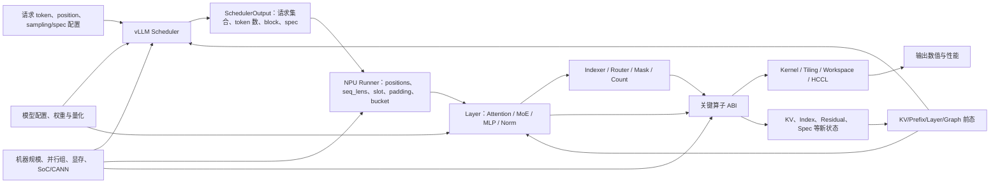
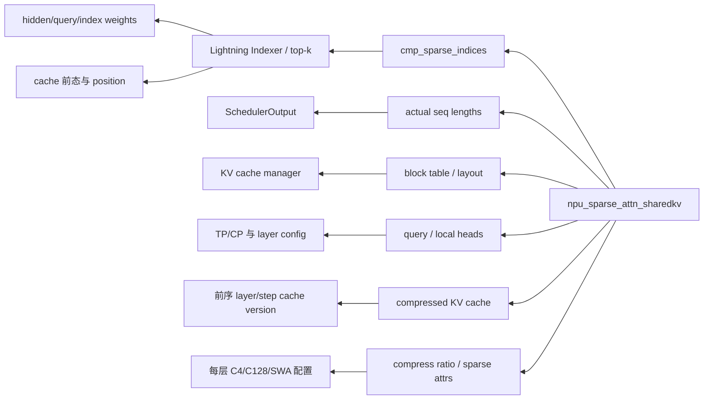
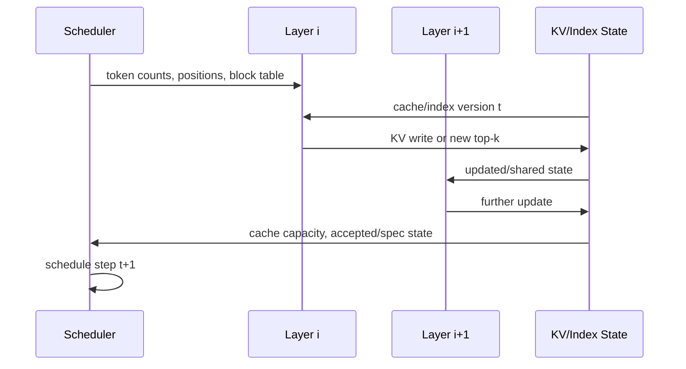

# 录制回放中的 Tensor 因果传播与关键算子反向分析（V0.4）

> 日期：2026-07-30  
> 适用技术栈：上游 vLLM + vLLM Ascend、SGLang NPU、sgl-kernel-npu、torch_npu/CANN  
> 重点模型：DeepSeek-V4 Pro/Flash、GLM-5.2、MiniMax-M3、Qwen3.7  
> 文档定位：从“源码证据目录”升级为“整体因果分析与回放决策方法”  
> 原始证据库：`录制回放_shape与控制流_昇腾NPU推理栈源码证据_V0.3-NPU.md`

---

## 0. 结论先行

V0.3-NPU 已经证明了很多局部事实：shape 会变、index 会进入稀疏 attention、MoE 路由会改变通信 split、KV slot 会改变物理访问、图 replay 依赖 bucket 和地址。但把这些事实逐条排列，仍然回答不了两个更有价值的问题：

1. 某个 tensor 的 shape 或值发生变化后，影响会怎样沿整个推理流程传播？
2. 从一个最终关键算子出发，怎样反推出真正需要录制的最小上游集合？

V0.4 的核心判断是：

> **录制回放的泛化对象不是孤立 tensor，也不是最终 output shape，而是一张跨 scheduler、runner、layer、operator、通信和 cache 状态的因果依赖图。**

一个 tensor 对后续流程的影响至少有七个维度：

| 影响维度 | 含义 | 典型例子 |
|---|---|---|
| `N`：Numerical | 改变数值结果，但暂时不改变路径 | 普通 activation、weight 数值 |
| `S`：Logical Shape | 改变 rank 或 extent | `view/cat/pad/split`、TP 本地 head |
| `F`：Physical Format | 改变 storage、stride、packing、alignment | ND/NZ、INT8 C0=32 |
| `A`：Address/Selection | 值决定读取或写入哪些位置 | top-k index、slot mapping、block table |
| `P`：Path | 值或配置决定显式/隐式控制流 | `compress_ratio`、forward mode、graph guard |
| `W`：Workload | shape 不变，但有效计算、访存或通信量改变 | expert counts、sparse locality、valid lengths |
| `Z`：State | 改变后续 layer/step 可见状态 | KV cache、shared index、spec token、graph buffer |

因此：

- **同 shape、不同值**不一定能复用：index、router、length、mask、count 的值会改变 `A/P/W/Z`；
- **同值、不同物理格式**不一定能复用：operator ABI、storage 和 tiling 可能不同；
- **同模型、同卡数**不一定能复用：真实 DP/TP/EP/PP/CP、显存容量和 scheduler 配置会先改变本轮 workload；
- **同 `world_size`、不同 group 分解**也不等价：TP/DP/EP/PP/CP 会分别改变本地 shard、padding、layer/expert ownership、通信 shape 和实现分支；
- **只录关键算子输入**只能做孤立算子回放，不能解释这些输入为什么产生，也不能正确推进下一轮状态；
- **保存所有中间 tensor**又过于昂贵，正确目标是寻找每个关键算子的“最小充分因果截面”。

本报告最终给出的第一版方法是：

```text
正向影响传播
  + 关键算子反向切片
  + 跨 layer/step 状态闭包
  + 最小充分录制截面
  + 分级回放等价性
```

---

## 1. 问题需要从“shape 列表”重构为“因果图”

### 1.1 一个 tensor 不能只用 `shape + dtype` 描述

建议把每个需要分析的 tensor 表示为：

```yaml
tensor_node:
  id: "step42.layer17.attn.cmp_sparse_indices"
  producer: "lightning_indexer"
  consumers: ["npu_sparse_attn_sharedkv"]
  semantic_role: "index"
  logical_shape: [4096, 1, 2048]
  storage_shape: [4096, 1, 2048]
  dtype: "int32"
  layout: "ND"
  value_policy: "exact|recompute|constrained_synthetic"
  provenance:
    request_ids: ["..."]
    source_layer: 17
    cache_version: 8321
  influence:
    numerical: true
    shape: false
    physical_format: false
    address_selection: true
    path: true
    workload: true
    future_state: false
```

`semantic_role` 比 tensor 名称更重要。同样是 `[T,K] int32`：

- 如果是 token IDs，它进入 embedding 和可能的 hash/router；
- 如果是 sparse index，它选择 KV page；
- 如果是 expert IDs，它生成 expert histogram 和通信 split；
- 如果是 slot mapping，它决定 cache 写地址；
- 如果是累计长度，它决定 ragged segment 边界。

这些 tensor 的外观相同，回放约束完全不同。

### 1.2 推理流程的统一影响图



这张图包含五类边：

| 边类型 | 含义 | 例子 |
|---|---|---|
| Data edge | 数值作为下一算子输入 | hidden → router logits |
| Shape edge | extent 参与输出 shape 推导 | `num_scheduled_tokens` → `T_raw` |
| Index/address edge | 值选择地址或排列 | slot ID → KV 写位置 |
| Guard/path edge | 值决定实现或分支 | `compress_ratio == 4` |
| State edge | 本轮输出成为后续前态 | cache version `t → t+1` |

### 1.3 三个传播方程

可以把推理中的关键变化抽象成三类方程：

```text
路径：
P_next = Guard(value, shape, config, state, device)

执行计划：
Plan = KernelSelect(op, logical_shape, storage_format, attrs, SoC, versions)

状态：
State_(t+1) = Update(State_t, values, indices, schedule, branch)
```

对任意输出节点 `y`，其影响不是只由直接输入决定，而是：

```text
Influence(y)
  = Transfer_op(
      Influence(parents),
      operator attrs,
      selected guards,
      state version,
      topology and runtime
    )
```

一旦出现 state edge，就必须跨 layer、跨 step 迭代到闭包，不能只看单层 forward。

---

## 2. Tensor 的值和 shape 如何流入整个推理流程

### 2.1 第一阶段：请求值先被 scheduler 变成执行集合

用户输入不是直接成为 `[T,H]`。上游 vLLM 先结合：

- 当前 running/waiting 请求；
- 每请求已计算 token 数；
- prompt/output/spec token；
- token budget 和 long-prefill threshold；
- max model length；
- KV block 是否足够；
- 抢占策略、prefix cache、P/D 分离；
- encoder、structured output 和 speculative 状态；

生成 `SchedulerOutput`。

其直接结果是：

```text
request set
num_scheduled_tokens[request]
total_num_scheduled_tokens
block IDs / new block IDs / CoW
scheduled spec token IDs
common-prefix blocks
preempted/resumed state
```

这已经决定了本轮 `T_raw`、请求边界和 cache 增量。

### 2.2 第二阶段：runner 把调度结果变成 tensor、metadata 和 graph bucket

Ascend runner 再把上面的离散状态转换为：

```text
num_scheduled_tokens_np
query_start_loc / cumulative lengths
positions
seq_lens / prefix_lens
block table
slot mapping
T_padded / B_padded
graph BatchDescriptor
ubatch slices
attention state
```

这里第一次同时出现：

- shape 变化：`T_raw → T_padded`；
- 值变化：positions、slot IDs、累计长度；
- 路径变化：zero-token、prefill/decode/spec、eager/graph；
- 状态变化：KV block 分配、request cache 更新。

### 2.3 第三阶段：模型参数把全局 shape 变成本 rank shape

模型尺寸和并行组决定本地：

```text
local hidden / heads / KV heads
local intermediate size
local experts
weight shard
cache head size
quant scale shape
```

例如 TP 变化可能同时影响：

- Q/K/V projection 输出 extent；
- KV head 是切分还是复制；
- attention kernel group size；
- weight shard 与通信；
- graph bucket 的合法性。

所以“模型尺寸 × 卡数”不是完整公式，必须先知道真实 parallel group。

### 2.4 第四阶段：普通数值被转化为 index、count、mask 和 guard

这是 value 对路径影响最集中的阶段：

```text
hidden
  -> router logits
  -> expert top-k IDs/weights
  -> expert histogram
  -> rank send/recv split

query/indexer state
  -> sparse scores
  -> top-k KV positions
  -> sparse attention page selection

seq_lens + block_table
  -> block IDs
  -> slot IDs
  -> KV physical address
```

普通 activation 的值本来只属于 `N`；一旦经过 `topk/nonzero/where/histc/cumsum`，影响会升级到 `A/P/W/Z`。

### 2.5 第五阶段：逻辑 ABI 再被设备和物理格式映射为执行计划

同一逻辑 tensor 还会经历：

```text
logical shape
  -> storage shape / stride / NZ packing
  -> operator support check
  -> fused/native fallback
  -> graph descriptor
  -> tiling key
  -> workspace
  -> kernel and communication plan
```

因此某个输入对性能的影响可能不经过 Python 分支，而是在 CANN tiling、workspace 或 HCCL 中成为“隐式控制流”。

### 2.6 第六阶段：结果回写状态，影响后续 layer 和 step

需要闭环分析的状态包括：

- KV cache 内容、block table、slot mapping 和 cache version；
- shared indexer/top-k buffer；
- residual、pipeline intermediate；
- speculative draft/accepted token；
- prefix cache 和 connector metadata；
- graph 中原地更新的稳定 buffer；
- MoE/EPLB 的 expert placement 或热度状态。

这意味着一次输入变化可能在当前 layer 不改变 shape，却在下一 layer 或下一 step 改变路径。

### 2.7 一条完整源码锚点：scheduler 值进入 NPU bucket

- 上游入口：[vLLM `engine/core.py` L595-L614](https://github.com/vllm-project/vllm/blob/c44e191b014db0619bd51921e94c86b901ab952e/vllm/v1/engine/core.py#L595-L614)
- NPU 消费：[vLLM Ascend `model_runner_v1.py` L1833-L1898](https://github.com/vllm-project/vllm-ascend/blob/e462c42a4599bb17bae49775074eb6a9b094f528/vllm_ascend/worker/model_runner_v1.py#L1833-L1898)

<table class="source-evidence">
<thead>
<tr><th align="right">行号</th><th align="left"><code>vLLM · vllm/v1/engine/core.py</code></th></tr>
</thead>
<tbody>
<tr>
<td align="right" valign="top"><pre><code>595
596
609
610
611
614</code></pre></td>
<td valign="top"><pre><code class="language-python">scheduler_output = self.scheduler.schedule(self._should_throttle_prefills())
future = self.model_executor.execute_model(scheduler_output, non_block=True)
engine_core_outputs = self.scheduler.update_from_output(
    scheduler_output, model_output
)
return engine_core_outputs, scheduler_output.total_num_scheduled_tokens &gt; 0</code></pre></td>
</tr>
</tbody>
</table>

<table class="source-evidence">
<thead>
<tr><th align="right">行号</th><th align="left"><code>vLLM Ascend · vllm_ascend/worker/model_runner_v1.py</code></th></tr>
</thead>
<tbody>
<tr>
<td align="right" valign="top"><pre><code>1833
1835
1842
1843
1853
1870
1871
1873
1874
1890
1892</code></pre></td>
<td valign="top"><pre><code class="language-python">num_reqs = self.input_batch.num_reqs
tokens = [scheduler_output.num_scheduled_tokens[i] for i in req_ids]
num_scheduled_tokens_np = np.array(tokens, dtype=np.int32)
max_num_scheduled_tokens = int(num_scheduled_tokens_np.max())
num_tokens_unpadded = scheduler_output.total_num_scheduled_tokens
) = self._determine_batch_execution_and_padding(
    num_tokens=num_tokens_unpadded,
    num_scheduled_tokens_np=num_scheduled_tokens_np,
    max_num_scheduled_tokens=max_num_scheduled_tokens,
num_tokens_padded = batch_desc.num_tokens
ubatch_slices, ubatch_slices_padded = maybe_create_ubatch_slices(</code></pre></td>
</tr>
</tbody>
</table>

这段调用链直接证明：最终 NPU tensor shape 不是模型配置独立推导的，而是上游 scheduler 的动态输出经过 runner 再加工的结果。

### 2.8 贯穿示例：输入 shape 不变，为什么整个 MoE 流程仍会分叉

假设两次运行的模型、拓扑、`T`、`H`、top-k 数量和输入 `[T,H]` shape 完全相同，只改变 token 序列，因此 hidden 的数值分布不同：

| 阶段 | Run A 与 Run B 的外观 | 实际变化 | 影响标签 |
|---|---|---|---|
| hidden | shape 都是 `[T,H]` | 数值不同 | `N` |
| router logits | shape 都是 `[T,E]` | expert 排名不同 | `N` |
| `topk_idx` | shape 都是 `[T,K]` | expert ID 与重复分布不同 | `A/P` |
| expert histogram | shape 都是 `[E]` | 每 expert token 数不同 | `W` |
| rank split vector | shape 都是 `[EP]` | 每 peer send/recv count 不同 | `A/W` |
| permuted tensor | 总元素数可能相同 | 排列、每 rank 局部 extent 不同 | `A/S/W` |
| grouped GEMM | weight shape 不变 | 每 expert 的 `M_e` 不同，tiling/workspace 可变 | `S/W` |
| combine/output | shape 又回到 `[T,H]` | 数值和反向排列不同 | `N/A` |
| 下一层 | 输入 shape 仍可能相同 | router、index、cache 更新继续分叉 | `N/A/P/W/Z` |

完整传播链是：

```text
token values
  -> embedding/hidden values
  -> router logits
  -> top-k expert IDs
  -> expert histogram
  -> rank send/recv splits
  -> token permutation
  -> All-to-All link workload
  -> per-expert GEMM M_e
  -> reverse permutation and combine
  -> next-layer hidden/router/state
```

如果只比较 tensor shape，两次运行会被误判为“兼容”；但实际可能同时改变 HCCL 链路流量、各 rank 接收 token 数、grouped GEMM extent、tiling 和尾延迟。

对应的录制决策是：

- E0 数值精确回放：保存原 token/hidden 与完整状态，或保存可确定重算 `topk_idx` 的上游；
- E1 路径回放：至少保持 top-k expert ID、expert placement、permute/reverse mapping；
- E2 性能回放：不一定需要相同 token ID，但必须保持 expert count、rank split、每 expert `M_e` 和必要的排列/locality 约束；
- E3 单算子测试：可以直接合成合法的 split 和 grouped GEMM extent，但不能再声称复现了模型路径。

这也是“从关键算子反推”的实际价值：从 All-to-All 或 grouped GEMM 出发，可以立即知道 `[T,H]` 不是充分条件，必须继续回溯到 router 分布和拓扑。

---

## 3. 控制流不能只理解成 Python `if/else`

### 3.1 六类控制流

| 类型 | 判定发生处 | 例子 | shape 相同时是否仍可能不同 |
|---|---|---|---|
| 显式 host 分支 | Python/C++ | dense/C4/C128、A5/非 A5 | 是 |
| 层配置分支 | 模型构造/每层 forward | sparse/dense、MoE/dense、shared index | 是 |
| 数据依赖选择 | 算子值流 | top-k、mask、slot、router | 是 |
| 资源分支 | scheduler/cache manager | token budget、KV 不足、抢占 | 是 |
| 运行时计划分支 | graph/tiling/workspace | capture/replay、kernel fallback | 是 |
| 分布式分支 | executor/collective | bypass、All-to-All、MC2、PP send/recv | 是 |

### 3.2 显式路径与隐式路径

显式路径可以记录：

```text
predicate inputs
predicate expression
selected branch
source location
downstream implementation
```

隐式路径没有明显 `if`，但需要记录：

```text
index/address mapping
valid lengths and masks
expert/rank counts
graph descriptor
tiling/workspace identity
collective counts
operator implementation ID
```

例如 top-k index 的值通常不会改变 Python 调用栈，但会改变 sparse attention 实际读取的 KV page。这属于地址路径和 workload 路径，不应被判断为“控制流没变”。

### 3.3 建议的路径签名

```yaml
path_signature:
  explicit_branches:
    - source: "file.py:L1751"
      predicate: "compress_ratio == 4"
      dependencies: {compress_ratio: 4}
      selected: "with_sparse_indices"
  implementation_ids:
    scheduler: "vllm.v1.scheduler"
    worker: "NPUWorker"
    model_runner: "MRv1"
    attention: "npu_sparse_attn_sharedkv"
    moe_comm: "alltoall"
  implicit:
    graph_descriptor: "..."
    tiling_id: "..."
    index_digest: "..."
    expert_count_digest: "..."
```

---

## 4. 从关键算子反推：统一方法

### 4.1 为什么反向分析比继续扫描所有 `view()` 更有效

扫描 `view/reshape/slice/if/else` 能找到候选，但无法判断重要性。反向分析从最终昂贵或状态敏感的 sink 出发，只保留能影响它的上游节点。

优先 sink：

- sparse/shared-KV attention；
- Lightning Indexer；
- KV cache write/copy/page attention；
- MoE top-k、permute、dispatch、grouped GEMM、combine；
- All-to-All/All-Gather/MC2；
- quantized linear/GMM；
- ACL Graph capture/replay；
- CANN tiling/workspace 边界。

### 4.2 六步反向切片

对关键算子 `K`：

1. **展开完整 ABI**  
   列出 tensor、scalar attr、layout、workspace、通信 group、state handle。
2. **给每个输入标注语义角色**  
   payload、shape、index、length、count、guard、state、weight/scale。
3. **反查 producer**  
   沿 data/shape/index/guard/state edge 回溯到 scheduler、模型参数或前态。
4. **展开 producer 的控制条件**  
   包括实现选择、设备、量化、graph、合法性和 fallback。
5. **找到稳定根或录制截面**  
   固定模型/版本/拓扑可视为根；运行时动态值进入截面。
6. **按回放目标裁剪**  
   Exact、Path、Performance、Microbenchmark 需要的截面不同。

伪代码：

```text
reverse_slice(sink, replay_level):
    queue = all ABI inputs, attrs, guards and state of sink
    while queue not empty:
        node = queue.pop()
        role = classify_semantic_role(node)
        impacts = infer_impacts(node, sink)

        if must_record(node, replay_level):
            cut.add(node)
        elif deterministically_recomputable(node, fixed_environment):
            queue.extend(producers(node))
        elif replay_level allows constrained synthetic:
            constraints.add(extract_constraints(node))
        else:
            mark_incompatible(node)

        queue.extend(guard_dependencies(node))
        queue.extend(state_predecessors(node))

    return minimal(cut), constraints, incompatibilities
```

### 4.3 最小充分因果截面

设从动态根到关键算子存在多条因果路径。一个录制集合 `C` 是充分的，当：

1. 每条非确定性路径都至少经过 `C` 中一个节点；
2. `C` 之后的计算在固定代码、环境和状态下可确定重建；
3. `C` 包含所有跨 step/layer 的状态版本；
4. 对目标等价级别，没有未覆盖的 `P/A/W/Z` 影响。

这比“保存所有 tensor”小，也比“只保存算子输入 shape”强。

### 4.4 哪些值保存、重算或合成

| 策略 | 条件 | 例子 |
|---|---|---|
| Exact record | 值直接影响地址、路径或未来状态，且难以便宜重建 | sparse index、slot mapping、accepted spec tokens |
| Recompute | producer 可执行，输入与状态可保存 | router top-k、Lightning Indexer |
| Formula rebuild | 纯 shape/metadata 公式且依赖齐全 | TP local heads、累计长度、NZ shape |
| Constrained synthetic | 仅做性能回放，可保留 workload 约束 | expert count、合法 sparse locality |
| Digest only | 只用于同一性检查，不能恢复值 | 大 tensor 校验 |

---

## 5. 关键算子反向分析一：Sparse/Shared-KV Attention

### 5.1 从 sink 反推依赖

以 `npu_sparse_attn_sharedkv` 为 sink：



### 5.2 输入角色和传播后果

| Sink 输入 | 语义角色 | 上游来源 | shape/value 变化后的后果 |
|---|---|---|---|
| query | payload + shape | hidden、TP local heads | GEMM/attention extent、数值 |
| compressed KV | state + physical format | cache spec、SoC、历史 token | 可读历史、storage、访存 |
| sparse indices | index/address | indexer top-k | 读取不同 page、局部性、数值 |
| actual lengths | length/segment | scheduler/runner | ragged 边界、有效 workload |
| block table | address/state | KV manager | logical token → physical page |
| compress ratio | guard | layer config | C4 top-k 或 C128 全历史 |
| layout/head attrs | ABI/guard | model + backend | 输出 rank、kernel 合法域 |

### 5.3 决定性源码锚点

- [SGLang `ascend_dsv4_backend.py` L1745-L1757](https://github.com/sgl-project/sglang/blob/1b9dfa14e66b617ed53270164549d59290b1f7c8/python/sglang/srt/hardware_backend/npu/attention/ascend_dsv4_backend.py#L1745-L1757)

<table class="source-evidence">
<thead>
<tr><th align="right">行号</th><th align="left"><code>ascend_dsv4_backend.py</code></th></tr>
</thead>
<tbody>
<tr>
<td align="right" valign="top"><pre><code>1745
1747
1748
1750
1751
1752
1753
1754
1755
1756</code></pre></td>
<td valign="top"><pre><code class="language-python">cmp_ratio=compress_ratio,
cmp_kv=cmp_kv,
cmp_block_table=cmp_block_table,
# c4 attends via indexer topk; c128 reads the full compressed history
if compress_ratio == 4:
    topk = fm.c4_topk_indices
    attn_kwargs["cmp_sparse_indices"] = topk.view(-1, 1, topk.shape[-1])
else:
    attn_kwargs["cmp_sparse_indices"] = None
out, _ = torch.ops.custom.npu_sparse_attn_sharedkv(**attn_kwargs)</code></pre></td>
</tr>
</tbody>
</table>

关键结论：

- C4/C128 最终 output shape 可以相同；
- 但 C4 有 indexer、`[T,1,K]` index 和稀疏访存；
- C128 传 `None` 并读取完整 compressed history；
- 只保持 `[T,H]` 会错误合并路径和 workload。

### 5.4 最小录制截面

| 回放目标 | 最小截面 |
|---|---|
| Exact | query/KV 或其可重建前态、完整 sparse index、length、block table、cache snapshot/version、compress ratio、layout |
| Path-equivalent | index 存在性、branch、合法 index、长度、cache/layout |
| Performance | `T/H/K`、有效 KV 长度、index page 分布/局部性/重复率、cache layout、tiling |
| Microbenchmark | 合法 synthetic query/KV/index + 固定 operator ABI |

---

## 6. 关键算子反向分析二：MoE Dispatch、All-to-All 与 Grouped GEMM

### 6.1 完整因果链

```text
token/hidden values
  -> router logits
  -> top-k expert IDs/weights [T,K]
  -> expert histogram [E]
  -> rank input/output splits [EP]
  -> token permutation
  -> All-to-All send/recv tensors
  -> local tokens per expert
  -> grouped GEMM M vector
  -> combine/reverse permutation
```

外层 `[T,H]` 和 top-k `[T,K]` 相同，只要 expert ID 分布不同，就会同时改变：

- 每 rank 通信 count；
- 跨节点流量；
- 本地接收 tensor 第一维；
- 每 expert GEMM 的 `M`；
- padding/capacity；
- permute locality；
- 尾部负载和同步等待。

### 6.2 从通信算子反推

| Sink/阶段 | 必须反推的上游 | 关键影响 |
|---|---|---|
| All-to-All | input/output splits、EP group、permutation | 通信 tensor extent 和链路负载 |
| Grouped GEMM | local expert token counts、weight shard、quant scale | 每组 `M/N/K` |
| Combine | reverse mapping、top-k weights、drop/pad | 数值恢复和输出排列 |
| Fused DeepEP | capacity、physical expert placement、layout | buffer shape 和实现 |

### 6.3 决定性源码锚点

- [histogram → split L469-L524](https://github.com/sgl-project/sgl-kernel-npu/blob/3479f4d99cd4e65a1cbe316f8bafc318014a4eb9/python/deep_ep/deep_ep/strategies/normal_strategy.py#L469-L524)
- [split → All-to-All L571-L605](https://github.com/sgl-project/sgl-kernel-npu/blob/3479f4d99cd4e65a1cbe316f8bafc318014a4eb9/python/deep_ep/deep_ep/strategies/normal_strategy.py#L571-L605)

<table class="source-evidence">
<thead>
<tr><th align="right">行号</th><th align="left"><code>normal_strategy.py</code></th></tr>
</thead>
<tbody>
<tr>
<td align="right" valign="top"><pre><code>469
470
471
473
474
475
494
495
496
521
523
524

571
573
574
583
585
586
600
601
602
603
604</code></pre></td>
<td valign="top"><pre><code class="language-python">num_local_tokens_per_expert = torch.histc(
    topk_idx, bins=num_experts, min=0, max=num_experts
)
input_splits = (
    num_local_tokens_per_expert.reshape(group_size, num_local_experts)
    .sum(axis=1)
output_splits = (
    num_global_tokens_per_local_expert.sum(axis=-1).cpu().numpy().tolist()
)
self._alltoall_layout = {
    "input_splits": input_splits,
    "output_splits": output_splits,

layout = self._alltoall_layout
input_splits = layout["input_splits"]
output_splits = layout["output_splits"]
permutated_tokens, reversed_local_mapping = torch_npu.npu_moe_token_permute(
    indices=topk_idx,
    num_out_tokens=topk_idx.numel(),
_, global_input_tokens, handle_a2a = self._async_all_to_all(
    permutated_tokens,
    output_splits,
    input_splits,
    self.group,</code></pre></td>
</tr>
</tbody>
</table>

这里最有价值的结论不是“MoE 有动态 shape”，而是：

> **top-k 值通过 histogram 成为通信和 GEMM 的实际 extent。**

### 6.4 最小录制截面

建议优先记录：

```text
T, H, K
logical and physical expert IDs
expert_count_vector[E]
rank_send_count_vector[EP]
rank_recv_count_vector[EP]
local_GEMM_M_vector[local_E]
capacity/padding/drop
permutation/reverse mapping digest
EP group and rank placement
communication implementation
```

性能回放可以不保存原 activation，但必须保持这些分布向量；只保存平均每 expert token 数不足以保持热点和尾延迟。

---

## 7. 关键算子反向分析三：KV Cache、Block Table 与 Slot Mapping

### 7.1 为什么 slot tensor 的值比 shape 更重要

KV cache 的逻辑访问链：

```text
request + seq/query/prefix lengths
  -> logical positions
  -> block number / offset
  -> block_table gather
  -> physical block ID
  -> slot ID
  -> cache storage address
```

`slot_mapping.shape == [T]` 只说明有 T 次写入，不说明写到哪里。

### 7.2 决定性源码锚点

- [vLLM Ascend `dsa_v1.py` L404-L423](https://github.com/vllm-project/vllm-ascend/blob/e462c42a4599bb17bae49775074eb6a9b094f528/vllm_ascend/attention/dsa_v1.py#L404-L423)

<table class="source-evidence">
<thead>
<tr><th align="right">行号</th><th align="left"><code>dsa_v1.py</code></th></tr>
</thead>
<tbody>
<tr>
<td align="right" valign="top"><pre><code>404
405
406
407
414
417
419
420
421
423</code></pre></td>
<td valign="top"><pre><code class="language-python">query_lens = query_start_loc[1:] - query_start_loc[:-1]
prefix_lens = seq_lens - query_lens
start_pos = (prefix_lens - int(window_size)).clamp(min=0)
visible_lens = seq_lens - start_pos
block_nums = pos // block_size
safe_nums = block_nums.clamp(min=0, max=int(block_table.shape[1]) - 1)
block_ids = torch.gather(block_table, 1, safe_nums)
slot_ids = (block_ids * block_size + block_offsets).to(torch.int32)
slot_ids = slot_ids.where(col_mask, torch.full_like(slot_ids, -1))
per_token_slots = torch.repeat_interleave(slot_ids, query_lens, dim=0, output_size=num_decode_tokens).unsqueeze(1)</code></pre></td>
</tr>
</tbody>
</table>

### 7.3 反向依赖

| 结果 | 反向依赖 |
|---|---|
| slot ID 值 | block table 值、block size、position、window、mask |
| slot tensor 长度 | query lengths、scheduled requests |
| block table 宽度 | max sequence、block size、scheduler/cache manager |
| cache storage | cache spec、dtype、SoC、NZ/ND、num blocks |
| 下一轮可见状态 | cache 写入顺序、preemption、copy/reorder、connector |

### 7.4 必须版本化

Exact replay 至少需要：

```text
kv_cache_version_in
block_table_version
slot_mapping or deterministic inputs
new/zeroed/copied blocks
cache write set
kv_cache_version_out
```

如果只保存 slot IDs 而不保存对应 cache snapshot/version，同一个 slot 值也可能读取到不同内容。

---

## 8. 关键算子反向分析四：Quantized Linear / Grouped GEMM

### 8.1 从 GEMM 的 `M/N/K` 反推

| 维度 | 常见来源 | 会被什么改变 |
|---|---|---|
| `M` | 本轮 token 数或本 expert token 数 | scheduler、padding、MoE routing |
| `K` | local hidden/input channel | 模型尺寸、TP、packing |
| `N` | local output/intermediate channel | 模型尺寸、TP/EP、shared expert |
| weight storage | logical `[N,K]` 的物理格式 | dtype、quant、NZ、SoC |
| scale/offset | quant block/channel 规则 | W8A8/W4A8/C8、group size |

同一权重 logical shape 可能对应不同物理 storage 和 kernel。同一权重又可能因为动态 `M` 不同命中不同 tiling。

### 8.2 物理格式不是附属信息

- [vLLM Ascend `utils.py` L1460-L1482](https://github.com/vllm-project/vllm-ascend/blob/e462c42a4599bb17bae49775074eb6a9b094f528/vllm_ascend/utils.py#L1460-L1482)

<table class="source-evidence">
<thead>
<tr><th align="right">行号</th><th align="left"><code>vllm_ascend/utils.py</code></th></tr>
</thead>
<tbody>
<tr>
<td align="right" valign="top"><pre><code>1461
1462
1463
1464
1466
1467
1468
1469
1470
1472
1480
1481</code></pre></td>
<td valign="top"><pre><code class="language-python">def trans_nd_to_nz(cache_tensor: torch.Tensor):
    assert len(cache_tensor.shape) &gt;= 2
    batch = cache_tensor.shape[:-2]
    a, b = cache_tensor.shape[-2], cache_tensor.shape[-1]
    dtype = cache_tensor.dtype
    if dtype == torch.int8:
        a0, b0 = 16, 32
    else:
        a0, b0 = 16, 16
    nz_shape = list(batch) + [math.ceil(b / b0), math.ceil(a / a0), a0, b0]
    cache_tensor = cache_tensor.reshape(nz_shape[:-4] + [m1, m0, n1, n0])
    cache_tensor = cache_tensor.permute(*array_trans)</code></pre></td>
</tr>
</tbody>
</table>

### 8.3 阈值还会改变权重对象本身

vLLM Ascend 在特定 DSA-CP 量化 projection 上，如果维度达到 65536，会把权重拆成 `weight_1/weight_2`，同时拆 scale/offset 并删除原权重：

- [vLLM Ascend `w8a8_dynamic.py` L126-L151](https://github.com/vllm-project/vllm-ascend/blob/e462c42a4599bb17bae49775074eb6a9b094f528/vllm_ascend/quantization/methods/w8a8_dynamic.py#L126-L151)

这说明权重 manifest 不能只记录 checkpoint tensor 名和 logical shape，还要记录 load 后的实际对象、分片、格式和 scale。

---

## 9. 关键算子反向分析五：ACL Graph / NPUGraph

### 9.1 图 artifact 的反向依赖

从一次 graph replay 反推：

```text
graph entry
  <- BatchDescriptor
  <- T_padded / B_padded / uniform decode / ubatch
  <- SchedulerOutput and runner padding

graph legality
  <- runtime mode / eager guard / supported op

graph memory
  <- stable input addresses / memory pool / aliasing

graph performance
  <- captured operator set / tiling / workspace / SoC / versions
```

### 9.2 决定性源码锚点

- [vLLM Ascend `acl_graph.py` L133-L165](https://github.com/vllm-project/vllm-ascend/blob/e462c42a4599bb17bae49775074eb6a9b094f528/vllm_ascend/compilation/acl_graph.py#L133-L165)
- [vLLM Ascend `acl_graph.py` L243-L266](https://github.com/vllm-project/vllm-ascend/blob/e462c42a4599bb17bae49775074eb6a9b094f528/vllm_ascend/compilation/acl_graph.py#L243-L266)

<table class="source-evidence">
<thead>
<tr><th align="right">行号</th><th align="left"><code>acl_graph.py</code></th></tr>
</thead>
<tbody>
<tr>
<td align="right" valign="top"><pre><code>135
138
145
147
149
153
163
164
165

243
245
246
252
263
264
265
266</code></pre></td>
<td valign="top"><pre><code class="language-python">batch_descriptor = forward_context.batch_descriptor
if aclgraph_runtime_mode == CUDAGraphMode.NONE or aclgraph_runtime_mode != self.runtime_mode:
    return self.runnable(*args, **kwargs)
if batch_descriptor not in self.concrete_aclgraph_entries:
    self.concrete_aclgraph_entries[batch_descriptor] = ACLGraphEntry(batch_descriptor=batch_descriptor)
if entry.aclgraph is None:
    input_addresses = [x.data_ptr() for x in args if isinstance(x, torch.Tensor)]
    entry.input_addresses = input_addresses
    aclgraph = torch.npu.NPUGraph()

if self.is_debugging_mode:
    new_input_addresses = [x.data_ptr() for x in args if isinstance(x, torch.Tensor)]
    assert new_input_addresses == entry.input_addresses, (
logger.info_once("Replaying aclgraph")
need_sync = self.runtime_mode == CUDAGraphMode.FULL and not is_draft_eagle
if not self.enable_enpu and need_sync:
    torch.npu.current_stream().synchronize()
entry.aclgraph.replay()</code></pre></td>
</tr>
</tbody>
</table>

### 9.3 回放判断

仅 batch size 相同不能复用 graph。至少需要比较：

```text
BatchDescriptor
runtime/graph mode
T/B padded extents
operator implementation set
stable buffer/address plan
input aliasing
graph update policy
SoC/CANN/torch_npu/framework commits
```

graph artifact 应被视为“环境 + bucket + buffer plan”的联合状态，不是模型静态资产。

---

## 10. 关键算子反向分析六：Collective Communication

### 10.1 通信 shape 有两层

1. **外部 tensor shape**：例如 `[sum(send_counts), H]`；
2. **ragged split vector**：每个 peer 实际发送/接收多少。

两个 rank 的总元素相同，不代表每条链路 workload 相同。

### 10.2 反向依赖

```text
collective tensor/splits
  <- expert/rank counts or TP/PP partition
  <- router/index/sequence distribution
  <- token values and scheduler batch

collective implementation
  <- EP/TP/DP/PP group
  <- world size and single-rank bypass
  <- FlashComm/MC2/DeepEP/HCCL config
  <- SoC and interconnect topology
```

### 10.3 录制建议

```text
group identity and ordered ranks
collective implementation
input/output split vectors
payload dtype and local shape
peer/node placement
buffer/capacity/padding
HCCL/FlashComm/MC2 relevant configuration
```

count signature 是性能等价的必要条件，但链路和拥塞仍需要环境 signature。

---

## 11. 跨 Layer、跨 Step 的状态闭包

### 11.1 为什么单 layer trace 不够



### 11.2 需要区分的依赖

| 依赖 | 例子 | 不能遗漏的字段 |
|---|---|---|
| 同层临时值 | Q/K/V、router logits | producer 和 branch |
| 跨层复用 | GLM shared indexer | source layer、buffer version |
| 跨层累积 | residual、PP intermediate | stage、版本、shape |
| 跨 step cache | KV、prefix cache | in/out version、block mapping |
| speculative 状态 | draft/accepted tokens | width、accepted count、position |
| graph 原地状态 | stable buffers | address/alias/update order |

### 11.3 状态记录模板

```yaml
state_transition:
  scope: "request42.layer17"
  inputs:
    kv_cache_version: 8321
    index_version: 410
  operation:
    branch: "compressed_c4"
    write_slots_ref: "..."
  outputs:
    kv_cache_version: 8322
    index_version: 411
  consumers:
    - "request42.layer18"
    - "request42.step43"
```

---

## 12. 不同参数组合如何进入这张因果图

| 变化维度 | 首个受影响节点 | 典型下游传播 |
|---|---|---|
| 模型 hidden/head/intermediate | weight/local tensor shape | GEMM N/K、attention head、cache |
| layer/expert 数 | layer map、expert placement | 分支、权重、MoE group |
| 量化方案 | weight/scale/storage | kernel、workspace、显存容量 |
| TP/EP/PP/CP/DP | local shard/group | local shape、通信、cache |
| 单卡显存 | KV block/最大并发配置 | scheduler、抢占、T、bucket |
| 节点/卡数 | group 和 rank placement | 本地 shard、collective、P/D |
| token/position 值 | embedding/index/router/cache | 数值、地址、routing、状态 |
| batch/seq/prefix | SchedulerOutput | T/B、length、slot、graph |
| SoC/CANN | dtype/layout/support | 实现、tiling、graph、storage |

### 12.1 显存对 shape 的影响是间接但真实的

```text
显存容量
  -> 可分配 KV blocks / graph pool / max concurrency
  -> scheduler 可接受的请求和 token budget
  -> num_scheduled_tokens / preemption
  -> T_raw / block IDs
  -> T_padded / graph bucket
  -> operator and communication workload
```

因此 64G 与 96G 的差异不一定写在模型 forward 中，但会经资源状态流入执行 shape。

### 12.2 总卡数不是因果根，parallel groups 才是

```text
64 cards
  ≠ unique execution shape

64 cards
  -> DP × TP × EP × PP × CP
  -> ordered rank groups and P/D roles
  -> local weight/head/expert/cache shape
  -> communication and scheduler capacity
```

仅有上述概念仍然不够。`world_size` 不能作为一个孤立整数录制，因为不同框架、不同 launcher 对它的命名和边界并不完全一致。真正的因果根应当是：

```text
TopologySignature
  = physical ranks and node placement
  + ordered TP/DP/EP/PP/CP/DCP groups
  + rank coordinates in every group
  + P/D role
  + component-specific fine-grained groups
```

### 12.3 先区分四种容易混淆的 `world_size`

| 名称 | 含义 | 为什么不能互换 |
|---|---|---|
| physical world size | 本次 distributed job 的实际进程/rank 总数 | 决定进程拓扑，但不直接说明模型如何切分 |
| model-replica world size | 一个模型副本内部的 TP×PP×CP 等 rank 数 | 决定本地权重、head、layer 和 cache 分片 |
| DP size | 独立请求/模型副本数，或框架中特定 attention/MoE DP 轴 | 影响请求分配、状态副本和某些跨 DP padding/通信 |
| operator group world size | 某个 TP/EP/CP/collective group 的实际大小 | 直接进入 collective shape、split、kernel 和 bypass 分支 |

建议统一记录以下拓扑，而不要只保存 `world_size=64`：

```yaml
topology_signature:
  framework_semantics: "vllm-ascend"
  physical_world_size: 64
  nodes: 8
  ranks_per_node: 8
  rank_order: "node-major"
  model:
    tp: 8
    pp: 1
    pcp: 1
    dcp: 1
    replica_dp: 8
  attention:
    tp_group_size: 8
  moe:
    expert_parallel: true
    ep_group_size: 64
    ep_spans: ["tp", "pcp", "replica_dp"]
  groups:
    tp: [[0,1,2,3,4,5,6,7], "..."]
    dp: ["..."]
    ep: ["..."]
  rank_coordinates:
    "0": {node: 0, local_rank: 0, dp: 0, pp: 0, tp: 0, ep: 0}
  roles:
    prefill: ["..."]
    decode: ["..."]
  fine_grained_tp:
    embedding: 0
    oproj: 0
    mlp: 0
    lmhead: 0
```

其中 `attention.dp`、`moe.dp` 和部署层面的 replica DP 必须分别记录，不能因为都叫 DP 就合并。

### 12.4 每一种并行度沿什么因果链传播

| 并行维度 | 首个局部变化 | 继续传播到 | 回放时最容易漏掉 |
|---|---|---|---|
| TP | local Q/KV heads、linear weight shard、local hidden/intermediate | GEMM N/K、KV cache head shape、AllReduce/AllGather/ReduceScatter、padding | 只记录全局模型 shape，没有记录本 rank shard |
| DP | 每 replica 请求集合、KV/cache/graph 状态副本 | scheduler workload；昇腾某些路径还取跨 DP 最大 token 数统一 padding | 认为 DP 只复制模型、不改变本 rank 执行 shape |
| EP | local expert 集、expert placement、EP group | router 目标 rank、split vector、All-to-All/MC2、每 expert GEMM | 只保存 expert count，不保存 expert→rank placement |
| PP | 本 rank layer 区间、pipeline stage 输入/输出 | stage 间 send/recv、bubble、每 rank 权重与 cache 容量 | 把所有 layer 当作每 rank 都执行 |
| CP/PCP/DCP | 本 rank sequence/KV 区间、local length | attention mask、KV cache 容量、ring/A2A、padding | 只记录全局 seq_len，不记录本地 slice |
| fine-grained TP | embedding/oproj/MLP/lmhead 单独分组 | 组件权重 shape、额外 exchange、graph buffer | 只记录全局 TP，漏掉组件专用 group |
| rank placement | group 是否跨机、rank 顺序 | HCCL 拓扑、链路流量、通信时延 | group size 相同就判定性能等价 |

完整正向链应当扩展为：

```text
physical_world_size + rank placement
  -> named parallel groups
  -> per-rank model ownership
       weight shards / heads / experts / layers / KV slice
  -> per-rank scheduler and prepared batch
       request set / T_raw / local lengths / cache blocks
  -> group-dependent transforms
       padding / permute / split / gather / reduce
  -> operator ABI and implementation guards
  -> graph bucket / tiling / workspace / HCCL topology
  -> output and per-rank state
```

### 12.5 上游 vLLM 证据：同一个“world size”在配置中就有不同边界

- [vLLM `parallel.py` L548-L551](https://github.com/vllm-project/vllm/blob/c44e191b014db0619bd51921e94c86b901ab952e/vllm/config/parallel.py#L548-L551)
- [vLLM `parallel.py` L831-L841](https://github.com/vllm-project/vllm/blob/c44e191b014db0619bd51921e94c86b901ab952e/vllm/config/parallel.py#L831-L841)

<table class="source-evidence">
<thead>
<tr><th align="right">行号</th><th align="left"><code>vLLM · vllm/config/parallel.py</code></th></tr>
</thead>
<tbody>
<tr>
<td align="right" valign="top"><pre><code>548
549
550
551

831
833
834
835
836
837
839
840
841</code></pre></td>
<td valign="top"><pre><code class="language-python">@property
def world_size_across_dp(self) -&gt; int:
    """Process world size across TP, PCP, PP, and DP."""
    return self.world_size * self.data_parallel_size

def __post_init__(self) -&gt; None:
    self.world_size = (
        self.pipeline_parallel_size
        * self.tensor_parallel_size
        * self.prefill_context_parallel_size
    )
    if self.distributed_executor_backend == "external_launcher":
        logger.info("Using external launcher for distributed inference.")
        self.world_size *= self.data_parallel_size</code></pre></td>
</tr>
</tbody>
</table>

这里不能简单得出一个对所有 launcher 都通用的字段公式；更重要的结论是：**trace 必须保存字段语义和 launcher/backend，不能只保存名为 `world_size` 的值。**

TP 和 PP 随后直接改变本地 head 数与本 rank layer 区间：

- [vLLM `model.py` L1411-L1447](https://github.com/vllm-project/vllm/blob/c44e191b014db0619bd51921e94c86b901ab952e/vllm/config/model.py#L1411-L1447)

<table class="source-evidence">
<thead>
<tr><th align="right">行号</th><th align="left"><code>vLLM · vllm/config/model.py</code></th></tr>
</thead>
<tbody>
<tr>
<td align="right" valign="top"><pre><code>1417
1418
1419
1420
1421
1422
1424
1425
1426

1439
1441
1442
1443
1444
1445
1446</code></pre></td>
<td valign="top"><pre><code class="language-python">total_num_kv_heads = self.get_total_num_kv_heads()
# If tensor parallelism is used, we divide the number of KV heads by
# the tensor parallel size. We will replicate the KV heads in the
# case where the number of KV heads is smaller than the tensor
# parallel size so each GPU has at least one KV head.
return max(1, total_num_kv_heads // parallel_config.tensor_parallel_size)
def get_num_attention_heads(self, parallel_config: ParallelConfig) -&gt; int:
    num_heads = self.model_arch_config.total_num_attention_heads
    return num_heads // parallel_config.tensor_parallel_size

total_num_hidden_layers = self.get_total_num_hidden_layers()
# the layout order is: DP x PP x TP
pp_rank = (
    parallel_config.rank // parallel_config.tensor_parallel_size
) % parallel_config.pipeline_parallel_size
pp_size = parallel_config.pipeline_parallel_size
start, end = get_pp_indices(total_num_hidden_layers, pp_rank, pp_size)</code></pre></td>
</tr>
</tbody>
</table>

因此 TP 改变后，即使输入 token 数不变，attention 的本地 head extent、KV cache head extent、projection 权重 shard 和 collective 都会变化；PP 改变后，某个 rank 甚至不再拥有相同的 layer。

### 12.6 vLLM Ascend 证据：TP/DP/EP 会进入 shape 和 `if/else`

Ascend 初始化时先把物理 rank reshape 成 DP、PP、PCP、TP 坐标：

- [vLLM Ascend `parallel_state.py` L21-L43](https://github.com/vllm-project/vllm-ascend/blob/e462c42a4599bb17bae49775074eb6a9b094f528/vllm_ascend/distributed/parallel_state.py#L21-L43)

<table class="source-evidence">
<thead>
<tr><th align="right">行号</th><th align="left"><code>vLLM Ascend · distributed/parallel_state.py</code></th></tr>
</thead>
<tbody>
<tr>
<td align="right" valign="top"><pre><code>27
29
30
31
32
34
35
36
37
38
39
40
41
42
43</code></pre></td>
<td valign="top"><pre><code class="language-python">world_size = torch.distributed.get_world_size()
global_tp_size = parallel_config.tensor_parallel_size
global_dp_size = parallel_config.data_parallel_size
global_pp_size = parallel_config.pipeline_parallel_size
global_pcp_size = parallel_config.prefill_context_parallel_size
# The layout of all ranks: ExternalDP * EP
# ExternalDP is the data parallel group that is not part of the model,
# every dp rank can generate independently (in verl integration).
all_ranks = torch.arange(world_size).reshape(
    -1,
    global_dp_size,
    global_pp_size,
    global_pcp_size,
    global_tp_size,
)</code></pre></td>
</tr>
</tbody>
</table>

这说明相同的 `physical_world_size` 如果 group 分解或 rank 顺序不同，得到的组成员就不同。

更关键的是，TP/DP 直接进入 NPU 执行 padding 和融合路径：

- [vLLM Ascend `ascend_forward_context.py` L145-L225](https://github.com/vllm-project/vllm-ascend/blob/e462c42a4599bb17bae49775074eb6a9b094f528/vllm_ascend/ascend_forward_context.py#L145-L225)

<table class="source-evidence">
<thead>
<tr><th align="right">行号</th><th align="left"><code>vLLM Ascend · ascend_forward_context.py · TP/DP</code></th></tr>
</thead>
<tbody>
<tr>
<td align="right" valign="top"><pre><code>145
156
157
176
177
178
179
181
182
183
184

204
205
206
207
208
209
210
211
212
213
214
216
221
222
223
224
225</code></pre></td>
<td valign="top"><pre><code class="language-python">tp_world_size = get_tensor_model_parallel_world_size()
# TODO: remove it when torch_npu.npu_mm_reduce_scatter_base supports tp_size &gt;= 16.
mmrs_fusion = tp_world_size &lt;= 8
flash_comm_v1_enabled = enable_sp(vllm_config) and num_tokens is not None and num_tokens &gt; 1000
forward_context.mmrs_fusion = mmrs_fusion
forward_context.num_tokens = num_tokens
forward_context.flash_comm_v1_enabled = flash_comm_v1_enabled
forward_context.pad_size = 0
if forward_context.flash_comm_v1_enabled:
    pad_size = (tp_world_size - (num_tokens % tp_world_size)) % tp_world_size
    forward_context.pad_size = pad_size

dp_world_size = get_dp_group().world_size
if dp_world_size &gt; 1 and forward_context.dp_metadata is not None:
    dp_meta = forward_context.dp_metadata
    max_tokens_across_dp = dp_meta.num_tokens_across_dp_cpu.max().item()
    if forward_context.flash_comm_v1_enabled:
        padded_length = (max_tokens_across_dp + tp_world_size - 1) // tp_world_size * tp_world_size
        pad_size = padded_length - num_tokens
        forward_context.padded_length = padded_length
        forward_context.pad_size = pad_size
else:
    max_tokens_across_dp = num_tokens
forward_context.max_tokens_across_dp = max_tokens_across_dp
if num_tokens is not None:
    if num_actual_tokens is None:
        num_actual_tokens = num_tokens
    # NOTE: token num which need to pad to when mc2
    forward_context.padded_num_tokens = math.ceil(max_tokens_across_dp / tp_world_size) * tp_world_size</code></pre></td>
</tr>
</tbody>
</table>

这段代码明确否定了“DP 只复制模型，所以不影响 shape”这一假设：当 DP group 大于 1 时，本 rank 的 padded length 可以由**其他 DP rank 的最大 token 数**决定；TP 又同时决定对齐倍数和 `mmrs_fusion` 是否可用。

EP/world size 还会改变 MoE 通信实现：

- [vLLM Ascend `ascend_forward_context.py` L289-L337](https://github.com/vllm-project/vllm-ascend/blob/e462c42a4599bb17bae49775074eb6a9b094f528/vllm_ascend/ascend_forward_context.py#L289-L337)

<table class="source-evidence">
<thead>
<tr><th align="right">行号</th><th align="left"><code>vLLM Ascend · ascend_forward_context.py · EP/world size</code></th></tr>
</thead>
<tbody>
<tr>
<td align="right" valign="top"><pre><code>294
295
296
297
298
299
300
301

309
310
311
312
313
314
316
317
319

327
328
329
330
331
332
333
334
335
336
337</code></pre></td>
<td valign="top"><pre><code class="language-python">num_experts = vllm_config.model_config.get_num_experts()
ep_world_size = (
    vllm_config.parallel_config.world_size_across_dp // vllm_config.parallel_config.pipeline_parallel_size
)
num_experts_per_device = num_experts // ep_world_size
if num_experts_per_device &lt;= 24 and ep_world_size &gt;= 16 and num_tokens &lt;= mc2_tokens_capacity:
    return MoECommType.MC2
return MoECommType.ALLGATHER

if get_ascend_config().enable_fused_mc2 == 1:
    # TODO: drop the EP-size guard when mega_moe supports larger EP sizes
    mega_moe_enable = get_ep_group().world_size &lt;= 64 and _cann_megamoe_supported_by_config(vllm_config)
    dispatch_ffn_combine_enable = get_ep_group().world_size &lt;= 32
    if (_MEGA_MOE_SUPPORTED and mega_moe_enable) or dispatch_ffn_combine_enable:
        return MoECommType.FUSED_MC2
if num_tokens &lt;= mc2_tokens_capacity:
    return MoECommType.MC2
return MoECommType.ALLTOALL

num_experts_per_tok = getattr(
    vllm_config.model_config.hf_text_config,
    "num_experts_per_tok",
    getattr(vllm_config.model_config.hf_text_config, "top_k_experts", 1),
)
world_size = vllm_config.parallel_config.world_size_across_dp
if num_tokens &lt;= mc2_tokens_capacity and world_size &gt; 1:
    return MoECommType.MC2
if world_size &lt;= num_experts_per_tok:
    return MoECommType.ALLGATHER
return MoECommType.ALLTOALL</code></pre></td>
</tr>
</tbody>
</table>

因此 `EP=8 → EP=16` 可能同时改变 local expert 数、通信 group、通信 tensor、实现 ID 和 graph，不能只按 expert 权重 shape 缩放。

CP/DCP 对本地 KV cache 也不是纯通信配置。vLLM Ascend 会按 DCP size 缩小每 rank 需要覆盖的最大 token 区间：

- [vLLM Ascend `kv_cache_interface.py` L80-L87](https://github.com/vllm-project/vllm-ascend/blob/e462c42a4599bb17bae49775074eb6a9b094f528/vllm_ascend/core/kv_cache_interface.py#L80-L87)

<table class="source-evidence">
<thead>
<tr><th align="right">行号</th><th align="left"><code>vLLM Ascend · core/kv_cache_interface.py · DCP</code></th></tr>
</thead>
<tbody>
<tr>
<td align="right" valign="top"><pre><code>80
81
82
83
84
85
86
87</code></pre></td>
<td valign="top"><pre><code class="language-python">def max_memory_usage_bytes(self, vllm_config: VllmConfig) -&gt; int:
    max_model_len = vllm_config.model_config.max_model_len
    dcp_world_size = vllm_config.parallel_config.decode_context_parallel_size
    # Note(hc): each dcp rank only need save
    # (max_model_len//dcp_world_size) tokens locally.
    if dcp_world_size &gt; 1:
        max_model_len = cdiv(max_model_len, dcp_world_size)
    return cdiv(max_model_len, self.block_size * self.compress_ratio) * self.page_size_bytes</code></pre></td>
</tr>
</tbody>
</table>

所以改变 DCP 会改变 local cache capacity/页数和后续 block/slot 地址空间；即使 attention 的最终输出 shape 相同，也不能沿用旧的 cache state。

### 12.7 SGLang NPU 证据：同一 TP 还会再次分解成 Attention/MoE 轴

SGLang 先约束全局 `world_size = TP × PP`，再把 TP 轴分别分解：

```text
TP = attention_TP × attention_CP × attention_DP
TP = MoE_TP × MoE_EP × MoE_DP
```

- [SGLang `parallel_state.py` L2243-L2255](https://github.com/sgl-project/sglang/blob/1b9dfa14e66b617ed53270164549d59290b1f7c8/python/sglang/srt/distributed/parallel_state.py#L2243-L2255)
- [SGLang `parallel_state.py` L2341-L2343、L2416-L2453](https://github.com/sgl-project/sglang/blob/1b9dfa14e66b617ed53270164549d59290b1f7c8/python/sglang/srt/distributed/parallel_state.py#L2341-L2453)

<table class="source-evidence">
<thead>
<tr><th align="right">行号</th><th align="left"><code>SGLang · distributed/parallel_state.py</code></th></tr>
</thead>
<tbody>
<tr>
<td align="right" valign="top"><pre><code>2243
2244
2245
2246
2247
2248
2250
2251
2252
2253
2254
2255

2341
2342
2343

2416
2417
2418

2449
2450
2451
2452
2453</code></pre></td>
<td valign="top"><pre><code class="language-python"># Joiners construct their local TP/PP layout in global rank space.
world_size: int = (
    tensor_model_parallel_size * pipeline_model_parallel_size
    if recovered_rank
    else torch.distributed.get_world_size()
)
if world_size != tensor_model_parallel_size * pipeline_model_parallel_size:
    raise RuntimeError(
        f"world_size ({world_size}) is not equal to "
        f"tensor_model_parallel_size ({tensor_model_parallel_size}) x "
        f"pipeline_model_parallel_size ({pipeline_model_parallel_size})"
    )

attn_dp_size = attention_data_parallel_size
attn_cp_size = attention_context_model_parallel_size
attn_tp_size = tensor_model_parallel_size // attn_cp_size // attn_dp_size

moe_ep_size = expert_model_parallel_size
moe_dp_size = moe_data_model_parallel_size
moe_tp_size = tensor_model_parallel_size // moe_ep_size // moe_dp_size

global _MOE_EP
assert _MOE_EP is None, "expert model parallel group is already initialized"
# NPU requires a standalone group for MOE expert parallelism
if moe_ep_size == tensor_model_parallel_size and not _is_npu:
    _MOE_EP = _TP</code></pre></td>
</tr>
</tbody>
</table>

最后，NPU collective 的输出 shape 本身直接使用 group world size：

- [SGLang `npu_communicator.py` L54-L71](https://github.com/sgl-project/sglang/blob/1b9dfa14e66b617ed53270164549d59290b1f7c8/python/sglang/srt/distributed/device_communicators/npu_communicator.py#L54-L71)

<table class="source-evidence">
<thead>
<tr><th align="right">行号</th><th align="left"><code>SGLang · NPU communicator · all_gather</code></th></tr>
</thead>
<tbody>
<tr>
<td align="right" valign="top"><pre><code>54
55
56
57
58
59
60
61
62
63
64
65
66
67
68
69
70
71</code></pre></td>
<td valign="top"><pre><code class="language-python">def all_gather(self, x: torch.Tensor, dim: int = -1) -&gt; torch.Tensor:
    world_size = self.world_size
    if dim &lt; 0:
        # Convert negative dim to positive.
        dim += x.dim()
    input_size = x.size()
    output_size = (input_size[0] * world_size,) + input_size[1:]
    # Allocate output tensor.
    output_tensor = torch.empty(output_size, dtype=x.dtype, device=x.device)
    # All-gather.
    dist.all_gather_into_tensor(output_tensor, x, group=self.group)
    # Reshape
    output_tensor = output_tensor.reshape((world_size,) + input_size)
    output_tensor = output_tensor.movedim(0, dim)
    output_tensor = output_tensor.reshape(
        input_size[:dim] + (world_size * input_size[dim],) + input_size[dim + 1 :]
    )
    return output_tensor</code></pre></td>
</tr>
</tbody>
</table>

### 12.8 从关键算子反推时，拓扑必须进入最小充分截面

对任何 collective、attention、MoE 或 sharded GEMM，反向切片都要增加：

```text
operator
  <- local tensor shape
  <- shard/slice formula
  <- group world size and rank_in_group
  <- ordered group members
  <- global rank-to-node placement
  <- parallel configuration and launcher semantics
```

各回放等级的最低要求：

| 等级 | 并行拓扑要求 |
|---|---|
| E0 | 相同 group 语义、rank ownership、状态副本；跨拓扑只能在证明数值重分片等价后转换 |
| E1 | 相同显式/隐式并行分支、通信实现、layer/expert/head ownership |
| E2 | 相同 local ABI、collective counts、split 分布和可比链路拓扑；允许受约束的 rank remap |
| E3 | 只需目标 group 上合法 ABI，但报告必须标明它不是原模型拓扑回放 |

例如：

| 规模 | 示意分解 | 能否直接复用 64 卡 trace |
|---|---|---|
| 64 卡 | TP=8、PP=1、DP=8 | 源配置 |
| 128 卡 A | TP=8、PP=1、DP=16 | TP 本地权重/head 可能不变；DP 请求、cache 副本、跨 DP padding/EP 语义仍需重新判断 |
| 128 卡 B | TP=16、PP=1、DP=8 | 本地 head/weight shard、TP padding、collective 和融合 guard 已变化，不能直接复用 |
| 128 卡 C | TP=8、PP=2、DP=8 | 本 rank layer ownership 和 pipeline 通信变化，不能按相同 rank 回放 |

所以“64→128 卡泛化”不是给所有 shape 乘二，而是先比较 `TopologySignature`，再沿每个变化的 group 节点正向传播和反向切片。

---

## 13. 四类模型的整体因果图落点

| 模型 | 最关键决策节点 | 关键状态 | 关键 sink | 当前证据结论 |
|---|---|---|---|---|
| DeepSeek-V4 Pro/Flash | C4/C128/SWA、A5 dtype、MTP/spec、MoE comm | compressed/SWA cache、C4 index | sparse shared-KV attention、MoE、graph | 可构建完整 NPU 因果切片 |
| GLM-5.2 | SFA/DSA、shared indexer、CP、量化 | 跨层 index、local padded lengths | SFA attention、MoE collectives | 必须建模跨层复用 |
| MiniMax-M3 | TP local heads、sparse/dense layer、fused/native | index cache、slot mapping | sparse attention、MoE/dense MLP | layer map 与 cache 是核心 |
| Qwen3.7 | 公开模型内部证据不足 | 以实际 runtime trace 为准 | 框架级 attention/MoE/GEMM | 先做 R0/R1/R2 观测，不伪造内部参数 |

### 13.1 DeepSeek-V4

最小主链：

```text
variant/weight/SoC
  -> layer compress pattern
  -> C4 indexer or C128
  -> sparse index + compressed cache
  -> shared-KV attention
  -> cache/index state
  -> next layer/step
```

同时存在 MoE 路由和通信支链，因此 attention path 等价并不代表整层 workload 等价。

### 13.2 GLM-5.2

最小主链：

```text
layer shared-index map
  -> compute top-k or reuse previous index
  -> CP local length/padding
  -> SFA/DSA attention
  -> downstream layer state
```

单独录某层 top-k 无法判断其来源是本层计算还是跨层共享。

### 13.3 MiniMax-M3

最小主链：

```text
TP and layer ID
  -> local Q/KV heads + sparse/dense choice
  -> index cache write
  -> top-k sparse attention
  -> MoE/dense MLP choice
```

### 13.4 Qwen3.7

在缺少可信内部实现时，只能对实际部署建立：

```text
vLLM/SGLang scheduler trace
NPU runner prepared batch
operator ABI trace
profiler/tiling/communication trace
```

surrogate 参数只能用于框架/硬件性能近似，不能声称模型路径等价。

---

## 14. 回放等价性必须分级

| 等级 | 目标 | 必须保持 |
|---|---|---|
| E0：Numerical Exact | 结果一致 | 权重、输入、index、cache、状态、实现与数值环境 |
| E1：Path Equivalent | 路径一致 | branch、实现、index 合法性/存在性、状态转移 |
| E2：Workload/Performance Equivalent | 工作量和性能近似 | shapes、formats、有效 lengths、routing/count、locality、tiling、通信 |
| E3：Operator Microbenchmark | 单算子测量 | 合法 ABI、目标 shape/layout/distribution |

不能用 E2/E3 的 synthetic index 或 activation 宣称 E0。

### 14.1 兼容性判断不应只有 true/false

建议输出：

```yaml
compatibility:
  level: "E2"
  verdict: "compatible_with_constraints"
  preserved:
    - "operator implementation"
    - "logical/storage shapes"
    - "expert/rank count vectors"
  regenerated:
    - "router top-k IDs"
  violated:
    - "exact token-to-expert mapping"
  expected_effect:
    numerical: "not equivalent"
    path: "equivalent"
    performance: "within validation tolerance"
```

---

## 15. 最小录制架构：四层截面

### R0：Scheduler Causal Record

所在位置：上游 vLLM `SchedulerOutput`。

```text
request IDs and new/cached/resumed/preempted sets
input/spec/accepted token references
per-request and total scheduled tokens
block allocation/copy/zero metadata
common prefix and connector state
topology signature reference and scheduler/DP replica rank
```

### R1：Prepared Batch Record

所在位置：NPU model runner 输入准备完成后。

```text
T_raw / T_padded / B / B_padded
local rank coordinates and max_tokens_across_dp
positions, seq/query/prefix lengths
block table and slot mapping
attention state
graph BatchDescriptor
ubatch slices
```

### R2：Key Operator ABI Record

所在位置：高风险 attention/MoE/KV/GEMM/collective 边界。

```text
all logical/storage shapes
global-to-local shard/slice formula
dtype/layout/stride
index/length/count/mask tensors
attrs and implementation ID
collective group ID, ordered ranks and rank_in_group
input/output aliasing
state versions
```

### R3：Physical Plan Record

所在位置：torch_npu/CANN/graph/communication。

```text
graph key and addresses
tiling/workspace
kernel identity
HCCL counts, ordered group members and rank-to-node topology
SoC/CANN/driver/plugin/operator versions
```

### 15.1 为什么四层都需要

| 只有哪层 | 能做什么 | 缺失 |
|---|---|---|
| 只有 R0 | 重放请求调度语义 | 无设备 ABI/物理计划 |
| 只有 R1 | 重放 prepared batch | 无来源和关键算子内部动态值 |
| 只有 R2 | 单算子或局部链回放 | 无 scheduler 和未来状态 |
| 只有 R3 | 物理性能诊断 | 无模型语义与值来源 |
| R0-R3 关联 | 因果回放和兼容性判断 | 成本最高，需要按 sink 裁剪 |

---

## 16. 建议的数据结构

### 16.1 Tensor 影响记录

```yaml
tensor:
  id: "..."
  producer: {op: "...", scope: "...", source: "..."}
  consumers: []
  role: "payload|shape|index|length|count|mask|state|weight|scale"
  logical: {shape: [], dtype: "...", stride: []}
  physical: {format: "...", storage_shape: [], offset: 0}
  value:
    policy: "exact|recompute|synthetic|digest"
    ref: null
    digest: null
    constraints: {}
  influence: {N: false, S: false, F: false, A: false, P: false, W: false, Z: false}
  state_version_in: null
  state_version_out: null
```

### 16.2 反向切片记录

```yaml
reverse_slice:
  sink:
    op: "custom::npu_sparse_attn_sharedkv"
    implementation: "..."
  replay_level: "E2"
  cut:
    exact: []
    recompute: []
    formula: []
    synthetic_constraints: []
  guards: []
  state_dependencies: []
  environment_dependencies: []
  incompatibilities: []
```

### 16.3 分支记录

```yaml
branch:
  source: {repo: "...", commit: "...", file: "...", line: 0}
  predicate: "..."
  dependency_values: {}
  selected: "..."
  downstream_sink: "..."
```

### 16.4 并行拓扑记录

```yaml
topology:
  launcher: "..."
  framework_semantics: "vllm-ascend"
  physical:
    world_size: 64
    nodes: 8
    ranks_per_node: 8
    rank_to_node: {}
  axes:
    replica_dp: 8
    tp: 8
    pp: 1
    pcp: 1
    dcp: 1
    attention: {tp_group_size: 8}
    moe: {expert_parallel: true, ep_group_size: 64, ep_spans: ["tp", "pcp", "replica_dp"]}
  rank_coordinates: {}
  groups:
    - {id: "tp.0", kind: "tp", ordered_ranks: [0,1,2,3,4,5,6,7]}
  local_ownership:
    weight_shards: {}
    head_ranges: {}
    expert_ranges: {}
    layer_ranges: {}
    kv_ranges: {}
  component_groups:
    embedding_tp: null
    oproj_tp: null
    mlp_tp: null
    lmhead_tp: null
```

该记录应作为 R0-R3 的公共外键，而不是在不同算子中各自写一个缺少语义的 `world_size`。

---

## 17. 验证：用正交扰动证明因果边

### 17.1 实验矩阵

| 实验 | 固定 | 改变 | 验证的边 |
|---|---|---|---|
| A | tensor shape | sparse index 值/局部性 | `A/W/N` |
| B | `[T,K]` | expert ID 分布 | router → split → GEMM M |
| C | logical shape | dtype/ND/NZ | `F → Plan` |
| D | 请求和模型 | KV 容量/并发 | resource → scheduler → T |
| T1 | 总卡数 | DP/TP/EP/PP/CP 分解 | group decomposition → local ownership/shape/branch |
| T2 | 各 group size | rank 顺序/跨机 placement | placement → collective topology/performance |
| T3 | TP 与本 rank token 数 | 其他 DP rank token 数 | DP max token → NPU padded length |
| T4 | 模型和 token | TP=8→16 | TP → local head/shard/padding/fusion |
| F | prepared batch | graph/eager | `P/Plan` |
| G | 当前层输入 | cache/index 前态版本 | `Z → downstream` |
| H | branch 与 shape | SoC/CANN/tiling | environment → physical plan |

### 17.2 每次实验比较什么

```text
SchedulerOutput digest
R1 prepared-batch signature
TopologySignature and per-rank ownership
explicit branch trace
operator implementation sequence
logical/storage shapes
index/length/count distribution
cache state transition
graph descriptor
tiling/workspace
collective group, count vectors and rank-to-node links
latency/bandwidth/kernel time
```

### 17.3 判断因果边成立

当只扰动一个候选源，并观察到预测的下游节点变化，同时其他根保持固定，才把该边从“源码推断”提升为“运行验证”。

---

## 18. 第一版实现优先级

### P0：先形成可查询的因果链

1. 在 vLLM `SchedulerOutput` 记录 R0；
2. 在 NPU runner 完成 padding/metadata 后记录 R1；
3. 覆盖 sparse attention、MoE dispatch/collective、KV write、quant GEMM、graph 的 R2；
4. 为 cache/index/graph buffer建立版本 ID；
5. 生成每轮 path hash 和 operator sequence。

### P1：实现关键算子反向切片

先支持：

```text
npu_sparse_attn_sharedkv
Lightning Indexer
MoE All-to-All + grouped GEMM
KV slot/cache write
ACL Graph replay
```

输出每个 sink 的：

```text
exact fields
recomputable fields
synthetic constraints
state/environment dependencies
incompatibility reasons
```

### P2：自动兼容性判定

输入源 trace 和目标配置，输出 E0-E3 可达到等级，并给出：

- 哪些 extent 可重算；
- 哪些 branch 会变化；
- 哪些 parallel group、rank ownership 和跨机 placement 发生变化；
- 哪些 operator ABI 不兼容；
- 哪些 workload 分布缺失；
- 是否需要重新捕获 graph；
- 是否只能退化为 microbenchmark。

### P3：约束化 workload generator

只为 E2/E3 生成：

- 合法 sparse index；
- 指定 expert/rank count 的 MoE routing；
- 指定 page locality 的 block/slot；
- 指定 logical/storage shape 的 synthetic weight/activation。

---

## 19. V0.4 相比 V0.3 的实际价值

V0.3 回答：

> 哪些代码位置可能改变 shape、index、分支和 NPU 物理执行？

V0.4 进一步回答：

1. 变化从哪里产生；
2. 通过哪类因果边传播；
3. 最终影响哪些关键算子和状态；
4. 从关键算子反推需要哪些上游依赖；
5. 哪些必须精确保存，哪些可以重算或约束合成；
6. 两个参数组合能达到哪一级回放等价；
7. 不兼容时具体断在哪条因果路径。

最终产物不应只是一份报告，而应能生成四类可操作输出：

```text
Trace Causal Graph
Key-Operator Reverse Slice
Replay Compatibility Report
Minimal Recording Plan
```

---

## 20. 最终建议

第一版不要尝试寻找一个覆盖所有模型和参数的 shape 公式。更稳健的泛化方法是：

> **以关键算子为 sink，把 TopologySignature 作为一级因果根，建立跨 scheduler、runner、layer、通信和状态的双向因果图；正向传播 tensor 的 N/S/F/A/P/W/Z 影响，反向求出目标等价级别下的最小充分录制截面。**

判断某个 tensor 是否必须保存时，使用以下规则：

```text
只影响 N，且目标是性能回放
  -> 可以考虑 synthetic

影响 S/F
  -> 保存或可验证地重算 shape/format

影响 A/P/W
  -> 保存完整值、重算输入，或保存足够的约束分布

影响 Z
  -> 必须绑定前后状态版本，不能作为孤立 tensor

影响 Plan
  -> 必须绑定环境、graph、tiling、workspace 和实现版本

依赖 TP/DP/EP/PP/CP world size
  -> 必须绑定 group 语义、ordered ranks、本 rank ownership 和 rank-to-node placement
```

这套方法不承诺一次得到最终公式，但能把后续调研从“继续收集零散例子”转成“逐个关键算子补齐因果切片并通过实验验证”，从而形成可持续完善的录制回放体系。
