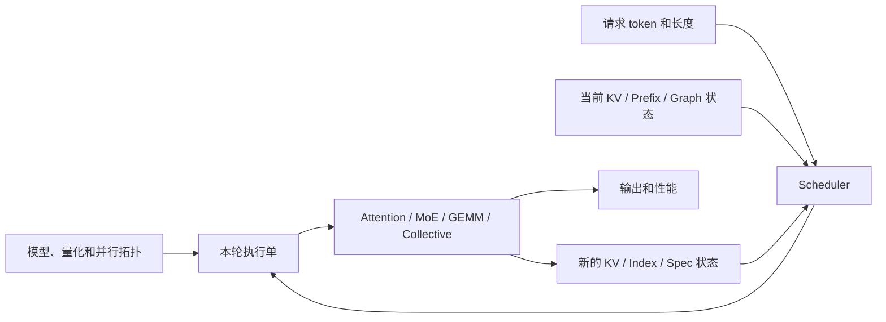
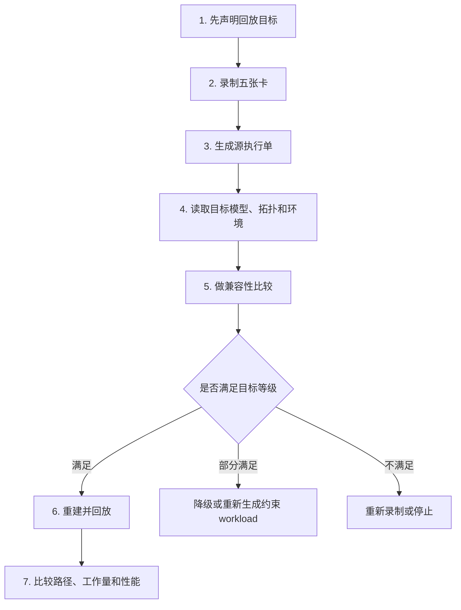

# 录制回放整体技术路线（V0.5 简单版）

> 日期：2026-07-30  
> 面向读者：希望先看懂“为什么要这样做、第一版怎么落地”的研发、测试和技术管理人员  
> 配套文档：[V0.5 详细版](录制回放_整体技术路线与实现设计_V0.5-详细版.md)  
> 建议阅读顺序：先看第 2 节四个例子，再看第 3～4 节的录制内容与实施步骤  
> 本文不修改 V0.4；V0.4 继续作为完整问题与源码证据库

---

## 0. 一句话说明我们要做什么

我们不是要把某次推理中所有 tensor 原样保存下来，也不是只记住它们的 shape。

我们要录制的是一份能够还原关键执行行为的“执行单”：

```text
什么模型和并行拓扑
+ 本轮实际执行了哪些请求和 token
+ 哪些 index/count/mask 决定了访问和工作量
+ 读写了哪一版 KV/cache 状态
+ 最终选择了哪些算子、通信和图
```

回放时先比较源环境和目标环境，再决定哪些内容可以直接使用、哪些需要重新计算、哪些只能按约束重新生成。

---

## 1. 先把一次推理看成一条完整流水线



这里最容易犯的错误，是直接从“请求 token”跳到“算子 shape”。

中间实际上还经过了：

1. Scheduler 决定本轮哪些请求可以执行；
2. Runner 生成 positions、lengths、block table、slot mapping 和 padding；
3. TP/DP/EP/PP/CP 决定每个 rank 真正拥有的权重、head、expert、layer 和 KV；
4. router、top-k、histogram、mask 等把普通数值变成执行决策；
5. NPU 根据 shape、格式、group、SoC 和版本选择 kernel、通信、tiling 和 graph；
6. 算子结果写回 cache，继续影响下一层和下一轮。

因此，真正需要泛化的是这条流水线，而不是一个孤立的 shape 公式。

---

## 2. 四个简单例子

### 2.1 例子一：shape 完全相同，MoE 工作量却完全不同

假设一轮只有 4 个 token，每个 token 选择 2 个 expert，共有 4 个 expert。

两次运行的 `topk_idx.shape` 都是 `[4,2]`。

运行 A：

```text
token0 -> expert 0,1
token1 -> expert 0,1
token2 -> expert 0,2
token3 -> expert 0,3

expert count = [4,2,1,1]
```

运行 B：

```text
token0 -> expert 2,3
token1 -> expert 2,3
token2 -> expert 2,3
token3 -> expert 2,3

expert count = [0,0,4,4]
```

如果 expert 0、1 在 rank 0，expert 2、3 在 rank 1：

```text
运行 A 的 rank workload = [6,2]
运行 B 的 rank workload = [0,8]
```

虽然 `topk_idx` 的 shape 完全一样，但两次运行的：

- All-to-All 发送量不同；
- 每个 rank 收到的 token 数不同；
- 每个 expert 的 GEMM `M` 不同；
- 链路热点和尾延迟不同；
- combine 的反向排列也不同。

所以性能回放至少要保存或重建：

```text
expert count
rank send/recv count
每 expert token 数
必要的 permutation/locality
```

不能只保存 `[4,2]`。

---

### 2.2 例子二：都是 128 卡，TP/DP 分法不同，执行完全不同

假设模型有 64 个 attention heads。

| 配置 | 并行分解 | 每 rank attention heads | 主要变化 |
|---|---|---:|---|
| 源配置 | 64 卡：TP=8、DP=8 | 8 | 基准 |
| 目标 A | 128 卡：TP=8、DP=16 | 8 | 权重/head 分片可能相同，但请求、KV 状态副本和 DP workload 变化 |
| 目标 B | 128 卡：TP=16、DP=8 | 4 | 权重、head、KV、collective 和 kernel shape 都变化 |
| 目标 C | 128 卡：TP=8、PP=2、DP=8 | 8 | 每个 rank 拥有的 layer 区间变化 |

这说明：

```text
总卡数相同或成倍增加
≠
本地 tensor shape 可以按比例缩放
```

在昇腾的部分执行路径中，DP 还会影响 padding。

例如本 rank 有 1001 个 token，其他 DP rank 最多有 1013 个 token：

```text
TP=8：
ceil(1013 / 8) × 8 = 1016

TP=16：
ceil(1013 / 16) × 16 = 1024
```

本 rank 自己仍然只有 1001 个有效 token，但实际参与 graph、通信或融合算子的 tensor 可能分别 padding 到 1016 和 1024。

所以录制时不能只写：

```text
world_size = 128
```

至少要写：

```text
TP/DP/EP/PP/CP/DCP
每个 group 的 rank 列表
本 rank 在每个 group 中的位置
rank 到机器的映射
本 rank 拥有的 head/expert/layer/KV 范围
```

---

### 2.3 例子三：slot mapping shape 相同，KV 地址却不同

假设 KV block size 是 16，当前 token 的 position 是 35：

```text
block 序号 = 35 // 16 = 2
block 内 offset = 35 % 16 = 3
```

两次运行的 block table shape 相同，但值不同：

```text
运行 A：block_table[2] = 10
slot = 10 × 16 + 3 = 163

运行 B：block_table[2] = 27
slot = 27 × 16 + 3 = 435
```

两次 `slot_mapping.shape` 都可以是 `[1]`，但实际写入的是完全不同的 KV 地址。

如果回放时只生成一个同 shape 的随机 slot：

- 可能读到别的请求的 KV；
- 可能覆盖错误 cache；
- 下一层和下一轮都会继续错误；
- 性能上也可能产生不同的 page locality。

因此 KV 类 tensor 必须和 cache version 一起处理：

```text
block table / slot mapping
+ KV cache 前态版本
+ 本轮写集合
+ KV cache 后态版本
```

---

### 2.4 例子四：shape 看起来可用，Graph 仍然不能直接回放

假设某次 graph 是针对下面的执行单捕获的：

```text
有效 token 数：1001
padding 后 token 数：1016
batch bucket：固定
输入 buffer 地址：A、B、C
TP group：8 ranks
```

目标环境即使也生成 `[1016,H]`，只要发生下面任意一种变化：

- buffer 地址或 alias 关系变化；
- TP group 变化；
- graph bucket 描述变化；
- 算子从 fused 路径切到 fallback；
- SoC、CANN、torch_npu 或插件版本变化；

原 graph 就不能直接被视为兼容。

所以 graph 不是“某个 shape 的缓存”，而是：

```text
bucket
+ 稳定 buffer 计划
+ 算子实现集合
+ 环境版本
```

的联合产物。

---

## 3. 第一版到底要录什么

建议把一次 trace 分成五张卡。

### 卡 1：拓扑卡

回答“每张卡在整个系统里负责什么”：

```text
物理卡数和节点
TP/DP/EP/PP/CP/DCP
ordered rank groups
rank-to-node placement
本 rank 的 head/expert/layer/KV ownership
```

### 卡 2：批次卡

回答“这一轮真正执行了什么”：

```text
request set
每请求 token 数
T_raw / T_padded
positions / lengths
block table / slot mapping
graph bucket
```

### 卡 3：决策卡

回答“为什么走了这条路、工作量如何分布”：

```text
sparse top-k index
MoE expert IDs/counts
rank send/recv split
mask / valid length
显式 if/else 结果
算子实现 ID
```

### 卡 4：状态卡

回答“本轮依赖了什么前态，又改变了什么后态”：

```text
KV cache version in/out
block table version
shared index version
spec accepted state
graph buffer version
```

### 卡 5：物理执行卡

回答“NPU 最终实际执行了什么”：

```text
logical/storage shape
dtype / ND / NZ
kernel / tiling / workspace
collective group and counts
graph key and addresses
SoC/CANN/torch_npu/framework versions
```

不是每次都要把五张卡中的所有大 tensor 保存下来。第一版先保存 metadata、小型决策 tensor 和状态版本；大 activation 根据目标选择保存、重算或合成。

---

## 4. 回放技术路线怎么走



### 第一步：先说清楚回放目标

| 目标 | 需要做到什么 |
|---|---|
| 数值精确 | 输出、路径、状态都尽量一致 |
| 路径一致 | 走相同 attention/MoE/graph/communication 路径 |
| 性能一致 | local shape、有效工作量、通信和物理计划可比 |
| 单算子测试 | 只保证关键算子 ABI 合法 |

性能测试通常首先追求“性能一致”，不必强行保存所有 activation 数值；但不能用随机数据破坏 routing、locality 和有效长度。

### 第二步：在四类位置插桩

```text
Scheduler 输出
Runner prepared batch
关键算子入口
NPU graph/tiling/communication
```

### 第三步：把 trace 转成执行单

执行单不只是日志，它要能回答：

```text
这个 shape 从哪里来？
这个 index 决定了什么？
这个 collective 属于哪个 group？
这个 cache 是哪一版？
这个 graph 为什么可以使用？
```

### 第四步：源配置和目标配置逐项比较

比较顺序建议是：

```text
拓扑
-> 本地 ownership
-> 本轮 batch
-> 决策 tensor 和分布
-> 状态
-> operator ABI
-> graph/tiling/communication
```

上游已经不兼容时，不要继续用最终 output shape 强行判定兼容。

### 第五步：按三种方式重建

| 方式 | 适用内容 |
|---|---|
| 原值回放 | slot、block、关键 index、状态转换 |
| 确定性重算 | shape 公式、local head、router/indexer 有完整输入时 |
| 约束合成 | 只做性能测试时的 expert count、合法 sparse locality、GEMM extent |

---

## 5. 一个简单的兼容性判断表

| 变化 | 第一判断 | 常见处理 |
|---|---|---|
| 只增加 DP，TP/PP 不变 | 不能直接认为兼容 | 检查请求分配、DP padding、cache 副本和 EP group |
| TP 改变 | 通常不兼容 | 重算 local shard/head/KV、collective 和 graph |
| EP 改变 | MoE 路径通常不兼容 | 重建 expert placement、split 和通信 |
| PP 改变 | rank 级 trace 不兼容 | 按新 layer ownership 重新切分 |
| token 值改变 | shape 可能仍兼容 | 检查 router/index/slot/mask 是否变化 |
| block table 值改变 | KV 地址不兼容 | 绑定 cache snapshot/version |
| shape 相同但 graph 地址改变 | graph 不兼容 | 重新捕获或使用 graph update |
| 只做单 GEMM 测试 | 可以放宽 | 合成合法 M/N/K 和 layout，明确标为单算子 |

---

## 6. 建议的第一版范围

第一版不要覆盖所有模型、所有算子。先打通四条最有价值的链：

```text
链 1：Scheduler -> T_raw/T_padded -> Graph
链 2：MoE top-k -> expert/rank count -> All-to-All -> Grouped GEMM
链 3：block table -> slot mapping -> KV cache write/read
链 4：TP/DP/EP/PP/CP -> local ownership -> collective/operator ABI
```

对应先做四类关键算子：

- Sparse/Shared-KV Attention；
- MoE Dispatch、All-to-All、Grouped GEMM、Combine；
- KV Cache Write/Copy/Page Attention；
- ACL Graph/NPUGraph 和关键 collective。

完成后，系统至少能够输出：

```text
源执行单
目标执行单
兼容 / 有条件兼容 / 不兼容
不兼容发生在哪一段
最少需要补录什么
```

---

## 7. 最终记住三件事

1. **Shape 是执行结果的一部分，不是全部原因。**
2. **index、count、slot、length、group 和 cache version 经常比大 activation 更值得录。**
3. **真正可泛化的是“执行单的生成与转换规则”，不是一个覆盖所有模型的 shape 公式。**

如果只记一个最简单的工作方法，可以记成：

```text
先录清楚谁在什么拓扑下执行了什么
再看哪些值决定了路径和工作量
最后才判断目标环境能不能复用
```
