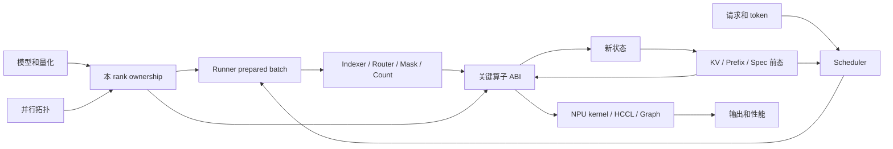
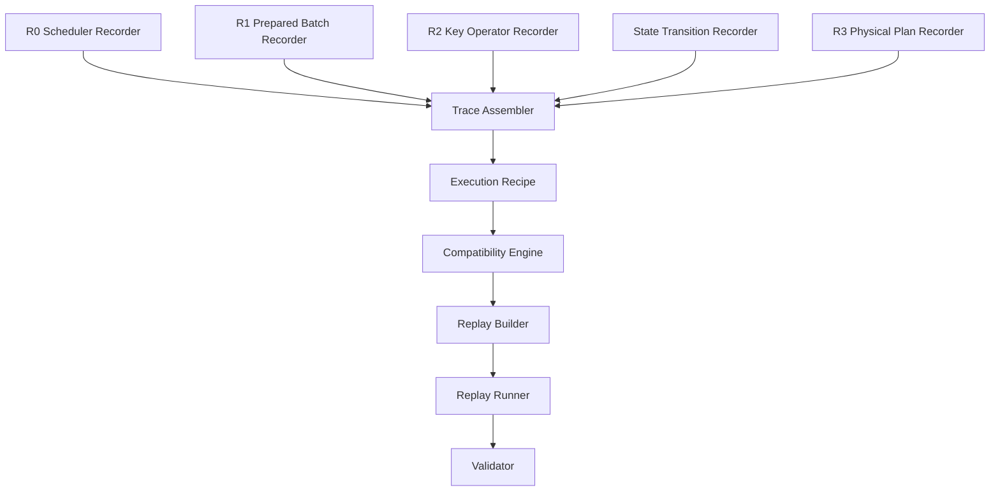
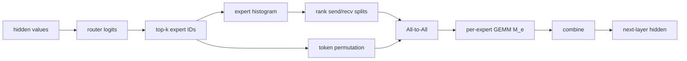
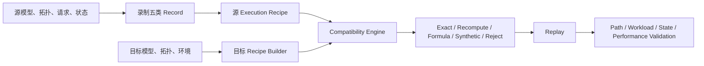

# 录制回放整体技术路线与实现设计（V0.5 详细版）

> 日期：2026-07-30  
> 技术栈：上游 vLLM + vLLM Ascend、SGLang NPU、sgl-kernel-npu、torch_npu/CANN  
> 重点模型：DeepSeek-V4 Pro/Flash、GLM-5.2、MiniMax-M3、Qwen3.7  
> 配套入门文档：[V0.5 简单版](录制回放_整体技术路线_V0.5-简单版.md)  
> 建议先通过简单版建立“执行单”的直观认识，再阅读本版的 recorder、schema 和兼容性算法  
> 证据底稿：V0.3-NPU、V0.4；本版重新组织技术路线，不修改旧文档

---

## 0. 执行摘要

录制回放当前最核心的误区，是把问题理解为：

> 找到所有 tensor shape 的变化规律，然后在目标模型或目标机器上重新生成这些 shape。

这不够，因为实际推理中有大量“外观相同、执行不同”的情况：

- `topk_idx` shape 相同，expert ID 分布不同，MoE 通信和 GEMM 工作量不同；
- `slot_mapping` shape 相同，slot 值不同，KV 实际读写地址不同；
- token 数相同，TP/DP 不同，padding、local head、collective 和融合路径不同；
- padded shape 相同，graph buffer 地址、group 或实现不同，graph 仍不可复用；
- 当前 layer 输出 shape 相同，写回的 KV/index 状态不同，下一 layer 或下一 step 分叉。

因此 V0.5 只保留一个中心模型：

> **一次推理不是一组 tensor，而是一份由模型、拓扑、请求和前态共同生成的“执行单”。**

执行单由五部分组成：

```text
TopologyRecord   拓扑和本 rank ownership
BatchRecord      本轮真实请求、token、length、slot 和 bucket
DecisionRecord   index、count、mask、branch 和 workload 分布
StateRecord      KV/index/spec/graph 的前后版本
PhysicalRecord   layout、kernel、tiling、workspace、collective 和 graph
```

技术路线就是：

```text
录制五类记录
-> 关联成源执行单
-> 根据目标配置生成目标执行单
-> 比较两份执行单
-> 直接复用、确定性重算、约束合成或判定不兼容
-> 回放并验证
```

---

## 1. 一次请求怎样变成真实 NPU 执行

### 1.1 四类输入

任何一次推理 step 都由四类根输入开始：

| 根输入 | 主要内容 |
|---|---|
| 模型根 | 模型结构、权重、量化、layer pattern、expert 配置 |
| 拓扑根 | TP/DP/EP/PP/CP/DCP、rank group、节点映射、P/D 角色 |
| 请求根 | token、position、prompt/decode/spec 配置、请求优先级 |
| 状态根 | KV、prefix、block table、shared index、graph buffer、版本 |

它们共同进入下面的流水线：



### 1.2 六个实际阶段

### 阶段 A：确定本 rank 拥有什么

模型参数和并行拓扑先确定：

```text
本 rank 的 weight shard
本地 Q/KV heads
本地 intermediate channel
本地 expert
本地 layer 区间
本地 KV/sequence slice
```

这一阶段发生在真正请求到来之前，但它决定后面所有算子的基础 shape。

### 阶段 B：Scheduler 选择本轮工作

Scheduler 根据 token budget、KV block、prefix、抢占和 speculative 状态，生成：

```text
本轮 request set
每请求 scheduled token 数
总 token 数
block 分配、copy、zero
spec token 和 accepted 状态
```

所以模型输入的 `[T,H]` 中，`T` 首先是调度结果，而不是模型配置直接给出的常量。

### 阶段 C：Runner 生成设备可用的批次

Runner 把调度对象变成：

```text
positions
seq/query/prefix lengths
query_start_loc
block table
slot mapping
T_raw / T_padded
ubatch
graph bucket
```

这里同时出现了逻辑 shape、padding shape、地址 tensor 和 graph descriptor。

### 阶段 D：数值成为执行决策

模型中的普通数值会经过：

```text
topk
histogram
cumsum
where
nonzero
mask
gather/scatter
```

转化成 expert ID、rank count、KV index、valid length、slot 或 guard。

这是“相同 shape、不同执行”的主要来源。

### 阶段 E：关键算子和物理计划

关键算子拿到的不是一个 shape，而是一组完整 ABI：

```text
tensor value and shape
dtype / stride / layout
index / length / count
scalar attrs
parallel group
state handle
```

NPU 再根据 SoC、CANN、torch_npu、插件版本、graph 状态等选择实现、tiling 和 workspace。

### 阶段 F：写回后态

KV、shared index、spec 状态和 graph buffer 会被更新。

本轮结果会成为下一 layer 或下一 step 的输入，因此 trace 必须能描述：

```text
state version in
本轮读写集合
state version out
后续 consumer
```

---

## 2. V0.5 的整体系统设计

### 2.1 不是“全量 dump”，而是五层 recorder



### R0：Scheduler Recorder

目的：保留本轮 workload 的来源。

```text
request set
scheduled tokens per request
new/resumed/preempted state
block allocation/copy/zero
spec/accepted tokens
DP replica and topology reference
```

### R1：Prepared Batch Recorder

目的：保留进入模型前已经确定的设备执行批次。

```text
T_raw / T_padded
B / B_padded
positions and cumulative lengths
block table / slot mapping
max_tokens_across_dp
graph BatchDescriptor
ubatch slices
```

### R2：Key Operator Recorder

目的：只在会放大差异的 sink 处记录完整 ABI。

第一版 sink：

```text
Sparse/Shared-KV Attention
MoE Dispatch / All-to-All / Grouped GEMM / Combine
KV Write / Copy / Page Attention
Quantized Linear / GMM
Collective
ACL Graph entry
```

### State Transition Recorder

目的：把一次算子回放升级为可继续执行的 layer/step 回放。

```text
KV cache version
block table version
shared index version
spec state version
graph buffer version
read/write set
```

### R3：Physical Plan Recorder

目的：解释为什么目标环境性能不同。

```text
logical/storage shape
ND/NZ and packing
kernel implementation
tiling/workspace
collective group/count/topology
graph key/address/alias
SoC/CANN/torch_npu/framework commits
```

### 2.2 Trace Assembler 做什么

Recorder 输出最初只是事件。Assembler 需要把它们关联成一份执行单：

```text
request
  -> scheduler step
  -> prepared batch
  -> layer
  -> key operator
  -> physical execution
  -> state transition
```

关联主键至少包括：

```text
trace_id
step_id
request_id
model_instance
layer_id
rank
parallel group IDs
operator sequence number
state version
```

### 2.3 Compatibility Engine 做什么

Compatibility Engine 不比较“文件是否一样”，而是回答：

```text
源执行单中的每个决定性字段
在目标环境中是否仍成立？
```

输出不是简单布尔值，而是：

```text
compatible
compatible_with_transform
compatible_with_constraints
incompatible
```

并给出具体断点，例如：

```text
TP 8 -> 16 导致 local KV heads 变化
EP group 8 -> 16 导致 MoE comm 从 AllGather 切换到 MC2
slot 值仍可使用，但目标 cache version 不匹配
shape 相同，但 graph input addresses 不匹配
```

### 2.4 Replay Builder 做什么

对每个字段选择一种策略：

| 策略 | 适用情况 |
|---|---|
| exact | 地址、状态或精确路径必须一致 |
| recompute | producer 和依赖完整，可以确定性重算 |
| formula | local shape、padding、layout 可由公式重建 |
| constrained synthetic | 只做性能回放，保留分布和工作量约束 |
| reject | 目标等级下无法保持关键语义 |

---

## 3. 贯穿例子一：MoE 为什么不能只录 shape

### 3.1 具体输入

4 个 token、4 个 expert、top-k=2。

```text
运行 A：
[[0,1],
 [0,1],
 [0,2],
 [0,3]]

运行 B：
[[2,3],
 [2,3],
 [2,3],
 [2,3]]
```

两者：

```text
topk_idx.shape = [4,2]
topk_idx.numel = 8
```

但：

```text
A expert histogram = [4,2,1,1]
B expert histogram = [0,0,4,4]
```

如果 expert `[0,1]` 属于 rank 0，`[2,3]` 属于 rank 1：

```text
A rank assignment count = [6,2]
B rank assignment count = [0,8]
```

### 3.2 影响怎样向下游传播



关键点：

- top-k shape 没变；
- 总 assignment 数没变；
- 但每 rank、每 expert 的有效 extent 变了；
- 通信链路和 grouped GEMM workload 变了；
- 下一层 hidden 数值继续变化，router 可能再次分叉。

### 3.3 源码证据

- [sgl-kernel-npu `normal_strategy.py` L469-L524](https://github.com/sgl-project/sgl-kernel-npu/blob/3479f4d99cd4e65a1cbe316f8bafc318014a4eb9/python/deep_ep/deep_ep/strategies/normal_strategy.py#L469-L524)
- [sgl-kernel-npu `normal_strategy.py` L571-L605](https://github.com/sgl-project/sgl-kernel-npu/blob/3479f4d99cd4e65a1cbe316f8bafc318014a4eb9/python/deep_ep/deep_ep/strategies/normal_strategy.py#L571-L605)

<table class="source-evidence">
<thead>
<tr><th align="right">行号</th><th align="left"><code>sgl-kernel-npu · normal_strategy.py</code></th></tr>
</thead>
<tbody>
<tr>
<td align="right" valign="top"><pre><code>469
470
471
473
474
475
494
495
496
521
523
524

571
573
574
583
585
586
600
601
602
603
604</code></pre></td>
<td valign="top"><pre><code class="language-python">num_local_tokens_per_expert = torch.histc(
    topk_idx, bins=num_experts, min=0, max=num_experts
)
input_splits = (
    num_local_tokens_per_expert.reshape(group_size, num_local_experts)
    .sum(axis=1)
output_splits = (
    num_global_tokens_per_local_expert.sum(axis=-1).cpu().numpy().tolist()
)
self._alltoall_layout = {
    "input_splits": input_splits,
    "output_splits": output_splits,

layout = self._alltoall_layout
input_splits = layout["input_splits"]
output_splits = layout["output_splits"]
permutated_tokens, reversed_local_mapping = torch_npu.npu_moe_token_permute(
    indices=topk_idx,
    num_out_tokens=topk_idx.numel(),
_, global_input_tokens, handle_a2a = self._async_all_to_all(
    permutated_tokens,
    output_splits,
    input_splits,
    self.group,</code></pre></td>
</tr>
</tbody>
</table>

这段代码直接给出：

```text
topk_idx 值
-> histogram
-> input/output splits
-> token permute
-> All-to-All
```

### 3.4 录制和回放结论

| 回放目标 | 最低需要 |
|---|---|
| 数值精确 | 原输入/hidden、router 权重和状态，或完整 top-k、weight、permutation |
| 路径一致 | expert ID、expert placement、通信实现、permutation |
| 性能一致 | expert count、rank split、每 expert `M_e`、必要 locality |
| 单算子 | 合法 split、grouped GEMM extent 和 layout |

性能回放可以不使用原 token，但合成数据必须满足相同的 count/split/GEMM 分布。

---

## 4. 贯穿例子二：64 卡到 128 卡怎样分析

### 4.1 不先看总卡数，先看拓扑分解

假设模型有 64 个 attention heads。

| 配置 | TP | DP | PP | 每 rank head | 结论 |
|---|---:|---:|---:|---:|---|
| Source 64 | 8 | 8 | 1 | 8 | 源执行单 |
| Target 128-A | 8 | 16 | 1 | 8 | 本地 head 可能相同，DP 请求和状态不同 |
| Target 128-B | 16 | 8 | 1 | 4 | local shape 和 TP collective 改变 |
| Target 128-C | 8 | 8 | 2 | 8 | layer ownership 和 pipeline 改变 |

这里还没有包含 EP、CP、DCP 和 rank placement；真实判断必须比较完整 `TopologyRecord`。

### 4.2 TP 改变本地 head 和 layer ownership

- [vLLM `model.py` L1411-L1447](https://github.com/vllm-project/vllm/blob/c44e191b014db0619bd51921e94c86b901ab952e/vllm/config/model.py#L1411-L1447)

<table class="source-evidence">
<thead>
<tr><th align="right">行号</th><th align="left"><code>vLLM · vllm/config/model.py</code></th></tr>
</thead>
<tbody>
<tr>
<td align="right" valign="top"><pre><code>1417
1418
1419
1420
1421
1422
1424
1425
1426

1439
1441
1442
1443
1444
1445
1446</code></pre></td>
<td valign="top"><pre><code class="language-python">total_num_kv_heads = self.get_total_num_kv_heads()
# If tensor parallelism is used, we divide the number of KV heads by
# the tensor parallel size. We will replicate the KV heads in the
# case where the number of KV heads is smaller than the tensor
# parallel size so each GPU has at least one KV head.
return max(1, total_num_kv_heads // parallel_config.tensor_parallel_size)
def get_num_attention_heads(self, parallel_config: ParallelConfig) -&gt; int:
    num_heads = self.model_arch_config.total_num_attention_heads
    return num_heads // parallel_config.tensor_parallel_size

total_num_hidden_layers = self.get_total_num_hidden_layers()
# the layout order is: DP x PP x TP
pp_rank = (
    parallel_config.rank // parallel_config.tensor_parallel_size
) % parallel_config.pipeline_parallel_size
pp_size = parallel_config.pipeline_parallel_size
start, end = get_pp_indices(total_num_hidden_layers, pp_rank, pp_size)</code></pre></td>
</tr>
</tbody>
</table>

所以 TP=8 改成 TP=16 后，至少要重新计算：

```text
local Q heads
local KV heads or replication rule
projection weight shard
KV cache head shape
TP collective extent
graph descriptor
```

PP 改变后还要重新计算：

```text
start_layer / end_layer
pipeline input/output
每 rank 权重和 cache 容量
```

### 4.3 DP 和 TP 共同改变昇腾 padding

假设：

```text
本 rank token 数 = 1001
所有 DP rank 最大 token 数 = 1013
```

则：

```text
TP=8  -> padded = ceil(1013/8)×8  = 1016
TP=16 -> padded = ceil(1013/16)×16 = 1024
```

- [vLLM Ascend `ascend_forward_context.py` L145-L225](https://github.com/vllm-project/vllm-ascend/blob/e462c42a4599bb17bae49775074eb6a9b094f528/vllm_ascend/ascend_forward_context.py#L145-L225)

<table class="source-evidence">
<thead>
<tr><th align="right">行号</th><th align="left"><code>vLLM Ascend · ascend_forward_context.py</code></th></tr>
</thead>
<tbody>
<tr>
<td align="right" valign="top"><pre><code>145
156
157
176
177
178
179
181
182
183
184

204
205
206
207
208
209
210
211
212
213
214
216
221
222
223
224
225</code></pre></td>
<td valign="top"><pre><code class="language-python">tp_world_size = get_tensor_model_parallel_world_size()
# TODO: remove it when torch_npu.npu_mm_reduce_scatter_base supports tp_size &gt;= 16.
mmrs_fusion = tp_world_size &lt;= 8
flash_comm_v1_enabled = enable_sp(vllm_config) and num_tokens is not None and num_tokens &gt; 1000
forward_context.mmrs_fusion = mmrs_fusion
forward_context.num_tokens = num_tokens
forward_context.flash_comm_v1_enabled = flash_comm_v1_enabled
forward_context.pad_size = 0
if forward_context.flash_comm_v1_enabled:
    pad_size = (tp_world_size - (num_tokens % tp_world_size)) % tp_world_size
    forward_context.pad_size = pad_size

dp_world_size = get_dp_group().world_size
if dp_world_size &gt; 1 and forward_context.dp_metadata is not None:
    dp_meta = forward_context.dp_metadata
    max_tokens_across_dp = dp_meta.num_tokens_across_dp_cpu.max().item()
    if forward_context.flash_comm_v1_enabled:
        padded_length = (max_tokens_across_dp + tp_world_size - 1) // tp_world_size * tp_world_size
        pad_size = padded_length - num_tokens
        forward_context.padded_length = padded_length
        forward_context.pad_size = pad_size
else:
    max_tokens_across_dp = num_tokens
forward_context.max_tokens_across_dp = max_tokens_across_dp
if num_tokens is not None:
    if num_actual_tokens is None:
        num_actual_tokens = num_tokens
    # NOTE: token num which need to pad to when mc2
    forward_context.padded_num_tokens = math.ceil(max_tokens_across_dp / tp_world_size) * tp_world_size</code></pre></td>
</tr>
</tbody>
</table>

这段证据还说明 TP 会改变 `mmrs_fusion`：

```text
TP <= 8  -> 可以满足当前 guard
TP >= 16 -> 当前代码关闭该融合
```

所以 Target 128-A 和 Target 128-B 即使总卡数相同，也可能进入不同 kernel/communication path。

### 4.4 这一例子的迁移流程

从 64 卡 trace 到目标配置：

1. 读取源 `TopologyRecord`；
2. 为目标配置重新计算 rank group 和 ownership；
3. 判断 local weight/head/layer/cache shape 是否变化；
4. 重放或重新分配请求，生成目标 R0/R1；
5. 根据目标 DP/TP 重算 padding；
6. 根据目标 EP/group 重建 MoE split；
7. 重新判断 graph、collective 和 fusion；
8. 只有得到目标执行单后，才进入算子回放。

---

## 5. 贯穿例子三：KV slot 为什么必须绑定状态

### 5.1 数字例子

```text
block_size = 16
position = 35
block_num = 2
block_offset = 3
```

运行 A：

```text
block_table[2] = 10
slot = 10×16+3 = 163
```

运行 B：

```text
block_table[2] = 27
slot = 27×16+3 = 435
```

两次 block table 和 slot tensor 的 shape 可以完全相同，但实际读写地址不同。

### 5.2 源码证据

- [vLLM Ascend `dsa_v1.py` L404-L423](https://github.com/vllm-project/vllm-ascend/blob/e462c42a4599bb17bae49775074eb6a9b094f528/vllm_ascend/attention/dsa_v1.py#L404-L423)

<table class="source-evidence">
<thead>
<tr><th align="right">行号</th><th align="left"><code>vLLM Ascend · attention/dsa_v1.py</code></th></tr>
</thead>
<tbody>
<tr>
<td align="right" valign="top"><pre><code>404
405
406
407
414
417
419
420
421
423</code></pre></td>
<td valign="top"><pre><code class="language-python">query_lens = query_start_loc[1:] - query_start_loc[:-1]
prefix_lens = seq_lens - query_lens
start_pos = (prefix_lens - int(window_size)).clamp(min=0)
visible_lens = seq_lens - start_pos
block_nums = pos // block_size
safe_nums = block_nums.clamp(min=0, max=int(block_table.shape[1]) - 1)
block_ids = torch.gather(block_table, 1, safe_nums)
slot_ids = (block_ids * block_size + block_offsets).to(torch.int32)
slot_ids = slot_ids.where(col_mask, torch.full_like(slot_ids, -1))
per_token_slots = torch.repeat_interleave(slot_ids, query_lens, dim=0, output_size=num_decode_tokens).unsqueeze(1)</code></pre></td>
</tr>
</tbody>
</table>

这里的因果链是：

```text
seq/query length + window
-> visible range
position / block size
-> block number and offset
block table value
-> block ID
-> slot ID
-> KV physical read/write
```

### 5.3 为什么只保存 slot 也不够

slot=163 只有在下面条件成立时才有相同含义：

```text
同一 cache allocation
同一 block size
同一 block table version
同一 KV cache version
同一 layout/compression
```

因此 KV 最小记录单元应当是一个状态转换：

```yaml
kv_transition:
  cache_version_in: 8321
  block_table_version: 410
  read_slots: "..."
  write_slots: "..."
  operation: "attention_and_cache_write"
  cache_version_out: 8322
```

---

## 6. 贯穿例子四：为什么相同 padded shape 也不代表 Graph 可复用

### 6.1 Graph 的真实身份

Graph 应理解为：

```text
BatchDescriptor
+ padded extents
+ operator implementation set
+ stable buffer addresses and aliasing
+ runtime mode
+ environment versions
```

而不是：

```text
graph_for_shape_[T,H]
```

### 6.2 源码证据

- [vLLM Ascend `acl_graph.py` L133-L165](https://github.com/vllm-project/vllm-ascend/blob/e462c42a4599bb17bae49775074eb6a9b094f528/vllm_ascend/compilation/acl_graph.py#L133-L165)
- [vLLM Ascend `acl_graph.py` L243-L266](https://github.com/vllm-project/vllm-ascend/blob/e462c42a4599bb17bae49775074eb6a9b094f528/vllm_ascend/compilation/acl_graph.py#L243-L266)

<table class="source-evidence">
<thead>
<tr><th align="right">行号</th><th align="left"><code>vLLM Ascend · compilation/acl_graph.py</code></th></tr>
</thead>
<tbody>
<tr>
<td align="right" valign="top"><pre><code>135
138
145
147
149
153
163
164
165

243
245
246
252
263
264
265
266</code></pre></td>
<td valign="top"><pre><code class="language-python">batch_descriptor = forward_context.batch_descriptor
if aclgraph_runtime_mode == CUDAGraphMode.NONE or aclgraph_runtime_mode != self.runtime_mode:
    return self.runnable(*args, **kwargs)
if batch_descriptor not in self.concrete_aclgraph_entries:
    self.concrete_aclgraph_entries[batch_descriptor] = ACLGraphEntry(batch_descriptor=batch_descriptor)
if entry.aclgraph is None:
    input_addresses = [x.data_ptr() for x in args if isinstance(x, torch.Tensor)]
    entry.input_addresses = input_addresses
    aclgraph = torch.npu.NPUGraph()

if self.is_debugging_mode:
    new_input_addresses = [x.data_ptr() for x in args if isinstance(x, torch.Tensor)]
    assert new_input_addresses == entry.input_addresses, (
logger.info_once("Replaying aclgraph")
need_sync = self.runtime_mode == CUDAGraphMode.FULL and not is_draft_eagle
if not self.enable_enpu and need_sync:
    torch.npu.current_stream().synchronize()
entry.aclgraph.replay()</code></pre></td>
</tr>
</tbody>
</table>

代码明确使用：

- `batch_descriptor` 选择 graph entry；
- runtime mode 决定是否退回普通 runnable；
- tensor `data_ptr()` 检查输入地址；
-不同模式决定 replay 前同步。

### 6.3 Graph 的兼容规则

| 变化 | 处理 |
|---|---|
| BatchDescriptor 不同 | 选择其他 entry 或重新捕获 |
| 地址或 alias 不同 | graph update 或重新捕获 |
| TP/EP group 不同 | 重新检查算子和 collective，通常重新捕获 |
| fused/fallback 改变 | 重新捕获 |
| SoC/CANN/torch_npu/plugin 改变 | 默认不直接复用，先重新验证 |

---

## 7. 从关键算子反推最少要录什么

### 7.1 为什么要从 sink 反推

全仓扫描 `view/reshape/slice/if/else` 会得到大量候选，但不能判断哪些真正影响性能或状态。

更有效的方法是从关键 sink 开始：

```text
这个算子实际需要什么？
这些输入由谁产生？
哪些值决定地址、工作量和分支？
哪些依赖跨 layer/step？
在哪一层切断并录制最便宜？
```

### 7.2 通用反推步骤

```text
1. 展开算子 ABI
2. 标记 payload / index / length / count / state / weight / group
3. 反查 producer
4. 展开 producer 的 if/else 和实现选择
5. 一直回溯到稳定配置、Scheduler 或前态
6. 按回放目标裁剪
```

### 7.3 四类关键 sink 的最小截面

| Sink | 不能只看 | 性能回放最少需要 |
|---|---|---|
| Sparse Attention | query/output shape | effective length、sparse index 分布/locality、block/cache layout、路径 |
| MoE | `[T,H]` 和 `[T,K]` | expert/rank counts、placement、splits、每 expert `M_e`、通信实现 |
| KV Write/Page Attention | slot shape | slot/block 值、cache version、block size、layout、读写集合 |
| Graph | padded shape | BatchDescriptor、实现集合、地址/alias、group、环境版本 |

### 7.4 选择录制层的原则

```text
值很小但决定大量工作
  -> 优先录制

值很大但只作为数值 payload
  -> 性能回放可考虑重算或合成

能够由小型输入确定重算
  -> 录 producer 输入

跨 step 改变状态
  -> 绑定 state version

目标环境会改变 producer 语义
  -> 不复用源结果，重新生成目标执行单
```

典型优先级：

```text
高：slot、block、top-k、count、length、group、branch、state version
中：scale、mask、permutation、graph descriptor、tiling key
低：只影响数值且可安全合成的大 activation
```

---

## 8. Trace 和执行单的数据结构

### 8.1 TraceManifest

```yaml
trace_manifest:
  schema_version: "0.5"
  trace_id: "..."
  replay_intent: "numerical|path|performance|operator"
  source:
    model: "..."
    quantization: "..."
    framework_commits:
      vllm: "c44e191b..."
      vllm_ascend: "e462c42a..."
      sglang: "1b9dfa14..."
      sgl_kernel_npu: "3479f4d9..."
    runtime:
      soc: "..."
      cann: "..."
      torch_npu: "..."
  records:
    topology: "topology.json"
    scheduler: "scheduler.jsonl"
    prepared_batch: "batch.jsonl"
    decisions: "decision.jsonl"
    operators: "operator.jsonl"
    states: "state.jsonl"
    physical: "physical.jsonl"
```

### 8.2 TopologyRecord

```yaml
topology:
  framework_semantics: "vllm-ascend"
  physical:
    world_size: 64
    nodes: 8
    ranks_per_node: 8
    rank_to_node: {}
  axes:
    replica_dp: 8
    tp: 8
    pp: 1
    pcp: 1
    dcp: 1
  groups:
    - id: "tp.0"
      kind: "tp"
      ordered_ranks: [0,1,2,3,4,5,6,7]
  local_ownership:
    rank: 0
    layer_range: [0, 60]
    q_head_range: [0, 8]
    kv_head_rule: "..."
    expert_ids: []
    weight_shards: {}
    kv_slice: {}
```

注意：不同框架对 DP/EP 的组织方式不同，统一 schema 要保存 `framework_semantics`，不能强行套用一个乘法公式。

### 8.3 BatchRecord

```yaml
batch:
  step_id: 42
  rank: 0
  requests:
    - {id: "r1", scheduled_tokens: 17, mode: "decode"}
  token_extents:
    raw: 1001
    max_across_dp: 1013
    padded: 1016
  positions_ref: "..."
  lengths_ref: "..."
  block_table_ref: "..."
  slot_mapping_ref: "..."
  graph_descriptor: "..."
```

### 8.4 DecisionRecord

```yaml
decision:
  step_id: 42
  layer: 17
  kind: "moe_routing"
  producer: "router_topk"
  exact_ref: null
  digest: "..."
  distribution:
    expert_counts: [4,2,1,1]
    rank_send_counts: [6,2]
    rank_recv_counts: [5,3]
  placement_version: 12
  selected_implementation: "all_to_all"
```

### 8.5 OperatorRecord

```yaml
operator:
  sequence: 918
  step_id: 42
  layer: 17
  rank: 0
  op: "grouped_gemm"
  implementation: "..."
  tensors:
    - role: "payload"
      logical_shape: [8, 4096]
      storage_shape: [8, 4096]
      dtype: "bf16"
      layout: "ND"
  attrs: {}
  group_id: "ep.0"
  state_dependencies: []
  physical_ref: "physical:918"
```

### 8.6 StateTransition

```yaml
state_transition:
  scope: "request.r1.layer17"
  versions_in:
    kv: 8321
    block_table: 410
  read_set: "..."
  write_set: "..."
  versions_out:
    kv: 8322
    block_table: 411
  consumers:
    - "request.r1.layer18"
    - "request.r1.step43"
```

---

## 9. 兼容性判断算法

### 9.1 判断顺序

必须从上游向下游比较：

```text
1. 模型和量化
2. 拓扑与 ownership
3. Scheduler workload
4. Prepared batch
5. Decision distribution
6. State versions
7. Operator ABI
8. Physical plan
```

如果第二步 TP 已经变化，就不应该拿源 local attention shape 直接与目标算子比较；目标 local shape 应先由新 topology 重新推导。

### 9.2 四级回放目标

| 等级 | 目标 | 关键要求 |
|---|---|---|
| L0 数值精确 | 输出和状态一致 | 输入、权重、index、cache、实现和数值环境 |
| L1 路径一致 | 控制路线一致 | branch、实现、group、index/placement、状态转移 |
| L2 性能一致 | 工作量和物理计划可比 | local shape、有效 length、count/split/locality、tiling、通信 |
| L3 单算子 | 合法执行目标算子 | ABI、layout、必要约束 |

这里使用 L0-L3，避免与验证实验编号混淆。

### 9.3 伪代码

```text
compare(source_recipe, target_config, level):
    target_topology = resolve_topology(target_config)
    target_ownership = derive_local_ownership(target_topology, model)

    topology_diff = compare_topology(
        source_recipe.topology,
        target_topology,
        level
    )

    target_batch = rebuild_or_replay_scheduler(
        source_recipe.scheduler,
        target_topology,
        target_resources
    )

    for sink in selected_key_operators:
        target_slice = reverse_slice(sink, level)
        for dependency in target_slice:
            choose exact / recompute / formula / synthetic / reject

    target_physical_plan = resolve_runtime_plan(
        target ABI,
        target topology,
        target environment
    )

    return verdict, transforms, missing_dependencies
```

### 9.4 常见转换

### 可以公式重算

```text
local attention heads
local KV heads/replication
PP layer range
padding extent
ND/NZ storage shape
```

前提是公式、版本和输入齐全。

### 可以确定性重算

```text
router top-k
sparse indexer
slot mapping
```

前提是 producer 输入、权重和前态存在。

### 可以约束合成

只用于 L2/L3：

```text
指定 expert count 的 routing
指定 rank split 的 communication input
指定 locality 的 sparse/block index
指定 M/N/K 和 layout 的 GEMM input
```

### 默认不能直接迁移

```text
不同 cache version 下的 slot
不同 ownership 下的 rank-local state
不同地址计划下的 graph
不同 collective group 下的物理通信 trace
```

---

## 10. 模型适配不应复制整套框架逻辑

### 10.1 公共核心

所有模型共享：

```text
Scheduler/Runner recorder
TopologyRecord
Operator ABI recorder
State versioning
Compatibility Engine
Replay Builder
Validator
```

### 10.2 模型 Adapter 只描述差异

Adapter 需要回答：

```text
哪些 layer 使用什么 attention
indexer/router 在哪里
哪些状态跨 layer 共享
关键 sink 是什么
模型特有 guard 是什么
```

| 模型 | Adapter 首要内容 |
|---|---|
| DeepSeek-V4 Pro/Flash | C4/C128/SWA pattern、Lightning Indexer、compressed cache、MoE comm |
| GLM-5.2 | SFA/DSA、shared indexer、CP local length、跨层 index state |
| MiniMax-M3 | sparse/dense layer map、TP local heads、index cache、MoE/dense 分支 |
| Qwen3.7 | 以实际 vLLM/SGLang runtime trace 建立 operator map，不假设未公开内部实现 |

### 10.3 Adapter 输出

```yaml
model_adapter:
  architecture: "..."
  layer_patterns: {}
  key_sinks: []
  decision_producers: []
  cross_layer_states: []
  guards: []
  weight_partition_rules: []
```

这样新增模型时，不需要重新开发 recorder 和 replay engine，只补充关键算子映射与状态规则。

---

## 11. 第一版落地方案

### 11.1 Milestone 0：先能看见完整一轮

目标：把同一个 step 的 R0、R1、关键 R2 和状态串起来。

产物：

```text
trace_id / step_id / layer_id / rank
SchedulerOutput 摘要
PreparedBatch 摘要
关键算子序列
state in/out
```

暂时不做跨拓扑回放。

### 11.2 Milestone 1：打通四条主链

```text
Scheduler -> padding -> Graph
MoE top-k -> split -> All-to-All -> GMM
block table -> slot -> KV
Topology -> local ownership -> collective
```

每条链都要能够输出：

```text
源节点
中间转换
关键 sink
需要录制的最小字段
```

### 11.3 Milestone 2：兼容性报告

输入：

```text
source trace
target model config
target topology
target NPU environment
desired replay level
```

输出示例：

```yaml
verdict: "compatible_with_transform"
level: "L2"
transforms:
  - "recompute local heads for TP=16"
  - "rebuild padding from max_tokens_across_dp"
  - "regenerate expert/rank splits"
invalidated:
  - "source ACL graph"
missing:
  - "target rank-to-node placement"
```

### 11.4 Milestone 3：Replay Builder

先支持：

```text
原 topology 的原值回放
相同 TP/PP、DP 扩展下的受约束回放
单算子 constrained workload
不兼容时自动降级
```

TP、EP、PP 变化后的完整模型级转换放到后续，因为它们需要权重重分片、状态重映射和通信重建。

---

## 12. 验证方案

### 12.1 先验证因果链，再验证性能

每个实验只改变一个源变量：

| 实验 | 固定 | 改变 | 预期观察 |
|---|---|---|---|
| M1 | `[T,K]`、拓扑 | expert ID 分布 | histogram、split、GMM `M_e` 改变 |
| M2 | expert count | expert→rank placement | rank split 和链路改变 |
| T1 | 总卡数 | TP/DP 分解 | local head、padding、collective/branch 改变 |
| T2 | group size | rank-to-node placement | ABI 相同但通信性能改变 |
| D1 | 本 rank token | 其他 DP rank token | `max_tokens_across_dp` 和 padding 改变 |
| K1 | block table shape | block table 值 | slot 和 cache 地址改变 |
| G1 | padded shape | graph input address | graph 地址校验失败或需 update |
| S1 | 当前输入 | KV version | 下游结果和状态转移改变 |

### 12.2 每轮采集的比较指标

```text
SchedulerOutput digest
Topology and ownership digest
T_raw / T_padded
operator implementation sequence
expert/rank counts
slot/block digest
state version transitions
logical/storage shapes
tiling/workspace
collective group and counts
kernel/communication latency
end-to-end latency
```

### 12.3 通过标准

### L0

```text
输出误差满足数值标准
状态版本和读写集合一致
```

### L1

```text
branch 和 implementation sequence 一致
关键 index/placement/state 语义一致
```

### L2

```text
local ABI 一致或经过已声明转换
有效 length/count/split/locality 一致
kernel、tiling 和通信 workload 可比
性能差异落在预设容差
```

### L3

```text
算子 ABI 合法
约束满足
结果明确标记为 microbenchmark
```

---

## 13. 需要保留的边界和未知项

当前可以从 Python 框架代码确定：

```text
大部分 logical/local shape
显式 branch
index/count/split 的生成
parallel group
graph key 和地址依赖
部分 storage layout
```

仍需通过运行时采集或实验确定：

```text
CANN 内部 tiling key 的完整决定因素
workspace 选择
算子内部数据依赖分支
不同 SoC 的真实 kernel fallback
HCCL 拓扑与链路调度
动态 EPLB/expert placement 的长期状态
模型未公开实现细节
```

报告中应区分：

```text
源码已证明
运行实验已证明
合理推断
尚待验证
```

不能把“能够合成一个合法 workload”描述成“已经复现原模型路径”。

---

## 14. 最终技术路线

第一版不追求一个覆盖所有模型和卡数的通用 shape 公式。

最终系统围绕一份执行单工作：



落地时始终遵守三个顺序：

1. **先确定目标拓扑和本 rank ownership；**
2. **再重建本轮 batch、决策 tensor 和状态；**
3. **最后判断关键算子与物理计划能否复用。**

这条路线能够同时解释：

- tensor 值和 shape 如何影响完整推理；
- 如何从关键算子反推出真正需要录制的内容；
- TP/DP/EP/PP/CP、卡数和显存如何进入执行；
- 为什么相同 shape 仍可能走不同路径；
- 如何在数值、路径、性能和单算子目标之间做成本取舍。

它的最终交付物不是一份不断追加问题的清单，而是四个可执行组件：

```text
Execution Recipe
Compatibility Report
Replay Package
Validation Report
```
