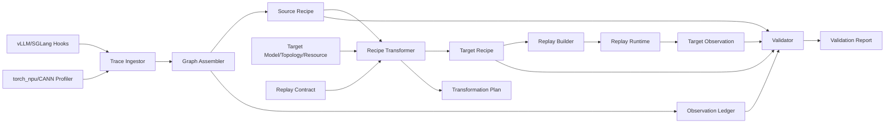

# 大模型推理录制回放：系统化设计、字段定义与源码证据（V0.8）

> 日期：2026-08-03  
> 技术栈：上游 vLLM + vLLM Ascend、SGLang NPU、sgl-kernel-npu、torch_npu/CANN/HCCL  
> 目标模型：DeepSeek-V4 Pro/Flash、GLM-5.2、Qwen3.7、MiniMax-M3 等模型适配  
> 前置文档：[V0.7 系统化方法论与工程架构](录制回放_系统化方法论与工程架构_V0.7.md)  
> 本文不修改 V0.7；V0.8 重点补齐字段注释、字段来源和真实代码证据。

---

## 0. 阅读说明与核心结论

V0.8 使用一条完整主线组织全文：

```text
真实框架代码产生什么
-> 录制系统抽取什么字段
-> 字段如何进入 Execution Recipe
-> 目标模型/拓扑如何转换
-> Runtime 如何回放
-> Profiler 如何验证
```

系统中的信息严格分成三类：

| 对象 | 通俗解释 | 跨环境处理 |
|---|---|---|
| Execution Recipe | 为什么执行这些工作：workload、决策、状态和依赖 | 满足约束时转换 |
| Physical Binding | 这些工作如何落到 rank、kernel、graph、format 和通信组 | 通常重新生成 |
| Observation Ledger | Profiler 实际测到的时间、计数和证据 | 只作验证或校准 |

例如，rank0 某次 all-reduce 的 3 ms 是 Observation；collective 的 group、payload、split 和前驱依赖属于 Recipe；目标机使用的 HCCL、stream 和 kernel 属于 Binding。三者不能互换。

### 0.1 固定的源码版本

| 仓库 | Commit | 作用 |
|---|---|---|
| [vLLM](https://github.com/vllm-project/vllm/tree/c44e191b014db0619bd51921e94c86b901ab952e) | `c44e191b014db0619bd51921e94c86b901ab952e` | Scheduler、请求/KV 元数据 |
| [vLLM Ascend](https://github.com/vllm-project/vllm-ascend/tree/e462c42a4599bb17bae49775074eb6a9b094f528) | `e462c42a4599bb17bae49775074eb6a9b094f528` | NPU batch、TP、MoE、KV、Graph、量化 |
| [SGLang](https://github.com/sgl-project/sglang/tree/1b9dfa14e66b617ed53270164549d59290b1f7c8) | `1b9dfa14e66b617ed53270164549d59290b1f7c8` | NPU top-k 与模型 backend |
| [sgl-kernel-npu](https://github.com/sgl-project/sgl-kernel-npu/tree/3479f4d99cd4e65a1cbe316f8bafc318014a4eb9) | `3479f4d99cd4e65a1cbe316f8bafc318014a4eb9` | DeepEP expert/rank split |
| [Ascend PyTorch](https://github.com/Ascend/pytorch/tree/10fe1622631286665f15d84951d53df7840e6ead) | `10fe1622631286665f15d84951d53df7840e6ead` | NPU format、storage shape、NPUGraph |

代码证据只证明这些固定版本中的行为。框架升级后需要重新扫描代码和运行 Adapter 测试。

---

## 1. 从框架代码建立因果链

### 1.1 Scheduler 决定本轮 workload

上游 vLLM 的 `SchedulerOutput` 明确包含新请求、缓存请求、每请求 token 数、总 token 数、spec token 和公共 prefix block。

- [vLLM `output.py` L192-L219](https://github.com/vllm-project/vllm/blob/c44e191b014db0619bd51921e94c86b901ab952e/vllm/v1/core/sched/output.py#L192-L219)

<table class="source-evidence">
<thead><tr><th align="right">行号</th><th align="left"><code>vLLM · SchedulerOutput</code></th></tr></thead>
<tbody><tr>
<td align="right" valign="top"><pre><code>192
193
194
197
198
201
203
204
205
206
207
208
209
212
217
218
219</code></pre></td>
<td valign="top"><pre><code class="language-python">@dataclass
class SchedulerOutput:
    # list of the requests that are scheduled for the first time.
    scheduled_new_reqs: list[NewRequestData]
    # list of the requests that have been scheduled before.
    scheduled_cached_reqs: CachedRequestData

    # req_id -&gt; num_scheduled_tokens
    # Number of tokens scheduled for each request.
    num_scheduled_tokens: dict[str, int]
    # Total number of tokens scheduled for all requests.
    # Equal to sum(num_scheduled_tokens.values())
    total_num_scheduled_tokens: int
    # req_id -&gt; spec_token_ids
    scheduled_spec_decode_tokens: dict[str, list[int]]
    # Number of common prefix blocks for all requests in each KV cache group.
    # This can be used for cascade attention.
    num_common_prefix_blocks: list[int]</code></pre></td>
</tr></tbody></table>

**源码事实：** activation 第一维 `T` 首先来自 Scheduler 本轮选择，不是模型 config 的固定常量。

**设计结论：** WorkloadRecord 应在上游 vLLM/SGLang Scheduler 录制；只看 NPU kernel 的最终 shape 会丢失 request 和 token 来源。

### 1.2 runner 决定 raw/padded token、DP 协调和 graph descriptor

vLLM Ascend 从 `SchedulerOutput` 读取 token，调用 `_determine_batch_execution_and_padding`，再得到 BatchDescriptor、DP token 信息、padded token 和 ubatch。

- [vLLM Ascend `model_runner_v1.py` L1833-L1897](https://github.com/vllm-project/vllm-ascend/blob/e462c42a4599bb17bae49775074eb6a9b094f528/vllm_ascend/worker/model_runner_v1.py#L1833-L1897)

<table class="source-evidence">
<thead><tr><th align="right">行号</th><th align="left"><code>vLLM Ascend · batch/padding</code></th></tr></thead>
<tbody>
<tr>
<td align="right" valign="top"><pre><code>1833
1834
1835
1842
1843
1853
1864
1865
1866
1867
1868
1869
1870
1871
1872
1873
1874
1875
1876
1877
1878
1890
1891
1892</code></pre></td>
<td valign="top"><pre><code class="language-python">num_reqs = self.input_batch.num_reqs
req_ids = self.input_batch.req_ids
tokens = [scheduler_output.num_scheduled_tokens[i] for i in req_ids]
num_scheduled_tokens_np = np.array(tokens, dtype=np.int32)
max_num_scheduled_tokens = int(num_scheduled_tokens_np.max())
num_tokens_unpadded = scheduler_output.total_num_scheduled_tokens

(
    cudagraph_mode,
    batch_desc,
    should_ubatch,
    num_tokens_across_dp,
    cudagraph_stats,
) = self._determine_batch_execution_and_padding(
    num_tokens=num_tokens_unpadded,
    num_reqs=num_reqs,
    num_scheduled_tokens_np=num_scheduled_tokens_np,
    max_num_scheduled_tokens=max_num_scheduled_tokens,
    use_cascade_attn=cascade_attn_prefix_lens is not None,
    force_eager=self.model_config.enforce_eager,
    num_encoder_reqs=len(scheduler_output.scheduled_encoder_inputs),
)

num_tokens_padded = batch_desc.num_tokens
num_reqs_padded = batch_desc.num_reqs if batch_desc.num_reqs is not None else num_reqs
ubatch_slices, ubatch_slices_padded = maybe_create_ubatch_slices(...)</code></pre></td>
</tr>
</tbody></table>

**源码事实：** raw tokens、padded tokens、DP token 信息、graph mode、BatchDescriptor 和 ubatch 属于同一执行准备过程。

**设计结论：** 不能只保存 `num_tokens_padded`；需要同时保存 raw extent、padding 来源、DP 协调结果、BatchDescriptor 和 ubatch。

### 1.3 TP 产生 rank-local head 和投影 shape

- [vLLM Ascend `minimax_m3.py` L128-L140](https://github.com/vllm-project/vllm-ascend/blob/e462c42a4599bb17bae49775074eb6a9b094f528/vllm_ascend/models/minimax_m3/minimax_m3.py#L128-L140)

<table class="source-evidence">
<thead><tr><th align="right">行号</th><th align="left"><code>vLLM Ascend · TP ownership</code></th></tr></thead>
<tbody><tr>
<td align="right" valign="top"><pre><code>128
129
130
131
132
133
134
135
136
137
138
139
140</code></pre></td>
<td valign="top"><pre><code class="language-python">tp_size = get_tensor_model_parallel_world_size()
self.total_num_heads = num_heads
assert self.total_num_heads % tp_size == 0
self.num_heads = self.total_num_heads // tp_size
self.total_num_kv_heads = num_kv_heads
if self.total_num_kv_heads &gt;= tp_size:
    assert self.total_num_kv_heads % tp_size == 0
else:
    assert tp_size % self.total_num_kv_heads == 0
self.num_kv_heads = max(1, self.total_num_kv_heads // tp_size)
self.head_dim = head_dim or (hidden_size // self.total_num_heads)
self.q_size = self.num_heads * self.head_dim
self.kv_size = self.num_kv_heads * self.head_dim</code></pre></td>
</tr></tbody></table>

**源码事实：** TP world size 是本地 tensor ABI 的直接生产者。

**设计结论：** TopologySpec 必须包含 global config、process group 和 RankOwnership。跨 TP 回放要重新推导 local shape，不能复制源 rank-local trace。

### 1.4 router 值、配置和 guard 共同决定 MoE 路径

SGLang NPU 根据 scoring function、grouped top-k、bias 等条件选择实现；之后将 logical expert ID 映射到 physical ID，并调用 expert distribution recorder。

- [SGLang `moe/topk.py` L46-L132](https://github.com/sgl-project/sglang/blob/1b9dfa14e66b617ed53270164549d59290b1f7c8/python/sglang/srt/hardware_backend/npu/moe/topk.py#L46-L132)

<table class="source-evidence">
<thead><tr><th align="right">行号</th><th align="left"><code>SGLang NPU · MoE top-k</code></th></tr></thead>
<tbody>
<tr>
<td align="right" valign="top"><pre><code>46
47
48
54
55
56
64
65
66
69
70
71
72
73
74</code></pre></td>
<td valign="top"><pre><code class="language-python"># sqrtsoftplus (DSV4 noaux_tc): top-k over (scores + bias); weights from
# un-biased scores. The custom op fuses softplus/sqrt/topk/gather/norm/cast.
if topk_config.scoring_func == "sqrtsoftplus":
    ...
    topk_weights, topk_ids, _ = torch.ops.custom.npu_moe_gating_top_k(
        x=router_logits.to(torch.float32),
        k=topk_config.top_k,
        ...
        routed_scaling_factor=float(routed_scaling_factor),
        norm_type=2,
    )

# Fast path: simple top-k without grouped routing and bias
elif not use_grouped_topk and correction_bias is None:
    topk_weights, topk_ids, _ = torch.ops.npu.npu_moe_gating_top_k_softmax(
        router_logits,
        k=topk_config.top_k,
    )</code></pre></td>
</tr>
<tr>
<td align="right" valign="top"><pre><code>127
128
129
130
132</code></pre></td>
<td valign="top"><pre><code class="language-python">if expert_location_dispatch_info is not None:
    topk_ids = topk_ids_logical_to_physical(topk_ids, expert_location_dispatch_info)
get_global_expert_distribution_recorder().on_select_experts(topk_ids=topk_ids)
capture_routed_experts_if_allowed(topk_config, layer_id, topk_ids)

return StandardTopKOutput(topk_weights, topk_ids, router_logits)</code></pre></td>
</tr>
</tbody></table>

**源码事实：** router logits 的值决定 top-k ID；配置/guard 决定实现；placement 将 logical ID 转为 physical ID。

**设计结论：** DecisionRecord 要区分 router 输入摘要、logical/physical IDs、guard、implementation 和 placement version。SGLang 已有 distribution recorder，可直接借鉴。

### 1.5 top-k ID 进一步产生 rank split 和 local expert workload

- [sgl-kernel-npu `normal_strategy.py` L462-L527](https://github.com/sgl-project/sgl-kernel-npu/blob/3479f4d99cd4e65a1cbe316f8bafc318014a4eb9/python/deep_ep/deep_ep/strategies/normal_strategy.py#L462-L527)

<table class="source-evidence">
<thead><tr><th align="right">行号</th><th align="left"><code>sgl-kernel-npu · expert histogram → split</code></th></tr></thead>
<tbody>
<tr>
<td align="right" valign="top"><pre><code>462
463
464
465
466
469
470
471
473
474
475
478
481
482
483
490
491
492
494
495
496
498</code></pre></td>
<td valign="top"><pre><code class="language-python">"""Get dispatch layout using alltoall"""
group = self.group
group_size = self.group_size
num_local_experts = num_experts // group_size
ep_rank = self.rank

num_local_tokens_per_expert = torch.histc(
    topk_idx, bins=num_experts, min=0, max=num_experts
)

input_splits = (
    num_local_tokens_per_expert.reshape(group_size, num_local_experts)
    .sum(axis=1).cpu().numpy().tolist()
)

num_global_tokens_per_expert = self._gather_along_first_dim(
    num_local_tokens_per_expert, group
).reshape(group_size, num_experts)

num_global_tokens_per_local_expert = num_global_tokens_per_expert[
    :, local_expert_indices[0] : local_expert_indices[-1] + 1
]

output_splits = (
    num_global_tokens_per_local_expert.sum(axis=-1).cpu().numpy().tolist()
)

num_tokens_per_expert = num_global_tokens_per_local_expert.sum(axis=0)</code></pre></td>
</tr>
<tr>
<td align="right" valign="top"><pre><code>521
522
523
524
525
526
527</code></pre></td>
<td valign="top"><pre><code class="language-python">self._alltoall_layout = {
    "num_local_experts": num_local_experts,
    "input_splits": input_splits,
    "output_splits": output_splits,
    "num_global_tokens_per_local_expert": num_global_tokens_per_local_expert,
    "global_tokens_indices": global_tokens_indices,
}</code></pre></td>
</tr>
</tbody></table>

**源码事实：** 同一个 `topk_idx.shape` 下，ID 分布不同会改变 input/output splits、每 expert token 数和 GMM 有效 `M`。

**设计结论：** MoE 性能回放至少要记录或重建 `expert_counts + splits + placement`，不能只保存 `[T, top_k]`。

### 1.6 block-table 值决定真实 KV slot

- [vLLM Ascend `dsa_v1.py` L404-L426](https://github.com/vllm-project/vllm-ascend/blob/e462c42a4599bb17bae49775074eb6a9b094f528/vllm_ascend/attention/dsa_v1.py#L404-L426)

<table class="source-evidence">
<thead><tr><th align="right">行号</th><th align="left"><code>vLLM Ascend · block table → slot</code></th></tr></thead>
<tbody><tr>
<td align="right" valign="top"><pre><code>404
405
406
407
411
412
413
414
417
418
419
420
421
423
424
426</code></pre></td>
<td valign="top"><pre><code class="language-python">query_lens = query_start_loc[1:] - query_start_loc[:-1]
prefix_lens = seq_lens - query_lens
start_pos = (prefix_lens - int(window_size)).clamp(min=0)
visible_lens = seq_lens - start_pos

cols = torch.arange(index_width, device=start_pos.device)
col_mask = cols[None, :] &lt; visible_lens[:, None]
pos = start_pos[:, None] + cols[None, :]
block_nums = pos // block_size
safe_nums = block_nums.clamp(min=0, max=int(block_table.shape[1]) - 1)
block_offsets = pos % block_size
block_ids = torch.gather(block_table, 1, safe_nums)
slot_ids = (block_ids * block_size + block_offsets).to(torch.int32)
slot_ids = slot_ids.where(col_mask, torch.full_like(slot_ids, -1))

per_token_slots = torch.repeat_interleave(slot_ids, query_lens, dim=0, output_size=num_decode_tokens).unsqueeze(1)
per_token_lens = torch.repeat_interleave(visible_lens, query_lens, dim=0, output_size=num_decode_tokens)

return per_token_slots, per_token_lens</code></pre></td>
</tr></tbody></table>

**源码事实：** 相同 `block_table.shape` 不代表相同 slot；slot 由 length、window、block size 和 block-table 值共同决定。

**设计结论：** KV 回放必须记录 StateTransition、block-table version、slot/index 摘要与 cache snapshot 关系。

### 1.7 collective ABI 包含 split、group、stream/event 和 async 语义

- [vLLM Ascend `comm_utils.py` L34-L70](https://github.com/vllm-project/vllm-ascend/blob/e462c42a4599bb17bae49775074eb6a9b094f528/vllm_ascend/ops/fused_moe/comm_utils.py#L34-L70)

<table class="source-evidence">
<thead><tr><th align="right">行号</th><th align="left"><code>vLLM Ascend · all-to-all</code></th></tr></thead>
<tbody><tr>
<td align="right" valign="top"><pre><code>34
35
37
38
39
40
41
42
43
44
46
47
49
50
51
52
53
54
55
56
57
58
59
60
62
63
64
65
66
67
68
69
70</code></pre></td>
<td valign="top"><pre><code class="language-python">def async_all_to_all(input_, output_split_sizes, input_split_sizes, group, event=None):
    if output_split_sizes is None:
        a2a_out = torch.empty_like(input_)
    else:
        # Unequal split (all2all-v)
        a2a_out = input_.new_empty(
            size=[sum(output_split_sizes)] + list(input_.size()[1:]),
            dtype=input_.dtype,
            device=torch.npu.current_device(),
        )

    if event:
        # multi stream wait event
        if COMM_STREAM is None:
            COMM_STREAM = torch_npu.npu.Stream(device=torch.npu.current_device())
        with torch_npu.npu.stream(COMM_STREAM):
            event.wait()
            handle = dist.all_to_all_single(
                a2a_out,
                input_.contiguous(),
                output_split_sizes=output_split_sizes,
                input_split_sizes=input_split_sizes,
                group=group,
                async_op=True,
            )
    else:
        handle = dist.all_to_all_single(
            a2a_out,
            input_.contiguous(),
            output_split_sizes=output_split_sizes,
            input_split_sizes=input_split_sizes,
            group=group,
            async_op=True,
        )
    return input_, a2a_out, handle</code></pre></td>
</tr></tbody></table>

**源码事实：** collective 不是“一个输入 shape”；split vector、group、stream/event 和 async 属性都决定执行。

**设计结论：** CollectiveIntent 保存 group、split 和 payload；CollectiveInstance 保存 stream、event 和 per-rank timeline。

### 1.8 Graph 由 descriptor、mode、地址和同步关系共同约束

- [vLLM Ascend `acl_graph.py` L133-L165](https://github.com/vllm-project/vllm-ascend/blob/e462c42a4599bb17bae49775074eb6a9b094f528/vllm_ascend/compilation/acl_graph.py#L133-L165)
- [vLLM Ascend `acl_graph.py` L243-L266](https://github.com/vllm-project/vllm-ascend/blob/e462c42a4599bb17bae49775074eb6a9b094f528/vllm_ascend/compilation/acl_graph.py#L243-L266)

<table class="source-evidence">
<thead><tr><th align="right">行号</th><th align="left"><code>vLLM Ascend · ACL Graph</code></th></tr></thead>
<tbody>
<tr>
<td align="right" valign="top"><pre><code>133
134
135
136
138
145
147
149
151
153
163
164
165</code></pre></td>
<td valign="top"><pre><code class="language-python">def __call__(self, *args, **kwargs):
    forward_context = get_forward_context()
    batch_descriptor = forward_context.batch_descriptor
    aclgraph_runtime_mode = forward_context.cudagraph_runtime_mode

    if aclgraph_runtime_mode == CUDAGraphMode.NONE or aclgraph_runtime_mode != self.runtime_mode:
        return self.runnable(*args, **kwargs)

    if batch_descriptor not in self.concrete_aclgraph_entries:
        self.concrete_aclgraph_entries[batch_descriptor] = ACLGraphEntry(batch_descriptor=batch_descriptor)

    entry = self.concrete_aclgraph_entries[batch_descriptor]

    if entry.aclgraph is None:
        input_addresses = [x.data_ptr() for x in args if isinstance(x, torch.Tensor)]
        entry.input_addresses = input_addresses
        aclgraph = torch.npu.NPUGraph()</code></pre></td>
</tr>
<tr>
<td align="right" valign="top"><pre><code>243
245
246
247
248
249
250
252
262
263
264
265
266</code></pre></td>
<td valign="top"><pre><code class="language-python">if self.is_debugging_mode:
    new_input_addresses = [x.data_ptr() for x in args if isinstance(x, torch.Tensor)]
    assert new_input_addresses == entry.input_addresses, (
        f"Input addresses for aclgraphs are different "
        f"during replay. Expected {entry.input_addresses}, "
        f"got {new_input_addresses}"
    )

logger.info_once("Replaying aclgraph")
is_draft_eagle = _EXTRA_CTX.is_draft_model and self.use_eagle
need_sync = self.runtime_mode == CUDAGraphMode.FULL and not is_draft_eagle
if not self.enable_enpu and need_sync:
    torch.npu.current_stream().synchronize()
entry.aclgraph.replay()</code></pre></td>
</tr>
</tbody></table>

**源码事实：** 相同 padded shape 不等于相同 graph；BatchDescriptor、runtime mode、地址和同步语义都参与。

**设计结论：** GraphBinding 属于 Physical Binding，跨环境默认重新捕获或重新验证。

### 1.9 量化和 NPU format 会改变权重与 storage ABI

- [vLLM Ascend `w8a8_dynamic.py` L126-L151](https://github.com/vllm-project/vllm-ascend/blob/e462c42a4599bb17bae49775074eb6a9b094f528/vllm_ascend/quantization/methods/w8a8_dynamic.py#L126-L151)
- [vLLM Ascend `w8a8_dynamic.py` L185-L209](https://github.com/vllm-project/vllm-ascend/blob/e462c42a4599bb17bae49775074eb6a9b094f528/vllm_ascend/quantization/methods/w8a8_dynamic.py#L185-L209)

<table class="source-evidence">
<thead><tr><th align="right">行号</th><th align="left"><code>vLLM Ascend · W8A8 weight ABI</code></th></tr></thead>
<tbody>
<tr>
<td align="right" valign="top"><pre><code>126
127
128
131
132
133
134
135
136
137
140
141
145
146
147
148
149
150
151</code></pre></td>
<td valign="top"><pre><code class="language-python">def process_weights_after_loading(self, layer):
    layer.weight.data = layer.weight.data.transpose(0, 1).contiguous()
    if "wq_b" in getattr(layer, "prefix", "") and layer.weight.shape[1] &gt;= 65536 and enable_dsa_cp():
        chunk_size = layer.weight.shape[1] // 2
        assert chunk_size &lt; 65536
        layer._chunk_size = chunk_size
        layer.weight_1 = maybe_trans_nz(layer.weight.data[:, :chunk_size].contiguous())
        layer.weight_2 = maybe_trans_nz(layer.weight.data[:, chunk_size:].contiguous())
        layer.weight_1_scale = layer.weight_scale.data[:chunk_size].flatten().contiguous()
        layer.weight_2_scale = layer.weight_scale.data[chunk_size:].flatten().contiguous()
        layer.weight_1_offset = layer.weight_offset.data[:chunk_size].flatten().contiguous()
        layer.weight_2_offset = layer.weight_offset.data[chunk_size:].flatten().contiguous()
    else:
        # cast quantized weight tensors in NZ format for higher inference speed
        if self.act_quant_type == torch.int8:
            layer.weight.data = maybe_trans_nz(layer.weight.data)
        layer.weight_scale.data = layer.weight_scale.data.flatten()
        layer.weight_scale_fp32 = layer.weight_scale.data.to(torch.float32)
        layer.weight_offset.data = layer.weight_offset.data.flatten()</code></pre></td>
</tr>
<tr>
<td align="right" valign="top"><pre><code>185
186
189
190
191
192
193
194
201
202
203
204
205
207
208</code></pre></td>
<td valign="top"><pre><code class="language-python">def get_weight(
    self, num_experts: int, intermediate_size_per_partition: int, hidden_sizes: int, params_dtype: torch.dtype
) -&gt; dict[str, Any]:
    param_dict["w13_weight"] = torch.empty(
        num_experts, 2 * intermediate_size_per_partition, hidden_sizes, dtype=torch.int8
    )
    param_dict["w2_weight"] = torch.empty(
        num_experts, hidden_sizes, intermediate_size_per_partition, dtype=torch.int8
    )

param_dict["w13_weight_scale"] = torch.empty(
    num_experts, 2 * intermediate_size_per_partition, 1, dtype=params_dtype
)
param_dict["w13_weight_offset"] = torch.empty(
    num_experts, 2 * intermediate_size_per_partition, 1, dtype=params_dtype
)
param_dict["w2_weight_scale"] = torch.empty(num_experts, hidden_sizes, 1, dtype=params_dtype)
param_dict["w2_weight_offset"] = torch.empty(num_experts, hidden_sizes, 1, dtype=params_dtype)</code></pre></td>
</tr>
</tbody></table>

Ascend PyTorch 单独暴露 NPU format 和 storage sizes：

- [Ascend PyTorch `NPUFormat.cpp` L25-L39](https://github.com/Ascend/pytorch/blob/10fe1622631286665f15d84951d53df7840e6ead/torch_npu/csrc/core/npu/NPUFormat.cpp#L25-L39)

<table class="source-evidence">
<thead><tr><th align="right">行号</th><th align="left"><code>torch_npu · storage descriptor</code></th></tr></thead>
<tbody><tr>
<td align="right" valign="top"><pre><code>25
26
29
30
31
32
33
34
35
36
38
39</code></pre></td>
<td valign="top"><pre><code class="language-cpp">int64_t get_npu_format(const at::Tensor&amp; self) {
  return NPUNativeFunctions::get_npu_format(self);
}

std::vector&lt;int64_t&gt; get_npu_storage_sizes(const at::Tensor&amp; self) {
  torch_npu::utils::torch_check_npu(self);
  auto storage_sizes =
      torch_npu::NPUBridge::GetNpuStorageImpl(self)-&gt;npu_desc_.storage_sizes_;
  std::vector&lt;int64_t&gt; vec_storage_sizes(
      storage_sizes.begin(), storage_sizes.end());
  return vec_storage_sizes;
}

at::Tensor npu_format_cast(const at::Tensor&amp; self, int64_t acl_format) {
  return NPUNativeFunctions::npu_format_cast(self, acl_format);
}</code></pre></td>
</tr></tbody></table>

**源码事实：** logical shape、storage shape、format、weight packing、scale 和 offset 是不同字段。

**设计结论：** TensorDescriptor 必须同时描述 global/local logical shape、storage shape、dtype、layout/format、stride、padding 和量化元数据。

---

## 2. 系统架构



以下结构体使用 Python dataclass 风格的 schema 伪代码，目的是解释字段；最终可以序列化成 JSON、JSONL、Protobuf 或数据库。

---

## 3. 核心结构体与逐字段注释

### 3.1 ReplayContract

```python
@dataclass
class ReplayContract:
    contract_id: str
    # 合同唯一 ID，用于关联 Recipe、回放运行和验证报告。

    intent: Literal["numerical", "path", "workload", "performance", "operator"]
    # 回放目标；它决定哪些字段必须精确，哪些可以摘要、重算或合成。

    workload_mode: Literal["fixed_recipe", "system_capacity"]
    # fixed_recipe：固定源请求和 Scheduler 执行单，比较同一工作量。
    # system_capacity：允许更多 HBM/DP 扩大并发，比较系统最大吞吐。

    required_dimensions: set[str]
    # 必须通过的验证维度。
    # M模型、L路径、W工作量、S状态、D分布式因果、P物理性能、N数值。

    allowed_policies: set[str]
    # 允许的转换策略：preserve/recompute/derive/constrain/rebind/reject。

    phase_kinds: list[str]
    # 要比较的 phase，例如 ["prefill", "decode"]；不默认混合 warmup/capture。

    tolerance_profile: dict[str, float]
    # 数值误差、latency、arrival-skew 等容差。
    # 性能容差必须来自多次基线，不能用一次运行直接设定。
```

以上字段均为录制系统新增；现有 vLLM/SGLang 没有统一 Replay Contract。

### 3.2 ExecutionRecipe：顶层执行配方

```python
@dataclass
class ExecutionRecipe:
    schema_version: str
    # Schema 版本，例如 "0.8"；Reader 必须按版本解析，不能猜字段语义。

    recipe_id: str
    # 当前配方的唯一 ID。Source Recipe 和 Target Recipe 使用不同 ID。

    recipe_kind: Literal["source", "target"]
    # source：从真实运行组装；target：由 Transformer 为目标环境生成。

    contract_id: str
    # 引用 ReplayContract，说明本配方需要保持哪些不变量。

    run_context_id: str
    # 引用 RunContext，冻结模型、版本、硬件和采集环境。

    topology_id: str
    # 引用 TopologySpec；所有 rank-local 节点必须能追溯到该 topology。

    phase_ids: list[str]
    # 配方覆盖的 PhaseRecords；性能比较不能跨未声明的 phase 混算。

    workload_record_ids: list[str]
    # 按 step 排列的 WorkloadRecords。

    graph_node_ids: list[str]
    # Decision/Transform/Operator/Collective 等执行图节点 IDs。

    state_transition_ids: list[str]
    # 跨 layer/step 的状态转换 IDs。

    physical_binding_ids: list[str]
    # 当前环境的物理绑定；Target Recipe 可先为空，由 Replay Builder 生成。

    observation_ledger_id: str | None
    # Source Recipe 通常关联源观测；Recipe 语义本身不内嵌 duration。

    provenance_digest: str
    # 参与组装的框架日志、compact export 和 parser 版本联合摘要。
```

### 3.3 RunContext

```python
@dataclass
class RunContext:
    run_id: str
    # 一次源录制或目标回放的唯一 ID。

    model_architecture: str
    # 模型架构名，用于选择 Model Adapter；不能只保存模型目录名。

    model_config_hash: str
    # 规范化模型 config 的 hash，识别 hidden/head/expert/layer 是否变化。

    weights_hash: str | None
    # 权重身份；数值/路径回放建议必录，纯工作量回放可按合同省略。

    quantization: str
    # BF16/W8A8/FP8/INT4 等；影响权重 ABI、kernel 和数值路径。

    framework_commits: dict[str, str]
    # vLLM、vLLM Ascend、SGLang、sgl-kernel-npu 等精确 commit。

    torch_npu_version: str
    # torch_npu 版本，影响算子、format、graph 和 profiler 语义。

    cann_version: str
    # CANN 版本，影响 kernel、tiling、workspace 和通信。

    soc_model: str
    # 昇腾卡型；不同 SoC 不默认复用 Physical Binding。

    hbm_bytes_per_device: list[int]
    # 每张卡的 HBM；64G/96G 会影响 KV 容量和 Scheduler workload。

    profiler_schedule: dict[str, int]
    # wait/warmup/active/repeat 等采集配置。

    clock_domain: str | None
    # 多 rank 时间戳时钟域；不可对齐时不能可靠计算 arrival skew。
```

### 3.4 TopologySpec 与 RankOwnership

```python
@dataclass
class ParallelAxes:
    world_size: int  # 全局 rank 数；本身不足以决定 local shape。
    tp: int          # Tensor Parallel：权重/head/channel 分片和 TP collective。
    dp: int          # Data Parallel：请求分配、DP 协调和 padding。
    ep: int          # Expert Parallel：expert placement 和 dispatch/combine。
    pp: int          # Pipeline Parallel：layer ownership 和 send/recv。
    cp: int          # Context Parallel：sequence/attention/KV 分片。
    dcp: int         # 框架定义的 decode-context 轴。


@dataclass
class ProcessGroupSpec:
    group_id: str
    # 稳定 ID，例如 tp.0/ep.3；不能使用临时对象地址。

    kind: Literal["tp", "dp", "ep", "pp", "cp", "dcp", "custom"]
    # group 的语义类型。

    ordered_ranks: list[int]
    # group 内 global ranks 的有序列表。

    backend: str
    # 通信 backend，例如 HCCL；属于 Physical Binding 的输入。


@dataclass
class RankOwnership:
    rank: int
    # global rank。

    coordinates: dict[str, int]
    # 本 rank 在 TP/DP/EP/PP/CP/DCP 各轴上的坐标。

    layer_range: tuple[int, int]
    # PP 切分后的 layer 半开区间 [start, end)。

    q_head_ids: list[int]
    # 本 rank 的 query heads；TP 变化时重新推导。

    kv_head_ids: list[int]
    # 本 rank 拥有或复制的 KV heads。

    expert_ids: list[int]
    # 本 rank 的 physical experts；动态 EPLB 时需要 placement version。

    weight_shard_ids: dict[str, str]
    # 每个权重对应的 local TensorDescriptor ID。

    kv_partition: dict[str, object]
    # 本 rank 的 KV/sequence/block ownership 规则。


@dataclass
class TopologySpec:
    topology_id: str
    # topology 的稳定 ID，供 ExecutionRecipe 和所有 rank-local 节点引用。

    framework_semantics: str
    # vllm-ascend/sglang-npu；两者 DP/EP 语义可能不同。

    axes: ParallelAxes
    # 所有并行轴。

    groups: list[ProcessGroupSpec]
    # 全部有序通信组。

    rank_to_node_device: dict[int, tuple[str, int]]
    # global rank 到 node/device 的物理映射。

    ownership: dict[int, RankOwnership]
    # 每个 rank 的本地所有权，由模型 config + topology 推导。
```

### 3.5 PhaseRecord 与 WorkloadRecord

```python
@dataclass
class PhaseRecord:
    phase_id: str
    # 稳定 phase ID，用于对齐所有 rank 的同一语义窗口。

    kind: Literal["warmup", "graph_capture", "prefill", "decode", "mixed"]
    # 窗口类型；mixed/unknown 不能当稳态 decode 基准。

    sample_id: int
    # 同配置第几次重复，用于统计中位数和离散度。

    start_marker: str | None
    # 框架和 Profiler 可见的开始 marker。

    end_marker: str | None
    # 框架和 Profiler 可见的结束 marker。


@dataclass
class RequestWork:
    request_id: str
    # 同一 run 内稳定、可脱敏的请求 ID。

    scheduled_tokens: int
    # 本 step Scheduler 为该请求安排的 token 数。

    mode: Literal["prefill", "decode", "spec_decode", "encoder"]
    # 请求在本 step 的语义模式。

    token_digest: str | None
    # token 序列 hash；性能回放通常不保存明文 token。

    zero_count: int | None
    # 需要研究零值影响时记录；不是所有 run 必录。

    duplicate_count: int | None
    # 重复 token/ID 统计，解释 unique/cache/routing 行为。


@dataclass
class WorkloadRecord:
    step_id: int
    # Scheduler step ID。

    phase_id: str
    # 所属 PhaseRecord。

    requests: list[RequestWork]
    # 本 step 实际执行的请求集合。

    total_tokens_raw: int
    # 未 padding 的总 token 数，对应 Scheduler total_num_scheduled_tokens。

    total_tokens_padded: int
    # 进入 graph/kernel 的 storage extent，不能代替 raw token 数。

    num_tokens_across_dp: list[int] | None
    # 各 DP rank token 数，用于解释 max-across-DP padding。

    query_lengths: list[int]
    # 每请求 query length。

    sequence_lengths: list[int]
    # 每请求当前完整 sequence length。

    common_prefix_blocks: list[int]
    # 各 KV cache group 的公共 prefix blocks。

    batch_descriptor: dict[str, object] | None
    # graph bucket/BatchDescriptor 的规范化字段。

    ubatch_slices: list[tuple[int, int]]
    # microbatch 的 raw/padded 切分范围。

    preempted_request_ids: list[str]
    # 本 step 被抢占的请求，影响状态和下一 step。
```

### 3.6 TensorDescriptor 与 TransformRecord

```python
@dataclass
class QuantizationDescriptor:
    scheme: str
    # W8A8_DYNAMIC/FP8/INT4 等量化方案。

    scale_shape: list[int] | None
    # scale tensor shape；不能只保存 weight shape。

    offset_shape: list[int] | None
    # zero-point/offset tensor shape。

    packing: str | None
    # transpose/chunk/NZ/bit packing 规则。


@dataclass
class TensorDescriptor:
    tensor_id: str
    # 分布式执行图中的稳定 tensor ID。

    role: Literal["payload", "weight", "index", "length", "count", "address", "state"]
    # tensor 角色；决定值需要 exact、digest 还是 distribution。

    global_shape: list[int] | None
    # 模型级全局 shape；rank-local activation 可以为空。

    local_logical_shape: list[int]
    # 当前 rank 的 PyTorch logical shape。

    storage_shape: list[int] | None
    # NPU 物理 storage sizes；ND/NZ/packing 后可能不同。

    valid_extent: list[int] | None
    # 有效 token/expert 行数，与 padded/capacity shape 分离。

    dtype: str
    # tensor dtype。

    layout_or_format: str
    # ND/NZ 或 ACL format。

    stride: list[int]
    # logical stride；view/transpose 可能只改 stride。

    storage_offset: int
    # view/slice 在底层 storage 的偏移。

    padding: dict[str, int]
    # 各维度 padding 数量及原因。

    quantization: QuantizationDescriptor | None
    # weight/activation 的量化元数据。

    value_policy: Literal["exact", "digest", "distribution", "recompute", "synthetic"]
    # 回放时如何获得值。

    value_ref: str | None
    # exact/digest/distribution 数据引用，不内嵌大 tensor。


@dataclass
class TransformRecord:
    transform_id: str
    # shape/view 变换 ID。

    op: str
    # view/reshape/slice/narrow/select/split/cat/permute/contiguous 等。

    input_tensor_ids: list[str]
    # 输入 tensor IDs。

    output_tensor_ids: list[str]
    # 输出 tensor IDs。

    parameters: dict[str, object]
    # dim、start/end/step、split sizes、permutation 等参数。

    materialized: bool
    # 是否真正分配/拷贝 storage；False 通常是 metadata-only。
```

### 3.7 DecisionRecord

```python
@dataclass
class DecisionSummary:
    output_count: int | None
    # nonzero/unique/top-k 等产生的有效元素数量。

    zero_count: int | None
    # 输出零值数量。

    duplicate_count: int | None
    # 重复 index/ID 数量。

    min_value: int | float | None
    # index/value 范围下界。

    max_value: int | float | None
    # index/value 范围上界。

    histogram: list[int] | None
    # expert/rank/count 分布；性能回放的重要字段。

    digest: str | None
    # 全量值 hash，用于路径一致性验证。


@dataclass
class DecisionRecord:
    decision_id: str
    # 例如 step42.layer17.moe.topk。

    producer: str
    # router_topk/nonzero/slot_builder 等生产者。

    input_tensor_ids: list[str]
    # 直接输入；完整时可以 recompute。

    guard_site_id: str | None
    # if/else 或实现选择位置的稳定 ID，不依赖临时源码行号。

    guard_result: bool | str | int | None
    # 实际分支或实现枚举。

    algorithm_version: str
    # top-k/indexer/guard 算法版本。

    logical_ids_ref: str | None
    # logical expert/index IDs。

    physical_ids_ref: str | None
    # placement 后 physical IDs；跨 EP 通常重算。

    placement_version: str | None
    # expert/block/index placement 版本。

    summary: DecisionSummary
    # count、histogram、digest 等摘要。

    selected_implementation: str
    # NPU/native/fallback 等实际实现。
```

### 3.8 StateTransition

```python
@dataclass
class StateVersion:
    state_kind: Literal["kv", "block_table", "slot", "prefix", "spec", "graph_buffer", "custom"]
    # 状态类型。

    scope_id: str
    # request.r1.layer17.kv 等作用域，防止跨请求误关联。

    version: str
    # 单调版本或内容 hash；shape 相同但 version 不同仍是不同状态。


@dataclass
class StateTransition:
    transition_id: str
    # 状态转换节点 ID。

    versions_in: list[StateVersion]
    # 算子执行前依赖的状态版本。

    read_set_digest: str | None
    # 本轮读取 block/slot/index 集合摘要。

    write_set_digest: str | None
    # 本轮修改集合摘要。

    versions_out: list[StateVersion]
    # 执行后新状态版本。

    snapshot_ref: str | None
    # 数值回放可选 snapshot；工作量回放通常只存版本/集合。

    consumer_node_ids: list[str]
    # 后续 layer/step 的直接消费者。
```

### 3.9 OperatorRecord

```python
@dataclass
class OperatorRecord:
    semantic_op_id: str
    # step42.layer17.moe.gmm0 等稳定语义 ID，不能只用 kernel name。

    op_kind: str
    # attention/moe_route/gmm/kv_write/collective_wrapper 等。

    layer_id: int | None
    # 模型 layer；非模型算子可为空。

    rank: int
    # 当前 global rank。

    input_tensor_ids: list[str]
    # 输入 TensorDescriptor IDs。

    output_tensor_ids: list[str]
    # 输出 TensorDescriptor IDs。

    attributes: dict[str, object]
    # top_k/window_size/block_size/transpose/activation 等标量。

    decision_ids: list[str]
    # 控制路径或工作量的 DecisionRecords。

    state_transition_ids: list[str]
    # 读取/更新的状态。

    predecessor_node_ids: list[str]
    # 分布式执行图中的直接前驱。

    binding_ref: str | None
    # 源 Physical Binding；跨环境通常重新生成。
```

### 3.10 CollectiveIntent 与 CollectiveInstance

```python
@dataclass
class CollectiveIntent:
    collective_id: str
    # layer17.o_proj.reduce 等语义 ID。

    kind: Literal["all_reduce", "all_to_all", "all_gather", "reduce_scatter", "send", "recv", "broadcast"]
    # collective 类型。

    group_id: str
    # 对应 ProcessGroupSpec.group_id。

    ordinal: int
    # group/phase 内的有序序号；跨 rank 配对的关键，不能从 Top-N 推断。

    input_tensor_id: str
    # 通信输入 tensor。

    output_tensor_id: str | None
    # 通信输出；in-place 时可与输入相同或为空。

    input_split_sizes: list[int] | None
    # all-to-all-v 每个目标 rank 的发送量。

    output_split_sizes: list[int] | None
    # 每个源 rank 的接收量，决定输出第一维。

    message_bytes: int
    # 当前 rank payload 字节数，不包含等待时间。

    predecessor_node_ids: list[str]
    # 本 rank 到达 collective 前的直接前驱。


@dataclass
class CollectiveInstance:
    collective_id: str
    # 引用 CollectiveIntent。

    rank: int
    # 当前 global rank。

    stream_id: int | str | None
    # NPU 通信 stream。

    host_enqueue_ns: int | None
    # Host 提交时间；需明确时钟语义。

    device_start_ns: int | None
    # 设备通信 task 开始时间。

    device_end_ns: int | None
    # 设备通信 task 结束时间。

    wait_metric_ns: int | None
    # profiler wait 指标；不能自动解释为 peer wait。

    transit_metric_ns: int | None
    # profiler transit 指标；缺失或 0 不等于没有传输。

    observation_refs: list[str]
    # 指向原始/compact 观测证据。
```

`ordinal` 和统一 `collective_id` 是系统新增字段；当前框架 helper 已有 group/split/event，但没有跨框架统一稳定身份。

### 3.11 PhysicalBinding 与 GraphBinding

```python
@dataclass
class GraphBinding:
    batch_descriptor_digest: str
    # graph entry 的 BatchDescriptor 摘要。

    runtime_mode: str
    # FULL/PIECEWISE/NONE 等模式。

    input_address_digest: str
    # 捕获输入 data_ptr 列表摘要；不在跨机包中暴露裸地址。

    alias_plan_digest: str
    # 输入输出 alias/buffer 关系摘要。

    capture_environment_hash: str
    # SoC/CANN/torch_npu/framework/编译配置联合 hash。


@dataclass
class PhysicalBinding:
    binding_id: str
    # 一次具体物理绑定 ID。

    node_id: str
    # 被绑定的 Operator/Collective 节点。

    rank: int
    # 目标 rank。

    implementation: str
    # 框架选择的具体实现路径。

    kernel_name: str | None
    # Profiler 观察到的 kernel 名；编译前可能未知。

    npu_format: str | int | None
    # ND/NZ 或 ACL format。

    storage_shape: list[int] | None
    # 物理 storage sizes。

    tiling_key: str | None
    # 可观测时记录；CANN 内部不可见时必须 unknown。

    workspace_bytes: int | None
    # 实际/计划 workspace；不可见时不猜测。

    graph: GraphBinding | None
    # 使用 ACL/NPUGraph 时的绑定。

    runtime_environment_hash: str
    # 绑定所依赖的目标运行环境。
```

### 3.12 ObservationRecord

```python
@dataclass
class ObservationRecord:
    observation_id: str
    # 一条观测的唯一 ID。

    bound_node_id: str | None
    # 能可靠关联时指向 Recipe 节点；失败时为空并保留 orphan。

    rank: int
    # 观测所属 rank。

    phase_id: str | None
    # 所属 phase；不可判定时为 unknown，不能默认 decode。

    source_file: str
    # 原始或 compact evidence 文件。

    source_locator: str
    # CSV row/filter、JSON key、DB query 或 trace event ID。

    metric_name: str
    # kernel_duration/profiling_window/nonoverlap_comm/wire_transit 等。

    value: float | int | str | None
    # 观测值。

    unit: str
    # us/ns/bytes/count/percent 等。

    time_semantics: str | None
    # 时间的精确定义；wall time、summed duration、transit 不能混写。

    evidence_level: Literal["fact", "secondary", "inference", "unknown"]
    # 事实、二级事实、推断或未知。

    parser_version: str
    # compact exporter/parser 版本。
```

```python
@dataclass
class ObservationLedger:
    ledger_id: str
    # 观测账本唯一 ID，由 ExecutionRecipe.observation_ledger_id 引用。

    run_id: str
    # 这些观测属于哪一次源录制或目标回放。

    observation_ids: list[str]
    # 全部 ObservationRecord IDs；保持完整事件，不只保留 Top-N。

    raw_source_root_digest: str
    # 原始 profiler 根目录清单摘要，用于确认 compact export 对应哪批数据。

    rank_time_alignment: str
    # synchronized/comparable/unknown；决定能否计算跨-rank arrival skew。
```

必须分开记录：profiling window、summed kernel duration、operator aggregate、non-overlapped communication、wait、wire/transit 和 free/idle。

### 3.13 TransformationPlan 与 CompatibilityProfile

```python
@dataclass
class FieldTransformation:
    field_path: str
    # topology.ownership[0].q_head_ids 等完整字段路径。

    policy: Literal["preserve", "recompute", "derive", "constrain", "rebind", "reject"]
    # 字段处理策略。

    reason: str
    # 可读原因，不能只输出错误码。

    source_refs: list[str]
    # 转换依赖的源字段/节点。

    target_value_ref: str | None
    # 目标值或生成器引用。


@dataclass
class TransformationPlan:
    source_recipe_id: str
    # 源 Recipe。

    target_context_id: str
    # 目标模型/拓扑/资源上下文。

    transformations: list[FieldTransformation]
    # 全部字段级转换。

    rejected_reasons: list[str]
    # 合同无法满足时的最小阻断原因。


@dataclass
class CompatibilityProfile:
    model: str                 # M：模型身份。
    logical_path: str          # L：branch/index/实现路径。
    workload: str              # W：valid extent/local ABI/count/split/bytes。
    state: str                 # S：KV/block/slot/index version。
    distributed: str           # D：group/ordinal/peer/arrival。
    physical_performance: str  # P：SoC/HBM/runtime/kernel/placement。
    numerical: str             # N：输出和校验点数值。

    # 每维建议取 exact/transformed/comparable/failed/unknown。
```

### 3.14 ModelAdapterSpec：隔离模型差异

```python
@dataclass
class ModelAdapterSpec:
    adapter_id: str
    # Adapter 唯一 ID，通常包含模型架构和 Adapter 版本。

    architecture: str
    # DeepSeek/GLM/Qwen/MiniMax 等规范化架构名。

    supported_config_hashes: list[str]
    # 已验证的 config 范围；未知 config 不自动宣称兼容。

    layer_patterns: list[dict[str, object]]
    # dense/sparse/MoE/attention 等 layer 类型与出现规则。

    partition_rules: dict[str, str]
    # weight/head/expert/layer/KV 的 global-to-local 推导规则版本。

    decision_producers: list[str]
    # router/indexer/nonzero/slot/branch 等需要插桩的生产者。

    key_sinks: list[str]
    # attention/MoE/GMM/KV/collective/graph 等反向切片起点。

    state_scopes: list[str]
    # 跨 layer/step 状态的作用域定义。

    implementation_guards: list[str]
    # 会改变 NPU/native/fallback/graph/通信路径的 guard IDs。

    validation_cases: list[str]
    # Adapter 必须通过的单变量实验和回归用例 IDs。
```

---

## 4. 端到端系统流程

### 4.1 录制

```text
1. 创建 ReplayContract 和 RunContext
2. 从 Scheduler 录 WorkloadRecord
3. 从 runner 录 raw/padded/bucket/ubatch
4. 在关键 sink producer 录 DecisionRecord
5. 在 KV/index 更新点录 StateTransition
6. 在 attention/MoE/GEMM/Graph/Collective 录 OperatorRecord
7. 从 torch_npu/CANN Profiler 生成 ObservationRecord
```

第一版不记录所有 Python `if/else`，只记录能沿 control/data/state edge 到达关键 sink 的 guard。

### 4.2 Graph Assembler

关联主键：

```text
run_id / phase_id / step_id / request_id / layer_id / rank
semantic_op_id / group_id / ordinal / state_version
```

先使用语义 ID，再用时间戳补充顺序。不能仅凭“时间接近”强行关联 profiler event；关联失败时保留 orphan observation。

### 4.3 Target Transformer

```text
1. 读取 ReplayContract
2. 验证目标 Model Adapter
3. 建立目标 RunContext/TopologySpec
4. 从模型 config + topology 推导 RankOwnership
5. 按 fixed_recipe/system_capacity 生成 Workload
6. preserve/recompute/constrain Decision 和 State
7. lower 为目标 rank-local Tensor/Operator ABI
8. 重建 groups、splits、CollectiveIntent 和 ordinal
9. rebind NPU format/kernel/graph/tiling/buffer
10. 输出 TransformationPlan 与 CompatibilityProfile
```

### 4.4 Replay Runtime

Runtime 默认不根据源 duration 执行 sleep。真实 NPU 性能由目标 workload、依赖 DAG、rank arrival、collective payload、runtime binding 和物理链路自然产生。

只有离散事件模拟器可以用源观测分布校准，并必须标记为 simulation。

### 4.5 Validator

| 维度 | 验证内容 |
|---|---|
| M | config、weights、quantization、adapter |
| L | phase、guard、top-k/index、implementation |
| W | raw/valid/padded、local ABI、expert/rank split、bytes |
| S | state version、read/write set、snapshot |
| D | group、ordinal、peer、predecessor、arrival/completion skew |
| P | SoC/HBM/placement/runtime/kernel/graph、分 phase 性能 |
| N | 输出和中间校验点误差 |

---

## 5. 跨参数组合的统一转换规则

### 5.1 模型变化

不同模型通常只能复用 workload 模式和通用 sink 语义。Model Adapter 重新定义 layer pattern、partition rule、decision producer、state scope、key sink 和 guard。

### 5.2 量化变化

根据 `1.9`：

```text
新量化方案
-> QuantizationDescriptor
-> weight TensorDescriptor/packing/scale/offset
-> Decision 数值稳定性检查
-> kernel/graph rebind
```

### 5.3 TP 变化

根据 `1.3`：

```text
global heads/weights
-> target TP
-> local heads/q_size/kv_size/shards
-> target collective
-> graph/kernel rebind
```

源 TP2 local tensor 不能直接作为 TP4 local tensor。

### 5.4 EP 变化

根据 `1.4～1.7`：

```text
logical top-k IDs
-> target placement
-> physical expert IDs
-> input/output splits
-> per-local-expert tokens
-> all-to-all/GMM
```

跨 EP 必须保存 global expert distribution，或保存足以重算 top-k 的输入。

### 5.5 DP/HBM 变化

- `fixed_recipe`：固定源执行单，比较相同工作量在 64G/96G 或不同 DP 上的物理性能；
- `system_capacity`：允许更多 HBM 增加 KV block、并发和 batch，比较系统吞吐。

后者必然改变 WorkloadRecord，不能宣称执行单相同。

### 5.6 PP/CP/DCP 与 placement

PP/CP/DCP 改变 layer/sequence/KV ownership，需要重新 lower rank-local 图。只改变 rank-to-node placement 时，Recipe 可能保持，但 Physical Binding 和 P 维度必须重测。

---

## 6. 端到端例子：源 TP2/EP2 到目标 TP4/EP4

源运行：

```text
Scheduler total tokens = 5
-> runner 生成 raw/padded bucket
-> router 产生 logical top-k IDs
-> placement 映射 physical expert IDs
-> histogram 产生 rank splits
-> rank-local GMM
-> projection collective
-> KV state 更新
-> Profiler 记录实际代价
```

目标 Transformer：

1. 用 TP4 重新推导 local heads 和 weight shards；
2. 用 EP4 placement 重新映射 expert IDs；
3. 重新计算 splits 和 local GMM 有效 `M`；
4. 重建 groups、collective ordinal 和 message bytes；
5. 为目标 NPU 重新生成 format/graph/kernel binding；
6. 不复用源 rank 的 local shape、地址和通信 duration。

验证：

```text
L：top-k/branch/实现是否满足合同
W：global workload 是否守恒，local splits 是否正确
S：KV/block/slot version 是否正确
D：group/ordinal 是否一一匹配，arrival 是否异常
P：相同 phase 下比较目标物理性能
```

---

## 7. 双卡 Profiling 对系统设计的验证

| 观测 | 等级 | V0.8 需求 |
|---|---|---|
| 两 rank 窗口约 446.6 ms、kernel 行数均 6,985 | 事实 | Observation 带 rank 和语义窗口 |
| MatMul 1,084、GroupedMatmul 320、HCCL launch 328 次均一致 | 事实 | count 相同不能证明值/路径相同 |
| communication kernel 累加相差 322.799 ms | 事实 | duration 属于 Observation，不是 Recipe 属性 |
| step trace 中通信差与反向 Free 差近似对应 | 二级事实 | 记录 collective start/end、前驱与 arrival |
| 报告有 T=1/T=5 shape 变体 | 二级事实 | raw/valid/padded/storage 分层 |
| token/router/slot/branch 未采集 | 未知 | 增加 framework semantic hooks |

证据：

- [compact summary](profiling/dual_card_run_20260731/exports/summary.md)
- [rank kernel comparison](profiling/dual_card_run_20260731/exports/rank_kernel_comparison.csv)
- [审校总览](profiling/dual_card_run_20260731/reviewed_reports/00_executive_summary.md)
- [通信审校](profiling/dual_card_run_20260731/reviewed_reports/03_communication_and_rank_balance.md)

**事实：** 过滤 `kernel like hcom_* AND max_min_ratio != only_one_rank` 后，83 个可匹配 hcom ID 中 rank0 duration 均更长，中位比值 14.25，最大 44.01。

**未知：** 缺逐 collective start/end、message bytes、前驱和 phase，不能确认根因，也不能外推 64/128 卡。

---

## 8. 插桩落点与字段覆盖

| 位置 | 现有代码已有 | 需要新增 |
|---|---|---|
| vLLM Scheduler | requests、tokens、spec、prefix、finished/preempted、KV metadata | run/phase/step ID、token digest |
| vLLM Ascend runner | raw/padded、DP tokens、BatchDescriptor、ubatch、graph mode | 规范化 WorkloadRecord、padding reason |
| model/backend | layer、attention/MoE/KV 调用 | semantic_op_id、predecessor、state version |
| MoE | topk IDs、implementation、placement、histogram/split | logical/physical IDs、placement version |
| KV allocator/backend | block table、slot、length | StateTransition、read/write set、snapshot ref |
| collective wrapper | group、split、async/event | stable ordinal、semantic collective ID、bytes |
| Graph wrapper | descriptor、mode、地址、sync/replay | GraphBinding digest、environment hash |
| Profiler | kernel/shape/stream/time/communication | source locator、time semantics、parser version |

优先打通：

```text
run_id -> phase_id -> step_id -> layer_id -> semantic_op_id
       -> group_id + ordinal -> profiler event
```

---

## 9. 工程里程碑

### M0：Schema 与事件身份

实现本文结构体的最小版本、序列化和主键链。验收：双 rank collective 可按 `(group_id, ordinal)` 配对。

### M1：同 topology 工作量回放

接入 Scheduler、Prepared Batch、MoE split、KV version 和 Operator ABI。验收：W/S/D 满足 fixed_recipe 合同。

### M2：分布式物理因果

关联 host enqueue、device start/end、stream、前驱和 Profiler evidence。验收：能定位主要 arrival skew 的前驱来源；不可确定项为 unknown。

### M3：跨 topology Transformer

按 TP、placement、EP、DP/HBM、PP/CP/DCP 顺序支持。每个字段输出 preserve/recompute/derive/constrain/rebind/reject 的可读原因。

### M4：多模型 Adapter

新增模型只增加 partition rules、decision producers、state scopes、key sinks 和 guards，不复制公共 recorder/runtime。

---

## 10. 风险与边界

| 风险 | 处理 |
|---|---|
| 字段过多扰动性能 | 大 tensor 默认摘要；按 sink 反向切片 |
| 源码行号变化 | 固定 commit，升级时重扫 |
| profiler event 无法关联语义 | 保留 orphan，不按时间接近强绑 |
| HCCL wait/transit 语义变化 | 保存 runtime/parser/version/time_semantics |
| graph 地址敏感 | 保存 digest，不传输或复用裸地址 |
| 动态 EPLB | 保存 placement_version，目标重新映射 |
| 量化误差改变路由 | 增加 Decision digest，不能只校验 shape |
| CANN tiling/workspace 不可见 | 标记 unknown，不伪造规则 |

---

## 11. 最终结论

真实技术栈的职责链是：

```text
上游 vLLM/SGLang 决定 workload 和框架语义
-> NPU backend 决定 padding、ownership、index、state 和 collective ABI
-> torch_npu/CANN 绑定 storage format、graph 和 kernel
-> Profiler 记录实际执行后果
```

所以系统必须同时具备：

```text
带字段注释、可版本化的 Execution Recipe
真实 framework hooks
目标 topology Transformer
NPU Physical Binding
有来源和时间语义的 Observation Ledger
按 ReplayContract 工作的 Validator
```

最重要的边界是：

> **代码中的因果字段用于生成目标执行；Profiler 中的 duration 用于验证目标执行。两者不能互换。**

---

## 12. 文档索引

- [V0.3 NPU 源码证据](录制回放_shape与控制流_昇腾NPU推理栈源码证据_V0.3-NPU.md)
- [V0.4 tensor 因果传播](录制回放_tensor因果传播与关键算子反向分析_V0.4.md)
- [V0.5 整体技术路线](录制回放_整体技术路线与实现设计_V0.5-详细版.md)
- [V0.6 实验驱动技术路线](录制回放_整体技术路线与实验验证_V0.6.md)
- [V0.7 系统化架构](录制回放_系统化方法论与工程架构_V0.7.md)
- [双卡实验审校](profiling/dual_card_run_20260731/reviewed_reports/00_executive_summary.md)
